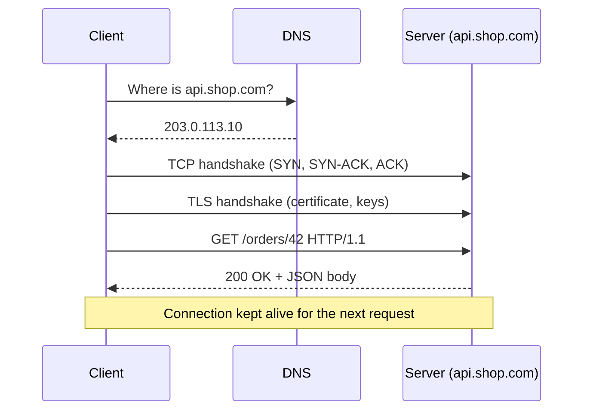
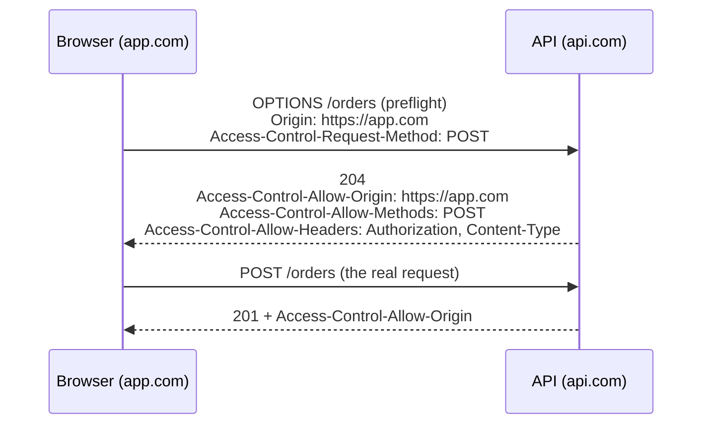

# HTTP & Web Foundations

REST, GraphQL, SOAP, Webhooks and gRPC all ride on HTTP, and WebSockets begin as an HTTP request. If you understand HTTP well, every API style becomes a small variation. If you do not, every style feels like magic.

## 1. What Happens When a Client Calls an API



Latency is the sum of these steps. DNS + TCP + TLS cost **several round trips before the first byte of your request is sent**. That single fact explains:

*   why **connection reuse** (keep-alive, connection pools) matters so much,
*   why **HTTP/2** multiplexes many requests over one connection,
*   why **WebSockets** and **gRPC** keep connections open for a long time.

## 2. Anatomy of an HTTP Message

### Request

```http
POST /v1/orders HTTP/1.1
Host: api.shop.com
Authorization: Bearer eyJhbGciOi...
Content-Type: application/json
Accept: application/json
Idempotency-Key: 7c9e6679-7425-40de-944b-e07fc1f90ae7
Content-Length: 47

{"customer_id": 12, "items": [{"sku": "A1", "qty": 2}]}
```

| Part | Example | Purpose |
| :--- | :--- | :--- |
| **Request line** | `POST /v1/orders HTTP/1.1` | Method + target + version |
| **Headers** | `Authorization`, `Content-Type` | Metadata about the request and the body |
| **Blank line** | | Separates headers from body |
| **Body** | JSON | The payload (optional; `GET` usually has none) |

### Response

```http
HTTP/1.1 201 Created
Content-Type: application/json
Location: /v1/orders/981
ETag: "a1b2c3"
Content-Length: 58

{"id": 981, "status": "pending", "total": 39.98}
```

The **status line** carries the outcome (`201 Created`). `Location` tells the client where the new resource lives.

## 3. Methods: Meaning, Safety, Idempotency

Two properties matter and are constantly confused.

*   **Safe** - the request does not change server state (read-only).
*   **Idempotent** - sending it N times leaves the server in the same state as sending it once.

| Method | Typical meaning | Safe | Idempotent | Has body |
| :--- | :--- | :---: | :---: | :---: |
| `GET` | Read a resource | Yes | Yes | No |
| `HEAD` | Like GET, headers only | Yes | Yes | No |
| `OPTIONS` | What can I do here? (CORS preflight) | Yes | Yes | No |
| `POST` | Create, or run an action | No | **No** | Yes |
| `PUT` | Replace the whole resource | No | Yes | Yes |
| `PATCH` | Change part of a resource | No | Not guaranteed | Yes |
| `DELETE` | Remove a resource | No | Yes | Rarely |

> **Example:** `PUT /users/7 {"name":"Ana"}` five times still leaves user 7 named "Ana": idempotent. `POST /orders` five times creates five orders: not idempotent. That is why payment APIs add an `Idempotency-Key` header (see `03_cross_cutting_concerns.md`).

> ⚠️ **Idempotent does not mean "same response".** A second `DELETE /users/7` returns `404` instead of `204`, but the server state (user 7 is gone) is unchanged, so it is still idempotent.

## 4. Status Codes You Must Know

Group by the first digit.

| Class | Meaning | Codes worth memorising |
| :--- | :--- | :--- |
| **1xx** | Informational | `101 Switching Protocols` (WebSocket upgrade) |
| **2xx** | Success | `200 OK`, `201 Created`, `202 Accepted` (queued, not done), `204 No Content` |
| **3xx** | Redirect / cache | `301` permanent, `302/307` temporary, `304 Not Modified` |
| **4xx** | **Client** made a mistake | `400` malformed, `401` unauthenticated, `403` forbidden, `404` not found, `405` wrong method, `409` conflict, `410` gone, `412` precondition failed, `415` unsupported media type, `422` validation failed, `429` too many requests |
| **5xx** | **Server** failed | `500` bug, `502` bad upstream reply, `503` overloaded/maintenance, `504` upstream timed out |

The distinctions that interviewers probe:

*   **401 vs 403.** `401` = "I don't know who you are" (missing or bad credentials). `403` = "I know who you are, and you may not do this".
*   **400 vs 422.** `400` = the request could not be parsed. `422` = parsed fine, but the values break business rules (e.g. `age: -3`).
*   **502 vs 503 vs 504.** `502` upstream returned garbage, `503` service is unavailable (send `Retry-After`), `504` upstream did not answer in time.
*   **202 Accepted** is the honest answer for long jobs: "received, will process". Return a status URL the client can poll.
*   **Retry rule of thumb:** retry `429`, `502`, `503`, `504` and network errors (with backoff). **Never** blindly retry other `4xx`; the same request will fail the same way.

## 5. Headers That Matter

| Header | Direction | What it does |
| :--- | :--- | :--- |
| `Content-Type` | both | Format of the body being sent (`application/json`, `text/xml`, `application/grpc`) |
| `Accept` | request | Formats the client can read (content negotiation) |
| `Authorization` | request | Credentials: `Bearer <token>`, `Basic <base64>` |
| `Cache-Control` | response | `max-age=60`, `no-store`, `private`, `public` |
| `ETag` / `If-None-Match` | response / request | Cache validation: "give me the body only if it changed" |
| `If-Match` | request | Optimistic concurrency: "update only if version still matches" |
| `Location` | response | URL of a created or moved resource |
| `Retry-After` | response | Seconds to wait after `429` / `503` |
| `Origin` / `Access-Control-*` | both | CORS (see section 9) |
| `Upgrade` / `Connection` | request | Ask to switch protocol (WebSocket) |
| `X-Request-Id` / `traceparent` | both | Correlate a request across services in logs and traces |

### Conditional requests (saves bandwidth, prevents lost updates)

```http
GET /articles/5 HTTP/1.1
If-None-Match: "v7"

HTTP/1.1 304 Not Modified          <- no body sent, client reuses its cached copy
```

```http
PUT /articles/5 HTTP/1.1
If-Match: "v7"                     <- someone else already saved v8

HTTP/1.1 412 Precondition Failed   <- your edit would overwrite theirs
```

## 6. Content Negotiation and Serialization

The client says what it accepts, the server picks:

```http
Accept: application/json, application/xml;q=0.5
```

| Format | Media type | Strength | Weakness |
| :--- | :--- | :--- | :--- |
| JSON | `application/json` | Universal, readable | Verbose, no binary type, no built-in schema |
| XML | `text/xml`, `application/soap+xml` | Schemas, namespaces, signatures | Very verbose |
| Protobuf | `application/x-protobuf`, `application/grpc` | Tiny and fast | Not human-readable, needs the schema |
| Form / multipart | `application/x-www-form-urlencoded`, `multipart/form-data` | Browser forms, file uploads | Flat data only |

## 7. Connections: HTTP/1.1 vs HTTP/2 vs HTTP/3

| | HTTP/1.1 | HTTP/2 | HTTP/3 |
| :--- | :--- | :--- | :--- |
| **Format** | Text | Binary frames | Binary frames |
| **Requests per connection** | One at a time (head-of-line blocking) | Many in parallel (multiplexed streams) | Many in parallel |
| **Header compression** | None | HPACK | QPACK |
| **Transport** | TCP | TCP | QUIC (over UDP) |
| **Server push / streaming** | No | Streams (gRPC builds on this) | Streams |

Why you care: **gRPC requires HTTP/2** for its streaming and multiplexing. **REST works on all three**, and browsers upgrade transparently.

## 8. TLS and HTTPS

*   **TLS** encrypts the connection and proves the server's identity through a certificate.
*   **mTLS** (mutual TLS): the *client* also presents a certificate. Common between internal microservices (see `gRPC/mtls/`).
*   Terminate TLS at the load balancer or gateway, or all the way to the service, depending on your threat model.
*   Never send credentials over plain HTTP. Webhook receivers and WebSocket endpoints (`wss://`) must use TLS too.

## 9. CORS: The Browser Rule That Confuses Everyone

The browser's **same-origin policy** blocks JavaScript on `https://app.com` from reading responses from `https://api.com`, unless the API opts in with CORS headers.



*   CORS is enforced **by browsers only**. `curl`, mobile apps, and server-to-server calls (Webhooks, gRPC) ignore it.
*   Do not answer `Access-Control-Allow-Origin: *` on an API that uses cookies. List exact origins.
*   A "CORS error" almost always means the *server* is missing headers, not that the client code is wrong.

<div class="lab" data-viz="flow-cors"></div>

## 10. Cookies vs Tokens

| | Session cookie | Bearer token (JWT / opaque) |
| :--- | :--- | :--- |
| **Stored in** | Browser cookie jar | App memory / secure storage |
| **Sent** | Automatically by the browser | Explicitly in `Authorization` |
| **CSRF risk** | Yes (needs SameSite / CSRF token) | No (not sent automatically) |
| **Fits** | Server-rendered web apps | Mobile apps, SPAs, service-to-service APIs |
| **Stateless server** | No (session store) | Yes (JWT) or lookup (opaque) |

## 11. Try It Yourself

```bash
# 1. See a full request/response exchange, including headers
curl -v https://httpbin.org/get

# 2. Send JSON with a POST
curl -X POST https://httpbin.org/post \
     -H "Content-Type: application/json" \
     -d '{"name": "Ana"}'

# 3. Watch conditional requests work (server must support ETag)
curl -i https://api.github.com/zen
curl -i -H 'If-None-Match: "abc"' https://api.github.com/zen

# 4. Force HTTP/2 and read the negotiated version
curl -sI --http2 https://www.google.com | head -1

# 5. Inspect the TLS certificate
curl -vI https://www.google.com 2>&1 | grep -E "subject|issuer|expire"
```

A tiny server that shows what the client actually sends (Python standard library only):

```python
from http.server import BaseHTTPRequestHandler, HTTPServer

class Echo(BaseHTTPRequestHandler):
    def do_POST(self):
        body = self.rfile.read(int(self.headers.get("Content-Length", 0)))
        print(self.requestline)
        for k, v in self.headers.items():
            print(f"  {k}: {v}")
        print("  BODY:", body.decode())
        self.send_response(200)
        self.end_headers()

HTTPServer(("127.0.0.1", 8080), Echo).serve_forever()
```

Point `curl -X POST localhost:8080 -d '{"a":1}'` at it and study the output. Go equivalent:

```go
package main

import (
	"fmt"
	"io"
	"log"
	"net/http"
)

func main() {
	http.HandleFunc("/", func(w http.ResponseWriter, r *http.Request) {
		body, _ := io.ReadAll(r.Body)
		fmt.Println(r.Method, r.URL.Path, r.Proto)
		for k, v := range r.Header {
			fmt.Printf("  %s: %v\n", k, v)
		}
		fmt.Println("  BODY:", string(body))
	})
	log.Fatal(http.ListenAndServe("127.0.0.1:8080", nil))
}
```

## 12. Check Yourself

> ❓ **Question 1:** A client sends `PUT /users/7` twice with the same body. The first returns `200`, the second `200`. A client sends `POST /users` twice. What differs, and why does it matter for retries?
>
> ❓ **Question 2:** Your API returns `403` when the token has expired. What should it return instead, and how does that change client behaviour?
>
> ❓ **Question 3:** Why does a browser send an `OPTIONS` request before your `POST`, and why do `curl` and a Go client never do that?
>
> ❓ **Question 4:** Why can gRPC not run on HTTP/1.1?

**Answers**

1.  `PUT` is idempotent (same final state), so a client can retry safely after a timeout. `POST` created two records; a retry after an unknown outcome may duplicate the work. Fix with an idempotency key.
2.  `401 Unauthorized` with a `WWW-Authenticate` header. A client seeing `401` knows to refresh its token and retry; `403` tells it retrying is pointless.
3.  CORS preflight is a browser-only safety check for non-simple cross-origin requests. Non-browser clients do not enforce the same-origin policy.
4.  gRPC needs multiplexed bidirectional streams and trailers (used to carry the final status). HTTP/1.1 offers neither.
