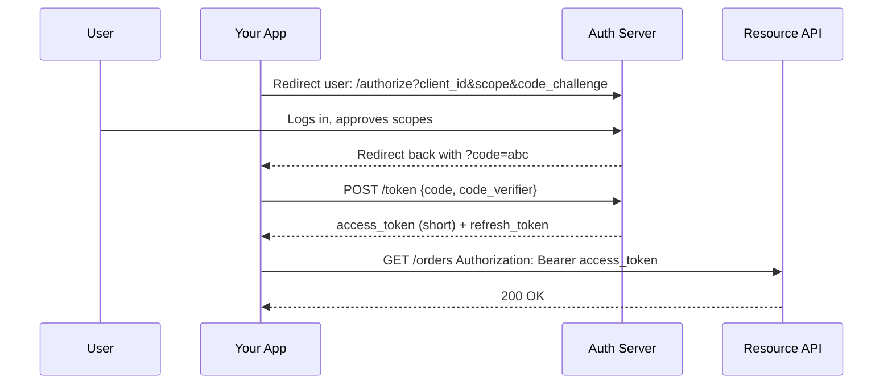
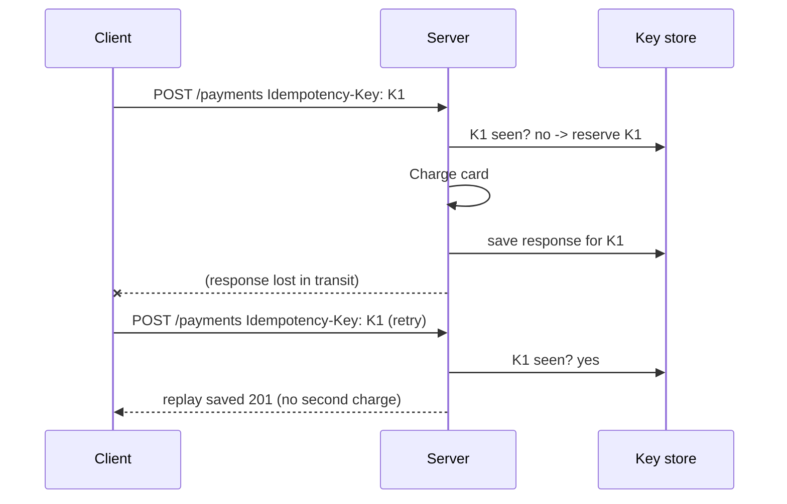

# Cross-Cutting Concerns

Whether you build REST, GraphQL, gRPC or Webhooks, you will hit the same production problems. This guide is the shared toolbox. Each protocol guide links back here.

## 1. Authentication: "Who Are You?"

| Method | How it works | Use when | Watch out |
| :--- | :--- | :--- | :--- |
| **<abbr title="Application Programming Interface">API</abbr> key** | Static secret in a header (`X-API-Key`) | Server-to-server, simple public APIs | Identifies an *app*, not a user. Rotate, never put in URLs or front-end code. |
| **HTTP Basic** | `Authorization: Basic base64(user:pass)` | Internal tools, legacy | Base64 is **not** encryption. HTTPS mandatory. |
| **Bearer token (JWT)** | Signed token, verified locally | Stateless microservices, mobile apps | Cannot be revoked before expiry unless you keep a denylist. Keep it short-lived. |
| **Opaque token** | Random string, looked up server-side | Need instant revocation | Every request costs a lookup (cache it). |
| **OAuth 2.0** | Delegated access: user grants an app limited scopes | "Sign in with Google", third-party apps | Complex. Use a library and the PKCE flow for public clients. |
| **mTLS** | Both sides present certificates | Service-to-service in a zero-trust network | Certificate rotation is an operational task. |
| **HMAC signature** | Sender signs the body with a shared secret | Webhooks, AWS-style request signing | Sign the *raw bytes*, include a timestamp. |

### Anatomy of a JWT

```
eyJhbGciOiJIUzI1NiJ9 . eyJzdWIiOiI0MiIsInNjb3BlIjoib3JkZXJzOnJlYWQiLCJleHAiOjE3MDAwMDAwMDB9 . <signature>
      header                                   payload (claims)                                      HMAC/RSA
```

```json
{ "sub": "42", "scope": "orders:read", "exp": 1700000000, "iss": "https://auth.shop.com" }
```

A JWT is **signed, not encrypted**: anyone can read the payload. Never store secrets in it. A server must check the signature, `exp`, `iss` and `aud`, and must reject `alg: none`.

### OAuth 2.0 authorization code + PKCE in one picture



The **`code_challenge` / `code_verifier`** pair (PKCE) stops a stolen authorization code from being redeemed by an attacker.

<div class="lab" data-viz="flow-oauth-pkce"></div>

## 2. Authorization: "What May You Do?"

*   **Scopes** (`orders:read`, `orders:write`): coarse permissions carried in the token.
*   **RBAC** (role-based): user has role `admin`, role has permissions.
*   **ABAC / ownership**: "may this user edit *this* order?" needs the resource loaded. **Check ownership on every object access.**

> ⚠️ **The most common <abbr title="Application Programming Interface">API</abbr> vulnerability is BOLA** (Broken Object Level Authorization, OWASP <abbr title="Application Programming Interface">API</abbr> #1): `GET /orders/1001` works for *any* logged-in user because the code checked "is logged in" but not "does order 1001 belong to me?". Sequential IDs make it trivial to exploit; authorise every lookup.

Rule for status codes: unauthenticated -> `401`; authenticated but not allowed -> `403` (or `404` to avoid revealing the resource exists).

## 3. Versioning: Changing Without Breaking

| Strategy | Example | Notes |
| :--- | :--- | :--- |
| **URL path** | `/v1/orders` | Most common, easiest to route and cache |
| **Header** | `Accept: application/vnd.shop.v2+json` | Clean URLs, harder to test in a browser |
| **Query param** | `/orders?version=2` | Simple, easy to forget |
| **No versions (evolve)** | GraphQL `@deprecated`, Protobuf field numbers | Additive change only |

**Backward-compatible (no new version needed):** adding an optional field, adding a new endpoint, adding an enum value clients were told to ignore.

**Breaking (needs a new version):** removing or renaming a field, changing a type, making an optional field required, changing meaning.

> **Tip:** Publish a deprecation timeline, send `Deprecation` and `Sunset` response headers, and log which clients still call the old version before you turn it off.

## 4. Errors: A Consistent Shape

Pick one error format and use it everywhere. The standard is **RFC 9457 "Problem Details"**:

```http
HTTP/1.1 422 Unprocessable Content
Content-Type: application/problem+json

{
  "type": "https://api.shop.com/errors/validation",
  "title": "Validation failed",
  "status": 422,
  "detail": "quantity must be at least 1",
  "instance": "/v1/orders",
  "errors": [{ "field": "items[0].qty", "message": "must be >= 1" }],
  "request_id": "req_8f2a"
}
```

Good error design:

*   A **machine-readable code** (`type`) so clients can branch, and a **human message** for developers.
*   **Never leak internals** (stack traces, SQL, hostnames).
*   Include a **request id** the user can quote to support.
*   Tell clients whether it is **retryable** (`429`, `503` + `Retry-After`).

How each style reports errors:

| Style | Success | Error |
| :--- | :--- | :--- |
| REST | `2xx` | `4xx` / `5xx` + problem JSON |
| GraphQL | `200` + `data` | `200` + `errors[]` (transport ok, field failed) |
| gRPC | status `OK` (0) | status code 1-16 + message in trailers |
| SOAP | `200` + Body | `500` + `<soap:Fault>` |
| Webhooks | receiver returns `2xx` | receiver returns non-`2xx` -> sender retries |

## 5. Idempotency: Making Retries Safe

The network can fail *after* the server did the work. The client cannot tell "never arrived" from "processed but the reply was lost". Retrying a non-idempotent `POST` may charge a card twice.

**Solution: idempotency keys.** The client generates a unique key per logical operation and sends it on every retry. The server stores the result under that key and replays it.



```python
import threading

_store: dict[str, dict] = {}     # production: Redis SET NX / a DB unique index
_lock = threading.Lock()

def create_payment(idempotency_key: str, amount: int) -> dict:
    with _lock:
        if idempotency_key in _store:
            return _store[idempotency_key]        # replay the original result
        result = {"payment_id": f"pay_{len(_store) + 1}", "amount": amount}
        _store[idempotency_key] = result
        return result

a = create_payment("K1", 500)
b = create_payment("K1", 500)   # retry
assert a == b and len(_store) == 1
```

Rules: keys expire (24h is typical); the same key with a *different* body is an error (`422`/`409`); a request still in flight for that key returns `409`.

The same idea protects **Webhook receivers** (dedupe on event id) and **message consumers**.

## 6. Rate Limiting and Quotas

Protects your service from abuse and one noisy client from starving the others.

| Algorithm | Behaviour | Trade-off |
| :--- | :--- | :--- |
| **Fixed window** | N requests per calendar minute | Cheap; allows a 2x burst at the window edge |
| **Sliding window** | N requests in any trailing 60 s | Smoother; more memory |
| **Token bucket** | Tokens refill at a steady rate, bursts spend saved tokens | The usual choice; allows controlled bursts |
| **Leaky bucket** | Requests drain at a constant rate | Smooth output, queues bursts |
| **Concurrency limit** | At most N in flight | Protects slow endpoints |

```python
import time

class TokenBucket:
    """Allow `rate` requests/second on average, with bursts up to `capacity`."""
    def __init__(self, rate: float, capacity: int):
        self.rate, self.capacity = rate, capacity
        self.tokens, self.updated = float(capacity), time.monotonic()

    def allow(self, cost: int = 1) -> bool:
        now = time.monotonic()
        self.tokens = min(self.capacity, self.tokens + (now - self.updated) * self.rate)
        self.updated = now
        if self.tokens >= cost:
            self.tokens -= cost
            return True
        return False

bucket = TokenBucket(rate=5, capacity=10)
print(sum(bucket.allow() for _ in range(15)))   # 10: the burst is allowed, the other 5 are rejected
```

Tell the client what is happening:

```http
HTTP/1.1 429 Too Many Requests
Retry-After: 12
RateLimit-Limit: 100
RateLimit-Remaining: 0
RateLimit-Reset: 12
```

Count per **<abbr title="Application Programming Interface">API</abbr> key / user / IP**, not globally. In a multi-server deployment keep counters in a shared store (Redis, with atomic `INCR` or a Lua script), or enforce the limit at the <abbr title="Application Programming Interface">API</abbr> gateway. Runnable versions: `REST/labs/golang/04_rate_limit_middleware` (per-client token bucket as `net/http` middleware with an injectable clock, `429` + `Retry-After`, and a measured comparison with a fixed window) and `gRPC/labs/python/03_interceptors_auth_logging_ratelimit.py` (a per-client bucket as a gRPC interceptor).

For GraphQL, count **query cost**, not requests. For gRPC and WebSockets, limit **messages per second per connection**.

## 7. Timeouts, Retries and Backoff

Every remote call needs three settings: a **timeout**, a **retry policy**, and a **circuit breaker**.

```python
import random, time

def call_with_retries(fn, attempts=5, base=0.1, cap=10.0):
    for attempt in range(attempts):
        try:
            return fn()
        except (TimeoutError, ConnectionError):
            if attempt == attempts - 1:
                raise
            # exponential backoff with FULL JITTER
            time.sleep(random.uniform(0, min(cap, base * 2 ** attempt)))
```

*   **Exponential backoff** (0.1s, 0.2s, 0.4s, ...) gives a struggling server room to recover.
*   **Jitter** (randomness) stops thousands of clients retrying in lockstep (the "thundering herd").
*   Retry **only idempotent** calls, or calls carrying an idempotency key.
*   Retry only **transient** failures: network errors, `429`, `502`, `503`, `504`. Honour `Retry-After`.
*   **Circuit breaker:** after N consecutive failures, stop calling for a cool-down period and fail fast instead of piling on.
*   **Deadline propagation:** if the user waits 2 s in total, downstream calls must share that budget (gRPC does this natively).

## 8. Pagination and Filtering

Never return an unbounded collection.

| Style | Request | Pros | Cons |
| :--- | :--- | :--- | :--- |
| **Offset** | `?limit=20&offset=40` | Simple, allows jumping to page N | Slow on big tables (`OFFSET 1000000`), rows shift when data changes |
| **Page number** | `?page=3&per_page=20` | Familiar | Same as offset |
| **Cursor / keyset** | `?limit=20&after=eyJpZCI6NDJ9` | Stable, fast at any depth | No jumping to an arbitrary page |

Keyset in SQL: `WHERE id > :last_id ORDER BY id LIMIT 20`. The cursor is just the last seen key, usually base64 encoded so clients treat it as opaque.

```json
{
  "data": [ ... 20 items ... ],
  "next_cursor": "eyJpZCI6NDJ9",
  "has_more": true
}
```

GraphQL standardises this as **Relay connections** (`edges`, `node`, `pageInfo { endCursor hasNextPage }`).

## 9. Caching

| Layer | Mechanism | Typical use |
| :--- | :--- | :--- |
| **Browser / client** | `Cache-Control: max-age=60` | Static or slow-changing reads |
| **CDN / reverse proxy** | `Cache-Control: public, s-maxage=300` | Public GET endpoints |
| **Validation** | `ETag` + `If-None-Match` -> `304` | Save bandwidth when data may not have changed |
| **Application** | Redis / in-process | Expensive queries, computed results |

*   Only `GET` (and `HEAD`) responses are cached by HTTP infrastructure. This is REST's big advantage over GraphQL (single `POST` endpoint) and gRPC.
*   Use `Cache-Control: private` for per-user data and `no-store` for sensitive data.
*   Cache invalidation is the hard part: prefer short TTLs plus `ETag` validation before building clever invalidation.

## 10. Contracts and Documentation

| Style | Contract format | Generates |
| :--- | :--- | :--- |
| REST | **OpenAPI** (YAML/JSON) | Docs (Swagger UI), client SDKs, mock servers, validators |
| GraphQL | **SDL** + introspection | GraphiQL explorer, typed clients |
| gRPC / Protobuf | **`.proto`** | Client and server stubs in 10+ languages |
| SOAP | **WSDL + XSD** | Client proxies |
| Async / events | **AsyncAPI**, JSON Schema | Docs and validators for WebSockets / Webhooks |

A contract-first workflow (write the contract, generate code, test against it) catches breaking changes in CI. For Protobuf use `buf breaking`; for OpenAPI use a diff tool such as `oasdiff`.

## 11. Observability

*   **Structured logs**: one JSON line per request with `request_id`, `method`, `path`, `status`, `duration_ms`, `user_id`.
*   **Metrics (RED)**: **R**ate, **E**rrors, **D**uration (p50 / p95 / p99). Alert on percentiles, not averages.
*   **Distributed tracing**: propagate the W3C `traceparent` header (`00-<trace-id>-<span-id>-01`) through every hop so you can see one request across ten services.
*   **Health endpoints**: `/healthz` (process alive) and `/readyz` (dependencies ready) for orchestrators. gRPC has a standard health-checking protocol.

## 12. Security Checklist

*   TLS everywhere; HSTS on browser-facing hosts.
*   Validate **every** input: types, ranges, lengths, enum membership. Reject unknown fields if the contract is strict.
*   Limit body sizes and depths (`http.MaxBytesReader` in Go).
*   Authorise per object (BOLA), per property (mass assignment: do not bind request JSON straight onto a database model), per function (admin endpoints).
*   Never accept credentials in query strings; URLs end up in logs.
*   Prevent SSRF when your server fetches user-supplied URLs (Webhook senders!): block private and link-local addresses.
*   Return generic auth failures ("invalid credentials") and rate-limit login endpoints.
*   Keep an **inventory** of every endpoint, including old versions. Forgotten `v1` routes are a favourite attack surface.

## 13. Check Yourself

> ❓ **Question 1:** A mobile client times out on `POST /payments` and retries. What must the server do to avoid a double charge?
>
> ❓ **Question 2:** Why is exponential backoff without jitter still dangerous at scale?
>
> ❓ **Question 3:** Your JWT lifetime is 24 hours and a user reports their laptop was stolen. What are your options to cut off access now?
>
> ❓ **Question 4:** Offset pagination is returning duplicate rows on page 2 while data is being inserted. Why, and what is the fix?

**Answers**

1.  Require an `Idempotency-Key`, store the outcome, and replay the stored response on the retry.
2.  All clients that failed together retry together on the same schedule (1 s, 2 s, 4 s), hitting the recovering server in synchronised waves. Jitter spreads them out.
3.  Keep a denylist of token ids (`jti`) checked on each request, revoke the refresh token so it cannot be renewed, and use short-lived access tokens (5-15 minutes) so the window is small by design.
4.  New rows inserted before the offset shift existing rows down, so the last row of page 1 reappears at the top of page 2. Use cursor (keyset) pagination.

## 14. Where Each Idea Is Practised

| Concern | Labs |
| :--- | :--- |
| JWT, scopes, BOLA | `REST/labs/python/03_jwt_auth_and_scopes.py` |
| <abbr title="Application Programming Interface">API</abbr> keys: hashing, constant-time compare, ownership | `REST/labs/golang/05_api_key_auth_and_ownership` |
| Auth in GraphQL (context, field- and object-level) | `GraphQL/labs/python/04_auth_permissions_and_masking.py` |
| mTLS service identity | `gRPC/labs/golang/04_mtls_service_identity` |
| WebSocket auth: Origin, first message, one-time tickets | `WebSockets/labs/python/03_auth_origin_and_limits.py`, `WebSockets/labs/golang/05_scaling_pubsub_and_tickets` |
| WS-Security UsernameToken | `SOAP/labs/python/04_ws_security_username_token.py`, `SOAP/labs/golang/04_ws_security_username_token` |
| HMAC signatures, replay protection, rotation | `Webhooks/labs/python/05_standard_webhooks_replay_and_rotation.py`, `Webhooks/labs/golang/02_provider_signature_schemes` |
| Idempotency keys | `REST/labs/python/05_idempotency_and_cursor_pagination.py`, `Webhooks/labs/python/04_idempotent_async_receiver.py` |
| Rate limiting | `REST/labs/golang/04_rate_limit_middleware`, `WebSockets/labs/python/04_heartbeat_backpressure_rate_limit.py` |
| Retries, backoff, jitter, circuit breaker | `Webhooks/labs/python/03_retries_backoff_dead_letter.py`, `Webhooks/labs/golang/05_subscriptions_breaker_and_replay`, `SOAP/labs/golang/03_client_timeouts_faults_retries`, `gRPC/labs/python/04_deadlines_retries_cascading.py` |
| Pagination | `REST/labs/python/05_idempotency_and_cursor_pagination.py`, `GraphQL/labs/golang/04_relay_pagination` |
| Caching and optimistic concurrency (ETag) | `REST/labs/python/04_etag_conditional_requests.py` |
| Errors as problem+json | `REST/labs/golang/02_json_crud_validation`, `SOAP/labs/golang/05_wsdl_driven_json_gateway` |
| Timeouts, deadlines, graceful shutdown | `REST/labs/golang/03_middleware_and_graceful_shutdown`, `gRPC/labs/golang/05_health_reflection_graceful_shutdown` |
| SSRF | `Webhooks/labs/golang/04_ssrf_safe_sender` |
| Query cost and depth limits | `GraphQL/labs/golang/05_depth_cost_limits_persisted_queries` |
