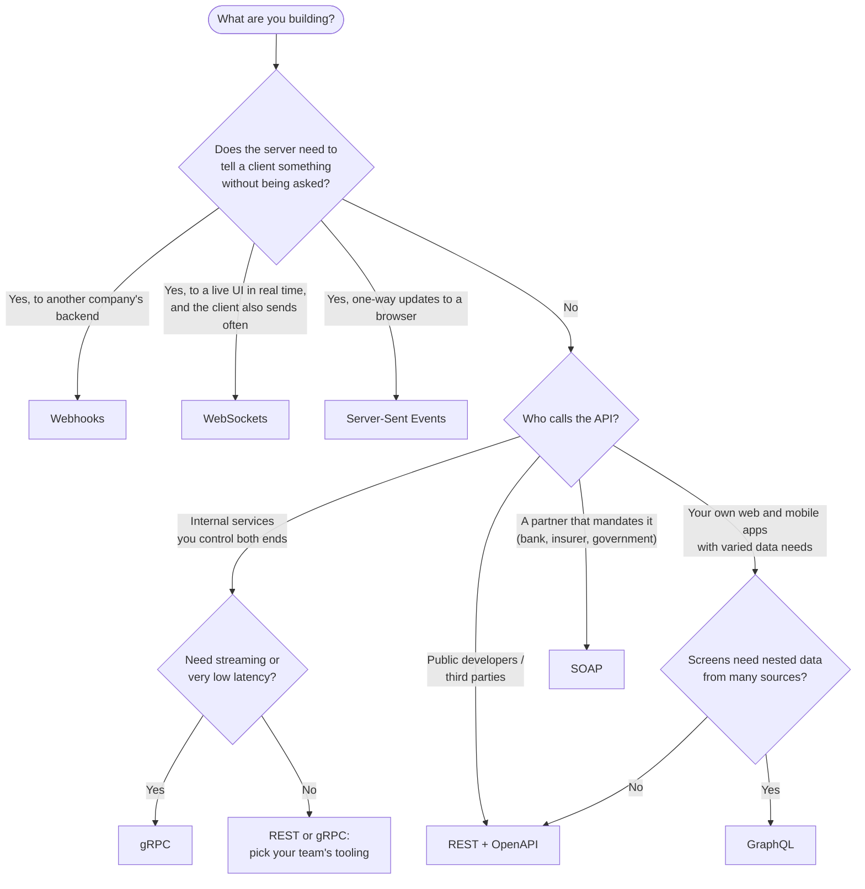
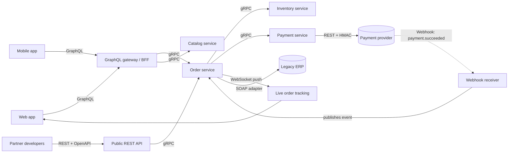

# Choosing the Right API Style

There is no best API style, only a best fit. This guide gives you the comparison, a decision procedure, a realistic system that uses several styles at once, and practice questions.

## 1. The Big Comparison

| Dimension | REST | GraphQL | gRPC | WebSockets | Webhooks | SOAP |
| :--- | :--- | :--- | :--- | :--- | :--- | :--- |
| **Model** | Resources + verbs | Query a graph | Call a remote function | Persistent message channel | Server calls *your* URL | Call an operation with XML |
| **Who initiates** | Client | Client | Client (both when streaming) | Either side | Server | Client |
| **Payload** | JSON | JSON | Protobuf | Text / binary | JSON | XML |
| **Payload size** | Medium | Exactly what you ask | Smallest | Your choice | Small | Largest |
| **Latency per call** | Medium | Medium | Lowest | Lowest (no per-message handshake) | Async | Highest |
| **Streaming** | No (SSE aside) | Subscriptions | Native, 3 kinds | Native | No | No |
| **Strong typing** | Optional (OpenAPI) | Yes (schema) | Yes (`.proto`) | No | No | Yes (WSDL/XSD) |
| **HTTP caching** | Excellent | Poor | None | None | n/a | None |
| **Browser support** | Native | Native | gRPC-Web + proxy | Native | n/a | Poor |
| **Learning curve** | Low | Medium | Medium | Medium | Low | High |
| **Tooling maturity** | Huge | Large | Large | Medium | Growing | Large but legacy |
| **Scaling difficulty** | Easy (stateless) | Medium (query cost) | Medium (long-lived HTTP/2 LB) | **Hard (stateful)** | Medium (retries, queues) | Medium |
| **Best fit** | Public APIs, CRUD | Many client types, nested data | Internal microservices | Chat, live dashboards, games | Payment / CI / SaaS events | Banks, insurers, ERP |

## 2. Decision Tree

### Rules of thumb

*   **Default to REST.** It is the cheapest to build, cache, debug and hand to a stranger.
*   **Add gRPC** between your own backend services when you need typed contracts, speed, or streaming.
*   **Add GraphQL** as a client-facing layer (a "backend for frontend") when several clients need different slices of the same data.
*   **Add WebSockets** only when you truly need low-latency, two-way, continuous messages. Polling every few seconds is often good enough and far easier to scale.
*   **Add Webhooks** whenever another system must learn about your events. Offer polling as a fallback for reconciliation.
*   **Use SOAP** only because someone else requires it. Wrap it behind an adapter so the rest of your system never sees XML.

> 🎯 **Interview angle:** Interviewers rarely want "X is better than Y". They want to hear the *dimensions* you weigh (who the clients are, latency needs, payload shape, team skills, caching, evolution) and a justified choice under stated assumptions.

## 3. One System, Many Styles: An E-Commerce Platform

Real systems combine styles. Each arrow below is chosen for a reason.

| Link | Style | Why |
| :--- | :--- | :--- |
| Web / mobile -> gateway | **GraphQL** | One request returns the product, reviews, stock and recommendations each screen needs. |
| Partners -> public API | **REST** | Universal, cacheable, documented with OpenAPI, easy to try with `curl`. |
| Service -> service | **gRPC** | Typed contracts, small binary payloads, deadlines that propagate, streaming. |
| Payment provider -> you | **Webhook** | The bank confirms asynchronously, minutes after the request. Polling would be wasteful. |
| Order status -> browser | **WebSocket** | "Your parcel is out for delivery" appears instantly. |
| You -> legacy ERP | **SOAP** | The ERP only speaks SOAP; an adapter isolates it. |

Walk through one order:

1.  The web app sends a GraphQL `mutation placeOrder`. The gateway calls `Order.Create` over **gRPC**.
2.  The Order service calls `Inventory.Reserve` (gRPC) and `Payment.Charge` (gRPC) with a **deadline** and an **idempotency key**.
3.  The Payment service calls the provider's **REST** API. The response is `processing`.
4.  Minutes later the provider sends a **webhook**. The receiver verifies the signature, dedupes on the event id, and emits an internal event.
5.  The Order service marks the order paid, calls the ERP through a **SOAP** adapter, and pushes the new state over a **WebSocket** to the customer's open tab.

## 4. Migration Paths

| From -> To | Approach |
| :--- | :--- |
| REST -> GraphQL | Put a GraphQL gateway in front. Resolvers call the existing REST endpoints. Migrate clients screen by screen. |
| REST -> gRPC (internal) | Define `.proto`, run both. Expose gRPC-Gateway / Connect to keep the REST facade for outside users. |
| Polling -> WebSockets | Add a push channel for the hot path; keep the REST endpoint as fallback and for reconnect sync. |
| Polling -> Webhooks | Offer webhook registration; keep a `GET /events` endpoint for reconciliation. |
| SOAP -> REST | Build a facade with the same business logic. Run in parallel. Retire SOAP when partners have moved. |

## 5. Common Mistakes

1.  **GraphQL everywhere.** GraphQL between two backend services adds a query engine you do not need. Use gRPC or REST.
2.  **WebSockets for request/response.** If every message expects a reply, you rebuilt HTTP without caching or status codes.
3.  **gRPC to the browser without a plan.** Browsers cannot speak native gRPC; you need gRPC-Web with a proxy or Connect.
4.  **Webhooks without retries or dedupe on the receiver.** Delivery is at-least-once; you *will* get duplicates.
5.  **REST with verbs in URLs** (`/getUser`, `/createOrder`). Use nouns and HTTP methods, or admit you want RPC and pick gRPC.
6.  **Ignoring versioning until the first breaking change.**
7.  **Exposing the database schema as the API.** The API is a product with its own lifecycle.

## 6. Practice Interview Questions

> ❓ **Q1. Design the API for a food-delivery app: customers browse restaurants, place orders, and watch the courier on a map.**
>
> ❓ **Q2. Your public REST API returns a 40-field user object and the mobile app needs 3 fields. What are your options?**
>
> ❓ **Q3. You are migrating 30 internal REST services to gRPC. What can go wrong?**
>
> ❓ **Q4. A partner says they will only integrate with SOAP. How do you protect the rest of your architecture?**
>
> ❓ **Q5. Your chat service has 200k WebSocket connections and you need to deploy a new version. How?**

**Sketch answers**

1.  Browse and search: **REST** (cacheable, CDN friendly). Place order: `POST /orders` with an `Idempotency-Key`. Courier location: **WebSocket** (or SSE) pushing `{lat, lng}` every few seconds to the customer, fed by a pub/sub topic per order. Payment confirmation: **webhook** from the payment provider.
2.  Sparse fieldsets (`?fields=id,name,avatar`), a dedicated lightweight endpoint or a mobile BFF, or GraphQL if this problem is widespread across many screens. Weigh the caching loss of GraphQL against the cost of maintaining many bespoke endpoints.
3.  Load balancing (HTTP/2 connections are long-lived, so an L4 balancer pins all traffic to one backend; use L7 or client-side balancing), debugging (binary payloads, need `grpcurl` and reflection), browser clients, contract governance (`buf breaking` in CI), retries and deadlines needing explicit configuration, and mixed-version rollout order.
4.  Build an **anti-corruption adapter**: a small service that owns the WSDL client, translates to your internal model, and exposes it as REST/gRPC. Keep XML, WS-Security and SOAP faults inside it. Add timeouts and a circuit breaker because SOAP backends are often slow.
5.  Graceful shutdown: stop accepting new connections, send a close frame (`1001 Going Away`) or an application-level "reconnect" message, and let clients reconnect with **jittered backoff** to the new pods. Spread the drain over minutes so 200k reconnects do not arrive in one second. Clients must resume from the last message id they saw.

## 7. Capstone Project

Build a **mini order platform** that uses at least four of the six styles. It is the fastest way to make this module stick.

| Step | Deliverable | Style | Skills exercised |
| :---: | :--- | :--- | :--- |
| 1 | `POST /orders`, `GET /orders/{id}`, `GET /orders?cursor=` with validation and proper status codes | REST | resources, status codes, pagination |
| 2 | Add `Idempotency-Key` handling and `ETag` / `If-Match` on updates | REST | idempotency, concurrency |
| 3 | Write `pricing.proto` with `Quote(Cart) returns (Price)` and call it from the order service with a 500 ms deadline | gRPC + Protobuf | contracts, deadlines |
| 4 | A `/graphql` endpoint exposing `order { items { product { name } } customer { name } }` with a DataLoader | GraphQL | resolvers, N+1 |
| 5 | Fake payment provider that POSTs signed `payment.succeeded` events (with retries) to your receiver; receiver verifies HMAC + timestamp and dedupes | Webhooks | signatures, retries, idempotency |
| 6 | A `/ws/orders/{id}` endpoint that pushes status changes; client reconnects with backoff and resumes from last event id | WebSockets | heartbeats, reconnection |
| 7 | Cross-cutting: bearer-token auth, token-bucket rate limit, structured logs with request id, RFC 9457 errors | all | production readiness |

Do it once in Python and once in Go, using the labs listed in `03_cross_cutting_concerns.md` (section 14) as starting points: each concern in the table above has a runnable lab.

## 8. One-Page Cheat Sheet

| If you hear... | Think... |
| :--- | :--- |
| "Public API for third-party developers" | REST + OpenAPI, versioned, rate limited, API keys / OAuth |
| "Mobile app is slow: too many calls / too much data" | GraphQL BFF, or purpose-built endpoints |
| "Microservices talking to each other, latency matters" | gRPC + Protobuf, mTLS, deadlines |
| "Live prices, chat, presence, multiplayer" | WebSockets (+ Redis pub/sub to scale) |
| "Tell me when the payment / build / shipment completes" | Webhooks: HMAC, retries, idempotent receiver |
| "Bank / insurer / government / SAP integration" | SOAP: WSDL first, WS-Security, adapter layer |
| "Binary format, schema evolution" | Protobuf: never reuse or renumber a field |
| "A retry charged the customer twice" | Idempotency key |
| "A million clients retry at once after an outage" | Exponential backoff with jitter, circuit breaker |
