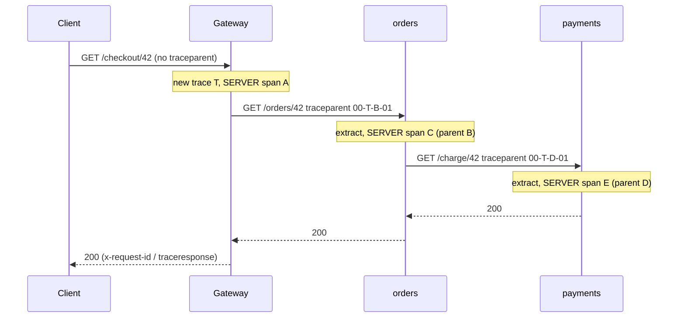

# API Observability Theory

## What is Observability?

**Observability** is how well you can answer new questions about a running system from the data it emits, without shipping new code. For an API the everyday questions are: *Is it up? Is it slow? For whom? Since when? Which dependency is to blame?* **Monitoring** checks the answers you already expected ("CPU > 90%"); observability is what lets you debug the failure nobody predicted.

It exists because a single user request in a modern API touches a gateway, several services, queues and databases. When it is slow, no single service's logs show the whole story. You need data that **follows the request** across every hop, and aggregates that tell you **how often** it happens.

The three signals, and what each is good at:

| Signal | What it is | Answers | Cost driver |
| :--- | :--- | :--- | :--- |
| **Traces** | A tree of timed **spans** for one request, across services | *Where* did the time go / which hop failed, for this request | Number of spans stored (sampling) |
| **Metrics** | Numbers aggregated over time: counters, gauges, histograms | *How often / how slow*, for everyone, cheaply, for alerting | Number of **time series** (label cardinality) |
| **Logs** | Timestamped, structured events | *What exactly happened* inside one step | Bytes ingested |

The signals are most valuable **linked**: a log line carries `trace_id`; a metric exemplar points to a trace; a trace points to the logs of its spans. **OpenTelemetry** (OTel), a CNCF project, is the vendor-neutral standard for producing all three: an API, SDKs per language, semantic conventions (standard attribute names), the OTLP wire protocol and the **Collector**. You instrument once and choose (or switch) the backend later: Jaeger, Grafana Tempo/Loki/Mimir, Prometheus, Honeycomb, Datadog, New Relic and others all accept OTLP.

## The Pipeline

```arch
%% caption: Services emit with the OTel SDK, the Collector batches, samples and routes, and each signal lands in its own backend.
group apps "Instrumented services" color=blue icon=service
node gw "Gateway" at 0,0 in apps icon=gateway
node api "orders" at 1,0 in apps icon=service
node pay "payments" at 2,0 in apps icon=service
node col "OTel Collector" at 1,1 icon=trace sub="batch, tail-sample, redact"
node tr "Trace store" at 0,2 icon=trace sub="Jaeger / Tempo"
node me "Metrics store" at 1,2 icon=metrics sub="Prometheus / Mimir"
node lo "Log store" at 2,2 icon=logs sub="Loki / Elastic"
node dash "Dashboards + alerts" at 1,3 icon=dashboard
gw -> col : "OTLP"
api -> col
pay -> col
col -> tr
col -> me
col -> lo
tr -> dash
me -> dash
lo -> dash
```

*   **SDK in each process**: creates spans and records metrics; batches and exports over OTLP (gRPC or HTTP/protobuf).
*   **Collector** (a separate process, often one per node plus a gateway tier): receives, batches, drops or redacts attributes (PII), does **tail sampling**, converts formats and fans out to backends. Keeping this out of your services means changing vendors is a config change.
*   **Backends** store and query each signal. The labs replace all of this with **in-memory exporters** so they run anywhere and can assert on what was recorded.

## Traces and Spans

A **trace** is identified by a 16-byte `trace_id`. It is a tree of **spans**; each span has an 8-byte `span_id`, its parent's id, a name, start and end time, a **kind**, **attributes**, **events** (e.g. a recorded exception), a **status** (`UNSET`, `OK`, `ERROR`) and the **resource** that produced it (`service.name`, version, host, pod).

| Kind | Meaning | Example |
| :--- | :--- | :--- |
| `SERVER` | Handling an incoming request | `GET /orders/{id}` in orders |
| `CLIENT` | Making an outgoing request | orders calling payments |
| `INTERNAL` | Work inside the process | `SELECT orders`, template render |
| `PRODUCER` / `CONSUMER` | Sending / processing a message | Kafka publish / handler |

Span design rules that matter in practice:

*   **Low-cardinality names**: `GET /orders/{id}` (the route template), never `GET /orders/42`. Put the concrete value in an attribute (`url.path`).
*   **Semantic-convention attribute names** (`http.request.method`, `http.route`, `http.response.status_code`, `db.system.name`, `server.address`), so every backend and dashboard understands them.
*   **Errors**: set status `ERROR` and record the exception **on the span where it happened**. Then "which service broke?" is a query.
*   **Self time** (a span's duration minus its children) finds the slow hop; total duration only tells you the parent waited.
*   Do not create a span per loop iteration or per tiny function: spans cost memory, network and storage.

## Context Propagation

Traces only work if **every hop passes the context on**. The W3C **Trace Context** standard defines two headers:

```text
traceparent: 00-4bf92f3577b34da6a3ce929d0e0e4736-00f067aa0ba902b7-01
             version-trace_id(32 hex)-parent span_id(16 hex)-flags (bit 0 = sampled)
tracestate:  vendor1=opaque,vendor2=opaque        (vendor-specific, up to 32 entries)
```



B and D are the CLIENT spans that made the calls. The rules: **extract** on the way in, make it the parent of your SERVER span, keep it in the current context, **inject** it on every outgoing call. In Go the current span lives in `context.Context`, so a downstream call made with `context.Background()` silently starts a new trace (Go lab 1 shows the split). An **invalid** header must never fail the request: start a new trace instead.

**Baggage** (`baggage: tenant.id=acme,plan=gold`) propagates key-value business context to every downstream hop, and to third parties you call. Never put secrets or personal data in it, and strip it at your trust boundary.

## Metrics: RED, Histograms and Cardinality

For every API endpoint track **RED**: **R**ate (requests per second), **E**rrors (failed requests per second or ratio), **D**uration (latency distribution). For resources (pools, queues, CPU) use **USE**: Utilization, Saturation, Errors.

The OTel semantic convention is one histogram, `http.server.request.duration` (unit: seconds), with attributes `http.request.method`, `http.route` and `http.response.status_code`. Rate and errors are its counts; duration is its buckets.

Why histograms and not averages: 2% of requests hitting a 2-second dependency barely move the **mean** but dominate **p99**, which is what users feel. A percentile computed from buckets is an **estimate** inside the bucket it falls in, so put bucket boundaries near your SLO threshold. Percentiles **cannot be averaged** across instances; bucket counts can be **summed** and the percentile computed afterwards (`histogram_quantile(0.99, sum by (le) (rate(..._bucket[5m])))` in PromQL). OTel's **exponential histograms** pick buckets automatically with bounded relative error.

**Cardinality** is the metrics bill. Every unique combination of label values is a separate time series (times the number of buckets for a histogram). Labelling by raw path, user id, email or request id turns one series into millions. Use route templates and bounded enums; put unbounded values on **spans**, not metrics.

## Logs and Correlation

Write **structured** logs (JSON or logfmt), one event per line, with `trace_id` and `span_id` on every line; OTel logging bridges and instrumentation libraries add them automatically. Then a trace view can show the logs of each span, and a log search can jump to the trace. Log what a trace cannot hold: validation details, decisions, identifiers you will search by. Redact secrets and personal data before they leave the process, or in the Collector.

## Sampling

Storing every span of every request is rarely affordable at scale.

| Strategy | Decided | Keeps | Trade-off |
| :--- | :--- | :--- | :--- |
| **Head sampling** (`TraceIdRatioBased(0.1)`) | At the first hop, from the trace id | A random share of traces, whole | Cheap and stateless, but blind: with 0.5% errors and 10% sampling you keep about 1 error trace in 10 |
| **ParentBased** | Every later hop | Whatever the parent decided (`flags`) | Required, or you store fragments of traces |
| **Tail sampling** (Collector `tail_sampling` processor) | After the trace completes | All errors, all slow traces, a baseline share of the rest | Every span of a trace must reach the **same** Collector (route by trace id), held in memory until decided |

Metrics are never sampled: they are already aggregates, so error rates and latency stay exact even when traces are sampled.

## SLOs and Alerting

An **SLI** (service level indicator) is a measured ratio, e.g. *requests that returned non-5xx within 300 ms / all requests*. An **SLO** is the target over a window: 99.9% over 30 days. The **error budget** is the rest: 0.1% of requests, about 43 minutes of total outage per month, or a much longer partial one. Teams spend the budget on releases and experiments; when it runs out, reliability work takes priority.

Alert on how fast the budget burns. **Burn rate** = observed error ratio / allowed error ratio: burn rate 1 empties the budget in exactly 30 days, 14.4 spends 2% of it in one hour. The Google SRE Workbook's **multi-window, multi-burn-rate** scheme:

| Severity | Condition | Why |
| :--- | :--- | :--- |
| Page | 1 h window **and** 5 min window both burn > 14.4x | Fast detection; the short window makes the alert clear soon after recovery |
| Page | 6 h and 30 min windows > 6x | Serious but slower incidents |
| Ticket | 3 days and 6 h windows > 1x | Slow leaks: fix this week, do not wake anyone |

A naive "error rate > 0.1% for 5 minutes" pages on every blip and then keeps firing for days during a slow leak: people learn to ignore it (Go lab 2 compares both on 30 days of simulated traffic).

## Real-World Scenario & Architecture

**Scenario:** checkout latency p99 jumped from 400 ms to 2.5 s after a release. With the setup above the investigation takes minutes:

1.  The **burn-rate alert** on the checkout SLO pages (metrics).
2.  The latency dashboard, split by `http.route`, shows only `POST /checkout` is affected (metrics, low-cardinality labels).
3.  An **exemplar** on the slow histogram bucket links to a trace; tail sampling kept it because it was slow (traces).
4.  The trace's **self time** points at the payments CLIENT span waiting on a new fraud-check call added in the release (traces).
5.  That span's logs show the fraud service timing out and retrying three times (logs, joined by `trace_id`).

Without propagation step 4 is impossible; without low cardinality step 2 is unaffordable; without tail sampling the one slow trace you need was probably dropped.

## Common Pitfalls

1.  Forgetting to inject or extract context at one hop (a thread pool, a queue, `context.Background()` in Go): the trace splits.
2.  High-cardinality metric labels (user id, raw path, request id).
3.  Span names with ids in them (`GET /orders/42`).
4.  Alerting on averages, or on CPU instead of user-facing SLIs.
5.  Head sampling at 1% and expecting to find the rare error trace.
6.  Personal data or secrets in span attributes, baggage or logs.
7.  Exporting synchronously on the request path (`SimpleSpanProcessor` / `WithSyncer` in production). Use batch processors.
8.  Unbounded span creation in loops; no limits on attribute sizes.
9.  Dashboards nobody looks at, alerts nobody owns: every page needs a runbook and an owner.
10. Each service picking its own attribute names instead of the semantic conventions.

## Check Yourself

1.  What does each of traces, metrics and logs answer best, and what drives the cost of each?
2.  What are the four fields of `traceparent`, and what must a service do with an invalid one?
3.  Why is `GET /orders/{id}` a good span name and `GET /orders/42` a bad one?
4.  Why can't you average p99s across instances, and what do you do instead?
5.  One service in a trace recorded an exception; three spans have status ERROR. How do you find the origin?
6.  Why does `ParentBased` sampling matter even if only the gateway makes the decision?
7.  What does tail sampling need from the Collector deployment that head sampling does not?
8.  Your SLO is 99.9% per 30 days. What does burn rate 14.4 mean in plain words?
9.  Why does a multi-window alert use a short window as well as a long one?
10. Where should the trace id be visible to a customer-support engineer?

<details><summary>Answers</summary>

1.  Traces: where time went / what failed in one request (cost: spans stored). Metrics: how often and how slow for everyone, for alerting (cost: series count). Logs: exact details of one step (cost: bytes).
2.  version, trace_id, parent span_id, flags (bit 0 = sampled). Ignore it and start a new trace; never reject the request.
3.  The template is low-cardinality, so spans group and aggregate; ids go in attributes.
4.  Percentiles are not additive. Sum the histogram buckets across instances, then compute the percentile.
5.  Look for the span holding the `exception` event (or the deepest ERROR span); the others are errors propagating up.
6.  Every downstream hop must follow the upstream decision, or you store partial traces (or drop the parts you need).
7.  All spans of one trace routed to the same Collector instance (trace-id-aware load balancing) and memory to buffer traces until the decision.
8.  Errors are arriving 14.4 times faster than the budget allows: at this rate the month's budget is gone in about 50 hours; each hour spends 2% of it.
9.  The long window proves it is significant; the short window proves it is still happening, so the alert fires fast and clears fast after recovery.
10. In an error response header or body (`x-request-id` / trace id), in the support tooling, and in every log line, so one id finds everything.

</details>

## Hands-On Labs

The labs need **no collector and no backend**: spans and metrics go to in-memory exporters (the Python track uses `opentelemetry-sdk`, the Go track the OpenTelemetry Go SDK), then the lab asserts on what was recorded. Swap in OTLP exporters to send the same data to a real Collector.

| # | Python (`Observability/labs/python/`) | You learn |
| :---: | :--- | :--- |
| 1 | [Otel tracing and metrics through an api](labs/python/01_otel_tracing_and_metrics_through_an_api.py) | Three HTTP services instrumented by hand with the OTel SDK: one trace across them, `traceparent` on the wire, locating the failing span, self time, RED from `http.server.request.duration`, the cardinality trap, log correlation, `ParentBased(TraceIdRatioBased)` sampling |
| 2 | [Trace context baggage and tail sampling](labs/python/02_trace_context_baggage_and_tail_sampling.py) | Trace Context by hand (strict parsing, `tracestate`), baggage and its trust boundary, head vs tail sampling on 20,000 simulated traces, why tail sampling needs trace-id routing |

| # | Go (`Observability/labs/golang/`) | You learn |
| :---: | :--- | :--- |
| 1 | `01_otel_middleware_and_context_propagation` | A server middleware and client `RoundTripper` (what `otelhttp` does), the `context.Context` rule (and the trace split when it is broken), baggage across hops, `RecordError`, a `ManualReader` scrape, `NeverSample` |
| 2 | `02_slo_histograms_and_burn_rate_alerts` | Percentile estimates from buckets, merging histograms across instances, error budgets, burn rate, multi-window multi-burn-rate alerts vs a naive threshold on 30 days of traffic |

```bash
pip install -r requirements.txt        # includes opentelemetry-sdk
python Observability/labs/python/01_otel_tracing_and_metrics_through_an_api.py
go run ./Observability/labs/golang/01_otel_middleware_and_context_propagation
```

## Exercises

1.  Add OTLP export to Python lab 1 (`opentelemetry-exporter-otlp`) and run a local Jaeger (`docker run -p 16686:16686 -p 4317:4317 jaegertracing/jaeger`) to see the trace.
2.  Instrument Gateway Go lab 1's proxy with the middleware from Go lab 1, so the gateway starts every trace.
3.  Add a `PRODUCER`/`CONSUMER` pair to Python lab 1: orders puts a message on a `queue.Queue`, a worker thread consumes it; propagate the context through the message headers.
4.  Add the "3 days and 6 h > 1x" ticket rule to Go lab 2 and check which incidents it catches.
5.  Add an exemplar (trace id) to the slowest histogram bucket in Go lab 1 and print it.

## Where To Go Next

*   **The original overview:** [Cross-Cutting Concerns](../Fundamentals/03_cross_cutting_concerns.md) (observability section).
*   **Where traces start:** [API Gateway Theory](../Gateway/Theory.md).
*   **Protocol specifics:** gRPC metadata carries `traceparent` the same way ([gRPC Theory](../gRPC/Theory.md)); for Webhooks, include the trace id in the delivery headers ([Webhooks Theory](../Webhooks/Theory.md)).
