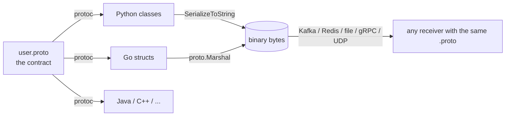
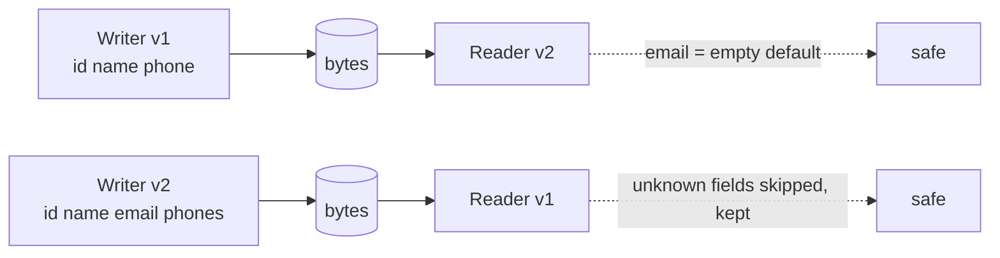
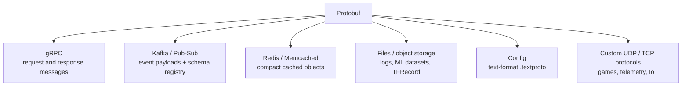

# Protobuf Theory

<div data-viz="api-protobuf"></div>

## What is Protobuf?

**Protocol Buffers (Protobuf)** is Google's language-neutral, platform-neutral way to **describe structured data** in a `.proto` file and **serialize it to a compact binary format**. You write the schema once, and a compiler (`protoc`) generates classes for Python, Go, Java, C++, and more.

It is two things at once:

1.  An **Interface Definition Language (IDL)**: the `.proto` file is the contract.
2.  A **binary encoding**: small, fast to encode and decode, and designed so old and new versions of a schema can talk to each other.

Protobuf is *not* a transport. It does not send anything; it turns objects into bytes and back. gRPC is the framework that sends those bytes over HTTP/2 (see `gRPC/`). You can equally put Protobuf bytes in Kafka, Redis, files, or UDP packets.

> **Analogy:** JSON is a letter written in full sentences: readable by anyone, but wordy. Protobuf is a form with numbered boxes. Sender and receiver both hold a copy of the form, so the message only needs to say "box 2: Ana". It is tiny, but useless to someone who does not have the form.



## Why Not Just JSON?

| | JSON | Protobuf |
| :--- | :--- | :--- |
| **Format** | Text | Binary |
| **Readable by humans** | Yes | No (needs the schema and a tool) |
| **Schema** | Optional (JSON Schema / OpenAPI) | Mandatory, enforced by generated code |
| **Field identity on the wire** | Name (`"email"`) repeated in every message | Number (1 byte) |
| **Typical size** | Baseline | 2-3x smaller raw for structured data; the gap shrinks a lot after gzip |
| **Speed to parse** | Slower | Several times faster (Lab results below) |
| **Type safety** | Runtime | Compile time |
| **Schema evolution** | Convention | Built in and rule-driven |
| **Binary data** | base64 (+33%) | Native `bytes` |

Measured in this module (Lab 4 in Python, Lab 5 in Go):

| Measurement | Result |
| :--- | :--- |
| One structured record, JSON vs Protobuf | 219 bytes vs 85 bytes in Go (2.6x smaller) |
| Same data after gzip | only about 1.2x smaller |
| Go `Marshal` / `Unmarshal` vs `encoding/json` | roughly 2x / 8x faster |
| Text-heavy record (one long string) | almost no size difference |

> ⚠️ **Do not oversell it.** Protobuf's speed and size advantage is real but depends on the data. Its *biggest* benefit is often the enforced contract and the safe evolution rules, not the bytes.

## The `.proto` Language

```protobuf
syntax = "proto3";                               // always the first line

package demo.v1;                                 // namespace; version it: v1, v2, ...
option go_package = "example.com/app/pb;pb";     // language-specific settings

import "google/protobuf/timestamp.proto";        // well-known types

enum Role {
  ROLE_UNSPECIFIED = 0;                          // first value MUST be 0: it is the default
  ROLE_USER = 1;
  ROLE_ADMIN = 2;
}

message Address {
  string street = 1;
  string city   = 2;
}

message User {
  int64  id    = 1;                              // <type> <name> = <FIELD NUMBER>;
  string name  = 2;
  string email = 3;
  Role   role  = 4;
  repeated string tags = 5;                      // a list
  map<string, string> attrs = 6;                 // a dictionary
  Address address = 7;                           // nested message

  oneof contact {                                // at most ONE of these is set
    string phone = 8;
    string slack = 9;
  }

  optional int32 age = 10;                       // tracks "was it set?"
  google.protobuf.Timestamp created_at = 11;
}

service UserService {                            // used by gRPC, ignored otherwise
  rpc GetUser(GetUserRequest) returns (User);
}
message GetUserRequest { int64 id = 1; }
```

### Scalar types

| Proto type | Use for | Notes |
| :--- | :--- | :--- |
| `int32`, `int64` | Ordinary integers | **Negative values are inefficient** (10 bytes) |
| `uint32`, `uint64` | Non-negative integers | |
| `sint32`, `sint64` | Integers that are often negative | Uses ZigZag encoding |
| `fixed32`, `fixed64`, `sfixed*` | Values that are usually large (hashes, ids) | Always 4 or 8 bytes |
| `bool` | true / false | |
| `float`, `double` | Floating point | 4 / 8 bytes |
| `string` | UTF-8 text | Must be valid UTF-8 |
| `bytes` | Arbitrary binary | No base64 needed on the wire |

**Rule of thumb:** use `int64` for ids and counts, `sint64` for signed deltas, `string` for text, `bytes` for blobs, `google.protobuf.Timestamp` for time. Never use a float for money; use an integer of cents (or a decimal message).

## The Wire Format, Byte by Byte

This is the part that makes everything else make sense. A serialised message is just a **sequence of `[tag][value]` pairs**. There are no field names, no brackets, no separators.

```
tag = (field_number << 3) | wire_type
```

| Wire type | Number | Used for | Value layout |
| :--- | :---: | :--- | :--- |
| **VARINT** | 0 | `int32/64`, `uint*`, `sint*`, `bool`, `enum` | 1-10 bytes, 7 bits each |
| **I64** | 1 | `fixed64`, `sfixed64`, `double` | 8 bytes, little-endian |
| **LEN** | 2 | `string`, `bytes`, nested messages, packed repeated | varint length, then that many bytes |
| **I32** | 5 | `fixed32`, `sfixed32`, `float` | 4 bytes, little-endian |

### Worked example

```
User { id: 150, name: "Ana", email: "a@x.io" }
```

```
08 96 01 | 12 03 41 6e 61 | 1a 06 61 40 78 2e 69 6f
^^ ^^^^^   ^^ ^^ ^^^^^^^^    ^^ ^^ ^^^^^^^^^^^^^^^^^
|  |       |  |  "Ana"       |  |  "a@x.io"
|  |       |  length 3       |  length 6
|  |       tag: field 2, LEN |  (tag: field 3, LEN)  = 0x1a
|  varint 150
tag: field 1, VARINT = (1<<3)|0 = 0x08
```

That is **16 bytes**. The JSON `{"id":150,"name":"Ana","email":"a@x.io"}` is **40 bytes**. Notice the names `id`, `name`, `email` do not appear anywhere: only the numbers 1, 2, 3 do.

### Varints: 7 bits per byte

The top bit of each byte means "more bytes follow". The low 7 bits carry data, **least significant group first**.

```
1    ->  01                     (1 byte)
127  ->  7f                     (1 byte)
128  ->  80 01                  (2 bytes)
150  ->  96 01                  150 = 0b1_0010110
                                 low 7 bits 0010110 + continuation bit 1 = 10010110 = 0x96
                                 remaining bits 1                              = 0x01
300  ->  ac 02
```

Small numbers cost one byte, which is why Protobuf is small for typical data (small ids, counts, enum values).

### Negative numbers and ZigZag

A negative `int32` is sign-extended to 64 bits, so `-1` costs **10 bytes**. `sint32` first applies **ZigZag**, which maps signed to unsigned so small magnitudes stay small:

```
  0 -> 0     -1 -> 1     1 -> 2     -2 -> 3     2 -> 4      zigzag(n) = (n << 1) ^ (n >> 31)
```

Measured in Lab 1: `int32 -1` serialises to 11 bytes (10 for the value + 1 for the tag), `sint32 -1` to 2 bytes.

### Field numbers 1-15 are precious

A tag is itself a varint of `(number << 3) | type`. Field numbers up to **15** fit in **one byte**; 16 and above need **two**. Give the numbers 1-15 to the fields present in almost every message.

### Defaults cost nothing

In proto3, a field equal to its default (`0`, `""`, `false`, first enum value) is **not written at all**. A message full of defaults serialises to **0 bytes**. The flip side: for a plain scalar, "set to zero" and "never set" are indistinguishable (see Presence below).

### Repeated fields, packing, maps

*   `repeated int32 scores = 17;` is **packed**: one tag, one length, then all values back to back. `[3, 270]` becomes `8a 01 03 03 8e 02`.
*   `repeated string` and repeated messages repeat the tag for every element.
*   `map<K, V>` is sugar for `repeated Entry { K key = 1; V value = 2; }`. **Map order on the wire is not defined**; see determinism below.

### Decoding without a schema

Because the wire carries numbers and wire types, you can inspect unknown bytes: `protoc --decode_raw < message.bin`. You will see `1: 150`, `2: "Ana"`, but never names. Lab 1 writes such a decoder in about 30 lines.

## Schema Evolution: The Golden Rules

Old and new code always meet in production: a deploy rolls out over minutes, messages sit in Kafka for days, files live for years. Protobuf is built so that works, if you follow the rules.



| Change | Safe? | Why |
| :--- | :---: | :--- |
| **Add** a field with a **new** number | Yes | Old readers skip it; new readers see the default from old data |
| **Remove** a field | Yes, if you `reserved` it | Otherwise someone will reuse the number |
| **Rename** a field | Yes on the wire | Names are not on the wire (but generated code and JSON change) |
| **Change** a field's number | **Never** | Every stored/in-flight message now means something else |
| **Reuse** a deleted number | **Never** | Old data is silently reinterpreted |
| **Change** a field's type | Almost never | Wire types differ, or truncation. `int32 <-> int64 <-> bool` are compatible but lossy |
| Add an enum value | Yes | Old readers keep the unknown number; do not `switch` without a default |

```protobuf
message Customer {
  reserved 3;                 // tag 3 used to be `phone`. The compiler now refuses to reuse it.
  reserved "phone";
  int64 id = 1;
  string name = 2;
  string email = 4;           // new
  repeated string phones = 5; // replaces phone
}
```

Lab 3 (Python) proves each rule:

*   A **v2 writer** to a **v1 reader**: extra fields are skipped, no crash.
*   A **v1 writer** to a **v2 reader**: new fields are defaults, so code must tolerate `email == ""`.
*   A **v1 proxy** in the middle **keeps unknown fields**, so a v2 message survives a v1 hop intact. (A JSON proxy typically drops them.)
*   **Reusing tag 3** for `nickname`: the old phone number `+47 555 0100` is silently read back as a nickname. No error. This is the failure the rules exist for.

> 🎯 **Interview angle:** "How do you evolve a Protobuf API?" is a standard question. Answer with: add only new numbers, `reserved` removed ones, never change types or numbers, treat defaults as "unknown", use `buf breaking` in CI, and version the package (`v1`, `v2`) for truly breaking redesigns.

## Presence: "Was It Set?"

proto3 has no null. Unset fields read as defaults.

| Field kind | Can you tell "unset" from "zero"? |
| :--- | :---: |
| Plain scalar (`int32 x`) | **No** |
| `optional` scalar (`optional int32 age`) | Yes (`HasField`, or a pointer in Go) |
| Message (`Address address`) | Yes (nil vs present) |
| `oneof` member | Yes (`WhichOneof`, or a type switch in Go) |
| `repeated` / `map` | No distinction between empty and unset |

Use `optional` when zero is meaningful ("age 0", "discount 0%"). For PATCH-style updates use a **`FieldMask`**: the client lists exactly which paths to change, which also lets it *clear* a field by masking it and leaving it empty.

## oneof, map, enum

*   **`oneof`** models "exactly one of these". Setting one member clears the others, so impossible states are unrepresentable. In Go it becomes an interface field with a wrapper type per member (`&pb.User_Phone{Phone: "..."}`), read with a type switch. Always handle a `default:` branch: a newer schema may add members.
*   **Enums** must start with a zero value; name it `*_UNSPECIFIED`. That zero is what "forgot to set it" looks like, so it should never mean something real. **Unknown enum numbers are preserved** when parsed, so a `switch` needs a default branch.
*   **Maps** cannot be `repeated` and keys must be integral or string types.

## Well-Known Types

Shared, standard messages under `google/protobuf/`:

| Type | Represents | JSON form |
| :--- | :--- | :--- |
| `Timestamp` | An instant (seconds + nanos since epoch) | `"2026-09-21T10:30:00Z"` |
| `Duration` | A span of time | `"300.250s"` |
| `Any` | Any message + its type URL | `{"@type": "type.googleapis.com/demo.v1.User", ...}` |
| `FieldMask` | A set of field paths for partial updates | `"name,address.city"` |
| `Struct` / `Value` | Arbitrary JSON-like data | a JSON object |
| `Empty` | No data (for RPCs that take or return nothing) | `{}` |
| `wrappers.*Value` | Nullable scalars (`Int32Value`) | number or `null` |

## JSON Mapping

Protobuf defines a **canonical JSON** form, used by gRPC gateways and `protojson`/`json_format`:

| Protobuf | JSON |
| :--- | :--- |
| Field name `created_at` | `createdAt` (lowerCamelCase; snake_case optionally accepted) |
| `int64` / `uint64` | **string** (`"150"`) because JavaScript numbers lose precision above 2^53 |
| `bytes` | base64 string |
| enum | its **name** (a number is also accepted when parsing) |
| Default values | **omitted** unless "emit unpopulated" is set |
| Unknown JSON fields | rejected by default; `DiscardUnknown` accepts them |

> ⚠️ In Go never use `encoding/json` on generated messages. Use `protojson`. In Python use `google.protobuf.json_format`.

## Using It: Python

```bash
pip install protobuf grpcio-tools
python -m grpc_tools.protoc -I proto --python_out=. proto/demo.proto      # writes demo_pb2.py
```

```python
import demo_pb2 as pb

u = pb.User(id=150, name="Ana", email="a@x.io", tags=["go", "proto"])
u.address.city = "Oslo"                     # nested messages are created on write
data = u.SerializeToString()                # -> bytes (what you send / store)

back = pb.User.FromString(data)             # or: m = pb.User(); m.ParseFromString(data)
assert back == u

u.HasField("age")                           # optional / message fields only
u.WhichOneof("contact")                     # which oneof member is set, or None
copy = pb.User(); copy.CopyFrom(u)          # deep copy
```

## Using It: Go

```bash
go install google.golang.org/protobuf/cmd/protoc-gen-go@latest
protoc -I proto --go_out=. --go_opt=paths=source_relative proto/demo.proto
```

```go
u := &pb.User{Id: 150, Name: "Ana", Email: "a@x.io", Age: proto.Int32(0)}   // optional => pointer
data, err := proto.Marshal(u)

var back pb.User
err = proto.Unmarshal(data, &back)

u.GetAddress().GetCity()                    // getters are nil-safe; u.Address.City would panic
proto.Equal(a, b)                           // never compare with ==
clone := proto.Clone(u).(*pb.User)          // deep copy
```

> ⚠️ Generated Go messages are **pointers to structs with internal state**. Never copy them by value (`go vet` flags it); use `proto.Clone`.

## Determinism, Hashing, Signing

Protobuf serialisation is **not canonical**. Two correct encoders may produce different bytes for the same message: map entries can come in any order, and unknown fields are preserved wherever. Consequences:

*   Do **not** use serialised bytes as a cache key, a hash input, or a signature payload, unless you use **deterministic marshalling** (`proto.MarshalOptions{Deterministic: true}` in Go, `SerializeToString(deterministic=True)` in Python), and even then only within one implementation and version.
*   Lab 2 (Go) shows 200 marshals of the same 20-entry map producing 20 different byte strings, and exactly 1 in deterministic mode.
*   For signatures, sign the **exact bytes you send** and transmit them as-is.

## Streams and Framing

A serialised message has **no length and no terminator**. Two messages glued together are just one merged message (scalars: last wins; repeated: appended). To store or send many messages over a byte stream, **frame them**:

```
[varint length][message bytes][varint length][message bytes] ...
```

Go: `protodelim`. Java: `writeDelimitedTo`. gRPC uses a 5-byte prefix (flag + 4-byte length). Kafka gives you message boundaries for free. Always cap the maximum frame size when reading (`protodelim.UnmarshalOptions{MaxSize: ...}`): a corrupted or hostile length prefix should not make you allocate gigabytes. Both languages' Lab 5 show this.

## Tooling

| Tool | Use |
| :--- | :--- |
| `protoc` | The compiler; plugins produce language output |
| **`buf`** | Modern workflow: `buf lint`, **`buf breaking`** (fails CI when you change a schema unsafely), `buf generate`, a registry |
| `grpcurl` | curl for gRPC; uses server reflection |
| `protoc --decode_raw` | Inspect bytes without a schema |
| `protoc --decode=demo.v1.User demo.proto < msg.bin` | Inspect bytes with a schema |
| IDE plugins | Syntax highlight, format, go-to-definition |

Repository layout that scales: one `proto/` directory (or a dedicated repo) as the **single source of truth**, versioned packages (`company.orders.v1`), generated code produced in CI, never hand-edited.

## Where Protobuf Is Used



## Common Pitfalls

1.  **Changing or reusing a field number.** The single worst mistake. Silent corruption.
2.  **Using `int32` for values that are often negative.** Ten bytes each. Use `sint32`.
3.  **Using floats for money.** Use integer minor units.
4.  **Assuming "0" means "not set".** Use `optional` or a wrapper when it matters.
5.  **Hashing or signing serialised bytes without deterministic mode.**
6.  **No `*_UNSPECIFIED = 0` in enums**, so the default is a real value.
7.  **Not handling new enum values / unknown `oneof` members** (`default:` branches).
8.  **Reading a stream without a max message size.**
9.  **Editing generated code.** Regenerate instead.
10. **Sharing one giant `.proto` with everything.** Split by domain and version the package.

## Check Yourself

> ❓ **Question 1:** The bytes `08 96 01` are a message. What field number and value do they hold, and why are there three bytes?
>
> ❓ **Question 2:** You delete `string phone = 3;` and later add `int32 loyalty = 3;`. What happens to messages stored last year?
>
> ❓ **Question 3:** Why is a field number of 16 more expensive than 15?
>
> ❓ **Question 4:** A client sends `{"amount": 0}` for `int32 amount = 1;`. How does the server know whether the client meant zero or forgot the field? How would you fix the schema?
>
> ❓ **Question 5:** You read a file of concatenated messages by calling `Parse` on the whole file. What do you get?

**Answers**

1.  `08` is the tag: `(1 << 3) | 0`, field 1, varint. `96 01` is the varint 150 (`0x96` has the continuation bit, `0x01` finishes). One byte tag plus two bytes value.
2.  Old records wrote a `string` (length-delimited) at tag 3. A reader expecting an `int32` (varint) sees a wire-type mismatch and treats it as unknown, so `loyalty` reads 0 and the phone data is skipped. With a same-wire-type reuse (`string` to `string`) it would be silently misread instead. Either way: use `reserved`.
3.  The tag is `(number << 3) | wire_type` stored as a varint. Up to 15 that is at most 127, one byte. From 16 it needs two.
4.  It cannot: zero is the default and is not written on the wire. Make it `optional int32 amount = 1;` (presence tracking), or wrap it (`google.protobuf.Int32Value`), or use a `FieldMask` in update requests.
5.  One merged message: scalar fields from the last record win, repeated fields from all records are appended. Use length-delimited framing instead.

## Hands-On Labs

Every lab is one file that runs on its own and prints what happens. Labs 1-2 teach the basics; labs 3-5 are advanced. Python and Go cover **different** ground.

Setup from the `API/` folder: `pip install -r requirements.txt`. The generated code is checked in; regenerate with `Protobuf/labs/generate.sh` after editing anything in `Protobuf/labs/proto/`.

| # | Python (`Protobuf/labs/python/`) | You learn |
| :---: | :--- | :--- |
| 1 | `01_wire_format_by_hand.py` | Varints, tags, ZigZag, packing; an encoder verified byte-for-byte against the library; a schema-less `decode_raw` |
| 2 | `02_messages_and_field_types.py` | Defaults, presence, `oneof`, maps, enums with unknown values, strict typing, merge/copy, text and JSON formats |
| 3 | `03_schema_evolution.py` | Every evolution rule proven, including silent corruption from tag reuse and `protoc` enforcing `reserved` |
| 4 | `04_size_speed_vs_json.py` | An honest benchmark: raw size, gzip size, encode/decode speed, structured vs text-heavy data |
| 5 | `05_framing_streams_and_wellknown_types.py` | Length-delimited files, chunked stream reader, truncation detection, `Timestamp`, `Duration`, `Any`, `FieldMask` |

| # | Go (`Protobuf/labs/golang/`) | You learn |
| :---: | :--- | :--- |
| 1 | `01_marshal_unmarshal_basics` | `Marshal` / `Unmarshal`, nil-safe getters, presence with pointers, `Clone` / `Equal` / `Merge`, unknown fields, bad input |
| 2 | `02_oneof_maps_enums` | `oneof` type switches, maps, map-order non-determinism proven, unknown enums, the cost of field numbers |
| 3 | `03_protojson_any_fieldmask` | Canonical JSON, marshal/unmarshal options, `Any` type checks, `FieldMask` updates via reflection |
| 4 | `04_reflection_and_dynamic_messages` | Descriptors, generic walking, a schema-agnostic PII redactor, `dynamicpb`, a schema built at runtime |
| 5 | `05_delimited_streams_and_benchmark` | `protodelim` streams over a pipe, `MaxSize` defence, clean EOF vs truncation, benchmark vs `encoding/json` |

```bash
python Protobuf/labs/python/01_wire_format_by_hand.py
go run ./Protobuf/labs/golang/05_delimited_streams_and_benchmark
```

## Exercises

1.  Extend Python lab 1's encoder to handle a nested message (`Address`) and a packed `repeated int32`; compare against the library.
2.  Add a `v3` of `Customer` that changes `email` into a `oneof { string email = 4; string phone_number = 6; }` and prove old readers still work.
3.  Write a Go program that reads a delimited file with `dynamicpb` and prints every record as JSON, given only the `.proto` file name.
4.  Build a Kafka-style log in Python: append length-delimited records with a CRC32 per record, and recover from a torn last write.
5.  Install `buf` and add a `buf breaking` check that fails when you renumber a field.

## Where To Go Next

*   **`gRPC/`**: Protobuf plus HTTP/2 streaming, deadlines, interceptors and mTLS.
*   **`Fundamentals/04_choosing_the_right_api.md`**: when a binary contract is worth it.
