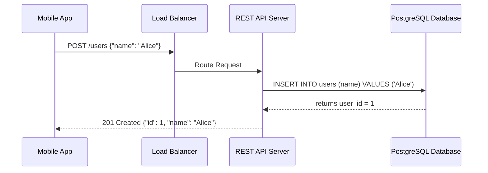

# REST API Theory

<div data-viz="api-rest"></div>


## What is <abbr title="Representational State Transfer - An architectural style for distributed hypermedia systems, commonly used for creating interactive web services.">REST</abbr>?
<abbr title="Representational State Transfer - An architectural style for distributed hypermedia systems, commonly used for creating interactive web services.">REST</abbr> (Representational State Transfer) is an architectural style that relies on stateless communication, usually over <abbr title="Hypertext Transfer Protocol - The foundation of data communication for the World Wide Web, operating on a client-server model.">HTTP</abbr>. In <abbr title="Representational State Transfer - An architectural style for distributed hypermedia systems, commonly used for creating interactive web services.">REST</abbr>, everything is a **Resource** (e.g., a User, a Book, an Order). Resources are identified by standard URLs, and actions are performed using standard <abbr title="Hypertext Transfer Protocol - The foundation of data communication for the World Wide Web, operating on a client-server model.">HTTP</abbr> verbs.

<abbr title="Representational State Transfer - An architectural style for distributed hypermedia systems, commonly used for creating interactive web services.">REST</abbr> was described by Roy Fielding in his 2000 doctoral dissertation, as a name for *why the web scales*. It is a set of **constraints**, not a protocol, and not a spec. An <abbr title="Application Programming Interface">API</abbr> is "RESTful" to the degree that it follows them.

> **Analogy:** A library. Every book has an address (the shelf number = URL). You do not tell the librarian *how* to find a book; you use a small fixed vocabulary (borrow, return, renew = <abbr title="Hypertext Transfer Protocol - The foundation of data communication for the World Wide Web, operating on a client-server model.">HTTP</abbr> verbs) that works the same way for every book. You receive a *copy or description* of the book (a representation), never the physical shelf itself.

## The Constraints of <abbr title="Representational State Transfer - An architectural style for distributed hypermedia systems, commonly used for creating interactive web services.">REST</abbr>

1.  **Client-Server:** The UI and data storage concerns are separated. Each can evolve independently.
2.  **Stateless:** No client context is stored on the server between requests. Each request must contain all info needed to process it (auth token, cursor, filters). This is what makes horizontal scaling trivial: any server can answer any request.
3.  **Cacheable:** Responses must define themselves as cacheable or not to prevent clients from reusing stale data.
4.  **Uniform Interface:** Resources are manipulated through representations (like <abbr title="JavaScript Object Notation - A lightweight data-interchange format that is easy for humans to read/write and machines to parse/generate.">JSON</abbr>), and standard <abbr title="Hypertext Transfer Protocol - The foundation of data communication for the World Wide Web, operating on a client-server model.">HTTP</abbr> verbs are used. It has four sub-rules:
    *   *Identification of resources* (every thing has a URI).
    *   *Manipulation through representations* (send/receive <abbr title="JavaScript Object Notation - A lightweight data-interchange format that is easy for humans to read/write and machines to parse/generate.">JSON</abbr>, not the object itself).
    *   *Self-descriptive messages* (`Content-Type`, status codes and headers tell you how to process it).
    *   *HATEOAS* (responses contain links to what you can do next).
5.  **Layered System:** The client cannot tell whether it talks to the origin server or to a proxy, <abbr title="Content Delivery Network - A geographically distributed network of proxy servers and their data centers used to deliver content with low latency.">CDN</abbr>, or gateway in between.
6.  **Code on Demand (optional):** The server may send executable code (JavaScript).

> ⚠️ **"Stateless" does not mean "no state".** The *application* has plenty of state (databases, sessions). It means the *server does not remember the client's conversation* between requests. State lives in the database or is carried by the client (token, cursor).

## Resources and URI Design

A **resource** is a noun the client can name: `users`, `orders`, an individual `order`. The URI identifies it; the *method* says what to do.

| Rule | Good | Bad |
| :--- | :--- | :--- |
| Use **nouns**, not verbs | `POST /orders` | `POST /createOrder` |
| Use **plural** collections | `/users/42` | `/user/42` |
| **Nest** to show ownership (max 2 levels) | `/users/42/orders` | `/users/42/orders/9/items/3/reviews/8` |
| Lowercase, hyphens | `/order-items` | `/OrderItems`, `/order_items` |
| **Filter, sort, page** via the query string | `/orders?status=paid&sort=-created_at&limit=20` | `/orders/paid/newest/first-20` |
| No trailing file extensions | `Accept: application/json` | `/users.json` |
| IDs are opaque | `/orders/8f14e45f` (<abbr title="Universally Unique Identifier - A 128-bit label used for information in computer systems to ensure uniqueness across distributed systems.">UUID</abbr>) | Sequential IDs that leak volume and invite scraping |

**Modelling actions that do not fit <abbr title="Create, Read, Update, Delete - The four basic functions of persistent storage operations, commonly used in database and <abbr title="Application Programming Interface - A set of rules and protocols that allows different software applications to communicate with each other.">API</abbr> design.">CRUD</abbr>.** Make the action a resource, or a sub-resource:

```
POST /orders/981/cancellation      -> creates a cancellation
POST /payments/pay_7/refunds       -> creates a refund
POST /reports                      -> starts a report job (202 Accepted)
PUT  /users/42/password            -> replace the password resource
```

## Methods, Status Codes and <abbr title="Create, Read, Update, Delete - The four basic functions of persistent storage operations, commonly used in database and <abbr title="Application Programming Interface - A set of rules and protocols that allows different software applications to communicate with each other.">API</abbr> design.">CRUD</abbr> Mapping

| Verb | Action | Idempotent | Example URI |
| :--- | :--- | :---: | :--- |
| `GET` | Retrieve a resource. | ✅ | `GET /users/123` |
| `POST` | Create a new resource. | ❌ | `POST /users` |
| `PUT` | Replace an entire resource. | ✅ | `PUT /users/123` |
| `PATCH` | Partially update a resource. | ❌ | `PATCH /users/123` |
| `DELETE` | Delete a resource. | ✅ | `DELETE /users/123` |

**Common Status Codes:**
*   `200 OK`: Success.
*   `201 Created`: Resource successfully created (send a `Location` header).
*   `202 Accepted`: Work queued, not done yet.
*   `204 No Content`: Success, nothing to return (typical for `DELETE`).
*   `304 Not Modified`: Conditional GET; use your cached copy.
*   `400 Bad Request`: Client sent invalid data.
*   `401 Unauthorized`: Client is not authenticated.
*   `403 Forbidden`: Authenticated but not allowed.
*   `404 Not Found`: Resource does not exist.
*   `409 Conflict`: State conflict (duplicate email, edit collision).
*   `422 Unprocessable Content`: Well-formed but semantically invalid.
*   `429 Too Many Requests`: Rate limited.
*   `500 Internal Server Error`: Backend crashed.

See `Fundamentals/02_http_and_web_foundations.md` for the full table and the subtle distinctions (401 vs 403, 400 vs 422).

## Walk-Through: A Complete Task <abbr title="Application Programming Interface">API</abbr> on the Wire

This is the exact traffic for a small to-do <abbr title="Application Programming Interface">API</abbr>. Read every line; it is the whole of <abbr title="Representational State Transfer - An architectural style for distributed hypermedia systems, commonly used for creating interactive web services.">REST</abbr> in a page.

**1. Create** - `POST` to the *collection*. The server picks the id and answers `201` with `Location`.

```http
POST /tasks HTTP/1.1
Content-Type: application/json

{"title": "write docs"}

HTTP/1.1 201 Created
Location: /tasks/1
Content-Type: application/json

{"id": 1, "title": "write docs", "done": false}
```

**2. Read one** and **read the list** (with a filter and cursor pagination).

```http
GET /tasks/1                       -> 200 {"id":1,"title":"write docs","done":false}
GET /tasks?done=false&limit=20     -> 200 {"data":[...], "next_cursor": 21}
GET /tasks/999                     -> 404 {"error":"task not found"}
```

**3. Replace vs partially update.**

```http
PUT /tasks/1
{"title": "write docs", "done": true}     <- must send the WHOLE resource; missing fields reset to defaults
-> 200 OK

PATCH /tasks/1
{"done": true}                            <- send only what changes
-> 200 OK {"id":1,"title":"write docs","done":true}
```

**4. Delete** (idempotent: the second call leaves the same state).

```http
DELETE /tasks/1  -> 204 No Content
DELETE /tasks/1  -> 204 No Content   (or 404; both are acceptable, pick one and document it)
GET    /tasks/1  -> 404 Not Found
```

**5. Validation error** (consistent shape, see `Fundamentals/03_cross_cutting_concerns.md`).

```http
POST /tasks
{"title": ""}

HTTP/1.1 422 Unprocessable Content
{"type":"validation","title":"Validation failed","errors":[{"field":"title","message":"must not be empty"}]}
```

### The same <abbr title="Application Programming Interface">API</abbr> in Python (FastAPI)

```python
from fastapi import FastAPI, HTTPException, Response, status
from pydantic import BaseModel, Field

app = FastAPI()

class TaskIn(BaseModel):
    title: str = Field(min_length=1, max_length=100)     # violation -> automatic 422
    done: bool = False

class TaskPatch(BaseModel):
    title: str | None = None
    done: bool | None = None

tasks: dict[int, dict] = {}
next_id = 1

@app.post("/tasks", status_code=status.HTTP_201_CREATED)
def create(task: TaskIn, response: Response):
    global next_id
    tasks[next_id] = {"id": next_id, **task.model_dump()}
    response.headers["Location"] = f"/tasks/{next_id}"
    next_id += 1
    return tasks[next_id - 1]

@app.get("/tasks/{task_id}")
def read(task_id: int):
    if task_id not in tasks:
        raise HTTPException(404, "task not found")
    return tasks[task_id]

@app.get("/tasks")
def list_tasks(limit: int = 20, after: int = 0, done: bool | None = None):
    rows = [t for t in tasks.values() if t["id"] > after and (done is None or t["done"] == done)]
    page = rows[:limit]
    return {"data": page, "next_cursor": page[-1]["id"] if len(rows) > limit else None}

@app.put("/tasks/{task_id}")
def replace(task_id: int, task: TaskIn):
    if task_id not in tasks:
        raise HTTPException(404, "task not found")
    tasks[task_id] = {"id": task_id, **task.model_dump()}
    return tasks[task_id]

@app.patch("/tasks/{task_id}")
def update(task_id: int, patch: TaskPatch):
    if task_id not in tasks:
        raise HTTPException(404, "task not found")
    tasks[task_id].update(patch.model_dump(exclude_unset=True))   # only fields the client sent
    return tasks[task_id]

@app.delete("/tasks/{task_id}", status_code=status.HTTP_204_NO_CONTENT)
def delete(task_id: int):
    tasks.pop(task_id, None)          # idempotent: deleting twice is fine
```

Run with `uvicorn main:app --reload`, then open `http://127.0.0.1:8000/docs` for the auto-generated OpenAPI UI.

### The same <abbr title="Application Programming Interface">API</abbr> in Go (standard library, Go 1.22+)

Go 1.22 added method and wildcard patterns to `http.ServeMux`, so a framework is optional.

```go
package main

import (
	"encoding/json"
	"net/http"
	"strconv"
	"sync"
)

type Task struct {
	ID    int    `json:"id"`
	Title string `json:"title"`
	Done  bool   `json:"done"`
}

type store struct {
	mu     sync.Mutex
	nextID int
	tasks  map[int]Task
}

func writeJSON(w http.ResponseWriter, status int, v any) {
	w.Header().Set("Content-Type", "application/json")
	w.WriteHeader(status)
	json.NewEncoder(w).Encode(v)
}

func (s *store) create(w http.ResponseWriter, r *http.Request) {
	var in Task
	if err := json.NewDecoder(r.Body).Decode(&in); err != nil || in.Title == "" {
		writeJSON(w, http.StatusBadRequest, map[string]string{"error": "title is required"})
		return
	}
	s.mu.Lock()
	s.nextID++
	in.ID = s.nextID
	s.tasks[in.ID] = in
	s.mu.Unlock()
	w.Header().Set("Location", "/tasks/"+strconv.Itoa(in.ID))
	writeJSON(w, http.StatusCreated, in)
}

func (s *store) get(w http.ResponseWriter, r *http.Request) {
	id, _ := strconv.Atoi(r.PathValue("id")) // the {id} wildcard
	s.mu.Lock()
	t, ok := s.tasks[id]
	s.mu.Unlock()
	if !ok {
		writeJSON(w, http.StatusNotFound, map[string]string{"error": "task not found"})
		return
	}
	writeJSON(w, http.StatusOK, t)
}

func (s *store) remove(w http.ResponseWriter, r *http.Request) {
	id, _ := strconv.Atoi(r.PathValue("id"))
	s.mu.Lock()
	delete(s.tasks, id) // idempotent
	s.mu.Unlock()
	w.WriteHeader(http.StatusNoContent)
}

func main() {
	s := &store{tasks: map[int]Task{}}
	mux := http.NewServeMux()
	mux.HandleFunc("POST /tasks", s.create)
	mux.HandleFunc("GET /tasks/{id}", s.get)
	mux.HandleFunc("DELETE /tasks/{id}", s.remove)
	http.ListenAndServe(":8080", mux) // GET /tasks -> automatic 405 with an Allow header
}
```

> **Try it:** `curl -i -X POST localhost:8080/tasks -d '{"title":"write docs"}'` then `curl -i localhost:8080/tasks/1`. The same <abbr title="Application Programming Interface">API</abbr>, grown up, is in Python lab 2 (`labs/python/02_fastapi_validation_openapi.py`) and Go lab 2 (`labs/golang/02_json_crud_validation`).

## PATCH: Two Standard Formats

A partial update has two competing standards. Know both.

**<abbr title="JavaScript Object Notation - A lightweight data-interchange format that is easy for humans to read/write and machines to parse/generate.">JSON</abbr> Merge Patch (RFC 7396)**, `Content-Type: application/merge-patch+json`. Send a fragment; `null` means "delete this field".

```http
PATCH /users/42
{"nickname": "ana", "phone": null}      <- sets nickname, removes phone, leaves the rest alone
```

Simple, but you cannot express "append to an array" or set a value to a literal `null`.

**<abbr title="JavaScript Object Notation - A lightweight data-interchange format that is easy for humans to read/write and machines to parse/generate.">JSON</abbr> Patch (RFC 6902)**, `Content-Type: application/json-patch+json`. An ordered list of operations.

```http
PATCH /users/42
[
  {"op": "replace", "path": "/email", "value": "ana@new.io"},
  {"op": "add",     "path": "/tags/-", "value": "vip"},
  {"op": "remove",  "path": "/phone"}
]
```

More expressive, and the whole list is applied atomically. Most public APIs use the plain "send only the fields you change" style, which is close to Merge Patch.

## Concurrency: Preventing Lost Updates

Two admins load user 42, both edit, both save. The second silently overwrites the first. Fix with **optimistic concurrency** using the `ETag`:

```http
GET /users/42
-> 200  ETag: "v3"

PUT /users/42
If-Match: "v3"
-> 200  ETag: "v4"                    <- succeeded, version bumped

PUT /users/42     (second admin, still holding "v3")
If-Match: "v3"
-> 412 Precondition Failed            <- reload, merge, try again
```

Use `428 Precondition Required` to force clients to send `If-Match` at all.

## Pagination, Filtering, Sorting

```http
GET /orders?status=paid&created_after=2026-01-01&sort=-created_at&limit=20&cursor=eyJpZCI6MTAwfQ

200 OK
{
  "data": [ {...}, {...} ],
  "next_cursor": "eyJpZCI6ODB9",
  "has_more": true
}
```

*   Always cap `limit` (e.g. default 20, max 100).
*   Prefer **cursor** pagination for large or changing data (offset gets slow and duplicates rows).
*   Sorting: `sort=-created_at,name` (minus = descending).
*   Sparse fields: `fields=id,name`. Expansion: `expand=customer`.

## Long-Running Operations

Never hold an <abbr title="Hypertext Transfer Protocol - The foundation of data communication for the World Wide Web, operating on a client-server model.">HTTP</abbr> request open for minutes. Return `202 Accepted` and a status resource:

```http
POST /reports
{"type": "annual-sales"}

HTTP/1.1 202 Accepted
Location: /reports/jobs/77

GET /reports/jobs/77
-> 200 {"status": "running", "progress": 0.4}

GET /reports/jobs/77
-> 303 See Other  Location: /reports/77      <- finished; the result lives at its own URL
```

Or accept a callback URL and notify via a **Webhook** when it finishes (see `Webhooks/`).

## Caching

```http
GET /products/9
-> 200
   Cache-Control: public, max-age=60
   ETag: "p9-v12"

GET /products/9
If-None-Match: "p9-v12"
-> 304 Not Modified                   <- no body, saves bandwidth
```

Caching is <abbr title="Representational State Transfer - An architectural style for distributed hypermedia systems, commonly used for creating interactive web services.">REST</abbr>'s superpower. CDNs, browsers and proxies handle `GET` caching for free. It is the main reason to prefer <abbr title="Representational State Transfer - An architectural style for distributed hypermedia systems, commonly used for creating interactive web services.">REST</abbr> for public read-heavy APIs.

## The Richardson Maturity Model

A ladder that shows how "RESTful" an <abbr title="Application Programming Interface">API</abbr> is:

| Level | Description | Example |
| :---: | :--- | :--- |
| **0** | One URL, one verb (`POST`); <abbr title="Remote Procedure Call - A protocol that allows one program to request a service from a program located in another computer on a network.">RPC</abbr> tunnelled over <abbr title="Hypertext Transfer Protocol - The foundation of data communication for the World Wide Web, operating on a client-server model.">HTTP</abbr>. | `POST /api {"action":"getUser","id":1}` |
| **1** | **Resources**: separate URLs per thing. | `POST /users/1` |
| **2** | **<abbr title="Hypertext Transfer Protocol - The foundation of data communication for the World Wide Web, operating on a client-server model.">HTTP</abbr> verbs + status codes** used correctly. | `GET /users/1`, `DELETE /users/1` -> `204` |
| **3** | **Hypermedia (HATEOAS)**: responses link to next actions. | see below |

Most production "<abbr title="Representational State Transfer - An architectural style for distributed hypermedia systems, commonly used for creating interactive web services.">REST</abbr>" APIs are **level 2**, and that is fine.

### HATEOAS example (level 3)

```json
{
  "id": 981,
  "status": "pending",
  "total": 39.98,
  "_links": {
    "self":    { "href": "/orders/981" },
    "cancel":  { "href": "/orders/981/cancellation", "method": "POST" },
    "payment": { "href": "/orders/981/payment",      "method": "PUT" }
  }
}
```

After the order ships, the `cancel` link disappears. The client learns what is allowed from the response instead of hard-coding rules. Powerful, but few clients actually exploit it.

## Real-World Scenario & Architecture

**Scenario:** Building a User Management Service for an e-commerce platform.



Because the <abbr title="Application Programming Interface">API</abbr> is stateless, the load balancer can send the next request to **any** instance, and you scale by adding instances.

## <abbr title="Representational State Transfer - An architectural style for distributed hypermedia systems, commonly used for creating interactive web services.">REST</abbr> vs <abbr title="Remote Procedure Call - A protocol that allows one program to request a service from a program located in another computer on a network.">RPC</abbr> Style over <abbr title="Hypertext Transfer Protocol - The foundation of data communication for the World Wide Web, operating on a client-server model.">HTTP</abbr>

| | <abbr title="Representational State Transfer - An architectural style for distributed hypermedia systems, commonly used for creating interactive web services.">REST</abbr> (resource) | <abbr title="Remote Procedure Call - A protocol that allows one program to request a service from a program located in another computer on a network.">RPC</abbr> (action) |
| :--- | :--- | :--- |
| **URL** | `POST /orders/981/cancellation` | `POST /cancelOrder` |
| **Mental model** | Manipulate nouns | Call functions |
| **Cache-friendly** | Yes (`GET`) | Rarely |
| **Best for** | Public, <abbr title="Create, Read, Update, Delete - The four basic functions of persistent storage operations, commonly used in database and <abbr title="Application Programming Interface - A set of rules and protocols that allows different software applications to communicate with each other.">API</abbr> design.">CRUD</abbr>-like APIs | Internal, action-heavy APIs (see <abbr title="gRPC Remote Procedure Call - A modern, open-source, high-performance <abbr title="Remote Procedure Call - A protocol that allows one program to request a service from a program located in another computer on a network.">RPC</abbr> framework that can run in any environment.">gRPC</abbr>) |

Neither is wrong. Problems start when you mix them accidentally.

## Common Pitfalls

1.  **Verbs in URLs** (`/getUsers`, `/deleteUser?id=3`). The method is the verb.
2.  **`200 OK` with an error in the body.** Breaks monitoring, retries, and caches. Use real status codes.
3.  **`GET` that changes state.** Crawlers, prefetchers and caches will call it.
4.  **Returning arrays at the top level** (`[...]`). You can never add pagination metadata without a breaking change; wrap in an object.
5.  **Leaking the database schema.** `password_hash` in a response, or binding request <abbr title="JavaScript Object Notation - A lightweight data-interchange format that is easy for humans to read/write and machines to parse/generate.">JSON</abbr> straight to a DB model (mass assignment).
6.  **Ignoring idempotency** on `POST` in payment-like flows.
7.  **No pagination limit.** One request returns 5 million rows.
8.  **Inconsistent naming**: `userId` in one endpoint, `user_id` in another.
9.  **No versioning plan** until the first breaking change.

## Check Yourself

> ❓ **Question 1:** `PUT /users/7` with `{"name":"Ana"}` on a user who also has an email. What happens to the email, and what would `PATCH` have done?
>
> ❓ **Question 2:** Your endpoint `POST /orders/{id}/cancel` returns `200` with `{"success": false}` when the order already shipped. What is wrong, and what should it return?
>
> ❓ **Question 3:** Why does statelessness make horizontal scaling easy?
>
> ❓ **Question 4:** A client calls `DELETE /items/5` twice. Is it acceptable that the second call returns `404`?

**Answers**

1.  `PUT` replaces the whole resource, so the email is reset to its default (usually removed). `PATCH` would change only `name`.
2.  A failure hidden behind `200` breaks clients, retries and monitoring. Return `409 Conflict` (state does not allow it) with an error body explaining why.
3.  No request depends on server-side memory of earlier requests, so any instance can serve any request. Add instances behind a load balancer without sticky sessions.
4.  Yes. Idempotency is about server *state*, not identical responses: after either call, item 5 is gone.

## Hands-On Labs

Every lab is a single file that starts its own server, calls it, prints the exchange, and asserts the result. Labs 1-2 teach the basics; labs 3-5 are production topics; Go labs 6-7 show the same <abbr title="Create, Read, Update, Delete - The four basic functions of persistent storage operations, commonly used in database and <abbr title="Application Programming Interface - A set of rules and protocols that allows different software applications to communicate with each other.">API</abbr> design.">CRUD</abbr> <abbr title="Application Programming Interface">API</abbr> built with the two most-used Go web frameworks, for comparison against lab 2's plain `net/http`. **Python and Go teach different things**, so do both.

Run from the `API/` folder (Python: `pip install -r requirements.txt` first).

| # | Python (`REST/labs/python/`) | You learn |
| :---: | :--- | :--- |
| 1 | `01_crud_stdlib.py` | An <abbr title="Hypertext Transfer Protocol - The foundation of data communication for the World Wide Web, operating on a client-server model.">HTTP</abbr> server from scratch: routing, status codes, `Location`, `405 Allow`, idempotent `DELETE` |
| 2 | `02_fastapi_validation_openapi.py` | Pydantic validation, `422` vs `409`, `response_model` hiding secrets, generated OpenAPI |
| 3 | `03_jwt_auth_and_scopes.py` | <abbr title="JSON Web Token - A compact, URL-safe means of representing claims to be transferred between two parties, often used for authentication.">JWT</abbr> built by hand, `401` vs `403` vs `404`, scope dependencies, BOLA, forged / expired / `alg=none` tokens |
| 4 | `04_etag_conditional_requests.py` | `ETag` + `If-None-Match` (`304`), `If-Match` (`412`, `428`), fixing the lost-update problem |
| 5 | `05_idempotency_and_cursor_pagination.py` | `Idempotency-Key` with a real 8-thread race, keyset pagination that survives inserts |

| # | Go (`REST/labs/golang/`) | You learn |
| :---: | :--- | :--- |
| 1 | `01_servemux_basics` | Go 1.22+ `ServeMux`: `"GET /users/{id}"`, `{path...}`, `{$}`, automatic `405`, conflict detection |
| 2 | `02_json_crud_validation` | Strict <abbr title="JavaScript Object Notation - A lightweight data-interchange format that is easy for humans to read/write and machines to parse/generate.">JSON</abbr> decoding (`MaxBytesReader`, `DisallowUnknownFields`), problem+json, `PATCH` with pointers |
| 3 | `03_middleware_and_graceful_shutdown` | Middleware chain, request-id via `context`, panic recovery, `TimeoutHandler`, server timeouts, `Shutdown` |
| 4 | `04_rate_limit_middleware` | Token bucket per client, `429` + `Retry-After`, injectable clock, eviction, why fixed windows fail |
| 5 | `05_api_key_auth_and_ownership` | Hashed <abbr title="Application Programming Interface">API</abbr> keys, constant-time compare, scope middleware, ownership check, revocation |
| 6 | `06_gin_crud_middleware` | Same <abbr title="Create, Read, Update, Delete - The four basic functions of persistent storage operations, commonly used in database and <abbr title="Application Programming Interface - A set of rules and protocols that allows different software applications to communicate with each other.">API</abbr> design.">CRUD</abbr> <abbr title="Application Programming Interface">API</abbr> in Gin: `c.Param`/`c.Query`, `ShouldBindJSON`, `r.Use(...)`, a hand-written request-id middleware |
| 7 | `07_echo_crud_middleware` | Same <abbr title="Create, Read, Update, Delete - The four basic functions of persistent storage operations, commonly used in database and <abbr title="Application Programming Interface - A set of rules and protocols that allows different software applications to communicate with each other.">API</abbr> design.">CRUD</abbr> <abbr title="Application Programming Interface">API</abbr> in Echo: `c.Param`/`c.QueryParam`, `c.Bind`, `e.Use(...)`, a hand-written request-id middleware |

```bash
python REST/labs/python/03_jwt_auth_and_scopes.py
go run ./REST/labs/golang/04_rate_limit_middleware
go run ./REST/labs/golang/06_gin_crud_middleware
```

Labs 1 in each language also accept `--serve` / `-serve` to stay up so you can poke them with `curl`.

## Exercises

1.  Add `sort=-created_at` and cursor pagination to Go lab 2, then reuse the cursor code from Python lab 5.
2.  Combine Python lab 3 (<abbr title="JSON Web Token - A compact, URL-safe means of representing claims to be transferred between two parties, often used for authentication.">JWT</abbr>) with lab 5 (idempotency) so the key is scoped per user.
3.  Port the ETag / `If-Match` logic of Python lab 4 to the Go task <abbr title="Application Programming Interface">API</abbr>.
4.  Put Go lab 4's limiter in front of Go lab 5's <abbr title="Application Programming Interface">API</abbr> and give read-only keys a lower rate.
5.  Write an OpenAPI 3.1 file for the Task <abbr title="Application Programming Interface">API</abbr> and generate a client from it.

## Where To Go Next

*   **Shared toolbox:** `Fundamentals/03_cross_cutting_concerns.md` for auth, versioning, errors, idempotency and rate limiting in every <abbr title="Application Programming Interface">API</abbr> style.
*   **Compare styles:** `GraphQL/` (client-shaped responses), `gRPC/` (typed internal calls), `Webhooks/` (server-to-server events).
