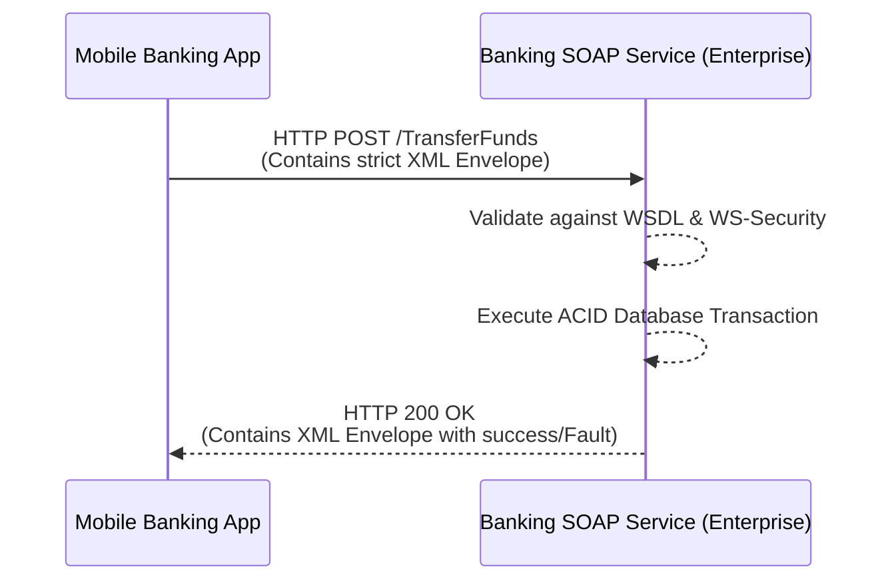

# SOAP Theory

<div data-viz="api-soap"></div>

## What is SOAP?
SOAP (Simple Object Access Protocol) is an older, highly standardized messaging protocol specification for exchanging structured information in the implementation of web services. Unlike REST, which can use JSON, plain text, or XML, SOAP **strictly relies on XML** for its message format.

SOAP appeared around 1998-2000 (SOAP 1.1 was a W3C Note in 2000; **SOAP 1.2** became a W3C Recommendation in 2003) when enterprises needed a vendor-neutral way to call each other across platforms (Java, .NET, mainframes, ERP systems). It defined *everything*: the message format, the error format, the contract language (WSDL), security (WS-Security), reliability, and transactions. The name is now official history: the acronym was dropped in 1.2, because it is neither simple nor about objects.

> **Analogy:** A REST call is a postcard. A SOAP message is a formal registered letter: it goes in an official envelope (the `Envelope`), has a sender's stamp and instructions on the outside (the `Header`), the actual letter inside (the `Body`), and there is a strictly defined procedure for when the recipient must refuse it (a `Fault`). Everyone follows the same forms, which is why banks, insurers and governments still like it.

> **Key idea:** SOAP is **contract-first and tool-driven**. You do not hand-write clients; you point a tool at the **WSDL** and it generates one. Strictness is the feature, and also the cost.

## Why do companies still use SOAP?
1.  **WS-Security:** Enterprise-grade, built-in security features covering encryption and XML signatures, at the message level (not only the transport).
2.  **Transactions and reliability:** Standards exist for distributed transactions (WS-AtomicTransaction) and guaranteed delivery (WS-ReliableMessaging). They are rarely used in new systems, but they were part of the design.
3.  **Strict Contracts:** If a client doesn't match the WSDL perfectly, it fails fast.
4.  **Tooling and history:** Decades of tooling (Java JAX-WS, .NET WCF, SAP, Oracle, Salesforce legacy, banking and telecom back ends). Rewriting a working system to please fashion is rarely funded.
5.  **Transport independence:** SOAP can travel over HTTP, but also SMTP, JMS, or MQ, which matters in some enterprise middleware.

Where you meet it today: banking core systems, payment and card networks, insurance, healthcare (HL7 v2/v3 wrappers), government e-services, telecom provisioning, SAP/Oracle/Salesforce legacy APIs, airline booking (older GDS).

## Real-World Scenario & Architecture

**Scenario:** A legacy Banking System transferring funds between accounts. It requires strict atomic transactions and heavy security.



## Anatomy of a SOAP Message

```xml
<soap:Envelope xmlns:soap="http://schemas.xmlsoap.org/soap/envelope/">   <!-- root: declares the SOAP version by NAMESPACE -->
  <soap:Header>                                                         <!-- optional: metadata, security, routing -->
    <wsse:Security> ... </wsse:Security>
    <c:CorrelationId xmlns:c="http://bank.example.com/ws">req-42</c:CorrelationId>
  </soap:Header>
  <soap:Body>                                                           <!-- required: the payload -->
    <GetBalance xmlns="http://bank.example.com/ws">
      <accountId>ACC-1001</accountId>
    </GetBalance>
  </soap:Body>
</soap:Envelope>
```

The HTTP wrapper (SOAP 1.1):

```http
POST /bank HTTP/1.1
Host: bank.example.com
Content-Type: text/xml; charset=utf-8
SOAPAction: "http://bank.example.com/ws/GetBalance"

<soap:Envelope ...> ... </soap:Envelope>
```

*   **Envelope** identifies the message and its SOAP version through the namespace.
*   **Header** is extensible: security, transaction context, routing, correlation ids. Each header block can be marked `mustUnderstand="1"` (below).
*   **Body** carries exactly one payload: the request (named after the operation), the response, or a `Fault`.
*   **One endpoint:** the URL does **not** identify the action. The first element in the Body (and/or `SOAPAction`) does. Contrast REST, where URL + method identify it.

### XML namespaces: the number one source of bugs

`<a:balance>` in namespace X and `<b:balance>` in namespace Y are **different elements**, whatever the prefix. A parser that looks for `balance` without a namespace finds nothing.

```python
NS = {"b": "http://bank.example.com/ws"}
root.find("b:balance", NS)           # correct
root.find("balance")                 # None: the real tag is "{http://bank.example.com/ws}balance"
```

Python lab 1 shows a document in the wrong namespace silently matching nothing, and Go lab 1 shows the same in `encoding/xml`. Always assert that the fields you require were actually found.

## WSDL: the Contract

**WSDL** (Web Services Description Language) is an XML document that describes the whole service. Its five parts:

```arch
%% caption: A WSDL builds up from data shapes to a concrete URL: what, then how, then where.
grid 260x80
group wsdl "WSDL document" color=blue icon=doc
node t "types" at 0,0 in wsdl shape=card icon=table sub="XML Schema: the shape of data"
node m "message" at 0,1 in wsdl shape=card icon=message sub="named payloads"
node p "portType" at 0,2 in wsdl shape=card icon=function sub="the operations (abstract WHAT)"
node b "binding" at 0,3 in wsdl shape=card icon=link sub="SOAP + HTTP + literal (HOW)"
node s "service and port" at 0,4 in wsdl shape=card icon=internet sub="the URL (WHERE)"
t -> m -> p -> b -> s
```

| Part | Answers | Example |
| :--- | :--- | :--- |
| `<types>` | What does the data look like? | `<xsd:element name="amount" type="xsd:decimal"/>` |
| `<message>` | Which payloads exist? | `GetBalanceInput` -> element `GetBalance` |
| `<portType>` | Which operations? (abstract interface) | `GetBalance`, `Transfer` |
| `<binding>` | Which protocol details? | SOAP over HTTP, `style="document"`, `use="literal"`, `soapAction` |
| `<service>` | Where is it? | `soap:address location="https://bank/ws"` |

Clients are **generated**: Java `wsimport`, .NET `svcutil` / Connected Services, Python `zeep`, Go `gowsdl`. A WSDL usually imports XSD schema files; keep them together when you archive a service.

### Style and use: `document/literal wrapped` is the one to know

WSDL 1.1 allows several style/use combinations. Three matter historically; only one matters today:

| Combination | Body looks like | Verdict |
| :--- | :--- | :--- |
| `rpc/encoded` | `<GetBalance><accountId xsi:type="xsd:string">..` | Obsolete, interoperability nightmare. Banned by WS-I Basic Profile. |
| `rpc/literal` | `<GetBalance><accountId>..` (parts named after parameters) | Works, less common |
| **`document/literal wrapped`** | One wrapper element named after the operation, children are the parameters | **The modern standard.** What both language tracks use. |

## Faults: How SOAP Reports Errors

**SOAP 1.1** (HTTP status is `500`):

```xml
<soap:Fault>
  <faultcode>soap:Client</faultcode>            <!-- who is at fault: Client | Server | VersionMismatch | MustUnderstand -->
  <faultstring>Insufficient funds</faultstring> <!-- human readable -->
  <detail>                                      <!-- machine readable, defined in the WSDL -->
    <InsufficientFunds xmlns="http://bank.example.com/ws"><available>187.35</available></InsufficientFunds>
  </detail>
</soap:Fault>
```

**SOAP 1.2** restructures it and lets HTTP carry the blame (`400` for the sender's mistake, `500` for the receiver's):

```xml
<soap:Fault>
  <soap:Code><soap:Value>soap:Sender</soap:Value></soap:Code>          <!-- Sender | Receiver | VersionMismatch | MustUnderstand | DataEncodingUnknown -->
  <soap:Reason><soap:Text xml:lang="en">Insufficient funds</soap:Text></soap:Reason>
  <soap:Detail> ... </soap:Detail>
</soap:Fault>
```

Design rules:

*   **Client/Sender vs Server/Receiver** is the retry decision: "you asked wrongly, do not retry" versus "we failed, retrying may help".
*   Put **expected business errors** in `<detail>` as typed elements (`InsufficientFunds`) so clients can catch them by name (Python labs 2 and 3, Go lab 2).
*   **Never leak internals** in `faultstring`: stack traces, SQL, hostnames (`ORA-00600 ... bank-db-03`). Log them; return a generic Server fault (Python lab 2, Go labs 2 and 5).
*   Faults arrive as an HTTP error status **with an XML body**: read the body before you decide it is a transport error.

## SOAP 1.1 vs 1.2

| | SOAP 1.1 | SOAP 1.2 |
| :--- | :--- | :--- |
| Envelope namespace | `http://schemas.xmlsoap.org/soap/envelope/` | `http://www.w3.org/2003/05/soap-envelope` |
| Content-Type | `text/xml; charset=utf-8` | `application/soap+xml; charset=utf-8; action="..."` |
| Action | `SOAPAction` HTTP header | `action` parameter of Content-Type (no separate header) |
| Fault | `faultcode` / `faultstring` / `detail` | `Code>Value` / `Reason>Text` / `Detail` |
| Fault codes | Client, Server | Sender, Receiver |
| HTTP status on fault | always 500 | 400 for Sender, 500 for Receiver |
| Status | Widely deployed, W3C Note | W3C Recommendation, better defined |

Python lab 5 builds a server that speaks both, answers in the version it was asked in, and a client-side fault parser that normalises both shapes.

## The Header Processing Model: `mustUnderstand`

A concept REST has no equivalent for. Header blocks are extension points (security, transactions, routing). A sender can mark a block:

```xml
<x:Transaction xmlns:x="urn:acme:tx" soap:mustUnderstand="1">tx-9</x:Transaction>
```

*   `mustUnderstand="1"`: the receiver **must** process this block or **reject the whole message** with a `MustUnderstand` fault. It must not skip it silently.
*   Without it: an unknown block is ignored. That is right for optional extras (an audit tag) and wrong for something like security or transaction context.
*   `VersionMismatch`: if the envelope namespace is not one the receiver speaks, it answers with a `VersionMismatch` fault (in SOAP 1.2 format), listing the supported versions.

Python lab 5 proves all three behaviours in both versions.

## The WS-* Family

SOAP's real weight is the family of add-on specifications that ride in the Header:

| Spec | Purpose | Reality check |
| :--- | :--- | :--- |
| **WS-Security** | Authentication tokens (UsernameToken, X.509, SAML), XML Signature, XML Encryption | Common in banking and government; the one you will actually meet |
| **WS-Addressing** | Message ids, `ReplyTo`, `RelatesTo`: async request/reply, routing | Used with async services and reliable messaging |
| **WS-ReliableMessaging** | Ordered, exactly-once delivery with acknowledgements | Rare; queues (MQ, Kafka) usually replace it |
| **WS-AtomicTransaction / WS-Coordination** | Two-phase commit across services | Rare and fragile; sagas replaced the idea |
| **WS-Policy** | Machine-readable requirements ("must be signed") | Occasional |
| **WS-I Basic Profile** | Interoperability constraints (ban `rpc/encoded`) | Follow it |
| **MTOM / XOP** | Efficient binary attachments (multipart/related, avoids base64's +33%) | Common for document/image transfer |

### WS-Security UsernameToken, in short

```xml
<wsse:Security>
  <wsu:Timestamp><wsu:Created>...</wsu:Created><wsu:Expires>...</wsu:Expires></wsu:Timestamp>
  <wsse:UsernameToken>
    <wsse:Username>alice</wsse:Username>
    <wsse:Password Type="...#PasswordDigest">Base64( SHA1( Nonce + Created + Password ) )</wsse:Password>
    <wsse:Nonce>Base64 random bytes</wsse:Nonce>
    <wsu:Created>2026-09-21T10:30:00Z</wsu:Created>
  </wsse:UsernameToken>
</wsse:Security>
```

*   The password is **never sent**, but the server needs a plaintext-equivalent to recompute the digest.
*   **Freshness** (a `Created` window, about 5 minutes, tolerating a little clock skew) plus a **nonce cache** (reject reuse inside the window) stop replay. The window alone allows 5 minutes of replay; the nonce cache alone grows forever; you need both.
*   **Verify in a fixed order** and return the **same generic fault** for every failure (unknown user, wrong password, stale, replay). Python lab 4 and Go lab 4 run 10 attack cases each; Python lab 4 also proves interoperability with the real `zeep` client, and Go lab 4 reproduces a digest produced by the Python track byte for byte.
*   **The honest limit:** UsernameToken authenticates the sender but does **not** protect the body. A man-in-the-middle can edit the body and the token stays valid (Go lab 4 demonstrates it). Use **TLS on every hop**, and where messages cross intermediaries, **XML Signature** over `Body` and `Timestamp`.
*   SHA-1 here is mandated by the profile. Prefer X.509 tokens / SAML / OAuth-bearing gateways when you have a choice.

## SOAP vs REST

| | SOAP | REST |
| :--- | :--- | :--- |
| **Style** | Protocol with a strict spec | Architectural style |
| **Format** | XML only | JSON, XML, anything |
| **Contract** | WSDL + XSD (mandatory, machine-readable, generates code) | OpenAPI (optional) |
| **Endpoint model** | One URL, operation in the body | Many URLs, verbs + status codes |
| **Transport** | HTTP, SMTP, JMS, ... | HTTP |
| **Caching** | Effectively none (everything is POST) | HTTP caching for GET |
| **Errors** | `Fault` element | HTTP status + body |
| **Security** | WS-Security at message level, plus TLS | TLS + OAuth/JWT at transport level |
| **Statefulness** | Can be stateful (WS-* sessions) | Stateless by constraint |
| **Payload size** | Verbose (often 5-10x JSON) | Compact |
| **Browser friendliness** | Poor | Native |
| **Best for** | Enterprise integration, formal contracts, message-level security | Public web and mobile APIs |

## Consuming SOAP From Python and Go

**Python: `zeep`** (Python labs 3 and 4)

```python
import zeep
from zeep.transports import Transport
from zeep.wsse.username import UsernameToken

client = zeep.Client("http://bank/ws?wsdl",
                     transport=Transport(timeout=5, operation_timeout=10),      # the default is NO timeout
                     wsse=UsernameToken("alice", "secret", use_digest=True))
result = client.service.GetBalance(accountId="ACC-1001")     # result.balance is a Decimal
try:
    client.service.Transfer(fromAccount="A", toAccount="B", amount=Decimal("5000"))
except zeep.exceptions.Fault as fault:
    print(fault.code, fault.message, fault.detail)           # detail is a parsed lxml element
```

**Go:** there is no SOAP in the standard library, but XML is first class. Two approaches:

*   **Hand-written structs** with `encoding/xml` (Go labs 1-3): fine for a handful of operations.
*   **Generated clients** from a WSDL with `gowsdl` for large contracts.

```go
type GetBalance struct {
	XMLName   xml.Name `xml:"http://bank.example.com/ws GetBalance"`
	AccountID string   `xml:"http://bank.example.com/ws accountId"`
}
```

Practical rules for any language:

*   **Set every timeout**: connect, read, and an overall deadline. Backends are slow.
*   **Retry only idempotent operations** (`GetBalance` yes, `Transfer` no unless it accepts a request id). Retry `Server` faults and gateway HTML errors; **never** `Client` faults. Go lab 3 builds a client that does exactly this, including detecting a `200 OK` maintenance page that is not XML.
*   **Redact** passwords, tokens and nonces from logs (Go lab 3).
*   **Money as decimals**, never floats (`Decimal` in Python, `big.Rat` / a decimal library in Go).
*   **Escape** values when building XML by hand; use struct marshalling where you can (Python lab 1 and Go lab 1 show an injection attempt staying data).

## XML-Specific Security

| Threat | What it is | Defence |
| :--- | :--- | :--- |
| **XXE** (XML External Entities) | A DOCTYPE defines an entity that reads a local file or makes a network request | Disable DTDs and external entities. Python: use `defusedxml`; lxml `resolve_entities=False`. Go's `encoding/xml` does not expand external entities. |
| **Billion laughs** | Nested entity expansion consumes memory | Disable entity expansion; limit input size (`http.MaxBytesReader`, `io.LimitReader`) |
| **XML injection** | User data concatenated into XML breaks out of its element | Escape (`xml.sax.saxutils.escape`, `xml.EscapeText`) or marshal structs |
| **Signature wrapping** | An attacker moves the signed element and inserts their own | Verify signatures with well-tested libraries, resolve elements by id after verification |
| **Replay** | Captured message resent | Timestamp window + nonce cache (WS-Security labs) |
| **Body tampering behind a token** | Token proves identity, not body | TLS everywhere, XML Signature |
| **Large or deep documents** | CPU and memory | Body size limits, depth limits, timeouts |

## Wrapping a Legacy SOAP Service (the Anti-Corruption Layer)

Most teams do not want SOAP spreading through their architecture. The standard answer is a **gateway** that owns the XML and exposes a clean <abbr title="Application Programming Interface">API</abbr>:

```arch
%% caption: The gateway owns the XML, so SOAP never spreads past it.
node c "Modern clients" at 0,1 icon=client sub="JSON/REST or gRPC"
node g "Gateway / adapter" at 1,1 icon=gateway
node pol "Resilience" at 1,0 shape=card icon=shield sub="timeouts, retries (idempotent only), circuit breaker, redacted logs" w=230
node w "WSDL" at 1,2 icon=doc sub="operations, field types"
node l "Legacy bank" at 2,1 icon=server
c -> g
g -> l : "SOAP over TLS, WS-Security"
g -- w
g .. pol
```

The gateway translates **requests** (JSON to XML), **responses** (XML to JSON, decimals kept as strings), and **errors**:

| SOAP outcome | Gateway answer |
| :--- | :--- |
| Success | `200` + JSON |
| Fault `Client`/`Sender` | `422` + problem JSON with the typed `<detail>` |
| Fault `Server`/`Receiver` | `502` (generic message; never forward `ORA-00600 ... db-03`) |
| Timeout | `504` |
| Unreachable | `503` |
| Bad JSON (missing/unknown field per the WSDL) | `400`, and the backend is never called |

Go lab 5 builds this **generically from the WSDL** at startup: it discovers the endpoint, the operations and every field with its XSD type, then translates any operation with no per-operation code, marks reads as retryable and writes as not, and exposes `GET /api/operations` describing itself.

**Migration path:** run the gateway in front of the legacy service; move clients to the JSON <abbr title="Application Programming Interface">API</abbr>; build the replacement service behind the same JSON contract; switch the gateway's back end; retire SOAP.

## Testing and Debugging

| Tool | Use |
| :--- | :--- |
| **SoapUI / ReadyAPI** | Load a WSDL, generate requests, build test suites and mocks |
| **Postman** | Send raw XML with `Content-Type: text/xml` |
| `curl -X POST -H 'Content-Type: text/xml' -H 'SOAPAction: "..."' --data @req.xml URL` | The plain approach |
| `zeep` command: `python -m zeep URL?wsdl` | Prints all types and operations of a WSDL |
| zeep `HistoryPlugin` / `create_message` | See the exact envelopes without sending (Python lab 3) |
| Wireshark / mitmproxy | Inspect traffic (plain HTTP only; use a proxy for TLS) |
| A **mock server** in your test suite | As in every lab: start a local server on port `0`, assert on faults and retries |

## Common Pitfalls

1.  **Ignoring XML namespaces**: elements silently not found.
2.  **No timeouts**: SOAP backends hang and pin threads forever.
3.  **Retrying non-idempotent operations** (a duplicated `Transfer`).
4.  **Concatenating user input into XML** (injection). Escape or marshal.
5.  **Leaking backend errors** in `faultstring`.
6.  **Using floats for money** (`xsd:decimal` needs an exact type).
7.  **Trusting the WSDL's advertised address**: it often names an internal host; override the endpoint (Python lab 3).
8.  **Parsing an HTML error page as SOAP**: check `Content-Type` first (Go lab 3).
9.  **Stack traces and different messages** for unknown user vs wrong password in security faults (user enumeration).
10. **Allowing DTDs and entities** in your XML parser.
11. **Treating UsernameToken as body protection.** Use TLS and, where needed, XML Signature.
12. **Hand-building `SOAPAction` wrongly**: SOAP 1.1 expects a quoted value; SOAP 1.2 puts it in Content-Type.

## Check Yourself

> ❓ **Question 1:** Your client posts a well-formed envelope and gets HTTP `500` with an XML body. Is it a transport failure?
>
> ❓ **Question 2:** `find("balance")` returns nothing although the response clearly contains `<balance>`. What is the most likely cause?
>
> ❓ **Question 3:** A `Transfer` call times out. Should the client retry, and how would you make retrying safe?
>
> ❓ **Question 4:** A header block is marked `mustUnderstand="1"` and the service does not know it. What must happen?
>
> ❓ **Question 5:** A UsernameToken message is intercepted; the attacker changes the account number in the body and forwards it. Does the server notice, and what stops this?

**Answers**

1.  No. In SOAP 1.1, a `Fault` is delivered with HTTP `500` and a valid envelope body. Always read and parse the body; check its `Content-Type` first, since a gateway may return `500` with HTML.
2.  A namespace mismatch: the tag is really `{http://...}balance`. Search with the namespace (`find("b:balance", NS)`), and assert required fields were found.
3.  Not blindly: the transfer may already have happened. Retry only with an idempotency key / request id the service dedupes on (WS-Addressing `MessageID` or a business reference), or query the outcome first (`GetTransferStatus`). Idempotent reads may be retried freely.
4.  The receiver must reject the whole message with a `MustUnderstand` fault. Silently ignoring a mandatory header (security, transaction context) would defeat its purpose.
5.  No: a UsernameToken proves who built the token, not what the body says. Use TLS on every hop (removes the man-in-the-middle) and, when messages cross intermediaries, XML Signature over the Body and Timestamp.

## Hands-On Labs

Every lab is one file that runs on its own and prints what happens. Labs 1-2 teach the basics; labs 3-5 are advanced. **Python and Go cover different ground**, so do both.

Setup from the `API/` folder: `pip install -r requirements.txt` (`zeep` is needed by Python labs 3-4).

| # | Python (`SOAP/labs/python/`) | You learn |
| :---: | :--- | :--- |
| 1 | `01_envelope_and_fault_by_hand.py` | Envelope, HTTP headers, namespaces, parsing a Fault, escaping (injection), all with the standard library |
| 2 | `02_soap_server_and_wsdl.py` | A SOAP server that **generates its WSDL**, dispatch, schema-style validation, typed fault `<detail>`, Client vs Server faults |
| 3 | `03_zeep_client_from_wsdl.py` | A WSDL-driven client (`zeep`): generated types, structural validation, `HistoryPlugin`, faults as exceptions, timeouts, endpoint override |
| 4 | `04_ws_security_username_token.py` | UsernameToken PasswordDigest, nonce cache, timestamp window, uniform faults; interoperates with zeep's real client |
| 5 | `05_soap_1_1_vs_1_2_and_mustunderstand.py` | Both SOAP versions on one server, fault normalisation, `mustUnderstand`, `VersionMismatch` |

| # | Go (`SOAP/labs/golang/`) | You learn |
| :---: | :--- | :--- |
| 1 | `01_envelope_encoding_xml` | `encoding/xml` structs with namespaces, faults as `error`, exact decimals with `big.Rat`, escaping, size limits |
| 2 | `02_soap_server_net_http` | A generic typed-operation registry, token-based dispatch, faults with detail, `?wsdl`, 40-goroutine correctness test |
| 3 | `03_client_timeouts_faults_retries` | Timeouts at three levels, four-way error classification, idempotency-aware retries, HTML-instead-of-XML detection, log redaction |
| 4 | `04_ws_security_username_token` | Digest + Timestamp + nonce cache verification, a cross-language known-answer test, and a demonstration that the body is not protected |
| 5 | `05_wsdl_driven_json_gateway` | Reading a WSDL at runtime and exposing any SOAP operation as JSON, fault-to-HTTP mapping, decimals as strings, self-describing <abbr title="Application Programming Interface">API</abbr> |

```bash
python SOAP/labs/python/04_ws_security_username_token.py
go run ./SOAP/labs/golang/05_wsdl_driven_json_gateway
```

## Exercises

1.  Add a `GetStatement` operation (returning a **list** of transactions) to Python lab 2's WSDL generator (a `maxOccurs="unbounded"` element) and read it with zeep in lab 3.
2.  Make Python lab 4's server also require an HMAC of the Body keyed by a shared secret (a simplified stand-in for XML Signature) and show that the tampering attack from Go lab 4 now fails.
3.  Add `WS-Addressing` `MessageID` to Python lab 5 and use it as the idempotency key for a retried `Transfer`.
4.  Extend Go lab 5 so responses containing repeated elements (lists) become JSON arrays, driven by `maxOccurs` in the WSDL.
5.  Point `python -m zeep <WSDL>` at a public WSDL (for example the classic NumberConversion service) and call an operation from a script.
6.  Put Go lab 3's client in front of Python lab 2's server (`--serve`) and watch retries when you kill and restart it.

## Where To Go Next

*   **`REST/`**: contrast the two models; the gateway in Go lab 5 is a mini REST <abbr title="Application Programming Interface">API</abbr>.
*   **`gRPC/`**: the modern typed-contract, binary alternative for internal services.
*   **`Fundamentals/03_cross_cutting_concerns.md`**: idempotency, retries and security checklists apply to SOAP unchanged.
