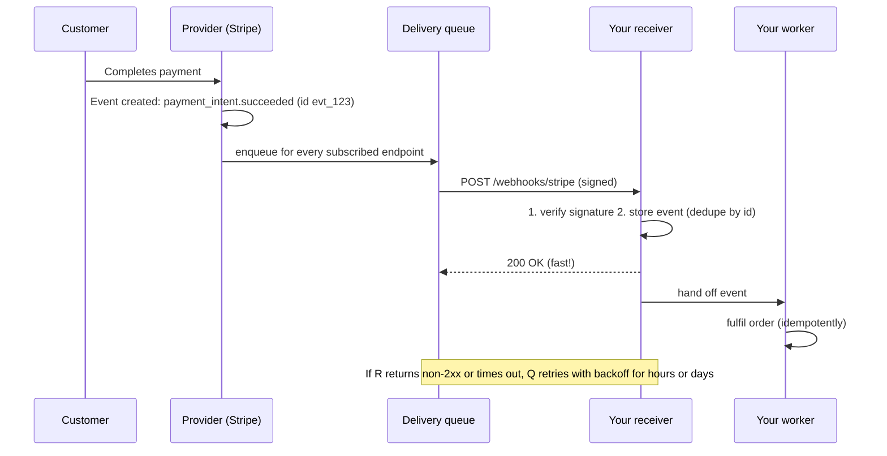
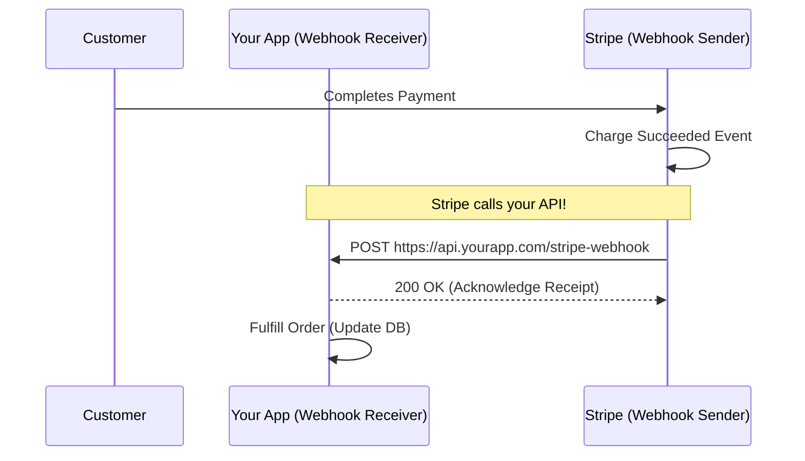
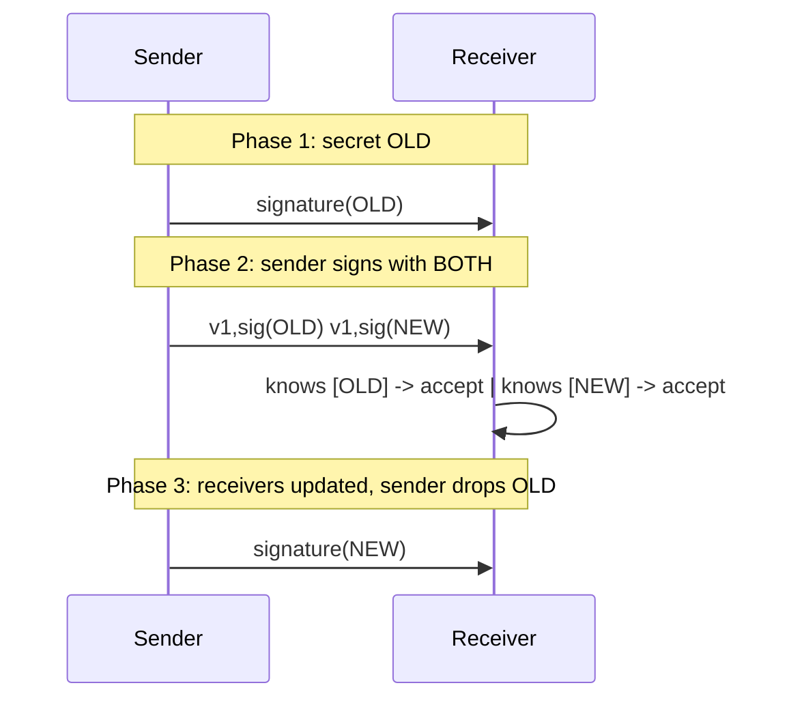

# Webhooks Theory

<div data-viz="api-webhooks"></div>

## What is a Webhook?
A Webhook is often called a "Reverse API." Instead of a client continuously asking a server if new data is available (Polling), the client gives the server a URL. When an event happens on the server, the server makes an HTTP `POST` request to the client's URL with the event data.

The terms are easy to mix up, so fix them once:

| | Who owns the URL | Who makes the request |
| :--- | :--- | :--- |
| Ordinary API | The provider | The client |
| **Webhook** | **The consumer** (you) | **The provider** |

Webhooks are plain HTTP, so there is no new protocol. The engineering is entirely in **trust** (is this really from the provider?), **reliability** (what if my server is down?) and **safety** (what if a customer registers a hostile URL?).

> **Analogy:** Polling is walking to the post office every hour to ask "any mail?". A webhook is leaving your address with the post office so the postman rings your bell when a parcel arrives. If you are out, a good postman tries again later; if the bell rings for a fake "parcel", you must check who is at the door.

### Polling vs Webhooks
*   **Polling:** "Are we there yet?" ... "No." ... "Are we there yet?" ... "No." (Wastes bandwidth, CPU, and API rate limits).
*   **Webhooks:** "Wake me up when we get there." (Efficient, instant, event-driven).

| | Polling | Webhooks |
| :--- | :--- | :--- |
| **Latency** | Up to one polling interval | Near real time |
| **Cost** | Constant, even with no news | Proportional to events |
| **Reliability** | You control it: missed poll = next poll catches up | Depends on delivery, retries, your uptime |
| **Firewall / NAT** | Outbound only: works anywhere | You need a **public HTTPS endpoint** |
| **Complexity** | Simple | Signatures, dedupe, retries, security |

The professional pattern is **both**: webhooks for speed, plus a periodic **reconciliation poll** (or a `GET /events?after=...` API) that catches anything a webhook missed.

## The Lifecycle of an Event



## Real-World Scenario & Architecture

**Scenario:** Integrating Stripe for payments. When a user pays on Stripe's hosted checkout, Stripe needs to tell your backend so you can fulfill the order.



Why the browser redirect is not enough: the customer may close the tab after paying, so the "success page" never loads. The webhook is the **reliable** signal; the redirect is only a courtesy.

## Anatomy of a Delivery

```http
POST /webhooks/stripe HTTP/1.1
Host: api.yourapp.com
Content-Type: application/json
User-Agent: Acme-Webhooks/1.0
Webhook-Id: evt_1N4xYz
Webhook-Timestamp: 1790004198
Webhook-Signature: t=1790004198,v1=d3f4737fc376d6acfbab57ba220c0864d302c301f8d3...

{
  "id": "evt_1N4xYz",
  "type": "invoice.paid",
  "created": 1790004198,
  "api_version": "2026-01-01",
  "data": { "object": { "id": "in_9", "amount_paid": 4999, "currency": "usd" } }
}
```

A well-designed **event envelope** carries:

| Field | Why |
| :--- | :--- |
| `id` | Unique and **stable across retries**: the receiver's dedupe key |
| `type` | Dotted, past tense (`invoice.paid`, `order.shipped`): something *has happened* |
| `created` | When it happened (not when it was delivered) |
| `api_version` | Which payload shape, so you can evolve without breaking receivers |
| `data` | The payload |

### Fat vs thin payloads

| | Fat (full object inside) | Thin (ids only) |
| :--- | :--- | :--- |
| Receiver work | None: everything is in the event | Must `GET` the resource from your API |
| Freshness | Snapshot may be **stale** by processing time | Always current |
| Size and privacy | Larger, leaks more data over the wire | Small, minimal data exposure |
| Failure mode | Out-of-order events overwrite newer state | Extra API call can itself fail or be rate limited |

Many platforms send a fat payload but tell receivers to **treat it as a hint and fetch the current state** for anything that matters.

## Security: Trust Nothing Until Verified

Your endpoint is a **public URL**. Anyone can `POST` `{"type":"payment.succeeded"}` to it. The provider and you share a **secret**; the provider signs each request, you recompute and compare.

```arch
%% caption: Recompute the signature from the raw body and compare in constant time before doing any work.
node b "Raw request body" at 0,0 icon=doc
node s "Shared secret" at 2,0 icon=key
node h "HMAC-SHA256" at 1,1 icon=lock sub="(secret, timestamp + '.' + body)"
node c "Matches header signature?" at 1,2 shape=diamond color=amber w=150 sub="constant-time compare"
node ok "Accept" at 0,3 color=green sub="parse and process"
node no "401: reject" at 2,3 color=red sub="do no work"
b -> h
s -> h
h -> c
c -> ok : "match"
c -> no : "mismatch"
```

The rules that separate a secure check from a decorative one:

1.  **Verify the raw bytes.** `json.loads` then `json.dumps` changes spacing and key order, so the signature no longer matches. Capture the raw body *before* your framework parses it. (Python lab 1 proves it: the same JSON re-formatted is rejected.)
2.  **Constant-time comparison** (`hmac.compare_digest`, `hmac.Equal`). Plain `==` returns at the first differing byte, leaking timing information.
3.  **Verify first, parse second, act third.** On failure: `401`, no side effects.
4.  **Include a timestamp in the signed content and enforce a tolerance** (typically 5 minutes). Otherwise a captured request can be **replayed** forever. The timestamp must be signed, so an attacker cannot refresh it.
5.  **Dedupe on the event id** (also a replay defence inside the window).
6.  **Per-endpoint secrets**, stored in a secrets manager, **rotated** without downtime (below).
7.  **HTTPS only.** TLS protects the secret-derived signature *and* the payload's confidentiality.
8.  **Bound everything**: body size (`MaxBytesReader`), timeouts.
9.  **Optional extras**: IP allow-lists (providers publish sender ranges; brittle but cheap), mTLS.

### Real providers, different formats

| Provider | Header | Signed content | Replay protection |
| :--- | :--- | :--- | :--- |
| GitHub | `X-Hub-Signature-256: sha256=<hex>` | raw body | none built in (dedupe `X-GitHub-Delivery`) |
| Stripe | `Stripe-Signature: t=<ts>,v1=<hex>[,v1=...]` | `<ts>.<body>` | timestamp tolerance |
| Slack | `X-Slack-Signature: v0=<hex>` + `X-Slack-Request-Timestamp` | `v0:<ts>:<body>` | timestamp tolerance |
| **Standard Webhooks** (open spec) | `webhook-id`, `webhook-timestamp`, `webhook-signature: v1,<base64> ...` | `<id>.<ts>.<body>` | timestamp tolerance + id |

Go lab 2 implements the first three with a known-answer test from GitHub's docs and 18 attack cases; Python lab 5 implements the Standard Webhooks scheme and passes the spec's **official test vector**. Prefer the vendor's SDK verifier in production.

### Secret rotation without downtime



The sender emits several `v1` signatures during the overlap; the receiver accepts if **any** matches.

## Delivery Guarantees: At-Least-Once, Unordered

Providers cannot know whether your `200` was lost on the way back, so they **retry until they see 2xx**. Therefore:

*   **At-least-once** delivery: **duplicates are normal.** Exactly-once does not exist over HTTP.
*   **No ordering guarantee**: a retried `order.created` can arrive *after* `order.updated`.
*   **Bursts**: after your outage, thousands of events arrive at once.

> **Key idea:** A webhook receiver must be **idempotent** and **order-tolerant**. "Exactly-once *effect*" = at-least-once delivery + idempotent handling.

### What senders typically do

| Concern | Typical policy |
| :--- | :--- |
| Timeout | 5-30 s; a slow response counts as a failure |
| Success | Any `2xx` |
| Retry | Exponential backoff with jitter over hours or days (e.g. 10 s, 1 min, 5 min, 30 min, 2 h, 5 h, ...) |
| `410 Gone` | Disable the endpoint |
| `429` / `503` + `Retry-After` | Obey the receiver's pacing |
| Persistent failure | Auto-disable the endpoint after N failures, email the owner |
| Exhausted retries | **Dead-letter** queue + manual **replay** |
| Redirects | Never follow |

Python lab 3 builds this engine with virtual time (days of retries in milliseconds); Go lab 3 does it with real HTTP, a worker pool, and per-endpoint limits.

## Building a Robust Receiver

```arch
%% caption: Verify, record the event id, answer 200 at once; the real work happens later in a worker.
node r "POST /webhook" at 0,0 shape=pill color=slate
node v "Verify signature" at 0,1 icon=auth sub="bounded raw body"
node x "401" at 1,1 color=red
node i "INSERT INTO inbox" at 0,2 icon=sql sub="(event_id ...) UNIQUE(event_id)"
node a "200 immediately" at 1,2 color=green
node w "Background worker" at 0,3 icon=worker
node d "Business logic" at 0,4 icon=db sub="idempotent"
r -> v
v -> x : "invalid"
v -> i
i -> a
i ..> w
w -> d
```

1.  **Acknowledge fast.** Do only the cheap, durable thing (store the raw event), then return `2xx`. If you process inline, slow work → timeouts → retries → duplicates → more load.
2.  **Dedupe atomically.** A `UNIQUE(event_id)` constraint is race-free; an in-memory `if id in seen` check is not. Python lab 4 fires the same event from 12 threads with separate database connections: exactly one is processed.
3.  **Tolerate out-of-order events.** Apply an update only if it is newer (`WHERE excluded.version > orders.version`), or re-fetch current state. Lab 4 receives `v2` before `v1` and keeps `v2`.
4.  **Survive crashes.** Store first, process later; a worker that crashes leaves the row pending and it is retried. Nothing is lost.
5.  **Apply back-pressure honestly.** If your queue is full, return `503` + `Retry-After` rather than accept events you will lose. (Go lab 1: a burst of 12 events, 4 accepted, 8 told to retry.)
6.  **Reconcile.** Periodically compare with the provider's API to catch events that never arrived.
7.  **Return the right code.** `2xx` = "got it, stop retrying". Do **not** return `2xx` for an event you failed to store. Return `2xx` even for events you **do not care about** (ignore them), or the sender will retry forever.

### Python (stdlib) and Go receivers

```python
raw = self.rfile.read(length)                                     # RAW bytes
if not hmac.compare_digest(sign(SECRET, raw), self.headers.get("X-Signature", "")):
    return self.reply(401, "invalid signature")                   # reject BEFORE parsing
event = json.loads(raw)
db.execute("INSERT INTO inbox(event_id, payload) VALUES (?, ?) ON CONFLICT(event_id) DO NOTHING", ...)
return self.reply(200, "ok")                                      # duplicates get 200 too
```

```go
r.Body = http.MaxBytesReader(w, r.Body, 1<<20)
raw, _ := io.ReadAll(r.Body)
got, err := hex.DecodeString(r.Header.Get("X-Signature"))
m := hmac.New(sha256.New, secret); m.Write(raw)
if err != nil || !hmac.Equal(got, m.Sum(nil)) {
	http.Error(w, "invalid signature", http.StatusUnauthorized)
	return
}
select {
case queue <- event: // hand off; never block the response on business logic
default:
	w.Header().Set("Retry-After", "5")
	http.Error(w, "busy", http.StatusServiceUnavailable)
}
```

## Being the Sender: Running a Webhook Platform

If **you** offer webhooks to your customers, you own a distributed delivery system:

| Component | Purpose | Lab |
| :--- | :--- | :--- |
| Event envelope + signing | Stable ids, versioning, HMAC with timestamp | Python 2 |
| Delivery queue + workers | Bounded concurrency, retries with jitter | Python 3, Go 3 |
| **Per-endpoint isolation** | One slow customer must not starve the rest (non-blocking semaphore) | Go 3 |
| **Circuit breaker** | Stop hammering a failing endpoint; probe with one request to detect recovery | Go 5 |
| Subscriptions | Endpoints choose event types (`invoice.*`) | Go 5 |
| Per-endpoint secrets and rotation | A leak affects one customer; roll secrets without downtime | Python 5, Go 5 |
| Delivery log, replay, test event | Self-service debugging: "recent deliveries", "resend", "send test event" | Go 5 |
| **SSRF protection** | Customers choose the URL your servers call | Go 4 |
| Transactional outbox | Write the event and the business change in **one DB transaction**, publish from the outbox, so no event is lost or phantom | below |

**The outbox pattern:** if you update your database and *then* enqueue a webhook, a crash in between loses the event; enqueue first and the event describes something that never committed. Instead, write an `events` row in the **same transaction** as the change, and let a relay publish rows from that table.

### SSRF: your servers call attacker-chosen URLs

A malicious customer registers `http://169.254.169.254/latest/meta-data/iam/security-credentials/` (cloud credentials), `http://localhost:6379/` (Redis), or an internal admin API. Your delivery workers, inside your network, obediently fetch it.

*   **Validating the URL is not enough.** DNS rebinding (a name resolves to a public IP at check time and to `127.0.0.1` at connect time), numeric tricks (`2130706433`, `0x7f000001`, `127.1`, `::ffff:127.0.0.1`), and **redirects** all bypass a pre-check.
*   **The fix: check the IP at connect time**, in `net.Dialer.Control`, which sees the address the socket is really about to use. Block loopback, private, link-local (metadata), CGNAT, multicast, unspecified.
*   Also: **never follow redirects**, ignore proxy environment variables, **HTTPS only**, tight timeouts, bounded response reads, and **never show the response body to the customer**.

Go lab 4 demonstrates every attack: a naive client leaks a fake AWS secret, the guarded client refuses 14 destinations, blocks the redirect attack, and stops a simulated DNS-rebinding attack that defeats check-then-connect.

## Testing and Debugging Webhooks

| Need | Tool |
| :--- | :--- |
| Receive webhooks on your laptop | A tunnel: `ngrok`, `cloudflared`, or the provider's CLI (`stripe listen --forward-to localhost:8080/webhook`) |
| Inspect payloads | webhook.site, RequestBin, or your own request logger |
| Trigger events | Provider's dashboard "send test event" or CLI (`stripe trigger payment_intent.succeeded`) |
| Reproduce a bad delivery | **Replay** from the delivery log; the same event id lets you test your dedupe |
| Automated tests | Sign the payload with your test secret and POST it; test tampering, replays and duplicates as the labs do |

## Webhooks vs the Alternatives

| | Webhooks | Polling | WebSockets | Message queue (SQS, Kafka) |
| :--- | :--- | :--- | :--- | :--- |
| Direction | Provider to your server | You to provider | Both | Producer to consumer |
| Needs public endpoint | **Yes** | No | No (client connects out) | No |
| Delivery guarantee | At-least-once (HTTP retries) | You control | Connection-bound | At-least-once, durable, ordered per key |
| Between companies | Excellent | Fine | Awkward | Needs shared infrastructure |
| Best for | Cross-organisation events | Simple, low-frequency sync | Browsers, live UIs | Inside one organisation |

## Common Pitfalls

1.  **Verifying a re-serialised body** instead of the raw bytes.
2.  **Using `==`** to compare signatures.
3.  **No timestamp tolerance**: replayable forever.
4.  **Slow inline processing** (timeouts → retries → duplicates).
5.  **Not deduplicating** (double emails, double shipments) or deduping with a racy in-memory set.
6.  **Assuming order**: overwriting new state with a late old event.
7.  **Returning `200` before persisting** the event (a crash loses it), or returning `500` for events you simply do not handle (retries forever).
8.  **Sender side: following redirects / no SSRF guard / logging secrets.**
9.  **Sender side: no per-endpoint isolation**, so one dead customer stalls everyone.
10. **No reconciliation path**: a missed webhook is permanent data drift.

## Check Yourself

> ❓ **Question 1:** Your handler does `data = request.json()`, then recomputes the HMAC of `json.dumps(data)`. Verification randomly fails in production. Why?
>
> ❓ **Question 2:** A provider retries an event three times because your server timed out at 30 s, though it *did* process the event on the first try. What guards you against double fulfilment?
>
> ❓ **Question 3:** `order.updated` (v2) arrives before `order.created` (v1). What do you do?
>
> ❓ **Question 4:** An attacker records a valid signed request and replays it two hours later. Which mechanisms stop it?
>
> ❓ **Question 5 (sender):** A customer registers `http://evil.example.com/`, whose DNS answers `93.184.216.34` for your validation lookup and `169.254.169.254` a millisecond later. How do you defend?

**Answers**

1.  Re-serialising changes bytes (whitespace, key order, unicode escaping), so the HMAC of the new bytes differs from the signature computed over the sender's exact bytes. Verify the **raw** request body.
2.  Idempotency: a `UNIQUE(event_id)` inbox row (or an idempotent business operation keyed by event/order id). The retry gets `200` and is not processed again. Also acknowledge fast so it does not time out.
3.  Never assume order. Apply updates only if they are newer than the stored version (compare `version`/`created`), or fetch the current state from the provider; ignore the stale one.
4.  The signed timestamp with a tolerance window (an old timestamp is rejected, and the attacker cannot change it without breaking the signature), plus deduplication on the event id inside the window.
5.  Validate at **connect time**, not before: a `net.Dialer.Control` hook sees the real destination IP after DNS and rejects private/loopback/link-local addresses; also refuse redirects, ignore proxy settings, and use https-only.

## Hands-On Labs

Every lab is one file that runs on its own and prints what happens. Labs 1-2 teach the basics; labs 3-5 are advanced. **Python and Go cover different ground**, so do both.

Setup from the `API/` folder: `pip install -r requirements.txt` (the Python labs use only the standard library).

| # | Python (`Webhooks/labs/python/`) | You learn |
| :---: | :--- | :--- |
| 1 | `01_receiver_hmac_verification.py` | HMAC verification of the raw body, constant-time compare, five attacks rejected, why re-serialising breaks it |
| 2 | `02_sender_signed_events.py` | Event envelope, fat vs thin payloads, timestamped signatures, real HTTP delivery and its failure modes |
| 3 | `03_retries_backoff_dead_letter.py` | A delivery engine in virtual time: jittered backoff, `Retry-After`, `410`, dead letters, replay, auto-disable |
| 4 | `04_idempotent_async_receiver.py` | Store-then-process inbox with `UNIQUE` dedupe (12-thread race), out-of-order updates, crash recovery, ack speed |
| 5 | `05_standard_webhooks_replay_and_rotation.py` | The Standard Webhooks scheme with the official test vector, replay protection, zero-downtime secret rotation |

| # | Go (`Webhooks/labs/golang/`) | You learn |
| :---: | :--- | :--- |
| 1 | `01_receiver_net_http` | `MaxBytesReader`, HMAC verify, bounded queue with `503 + Retry-After` back-pressure, graceful worker drain |
| 2 | `02_provider_signature_schemes` | Stripe, GitHub and Slack verification, GitHub's official vector, 18 table-driven attack cases |
| 3 | `03_delivery_worker_pool` | Worker pool, per-endpoint concurrency cap without head-of-line blocking, timeouts, no redirects, graceful `Stop` |
| 4 | `04_ssrf_safe_sender` | Connect-time IP guard in `Dialer.Control`, numeric-IP tricks, redirect attack, DNS rebinding |
| 5 | `05_subscriptions_breaker_and_replay` | Subscription globs, per-endpoint secrets, circuit breaker states, delivery log API, replay, test event |

```bash
python Webhooks/labs/python/04_idempotent_async_receiver.py
go run -race ./Webhooks/labs/golang/03_delivery_worker_pool
```

## Exercises

1.  Combine Python labs 1, 4 and 5 into one receiver (Standard Webhooks verification, then the inbox) and add a `/healthz` endpoint.
2.  Add exponential backoff to Go lab 1's `503` path on a *simulated sender* and prove no event is lost across a receiver restart.
3.  Implement the **transactional outbox** with SQLite: a business table and an `events` table updated in one transaction, plus a relay loop that publishes unsent rows.
4.  Extend Go lab 4's `isBlocked` with your own cloud's internal ranges and write table tests.
5.  Add HMAC secret rotation (multiple `v1=` signatures) to Go lab 5's sender.
6.  Run a real tunnel (`ngrok` or `cloudflared`) to Python lab 1's `--serve` mode and send it a signed `curl` request from another machine.

## Where To Go Next

*   **`REST/`**: webhooks are ordinary REST calls; idempotency keys and ETags (REST labs 4-5) are the same ideas.
*   **`WebSockets/`**: when the consumer is a browser and needs push, not a server.
*   **`Fundamentals/03_cross_cutting_concerns.md`**: idempotency, retries with jitter, rate limiting, security checklist.
