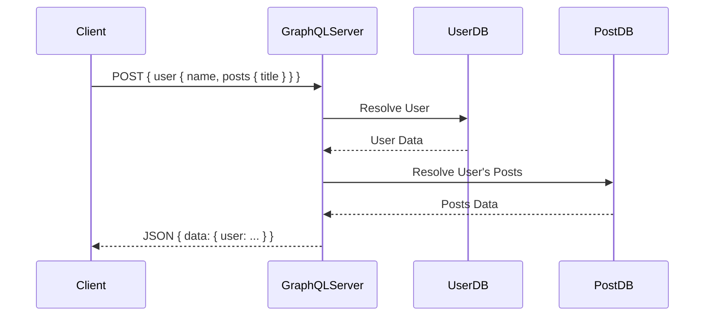

# GraphQL: Core Architecture & System Design

## Architectural Diagram & Visualization

<div data-viz="api-graphql"></div>




## 1. Core Architecture & System Design

### Deep Dive
**GraphQL** is a query language for APIs and a runtime for fulfilling those queries. Instead of relying on multiple <abbr title="Representational State Transfer - An architectural style for distributed hypermedia systems, commonly used for creating interactive web services.">REST</abbr> endpoints, GraphQL exposes a single endpoint (usually `POST /graphql`) and allows the client to dictate exactly what shape of data it needs.
- **Schema-Driven**: The server defines a strongly typed schema using GraphQL Schema Definition Language (SDL).
- **Resolvers**: Each field in a GraphQL query is backed by a function called a resolver. The GraphQL execution engine traverses the query and calls these resolvers to fetch data from databases, microservices, or external APIs.
- **Request/Response Lifecycle**:
  1. Client sends a POST request with a GraphQL query (string) and variables (<abbr title="JavaScript Object Notation - A lightweight data-interchange format that is easy for humans to read/write and machines to parse/generate.">JSON</abbr>).
  2. Server parses and validates the query against the Schema.
  3. The Execution Engine traverses the query tree (<abbr title="Abstract Syntax Tree. A tree representation of the abstract syntactic structure of source code written in a programming language.">AST</abbr>) and runs resolvers concurrently where possible.
  4. The engine constructs a single <abbr title="JavaScript Object Notation - A lightweight data-interchange format that is easy for humans to read/write and machines to parse/generate.">JSON</abbr> response mirroring the exact structure requested by the client.

### Trade-offs
**Pros:**
- **No Over/Under-fetching**: The client gets exactly the data it asks for, no more, no less. Ideal for mobile networks.
- **Single Request Payload**: Complex views requiring data from 5 different databases can be resolved in one <abbr title="Hypertext Transfer Protocol - The foundation of data communication for the World Wide Web, operating on a client-server model.">HTTP</abbr> request from the client's perspective.
- **Strongly Typed**: The schema serves as strict <abbr title="Application Programming Interface">API</abbr> documentation. Tooling (GraphiQL, Apollo) auto-generates types for front-end frameworks.
- **<abbr title="Application Programming Interface">API</abbr> Evolution**: You can deprecate individual fields in the schema without versioning the entire <abbr title="Application Programming Interface">API</abbr> (`/v1` vs `/v2`).

**Cons:**
- **N+1 Query Problem**: If a query asks for a list of 10 users and their 5 recent posts, naive resolvers will hit the database 1 time for users, and 10 times for posts (1+10). (Requires DataLoader pattern to fix).
- **Caching Complexity**: <abbr title="Hypertext Transfer Protocol - The foundation of data communication for the World Wide Web, operating on a client-server model.">HTTP</abbr> caching (<abbr title="Content Delivery Network - A geographically distributed network of proxy servers and their data centers used to deliver content with low latency.">CDN</abbr> layer) breaks down because everything is a POST request to `/graphql`. You must rely on complex client-side caching (e.g., Apollo Client caching via `__typename` and `id`).
- **Security & Complexity**: Clients can write deep, recursive queries that crash the backend (requires query depth limiting and cost analysis).

### System Design Fit
**Optimal Scenarios:**
- **Backend-For-Frontend (BFF)**: An <abbr title="Application Programming Interface">API</abbr> Gateway aggregating data from multiple underlying microservices into one clean schema for mobile/web clients.
- **Complex UI Dashboards**: UIs where different components need vastly different slices of the data model.
- **Federation**: Stitching together multiple independent GraphQL APIs across different teams into one "Supergraph" (Apollo Federation).

**Anti-Patterns:**
- **Simple <abbr title="Create, Read, Update, Delete - The four basic functions of persistent storage operations, commonly used in database and <abbr title="Application Programming Interface - A set of rules and protocols that allows different software applications to communicate with each other.">API</abbr> design.">CRUD</abbr> Services**: Overkill if the client just needs a simple list of identical objects.
- **Binary/File Streaming**: GraphQL is terrible at handling large file uploads or binary streams.

---

## 2. Diagrams & Animated Visualizations

### Architecture Diagram
```arch
%% caption: The gateway parses a nested query, resolves each field, and batches the fetches out to the underlying data sources.
group Client "Mobile / Web App" icon=mobile color=slate
node A "Apollo / Relay Client" at 0,0 in Client icon=graphql
group API_Layer "GraphQL Gateway" icon=gateway color=purple
node B "Query Parser" at 0,1 in API_Layer icon=code
node C "Resolver Engine" at 1,1 in API_Layer icon=graphql
node D "DataLoader / Batching" at 2,1 in API_Layer icon=layers
group Data_Sources "Microservices / DBs" icon=db color=green
node E "Postgres - Users" at 1,2 in Data_Sources icon=postgresql
node F "MongoDB - Posts" at 2,2 in Data_Sources icon=mongodb-icon
node G "REST API - Payments" at 0,2 in Data_Sources icon=payment
A -> B : "POST { user { name,\nposts { title } } }"
B -> C -> D
D:B -> E:T : "Fetch User"
D -> F : "Fetch Posts"
```

### Animated Flow Visualization
Save the block below as an HTML file (e.g. `graphql-anim.html`) or paste it into a browser.

```html
<!DOCTYPE html>
<html lang="en">
<head>
<meta charset="UTF-8">
<style>
  body { background-color: #1e1e1e; color: #fff; font-family: monospace; display: flex; justify-content: center; align-items: center; height: 100vh; margin: 0; }
  .container { position: relative; width: 650px; height: 400px; background: #2d2d2d; border-radius: 8px; border: 1px solid #444; overflow: hidden; display: flex;}
  .pane { flex: 1; padding: 20px; box-sizing: border-box; border-right: 1px solid #444; }
  .query { color: #c678dd; }
  .field { color: #e5c07b; margin-left: 20px; animation: resolveField 4s infinite; opacity: 0.3;}
  .json-key { color: #e06c75; margin-left: 20px; }
  .json-val { color: #98c379; opacity: 0; animation: showVal 4s infinite; }
  
  @keyframes resolveField { 0%, 10% { color: #e5c07b; opacity: 0.3; } 20%, 100% { color: #98c379; opacity: 1; font-weight: bold; } }
  @keyframes showVal { 0%, 20% { opacity: 0; } 30%, 100% { opacity: 1; } }

  .anim-delay-1 { animation-delay: 1s; }
  .anim-delay-2 { animation-delay: 2s; }
  .anim-delay-3 { animation-delay: 3s; }
</style>
</head>
<body>
  <div class="container">
    <div class="pane">
      <h3>Client Request</h3>
      <div><span class="query">query</span> {</div>
      <div class="field">user(id: 1) {</div>
      <div class="field anim-delay-1">name</div>
      <div class="field anim-delay-2">posts {</div>
      <div class="field anim-delay-3" style="margin-left: 40px">title</div>
      <div class="field anim-delay-2">}</div>
      <div class="field">}</div>
      <div>}</div>
    </div>
    <div class="pane" style="border: none;">
      <h3>Server Response</h3>
      <div>{</div>
      <div class="json-key">"data": {</div>
      <div class="json-key" style="margin-left: 40px">"user": {</div>
      <div class="json-key" style="margin-left: 60px">"name": <span class="json-val anim-delay-1">"Alice"</span>,</div>
      <div class="json-key" style="margin-left: 60px">"posts": [</div>
      <div class="json-key" style="margin-left: 80px">{ "title": <span class="json-val anim-delay-3">"GraphQL Guide"</span> }</div>
      <div class="json-key" style="margin-left: 60px">]</div>
      <div class="json-key" style="margin-left: 40px">}</div>
      <div class="json-key">}</div>
      <div>}</div>
    </div>
  </div>
</body>
</html>
```

---

## 3. Five Real-World Use Cases & Implementations

### Use Case 1: Simple Schema Setup and Resolver
**System Design Fit:** Setting up the single `/graphql` endpoint that resolves a basic `User` query.

#### Golang (using `github.com/graphql-go/graphql`)
```go
package main

import (
	"encoding/json"
	"net/http"
	"github.com/graphql-go/graphql"
)

var userType = graphql.NewObject(graphql.ObjectConfig{
	Name: "User",
	Fields: graphql.Fields{
		"id":   &graphql.Field{Type: graphql.String},
		"name": &graphql.Field{Type: graphql.String},
	},
})

var rootQuery = graphql.NewObject(graphql.ObjectConfig{
	Name: "RootQuery",
	Fields: graphql.Fields{
		"user": &graphql.Field{
			Type: userType,
			Args: graphql.FieldConfigArgument{"id": &graphql.ArgumentConfig{Type: graphql.String}},
			Resolve: func(p graphql.ResolveParams) (interface{}, error) {
				// Fetch user from DB based on ID
				return map[string]string{"id": p.Args["id"].(string), "name": "Alice"}, nil
			},
		},
	},
})

func main() {
	schema, _ := graphql.NewSchema(graphql.SchemaConfig{Query: rootQuery})
	
	http.HandleFunc("/graphql", func(w http.ResponseWriter, r *http.Request) {
		var req struct { Query string `json:"query"` }
		json.NewDecoder(r.Body).Decode(&req)
		
		result := graphql.Do(graphql.Params{Schema: schema, RequestString: req.Query})
		json.NewEncoder(w).Encode(result)
	})
	http.ListenAndServe(":8080", nil)
}
```

#### Python (using `strawberry` + `fastapi`)
```python
import strawberry
from fastapi import FastAPI
from strawberry.fastapi import GraphQLRouter

@strawberry.type
class User:
    id: str
    name: str

@strawberry.type
class Query:
    @strawberry.field
    def user(self, id: str) -> User:
        return User(id=id, name="Alice")

schema = strawberry.Schema(query=Query)
graphql_app = GraphQLRouter(schema)

app = FastAPI()
app.include_router(graphql_app, prefix="/graphql")
```

---

### Use Case 2: Solving N+1 with DataLoaders
**System Design Fit:** When a query requests `Users -> Posts`, DataLoaders batch the post requests to the DB to prevent hundreds of individual <abbr title="Structured Query Language. A standard language for storing, manipulating and retrieving data in databases.">SQL</abbr> queries.

#### Golang (using `github.com/graph-gophers/dataloader`)
```go
// Concept Outline
func PostBatchFn(ctx context.Context, keys dataloader.Keys) []*dataloader.Result {
	// Keys contain all User IDs requested in this tick
	// SELECT * FROM posts WHERE user_id IN (?, ?, ?)
	
	// Map DB results back to the exact order of `keys`
	results := make([]*dataloader.Result, len(keys))
	// ... populate results ...
	return results
}

// In Resolver:
// return dataLoader.Load(ctx, dataloader.StringKey(userID))
```

#### Python (using `strawberry.dataloader`)
```python
from strawberry.dataloader import DataLoader
from typing import List

async def load_posts_for_users(keys: List[str]):
    # Batch Database Query
    # SELECT * FROM posts WHERE user_id IN keys
    posts_by_user = {"u1": ["Post 1"], "u2": ["Post 2"]}
    return [posts_by_user.get(key, []) for key in keys]

post_loader = DataLoader(load_fn=load_posts_for_users)

@strawberry.type
class User:
    id: str
    
    @strawberry.field
    async def posts(self) -> List[str]:
        # Enqueues the request. Loader waits a tick, batches keys, and executes load_posts_for_users
        return await post_loader.load(self.id)
```

---

### Use Case 3: GraphQL Mutations (Creating Data)
**System Design Fit:** Mutations are used for any write operations. They return data just like queries, which is useful for updating the UI immediately.

#### Golang (Adding Mutation to Schema)
```go
var rootMutation = graphql.NewObject(graphql.ObjectConfig{
	Name: "RootMutation",
	Fields: graphql.Fields{
		"createUser": &graphql.Field{
			Type: userType,
			Args: graphql.FieldConfigArgument{"name": &graphql.ArgumentConfig{Type: graphql.String}},
			Resolve: func(p graphql.ResolveParams) (interface{}, error) {
				newName := p.Args["name"].(string)
				// DB Insert logic
				return map[string]string{"id": "new_id", "name": newName}, nil
			},
		},
	},
})
// schema, _ := graphql.NewSchema(graphql.SchemaConfig{Query: rootQuery, Mutation: rootMutation})
```

#### Python (`strawberry` Mutations)
```python
@strawberry.type
class Mutation:
    @strawberry.mutation
    def create_user(self, name: str) -> User:
        # DB Insert logic here
        return User(id="new_id", name=name)

# schema = strawberry.Schema(query=Query, mutation=Mutation)
```

---

### Use Case 4: <abbr title="Application Programming Interface">API</abbr> Gateway / BFF (Wrapping <abbr title="Representational State Transfer - An architectural style for distributed hypermedia systems, commonly used for creating interactive web services.">REST</abbr>)
**System Design Fit:** The backend GraphQL server acts as a proxy, fetching data from an old <abbr title="Representational State Transfer - An architectural style for distributed hypermedia systems, commonly used for creating interactive web services.">REST</abbr> <abbr title="Application Programming Interface">API</abbr> and providing it to the client via GraphQL.

#### Golang (Resolver calling <abbr title="Representational State Transfer - An architectural style for distributed hypermedia systems, commonly used for creating interactive web services.">REST</abbr>)
```go
func UserResolver(p graphql.ResolveParams) (interface{}, error) {
	// Instead of hitting DB, GraphQL acts as an API gateway
	resp, err := http.Get("http://internal-legacy-api/users/" + p.Args["id"].(string))
	if err != nil { return nil, err }
	defer resp.Body.Close()
	
	var user map[string]interface{}
	json.NewDecoder(resp.Body).Decode(&user)
	return user, nil
}
```

#### Python (Resolver calling <abbr title="Representational State Transfer - An architectural style for distributed hypermedia systems, commonly used for creating interactive web services.">REST</abbr>)
```python
import httpx

@strawberry.type
class Query:
    @strawberry.field
    async def legacy_user(self, id: str) -> User:
        async with httpx.AsyncClient() as client:
            resp = await client.get(f"http://internal-legacy-api/users/{id}")
            data = resp.json()
            return User(id=data["id"], name=data["name"])
```

---

### Use Case 5: GraphQL Subscriptions (Real-time WebSockets)
**System Design Fit:** GraphQL can maintain a persistent WebSocket connection to push live data (like chat messages) to the client using the `subscription` keyword.

#### Golang (Concept)
```go
// Subscriptions in Go require WebSockets and complex pub/sub wiring.
// Frameworks like `gqlgen` handle the heavy lifting for WebSockets via `graphql-ws` subprotocol.
```

#### Python (using `strawberry` Subscriptions)
```python
import asyncio
from typing import AsyncGenerator

@strawberry.type
class Subscription:
    @strawberry.subscription
    async def count(self, target: int = 10) -> AsyncGenerator[int, None]:
        for i in range(target):
            yield i
            await asyncio.sleep(1)

# schema = strawberry.Schema(query=Query, subscription=Subscription)
# Client connects via ws:// to the GraphQL endpoint.
```
