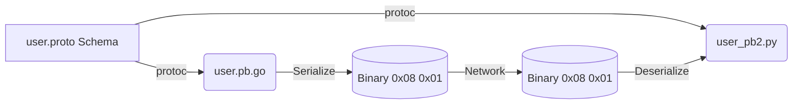
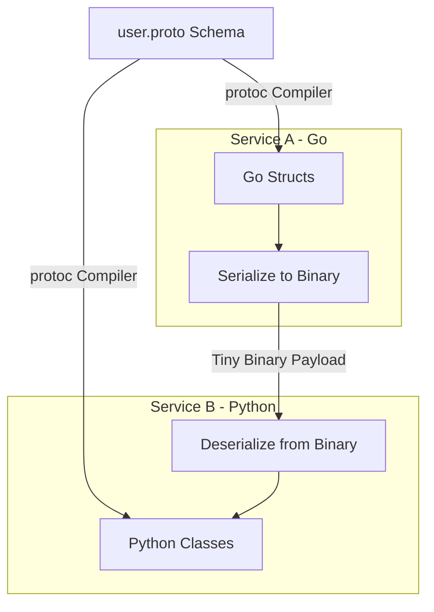

# Protocol Buffers (Protobuf): Core Architecture & System Design

## Architectural Diagram & Visualization

<div data-viz="api-protobuf"></div>




## 1. Core Architecture & System Design

### Deep Dive
**Protocol Buffers (Protobuf)** is a language-neutral, platform-neutral extensible mechanism for serializing structured data developed by Google. Unlike JSON or XML which are text-based, Protobuf encodes data into a highly compressed binary format.
- **Schema-First**: You define how you want your data to be structured in a `.proto` file.
- **Compiler (`protoc`)**: This file is compiled to generate native source code (classes/structs) in your programming language of choice (Go, Python, Java, C++, etc.).
- **Binary Encoding**: Under the hood, Protobuf uses Base-128 Varints to compress integers and assigns numeric tags (e.g., `= 1;`) to fields instead of sending the string field names (like `"user_id": 1` in JSON). This strips out massive amounts of metadata overhead.

### Trade-offs
**Pros:**
- **Lightning Fast & Tiny Footprint**: Serialization/deserialization is CPU-efficient, and the resulting binary payload is exponentially smaller than JSON.
- **Strict Typing & Contracts**: No more guessing if a field is a string or an int. The generated code strictly enforces the schema.
- **Forward & Backward Compatibility**: As long as you don't change the numeric tags of existing fields, you can add new fields or remove old ones without breaking legacy clients.

**Cons:**
- **Not Human-Readable**: You cannot simply `console.log` or Wireshark a Protobuf payload without the original `.proto` file to decode the binary tags.
- **No Native Browser Support**: Browsers expect JSON. Protobuf requires additional JavaScript libraries to decode, which can inflate bundle sizes.
- **No Dynamic Schemas**: If your data structure changes dynamically per request, JSON is much better. Protobuf requires predefined structures.

### System Design Fit
**Optimal Scenarios:**
- **gRPC Payloads**: It is the default serialization mechanism for gRPC.
- **Message Queues & Event Streaming**: Writing binary Protobuf to Kafka, RabbitMQ, or Redis Pub/Sub reduces storage costs and network I/O dramatically compared to JSON.
- **Data Storage**: Saving highly compressed data structures directly to databases or file systems (e.g., Parquet integrates well with Protobuf concepts).

**Anti-Patterns:**
- **Public REST APIs**: External consumers prefer JSON because it doesn't require downloading and compiling a `.proto` schema file.
- **Configuration Files**: Use YAML or JSON for config files; Protobuf is for machine-to-machine data.

---

## 2. Diagrams & Animated Visualizations

### Architecture Diagram


### Animated Flow Visualization (JSON vs Protobuf Size Comparison)
Save the block below as an HTML file (e.g. `protobuf-anim.html`) or paste it into a browser.

```html
<!DOCTYPE html>
<html lang="en">
<head>
<meta charset="UTF-8">
<style>
  body { background-color: #1e1e1e; color: #fff; font-family: monospace; display: flex; justify-content: center; align-items: center; height: 100vh; margin: 0; }
  .container { position: relative; width: 600px; height: 350px; background: #2d2d2d; border-radius: 8px; border: 1px solid #444; padding: 20px; box-sizing: border-box;}
  h3 { text-align: center; color: #aaa; margin-top: 0;}
  
  .track { width: 100%; height: 60px; background: #111; margin-top: 30px; border-radius: 30px; position: relative; display: flex; align-items: center; }
  
  .payload { height: 40px; border-radius: 20px; display: flex; align-items: center; justify-content: center; font-weight: bold; position: absolute; left: 10px; color: #000; }
  
  .json-payload { width: 400px; background: #ef5350; animation: sendJSON 3s infinite; }
  .proto-payload { width: 80px; background: #66bb6a; animation: sendProto 3s infinite; }

  @keyframes sendJSON { 0% { left: 10px; opacity: 1; } 80% { left: 500px; opacity: 1; } 90% { left: 500px; opacity: 0; } 100% { left: 10px; opacity: 0; } }
  @keyframes sendProto { 0% { left: 10px; opacity: 1; } 40% { left: 500px; opacity: 1; } 50% { left: 500px; opacity: 0; } 100% { left: 10px; opacity: 0; } }
  
  .label { position: absolute; top: -25px; font-size: 14px; color: #fff; }
</style>
</head>
<body>
  <div class="container">
    <h3>Data Serialization Transfer Speed & Size</h3>
    
    <div class="track">
      <div class="label">JSON (85 bytes - Slow, High Bandwidth)</div>
      <div class="payload json-payload">{"id":1, "name":"Alice"}</div>
    </div>
    
    <div class="track" style="margin-top: 60px;">
      <div class="label">Protobuf (12 bytes - Fast, Low Bandwidth)</div>
      <div class="payload proto-payload">08011205...</div>
    </div>
  </div>
</body>
</html>
```

---

## 3. Five Real-World Use Cases & Implementations

### Shared Protocol Definition (`models.proto`)
```protobuf
syntax = "proto3";
package models;

message User {
  int32 id = 1;
  string name = 2;
  string email = 3;
}
```
*(Compile with: `protoc --go_out=. models.proto` and `protoc --python_out=. models.proto`)*

---

### Use Case 1: Saving Binary State to Redis
**System Design Fit:** Caching complex objects in Redis. Serializing to Protobuf saves massive amounts of RAM in Redis compared to storing stringified JSON.

#### Golang (Writing to Redis)
```go
package main

import (
	"context"
	"log"
	"github.com/go-redis/redis/v8"
	"google.golang.org/protobuf/proto"
	pb "path/to/models" // Generated package
)

func saveToCache(rdb *redis.Client, user *pb.User) {
	// Serialize struct to binary bytes
	data, err := proto.Marshal(user)
	if err != nil {
		log.Fatal("Marshaling error: ", err)
	}

	// Save tiny binary payload to Redis
	err = rdb.Set(context.Background(), "user:1", data, 0).Err()
	if err != nil {
		log.Fatal(err)
	}
	log.Println("Saved to Redis securely")
}
```

#### Python (Reading from Redis)
```python
import redis
import models_pb2 # Generated file

def read_from_cache():
    r = redis.Redis(host='localhost', port=6379, db=0)
    
    # Fetch binary data
    binary_data = r.get("user:1")
    
    if binary_data:
        # Create an empty User object and parse the binary data into it
        user = models_pb2.User()
        user.ParseFromString(binary_data)
        
        print(f"Loaded from cache: {user.name} ({user.email})")

read_from_cache()
```

---

### Use Case 2: Kafka Event Streaming
**System Design Fit:** Microservices publishing events to Kafka. JSON schema evolution is messy; Protobuf guarantees schema enforcement across the event bus.

#### Golang (Producer)
```go
import (
	"github.com/confluentinc/confluent-kafka-go/kafka"
	"google.golang.org/protobuf/proto"
)

func publishEvent(p *kafka.Producer, user *pb.User) {
	binaryPayload, _ := proto.Marshal(user)
	
	p.Produce(&kafka.Message{
		TopicPartition: kafka.TopicPartition{Topic: &"user_events", Partition: kafka.PartitionAny},
		Value:          binaryPayload,
	}, nil)
}
```

#### Python (Consumer)
```python
from kafka import KafkaConsumer
import models_pb2

consumer = KafkaConsumer('user_events', bootstrap_servers='localhost:9092')

for msg in consumer:
    user_event = models_pb2.User()
    # Deserialize Kafka binary message value
    user_event.ParseFromString(msg.value)
    
    print(f"Processed Event for User: {user_event.id}")
```

---

### Use Case 3: Storing Data to Disk (File/Object Storage)
**System Design Fit:** Writing millions of records to disk or AWS S3 for analytics. Protobuf files are vastly smaller than CSV or JSON Lines.

#### Golang (Writing binary file)
```go
import (
	"os"
	"google.golang.org/protobuf/proto"
)

func writeToFile(user *pb.User) {
	data, _ := proto.Marshal(user)
	
	// Append binary data directly to file
	f, _ := os.OpenFile("users.bin", os.O_APPEND|os.O_CREATE|os.O_WRONLY, 0644)
	defer f.Close()
	
	f.Write(data)
}
```

#### Python (Reading binary file)
```python
import models_pb2

def read_from_file():
    with open("users.bin", "rb") as f:
        data = f.read()
        # Note: If multiple messages are in the file, you need size prefixes.
        # This example assumes a single message for simplicity.
        user = models_pb2.User()
        user.ParseFromString(data)
        print(user.name)
```

---

### Use Case 4: Deep Copying / Cloning Complex Objects
**System Design Fit:** Need to clone a massively nested data structure in memory without writing custom, bug-prone recursion logic? Serialize to Protobuf and deserialize to a new object.

#### Golang (Clone)
```go
func cloneUser(original *pb.User) *pb.User {
	// proto.Clone uses reflection and binary serialization under the hood to safely deep copy
	return proto.Clone(original).(*pb.User)
}
```

#### Python (Clone)
```python
import models_pb2

def clone_user(original: models_pb2.User) -> models_pb2.User:
    cloned = models_pb2.User()
    # Serialize original and parse immediately into new object
    cloned.ParseFromString(original.SerializeToString())
    return cloned
```

---

### Use Case 5: Over UDP Protocol Data (Custom Networking)
**System Design Fit:** Building a custom fast-paced multiplayer game protocol over UDP. You need payloads to be as small as possible to fit in MTU packets without fragmentation.

#### Golang (Sending via UDP)
```go
import (
	"net"
	"google.golang.org/protobuf/proto"
)

func sendUDP(user *pb.User) {
	conn, _ := net.Dial("udp", "127.0.0.1:8080")
	defer conn.Close()
	
	data, _ := proto.Marshal(user)
	// Payload is tiny, easily fitting in a single UDP datagram
	conn.Write(data)
}
```

#### Python (Receiving via UDP)
```python
import socket
import models_pb2

def listen_udp():
    sock = socket.socket(socket.AF_INET, socket.SOCK_DGRAM)
    sock.bind(("127.0.0.1", 8080))
    
    while True:
        data, addr = sock.recvfrom(1024) # 1024 bytes buffer is plenty for Protobuf
        user = models_pb2.User()
        user.ParseFromString(data)
        print(f"UDP Packet received from {addr}: {user.name}")
```
