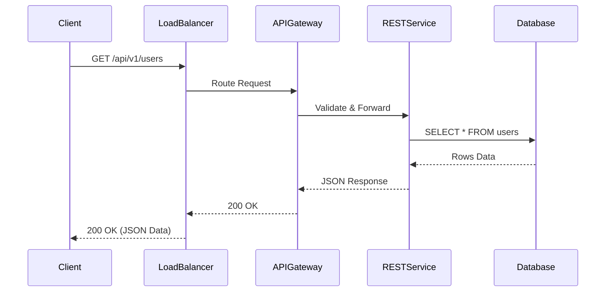

# REST API: Core Architecture & System Design

## Architectural Diagram & Visualization

<div data-viz="api-rest"></div>




## 1. Core Architecture & System Design

### Deep Dive
**<abbr title="Representational State Transfer - An architectural style for distributed hypermedia systems, commonly used for creating interactive web services.">REST</abbr>** (Representational State Transfer) is an architectural style rather than a strict protocol. It relies heavily on standard <abbr title="Hypertext Transfer Protocol - The foundation of data communication for the World Wide Web, operating on a client-server model.">HTTP</abbr> mechanics (GET, POST, PUT, DELETE) and treats data as "Resources" accessed via URIs.
- **Transport Layer**: Usually <abbr title="Hypertext Transfer Protocol - The foundation of data communication for the World Wide Web, operating on a client-server model.">HTTP</abbr>/1.1 (though <abbr title="Hypertext Transfer Protocol - The foundation of data communication for the World Wide Web, operating on a client-server model.">HTTP</abbr>/2 is increasingly used). It relies on standard <abbr title="Transmission Control Protocol - A core protocol of the Internet Protocol Suite that provides reliable, ordered, and error-checked delivery of a stream of bytes.">TCP</abbr> connections.
- **Statelessness**: Every request must contain all the information the server needs to fulfill it (e.g., Auth headers). The server does not store client context between requests.
- **Request/Response Lifecycle**:
  1. **Client Request**: Initiates an <abbr title="Hypertext Transfer Protocol - The foundation of data communication for the World Wide Web, operating on a client-server model.">HTTP</abbr> request to a specific URI (e.g., `GET /users/123`).
  2. **Headers & Payload**: Includes Accept headers (usually `application/json`) and Auth tokens.
  3. **Server Routing**: An <abbr title="Application Programming Interface">API</abbr> Gateway or Load Balancer routes the <abbr title="Hypertext Transfer Protocol - The foundation of data communication for the World Wide Web, operating on a client-server model.">HTTP</abbr> request to a specific handler.
  4. **Processing**: The backend fetches data, serializes it to <abbr title="JavaScript Object Notation - A lightweight data-interchange format that is easy for humans to read/write and machines to parse/generate.">JSON</abbr>, and assigns an appropriate <abbr title="Hypertext Transfer Protocol - The foundation of data communication for the World Wide Web, operating on a client-server model.">HTTP</abbr> Status Code (200, 404, 500).
  5. **Response**: The client receives the <abbr title="JavaScript Object Notation - A lightweight data-interchange format that is easy for humans to read/write and machines to parse/generate.">JSON</abbr> payload and closes the connection (or keeps it alive for reuse).

### Trade-offs
**Pros:**
- **Ubiquity**: Every language, framework, and browser natively understands <abbr title="Hypertext Transfer Protocol - The foundation of data communication for the World Wide Web, operating on a client-server model.">HTTP</abbr> and <abbr title="JavaScript Object Notation - A lightweight data-interchange format that is easy for humans to read/write and machines to parse/generate.">JSON</abbr>.
- **Caching**: <abbr title="Hypertext Transfer Protocol - The foundation of data communication for the World Wide Web, operating on a client-server model.">HTTP</abbr> caching mechanisms (ETag, Cache-Control, CDNs) work out-of-the-box for GET requests.
- **Decoupling**: The client and server are completely decoupled. The server can change its internal structure as long as the <abbr title="JavaScript Object Notation - A lightweight data-interchange format that is easy for humans to read/write and machines to parse/generate.">JSON</abbr> contract remains intact.
- **Human Readable**: <abbr title="JavaScript Object Notation - A lightweight data-interchange format that is easy for humans to read/write and machines to parse/generate.">JSON</abbr> payloads are easy to debug in the browser network tab.

**Cons:**
- **Over-fetching & Under-fetching**: A <abbr title="Representational State Transfer - An architectural style for distributed hypermedia systems, commonly used for creating interactive web services.">REST</abbr> endpoint returns a fixed payload. If you only need a user's name, but `GET /users/1` returns 50 fields, you over-fetch. If you also need their recent posts, you must make a second request (under-fetching).
- **Payload Size**: <abbr title="JavaScript Object Notation - A lightweight data-interchange format that is easy for humans to read/write and machines to parse/generate.">JSON</abbr> is text-based and verbose compared to binary formats like Protobuf.
- **Lack of Strict Contracts**: While OpenAPI/Swagger exists, <abbr title="Representational State Transfer - An architectural style for distributed hypermedia systems, commonly used for creating interactive web services.">REST</abbr> does not strictly enforce types at the protocol level.

### System Design Fit
**Optimal Scenarios:**
- **Public-Facing Web APIs**: Providing an <abbr title="Application Programming Interface">API</abbr> to external developers (e.g., Stripe, Twilio, GitHub).
- **Standard <abbr title="Create, Read, Update, Delete - The four basic functions of persistent storage operations, commonly used in database and <abbr title="Application Programming Interface - A set of rules and protocols that allows different software applications to communicate with each other.">API</abbr> design.">CRUD</abbr> Applications**: Admin dashboards, content management systems, blogs.
- **Stateless Microservices**: Services that require heavy caching via CDNs.

**Anti-Patterns:**
- **High-Frequency Real-time Data**: Polling a <abbr title="Representational State Transfer - An architectural style for distributed hypermedia systems, commonly used for creating interactive web services.">REST</abbr> endpoint every second is extremely inefficient. Use WebSockets.
- **Complex Inter-Service Communication**: Microservices requiring massive throughput and strict type safety should use <abbr title="gRPC Remote Procedure Call - A modern, open-source, high-performance <abbr title="Remote Procedure Call - A protocol that allows one program to request a service from a program located in another computer on a network.">RPC</abbr> framework that can run in any environment.">gRPC</abbr>.

---

## 2. Diagrams & Animated Visualizations

### Architecture Diagram
```arch
%% caption: A request passes through the CDN cache first, and only misses reach the gateway that routes by path to each backend service.
group Client "Web Browser / Mobile App" icon=browser color=slate
node A "HTTP Client" at 1,0 in Client icon=browser
group CDN_Layer "CDN / Caching Layer" icon=cdn color=purple
node B "Cloudflare / Varnish" at 1,1 in CDN_Layer icon=cloudflare-icon
group Server_Cluster "Backend Microservices" icon=server color=orange
node C "API Gateway / LB" at 1,2 in Server_Cluster icon=gateway
node D "User Service" at 0,3 in Server_Cluster icon=service
node E "Order Service" at 2,3 in Server_Cluster icon=service
A -> B : "GET /users/123"
B -> C : "Cache Miss"
C -> D : "Route /users"
C -> E : "Route /orders"
```

### Animated Flow Visualization
Save the block below as an HTML file (e.g. `rest-anim.html`) or paste it into a browser.

```html
<!DOCTYPE html>
<html lang="en">
<head>
<meta charset="UTF-8">
<style>
  body { background-color: #1e1e1e; color: #fff; font-family: sans-serif; display: flex; justify-content: center; align-items: center; height: 100vh; margin: 0; }
  .container { position: relative; width: 600px; height: 300px; background: #2d2d2d; border-radius: 8px; border: 1px solid #444; overflow: hidden; }
  .node { position: absolute; top: 50px; width: 120px; height: 200px; background: #3c3c3c; border-radius: 8px; display: flex; flex-direction: column; align-items: center; justify-content: center; z-index: 10; border: 2px solid #555;}
  .node.client { left: 20px; border-color: #ff9800; }
  .node.server { right: 20px; border-color: #4caf50; }
  .node h3 { margin: 0; font-size: 16px; }
  .wire { position: absolute; top: 120px; left: 140px; width: 320px; height: 60px; border-bottom: 2px dashed #666; }
  .packet { position: absolute; top: 10px; padding: 5px 10px; border-radius: 4px; font-size: 12px; font-weight: bold; color: #111; opacity: 0; }
  
  .req { background: #ff9800; left: 0; animation: sendReq 4s infinite; }
  .res { background: #4caf50; right: 0; top: 35px; animation: sendRes 4s infinite; animation-delay: 2s; }

  @keyframes sendReq { 0% { transform: translateX(0); opacity: 1; content: "GET /api/data"; } 40% { transform: translateX(300px); opacity: 1; } 45% { opacity: 0; } 100% { opacity: 0; } }
  @keyframes sendRes { 0% { transform: translateX(0); opacity: 1; content: "200 OK {JSON}"; } 40% { transform: translateX(-300px); opacity: 1; } 45% { opacity: 0; } 100% { opacity: 0; } }
</style>
</head>
<body>
  <div class="container">
    <div class="node client">
      <h3 style="color: #ff9800">Browser</h3>
    </div>
    <div class="wire">
      <div class="packet req">GET /users/1</div>
      <div class="packet res">200 OK {"name":"John"}</div>
    </div>
    <div class="node server">
      <h3 style="color: #4caf50">Go API</h3>
    </div>
  </div>
</body>
</html>
```

---

## 3. Five Real-World Use Cases & Implementations

### Use Case 1: Standard <abbr title="Create, Read, Update, Delete - The four basic functions of persistent storage operations, commonly used in database and <abbr title="Application Programming Interface - A set of rules and protocols that allows different software applications to communicate with each other.">API</abbr> design.">CRUD</abbr> Entity (Users)
**System Design Fit:** Exposing a public <abbr title="Application Programming Interface">API</abbr> to create and retrieve user data.

#### Golang (Server - `net/http`)
```go
package main

import (
	"encoding/json"
	"net/http"
)

type User struct {
	ID   string `json:"id"`
	Name string `json:"name"`
}

func userHandler(w http.ResponseWriter, r *http.Request) {
	if r.Method == http.MethodGet {
		// Simulate DB Fetch
		user := User{ID: "123", Name: "Alice"}
		w.Header().Set("Content-Type", "application/json")
		json.NewEncoder(w).Encode(user)
	} else if r.Method == http.MethodPost {
		var newUser User
		json.NewDecoder(r.Body).Decode(&newUser)
		w.WriteHeader(http.StatusCreated) // 201
		json.NewEncoder(w).Encode(map[string]string{"status": "created"})
	}
}

func main() {
	http.HandleFunc("/users", userHandler)
	http.ListenAndServe(":8080", nil)
}
```

#### Python (Server - `FastAPI`)
```python
from fastapi import FastAPI
from pydantic import BaseModel

app = FastAPI()

class User(BaseModel):
    id: str
    name: str

@app.get("/users/{user_id}", response_model=User)
async def get_user(user_id: str):
    return User(id=user_id, name="Alice")

@app.post("/users", status_code=201)
async def create_user(user: User):
    return {"status": "created", "user": user}
```

---

### Use Case 2: Webhook Receiver
**System Design Fit:** Stripe or GitHub sending asynchronous event notifications to your backend.

#### Golang (Server)
```go
func webhookHandler(w http.ResponseWriter, r *http.Request) {
	if r.Method != http.MethodPost {
		http.Error(w, "Method not allowed", http.StatusMethodNotAllowed)
		return
	}
	// Verify Stripe Signature header here...
	
	w.WriteHeader(http.StatusOK)
	w.Write([]byte("Webhook received successfully"))
}
```

#### Python (Server)
```python
from fastapi import Request, Response, FastAPI

app = FastAPI()

@app.post("/webhook")
async def receive_webhook(request: Request):
    payload = await request.body()
    signature = request.headers.get("stripe-signature")
    
    # Verify signature here...
    
    return Response(content="Webhook received", status_code=200)
```

---

### Use Case 3: Paginated Collection Retrieval
**System Design Fit:** Fetching large lists of data for a mobile app feed, using limit and offset.

#### Golang (Client Requesting Data)
```go
func fetchFeed() {
	client := &http.Client{Timeout: 10 * time.Second}
	req, _ := http.NewRequest("GET", "https://api.example.com/posts?limit=10&offset=0", nil)
	req.Header.Set("Authorization", "Bearer token123")
	
	resp, err := client.Do(req)
	if err != nil {
		log.Println("Request failed")
		return
	}
	defer resp.Body.Close()
	
	var result map[string]interface{}
	json.NewDecoder(resp.Body).Decode(&result)
	log.Println(result)
}
```

#### Python (Client Requesting Data)
```python
import httpx
import asyncio

async def fetch_feed():
    async with httpx.AsyncClient() as client:
        headers = {"Authorization": "Bearer token123"}
        params = {"limit": 10, "offset": 0}
        
        response = await client.get("https://api.example.com/posts", headers=headers, params=params)
        
        if response.status_code == 200:
            print(response.json())
```

---

### Use Case 4: File Upload <abbr title="Application Programming Interface">API</abbr> (Multipart Form)
**System Design Fit:** A user uploading a profile picture to AWS S3 via your backend <abbr title="Representational State Transfer - An architectural style for distributed hypermedia systems, commonly used for creating interactive web services.">REST</abbr> <abbr title="Application Programming Interface">API</abbr>.

#### Golang (Server)
```go
func uploadHandler(w http.ResponseWriter, r *http.Request) {
	r.ParseMultipartForm(10 << 20) // 10 MB limit
	
	file, handler, err := r.FormFile("profile_pic")
	if err != nil {
		http.Error(w, "Error Retrieving File", http.StatusBadRequest)
		return
	}
	defer file.Close()
	
	log.Printf("Uploaded File: %+v, Size: %+v", handler.Filename, handler.Size)
	
	w.WriteHeader(http.StatusOK)
	w.Write([]byte("File uploaded"))
}
```

#### Python (Server)
```python
from fastapi import FastAPI, File, UploadFile

app = FastAPI()

@app.post("/upload")
async def upload_file(profile_pic: UploadFile = File(...)):
    # Read first 100 bytes just to verify
    contents = await profile_pic.read(100)
    
    return {"filename": profile_pic.filename, "status": "Uploaded"}
```

---

### Use Case 5: Idempotent Updates (PUT / PATCH)
**System Design Fit:** Updating a user's settings. PUT replaces the entire resource, PATCH updates specific fields safely.

#### Golang (Server - PATCH)
```go
func patchUserHandler(w http.ResponseWriter, r *http.Request) {
	if r.Method != http.MethodPatch {
		http.Error(w, "Use PATCH", http.StatusMethodNotAllowed)
		return
	}
	
	var updates map[string]interface{}
	json.NewDecoder(r.Body).Decode(&updates)
	
	// Apply only the fields present in the 'updates' map to the DB
	log.Printf("Updating fields: %v", updates)
	
	w.WriteHeader(http.StatusOK)
}
```

#### Python (Server - PATCH)
```python
from fastapi import FastAPI, Body

app = FastAPI()

@app.patch("/users/{user_id}")
async def update_user(user_id: str, payload: dict = Body(...)):
    # payload will only contain fields the client explicitly sent
    print(f"Applying updates to {user_id}: {payload}")
    return {"status": "updated", "data": payload}
```
