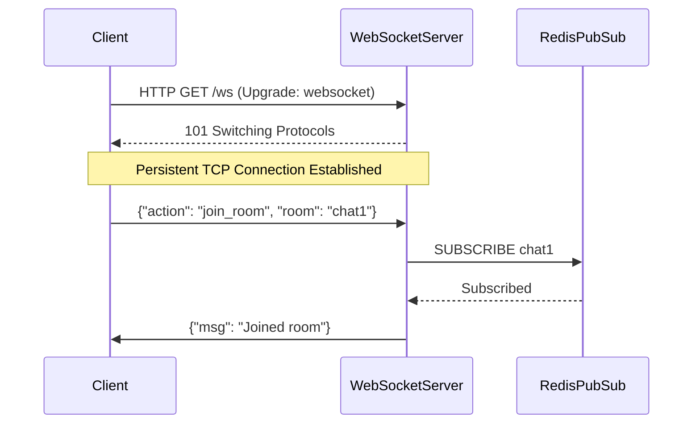

# WebSockets: Core Architecture & System Design

## Architectural Diagram & Visualization

<div data-viz="api-ws"></div>




## 1. Core Architecture & System Design

### Deep Dive
**WebSockets** provide a full-duplex, bidirectional communication channel over a single, long-lived <abbr title="Transmission Control Protocol - A core protocol of the Internet Protocol Suite that provides reliable, ordered, and error-checked delivery of a stream of bytes.">TCP</abbr> connection. Unlike <abbr title="Hypertext Transfer Protocol - The foundation of data communication for the World Wide Web, operating on a client-server model.">HTTP</abbr> request-response polling, WebSockets allow servers to push data to clients instantly.
- **Transport Layer**: <abbr title="Transmission Control Protocol - A core protocol of the Internet Protocol Suite that provides reliable, ordered, and error-checked delivery of a stream of bytes.">TCP</abbr>. The connection starts as a standard <abbr title="Hypertext Transfer Protocol - The foundation of data communication for the World Wide Web, operating on a client-server model.">HTTP</abbr>/1.1 request containing an `Upgrade: websocket` header. If the server supports it, it responds with an <abbr title="Hypertext Transfer Protocol - The foundation of data communication for the World Wide Web, operating on a client-server model.">HTTP</abbr> 101 Switching Protocols status, and the connection transitions from <abbr title="Hypertext Transfer Protocol - The foundation of data communication for the World Wide Web, operating on a client-server model.">HTTP</abbr> to a persistent raw <abbr title="Transmission Control Protocol - A core protocol of the Internet Protocol Suite that provides reliable, ordered, and error-checked delivery of a stream of bytes.">TCP</abbr> socket.
- **Framing Protocol**: WebSockets use a lightweight framing mechanism (defined in RFC 6455) to distinguish message boundaries. It supports Text (<abbr title="Unicode Transformation Format. A family of character encodings capable of encoding all possible Unicode code points.">UTF</abbr>-8) and Binary frames.
- **Request/Response Lifecycle**:
  1. **Handshake**: Client sends <abbr title="Hypertext Transfer Protocol - The foundation of data communication for the World Wide Web, operating on a client-server model.">HTTP</abbr> GET with `Upgrade` headers. Server replies with `101 Switching Protocols`.
  2. **Open Connection**: The <abbr title="Transmission Control Protocol - A core protocol of the Internet Protocol Suite that provides reliable, ordered, and error-checked delivery of a stream of bytes.">TCP</abbr> socket remains open. No more <abbr title="Hypertext Transfer Protocol - The foundation of data communication for the World Wide Web, operating on a client-server model.">HTTP</abbr> headers are sent, reducing overhead drastically.
  3. **Bidirectional Transmission**: Both client and server can send frames at any time, independently of one another.
  4. **Ping/Pong**: Control frames are used to keep the connection alive and detect dropped peers (Heartbeats).
  5. **Closure**: Either side sends a Close frame, and the <abbr title="Transmission Control Protocol - A core protocol of the Internet Protocol Suite that provides reliable, ordered, and error-checked delivery of a stream of bytes.">TCP</abbr> connection is cleanly terminated.

### Trade-offs
**Pros:**
- **True Real-Time**: Sub-millisecond latency for pushing data from server to client.
- **Low Overhead**: Once established, frames have only 2-10 bytes of overhead, compared to hundreds of bytes of <abbr title="Hypertext Transfer Protocol - The foundation of data communication for the World Wide Web, operating on a client-server model.">HTTP</abbr> headers per request.
- **Native Browser Support**: Supported universally by all modern web browsers without polyfills or plugins.
- **Bidirectional**: Client and server can blast data to each other simultaneously without waiting for a request.

**Cons:**
- **Stateful Connections**: Servers must hold millions of open <abbr title="Transmission Control Protocol - A core protocol of the Internet Protocol Suite that provides reliable, ordered, and error-checked delivery of a stream of bytes.">TCP</abbr> sockets in memory. Scaling requires specialized load balancing (sticky sessions or Pub/Sub backplanes like Redis).
- **No Built-in Multiplexing**: Unlike <abbr title="Hypertext Transfer Protocol - The foundation of data communication for the World Wide Web, operating on a client-server model.">HTTP</abbr>/2 (<abbr title="gRPC Remote Procedure Call - A modern, open-source, high-performance <abbr title="Remote Procedure Call - A protocol that allows one program to request a service from a program located in another computer on a network.">RPC</abbr> framework that can run in any environment.">gRPC</abbr>), all data on a WebSocket goes over a single pipe. You have to implement your own message routing/multiplexing if you want different "channels".
- **Proxy/Firewall Issues**: Aggressive corporate firewalls or misconfigured load balancers might drop long-lived idle connections.

### System Design Fit
**Optimal Scenarios:**
- **Live Chat & Messaging Apps**: WhatsApp, Slack, Discord architectures.
- **Real-Time Dashboards & Analytics**: Live traffic monitors, trading platforms.
- **Collaborative Editing**: Google Docs, Figma (cursor tracking and state sync).
- **Browser-Based Multiplayer Games**: Sending fast, frequent coordinate updates.

**Anti-Patterns:**
- **Static Content Delivery**: Fetching images, CSS, or standard <abbr title="JavaScript Object Notation - A lightweight data-interchange format that is easy for humans to read/write and machines to parse/generate.">JSON</abbr> <abbr title="Application Programming Interface">API</abbr> payloads.
- **One-off Actions**: Form submissions or occasional state updates (use <abbr title="Representational State Transfer - An architectural style for distributed hypermedia systems, commonly used for creating interactive web services.">REST</abbr>).
- **Service-to-Service (Backend)**: If both ends are backend servers, <abbr title="gRPC Remote Procedure Call - A modern, open-source, high-performance <abbr title="Remote Procedure Call - A protocol that allows one program to request a service from a program located in another computer on a network.">RPC</abbr> framework that can run in any environment.">gRPC</abbr> or raw <abbr title="Transmission Control Protocol - A core protocol of the Internet Protocol Suite that provides reliable, ordered, and error-checked delivery of a stream of bytes.">TCP</abbr> is often more efficient than WebSocket framing.

---

## 2. Diagrams & Animated Visualizations

### Architecture Diagram
```arch
%% caption: The browser upgrades to a persistent connection through the load balancer, and server nodes share messages over a pub/sub bus.
grid 160x140
group Browser "Web Client" icon=browser color=slate
node A "JavaScript App" at 1,0 in Browser icon=code
node B "WebSocket API" at 1,1 in Browser icon=websocket
group Load_Balancer "API Gateway / LB" icon=lb color=purple
node C "NGINX/HAProxy" at 1,2 in Load_Balancer icon=nginx
group Backend_Cluster "Backend Cluster" icon=server color=orange
node D "Go Server Node 1" at 0,3 in Backend_Cluster icon=go
node E "Go Server Node 2" at 2,3 in Backend_Cluster icon=go
node F "Redis / Kafka" at 1,4 in Backend_Cluster icon=stream
A -> B : "ws:// or wss://"
B -> C : "HTTP Upgrade /\nTCP Connection"
C:L <-> D:T : "Persistent TCP"
C:R <-> E:T : "Persistent TCP"
D:B <-> F:L : "Pub/Sub Message Bus"
E:B <-> F:R : "Pub/Sub Message Bus"
```

### Animated Flow Visualization
Save the block below as an HTML file (e.g. `websocket-anim.html`) or paste it into a browser to see how WebSocket establishes a connection and streams bidirectional frames.

```html
<!DOCTYPE html>
<html lang="en">
<head>
<meta charset="UTF-8">
<style>
  body { background-color: #1e1e1e; color: #fff; font-family: 'Segoe UI', Tahoma, Geneva, Verdana, sans-serif; display: flex; justify-content: center; align-items: center; height: 100vh; margin: 0; overflow: hidden;}
  .container { position: relative; width: 650px; height: 350px; background: #2d2d2d; border-radius: 12px; border: 1px solid #444; box-shadow: 0 10px 30px rgba(0,0,0,0.5); }
  .title { text-align: center; margin-top: 15px; font-weight: 600; color: #aaa; }
  .node { position: absolute; top: 70px; width: 120px; height: 200px; background: #3c3c3c; border-radius: 8px; display: flex; flex-direction: column; align-items: center; justify-content: center; z-index: 10; }
  .node.client { left: 20px; border: 2px solid #ef5350; box-shadow: 0 0 15px rgba(239, 83, 80, 0.2); }
  .node.server { right: 20px; border: 2px solid #66bb6a; box-shadow: 0 0 15px rgba(102, 187, 106, 0.2); }
  .node h3 { margin: 0; font-size: 18px; text-align: center; }
  .node p { font-size: 12px; color: #aaa; text-align: center; margin-top: 5px;}
  
  .wire { position: absolute; top: 150px; left: 140px; width: 370px; height: 40px; border-top: 2px solid #555; border-bottom: 2px solid #555; display: flex; justify-content: center; align-items: center; color: #777; font-size: 12px; }
  
  .packet { position: absolute; width: 60px; height: 20px; border-radius: 4px; font-size: 10px; line-height: 20px; text-align: center; font-weight: bold; color: #fff; top: 10px; opacity: 0; }
  
  /* Handshake */
  .hs-req { background: #ab47bc; left: 0; animation: sendReq 2s linear forwards; animation-delay: 0.5s; }
  .hs-res { background: #ab47bc; right: 0; animation: sendRes 2s linear forwards; animation-delay: 2.5s; }
  
  /* WebSocket Frames */
  .ws-frame-req1 { background: #ef5350; left: 0; top: -10px; animation: wsSendReq 1.5s linear infinite; animation-delay: 5s; }
  .ws-frame-req2 { background: #ef5350; left: 0; top: 30px; animation: wsSendReq 1.5s linear infinite; animation-delay: 6s; }
  .ws-frame-res1 { background: #66bb6a; right: 0; top: 10px; animation: wsSendRes 1.5s linear infinite; animation-delay: 5.5s; }
  .ws-frame-res2 { background: #66bb6a; right: 0; top: -5px; animation: wsSendRes 1.5s linear infinite; animation-delay: 6.2s; }

  @keyframes sendReq { 0% { transform: translateX(0); opacity: 1; } 95% { transform: translateX(310px); opacity: 1; } 100% { transform: translateX(310px); opacity: 0; } }
  @keyframes sendRes { 0% { transform: translateX(0); opacity: 1; } 95% { transform: translateX(-310px); opacity: 1; } 100% { transform: translateX(-310px); opacity: 0; } }
  
  @keyframes wsSendReq { 0% { transform: translateX(0); opacity: 1; } 95% { transform: translateX(310px); opacity: 1; } 100% { transform: translateX(310px); opacity: 0; } }
  @keyframes wsSendRes { 0% { transform: translateX(0); opacity: 1; } 95% { transform: translateX(-310px); opacity: 1; } 100% { transform: translateX(-310px); opacity: 0; } }
  
  .status { position: absolute; top: 120px; left: 250px; font-size: 14px; font-weight: bold; color: #ab47bc; animation: statusChange 10s infinite; }
  
  @keyframes statusChange {
      0% { content: "HTTP Request"; color: #ab47bc; opacity: 1; }
      40% { color: #ab47bc; opacity: 1; }
      45% { opacity: 0; }
      50% { color: #4fc3f7; opacity: 1; }
      100% { color: #4fc3f7; opacity: 1; }
  }
  .status::after { content: "HTTP/1.1 Upgrade"; animation: textChange 10s infinite; }
  @keyframes textChange { 0%, 45% { content: "HTTP/1.1 Upgrade"; } 50%, 100% { content: "Raw TCP Socket (Connected)"; } }
</style>
</head>
<body>
  <div class="container">
    <div class="title">WebSocket Connection Lifecycle</div>
    <div class="node client">
      <h3 style="color: #ef5350">Browser</h3>
      <p>JS Client</p>
    </div>
    
    <div class="status"></div>
    <div class="wire">
      <div class="packet hs-req">GET Upgrade</div>
      <div class="packet hs-res">101 Switch</div>
      
      <div class="packet ws-frame-req1">MSG (TXT)</div>
      <div class="packet ws-frame-req2">PING</div>
      <div class="packet ws-frame-res1">PONG</div>
      <div class="packet ws-frame-res2">MSG (BIN)</div>
    </div>
    
    <div class="node server">
      <h3 style="color: #66bb6a">Golang</h3>
      <p>WS Server</p>
    </div>
  </div>
</body>
</html>
```

---

## 3. Five Real-World Use Cases & Implementations

### Use Case 1: Live Chat Application (Pub/Sub Broadcasting)
**System Design Fit:** Users connect to a WebSocket server. When a user sends a message, the server broadcasts it to all other connected clients in a specific "room" or channel.

#### Golang (Server - using `gorilla/websocket`)
```go
package main

import (
	"log"
	"net/http"
	"github.com/gorilla/websocket"
)

var upgrader = websocket.Upgrader{
	CheckOrigin: func(r *http.Request) bool { return true },
}

var clients = make(map[*websocket.Conn]bool) // Connected clients
var broadcast = make(chan []byte)            // Broadcast channel

func handleConnections(w http.ResponseWriter, r *http.Request) {
	ws, err := upgrader.Upgrade(w, r, nil)
	if err != nil {
		log.Fatal(err)
	}
	defer ws.Close()
	clients[ws] = true

	for {
		// Read message from browser
		_, msg, err := ws.ReadMessage()
		if err != nil {
			delete(clients, ws)
			break
		}
		// Send the newly received message to the broadcast channel
		broadcast <- msg
	}
}

func handleMessages() {
	for {
		// Grab the next message from the broadcast channel
		msg := <-broadcast
		// Send it out to every client that is currently connected
		for client := range clients {
			err := client.WriteMessage(websocket.TextMessage, msg)
			if err != nil {
				client.Close()
				delete(clients, client)
			}
		}
	}
}

func main() {
	http.HandleFunc("/ws", handleConnections)
	go handleMessages()
	log.Println("http server started on :8080")
	http.ListenAndServe(":8080", nil)
}
```

#### Python (Server - using `fastapi` and `websockets`)
```python
from fastapi import FastAPI, WebSocket, WebSocketDisconnect
from typing import List

app = FastAPI()

class ConnectionManager:
    def __init__(self):
        self.active_connections: List[WebSocket] = []

    async def connect(self, websocket: WebSocket):
        await websocket.accept()
        self.active_connections.append(websocket)

    def disconnect(self, websocket: WebSocket):
        self.active_connections.remove(websocket)

    async def broadcast(self, message: str):
        for connection in self.active_connections:
            await connection.send_text(message)

manager = ConnectionManager()

@app.websocket("/ws")
async def websocket_endpoint(websocket: WebSocket):
    await manager.connect(websocket)
    try:
        while True:
            data = await websocket.receive_text()
            await manager.broadcast(f"User says: {data}")
    except WebSocketDisconnect:
        manager.disconnect(websocket)
        await manager.broadcast("A user left the chat")

# Run with: uvicorn main:app --reload
```

---

### Use Case 2: Real-time Crypto Ticker (Server-Side Push)
**System Design Fit:** The server connects to an internal Kafka/Redis stream and pushes price updates down to the client dashboard instantly without the client needing to ask.

#### Golang (Server)
```go
func handleTicker(w http.ResponseWriter, r *http.Request) {
	ws, err := upgrader.Upgrade(w, r, nil)
	if err != nil {
		log.Println(err)
		return
	}
	defer ws.Close()

	// Simulate subscribing to a Redis/Kafka topic
	ticker := time.NewTicker(1 * time.Second)
	defer ticker.Stop()
	
	price := 50000.0

	for {
		select {
		case <-ticker.C:
			// Simulate price movement
			price += (rand.Float64() - 0.5) * 100
			
			msg := fmt.Sprintf(`{"symbol":"BTC", "price": %.2f}`, price)
			if err := ws.WriteMessage(websocket.TextMessage, []byte(msg)); err != nil {
				log.Println("Client disconnected")
				return
			}
		}
	}
}
```

#### Python (Server)
```python
import asyncio
import json
import random
from fastapi import FastAPI, WebSocket

app = FastAPI()

@app.websocket("/ticker")
async def crypto_ticker(websocket: WebSocket):
    await websocket.accept()
    price = 50000.0
    try:
        while True:
            # Simulate fetching from Redis pub/sub
            await asyncio.sleep(1)
            price += random.uniform(-50, 50)
            
            payload = json.dumps({"symbol": "BTC", "price": round(price, 2)})
            await websocket.send_text(payload)
    except Exception as e:
        print("Client disconnected")
```

---

### Use Case 3: Live Collaborative Document Cursor Sync (Binary/<abbr title="JavaScript Object Notation - A lightweight data-interchange format that is easy for humans to read/write and machines to parse/generate.">JSON</abbr> Payloads)
**System Design Fit:** Syncing mouse cursors in a collaborative app like Figma. Since updates are extremely frequent (60fps), WebSockets avoid <abbr title="Hypertext Transfer Protocol - The foundation of data communication for the World Wide Web, operating on a client-server model.">HTTP</abbr> overhead.

#### Golang (Client/Server interaction simulation)
```go
type CursorPos struct {
	UserID string  `json:"userId"`
	X      float64 `json:"x"`
	Y      float64 `json:"y"`
}

func syncCursors(ws *websocket.Conn) {
	// Setup Ping heartbeat for long-lived connections
	ws.SetReadDeadline(time.Now().Add(60 * time.Second))
	ws.SetPingHandler(func(string) error {
		ws.SetReadDeadline(time.Now().Add(60 * time.Second))
		return nil
	})

	for {
		var pos CursorPos
		err := ws.ReadJSON(&pos)
		if err != nil {
			break // Connection closed or error
		}
		
		log.Printf("User %s moved to (%f, %f)", pos.UserID, pos.X, pos.Y)
		
		// In reality, we would broadcast this `pos` to all OTHER clients in the document
		// broadcastChan <- pos
	}
}
```

#### Python (Client Script Simulation)
```python
import asyncio
import websockets
import json
import random

async def sync_cursor():
    uri = "ws://localhost:8080/sync"
    async with websockets.connect(uri) as websocket:
        for _ in range(100):
            # Simulate rapid mouse movement
            payload = json.dumps({
                "userId": "usr_99",
                "x": random.uniform(0, 1920),
                "y": random.uniform(0, 1080)
            })
            
            await websocket.send(payload)
            await asyncio.sleep(0.016) # ~60fps
            
# Run using asyncio.run(sync_cursor())
```

---

### Use Case 4: Heartbeat & Connection Health Checking
**System Design Fit:** Mobile clients traversing bad networks (tunnels, elevators). The server must detect dead <abbr title="Transmission Control Protocol - A core protocol of the Internet Protocol Suite that provides reliable, ordered, and error-checked delivery of a stream of bytes.">TCP</abbr> connections gracefully to free up memory (goroutines/tasks).

#### Golang (Server side strict heartbeating)
```go
const (
	writeWait      = 10 * time.Second
	pongWait       = 60 * time.Second
	pingPeriod     = (pongWait * 9) / 10
)

func serveWsHealth(ws *websocket.Conn) {
	defer ws.Close()
	
	ws.SetReadDeadline(time.Now().Add(pongWait))
	ws.SetPongHandler(func(string) error { 
		ws.SetReadDeadline(time.Now().Add(pongWait)) // Reset deadline on pong
		return nil 
	})

	// Pinger goroutine
	go func() {
		ticker := time.NewTicker(pingPeriod)
		defer ticker.Stop()
		for range ticker.C {
			ws.SetWriteDeadline(time.Now().Add(writeWait))
			if err := ws.WriteMessage(websocket.PingMessage, nil); err != nil {
				return
			}
		}
	}()

	// Reader loop
	for {
		_, _, err := ws.ReadMessage()
		if err != nil {
			break // Drop connection if read fails or times out
		}
	}
}
```

#### Python (Client side responding to Pings)
```python
import asyncio
import websockets

async def resilient_client():
    uri = "ws://localhost:8080/health"
    
    # websockets library automatically responds to Pings with Pongs!
    # We can configure ping_interval and ping_timeout to ensure connection health
    try:
        async with websockets.connect(uri, ping_interval=20, ping_timeout=20) as ws:
            while True:
                message = await ws.recv()
                print(f"Received: {message}")
    except websockets.exceptions.ConnectionClosedError:
        print("Connection dropped. Initiate exponential backoff reconnection...")
```

---

### Use Case 5: Authenticated WebSocket Setup (Token passed in protocol or params)
**System Design Fit:** Since WebSockets cannot pass custom <abbr title="Hypertext Transfer Protocol - The foundation of data communication for the World Wide Web, operating on a client-server model.">HTTP</abbr> headers easily from browser APIs, authentication is usually done via a query parameter or the first message sent over the wire.

#### Golang (Server validating query param token)
```go
func authMiddleware(w http.ResponseWriter, r *http.Request) {
	// Standard browsers can't set Auth headers in `new WebSocket(url)`
	// So we pass it via query params: ws://example.com/ws?token=JWT
	tokenString := r.URL.Query().Get("token")
	
	if tokenString != "valid-jwt-token" {
		w.WriteHeader(http.StatusUnauthorized)
		w.Write([]byte("Unauthorized"))
		return
	}

	ws, err := upgrader.Upgrade(w, r, nil)
	if err != nil {
		log.Println(err)
		return
	}
	defer ws.Close()
	
	ws.WriteMessage(websocket.TextMessage, []byte("Welcome, authenticated user!"))
}
```

#### Python (Client sending token as first frame)
```python
import asyncio
import websockets
import json

async def auth_via_first_frame():
    uri = "ws://localhost:8080/ws"
    
    async with websockets.connect(uri) as ws:
        # Instead of URL params, send Auth as the very first WS message
        auth_payload = json.dumps({
            "type": "authenticate",
            "token": "valid-jwt-token"
        })
        
        await ws.send(auth_payload)
        
        response = await ws.recv()
        resp_data = json.loads(response)
        
        if resp_data.get("status") == "authenticated":
            print("Successfully authenticated. Starting normal data flow.")
        else:
            print("Auth failed.")
            await ws.close()
```
