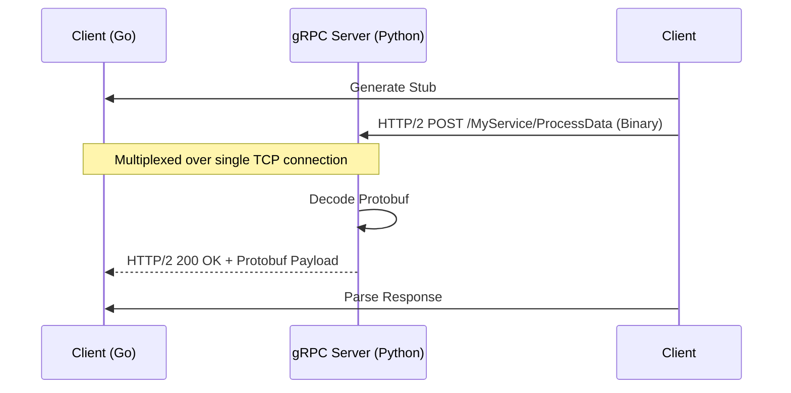

# <abbr title="gRPC Remote Procedure Call - A modern, open-source, high-performance RPC framework that can run in any environment.">gRPC</abbr>: Core Architecture & System Design

## Architectural Diagram & Visualization

<div data-viz="api-grpc"></div>




## 1. Core Architecture & System Design

### Deep Dive
**<abbr title="gRPC Remote Procedure Call - A modern, open-source, high-performance <abbr title="Remote Procedure Call - A protocol that allows one program to request a service from a program located in another computer on a network.">RPC</abbr> framework that can run in any environment.">gRPC</abbr>** (<abbr title="gRPC Remote Procedure Call - A modern, open-source, high-performance <abbr title="Remote Procedure Call - A protocol that allows one program to request a service from a program located in another computer on a network.">RPC</abbr> framework that can run in any environment.">gRPC</abbr> Remote Procedure Calls) is a high-performance, open-source universal <abbr title="Remote Procedure Call - A protocol that allows one program to request a service from a program located in another computer on a network.">RPC</abbr> framework developed by Google. Under the hood, it abstracts the complexities of network communication, making remote procedure calls look like local function calls.
- **Transport Layer**: <abbr title="Hypertext Transfer Protocol - The foundation of data communication for the World Wide Web, operating on a client-server model.">HTTP</abbr>/2. This enables multiplexing (sending multiple requests concurrently over a single <abbr title="Transmission Control Protocol - A core protocol of the Internet Protocol Suite that provides reliable, ordered, and error-checked delivery of a stream of bytes.">TCP</abbr> connection), header compression (HPACK), and server push.
- **Serialization**: Protocol Buffers (Protobuf). A binary serialization format that is smaller, faster, and more strongly typed than <abbr title="JavaScript Object Notation - A lightweight data-interchange format that is easy for humans to read/write and machines to parse/generate.">JSON</abbr> or <abbr title="Extensible Markup Language - A markup language that defines a set of rules for encoding documents in a format that is both human-readable and machine-readable.">XML</abbr>.
- **Request/Response Lifecycle**:
  1. **Stub Generation**: Protobuf definitions (`.proto` files) are compiled into client and server stubs for various languages.
  2. **Call Initiation**: The client invokes a method on the local stub.
  3. **Encoding**: The stub serializes the request parameters into a binary Protobuf format.
  4. **Transmission**: The serialized payload is sent over <abbr title="Hypertext Transfer Protocol - The foundation of data communication for the World Wide Web, operating on a client-server model.">HTTP</abbr>/2 using DATA frames.
  5. **Decoding**: The server stub deserializes the payload, executes the business logic, and sends the binary response back.

### Trade-offs
**Pros:**
- **High Performance & Payload Efficiency**: Binary serialization with Protobuf results in significantly smaller payloads compared to <abbr title="JavaScript Object Notation - A lightweight data-interchange format that is easy for humans to read/write and machines to parse/generate.">JSON</abbr>, reducing bandwidth and <abbr title="Central Processing Unit - The primary component of a computer that acts as its 'brain', executing instructions of a computer program.">CPU</abbr> overhead.
- **Multiplexing**: <abbr title="Hypertext Transfer Protocol - The foundation of data communication for the World Wide Web, operating on a client-server model.">HTTP</abbr>/2 allows concurrent <abbr title="Remote Procedure Call - A protocol that allows one program to request a service from a program located in another computer on a network.">RPC</abbr> calls over a single persistent <abbr title="Transmission Control Protocol - A core protocol of the Internet Protocol Suite that provides reliable, ordered, and error-checked delivery of a stream of bytes.">TCP</abbr> connection, preventing head-of-line blocking.
- **Strict Contracts**: Protobuf enforces a strict schema, eliminating issues related to malformed payloads or unexpected data types.
- **Polyglot Natively**: First-class code generation for Go, Python, Java, C++, Node.js, etc.
- **Streaming Support**: Native support for Unary, Client-streaming, Server-streaming, and Bidirectional streaming.

**Cons:**
- **Browser Incompatibility**: Browsers don't fully support <abbr title="Hypertext Transfer Protocol - The foundation of data communication for the World Wide Web, operating on a client-server model.">HTTP</abbr>/2 trailing headers natively, requiring a proxy like `gRPC-Web` or Envoy to bridge the gap.
- **Debugging Difficulty**: Binary payloads are not human-readable (unlike <abbr title="JavaScript Object Notation - A lightweight data-interchange format that is easy for humans to read/write and machines to parse/generate.">JSON</abbr>). Requires specialized tools (e.g., `grpcurl`, Wireshark with Protobuf dissectors) for debugging.
- **Steep Learning Curve**: Requires understanding Protobuf, <abbr title="Hypertext Transfer Protocol - The foundation of data communication for the World Wide Web, operating on a client-server model.">HTTP</abbr>/2 mechanics, and integrating code generation pipelines into <abbr title="Continuous Integration and Continuous Deployment">CI/CD</abbr>.

### System Design Fit
**Optimal Scenarios:**
- **Microservices (East-West Traffic)**: High-throughput, low-latency communication between internal backend services.
- **Polyglot Architectures**: Systems where a Go service needs to talk to a Python service rapidly and efficiently.
- **Real-Time Streaming**: Applications requiring persistent connections and real-time data flow (e.g., IoT telemetry, live financial feeds).
- **Resource-Constrained Environments**: Mobile or IoT devices where bandwidth and <abbr title="Central Processing Unit - The primary component of a computer that acts as its 'brain', executing instructions of a computer program.">CPU</abbr> (for parsing <abbr title="JavaScript Object Notation - A lightweight data-interchange format that is easy for humans to read/write and machines to parse/generate.">JSON</abbr>) are severely limited.

**Anti-Patterns:**
- **Public-Facing Web APIs**: Standard <abbr title="Representational State Transfer - An architectural style for distributed hypermedia systems, commonly used for creating interactive web services.">REST</abbr> or GraphQL is superior for external consumers who expect <abbr title="JavaScript Object Notation - A lightweight data-interchange format that is easy for humans to read/write and machines to parse/generate.">JSON</abbr> and operate primarily in standard browsers.
- **Simple <abbr title="Create, Read, Update, Delete - The four basic functions of persistent storage operations, commonly used in database and <abbr title="Application Programming Interface - A set of rules and protocols that allows different software applications to communicate with each other.">API</abbr> design.">CRUD</abbr> Apps**: If the overhead of managing `.proto` files outweighs the performance benefits, stick to <abbr title="Representational State Transfer - An architectural style for distributed hypermedia systems, commonly used for creating interactive web services.">REST</abbr>.

---

## 2. Diagrams & Animated Visualizations

### Architecture Diagram
```arch
%% caption: A call on the client stub is serialized onto multiplexed HTTP/2 streams, then deserialized by the server stub and dispatched to the implementation.
grid 160x100
group Client_Node "Client Service - Python" icon=python color=amber
node A "Client Application" at 0,0 in Client_Node icon=app
node B "gRPC Stub" at 0,1 in Client_Node icon=grpc
node C "HTTP/2 Client" at 0,2 in Client_Node icon=network
group Network "Network" icon=network color=purple style=dashed
node D "HTTP/2 Server" at 0,3 in Network icon=network
group Server_Node "Target Service - Go" icon=go color=cyan
node E "gRPC Stub" at 0,4 in Server_Node icon=grpc
node F "Server Implementation" at 0,5 in Server_Node icon=server
A -> B : "Method Call"
B -> C : "Serialize to Binary"
C <-> D : "Multiplexed Binary Streams"
D -> E : "Deserialize Binary"
E -> F : "Invoke Method"
```

### Animated Flow Visualization
Save the block below as an HTML file (e.g. `grpc-anim.html`) or paste it into a browser to see how <abbr title="gRPC Remote Procedure Call - A modern, open-source, high-performance <abbr title="Remote Procedure Call - A protocol that allows one program to request a service from a program located in another computer on a network.">RPC</abbr> framework that can run in any environment.">gRPC</abbr> multiplexes traffic over <abbr title="Hypertext Transfer Protocol - The foundation of data communication for the World Wide Web, operating on a client-server model.">HTTP</abbr>/2.

```html
<!DOCTYPE html>
<html lang="en">
<head>
<meta charset="UTF-8">
<style>
  body { background-color: #1e1e1e; color: #fff; font-family: 'Segoe UI', Tahoma, Geneva, Verdana, sans-serif; display: flex; justify-content: center; align-items: center; height: 100vh; margin: 0; overflow: hidden;}
  .container { position: relative; width: 600px; height: 350px; background: #2d2d2d; border-radius: 12px; border: 1px solid #444; overflow: hidden; box-shadow: 0 10px 30px rgba(0,0,0,0.5); }
  .title { text-align: center; margin-top: 15px; font-weight: 600; color: #aaa; }
  .node { position: absolute; top: 70px; width: 120px; height: 200px; background: #3c3c3c; border-radius: 8px; display: flex; flex-direction: column; align-items: center; justify-content: center; z-index: 10; }
  .node.client { left: 20px; border: 2px solid #ffca28; box-shadow: 0 0 15px rgba(255, 202, 40, 0.2); }
  .node.server { right: 20px; border: 2px solid #00acc1; box-shadow: 0 0 15px rgba(0, 172, 193, 0.2); }
  .node h3 { margin: 0; font-size: 18px; text-align: center; }
  .node p { font-size: 12px; color: #aaa; text-align: center; margin-top: 5px;}
  .http2-pipe { position: absolute; top: 120px; left: 140px; width: 320px; height: 100px; border-top: 2px dashed #666; border-bottom: 2px dashed #666; background: rgba(0,0,0,0.2); display: flex; justify-content: center; align-items: flex-start; color: #777; font-size: 12px; padding-top: 5px; box-sizing: border-box; }
  .stream { position: absolute; left: 140px; width: 320px; height: 20px; background: rgba(255,255,255,0.05); border-radius: 10px; overflow: hidden; }
  .packet { position: absolute; top: 2px; width: 45px; height: 16px; border-radius: 8px; font-size: 10px; line-height: 16px; text-align: center; font-weight: bold; color: #111; }
  
  /* Unary Stream */
  .packet.unary-req { background: #ffca28; left: 0; animation: sendReq 2s linear infinite; }
  .packet.unary-res { background: #00acc1; right: 0; animation: sendRes 2s linear infinite; animation-delay: 1s; }
  
  /* Bidi Stream */
  .packet.bidi-req-1 { background: #ff7043; left: 0; animation: sendReq 1.5s linear infinite; animation-delay: 0.2s;}
  .packet.bidi-req-2 { background: #ff7043; left: 0; animation: sendReq 1.5s linear infinite; animation-delay: 0.7s;}
  .packet.bidi-res-1 { background: #4db6ac; right: 0; animation: sendRes 1.5s linear infinite; animation-delay: 0.5s;}

  @keyframes sendReq { 0% { transform: translateX(0); opacity: 1; } 95% { transform: translateX(275px); opacity: 1; } 100% { transform: translateX(275px); opacity: 0; } }
  @keyframes sendRes { 0% { transform: translateX(0); opacity: 1; } 95% { transform: translateX(-275px); opacity: 1; } 100% { transform: translateX(-275px); opacity: 0; } }
</style>
</head>
<body>
  <div class="container">
    <div class="title">gRPC HTTP/2 Multiplexing</div>
    <div class="node client">
      <h3 style="color: #ffca28">Python</h3>
      <p>Client Stub</p>
    </div>
    
    <div class="http2-pipe">Persistent TCP Connection</div>
    
    <!-- Unary Stream -->
    <div class="stream" style="top: 150px;">
      <span style="position: absolute; left: 5px; font-size: 9px; color: #555;">Stream ID: 1 (Unary)</span>
      <div class="packet unary-req">BIN_REQ</div>
      <div class="packet unary-res">BIN_RES</div>
    </div>

    <!-- Bidirectional Stream -->
    <div class="stream" style="top: 180px;">
      <span style="position: absolute; left: 5px; font-size: 9px; color: #555;">Stream ID: 3 (Bidi)</span>
      <div class="packet bidi-req-1">DATA</div>
      <div class="packet bidi-req-2">DATA</div>
      <div class="packet bidi-res-1">DATA</div>
    </div>
    
    <div class="node server">
      <h3 style="color: #00acc1">Golang</h3>
      <p>Server Stub</p>
    </div>
  </div>
</body>
</html>
```

---

## 3. Five Real-World Use Cases & Implementations

### Shared Protobuf Definition (`service.proto`)
*(Assume this is compiled using `protoc` for both Go and Python)*
```protobuf
syntax = "proto3";
package api;

service MicroserviceSystem {
  // Use Case 1: Unary
  rpc ValidateToken (AuthRequest) returns (AuthResponse);
  
  // Use Case 2: Client Streaming
  rpc StreamMetrics (stream Metric) returns (Ack);
  
  // Use Case 3: Server Streaming
  rpc WatchMarketData (MarketRequest) returns (stream MarketData);
  
  // Use Case 4: Bidirectional Streaming
  rpc GameSync (stream PlayerState) returns (stream GameState);
  
  // Use Case 5: Unary with Deadlines
  rpc ProcessTask (Task) returns (TaskResult);
}

// Structs (Messages) definition omitted for brevity.
```

---

### Use Case 1: Internal Service Authentication (Unary <abbr title="Remote Procedure Call - A protocol that allows one program to request a service from a program located in another computer on a network.">RPC</abbr>)
**System Design Fit:** An <abbr title="Application Programming Interface">API</abbr> Gateway (Python) validates a user <abbr title="JSON Web Token - A compact, URL-safe means of representing claims to be transferred between two parties, often used for authentication.">JWT</abbr> via an internal Auth Service (Go) before routing a request. Unary <abbr title="Remote Procedure Call - A protocol that allows one program to request a service from a program located in another computer on a network.">RPC</abbr> is perfect for quick, 1-to-1 request-response lookups.

#### Golang (Server)
```go
package main

import (
	"context"
	"log"
	"net"

	pb "path/to/proto/api"
	"google.golang.org/grpc"
	"google.golang.org/grpc/codes"
	"google.golang.org/grpc/status"
)

type server struct {
	pb.UnimplementedMicroserviceSystemServer
}

func (s *server) ValidateToken(ctx context.Context, req *pb.AuthRequest) (*pb.AuthResponse, error) {
	if req.GetToken() == "" {
		return nil, status.Error(codes.InvalidArgument, "Token missing")
	}
	
	// Simulate fast token validation
	isValid := req.GetToken() == "secret-jwt"
	return &pb.AuthResponse{IsValid: isValid, UserId: "usr_123"}, nil
}

func main() {
	lis, err := net.Listen("tcp", ":50051")
	if err != nil {
		log.Fatalf("failed to listen: %v", err)
	}
	s := grpc.NewServer()
	pb.RegisterMicroserviceSystemServer(s, &server{})
	log.Printf("Auth server listening at %v", lis.Addr())
	if err := s.Serve(lis); err != nil {
		log.Fatalf("failed to serve: %v", err)
	}
}
```

#### Python (Client)
```python
import asyncio
import grpc
import api_pb2
import api_pb2_grpc

async def validate_user_token(token: str):
    # Using async context manager for secure, efficient channel lifecycle
    async with grpc.aio.insecure_channel('localhost:50051') as channel:
        stub = api_pb2_grpc.MicroserviceSystemStub(channel)
        try:
            response = await stub.ValidateToken(api_pb2.AuthRequest(token=token))
            print(f"Auth Result: Valid={response.is_valid}, UserID={response.user_id}")
            return response.is_valid
        except grpc.aio.AioRpcError as e:
            print(f"Auth failed: {e.code()} - {e.details()}")
            return False

if __name__ == '__main__':
    asyncio.run(validate_user_token("secret-jwt"))
```

---

### Use Case 2: Real-time Metric Aggregation (Client-Side Streaming)
**System Design Fit:** Hundreds of Python workers streaming continuous <abbr title="Central Processing Unit - The primary component of a computer that acts as its 'brain', executing instructions of a computer program.">CPU</abbr>/Memory telemetry to a central Go monitoring service. Client streams avoid the overhead of establishing a new request for every single metric tick.

#### Golang (Server)
```go
import "io"

func (s *server) StreamMetrics(stream pb.MicroserviceSystem_StreamMetricsServer) error {
	var totalMetrics int32
	
	for {
		metric, err := stream.Recv()
		if err == io.EOF {
			// Client has finished sending
			return stream.SendAndClose(&pb.Ack{Success: true, ProcessedCount: totalMetrics})
		}
		if err != nil {
			return status.Errorf(codes.Unknown, "cannot receive stream: %v", err)
		}
		
		log.Printf("Received metric: CPU=%f, Mem=%f from %s", metric.CpuUsage, metric.MemUsage, metric.ServiceId)
		totalMetrics++
	}
}
```

#### Python (Client)
```python
async def generate_metrics(service_id: str):
    import random
    for _ in range(5): # Stream 5 data points
        yield api_pb2.Metric(
            service_id=service_id, 
            cpu_usage=random.uniform(10.0, 90.0), 
            mem_usage=random.uniform(50.0, 512.0)
        )
        await asyncio.sleep(0.5)

async def stream_telemetry():
    async with grpc.aio.insecure_channel('localhost:50051') as channel:
        stub = api_pb2_grpc.MicroserviceSystemStub(channel)
        
        # Pass the async generator directly to the stub
        try:
            summary = await stub.StreamMetrics(generate_metrics("worker-python-1"))
            print(f"Server acknowledged. Processed {summary.processed_count} metrics.")
        except grpc.aio.AioRpcError as e:
            print(f"Stream failed: {e}")
```

---

### Use Case 3: Live Market Data Feed (Server-Side Streaming)
**System Design Fit:** A Go financial backend streaming live ticker price updates to a Python analytics service. A single request triggers a continuous stream of events back to the client.

#### Golang (Server)
```go
import "time"

func (s *server) WatchMarketData(req *pb.MarketRequest, stream pb.MicroserviceSystem_WatchMarketDataServer) error {
	ticker := req.GetTickerSymbol()
	log.Printf("Client subscribed to %s", ticker)
	
	// Simulate streaming price updates for 10 seconds
	for i := 0; i < 10; i++ {
		// Respect client cancellation / context timeout
		if stream.Context().Err() != nil {
			return stream.Context().Err()
		}
		
		priceUpdate := &pb.MarketData{
			Symbol: ticker,
			Price:  150.00 + float64(i),
			Timestamp: time.Now().Unix(),
		}
		
		if err := stream.Send(priceUpdate); err != nil {
			log.Printf("Error sending update: %v", err)
			return err
		}
		time.Sleep(1 * time.Second)
	}
	return nil // Stream ends gracefully
}
```

#### Python (Client)
```python
async def consume_market_data(ticker: str):
    async with grpc.aio.insecure_channel('localhost:50051') as channel:
        stub = api_pb2_grpc.MicroserviceSystemStub(channel)
        request = api_pb2.MarketRequest(ticker_symbol=ticker)
        
        try:
            # Async iteration over the server stream
            async for update in stub.WatchMarketData(request):
                print(f"[{update.timestamp}] {update.symbol} - ${update.price:.2f}")
        except grpc.aio.AioRpcError as e:
            if e.code() == grpc.StatusCode.CANCELLED:
                print("Stream cancelled by client.")
            else:
                print(f"Stream error: {e}")
```

---

### Use Case 4: Multiplayer Game State Sync (Bidirectional Streaming)
**System Design Fit:** Continuous two-way synchronization of player coordinates (Python client) and global game state (Go server). Both client and server read and write to the stream concurrently.

#### Golang (Server)
```go
import "io"

func (s *server) GameSync(stream pb.MicroserviceSystem_GameSyncServer) error {
	for {
		// Read from client stream
		playerState, err := stream.Recv()
		if err == io.EOF {
			return nil
		}
		if err != nil {
			return status.Errorf(codes.Unknown, "cannot receive stream: %v", err)
		}
		
		log.Printf("Player %s moved to X:%f Y:%f", playerState.PlayerId, playerState.X, playerState.Y)
		
		// Broadcast/Send updated game state back to client stream
		globalState := &pb.GameState{
			ActivePlayers: 42,
			GlobalEvent:   "Weather: Rain",
		}
		
		if err := stream.Send(globalState); err != nil {
			return status.Errorf(codes.Unknown, "cannot send stream: %v", err)
		}
	}
}
```

#### Python (Client)
```python
async def generate_player_movements():
    # Simulate player moving every 0.2 seconds
    for x in range(5):
        yield api_pb2.PlayerState(player_id="p_99", x=float(x), y=10.0)
        await asyncio.sleep(0.2)

async def sync_game():
    async with grpc.aio.insecure_channel('localhost:50051') as channel:
        stub = api_pb2_grpc.MicroserviceSystemStub(channel)
        
        try:
            # Bidirectional stream: pass generator to input, async iterate over output
            async for global_state in stub.GameSync(generate_player_movements()):
                print(f"Game State Update: {global_state.active_players} players active. Event: {global_state.global_event}")
        except grpc.aio.AioRpcError as e:
            print(f"Sync disconnected: {e}")
```

---

### Use Case 5: Distributed Task Queue with Deadlines (Unary)
**System Design Fit:** Python service dispatches an intensive image processing task to a Go worker pool. Deadlines and Context Cancellation are strictly enforced across the network to prevent hanging resources.

#### Golang (Server)
```go
import "time"

func (s *server) ProcessTask(ctx context.Context, req *pb.Task) (*pb.TaskResult, error) {
	log.Printf("Starting task: %s", req.TaskId)
	
	// Create a channel to signal completion
	done := make(chan *pb.TaskResult, 1)
	
	go func() {
		// Simulate intensive work (e.g., image processing)
		time.Sleep(3 * time.Second)
		done <- &pb.TaskResult{TaskId: req.TaskId, Status: "COMPLETED"}
	}()
	
	select {
	case <-ctx.Done(): 
		// Triggered if the client deadline is exceeded or client cancels
		log.Printf("Task %s aborted: %v", req.TaskId, ctx.Err())
		// Clean up resources here (e.g., kill goroutine context)
		return nil, status.Error(codes.DeadlineExceeded, "Task timed out")
	case res := <-done:
		log.Printf("Task %s finished", req.TaskId)
		return res, nil
	}
}
```

#### Python (Client)
```python
async def dispatch_task(task_id: str):
    async with grpc.aio.insecure_channel('localhost:50051') as channel:
        stub = api_pb2_grpc.MicroserviceSystemStub(channel)
        
        try:
            # Enforce a strict 2.0-second deadline. 
            # The Go server sleeps for 3 seconds, so this WILL trigger a DeadlineExceeded error.
            response = await stub.ProcessTask(
                api_pb2.Task(task_id=task_id, payload="image_bytes"),
                timeout=2.0 
            )
            print(f"Success: {response.status}")
        except grpc.aio.AioRpcError as e:
            if e.code() == grpc.StatusCode.DEADLINE_EXCEEDED:
                print(f"Task {task_id} failed: Deadline Exceeded. Server took too long.")
            else:
                print(f"RPC Error: {e.code()} - {e.details()}")
```
