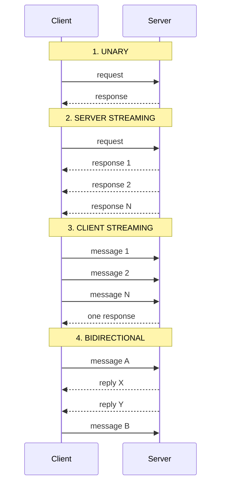
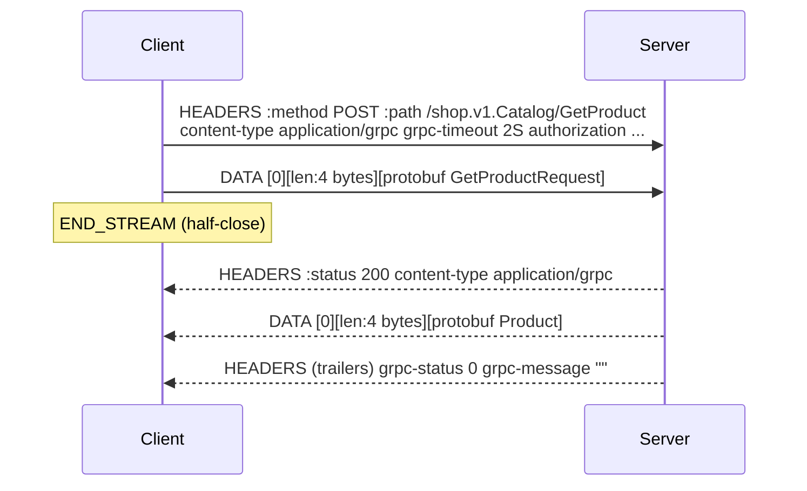
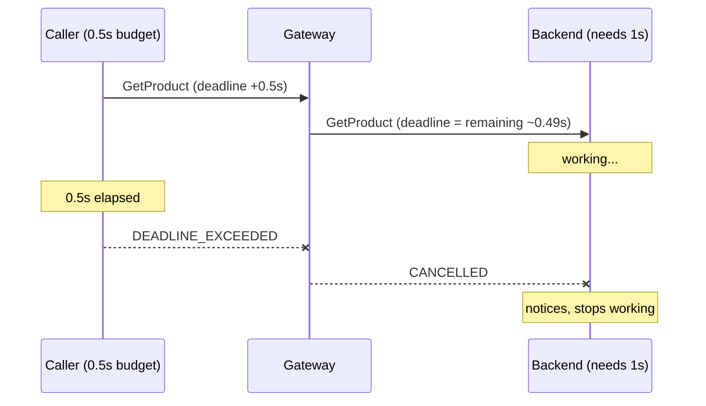
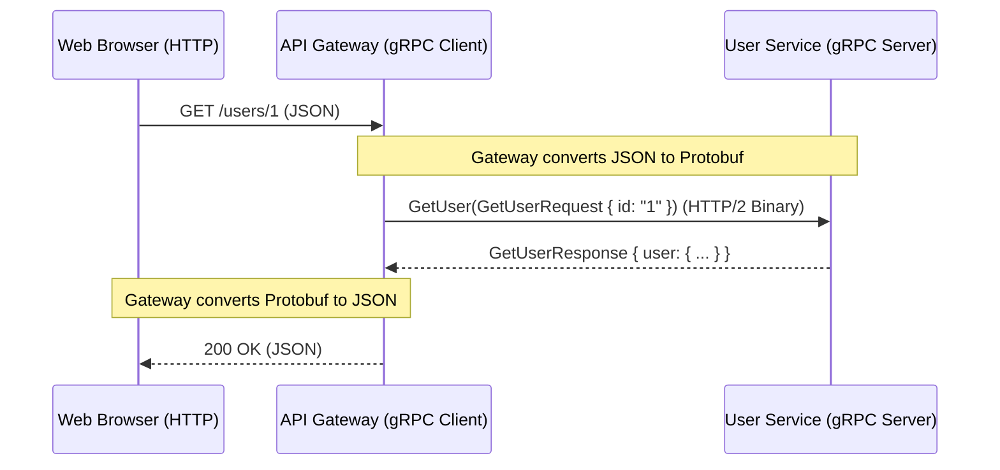

# gRPC Theory

<div data-viz="api-grpc"></div>

## What is gRPC?
gRPC (gRPC Remote Procedure Call) is a modern open-source high-performance RPC framework developed by Google. Instead of mapping actions to HTTP verbs like REST, gRPC maps actions directly to function calls (`GetUser(...)`).

It natively uses **Protocol Buffers (Protobuf)** as both its Interface Definition Language (IDL) and its underlying message interchange format, making payloads smaller and faster to serialize than JSON (see `Protobuf/`). It runs over **HTTP/2**, enabling multiplexing and bidirectional streaming.

> **Analogy:** REST is sending letters to addresses ("`GET /users/7`"). gRPC is picking up a phone that is already connected and *calling a function on the other computer*: `userService.GetUser(7)`. The call looks local; the framework handles the network.

The idea of remote procedure calls is old (1980s). gRPC's contribution is a modern, cross-language, streaming-capable version with strong tooling: one `.proto` file generates typed clients and servers in more than ten languages.

### REST vs gRPC
| | REST + JSON | gRPC + Protobuf |
| :--- | :--- | :--- |
| **Format** | JSON (text) | Protobuf (binary) |
| **Transport** | HTTP/1.1 or HTTP/2 | HTTP/2 only |
| **<abbr title="Application Programming Interface">API</abbr> model** | Resources + verbs (`GET /users/7`) | Functions (`GetUser`) |
| **Contract** | OpenAPI (optional, often drifts) | `.proto` (mandatory, generates code) |
| **Streaming** | No (SSE / WebSockets bolted on) | First-class, 4 shapes |
| **Errors** | HTTP status + JSON body | 17 gRPC status codes + typed details |
| **Deadlines** | You implement | Built in, propagate across services |
| **Browser** | Native | Needs gRPC-Web or Connect |
| **Caching** | HTTP caches, CDNs | None built in |
| **Debugging** | `curl`, browser | `grpcurl`, needs tooling |
| **Best for** | Public APIs | Internal service-to-service |

> ⚠️ Claims like "gRPC is 10x faster" are marketing. The gain depends on payload shape and language (see the measurements in `Protobuf/Theory.md`). The reliable wins are the **typed contract**, **streaming**, **deadlines** and **generated clients**.

## The Big Picture

```arch
%% caption: One .proto generates both sides; they talk over a single long-lived HTTP/2 connection.
group contract "Contract" color=amber icon=doc
node p "shop.proto" at 1,0 in contract icon=doc sub="service + messages"
group cli "Client process" color=blue icon=app
node app "Your code" at 0,1 in cli icon=code
node cs "Generated client stub" at 0,2 in cli icon=package
node ch "Channel" at 0,3 in cli icon=connection sub="1 long-lived HTTP/2 connection"
group srv "Server process" color=purple icon=server
node impl "Your implementation" at 2,1 in srv icon=code
node ss "Generated server interface" at 2,2 in srv icon=package
node sv "HTTP/2 server" at 2,3 in srv icon=server
p:B -> cs:R : "protoc + grpc plugin"
p:B -> ss:L : "protoc + grpc plugin"
app -> cs -> ch
ch <-> sv : "binary frames over TCP + TLS"
sv -> ss -> impl
```

Your code calls a method on a **stub** (a generated client). The stub serialises the request with Protobuf and sends it through a **channel** (one long-lived HTTP/2 connection). The server's generated code deserialises it and calls **your implementation**.

## Defining a Service

```protobuf
syntax = "proto3";
package shop.v1;
option go_package = "example.com/shop/shoppb;shoppb";

service Catalog {
  rpc GetProduct(GetProductRequest) returns (Product);               // 1. unary
  rpc ListProducts(ListProductsRequest) returns (stream Product);    // 2. server streaming
  rpc UploadMetrics(stream Metric) returns (UploadSummary);          // 3. client streaming
  rpc Chat(stream ChatMessage) returns (stream ChatMessage);         // 4. bidirectional
}

message Product { int64 id = 1; string name = 2; int64 price_cents = 3; int32 stock = 4; }
message GetProductRequest { int64 id = 1; }
```

Design habits that pay off later:

*   **Every RPC gets its own request and response message**, even if empty (`GetProductRequest`), so you can add fields without breaking anyone.
*   **Version the package** (`shop.v1`); a breaking redesign becomes `shop.v2` served side by side.
*   **Money as integers** (`price_cents`), never floats.
*   Use `google.protobuf.Timestamp` / `Duration` for time, `FieldMask` for partial updates.

## The Four Call Types



| Type | Use it for | Examples |
| :--- | :--- | :--- |
| **Unary** | Ordinary request/response | `GetUser`, `CreateOrder`, `Login` |
| **Server streaming** | Big result sets, live feeds, progress | `ListProducts`, `WatchPrices`, `TailLogs` |
| **Client streaming** | Uploads, batching, telemetry | `UploadFile`, `SendMetrics` |
| **Bidirectional** | Conversations, real-time sync | `Chat`, multiplayer state, voice |

In Python the trick is "generators in, generators out"; in Go it is `stream.Send` and `stream.Recv`:

```python
# server streaming, Python: every `yield` is one message on the wire
def ListProducts(self, request, context):
    for p in CATALOG:
        if not context.is_active():      # client left: stop working
            return
        yield p

# client
for product in stub.ListProducts(pb.ListProductsRequest(name_prefix="K"), timeout=5):
    print(product.name)
```

```go
// client streaming, Go
up, _ := client.UploadMetrics(ctx)
for i := 1; i <= 1000; i++ {
	up.Send(&shoppb.Metric{Name: "latency", Value: float64(i)})
}
summary, err := up.CloseAndRecv() // half-close and wait for the ONE response
```

## How It Works on the Wire (HTTP/2)

A gRPC call is one **HTTP/2 stream** inside a long-lived connection. HTTP/2 multiplexes many streams on one connection, which is why one channel can carry thousands of concurrent calls.



Key facts:

*   Always **`POST`** to `/<package>.<Service>/<Method>`. The URL is the method name.
*   **Every message is framed** with 5 bytes: a 1-byte compressed flag and a 4-byte big-endian length. That is how many messages share one stream (streaming) and how a receiver knows where each ends.
*   The **HTTP status is nearly always 200**. The real result is in the **trailers**: `grpc-status` and `grpc-message`. That is why gRPC needs HTTP/2 (HTTP/1.1 has no trailers on streams) and why browsers cannot call gRPC directly.
*   **Metadata** are the headers (request) and the initial/trailing headers (response).
*   **Deadlines** travel as the `grpc-timeout` header.
*   **Flow control** is inherited from HTTP/2: a slow receiver makes the sender's `Send` block. Go lab 2 measures it (a slow client held the server only 6 messages ahead out of 200).

## Status Codes

gRPC has its own error vocabulary. Clients receive a `code` (0-16), a `message`, and optionally typed **details**.

| Code | Name | Meaning | HTTP-ish | Retry? |
| :---: | :--- | :--- | :---: | :--- |
| 0 | `OK` | Success | 200 | |
| 1 | `CANCELLED` | Caller cancelled | 499 | no |
| 2 | `UNKNOWN` | Unclassified (a plain Go `error` becomes this!) | 500 | no |
| 3 | `INVALID_ARGUMENT` | Bad input, whatever the state | 400 | no |
| 4 | `DEADLINE_EXCEEDED` | Took too long | 504 | if idempotent |
| 5 | `NOT_FOUND` | Resource missing | 404 | no |
| 6 | `ALREADY_EXISTS` | Create conflict | 409 | no |
| 7 | `PERMISSION_DENIED` | Authenticated, not allowed | 403 | no |
| 8 | `RESOURCE_EXHAUSTED` | Quota / rate limit | 429 | with backoff |
| 9 | `FAILED_PRECONDITION` | System not in required state | 400 | after fixing state |
| 10 | `ABORTED` | Concurrency conflict | 409 | at a higher level |
| 11 | `OUT_OF_RANGE` | Past the end | 400 | no |
| 12 | `UNIMPLEMENTED` | Method not supported | 501 | no |
| 13 | `INTERNAL` | Server bug | 500 | no |
| 14 | `UNAVAILABLE` | Transient, server down/overloaded | 503 | **yes, with backoff** |
| 15 | `DATA_LOSS` | Unrecoverable loss/corruption | 500 | no |
| 16 | `UNAUTHENTICATED` | Missing/invalid credentials | 401 | no |

*   `INVALID_ARGUMENT` vs `FAILED_PRECONDITION`: the first is wrong regardless of state; the second could succeed if the system's state changed (deleting a non-empty directory).
*   **Rich errors**: attach typed details (`errdetails.BadRequest` lists which field failed) so clients react without parsing strings. Go lab 1 shows it.
*   Never return a plain error from a Go handler. It arrives as `UNKNOWN`. Wrap: `status.Error(codes.NotFound, "...")`.

## Metadata

Key-value pairs, like HTTP headers: `authorization`, `x-request-id`, `traceparent`. Keys are lower-case. Three places:

| Direction | Go | Python |
| :--- | :--- | :--- |
| Client sends | `metadata.AppendToOutgoingContext` | `stub.Method(req, metadata=(("k","v"),))` |
| Server reads | `metadata.FromIncomingContext` | `context.invocation_metadata()` |
| Server sends header / trailer | `grpc.SendHeader` / `grpc.SetTrailer` | `send_initial_metadata` / `set_trailing_metadata` |

## Deadlines, Cancellation and Cascades

> **Rule zero of gRPC: every call has a deadline.** A call without one can hang forever and pin a thread, a connection and memory.

A **timeout** is what you set (`timeout=2` in Python, `context.WithTimeout` in Go); the **deadline** is the absolute point in time it implies. It is sent to the server, and both sides enforce it.



*   **Propagate the remaining time** downstream (`context.time_remaining()` in Python; in Go, use the incoming `ctx` for outgoing calls and the deadline flows automatically). Otherwise the backend keeps working for a caller that has gone.
*   **Check for cancellation** in long handlers: `context.is_active()` (Python), `ctx.Done()` (Go).
*   Python lab 4 measures it: the caller waited 0.50 s, the gateway saw the same budget, and the backend confirmed it stopped early.

## Retries and Resilience

A client **service config** can retry declaratively:

```json
{"methodConfig": [{
  "name": [{"service": "shop.v1.Catalog", "method": "GetProduct"}],
  "retryPolicy": {"maxAttempts": 4, "initialBackoff": "0.05s", "maxBackoff": "0.5s",
                  "backoffMultiplier": 2, "retryableStatusCodes": ["UNAVAILABLE"]}}]}
```

*   Retry only **`UNAVAILABLE`** (and sometimes `DEADLINE_EXCEEDED`), never `INVALID_ARGUMENT`.
*   Only **idempotent** methods (`GetProduct` yes, `CreateOrder` no unless you send an idempotency key).
*   Backoff with jitter; cap attempts. Otherwise a struggling server gets a retry storm (see `Fundamentals/03_cross_cutting_concerns.md`).
*   `wait_for_ready` queues calls while the channel is connecting, instead of failing instantly.

## Interceptors: gRPC's Middleware

Code that wraps every call: authentication, logging, metrics, rate limiting, panic recovery, tracing. There are **unary** and **stream** variants on both client and server, and you need both, or a check on unary calls leaves streaming methods wide open.

```arch
%% caption: Interceptors wrap every call in order; auth and rate limiting can reject before the handler runs.
grid 180x90
node r "request" at 0,0 shape=pill color=slate
group chain "Interceptor chain" color=blue icon=layers
node l "Logging" at 0,1 in chain icon=logs
node rc "Recovery" at 0,2 in chain icon=shield
node a "Auth" at 0,3 in chain icon=auth
node rl "RateLimit" at 0,4 in chain icon=gauge
node h "Your handler" at 0,5 icon=code
node x "reject" at 1,3 color=red
r -> l -> rc -> a -> rl -> h
a ..> x : "UNAUTHENTICATED: handler never runs"
rl:R ..> x:B : "RESOURCE_EXHAUSTED"
```

```go
s := grpc.NewServer(
	grpc.ChainUnaryInterceptor(logging, recovery, auth),   // first = outermost
	grpc.ChainStreamInterceptor(loggingS, recoveryS, authS),
)
```

*   **Order matters.** Put logging outermost so it sees the status the inner layers produce; put recovery outside auth so panics anywhere are caught.
*   A stream interceptor that wants to change the context must **wrap the `ServerStream`** and override `Context()`.
*   Fail closed: a method missing from the access policy is denied (Go lab 3).

## Security

| Layer | What it gives you |
| :--- | :--- |
| **TLS** | Encryption + server identity. Mandatory outside localhost. |
| **mTLS** | The client also presents a certificate, so identity is in the connection itself (Go lab 4 builds a CA, issues certs and shows four ways a handshake is refused). |
| **Per-RPC credentials** | A token (JWT / OAuth) in metadata `authorization: Bearer ...`, checked by an interceptor. |
| **Authorization** | Per-method and per-object policy inside interceptors/handlers. |

*   Identity from mTLS: `peer.FromContext(ctx)` gives the certificate's Common Name / SPIFFE ID.
*   Use **short-lived certificates** with automatic rotation (service meshes, SPIFFE/SPIRE, cert-manager).
*   Never send credentials over an insecure channel; most libraries refuse per-RPC credentials on plaintext.

## Load Balancing: the Trap

```arch
%% caption: An L4 balancer spreads connections, and gRPC opens only one, so every call lands on one server.
group l4 "L4 balancer sees ONE connection" color=slate icon=lb
node c "Client" at 1,0 in l4 icon=client sub="1 HTTP/2 connection"
node lb "L4 load balancer" at 1,1 in l4 icon=lb
node s1 "Server 1" at 0,2 in l4 icon=server sub="ALL the traffic"
node s2 "Server 2" at 1,2 in l4 icon=server
node s3 "Server 3" at 2,2 in l4 icon=server
c -> lb
lb ==> s1
lb ..> s2 : "idle"
lb ..> s3 : "idle"
```

An ordinary (L4) load balancer spreads **connections**. gRPC opens **one** connection and multiplexes every call over it, so all traffic lands on a single backend. Two fixes:

1.  **Client-side load balancing**: the client resolves all backends and rotates (`round_robin` in the service config). Python lab 5 shows the default `pick_first` sending 30/30 calls to one server and `round_robin` spreading them across all three backends (about 10 each), and re-spreading when a backend dies.
2.  **A gRPC-aware (L7) proxy**: Envoy, NGINX, a service mesh (Istio, Linkerd), or a cloud gRPC load balancer, which balances **per call**.

In Kubernetes a plain ClusterIP service has exactly this problem; use a **headless service** plus client-side balancing, or a mesh.

## Operating a Server

*   **Health checking** (`grpc.health.v1`): `Check` and streaming `Watch`. Load balancers and Kubernetes probes call it. Report per-service status.
*   **Server reflection**: the server describes its own services, so `grpcurl -plaintext localhost:50051 list` works without the `.proto`. Enable in dev; think before enabling in production.
*   **Keepalive**: pings detect dead peers; `MaxConnectionIdle` recycles idle connections. Clients that ping too often are rejected (enforcement policy).
*   **Graceful shutdown**, the production recipe (Go lab 5 runs all three steps):
    1.  Mark health `NOT_SERVING` so balancers drain you.
    2.  `GracefulStop()`: refuse new calls, let in-flight calls finish.
    3.  After a timeout, `Stop()` to force-close stuck streams.
*   **Message size limits**: default receive limit is 4 MB. Stream large data instead of raising limits.
*   **Concurrency**: Python's sync server uses one thread per in-flight call; the asyncio server handles thousands of I/O-bound calls on one thread (Python lab 5: 20 slow calls took 1.03 s on 4 threads vs 0.21 s with asyncio).

## Calling gRPC From Everywhere

| Client | How |
| :--- | :--- |
| Another backend | Generated stubs |
| **Browser** | **gRPC-Web** (a modified protocol + proxy such as Envoy) or **Connect** (works over plain HTTP/1.1 and HTTP/2, speaks gRPC, gRPC-Web and its own JSON-friendly protocol) |
| **REST clients** | **gRPC-Gateway** / `google.api.http` annotations generate a JSON REST facade from the same `.proto` |
| CLI | `grpcurl`, `grpcui` |
| Mobile | Native gRPC libraries for Android/iOS |

## Testing

*   **In-process**: Go's `bufconn` gives a listener without a network; Python tests can start a server on port `0` (any free port), as every lab does.
*   **Interceptors and error paths** deserve tests as much as happy paths: unauthenticated, permission denied, deadline exceeded, server down.
*   **Contract tests**: `buf breaking` in CI to stop incompatible `.proto` changes.
*   Manual: `grpcurl -plaintext -d '{"id": 1}' localhost:50051 shop.v1.Catalog/GetProduct`.

## Real-World Scenario & Architecture

**Scenario:** A Microservices architecture where an <abbr title="Application Programming Interface">API</abbr> Gateway (acting as a gRPC client) calls a User Microservice (gRPC Server) to fetch data extremely fast.



## When to Use gRPC (and When Not To)

| Use it when | Avoid it when |
| :--- | :--- |
| Many internal services call each other | The main audience is third-party developers or browsers |
| You want typed contracts and generated clients in several languages | You need HTTP caching / CDN for reads |
| Streaming or bidirectional flows | Your team cannot operate HTTP/2-aware infrastructure yet |
| Low latency and small payloads matter | Debuggability with plain `curl` is a top priority |
| Deadlines and cancellation must span services | A simple CRUD app with one client |

## Common Pitfalls

1.  **No deadline** on calls. Set one on every client call, propagate it downstream.
2.  **L4 load balancing** pinning all traffic to one backend.
3.  **Returning plain errors** (become `UNKNOWN`) instead of `status` errors with the right code.
4.  **Retrying non-idempotent calls** (a duplicated `CreateOrder`).
5.  **Unary-only interceptors**, leaving streams unauthenticated.
6.  **Not handling `io.EOF`** on client streams: `Send` returns `io.EOF` when the server ended early; call `CloseAndRecv` to get the real error (Go lab 2).
7.  **Creating a new channel per request.** Channels are expensive and meant to be shared.
8.  **Huge messages** (default limit 4 MB). Stream them.
9.  **Ignoring cancellation** in handlers, so work continues for callers that left.
10. **Breaking the `.proto`** (renumbering fields). See `Protobuf/Theory.md`.

## Check Yourself

> ❓ **Question 1:** A unary call fails and the HTTP response status was `200`. Where is the real error, and why is it there?
>
> ❓ **Question 2:** You deployed three gRPC servers behind an L4 load balancer and two of them sit idle. Why, and what are your options?
>
> ❓ **Question 3:** A Go client's `stream.Send` starts returning `io.EOF`. What happened and what do you call to learn the real error?
>
> ❓ **Question 4:** Service A has 1 s left of its budget and calls service B. What should it pass as B's timeout, and why?
>
> ❓ **Question 5:** Which failures may you retry automatically, and which not?

**Answers**

1.  In the HTTP/2 **trailers** (`grpc-status`, `grpc-message`) that follow the response body. Trailers let a server report the outcome after streaming data, which HTTP/1.1 cannot do.
2.  gRPC keeps one long-lived HTTP/2 connection per client and multiplexes all calls on it; an L4 balancer distributes connections, not calls. Use client-side balancing (`round_robin` over all backends) or an L7 gRPC-aware proxy / mesh.
3.  The server terminated the stream (with an error or normally) before the client finished sending. Call `CloseAndRecv()` (client streaming) or `Recv()` to retrieve the actual status.
4.  The remaining time (slightly less, to leave room for its own work). Otherwise B keeps working after A has already given up.
5.  Retry `UNAVAILABLE` (and `DEADLINE_EXCEEDED` if the call is idempotent) with exponential backoff and jitter. Do not retry `INVALID_ARGUMENT`, `NOT_FOUND`, `PERMISSION_DENIED`, `UNAUTHENTICATED`; the same request fails identically. Do not retry non-idempotent calls without an idempotency key.

## Hands-On Labs

Every lab is one file that starts its own server, calls it, prints what happens and asserts the result. Labs 1-2 teach the basics; labs 3-5 are the production topics. **Python and Go cover different ground**, so do both.

Setup from the `API/` folder: `pip install -r requirements.txt`. The generated stubs are checked in; regenerate with `gRPC/labs/generate.sh` after editing `gRPC/labs/proto/shop.proto`.

| # | Python (`gRPC/labs/python/`) | You learn |
| :---: | :--- | :--- |
| 1 | `01_unary_status_codes_metadata.py` | Servicer and stub, `context.abort`, `RpcError.code()`, initial and trailing metadata, `UNAVAILABLE` when the server is gone |
| 2 | `02_four_kinds_of_streaming.py` | Server, client and bidirectional streams as generators; cancelling a stream |
| 3 | `03_interceptors_auth_logging_ratelimit.py` | Server interceptor chain: logging, token auth, per-client token bucket, error shielding; a client interceptor |
| 4 | `04_deadlines_retries_cascading.py` | Deadline cascade gateway to backend, cancellation seen by the backend, declarative retries, `wait_for_ready` |
| 5 | `05_asyncio_server_and_client_load_balancing.py` | `grpc.aio` vs threads (measured), `pick_first` vs `round_robin`, a backend dying |

| # | Go (`gRPC/labs/golang/`) | You learn |
| :---: | :--- | :--- |
| 1 | `01_unary_rich_errors_metadata` | `grpc.NewClient`, `status` errors, typed error details (`BadRequest`), header/trailer metadata, deadlines |
| 2 | `02_streaming_flow_control_cancellation` | Measured back-pressure, cancellation seen by the server, the `io.EOF` trap, bidirectional goroutines |
| 3 | `03_interceptor_chain` | Unary + stream interceptor chains, per-method access policy (secure by default), wrapping streams, panic recovery, client interceptors |
| 4 | `04_mtls_service_identity` | A private CA with `crypto/x509`, mutual TLS, identity from `peer`, four refused handshakes |
| 5 | `05_health_reflection_graceful_shutdown` | `grpc.health.v1` Check/Watch, a reflection client, idle connections, `GracefulStop` then forced `Stop` |

```bash
python gRPC/labs/python/04_deadlines_retries_cascading.py
go run ./gRPC/labs/golang/04_mtls_service_identity
```

## Exercises

1.  Add a `Rating` message and `RateProduct` unary RPC to `shop.proto`, regenerate, and implement it in both languages.
2.  Add a **metrics interceptor** (calls per method, latency histogram) to Python lab 3 and Go lab 3.
3.  Make Go lab 4's server accept a caller only if the certificate carries a SPIFFE URI SAN, not just a CN.
4.  Turn Python lab 4's retry config into an idempotency-key scheme so `CreateOrder` can be retried safely (`Fundamentals/03_cross_cutting_concerns.md`).
5.  Put `grpc-gateway` or Connect in front of the Catalog service so `curl -d '{"id":1}'` works.
6.  Run Go lab 5's server on a fixed port and explore it with `grpcurl -plaintext localhost:PORT list` and `describe`.

## Where To Go Next

*   **`Protobuf/`**: the wire format and schema-evolution rules every gRPC service depends on.
*   **`WebSockets/`**: when you need browser-native bidirectional streaming.
*   **`Fundamentals/04_choosing_the_right_api.md`**: decision tree and the full e-commerce architecture using gRPC internally.
