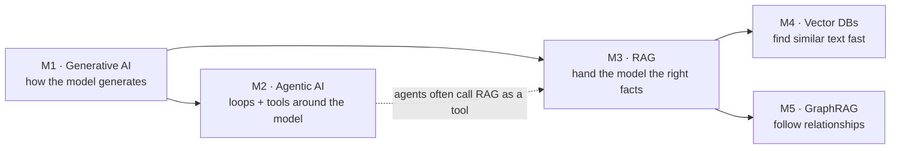
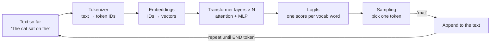
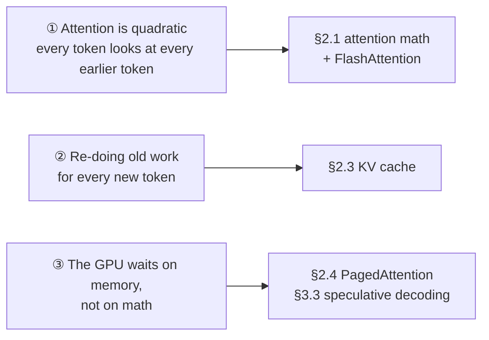
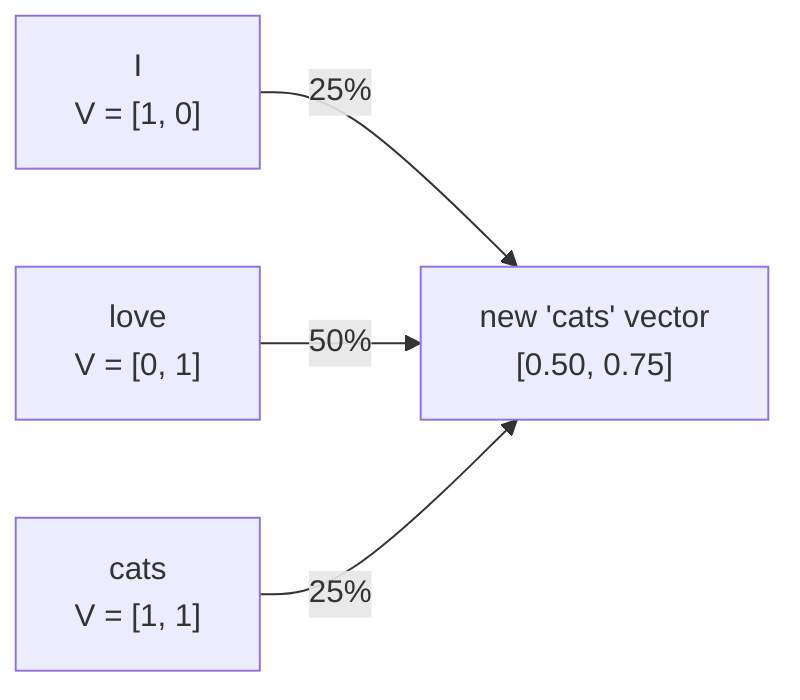
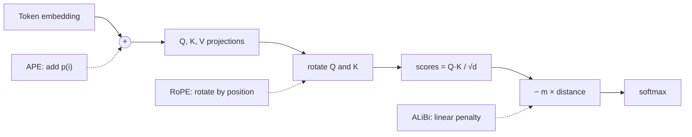
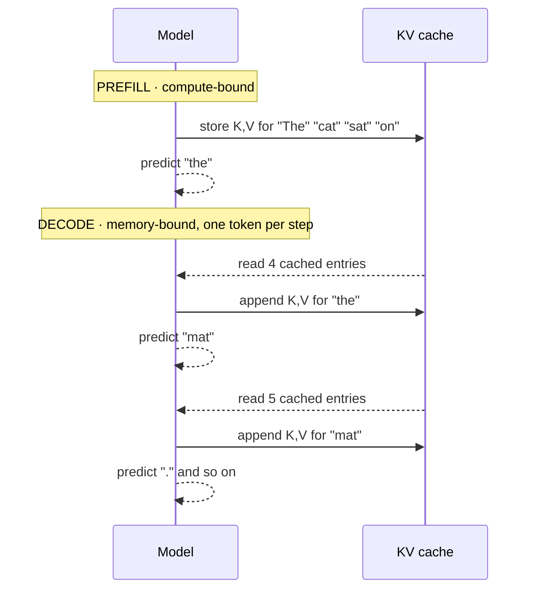
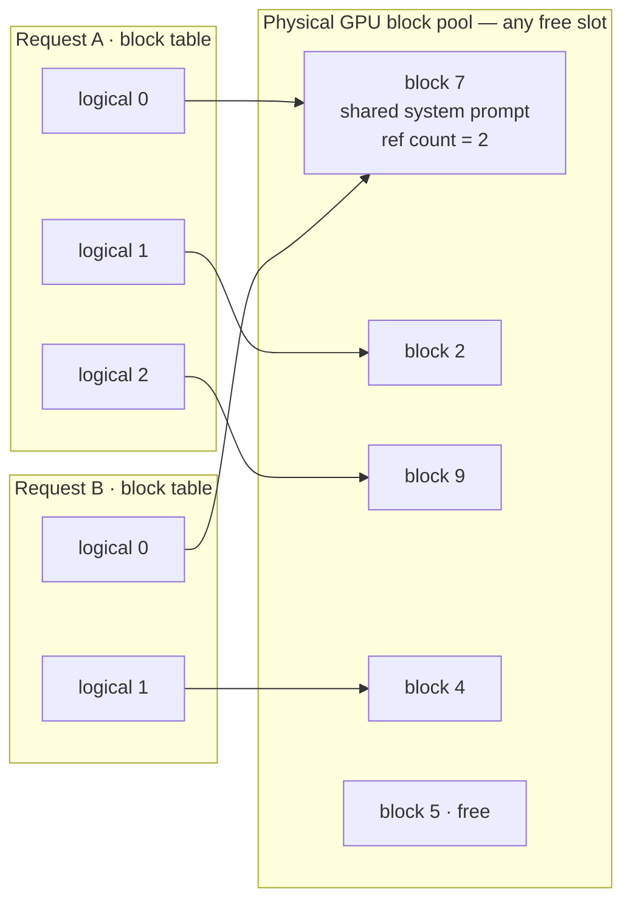
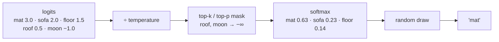
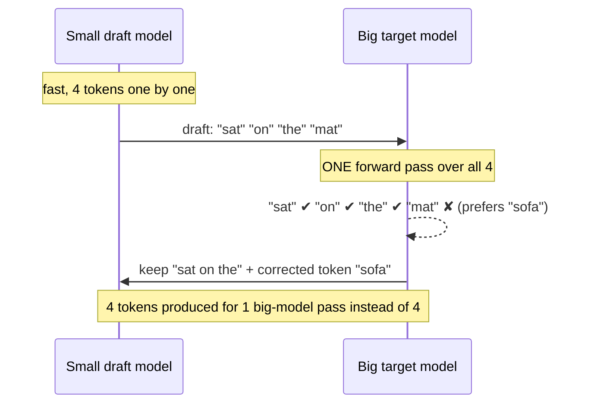
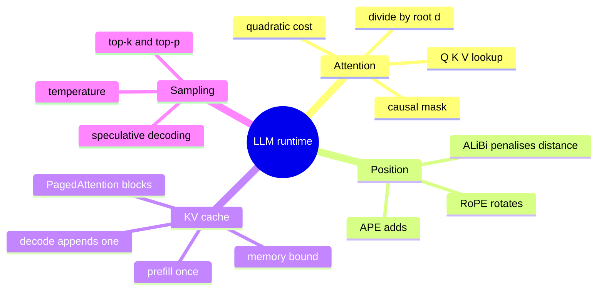

# Module 1 — Generative AI: LLM Architecture & Runtime Internals

> Scope: the actual tensor mechanics, memory arithmetic, and runtime bottlenecks of
> transformer-based autoregressive LLMs. No product-level abstractions.

---

## 0. The Picture First — read this before the math

> 💡 An LLM is a **very, very good autocomplete**. Give it some text, it guesses the next small
> piece of text (a *token*), glues it on, and guesses again. Everything in this module —
> attention, the KV cache, PagedAttention, sampling — exists to make that one guess **good**
> and **fast**.

### 0.1 Where this module fits



### 0.2 One token at a time — a simple example

Prompt: **"The cat sat on the"**



| Step | What the model sees | Top guesses (illustrative) | Picked |
|---|---|---|---|
| 1 | `The cat sat on the` | mat · sofa · floor | **mat** |
| 2 | `The cat sat on the mat` | `.` · and · `,` | **.** |
| 3 | `The cat sat on the mat.` | [END] · It · The | **[END]** |

Notice: the model never "writes a sentence." It makes **three separate predictions**, and the
program around it does the gluing.

### 0.3 The three problems this module is really about



### 0.4 Mini-glossary

| Word | Plain meaning | Tiny example |
|---|---|---|
| Token | a chunk of text, often part of a word | `unhappy` → `un` + `happy` |
| Embedding | a list of numbers standing for a token | `cat` → `[0.2, -1.3, 0.7, …]` |
| Context window | how many tokens the model can look at at once | 8k tokens ≈ 6,000 English words |
| Logits | raw score for every vocabulary word, before softmax | `mat: 3.0, sofa: 2.0, moon: -1.0` |
| Softmax | turns scores into probabilities that sum to 1 | `[2, 1, 0.1]` → `[0.66, 0.24, 0.10]` |
| KV cache | saved keys/values of past tokens, so they're never recomputed | see §2.3 |

---

## 1. Core Intuition & Mechanical Problem Statement

An LLM at inference time is a **stateful, autoregressive function approximator** that
repeatedly solves one mechanical problem: given a sequence of token embeddings, produce
a probability distribution over the next token, then feed the sampled token back in.

The entire system design difficulty comes from three competing constraints:

1. **Quadratic attention cost** — naive self-attention is $O(n^2 d)$ in sequence length
   $n$ and model dimension $d$, both in compute and in the intermediate score matrix.
2. **Autoregressive recomputation waste** — without caching, generating token $t+1$
   would require re-running the full forward pass over tokens $0..t$, an $O(n)$ blow-up
   per token, $O(n^2)$ total for a sequence of length $n$.
3. **Memory bandwidth, not FLOPs, is usually the bottleneck** — modern accelerators can
   do far more multiply-adds per second than they can move bytes from HBM to compute
   units. Inference for a single request at batch size 1 is almost always
   **memory-bandwidth-bound**, not compute-bound. This single fact explains KV-caching,
   quantization, PagedAttention, speculative decoding, and continuous batching all at
   once — they are all bandwidth-reduction strategies.

---

## 2. Algorithmic / Mathematical Foundation

### 2.1 Scaled Dot-Product Attention — full tensor mechanics

Given input hidden states $X \in \mathbb{R}^{n \times d_{model}}$:

$$
Q = XW_Q,\quad K = XW_K,\quad V = XW_V \qquad W_Q, W_K, W_V \in \mathbb{R}^{d_{model} \times d_{model}}
$$

For multi-head attention with $h$ heads, each of dimension $d_{head} = d_{model}/h$,
$Q, K, V$ are **reshaped and transposed**, not recomputed per head:

$$
Q \in \mathbb{R}^{n \times d_{model}} \;\longrightarrow\; Q_h \in \mathbb{R}^{h \times n \times d_{head}}
$$

Attention score matrix per head:

$$
S_h = \frac{Q_h K_h^\top}{\sqrt{d_{head}}} \in \mathbb{R}^{n \times n}
$$

The $\sqrt{d_{head}}$ scaling exists because the dot product of two random vectors with
unit variance components grows with dimension — variance of $q \cdot k$ is
$d_{head} \cdot \sigma_q^2 \sigma_k^2$. Without scaling, the softmax saturates
(gradients vanish) as $d_{head}$ grows, since pre-softmax logits blow up in magnitude.

**Causal masking** — for autoregressive decoding, token $i$ must not attend to token
$j > i$. This is enforced by adding $-\infty$ (in practice a large negative float, e.g.
`-1e9`) to the upper triangle of $S_h$ before softmax:

$$
S_h^{masked}[i, j] =
\begin{cases}
S_h[i,j] & j \le i \\
-\infty & j > i
\end{cases}
$$

Softmax normalizes row-wise:

$$
A_h = \mathrm{softmax}(S_h^{masked}) \in \mathbb{R}^{n \times n}, \qquad
\mathrm{Out}_h = A_h V_h \in \mathbb{R}^{n \times d_{head}}
$$

Heads are concatenated and projected back:

$$
\mathrm{MHA}(X) = \mathrm{Concat}(\mathrm{Out}_1, \dots, \mathrm{Out}_h) W_O
$$

**Complexity per layer**: $S_h = Q_hK_h^\top$ costs $O(n^2 d_{head})$ per head, summed
over $h$ heads gives $O(n^2 d_{model})$ — this is the quadratic wall. $QK^\top$, the
softmax, and $AV$ are all $O(n^2)$ in memory for the score matrix alone (this is exactly
what FlashAttention avoids materializing, by fusing the three steps into tiled kernels
that never write the full $n \times n$ matrix to HBM).

#### 🧮 Worked example — attention on "I love cats", by hand

**Analogy — a library.** Each token asks a question (**Q**, "what am I looking for?"), every
token wears a label (**K**, "this is what I'm about"), and every token carries content (**V**,
"this is what I hand over if you pick me"). Attention = compare your question against every
label, then take a *weighted blend* of the contents.

Tiny made-up 2-D vectors (`d_head = 2`):

| Token | Q — what I look for | K — my label | V — my content |
|---|---|---|---|
| I | [1, 0] | [1, 0] | [1, 0] |
| love | [0, 1] | [1, 1] | [0, 1] |
| cats | [1, 1] | [0, 1] | [1, 1] |

Follow the token **cats** through the five steps:

| Step | Operation | Result for "cats" |
|---|---|---|
| 1 | dot product of Q_cats with each K | I: 1·1+1·0 = **1** · love: 1·1+1·1 = **2** · cats: 1·0+1·1 = **1** |
| 2 | divide by √d_head = √2 ≈ 1.414 | [0.707, 1.414, 0.707] |
| 3 | causal mask (hide the future) | "cats" is last, nothing to hide → unchanged |
| 4 | softmax | [**0.25**, **0.50**, **0.25**] |
| 5 | blend the V's with those weights | 0.25·[1,0] + 0.50·[0,1] + 0.25·[1,1] = **[0.50, 0.75]** |



Do all three rows and you get the full attention-weight matrix. The causal mask is the 🚫 triangle:

| looking ↓ / looked-at → | I | love | cats |
|---|---|---|---|
| **I** | 1.00 | 🚫 | 🚫 |
| **love** | 0.33 | 0.67 | 🚫 |
| **cats** | 0.25 | 0.50 | 0.25 |

Every row sums to 1. "I" can only look at itself, so it keeps 100% of its own content.

> 💡 **Why divide by √d?** With `d_head = 128`, dot products of random vectors are typically
> around ±11. `softmax([11.3, 0])` = [0.99999, 0.00001] — one token takes everything and
> gradients vanish. Divide by √128 ≈ 11.3 first and you get `softmax([1, 0])` = [0.73, 0.27]:
> a soft, trainable blend.

> ⚠️ **The quadratic wall in numbers.** 1,000 tokens → 1,000 × 1,000 = 1 million scores per
> head, per layer. 10,000 tokens → 100 million. **10× longer text = 100× more scores.**

### 2.2 Position Encodings

Self-attention is **permutation-invariant** — without positional information,
`"dog bites man"` and `"man bites dog"` produce identical attention scores per pair.
Three families solve this differently:

**Absolute Positional Embeddings (APE, original Transformer / GPT-2 style)**

A learned or fixed vector $p_i \in \mathbb{R}^{d_{model}}$ is **added** to the token
embedding before the first layer:

$$
x_i = e_i + p_i, \qquad p_i[2k] = \sin\left(\frac{i}{10000^{2k/d}}\right), \quad
p_i[2k+1] = \cos\left(\frac{i}{10000^{2k/d}}\right)
$$

Weakness: position information is injected once, at the input, and must survive
unchanged through every subsequent layer's residual stream. It also does not
generalize past the max sequence length seen in training (learned variants), and even
the fixed sinusoidal variant degrades in relative-distance fidelity at extrapolated
lengths.

**RoPE (Rotary Position Embeddings)** — used in LLaMA, Mistral, Qwen, etc.

Instead of adding a position vector, RoPE **rotates** the $Q$ and $K$ vectors in 2D
sub-planes by an angle proportional to absolute position, such that the dot product
$q_i \cdot k_j$ after rotation depends only on the **relative** distance $i - j$, not
the absolute positions.

For a 2D pair of dimensions $(x_1, x_2)$ at position $m$ with base frequency $\theta$:

$$
\mathrm{RoPE}(x, m) = \begin{pmatrix} x_1 \cos(m\theta) - x_2 \sin(m\theta) \\
x_1 \sin(m\theta) + x_2 \cos(m\theta) \end{pmatrix}
$$

applied independently to each of the $d_{head}/2$ pairs of dimensions with
geometrically decaying frequencies $\theta_k = 10000^{-2k/d_{head}}$.

The key algebraic property: for rotation matrices $R_m$ (rotation by $m\theta$),

$$
(R_m q) \cdot (R_n k) = q^\top R_m^\top R_n k = q^\top R_{n-m} k
$$

because rotation matrices are orthogonal and compose additively — this is why RoPE
encodes **relative** position directly into the dot product used for attention scoring,
with zero extra parameters, and generalizes more gracefully to longer contexts than APE
(subject to frequency-interpolation tricks like NTK-aware scaling / YaRN for long-context
extrapolation).

**ALiBi (Attention with Linear Biases)**

No rotation, no added embedding at all. Instead, a fixed linear penalty proportional to
distance is added directly to the **attention scores**, per head, with a
head-specific slope $m_h$:

$$
S_h^{ALiBi}[i,j] = \frac{q_i \cdot k_j}{\sqrt{d_{head}}} - m_h \cdot (i - j), \quad j \le i
$$

Slopes $m_h$ are geometrically spaced across heads (e.g. $2^{-8/h}, 2^{-16/h}, \dots$),
so some heads attend broadly (small slope) and some are sharply local (large slope).
ALiBi requires zero position embeddings, extrapolates to sequence lengths far beyond
training length with minimal degradation, and adds negligible compute (one bias term
added to the score matrix, reusing the same causal-mask addition step).

| Scheme | Injected where | Extra params | Extrapolation | Encodes |
|---|---|---|---|---|
| APE | input embedding | learned: yes; sinusoidal: no | poor | absolute |
| RoPE | rotate Q,K before dot product | none | good (with scaling tricks) | relative |
| ALiBi | added to attention scores | none | best | relative (linear decay) |

#### 🧮 Worked examples — why position needs encoding, and three ways to do it

**The problem.** Attention only compares *vectors*. Without positions, `dog bites man` and
`man bites dog` are the same bag `{dog, bites, man}` — same scores, same output. Position must be
injected somehow.

**APE — a name-tag with a seat number.** Add a "position vector" to each token's embedding once,
at the very start: `x(bites, pos 1) = e(bites) + p(1)`. Simple, but the model has never seen a
`p(9000)` if it trained only to position 4096.

**RoPE — a clock hand.** Picture each Q/K pair as a clock hand that gets **rotated 10° per position**:

| Token position | Rotation | Pair | Angle between them |
|---|---|---|---|
| 3 and 5 | 30° and 50° | "2 apart" | **20°** |
| 10 and 12 | 100° and 120° | "2 apart" | **20°** |
| 1000 and 1002 | 10,000° and 10,020° | "2 apart" | **20°** |

The dot product only depends on the *angle between* the two hands, so attention "sees" **how far
apart** two tokens are, not where they sit absolutely. (Real RoPE uses a different speed per
dimension pair — some hands fast, some very slow — the idea is the same.)

**ALiBi — a distance penalty.** No vectors at all: subtract `m × distance` from each score.
With slope `m = 0.5` and four earlier tokens that all start with a raw score of 1.0:

| Looking back at… | distance | penalty | score | after softmax |
|---|---|---|---|---|
| the current token | 0 | 0 | 1.0 | **0.46** |
| 1 token back | 1 | −0.5 | 0.5 | 0.28 |
| 2 tokens back | 2 | −1.0 | 0.0 | 0.17 |
| 3 tokens back | 3 | −1.5 | −0.5 | 0.10 |

Nearby tokens win by default. A head with a tiny slope (say `m = 0.02`) barely penalises
distance, so different heads naturally become "local" or "global" readers.



### 2.3 KV Cache — the mechanism that makes autoregressive decoding tractable

Without caching, generating token $t+1$ requires recomputing $K, V$ for tokens
$0 \dots t$ at every layer, every step — $O(n)$ redundant work per generated token.

**Insight**: $K$ and $V$ for already-generated tokens never change (causal masking
guarantees token $i$'s representation never depends on tokens $> i$). So $K_i, V_i$ can
be computed **once**, cached, and reused for every subsequent decoding step. Only the
newest token's $Q, K, V$ need to be computed at each step; the new $K, V$ are appended
to the cache, and attention is computed as $Q_{new} \cdot K_{cache}^\top$.

**Memory footprint formula**:

$$
\text{KV cache bytes} = 2 \times n_{layers} \times n_{heads} \times d_{head} \times n_{tokens} \times \text{bytes\_per\_element}
$$

The leading $2$ accounts for storing **both** $K$ and $V$. For a 32-layer, 32-head,
$d_{head}=128$ model (so $d_{model}=4096$, e.g. LLaMA-2 7B-class) at fp16
(2 bytes/element), a 4096-token context costs:

$$
2 \times 32 \times 32 \times 128 \times 4096 \times 2 \;\text{bytes} \approx 2.15\,\text{GB}
$$

**...per sequence in the batch.** This is why batch size at long context is
memory-capacity-bound, not compute-bound — with 40GB of HBM and a 2GB/sequence KV
cache, you can fit roughly 20 concurrent long-context sequences regardless of how much
compute headroom the GPU has.

**Memory-bound vs. compute-bound, precisely**: the "arithmetic intensity" of an
operation is $\frac{\text{FLOPs}}{\text{bytes moved}}$. Decoding one token requires
reading the *entire* KV cache (and model weights) from HBM but only performs
$O(n \cdot d)$ FLOPs against it (one query against $n$ cached keys) — arithmetic
intensity is low, so the GPU spends most of its cycles waiting on memory bandwidth, not
computing. This is fundamentally different from the **prefill** phase (processing the
prompt), where the full $Q K^\top$ over all prompt tokens simultaneously gives high
arithmetic intensity — prefill is compute-bound, decode is memory-bound. This
asymmetry is why serving engines treat prefill and decode as separate scheduling
phases (see PagedAttention/continuous batching below).

#### 🧮 Worked example — what the KV cache actually saves

**Analogy.** Reading a long book, you jot a sticky note per page. To understand page 11 you glance
at your 10 notes — you don't re-read pages 1–10. The KV cache is the stack of sticky notes.

Prompt: **"The cat sat on"** (4 tokens) · generate **5** tokens. Count how many tokens get
their K and V computed:

| Generation step | Without cache: tokens processed | With cache: tokens processed |
|---|---|---|
| 1 (prefill) | 4 | 4 — the whole prompt, once |
| 2 | 5 | 1 — only the newest token |
| 3 | 6 | 1 |
| 4 | 7 | 1 |
| 5 | 8 | 1 |
| **Total** | **30** | **8** |

Without the cache the work grows like 1 + 2 + 3 + … (quadratic). With it, each new token costs one
token's worth of K/V work.



**The bill.** For a 7B-class model (32 layers, 32 heads, d_head 128, fp16):

| Amount of context | KV cache size |
|---|---|
| 1 token | 2 × 32 × 32 × 128 × 2 bytes = **512 KiB** (half a megabyte!) |
| 4,096 tokens (one long chat) | **≈ 2.15 GB** |
| 20 users, each with a 4,096-token chat | **≈ 43 GB** — more than the model weights themselves |

| | Prefill | Decode |
|---|---|---|
| Everyday analogy | reading the whole question in one go | writing the answer one word at a time |
| Tokens per forward pass | all prompt tokens together | 1 |
| The GPU is mostly… | busy multiplying (compute-bound) | waiting for bytes from memory (memory-bound) |

### 2.4 PagedAttention & vLLM memory management

**Problem PagedAttention solves**: naive KV cache allocation reserves a contiguous
buffer sized for the *maximum possible sequence length* per request, even though actual
generated length is unknown in advance and highly variable. This causes catastrophic
**internal fragmentation** — memory reserved but never used — and **external
fragmentation** as variable-length sequences finish and free memory in a way that
leaves unusable gaps between other sequences' contiguous buffers. Reported vLLM paper
findings: 60–80% memory waste under naive contiguous allocation.

**Mechanism**: PagedAttention borrows the OS virtual-memory paging idea. The KV cache
for a sequence is split into fixed-size **blocks** (e.g. 16 tokens per block). A
**block table** (per sequence, analogous to a page table) maps logical token positions
to physical block addresses, which need not be contiguous in physical memory:

```
Sequence's logical KV blocks:     [ blk_0 | blk_1 | blk_2 | ... ]
Block table (logical -> physical): 0->7, 1->2, 2->19, ...
Physical GPU memory (block pool):  [blk#0][blk#1][blk#2]...[blk#N]  (fixed-size slabs)
```

Attention computation over a sequence walks the block table and gathers the
non-contiguous physical blocks — a small extra indirection cost, hugely outweighed by
eliminating fragmentation. Benefits:

- **Near-zero internal fragmentation**: blocks are allocated on demand, one at a time,
  as generation proceeds — never pre-reserved for a worst-case length.
- **Copy-on-write sharing**: for beam search or shared system prompts, multiple
  sequences can reference the *same physical blocks* via their block tables (reference
  counted), only forking (copying) a block once a sequence actually diverges and writes
  to it — critical for prompt-prefix caching across concurrent requests.
- **Preemption/swapping**: a sequence's block table can be evicted to CPU memory and
  restored later without needing a contiguous GPU allocation on return.

---

#### 🖼️ PagedAttention as a hotel

**Naive allocation** is a hotel that reserves an entire floor of 2,048 rooms for every guest group,
because it doesn't know how many will turn up. **PagedAttention** hands out rooms in small blocks
wherever they're free, and gives each group a card listing its room numbers (the *block table*).

**Worked example.** A request's answer turns out to be 100 tokens long.

| Strategy | Slots reserved | Slots actually used | Wasted |
|---|---|---|---|
| Contiguous, sized for max length 2,048 | 2,048 | 100 | 1,948 (**95%**) |
| Paged, 16 tokens per block | 7 blocks = 112 | 100 | 12 — never more than one partly-filled block |



> 💡 This is exactly how an operating system's virtual memory works: page table → physical pages.
> If you've learned paging in an OS course, you already understand vLLM.

---

## 3. Low-Level Execution Flow & Data Structures

### 3.1 End-to-end request lifecycle

```
┌──────────────────────────────────────────────────────────────────────────┐
│ PREFILL PHASE (compute-bound)                                            │
│   Input: prompt tokens [t0, t1, ..., tk]                                 │
│   For each layer:                                                        │
│     Q,K,V = X @ Wq, X @ Wk, X @ Wv     over ALL k tokens at once         │
│     S = QK^T / sqrt(d_head)  (n x n matrix, causal masked)               │
│     KV cache[layer] <- K, V for all k tokens (one-time write)            │
│   Output: logits for position k -> sample token t_{k+1}                  │
└──────────────────────────────────────────────────────────────────────────┘
                                    │
                                    ▼
┌──────────────────────────────────────────────────────────────────────────┐
│ DECODE PHASE (memory-bandwidth-bound), repeated per generated token      │
│   Input: single new token t_{k+1}                                        │
│   For each layer:                                                        │
│     q,k_new,v_new = embed(t_{k+1}) @ Wq, Wk, Wv     (1 x d_model)        │
│     KV cache[layer].append(k_new, v_new)             (paged block alloc) │
│     S = q @ KV_cache[layer].K^T / sqrt(d_head)       (1 x n_cached)      │
│     out = softmax(S) @ KV_cache[layer].V                                 │
│   Output: logits -> sample next token -> repeat                          │
└──────────────────────────────────────────────────────────────────────────┘
```

### 3.2 KV cache as a data structure

Conceptually, per layer, per head: a growing 2D array `[n_tokens, d_head]` for K and
another for V. In a paged runtime, this is instead a **list of fixed-size block
pointers** plus a small table (dict) mapping sequence → ordered block IDs, with a
global free-block pool (a simple stack/queue of available physical block indices).

### 3.3 Sampling pipeline (per decode step)

```
logits (vocab_size,)
    │
    ├─► divide by temperature T          logits' = logits / T
    │
    ├─► optional top-k mask               keep top k, others -> -inf
    │
    ├─► optional top-p (nucleus) mask     keep smallest prefix of sorted
    │                                     probs whose cumsum >= p
    │
    ├─► softmax -> probability distribution
    │
    └─► sample (multinomial draw, or argmax if greedy)
```

**Speculative decoding** changes this loop structurally: a small, cheap **draft model**
generates $k$ candidate tokens autoregressively (cheap, since it's small). The large
**target model** then verifies all $k$ draft tokens **in a single forward pass**
(this works because verifying is just one prefill-style parallel pass over $k$ tokens,
compute-bound and cheap relative to $k$ sequential memory-bound decode steps). Each
draft token is accepted if the target model's probability for it exceeds a
rejection-sampling threshold derived from the ratio of target/draft probabilities;
the first rejected token is resampled from a corrected distribution, and everything
after it is discarded. Expected speedup is roughly proportional to the average number
of accepted draft tokens per verification pass, since one memory-bound decode-phase
pass over the target model now yields multiple tokens instead of one.

---

#### 🧮 Worked example — temperature: how adventurous is the model?

Prompt: *"My pet is a ___"* · logits: **cat 2.0 · dog 1.0 · car 0.1**

| Temperature | cat | dog | car | Feels like |
|---|---|---|---|---|
| 0.5 (cold) | **0.864** | 0.117 | 0.019 | safe, repetitive — almost always "cat" |
| 1.0 (neutral) | 0.659 | 0.242 | 0.099 | the model's own distribution |
| 2.0 (hot) | 0.502 | 0.304 | **0.194** | creative… and "My pet is a car" 1 time in 5 |

Dividing logits by T < 1 stretches the gaps (the favourite wins more); T > 1 squashes them (long
shots get a real chance).

#### 🧮 Worked example — top-k vs. top-p

Prompt: *"The cat sat on the ___"*

| Token | Probability | Running total | top-k = 2 | top-p = 0.9 |
|---|---|---|---|---|
| mat | 0.591 | 0.591 | ✔ | ✔ |
| sofa | 0.217 | 0.809 | ✔ | ✔ (still below 0.9) |
| floor | 0.132 | **0.941** | ✘ | ✔ (crosses 0.9 → stop here) |
| roof | 0.049 | 0.989 | ✘ | ✘ |
| moon | 0.011 | 1.000 | ✘ | ✘ |

After filtering, the survivors are renormalised to sum to 1:

- **top-k = 2** → mat 0.731 · sofa 0.269
- **top-p = 0.9** → mat 0.629 · sofa 0.231 · floor 0.140

Top-k always keeps exactly *k* tokens. Top-p keeps *however many it takes* — few when the model is
confident, many when it's unsure. "moon" is removed either way.



#### 🖼️ Speculative decoding — an intern drafts, the expert checks



The output distribution is mathematically the same as if the big model had generated alone —
the draft only changes *speed*, never *quality*. The better the draft guesses, the bigger the win.

---

## 4. Edge Cases, Failure Modes & Hardware Bottlenecks

- **Softmax overflow**: raw logits before the `- max(logits)` stabilization can
  overflow `exp()` for large magnitude scores — always subtract the row-max before
  exponentiating (shown in the code below).
- **Causal mask off-by-one**: using `k=0` instead of `k=1` in the upper-triangular mask
  construction silently allows a token to attend to itself *and* leaks a subtle
  self-loop bias; using `k=2` silently hides one valid past token. Off-by-one errors
  here are invisible in loss curves but catastrophic for long-range consistency.
- **RoPE frequency mismatch at inference**: if the base $\theta$ (or the NTK/YaRN
  scaling factor) used at inference doesn't match training, relative-position dot
  products drift and quality silently degrades well before context length is
  technically exceeded.
- **KV cache dtype mismatch**: storing KV cache in fp32 when the model was trained/
  served in fp16/bf16 doubles memory footprint for zero accuracy benefit in the vast
  majority of cases — a common accidental 2x memory regression.
- **Fragmentation collapse under naive allocation**: without paging, a server handling
  many variable-length concurrent requests can hit out-of-memory *even with large
  aggregate free memory*, purely because no single contiguous block is large enough —
  this is the exact failure mode PagedAttention targets.
- **Top-p with p too small / degenerate distributions**: if the top token's probability
  alone exceeds $p$, nucleus sampling degenerates to greedy — this is correct behavior,
  not a bug, but a common source of "why is nucleus sampling deterministic here"
  confusion.
- **Prefill/decode phase interference**: in a continuous-batching server, injecting a
  new request's compute-bound prefill in the middle of a batch of memory-bound decode
  steps can spike latency for in-flight decode requests ("head-of-line blocking") —
  production servers (e.g. vLLM, TGI) use chunked prefill to interleave prefill work in
  small slices between decode steps rather than running it as one atomic block.

---

## 5. From-Scratch Reference Code

```python
"""
Minimal, dependency-light (NumPy only) reference implementations of:
  1. Multi-head scaled dot-product self-attention with causal masking
  2. KV-cache memory footprint calculation
  3. A KV-cache simulator (incremental append vs. full recompute)
  4. Temperature / top-k / top-p sampling
No PyTorch, no transformers library, no autograd — pure tensor mechanics.
"""
import math
import numpy as np


# ---------------------------------------------------------------------------
# 1. Scaled dot-product attention
# ---------------------------------------------------------------------------
def softmax(x: np.ndarray, axis: int = -1) -> np.ndarray:
    """Numerically stable softmax: subtract row-max before exponentiating."""
    x = x - np.max(x, axis=axis, keepdims=True)
    e = np.exp(x)
    return e / np.sum(e, axis=axis, keepdims=True)


def causal_mask(seq_len: int) -> np.ndarray:
    """Additive mask: 0 where attention is allowed, -1e9 where forbidden
    (strictly upper triangle, i.e. future positions)."""
    return np.triu(np.ones((seq_len, seq_len)), k=1) * -1e9


def scaled_dot_product_attention(Q: np.ndarray, K: np.ndarray, V: np.ndarray,
                                  mask: np.ndarray = None):
    """Q, K, V: (seq_len, d_head). Returns (output, attention_weights)."""
    d_k = Q.shape[-1]
    scores = Q @ K.T / math.sqrt(d_k)          # (seq, seq)
    if mask is not None:
        scores = scores + mask
    weights = softmax(scores, axis=-1)          # (seq, seq), rows sum to 1
    output = weights @ V                        # (seq, d_head)
    return output, weights


def multi_head_attention(X: np.ndarray, Wq, Wk, Wv, Wo, n_heads: int):
    """X: (seq_len, d_model). Full MHA block with causal masking."""
    seq_len, d_model = X.shape
    d_head = d_model // n_heads
    Q, K, V = X @ Wq, X @ Wk, X @ Wv

    def split_heads(x):
        return x.reshape(seq_len, n_heads, d_head).transpose(1, 0, 2)

    Qh, Kh, Vh = split_heads(Q), split_heads(K), split_heads(V)
    mask = causal_mask(seq_len)

    head_outputs = []
    for h in range(n_heads):
        out, _ = scaled_dot_product_attention(Qh[h], Kh[h], Vh[h], mask)
        head_outputs.append(out)

    concat = np.concatenate(head_outputs, axis=-1)   # (seq, d_model)
    return concat @ Wo


# ---------------------------------------------------------------------------
# 2. KV cache memory footprint
# ---------------------------------------------------------------------------
def kv_cache_bytes(n_layers: int, n_heads: int, d_head: int,
                    tokens: int, dtype_bytes: int = 2) -> int:
    """2x for K and V, per layer, per head, per token, per element."""
    return 2 * n_layers * n_heads * d_head * tokens * dtype_bytes


# ---------------------------------------------------------------------------
# 3. KV cache simulator: append-only cache vs. full recompute
# ---------------------------------------------------------------------------
class KVCacheSimulator:
    """Demonstrates why caching turns O(n^2) generation into O(n)."""

    def __init__(self, n_layers: int):
        self.n_layers = n_layers
        self._k = [[] for _ in range(n_layers)]
        self._v = [[] for _ in range(n_layers)]
        self.recompute_flops = 0
        self.cached_flops = 0

    def decode_step_recompute(self, all_tokens_so_far: int, d_head: int):
        """No cache: must recompute K,V for every token, every step."""
        self.recompute_flops += all_tokens_so_far * d_head * 2  # rough QK+AV proxy

    def decode_step_cached(self, k_vec: np.ndarray, v_vec: np.ndarray, layer: int):
        """With cache: only compute and append the new token's K,V."""
        self._k[layer].append(k_vec)
        self._v[layer].append(v_vec)
        self.cached_flops += k_vec.shape[0] * 2

    def get_cache(self, layer: int):
        return np.stack(self._k[layer]), np.stack(self._v[layer])


# ---------------------------------------------------------------------------
# 4. Decoding strategies: temperature, top-k, top-p
# ---------------------------------------------------------------------------
def temperature_scale(logits: np.ndarray, temperature: float) -> np.ndarray:
    if temperature <= 0:
        raise ValueError("temperature must be > 0; use argmax for greedy decoding")
    return logits / temperature


def top_k_filter(logits: np.ndarray, k: int) -> np.ndarray:
    """Keep only the top-k logits, mask the rest to -inf."""
    idx = np.argsort(logits)[::-1][:k]
    out = np.full_like(logits, -np.inf)
    out[idx] = logits[idx]
    return out


def top_p_filter(logits: np.ndarray, p: float) -> np.ndarray:
    """Nucleus sampling: keep the smallest prefix of sorted probs whose
    cumulative mass >= p."""
    order = np.argsort(logits)[::-1]
    probs = softmax(logits[order])
    cumulative = np.cumsum(probs)
    cutoff = int(np.searchsorted(cumulative, p)) + 1
    keep = order[:cutoff]
    out = np.full_like(logits, -np.inf)
    out[keep] = logits[keep]
    return out


def sample_next_token(logits: np.ndarray, temperature: float = 1.0,
                       top_k: int = None, top_p: float = None,
                       rng: np.random.Generator = None) -> int:
    rng = rng or np.random.default_rng()
    scaled = temperature_scale(logits, temperature)
    if top_k is not None:
        scaled = top_k_filter(scaled, top_k)
    if top_p is not None:
        scaled = top_p_filter(scaled, top_p)
    probs = softmax(scaled)
    return int(rng.choice(len(probs), p=probs))


# ---------------------------------------------------------------------------
# Self-test / demonstration
# ---------------------------------------------------------------------------
if __name__ == "__main__":
    rng = np.random.default_rng(0)
    seq_len, d_model, n_heads = 6, 8, 2

    X = rng.standard_normal((seq_len, d_model))
    Wq, Wk, Wv, Wo = (rng.standard_normal((d_model, d_model)) * 0.1 for _ in range(4))

    out = multi_head_attention(X, Wq, Wk, Wv, Wo, n_heads)
    print(f"MHA output shape: {out.shape}  (expected ({seq_len}, {d_model}))")

    footprint = kv_cache_bytes(n_layers=32, n_heads=32, d_head=128, tokens=4096)
    print(f"KV cache, 32L/32H/128d, 4096 tokens, fp16: {footprint / 1e9:.3f} GB")

    logits = rng.standard_normal(10) * 2
    tok = sample_next_token(logits, temperature=0.8, top_k=5, top_p=0.9, rng=rng)
    print(f"Sampled token index under temp=0.8, top_k=5, top_p=0.9: {tok}")

    print("Self-test complete: causal attention, KV footprint math, and "
          "sampling pipeline all executed without error.")
```

**Sample output:**

```
MHA output shape: (6, 8)  (expected (6, 8))
KV cache, 32L/32H/128d, 4096 tokens, fp16: 2.147 GB
Sampled token index under temp=0.8, top_k=5, top_p=0.9: 8
Self-test complete: causal attention, KV footprint math, and sampling pipeline all executed without error.
```

---

## 6. Recap & Self-Check



| Idea | Remember it as |
|---|---|
| Attention | "compare my question to everyone's label, blend their contents" |
| √d scaling | "keep softmax soft" |
| RoPE | "clock hands — only the angle *between* them matters" |
| KV cache | "sticky notes, so you never re-read old pages" |
| Prefill vs decode | "reading the question is compute; writing the answer is memory" |
| PagedAttention | "hotel rooms handed out one block at a time" |
| Temperature / top-p | "how adventurous / how many candidates stay in the hat" |
| Speculative decoding | "an intern drafts, the expert checks four words in one glance" |

**Test yourself** — answer out loud first, then open.

<details>
<summary>1. In the "I love cats" example, why does "cats" give 50% of its attention to "love"?</summary>

Q_cats · K_love = 2 is the largest dot product (the other two are 1), so after scaling and softmax it
gets the biggest weight: [0.25, 0.50, 0.25].

</details>

<details>
<summary>2. What breaks if you forget to divide by √d_head?</summary>

Dot products grow with dimension, softmax saturates to nearly one-hot (e.g. 0.99999 vs 0.00001), and
gradients vanish — the model can't learn soft blends.

</details>

<details>
<summary>3. Prompt of 4 tokens, generate 5. Why 30 token-computations without a cache but only 8 with one?</summary>

Without a cache every step re-processes the whole sequence: 4 + 5 + 6 + 7 + 8 = 30. With a cache the
prompt is processed once (4), then each later step adds just its one new token (4 × 1) = 8.

</details>

<details>
<summary>4. Why is decoding memory-bound rather than compute-bound?</summary>

Each step does little arithmetic (one query against the cached keys) but must read all the weights and
the whole KV cache from GPU memory. The GPU spends most of its time waiting for bytes to arrive.

</details>

<details>
<summary>5. Top-p = 0.9 and the model gives its top token probability 0.95. How many tokens survive?</summary>

Just one — the running total crosses 0.9 at the first token. Nucleus sampling becomes greedy. That's
correct behaviour, not a bug.

</details>

**Try it:** a model with 80 layers, 64 attention heads, d_head = 128, fp16, holding one 8,192-token
conversation. How big is its KV cache?

<details>
<summary>Answer</summary>

2 × 80 × 64 × 128 × 8,192 × 2 bytes ≈ **21.5 GB** for a single conversation. That's why real 70B-class
models use *grouped-query attention*: only 8 key/value heads are stored instead of 64, making the
cache 8× smaller (≈ 2.7 GB).

</details>

**Next:** Module 2 wraps this one-token-at-a-time function in a loop and gives it tools.
