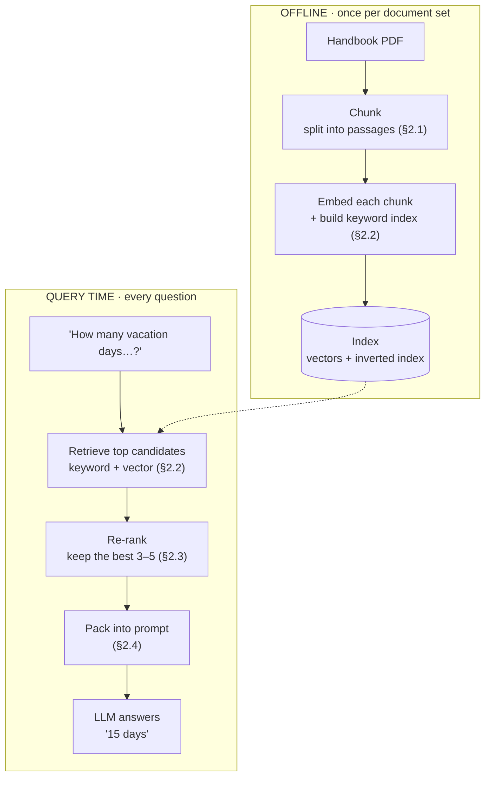
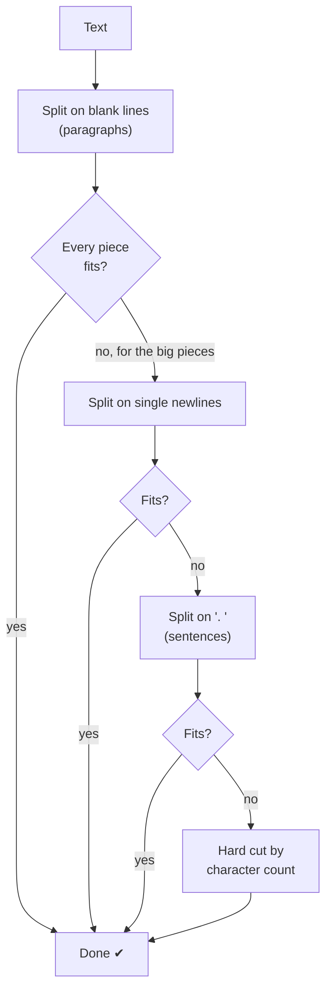
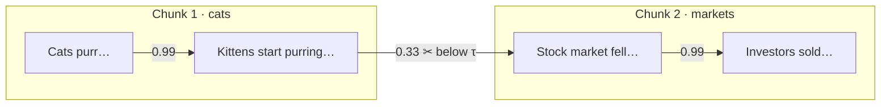
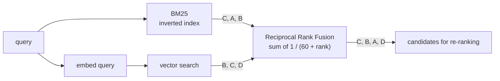
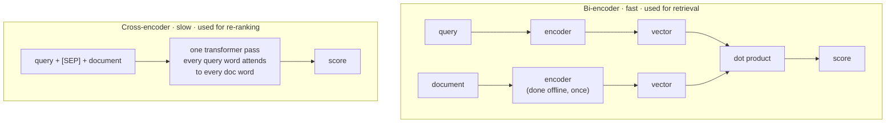
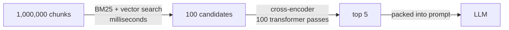
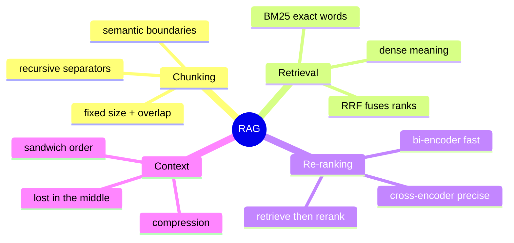

# Module 3 — Retrieval-Augmented Generation: RAG Internals

> Scope: the actual token/character-level chunking math, the inverted-index and
> vector-similarity algorithms underneath "search," score-fusion arithmetic, and the
> attention-level reason cross-encoder re-ranking is expensive to run at scale.

---

## 0. The Picture First — read this before the formulas

> 💡 RAG is an **open-book exam**. Instead of hoping the model memorized the answer, you first
> *look up* the right pages, then hand those pages to the model along with the question. The
> model reads, then answers.

### 0.1 The running example

A company chatbot over an employee handbook.

> **Question:** "How many vacation days do new employees get?"
>
> **Handbook, page 14:** "Employees in their first year receive 15 days of paid vacation."

| | Prompt sent to the LLM | Likely answer |
|---|---|---|
| **Without RAG** | the question only | a generic guess ("most companies give 10–20 days…") — it has never seen *your* handbook |
| **With RAG** | page 14's text **+** the question | "15 days in the first year." — read straight off the page |

### 0.2 Two phases: prepare the library, then look things up



### 0.3 Where RAG can go wrong — one per section

| Stage | What can go wrong (in the example) | Section |
|---|---|---|
| Chunking | "15 days" lands in a different chunk than "first year" | §2.1 |
| Retrieval | question says "vacation", handbook says "paid time off" → keyword search misses it | §2.2 |
| Re-ranking | the right page is candidate #40 but only the top 5 are kept | §2.3 |
| Context packing | the right page is buried in the middle of 20 pages and the model skims past it | §2.4 |

---

## 1. Core Intuition & Mechanical Problem Statement

RAG exists to solve one mechanical constraint: an LLM's context window is small and
its parametric knowledge is frozen at training time. RAG is a **retrieval system
wired into a generation prompt** — nothing more mystical than: index a corpus, find
the $k$ most relevant fragments for a query, and concatenate them into the prompt
before generation. The entire engineering difficulty is in getting "most relevant"
right, cheaply, at scale, in a way that survives the way transformers actually attend
over long, heterogeneous context (see §2.4, "lost in the middle").

---

## 2. Algorithmic / Mathematical Foundation

### 2.1 Chunking mechanics

**Fixed-token chunking**: split text every $N$ tokens (often with an overlap $O$ to
avoid severing a sentence at a chunk boundary and losing local context). Simplest and
cheapest, but blind to semantic or syntactic boundaries — can split a sentence, a
table row, or a code block mid-structure.

**Recursive character chunking** (used by most production splitters): attempt to
split on a prioritized list of separators, falling back progressively:

```
try split on "\n\n" (paragraph)
  if resulting chunk still > max_size: try split on "\n" (line)
    if still > max_size: try split on ". " (sentence)
      if still > max_size: hard split on character count
```

This greedily respects the largest structurally-meaningful boundary that still fits
the size budget — a recursive descent through separator granularity, structurally
identical to a fallback chain, not a single regex.

**Semantic chunking (boundary detection via similarity gradient)**: embed each
sentence, then walk the sequence of sentence embeddings computing cosine similarity
between consecutive sentences $s_i, s_{i+1}$. A chunk boundary is placed wherever the
similarity **drops below a threshold** (or forms a local minimum in the similarity
curve) — i.e. where topic drift is detected:

$$
\text{sim}(i, i+1) = \frac{e_i \cdot e_{i+1}}{\|e_i\|\|e_{i+1}\|}, \qquad
\text{boundary at } i \iff \text{sim}(i, i+1) < \tau
$$

This costs one embedding call per sentence up front (more expensive than fixed/
recursive chunking) but produces chunks that are far more likely to be
**topically coherent single units**, which matters directly for retrieval precision —
a chunk straddling two unrelated topics dilutes its own embedding, pulling it toward
neither topic's query cluster.

#### 🧮 Worked example — three ways to chunk the same handbook page

```text
Vacation policy. Employees in their first year receive 15 days of paid vacation. After five years this rises to 20 days.

Sick leave. Employees get 10 sick days per year.
```

**① Fixed size — 10 words, no overlap**

| Chunk | Text | Problem |
|---|---|---|
| 1 | Vacation policy. Employees in their first year receive 15 days | "of paid vacation" cut off |
| 2 | of paid vacation. After five years this rises to 20 | "20" separated from "days" |
| 3 | days. Sick leave. Employees get 10 sick days per year. | two topics glued together |

Ask "how many days after five years?" — no single chunk contains "five years … 20 days".

**② Fixed size — 10 words, overlap 3** (each chunk repeats the last 3 words of the previous one)

| Chunk | Text |
|---|---|
| 1 | Vacation policy. Employees in their first year receive 15 days |
| 2 | receive 15 days of paid vacation. After five years this |
| 3 | five years this rises to 20 days. Sick leave. Employees |
| 4 | Sick leave. Employees get 10 sick days per year. |

Chunk 3 now holds "five years … rises to 20 days" intact. Overlap costs extra storage and
still can't guarantee every fact survives.

**③ Recursive** (max 25 words): split on the blank line first — both paragraphs already fit, done.

| Chunk | Text |
|---|---|
| A | Vacation policy. … After five years this rises to 20 days. *(21 words)* |
| B | Sick leave. Employees get 10 sick days per year. *(9 words)* |

One topic per chunk, nothing severed.



**④ Semantic chunking** — cut where the *meaning* changes. Toy 2-D sentence embeddings, threshold τ = 0.8:

| Sentence pair | Cosine similarity | Cut? |
|---|---|---|
| "Cats purr when they are happy." → "Kittens start purring within days." | 0.993 | no |
| "Kittens start purring within days." → "The stock market fell today." | **0.330** | ✂️ **yes** |
| "The stock market fell today." → "Investors sold tech shares." | 0.994 | no |



### 2.2 Retrieval pipeline mechanics

**Sparse retrieval — BM25**. BM25 scores a document $D$ against a query $Q$ by
summing, over each query term $q_i$, a term-frequency-saturating, length-normalized
weight:

$$
\text{BM25}(D, Q) = \sum_{q_i \in Q} \text{IDF}(q_i) \cdot
\frac{f(q_i, D) \cdot (k_1 + 1)}{f(q_i, D) + k_1 \left(1 - b + b \cdot \frac{|D|}{\text{avgdl}}\right)}
$$

where $f(q_i, D)$ is the raw term frequency in $D$, $|D|$ is document length,
$\text{avgdl}$ is the corpus average document length, and:

$$
\text{IDF}(q_i) = \ln\left(\frac{N - n(q_i) + 0.5}{n(q_i) + 0.5} + 1\right)
$$

with $N$ = total documents, $n(q_i)$ = number of documents containing $q_i$.
Mechanically:

- $k_1$ (typically 1.2–2.0) controls **term-frequency saturation** — the marginal
  value of a 5th occurrence of a term is much less than the 1st; without saturation, a
  document that repeats a keyword 50 times would dominate regardless of relevance.
- $b$ (typically 0.75) controls **length normalization strength** — a term appearing
  once in a 10-word document is a stronger relevance signal than once in a 10,000-word
  document; $b=0$ disables length normalization entirely, $b=1$ fully normalizes.
- The underlying data structure is an **inverted index**: `term -> [(doc_id, term_freq), ...]`,
  so scoring a query only requires looking up the *query's* terms (typically a handful),
  never scanning the full corpus — this is why sparse retrieval is extremely fast at
  scale, $O(|Q| \cdot \bar{n}(q_i))$ where $\bar{n}(q_i)$ is the average posting-list
  length for query terms, not $O(N)$.

**Dense retrieval**: encode query and documents into fixed-size vectors via a
(bi-)encoder model, then rank by vector similarity (cosine or dot product — see
Module 4 §2.2 for the exact distance-metric math and SIMD considerations). Dense
retrieval captures **semantic** similarity (synonyms, paraphrase, cross-lingual
matches) that BM25's exact-token-overlap model structurally cannot; BM25 captures
**exact lexical matches** (IDs, rare technical terms, exact phrases) that a dense
encoder can under-weight if the embedding model wasn't trained to preserve token-exact
signal. Neither dominates the other — this asymmetry is exactly why hybrid search
exists.

**Hybrid fusion — Reciprocal Rank Fusion (RRF)**: rather than trying to normalize and
sum two *differently scaled and distributed* score types (BM25 scores are unbounded
and corpus-dependent; cosine similarities are bounded $[-1, 1]$), RRF fuses **rankings**,
discarding raw scores entirely:

$$
\text{RRF}(d) = \sum_{r \in \text{rankings}} \frac{1}{k + \text{rank}_r(d)}
$$

where $\text{rank}_r(d)$ is document $d$'s 1-indexed position in ranking $r$, and $k$
(commonly 60) is a smoothing constant that dampens the influence of very high ranks
(without $k$, rank 1 vs. rank 2 would dominate the sum disproportionately relative to
rank 50 vs. rank 51 — even though both are "one position" apart). Because RRF operates
purely on rank position, it sidesteps the entire score-normalization problem
(no need to min-max scale BM25 scores into $[0,1]$ or guess a weighting between score
types) at the cost of discarding magnitude information (a document ranked 1st with a
massive score margin over 2nd place is treated identically to a 1st place that barely
edged out 2nd).

#### 🧮 Worked example — BM25 by hand

Corpus of three tiny documents · query **"loyal dog"** · k₁ = 1.5 · b = 0.75

| Doc | Text | Length |
|---|---|---|
| D0 | the cat sat on the mat | 6 |
| D1 | dogs are loyal animals | 4 |
| D2 | a loyal dog guards the house | 6 |

Average length = 16 / 3 = **5.33**. The **inverted index** (what's precomputed at index time):

| term | postings (doc: count) |
|---|---|
| loyal | D1: 1 · D2: 1 |
| dog | D2: 1 |
| dogs | D1: 1 |
| the | D0: 2 · D2: 1 |
| cat, sat, mat, … | … |

**Step 1 — IDF (rarer term = more valuable):** "loyal" is in 2 of 3 docs → IDF **0.470**.
"dog" is in only 1 → IDF **0.981** (twice as valuable).

**Step 2 — score each doc:**

| Doc | "loyal" contribution | "dog" contribution | **BM25 total** |
|---|---|---|---|
| D0 | — | — | 0 |
| D1 | 0.530 | — (it says "dogs") | 0.530 |
| D2 | 0.445 | 0.929 | **1.374 ← winner** |

Two things to notice:

- "loyal" scores **0.530 in D1 but 0.445 in D2** — D1 is shorter than average, so one occurrence
  counts for more. That is the `b` length-normalisation at work.
- D1 gets **no credit for "dogs"**. To BM25, `dogs` ≠ `dog`. Real systems add stemming — and
  this exact blindness is why dense retrieval exists.

**Term-frequency saturation (`k₁`)** — the TF part of the formula, for a doc of average length:

| times the term appears | 1 | 2 | 3 | 4 | 5 | ∞ |
|---|---|---|---|---|---|---|
| TF factor | 1.00 | 1.43 | 1.67 | 1.82 | 1.92 | → 2.50 |

The 5th repetition adds almost nothing, so keyword-stuffing can't win.

**Sparse vs. dense — who wins which query?**

| Query | Document text | BM25 | Dense embedding |
|---|---|---|---|
| "car insurance" | "automobile coverage policy" | ✘ 0 — no shared words | ✔ same meaning |
| "error E-4012" | "…fails with error E-4012 when…" | ✔ exact rare token | ✘ may blur with other error codes |

#### 🧮 Worked example — Reciprocal Rank Fusion (k = 60)

| Rank | BM25 list | Dense list |
|---|---|---|
| 1 | C | B |
| 2 | A | C |
| 3 | B | D |

| Doc | From BM25 | From dense | **RRF score** | Final rank |
|---|---|---|---|---|
| C | 1/(60+1) = 0.01639 | 1/(60+2) = 0.01613 | **0.03252** | 1 |
| B | 1/(60+3) = 0.01587 | 1/(60+1) = 0.01639 | **0.03227** | 2 |
| A | 1/(60+2) = 0.01613 | — | 0.01613 | 3 |
| D | — | 1/(60+3) = 0.01587 | 0.01587 | 4 |

Documents that **both** retrievers like float to the top — no score normalisation needed.



### 2.3 Re-ranking: cross-encoders vs. bi-encoders

**Bi-encoder** (used for the initial retrieval stage): query and document are encoded
**independently**, into fixed vectors, compared via a cheap similarity function
(dot product/cosine). Document embeddings can be precomputed and indexed once,
offline — query-time cost is one encoder forward pass (for the query) plus $O(1)$
vector comparisons per candidate (or $O(\log N)$ / sub-linear with an ANN index, see
Module 4). This is why bi-encoders scale to millions of documents: the expensive part
(encoding) happens once, at index time.

**Cross-encoder** (used for re-ranking a small candidate set, e.g. top-100 from the
bi-encoder stage): the query and a **single candidate document are concatenated into
one input** and passed through a full transformer jointly — every token of the query
gets to attend directly over every token of the document (and vice versa) via full
self-attention, producing a single relevance score. This captures fine-grained
query-document term interactions a bi-encoder's late, single-vector fusion cannot —
but it requires one full transformer forward pass **per query-document pair**, making
it computationally infeasible to run over an entire corpus (that would be $O(N)$ full
transformer passes per query). The standard pipeline is therefore always
**retrieve-then-rerank**: bi-encoder (or BM25/hybrid) narrows millions of documents
down to a few hundred candidates cheaply, and only that small set pays the
cross-encoder's $O(\text{candidates})$ full-attention cost.

| | Bi-encoder | Cross-encoder |
|---|---|---|
| Encoding | query, doc independent | query+doc jointly, single forward pass |
| Precompute-able | yes (doc embeddings cached) | no (depends on the specific query) |
| Query-time cost | $O(1)$ per doc (vector op) | $O(\text{transformer forward pass})$ per doc |
| Captures | coarse semantic similarity | fine-grained token-level interaction |
| Scale | millions of docs | hundreds of candidates |

#### 🖼️ Bi-encoder vs. cross-encoder, side by side



**A simple example where the difference shows.** Query: *"Can I carry unused vacation days into next year?"*

| Candidate | Bi-encoder view | Cross-encoder view |
|---|---|---|
| "Unused vacation days roll over, up to 5 days." | high — "vacation days" | **highest** — it links "carry into next year" with "roll over" |
| "Vacation days cannot be used during onboarding." | high — also "vacation days" | low — it reads that this is about *when* days can be used, not carrying them over |

*(Illustrative.)* The bi-encoder squeezes each text into one vector before comparing, so the fine
detail is gone. The cross-encoder compares word-against-word.

**Why you can't cross-encode everything:** the retrieve-then-rerank funnel.



If one cross-encoder pass takes 20 ms: 100 candidates = 2 s of passes, 5,000 candidates = 100 s,
1,000,000 chunks = over 5 hours — **per question**. (Batching on a GPU shrinks the wall-clock time,
but the work still grows linearly with the number of candidates.)

### 2.4 Context injection & LLM limits

**Lost-in-the-Middle**: empirically, transformer LLMs exhibit a **U-shaped**
retrieval-accuracy curve over their own input context — information placed at the
very start or very end of the prompt is used far more reliably than information
placed in the middle, even when nothing else about that information differs. This is
believed to stem from a combination of (a) positional-encoding-induced attention bias
toward nearby/recent tokens (recency), (b) the training distribution over-representing
beginning/end salience (e.g. instructions at the start, questions at the end), and (c)
optimization dynamics that never strongly penalize mid-context negligence during
pretraining. **Practical consequence**: naively concatenating top-$k$ retrieved chunks
in relevance-descending order buries the single most relevant chunk (rank 1, placed
first) reasonably well, but chunk 2, 3, 4... increasingly land in the "lost" middle
zone even though they may still be highly relevant.

**Mitigations**:
- **Reordering**: place the most relevant chunks at both the start *and* end of the
  context, with lower-relevance chunks pushed toward the middle (a "sandwich" layout).
- **Contextual compression**: instead of injecting full raw chunks, run an extraction/
  summarization pass to keep only the sentences within each chunk that are actually
  relevant to the query — shrinking total context length directly reduces how much
  "middle" exists to lose information in.
- **Prompt packing strategies**: greedily pack chunks into the available token budget
  in relevance order, but cap total injected context well below the model's maximum
  window — empirically, retrieval accuracy degrades well before the hard context
  limit is reached, so "using the full window" is not the same as "using it
  effectively."

---

#### 🖼️ Lost in the middle — and the sandwich fix


**Worked example.** The re-ranker returns 5 chunks, rank 1 = most relevant.

| Layout | Order in the prompt | Where ranks 1 and 2 land |
|---|---|---|
| Naive (by rank) | 1, 2, 3, 4, 5 | rank 1 at the start ✔ · rank 2 drifting into the middle ~ |
| **Sandwich** | 1, 3, 5, 4, 2 | rank 1 at the start ✔ · rank 2 at the end ✔ · weakest chunk (5) in the dead centre |

The sandwich is built by dealing ranks alternately to the front and the back:
`front = [1, 3, 5]`, `back = [2, 4]`, then `front + reversed(back)`.

**Contextual compression, simply.** Instead of pasting a whole chunk, keep only the sentence that
answers the question:

| | Text injected | Words |
|---|---|---|
| Raw chunk | "Vacation policy. Employees in their first year receive 15 days of paid vacation. After five years this rises to 20 days." | 21 |
| Compressed for *"how many days do new employees get?"* | "Employees in their first year receive 15 days of paid vacation." | 11 |

Less text → less middle to get lost in.

> ⚠️ **Tokens, not characters.** A common rule of thumb is ~4 characters per token for English
> prose, but code, numbers and non-English text tokenise very differently. Always count budgets
> with the model's actual tokenizer.

---

## 3. Low-Level Execution Flow & Data Structures

```
┌────────────────────────────────────────────────────────────────────────┐
│ INDEXING (offline, one-time per corpus)                                  │
│   for doc in corpus:                                                     │
│     chunks = chunk(doc)                    # §2.1                       │
│     for chunk in chunks:                                                 │
│       inverted_index[term].append((doc_id, chunk_id, tf))  # BM25 side   │
│       vector_index.add(embed(chunk), chunk_id)              # dense side │
└────────────────────────────────────────────────────────────────────────┘
                                    │
                                    ▼
┌────────────────────────────────────────────────────────────────────────┐
│ QUERY TIME                                                                │
│   sparse_ranking = bm25_rank(query, inverted_index)          # top-N     │
│   dense_ranking  = vector_search(embed(query), vector_index) # top-N     │
│   fused = reciprocal_rank_fusion([sparse_ranking, dense_ranking])        │
│   candidates = fused[:100]                                               │
│   reranked = cross_encoder_score(query, candidates)           # top-k    │
│   context = pack_with_reordering(reranked[:k])                 # §2.4   │
│   prompt = system_prompt + context + query                               │
│   answer = LLM(prompt)                                                    │
└────────────────────────────────────────────────────────────────────────┘
```

**Inverted index structure**: `Dict[term, Counter[doc_id -> term_frequency]]` plus
per-document length and corpus-level document-frequency counts — everything BM25's
formula needs, precomputed at index time so query-time scoring is a handful of
dictionary lookups, not a corpus scan.

---

## 4. Edge Cases, Failure Modes & Hardware Bottlenecks

- **Chunk boundary splitting critical facts**: a fixed-token chunker can sever a
  number from its unit, or a subject from its predicate, across a chunk boundary,
  making the fact unretrievable by either half in isolation — overlap mitigates but
  does not eliminate this.
- **BM25 zero-overlap failure**: if the query uses synonyms absent from the document's
  exact vocabulary ("automobile" vs. "car"), BM25 scores the relevant document 0,
  regardless of true semantic relevance — the exact failure mode dense retrieval is
  meant to cover, and the core justification for hybrid search rather than either
  alone.
- **Dense retrieval embedding-space collapse**: short, generic chunks (e.g. a lone
  table header) can embed close to many unrelated queries in vector space, appearing
  as false-positive high-similarity matches — a symptom of chunk granularity being
  mismatched to the embedding model's effective resolution.
- **RRF's rank-only blindness**: two rankings where one is "confidently correct" and
  the other is "barely better than random" are weighted identically by RRF (it only
  sees rank position, not confidence/score magnitude) — for cases where one retrieval
  method is known to be systematically more reliable, a weighted fusion scheme may
  outperform naive RRF.
- **Cross-encoder cost blowup**: re-ranking too large a candidate set (e.g. 5,000
  instead of 100) turns a cheap re-ranking step into the dominant cost/latency of the
  whole pipeline — cross-encoder cost is linear in candidate count with a large
  per-candidate constant (a full transformer pass), unlike the retrieval stage's
  sub-linear/precomputed cost.
- **Stale index vs. live corpus**: any index (inverted or vector) reflects the corpus
  at index-build time; without an incremental update pipeline, RAG silently serves
  outdated information indistinguishable (to the LLM) from current information —
  there is no mechanism in the retrieval math itself to flag staleness.
- **Non-deterministic hashing in hashing-trick embeddings**: Python's built-in
  `hash()` is randomized per-process for strings (`PYTHONHASHSEED`) as a security
  hardening measure — using it directly inside a hashing-trick feature extractor
  produces a **different embedding space on every process restart**, silently
  breaking any persisted vector index. A production hashing-trick embedder must use a
  fixed, seed-independent hash (e.g. a manual polynomial hash, or `hashlib`) — the
  reference code below does this deliberately.
- **Context budget miscalculation**: packing chunks by *character* count when the
  model's limit is in *tokens* (and tokenization ratios vary by language/content type,
  e.g. code vs. prose vs. non-English text) can silently overflow the context window
  or waste large amounts of unused budget.

---

## 5. From-Scratch Reference Code

```python
"""
End-to-end toy RAG pipeline, dependency-free (standard library only):
  1. BM25 sparse retrieval, built on a manual inverted index
  2. A toy dense embedding (hashing trick) + cosine similarity
  3. Reciprocal Rank Fusion (RRF) to combine both rankings
No FAISS, no sentence-transformers, no LangChain/LlamaIndex — every
formula from Section 2 is implemented directly.
"""
import math
import re
from collections import Counter, defaultdict


def tokenize(text: str) -> list[str]:
    return re.findall(r"[a-z0-9]+", text.lower())


# ---------------------------------------------------------------------------
# 1. BM25, built directly on a manual inverted-index-style term/doc-frequency
#    table (no external search library).
# ---------------------------------------------------------------------------
class BM25:
    def __init__(self, docs: list[str], k1: float = 1.5, b: float = 0.75):
        self.k1, self.b = k1, b
        self.docs_tokens = [tokenize(d) for d in docs]
        self.N = len(docs)
        self.doc_len = [len(toks) for toks in self.docs_tokens]
        self.avgdl = sum(self.doc_len) / self.N

        self.term_freq: list[Counter] = []          # per-doc term counts
        self.doc_freq: dict[str, int] = defaultdict(int)   # #docs containing term
        for toks in self.docs_tokens:
            counts = Counter(toks)
            self.term_freq.append(counts)
            for term in counts:
                self.doc_freq[term] += 1

        self.idf = {
            term: math.log((self.N - df + 0.5) / (df + 0.5) + 1)
            for term, df in self.doc_freq.items()
        }

    def score(self, query: str, doc_idx: int) -> float:
        total = 0.0
        counts = self.term_freq[doc_idx]
        doc_length = self.doc_len[doc_idx]
        for term in tokenize(query):
            if term not in counts:
                continue
            f = counts[term]
            idf = self.idf.get(term, 0.0)
            denom = f + self.k1 * (1 - self.b + self.b * doc_length / self.avgdl)
            total += idf * (f * (self.k1 + 1)) / denom
        return total

    def rank(self, query: str, top_k: int = None) -> list[tuple[int, float]]:
        scored = [(i, self.score(query, i)) for i in range(self.N)]
        scored.sort(key=lambda pair: pair[1], reverse=True)
        return scored[:top_k] if top_k else scored


# ---------------------------------------------------------------------------
# 2. Toy dense embedding via the hashing trick (stands in for a real neural
#    encoder — same downstream cosine-similarity mechanics apply regardless
#    of what produced the vector).
# ---------------------------------------------------------------------------
def _stable_hash(token: str) -> int:
    """Deterministic hash (Python's built-in `hash()` is randomized per
    process for strings, via PYTHONHASHSEED — unsuitable for a reproducible
    embedding function)."""
    h = 0
    for ch in token:
        h = (h * 131 + ord(ch)) % (2 ** 32)
    return h


def toy_embed(text: str, dim: int = 16) -> list[float]:
    vec = [0.0] * dim
    for token in tokenize(text):
        vec[_stable_hash(token) % dim] += 1.0
    norm = math.sqrt(sum(x * x for x in vec)) or 1.0
    return [x / norm for x in vec]


def cosine_sim(a: list[float], b: list[float]) -> float:
    # a, b are already L2-normalized, so dot product == cosine similarity.
    return sum(x * y for x, y in zip(a, b))


# ---------------------------------------------------------------------------
# 3. Reciprocal Rank Fusion
# ---------------------------------------------------------------------------
def reciprocal_rank_fusion(rankings: list[list[tuple[int, float]]],
                            k: int = 60) -> list[tuple[int, float]]:
    fused_scores: dict[int, float] = defaultdict(float)
    for ranking in rankings:
        for rank_position, (doc_id, _score) in enumerate(ranking, start=1):
            fused_scores[doc_id] += 1.0 / (k + rank_position)
    return sorted(fused_scores.items(), key=lambda pair: pair[1], reverse=True)


# ---------------------------------------------------------------------------
# Self-test / demonstration
# ---------------------------------------------------------------------------
if __name__ == "__main__":
    corpus = [
        "The cat sat on the mat",
        "Dogs are loyal animals that bark",
        "Cats and dogs can be friends",
        "The mat was made of straw",
        "A loyal dog guards the house",
    ]
    query = "loyal dog"

    bm25 = BM25(corpus)
    sparse_ranking = bm25.rank(query)
    print("BM25 (sparse) ranking:", sparse_ranking)

    embeddings = [toy_embed(doc) for doc in corpus]
    query_vec = toy_embed(query)
    dense_ranking = sorted(
        ((i, cosine_sim(query_vec, embeddings[i])) for i in range(len(corpus))),
        key=lambda pair: pair[1], reverse=True)
    print("Dense (cosine) ranking:", dense_ranking)

    fused = reciprocal_rank_fusion([sparse_ranking, dense_ranking])
    print("RRF fused ranking:", fused)

    top_doc_id = fused[0][0]
    print(f"Top fused result: doc {top_doc_id} -> {corpus[top_doc_id]!r}")
    assert top_doc_id == 4, "expected the most directly relevant doc to win fusion"
    print("Self-test complete: BM25, cosine similarity, and RRF fusion all verified.")
```

**Sample output:**

```
BM25 (sparse) ranking: [(4, 2.2617630984737906), (1, 0.8754687373539), (0, 0.0), (2, 0.0), (3, 0.0)]
Dense (cosine) ranking: [(4, 0.944911182523068), (0, 0.4472135954999579), (3, 0.2886751345948129), (1, 0.2041241452319315), (2, 0.0)]
RRF fused ranking: [(4, 0.03278688524590164), (0, 0.03200204813108039), (1, 0.031754032258064516), (3, 0.03125763125763126), (2, 0.031009615384615385)]
Top fused result: doc 4 -> 'A loyal dog guards the house'
Self-test complete: BM25, cosine similarity, and RRF fusion all verified.
```

---

## 6. Recap & Self-Check



**One-line summary per idea**

| Idea | Remember it as |
|---|---|
| Chunking | "one topic per chunk, and never cut a fact in half" |
| BM25 | "rare exact words win, repeats saturate, short docs get a boost" |
| Dense retrieval | "matches meaning, can blur exact IDs" |
| RRF | "add up 1 / (60 + rank) — ignore the raw scores" |
| Cross-encoder | "reads query and doc together — too slow for more than ~100" |
| Lost in the middle | "put the best chunks at the start and the end" |

**Test yourself** — answer out loud first, then open.

<details>
<summary>1. Your perfect document gets a BM25 score of 0. How is that possible, and what fixes it?</summary>

The query and the document share no *exact* tokens — synonyms ("car" vs "automobile") or even
plurals ("dog" vs "dogs"). Fixes: stemming/lemmatisation, dense retrieval, and hybrid search with RRF.

</details>

<details>
<summary>2. Why does RRF combine ranks instead of adding the BM25 and cosine scores?</summary>

The scores live on different scales — BM25 is unbounded and corpus-dependent, cosine is in [−1, 1].
Adding them lets one dominate arbitrarily. Ranks are on the same scale by construction.

</details>

<details>
<summary>3. Doc X is rank 1 in only one list. Doc Y is rank 2 in both lists. Which wins RRF (k = 60)?</summary>

X = 1/61 ≈ 0.01639. Y = 1/62 + 1/62 ≈ 0.03226. **Y wins** — agreement between retrievers beats a
single first place.

</details>

<details>
<summary>4. Why not use a cross-encoder to search the whole corpus?</summary>

It needs one full transformer pass per (query, document) pair, and nothing can be precomputed because
every pass depends on the query. A million documents = a million passes per question.

</details>

<details>
<summary>5. You pass 5 re-ranked chunks and the model keeps ignoring chunk #2. What do you change?</summary>

Reorder as a sandwich — 1, 3, 5, 4, 2 — so the two best chunks sit at the start and the end, and/or
compress chunks so there is less "middle".

</details>

**Try it:** in the 3-document BM25 example of §2.2, change the query to **"loyal dogs"**. Predict
which document wins before you calculate.

<details>
<summary>Answer</summary>

D1 ("dogs are loyal animals") now wins with ≈ 1.635 (loyal 0.530 + dogs 1.105) against D2's 0.445 —
the plural that used to be invisible is now an exact match, on the shortest document.

</details>

**Next:** Module 4 opens up the "vector search" box used in §2.2.
