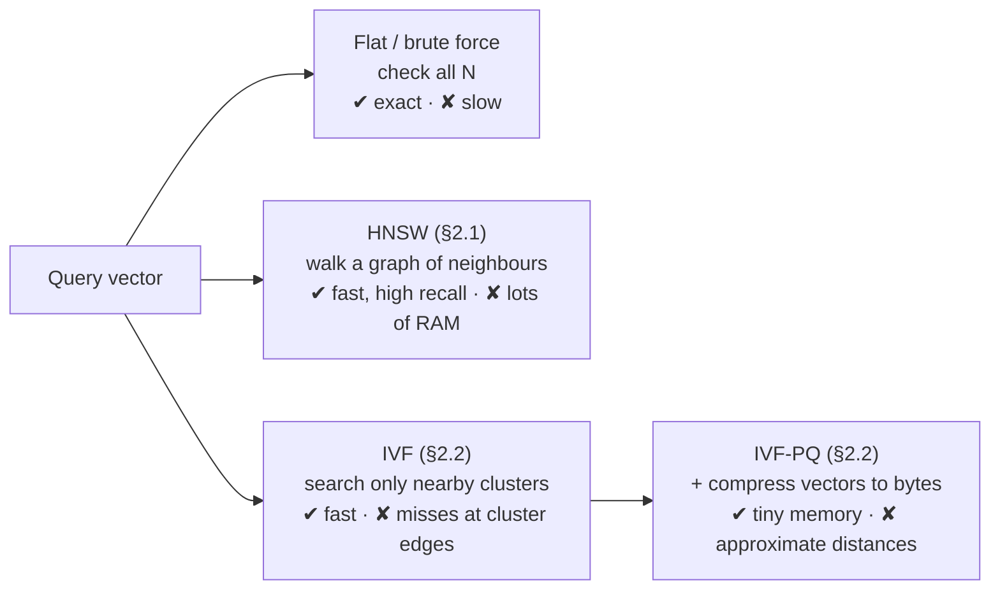
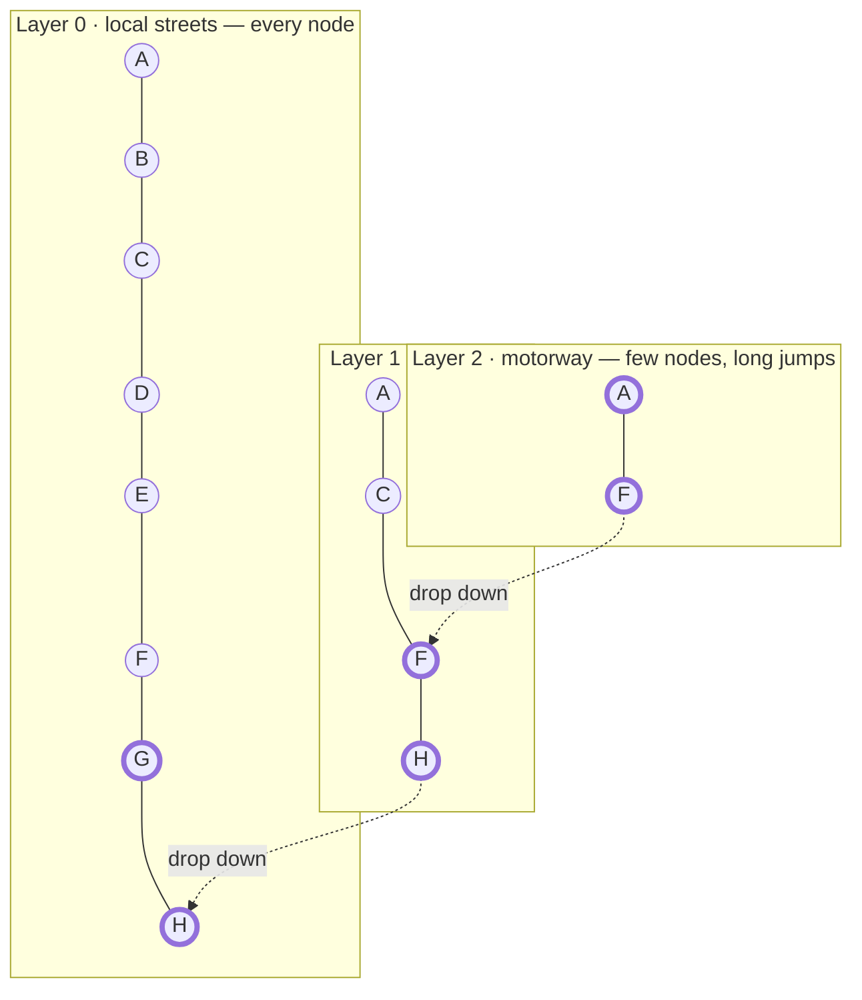
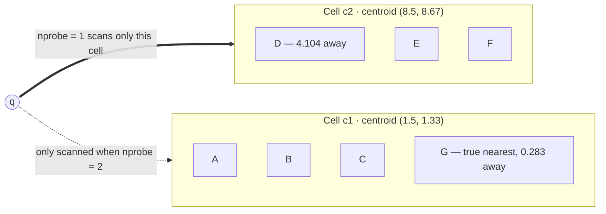
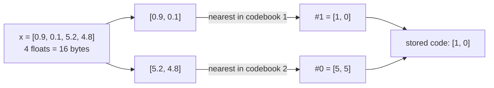
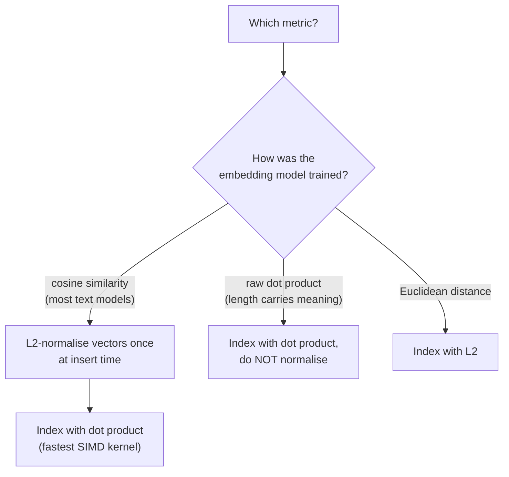
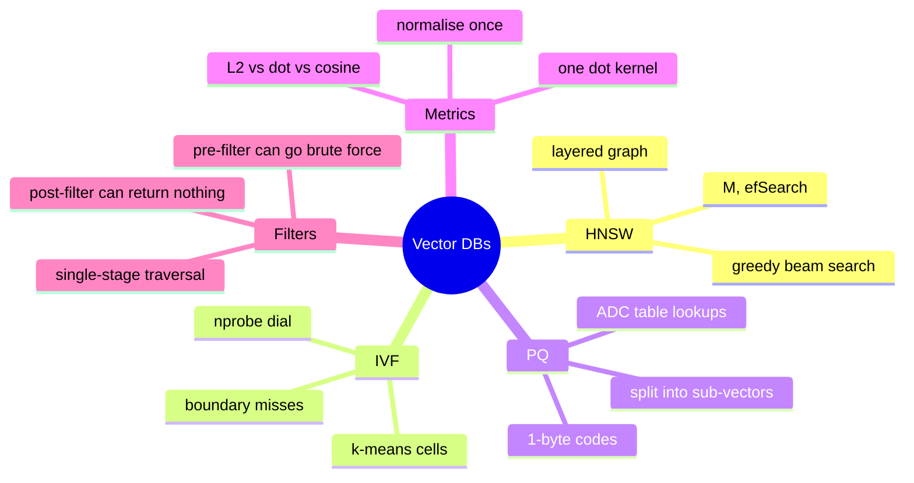

# Module 4 — Vector Databases: Vector Indexing & Storage Engines

> Scope: the actual graph/tree/cluster data structures behind approximate nearest
> neighbor (ANN) search, the compression math behind product quantization, and the
> exact arithmetic (and hardware implications) of each distance metric.

---

## 0. The Picture First — read this before the data structures

> 💡 A vector database answers exactly one question: **"which stored items are *closest* to this
> one?"** Picture every piece of text as a pin on a map. Similar meanings sit close together.
> "Find similar documents" = "find the nearest pins." Real embeddings have hundreds of
> dimensions instead of 2, but the idea is identical.

### 0.1 A 2-D example you can check by hand

Stored words (toy 2-D embeddings): `cat (1, 1)` · `kitten (1.2, 0.9)` · `dog (2, 1.5)` · `car (8, 1)`

Query: **`puppy (1.9, 1.4)`**

| Stored item | Euclidean distance to `puppy` | Rank |
|---|---|---|
| dog | √(0.1² + 0.1²) = **0.141** | 1 |
| kitten | √(0.7² + 0.5²) = 0.860 | 2 |
| cat | √(0.9² + 0.4²) = 0.985 | 3 |
| car | √(6.1² + 0.4²) = 6.113 | 4 |

"puppy" is closest to "dog", and "car" is far away — exactly what "similar meaning" should look
like. That table is **brute-force search**: compare the query against *everything*.

### 0.2 Why brute force stops working

One query against 1,000,000 stored vectors of 768 dimensions is
1,000,000 × 768 = **768 million** multiply-adds — for a single search. Every index in this module
is a trick to look at only a *small part* of the data, accepting that it will occasionally miss
a true neighbour.



> 🎯 **Recall@k** is the word to use in interviews: "of the true 10 nearest neighbours, how many
> did the index actually return?" Recall 0.9 = it found 9 of the 10.

---

## 1. Core Intuition & Mechanical Problem Statement

Exact nearest-neighbor search over $N$ high-dimensional vectors is $O(N \cdot d)$ per
query (compare the query against every vector) — fine for thousands of vectors,
catastrophic for hundreds of millions. Every vector index is an engineering trade-off
along the same axis: **sacrifice guaranteed-exact results for sub-linear query time**,
by either (a) building a navigable graph that lets search skip most of the dataset
(HNSW), or (b) partitioning the space into clusters and only searching the clusters
nearest the query, optionally compressing vectors to shrink memory bandwidth further
(IVF-PQ). Both are approximate — **recall** (fraction of true nearest neighbors
actually found) is a tunable knob traded directly against latency and memory.

---

## 2. Algorithmic / Mathematical Foundation

### 2.1 HNSW (Hierarchical Navigable Small World)

**Skip-list analogy**: a classic sorted-linked-list skip list has multiple layers —
the bottom layer contains every element, each layer above is a sparser subset,
allowing search to "skip" large stretches at high layers and drop down to refine.
HNSW generalizes this idea from a 1D sorted list to a **multi-layer proximity graph**
in arbitrary-dimensional vector space: the top layer has very few nodes with long-range
edges, and each layer below is progressively denser, with the bottom layer containing
every vector in the index.

**Graph construction**: when a new vector is inserted:
1. Randomly assign it a maximum layer $l$, drawn from an exponentially decaying
   distribution ($P(l) \propto e^{-l/\text{mL}}$) — this is *why* higher layers are
   naturally sparser: fewer vectors are assigned to exist at high layers at all.
2. Starting from the graph's global entry point (the node at the highest layer),
   greedily walk toward the new vector at each layer from the top down, using **beam
   search** (maintain a candidate list of size `ef_construction`, expanding to
   neighbors-of-neighbors, keeping only the best `ef_construction` candidates at each
   step) to find good candidate neighbors at each layer.
3. At each layer from $l$ down to 0, connect the new vector to its $M$ nearest found
   neighbors (an edge-count budget per node — the **edge pruning** parameter).
   Exceeding $M$ edges at a node triggers a pruning heuristic (commonly: keep the $M$
   neighbors that best preserve navigability, not simply the $M$ closest, to avoid the
   graph collapsing into disconnected dense clusters).

**Query-time beam search traversal**:

```
entry_point = graph.top_layer_entry_node
current_best = {entry_point}
for layer from top_layer down to 1:
    current_best = greedy_search(query, current_best, ef=1, layer)
    # ef=1 at upper layers: single best candidate is enough for coarse navigation
current_best = greedy_search(query, current_best, ef=ef_search, layer=0)
    # ef_search at layer 0: wider beam for accurate final results
return top_k(current_best)
```

`greedy_search` maintains a priority queue of candidates, repeatedly popping the
closest unvisited candidate, expanding to its graph neighbors, and keeping only the
best `ef` candidates seen so far (a bounded-width best-first search — structurally a
beam search where "beam width" is literally called `ef`).

**Parameters and their trade-offs**:

| Parameter | Effect | Trade-off |
|---|---|---|
| $M$ | max edges per node per layer | higher $M$ = better recall, more memory, slower build |
| `efConstruction` | beam width during index build | higher = better graph quality (recall), much slower build |
| `efSearch` | beam width during query | higher = better recall, slower query (more nodes visited) |

**Why this is $O(\log N)$-ish, not $O(N)$**: the top sparse layers let a query jump
across large regions of the vector space in very few hops (like a skip list's top
layer), and only the final, most localized search happens against the dense bottom
layer, and even then only against a small explored neighborhood — not the full
dataset. This is a *navigability* property, empirically validated rather than a tight
theoretical bound, but it's the entire reason HNSW scales to hundreds of millions of
vectors with millisecond query latency.

#### 🖼️ HNSW as motorways and local streets

**Analogy.** To drive to a friend's house in another city you don't take local streets the whole
way. You take the **motorway** (few exits, huge jumps), then **main roads**, then **local
streets** for the last few hundred metres. HNSW's layers are exactly that.

Toy example: 8 items placed on a number line — `A=0, B=1, C=2, D=3, E=4, F=5, G=6, H=7`.
Query **q = 6.2**. (True nearest: G.)



| Layer | Standing at (distance to q) | Neighbours checked | Move to |
|---|---|---|---|
| 2 | A (6.2) — the entry point | F (1.2) | F |
| 1 | F (1.2) | C (4.2), H (0.8) | H |
| 1 | H (0.8) | F (1.2) — no improvement | drop to layer 0 |
| 0 | H (0.8) | G (0.2) | G |
| 0 | G (0.2) | F (1.2), H (0.8) — no improvement | **stop → answer G ✔** |

Distances computed: A, F, C, H, G = **5 of 8**. Brute force needs all 8. The saving grows with
the data, because the number of layers grows only roughly like log N.

| Knob | Road-trip meaning |
|---|---|
| `M` | how many roads leave each junction |
| `efConstruction` | how carefully the road network was planned when it was built |
| `efSearch` | how many candidate routes you keep in mind while driving |

> ⚠️ With `efSearch = 1` the search is purely greedy — it can get stuck at a junction that
> *looks* closest but isn't (a local minimum). A wider beam keeps backup routes alive.

### 2.2 IVF-PQ (Inverted File with Product Quantization)

**IVF (clustering) stage**: run $k$-means over a representative sample of the dataset
to produce $n_{clusters}$ centroids. Every vector in the full dataset is then assigned
to its nearest centroid — this partitions the space into **Voronoi cells**
(the region of space closer to centroid $c_i$ than to any other centroid). At index
time, each vector is stored in an **inverted list** keyed by its assigned cell.

**Search**: given a query, compute distance to all $n_{clusters}$ centroids (cheap:
$n_{clusters}$ is small, e.g. hundreds to low thousands), take the `nprobe` nearest
cells, and only exhaustively compare the query against vectors **inside those cells**
— pruning away everything else. This is a direct trade: `nprobe = 1` is fastest but
can miss true neighbors sitting just across a cell boundary (a vector geometrically
close to the query but assigned to a different cell due to how Voronoi partitioning
fell); higher `nprobe` recovers recall at the cost of scanning more cells.

**PQ (Product Quantization) — the compression stage**: a full-precision vector
(e.g. 768 floats × 4 bytes = 3072 bytes) is expensive to store and compare at scale.
PQ compresses each vector by:

1. **Sub-space decomposition**: split the $d$-dimensional vector into $m$ sub-vectors
   of dimension $d/m$ each (e.g. $d=768$, $m=8$ → eight 96-dim sub-vectors).
2. **Per-sub-space codebook**: independently run $k$-means (typically $k=256$, so each
   code fits in a single byte) *within each sub-space* across the whole dataset,
   producing $m$ separate codebooks of 256 centroids each.
3. **Encoding**: each sub-vector is replaced by the **index** (1 byte) of its nearest
   sub-space centroid. A 3072-byte float vector becomes an $m$-byte code (e.g. 8 bytes
   for $m=8$) — a **384x compression ratio** in this example.

**Asymmetric Distance Computation (ADC)** — the key trick that makes PQ usable for
search without decompressing: the **query stays full-precision**, only the **database
vectors are quantized**. At query time, for each sub-space $j$, precompute the
distance from the query's sub-vector to all 256 codebook centroids in that sub-space
(one small distance table per sub-space, $m \times 256$ total distance values). Then,
for any database vector's PQ code (a sequence of $m$ byte-indices), its approximate
distance to the query is just a **sum of $m$ table lookups** — no floating-point
distance computation against the original vector at all:

$$
\hat{d}(q, x)^2 = \sum_{j=1}^{m} \|q^{(j)} - c_j[\text{code}_j(x)]\|^2
$$

where $q^{(j)}$ is the query's $j$-th sub-vector and $c_j[\cdot]$ looks up the
precomputed per-sub-space codebook. This turns nearest-neighbor distance computation
into $m$ array lookups and additions per candidate — dramatically cheaper than a full
$d$-dimensional float distance, and the whole reason IVF-PQ scales to memory budgets
where storing raw vectors for billions of items would be infeasible.

#### 🧮 Worked example — IVF, and the "wrong side of the fence" miss

Seven 2-D points. Two centroids were learned by k-means on an **earlier sample** of the data;
new points are simply assigned to whichever centroid is nearest.

| Cell | Centroid | Points assigned |
|---|---|---|
| c1 | (1.5, 1.33) | A (1, 1) · B (1.5, 2) · C (2, 1) · **G (4.8, 5)** |
| c2 | (8.5, 8.67) | D (8, 8) · E (9, 8.5) · F (8.5, 9.5) |

Query **q = (5, 5.2)**. Distance to centroids: c1 = 5.218, **c2 = 4.929** → c2 looks closer.

| Setting | Cells scanned | Best found | Correct? |
|---|---|---|---|
| `nprobe = 1` | c2 only | D at distance 4.104 | ✘ — the true nearest is **G at 0.283** |
| `nprobe = 2` | c1 and c2 | G at distance 0.283 | ✔ |



> 🎯 This is *the* IVF interview trade-off: `nprobe` is a recall-vs-latency dial. Points near a
> cell boundary are exactly where low `nprobe` loses results.

#### 🧮 Worked example — Product Quantization, small enough to do on paper

Real PQ: 768-dim vectors, m = 8 sub-vectors, 256 centroids each (1 byte per code).
Toy PQ: **4-dim vectors, m = 2 sub-vectors, 4 centroids each.**

**Codebooks** (learned by k-means, one per sub-space):

| index | Codebook 1 (dims 1–2) | Codebook 2 (dims 3–4) |
|---|---|---|
| #0 | [0, 0] | [5, 5] |
| #1 | [1, 0] | [5, 0] |
| #2 | [0, 1] | [0, 5] |
| #3 | [1, 1] | [9, 9] |

**Encode** `x = [0.9, 0.1, 5.2, 4.8]`:



**Search with ADC.** Query `q = [1.0, 0.0, 5.0, 5.0]` stays full precision. Build two small tables
of squared distances — once per query:

| index | table 1: q's first half → codebook 1 | table 2: q's second half → codebook 2 |
|---|---|---|
| #0 | 1.0 | 0.0 |
| #1 | 0.0 | 25.0 |
| #2 | 2.0 | 25.0 |
| #3 | 1.0 | 32.0 |

Now every stored vector's distance is **two lookups and one addition**:

| Stored item | Code | table1[code₁] + table2[code₂] | Rank |
|---|---|---|---|
| X (our x) | [1, 0] | 0.0 + 0.0 = **0.0** | 1 |
| Z | [3, 1] | 1.0 + 25.0 = 26.0 | 2 |
| Y | [0, 3] | 1.0 + 32.0 = 33.0 | 3 |

The exact squared distance from q to x is **0.1**; PQ estimated **0.0**. That small gap is the
*quantization error* — the price of compression.

> 💡 **Compression at real scale:** 768 × 4 bytes = 3,072 bytes → 8 bytes (**384×**).
> One billion vectors: ~3,072 GB raw vs ~8 GB of PQ codes.

### 2.3 Distance metrics — exact formulas & hardware implications

$$
\text{Euclidean (L2)}: \quad d(a,b) = \sqrt{\sum_i (a_i - b_i)^2}
$$
$$
\text{Dot product}: \quad d(a,b) = \sum_i a_i b_i
$$
$$
\text{Cosine similarity}: \quad d(a,b) = \frac{\sum_i a_i b_i}{\sqrt{\sum_i a_i^2}\sqrt{\sum_i b_i^2}}
$$

**Mechanically**: cosine similarity is mathematically equivalent to dot product
**after L2-normalizing both vectors to unit length**. This equivalence matters for
performance: if all vectors are normalized once at index time, "cosine similarity
search" can be implemented as a pure dot-product index at query time, which is
computationally cheaper (no per-comparison division/sqrt) and — critically — dot
product is the operation with the most direct, mature hardware acceleration path:
it maps directly onto **SIMD FMA (fused multiply-add) instructions** (AVX2/AVX-512 on
CPU, tensor cores on GPU), processing 8–16 float32 multiply-adds per instruction cycle
in a tight vectorized loop. Euclidean distance can be algebraically expanded as
$\|a-b\|^2 = \|a\|^2 + \|b\|^2 - 2(a \cdot b)$ — the cross term is again a dot product,
so with precomputed $\|a\|^2, \|b\|^2$ norms, L2 search also reduces to the same
SIMD-friendly dot-product kernel. This is why most production ANN libraries
(FAISS, etc.) implement a single optimized dot-product kernel internally and express
all three metrics in terms of it, rather than writing three separate distance loops.

#### 🧮 Worked example — three metrics, three different "nearest" answers

Three vectors: **a = [3, 4]**, **b = [6, 8]** (same direction as a, twice as long), **c = [4, 3]**.

| Pair | Euclidean (L2) — smaller is closer | Dot product — bigger is closer | Cosine — bigger is closer |
|---|---|---|---|
| a vs b | 5.0 | **50** | **1.00** |
| a vs c | **1.414** | 24 | 0.96 |
| Nearest to a | **c** | **b** | **b** |

The metrics disagree! L2 cares about *where the point is*; cosine cares only about *which way
it points*. If b is "the same document, just longer", cosine gives the answer you want.

**Now normalise everything to length 1:** a → [0.6, 0.8], b → [0.6, 0.8], c → [0.8, 0.6].

| Pair (unit vectors) | L2 | Dot | Cosine |
|---|---|---|---|
| a vs b | 0 | 1.00 | 1.00 |
| a vs c | 0.283 | 0.96 | 0.96 |
| Nearest to a | **b** | **b** | **b** |

After normalisation all three agree — dot product *equals* cosine, and L2 is just
√(2 − 2·cosine) = √(2 − 1.92) = 0.283. That's why databases normalise once at insert time and then
run the cheapest kernel: a plain dot product.



### 2.4 Filtered search: pre-filter vs. post-filter vs. single-stage

Filtered vector search (e.g. "nearest neighbors WHERE category = 'X'") has three
distinct execution strategies with very different failure modes:

- **Post-filtering**: run the ANN search unfiltered, get top-$k$ candidates, *then*
  discard any that fail the metadata filter. **Failure mode**: if the filter is
  selective (matches a small fraction of the corpus) and the true matching vectors
  aren't among the ANN index's approximate top-$k$, post-filtering can return **far
  fewer than $k$ results, or zero**, even when many valid matches exist deeper in the
  dataset — because the index simply never surfaced them for filtering.
- **Pre-filtering**: compute the filtered candidate set first (typically via a
  metadata index — inverted index, B-tree), then run brute-force (or a filtered-aware
  ANN) search restricted to *only* that candidate set. Correct results even for
  highly selective filters, but degrades toward $O(\text{filtered set size} \times d)$
  brute-force cost — if the filter matches millions of vectors, this loses the entire
  benefit of ANN indexing.
- **Single-stage hybrid filtered traversal**: the ANN graph/index traversal itself is
  made filter-aware — e.g. in HNSW, the beam search walks the graph but **skips
  non-matching nodes during traversal** rather than filtering before or after, while
  still using the graph's edges (which may pass through non-matching nodes) to
  navigate toward matching ones. This is the most engineering-intensive approach but
  avoids both post-filtering's recall collapse and pre-filtering's brute-force
  fallback — the dominant approach in modern production vector databases (e.g.
  filtered HNSW variants).

---

#### 🧮 Worked example — "comfy running shoes, but only red ones"

Catalog: **1,000,000** shoes. Only **1%** (10,000) are red. We want the 10 most similar red shoes.

```mermaid
%% caption: Three ways to combine a metadata filter with vector search.
flowchart TB
    subgraph post["Post-filter"]
        direction LR
        p1["ANN search<br/>top 10 of all shoes"] --> p2["drop non-red"] --> p3["≈ 0 results ✘"]
    end
    subgraph pre["Pre-filter"]
        direction LR
        q1["metadata index<br/>→ 10,000 red shoes"] --> q2["brute-force distance<br/>on those 10,000"] --> q3["exact top 10 ✔<br/>but slow if filter is broad"]
    end
    subgraph single["Single-stage (filter-aware traversal)"]
        direction LR
        s1["walk the HNSW graph"] --> s2["pass through any node,<br/>but only collect red ones"] --> s3["top 10 red ✔ fast"]
    end
```



| Strategy | What happens here | Numbers |
|---|---|---|
| Post-filter | top-10 overall, then keep the red ones | if colour is unrelated to similarity, expect 10 × 1% = **0.1** red results; chance of getting even one ≈ 1 − 0.99¹⁰ ≈ **9.6%** |
| Pre-filter | find the 10,000 red shoes, then compare against each | 10,000 × 768 = 7.7 million multiply-adds — fine. But filter "in stock" (900,000 shoes) → almost brute force again |
| Single-stage | one graph walk that skips non-red results | stays fast for both narrow and broad filters — which is why production vector DBs do this |

---

## 3. Low-Level Execution Flow & Data Structures

**HNSW core data structures**:
```
Node {
  id, vector,
  neighbors: List[List[node_id]]   # neighbors[layer] = list of connected node IDs
}
Graph {
  nodes: Dict[id, Node],
  entry_point: id,                 # node at the current max layer
  max_layer: int
}
```

**IVF-PQ core data structures**:
```
IVFIndex {
  centroids: List[Vector]                    # len = n_clusters
  inverted_lists: Dict[cluster_id, List[(vector_id, pq_code)]]
  pq_codebooks: List[List[Vector]]            # [sub_space][centroid_idx] -> sub-vector
}
```

**Query execution flow (IVF-PQ)**:
```
1. dists_to_centroids = [euclidean(query, c) for c in centroids]     # O(n_clusters * d)
2. probe_cells = nsmallest(nprobe, dists_to_centroids)
3. build per-subspace distance table: table[j][c] = dist(query_subvec[j], codebook[j][c])
4. for cell in probe_cells:
     for (vector_id, pq_code) in inverted_lists[cell]:
         approx_dist = sum(table[j][pq_code[j]] for j in range(m))   # ADC lookup, O(m)
5. return k smallest approx_dist results
```

---

## 4. Edge Cases, Failure Modes & Hardware Bottlenecks

- **HNSW graph disconnection**: aggressive edge pruning (too-small $M$) can
  fragment the graph into weakly-connected components, causing entire regions of the
  vector space to become unreachable from the entry point regardless of `efSearch` —
  manifests as consistently low recall for queries near specific clusters, not
  uniformly across the dataset.
- **IVF cell imbalance**: if the underlying data distribution is highly clustered
  (not uniform), $k$-means can produce wildly uneven cell sizes — some cells with a
  handful of vectors, others with a large fraction of the whole dataset. A query
  probing a "mega-cell" degrades toward brute-force cost for that cell alone,
  defeating the purpose of partitioning.
- **PQ codebook mismatch under distribution shift**: codebooks are trained once on a
  sample of the data; if new data added later has a meaningfully different
  distribution, quantization error rises silently (reconstructed approximate vectors
  drift further from their true positions), degrading recall without any explicit
  error signal — periodic codebook retraining is required for long-lived indices.
- **`nprobe`/`efSearch` set too low in production**: both parameters trade recall for
  latency at query time; a value tuned during a small-scale benchmark can silently
  under-serve recall at production data scale/distribution, since the *right* value is
  a function of the actual data's cluster geometry, not a fixed constant.
- **Metric mismatch between training and index**: an embedding model trained with a
  cosine-similarity objective (implicitly assuming normalized vectors) indexed instead
  under raw dot product (unnormalized) or L2 produces geometrically inconsistent
  rankings — the index isn't "wrong," it's answering a different geometric question
  than the one the embeddings were optimized for.
- **Memory bandwidth as the real bottleneck at scale**: for both HNSW (following
  pointer-chased neighbor lists) and IVF (scanning inverted lists), the dominant cost
  at large scale is **memory bandwidth and cache-miss latency**, not raw FLOPs —
  pointer-chasing graph traversal is notoriously cache-unfriendly (each neighbor hop
  is a near-random memory access), which is exactly why PQ's compression (shrinking
  the working set to fit in cache/reduce bytes moved per comparison) delivers outsized
  real-world speedups beyond what its FLOP reduction alone would suggest.

---

## 5. From-Scratch Reference Code

```python
"""
A miniature Inverted File (IVF) vector index, dependency-free (standard
library only): manual k-means clustering, Voronoi-cell assignment,
nprobe-limited cluster search, and a brute-force baseline for recall
verification. Also includes the three core distance metrics with their
exact formulas (no FAISS, no scikit-learn).
"""
import math
import random


# ---------------------------------------------------------------------------
# Distance metrics — exact formulas from Section 2.3
# ---------------------------------------------------------------------------
def euclidean(a: list[float], b: list[float]) -> float:
    return math.sqrt(sum((x - y) ** 2 for x, y in zip(a, b)))


def dot(a: list[float], b: list[float]) -> float:
    return sum(x * y for x, y in zip(a, b))


def cosine(a: list[float], b: list[float]) -> float:
    norm_a = math.sqrt(sum(x * x for x in a))
    norm_b = math.sqrt(sum(x * x for x in b))
    if norm_a == 0 or norm_b == 0:
        return 0.0
    return dot(a, b) / (norm_a * norm_b)


# ---------------------------------------------------------------------------
# IVF index: k-means -> Voronoi cells -> inverted lists -> nprobe search
# ---------------------------------------------------------------------------
class IVFIndex:
    def __init__(self, dim: int, n_clusters: int, seed: int = 0):
        self.dim = dim
        self.n_clusters = n_clusters
        self.rng = random.Random(seed)
        self.centroids: list[list[float]] = []
        self.cells: list[list[tuple[int, list[float]]]] = []

    def _kmeans(self, vectors: list[list[float]], n_iter: int = 15):
        centroids = [list(v) for v in self.rng.sample(vectors, self.n_clusters)]
        assignments = [0] * len(vectors)

        for _ in range(n_iter):
            # Assignment step: each vector joins its nearest centroid's cell.
            for i, v in enumerate(vectors):
                dists = [euclidean(v, c) for c in centroids]
                assignments[i] = dists.index(min(dists))

            # Update step: each centroid moves to the mean of its assigned vectors.
            sums = [[0.0] * self.dim for _ in range(self.n_clusters)]
            counts = [0] * self.n_clusters
            for i, v in enumerate(vectors):
                c = assignments[i]
                counts[c] += 1
                for d in range(self.dim):
                    sums[c][d] += v[d]
            centroids = [
                [x / counts[c] for x in sums[c]] if counts[c] > 0 else centroids[c]
                for c in range(self.n_clusters)
            ]
        return centroids, assignments

    def build(self, vectors: list[list[float]], ids: list[int] = None):
        ids = ids if ids is not None else list(range(len(vectors)))
        self.centroids, assignments = self._kmeans(vectors)
        self.cells = [[] for _ in range(self.n_clusters)]
        for idx, (vector_id, v) in enumerate(zip(ids, vectors)):
            cell = assignments[idx]
            self.cells[cell].append((vector_id, v))

    def search(self, query: list[float], k: int = 3, nprobe: int = 2):
        # Step 1: rank cells by centroid distance, probe only the nearest nprobe.
        cell_dists = [(c, euclidean(query, cent)) for c, cent in enumerate(self.centroids)]
        cell_dists.sort(key=lambda pair: pair[1])
        probe_cells = [c for c, _ in cell_dists[:nprobe]]

        # Step 2: exhaustively compare the query only against vectors in probed cells.
        candidates = []
        for c in probe_cells:
            candidates.extend(self.cells[c])
        scored = [(vector_id, euclidean(query, v)) for vector_id, v in candidates]
        scored.sort(key=lambda pair: pair[1])
        return scored[:k]


def brute_force_search(vectors, ids, query, k=3):
    scored = [(vector_id, euclidean(query, v)) for vector_id, v in zip(ids, vectors)]
    scored.sort(key=lambda pair: pair[1])
    return scored[:k]


# ---------------------------------------------------------------------------
# Self-test / demonstration: IVF recall vs. exhaustive brute-force ground truth
# ---------------------------------------------------------------------------
if __name__ == "__main__":
    rng = random.Random(42)
    dim, n = 4, 60
    # Synthetic clustered data: every 3rd vector is shifted, to create real structure.
    vectors = [[rng.gauss(0, 1) + (5 if i % 3 == 0 else 0) for _ in range(dim)]
               for i in range(n)]
    ids = list(range(n))

    index = IVFIndex(dim=dim, n_clusters=6, seed=1)
    index.build(vectors, ids)

    query = vectors[10]
    ivf_result = index.search(query, k=5, nprobe=3)
    ground_truth = brute_force_search(vectors, ids, query, k=5)

    print("IVF (nprobe=3 of 6 cells) result:", ivf_result)
    print("Brute-force ground truth:        ", ground_truth)

    recall = len(set(i for i, _ in ivf_result) & set(i for i, _ in ground_truth)) / 5
    print(f"Recall@5: {recall:.2f}")
    assert recall >= 0.6, "IVF search should recover most true nearest neighbors"

    # Distance metric sanity checks.
    a, b = [1, 0, 0], [0, 1, 0]
    assert abs(cosine(a, b)) < 1e-9, "orthogonal vectors should have cosine 0"
    assert abs(euclidean(a, b) - math.sqrt(2)) < 1e-9

    print("Self-test complete: k-means clustering, Voronoi-cell IVF search, "
          "and distance metric formulas all verified against brute force.")
```

**Sample output:**

```
IVF (nprobe=3 of 6 cells) result: [(10, 0.0), (2, 0.5638052833481912), (41, 0.7415841248410754), (19, 1.0917531556236035), (22, 1.131927899367102)]
Brute-force ground truth:         [(10, 0.0), (2, 0.5638052833481912), (41, 0.7415841248410754), (19, 1.0917531556236035), (22, 1.131927899367102)]
Recall@5: 1.00
Self-test complete: k-means clustering, Voronoi-cell IVF search, and distance metric formulas all verified against brute force.
```

---

## 6. Recap & Self-Check



| Idea | Remember it as |
|---|---|
| ANN | "trade a little recall for a lot of speed" |
| HNSW | "motorway → main roads → local streets" |
| IVF | "only search the neighbourhoods near you — but the fence can hide your neighbour" |
| PQ | "replace each chunk of the vector with the ID of its nearest prototype" |
| Metrics | "normalise, and cosine = dot product" |
| Filtered search | "filter *during* the walk, not before or after" |

**Test yourself** — answer out loud first, then open.

<details>
<summary>1. You raise HNSW efSearch from 50 to 200. What happens to recall and latency?</summary>

Recall goes up (a wider beam keeps more candidate routes alive, so fewer local-minimum misses) and
latency goes up (more nodes are visited per query). No rebuild needed — it's a query-time knob.

</details>

<details>
<summary>2. In the IVF example, why did nprobe = 1 return D instead of G?</summary>

The query was nearer to c2's centroid, so only cell c2 was scanned — but G, the true nearest point,
was assigned to cell c1. Points near cell boundaries are exactly where low nprobe fails.

</details>

<details>
<summary>3. PQ with 768-dim float32 vectors, m = 8, 256 centroids per sub-space: bytes per vector and compression ratio?</summary>

8 codes × 1 byte = **8 bytes**, down from 768 × 4 = 3,072 bytes → **384×** smaller.

</details>

<details>
<summary>4. Your embedding model was trained with cosine similarity, but you index un-normalised vectors with raw dot product. What goes wrong?</summary>

Longer vectors score higher regardless of direction, so long or "loud" documents float to the top even
when they point the wrong way. Normalise at insert time, then dot product = cosine.

</details>

<details>
<summary>5. A filter matches 0.1% of your data. Which filtering strategy do you avoid, and why?</summary>

Post-filtering — the unfiltered top-k will almost never contain a matching item, so you often get zero
results. Use pre-filtering (the matching set is small enough to brute-force) or single-stage filtered traversal.

</details>

**Try it:** in the reference code in §5, set `nprobe=1` and then `nprobe=6`. **Predict** Recall@5
for each before running — then run it and see whether you were right.

**Next:** Module 5 swaps "nearest vector" for "connected node."
