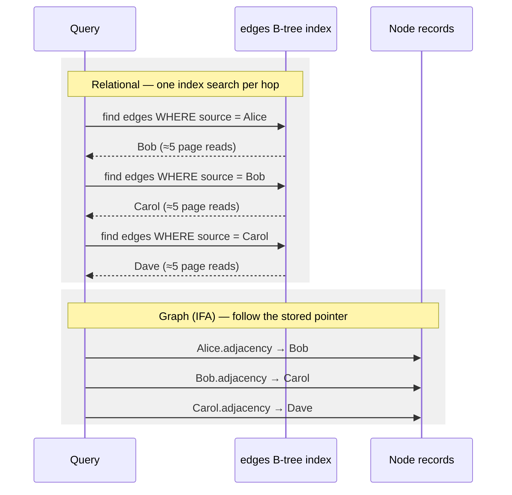
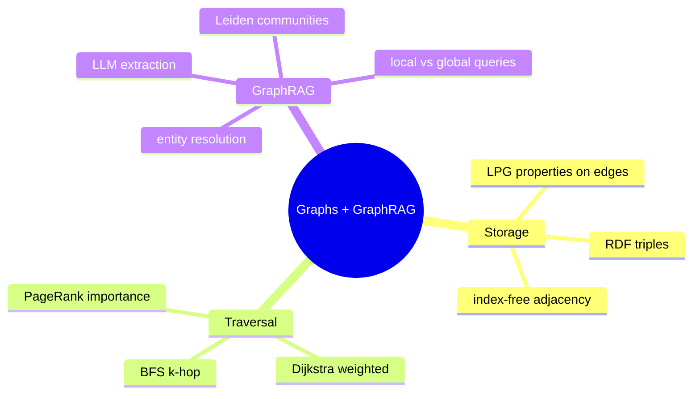

# Module 5 — Graph Databases & GraphRAG: Knowledge Representation & Traversal

> Scope: the storage-engine-level reason graph traversal outperforms relational
> JOINs on relationship-heavy queries, the exact traversal/ranking algorithms, and
> the mechanics of building and querying an <abbr title="Large Language Model">LLM</abbr>-extracted knowledge graph for
> multi-hop retrieval.

---

## 0. The Picture First — read this before the storage engines

> 💡 Vector search (Modules 3–4) finds text that **sounds like** your question. Graph search finds
> things that are **connected to** your question. Some questions need connections: the answer
> is not in any single sentence — it sits at the end of a *path*.

### 0.1 The running example

Four sentences, each in a different document:

1. "Marie Curie discovered Radium."
2. "Marie Curie worked at the Sorbonne."
3. "The Sorbonne is located in Paris."
4. "Pierre Curie collaborated with Marie Curie."

> **Question:** "In which city did the discoverer of Radium work?"

```arch
%% caption: The same four sentences as a graph. The answer is a 3-hop path, not a single sentence.
grid 280x85
node r "Radium" at 0,0 shape=pill color=blue
node mc "Marie Curie" at 0,1 shape=pill color=blue
node s "Sorbonne" at 0,2 shape=pill color=blue
node p "Paris ✔" at 0,3 shape=pill color=green
node pc "Pierre Curie" at 1,1 shape=pill color=blue
r -> mc : "DISCOVERED_BY"
mc -> s : "WORKED_AT"
s -> p : "LOCATED_IN" thick
pc -> mc : "COLLABORATED_WITH"
```

### 0.2 Why plain vector <abbr title="Retrieval-Augmented Generation">RAG</abbr> struggles here

| Sentence | Shares words/meaning with the question? | Likely retrieved by vector search? |
|---|---|---|
| 1 · discovered Radium | yes — "discoverer", "Radium" | ✔ yes |
| 2 · worked at the Sorbonne | a little — "work" | maybe |
| 3 · Sorbonne located in Paris | **no** — never mentions Radium, Curie, or work | ✘ probably not |

Sentence 3 holds the answer word ("Paris") yet looks unrelated to the question. A graph doesn't
care how a sentence *sounds* — it just follows the edges Radium → Marie Curie → Sorbonne → Paris.

### 0.3 The two halves of this module

```arch
%% caption: Part one is about storing graphs fast; part two is about using an LLM to build and query them.
grid 230x100
group db "Graph databases (§2.1–2.3)" color=blue icon=graph
node a "How nodes and edges are stored" at 0,0 in db sub="LPG vs RDF"
node b "Why hops are cheap" at 0,1 in db sub="index-free adjacency"
node c "How to walk them" at 0,2 in db sub="BFS · Dijkstra · PageRank"
group grag "GraphRAG (§2.4)" color=teal icon=llm
node d "LLM extracts triples" at 1.2,0 in grag sub="from text"
node e "Group into communities" at 1.2,1 in grag sub="+ summarise"
node f "Answer local and global questions" at 1.2,2 in grag
a -> b -> c
d -> e -> f
c:R -> d:L
```

---

## 1. Core Intuition & Mechanical Problem Statement

A relational database stores relationships **implicitly**, via matching foreign-key
values across tables, resolved at query time through a JOIN operation. A graph
database stores relationships **explicitly**, as first-class edges with direct
pointers between nodes. The entire performance argument for graph databases on
relationship-heavy queries reduces to one mechanical fact: **traversing an explicit
pointer is $O(1)$; finding a matching row via an index is $O(\log N)$ (B-tree) or
worse**. For a query that hops across many relationships (multi-hop reasoning — "find
friends of friends of friends who work at companies located in cities where X"),
relational JOINs compound this per-hop cost multiplicatively across tables, while
graph traversal compounds it as a constant per hop.

GraphRAG extends this by using an <abbr title="Large Language Model">LLM</abbr> to **construct** the graph (extracting entities
and relations from unstructured text) rather than requiring pre-structured data, and
then using graph traversal — instead of, or alongside, vector similarity — to gather
context for generation, specifically targeting the multi-hop and holistic/summarizing
queries where flat vector retrieval (Module 3) structurally struggles (no single
chunk contains a multi-hop answer; it exists only as a path across several).

---

## 2. Algorithmic / Mathematical Foundation

### 2.1 Storage engine architecture

**Labeled Property Graph (LPG)**: nodes and edges are both first-class objects,
each carrying a **label** (type) and an arbitrary set of **key-value properties**.

```
(Marie Curie:Person {born: 1867}) -[:DISCOVERED {year: 1898}]-> (Radium:Element)
```

Both the node and the edge itself can hold properties — the relationship "DISCOVERED"
can carry its own attributes (e.g. `year`) independent of either endpoint. This is the
model used by Neo4j, and most "graph database" products in the <abbr title="Large Language Model">LLM</abbr>-tooling space.

**RDF (Resource Description Framework) Triples**: every fact is a strict
`(subject, predicate, object)` triple — no property maps on nodes or edges directly;
additional attributes must themselves be expressed as more triples (reification), or
via extensions (RDF-star). This is a more rigid, more standardized (W3C) model, common
in enterprise knowledge-graph and semantic-web contexts, and the native format many
<abbr title="Large Language Model">LLM</abbr> entity-relation extraction pipelines default to, since "subject-predicate-object"
maps directly onto how relation-extraction prompts are typically framed.

| | LPG | RDF Triples |
|---|---|---|
| Node/edge attributes | native property maps | requires reification or RDF-star |
| Query language | Cypher, Gremlin | SPARQL |
| Natural fit for <abbr title="Large Language Model">LLM</abbr> extraction | requires a schema step | maps directly onto (subj, pred, obj) |
| Typical use | application graphs, GraphRAG | semantic web, enterprise ontologies |

#### 🧮 Worked example — the same fact stored both ways

Fact: *"Marie Curie (born 1867) discovered Radium (symbol Ra) in 1898."*

**As a Labeled Property Graph** — 2 nodes, 1 edge, properties sit right on them:

```arch
%% caption: LPG — the edge itself carries the year, just like a node carries its properties.
grid 260x120
node mc "Marie Curie" at 0,0 color=blue sub="label: Person · born: 1867"
node ra "Radium" at 0,1 color=green sub="label: Element · symbol: Ra"
mc -> ra : "DISCOVERED · year: 1898"
```

**As RDF triples** — everything must be `(subject, predicate, object)`:

| subject | predicate | object |
|---|---|---|
| :MarieCurie | rdf:type | :Person |
| :MarieCurie | :born | 1867 |
| :Radium | :symbol | "Ra" |
| :MarieCurie | :discovered | :Radium |

Where does **1898** go? A triple has no slot for "a property of the *discovered* link". You
have to invent a node for the event itself (**reification**):

| subject | predicate | object |
|---|---|---|
| :Discovery1 | :agent | :MarieCurie |
| :Discovery1 | :element | :Radium |
| :Discovery1 | :year | 1898 |

```arch
%% caption: RDF reification — one edge with a property becomes an extra node plus three edges.
grid 170x100
node d "Discovery1" at 1,0 shape=pill color=amber
node mc "MarieCurie" at 0,1 shape=pill color=blue
node ra "Radium" at 1,1 shape=pill color=blue
node y "1898" at 2,1 color=slate
d -> mc : ":agent"
d -> ra : ":element"
d -> y : ":year"
```

The same question in each query language:

```text
Cypher (LPG):   MATCH (p:Person)-[d:DISCOVERED]->(e:Element)
                RETURN p.name, e.name, d.year

SPARQL (RDF):   SELECT ?person ?element ?year WHERE {
                  ?event :agent ?person ; :element ?element ; :year ?year .
                }
```

### 2.2 Index-Free Adjacency (IFA) — the core performance mechanism

In a relational engine, finding "all edges from node A" means: scan (or B-tree-index-
lookup into) an edges table `WHERE source_id = A`. A B-tree lookup is
$O(\log N)$ in the total number of edges $N$ in the table — and that cost is paid
**again at every hop** of a multi-hop query, because each hop is an independent JOIN
against the same (or another) indexed table.

```
Relational multi-hop (3-hop friend-of-friend-of-friend query), conceptually:
  SELECT ... FROM edges e1
  JOIN edges e2 ON e1.target = e2.source
  JOIN edges e3 ON e2.target = e3.source
  WHERE e1.source = 'A'
  -- Each JOIN re-indexes into the edges table: O(log N) per hop, compounded
  -- by the branching factor at each level (fan-out multiplies row counts).
```

With **Index-Free Adjacency**, each node stores a **direct list of pointers/references
to its adjacent edges** as part of the node's own physical storage record — not a
value to be looked up in a separate global index. Traversing from node A to its
neighbors means **dereferencing a pointer already sitting in A's own record** — no
index structure is consulted at all:

```
Graph-native traversal (IFA), conceptually:
  current = graph.get_node('A')
  for hop in range(3):
      current = current.adjacency_list[0].target   # O(1) pointer dereference per hop
```

This is why graph traversal cost is largely **independent of total graph size** $N$ —
it depends only on the local branching factor (how many edges a given node has) and
the number of hops, not on how many other nodes/edges exist elsewhere in the graph.
A relational JOIN's cost, by contrast, scales with the size of the indexed tables
being joined, regardless of how "local" the actual relationship of interest is.

#### 🖼️ Index-free adjacency vs. JOINs, simply

**Analogy.** You want a friend-of-a-friend-of-a-friend's number.

- **Relational way:** for every friend, walk to the *city phone directory* and look them up by
  name. Each lookup is quick-ish, but you do one per person per hop, and the directory gets
  thicker as the city grows.
- **Graph way (IFA):** every person's page in your address book already has their friends'
  pages *stapled to it*. You just flip to the stapled page.



**The numbers.** An edges table with **1 billion rows** in a B-tree with ~100 keys per page is
about log₁₀₀(10⁹) ≈ **4.5 → ~5 levels deep**:

| | per hop | 3 hops | if the table grows to 100 billion rows |
|---|---|---|---|
| B-tree JOIN | ~5 page reads | ~15 page reads | ~6 levels → ~18 page reads |
| IFA | 1 pointer follow | 3 pointer follows | **still 3** |

With fan-out, both approaches multiply: if everyone has 100 friends, hop 3 touches
100 × 100 × 100 = **1,000,000** people. The JOIN pays ~5 page reads for each of them; IFA pays one
pointer follow each. That constant gap, times a million, is the whole argument.

> ⚠️ IFA's advantage assumes the nodes you touch are in memory. If every pointer follow is a
> random disk read, graph traversal loses much of its edge (see §4).

### 2.3 Graph traversal algorithms

**BFS (Breadth-First Search)** — explores level by level using a FIFO queue; the
natural algorithm for "k-hop neighborhood" queries (exactly what most GraphRAG local
retrieval needs — "everything within 2 hops of this entity"):

$$
\text{Time complexity: } O(V + E) \text{ within the explored region}
$$

**DFS (Depth-First Search)** — explores as deep as possible along one path before
backtracking, using a stack (explicit or via recursion); natural for path-existence
queries and topological structure discovery, less natural for "nearest neighborhood"
queries since it doesn't guarantee shortest-hop-count discovery order.

**Dijkstra's algorithm** — shortest weighted path from a single source, using a
min-priority-queue keyed by cumulative distance:

$$
\text{dist}(v) = \min_{u \in \text{neighbors}(v)} \left[\text{dist}(u) + w(u,v)\right]
$$

repeatedly extracting the minimum-distance unvisited node and relaxing its outgoing
edges, until the target is reached or the queue is exhausted. $O((V+E)\log V)$ with a
binary heap.

**A\*** — Dijkstra augmented with a heuristic $h(v)$ estimating remaining distance to
the goal, prioritizing $f(v) = g(v) + h(v)$ (cost-so-far plus estimated cost-to-go)
instead of just cost-so-far — explores far fewer nodes than plain Dijkstra when a good
admissible heuristic (never overestimates true remaining distance) is available.

**PageRank applied to a document/entity graph**: models importance as a stationary
distribution of a random walk over the graph — a node is important if important nodes
link to it:

$$
PR(v) = \frac{1-d}{N} + d \sum_{u \in \text{in-neighbors}(v)} \frac{PR(u)}{\text{out-degree}(u)}
$$

computed iteratively until convergence ($d \approx 0.85$ is the classic "damping
factor," modeling a random surfer who follows links with probability $d$ and jumps to
a random node otherwise, guaranteeing the Markov chain is irreducible/aperiodic so a
stationary distribution exists). Applied to a GraphRAG entity graph, PageRank surfaces
the most "structurally central" entities — useful for prioritizing which entities'
summaries to include first under a token budget, or for weighting retrieved subgraphs
by importance rather than treating every node equally.

#### 🧮 Worked example — BFS: "everything within 2 hops of Marie Curie"

```arch
%% caption: Edges point one way. BFS from Marie Curie follows outgoing edges only.
grid 170x90
node pc "Pierre Curie" at 0,0 shape=pill color=slate sub="not reachable"
node mc "Marie Curie" at 1,0 shape=pill color=blue sub="hop 0"
node ra "Radium" at 0,1 shape=pill color=green sub="hop 1"
node so "Sorbonne" at 1,1 shape=pill color=green sub="hop 1"
node np "Nobel Prize" at 2,1 shape=pill color=green sub="hop 1"
node pa "Paris" at 1,2 shape=pill color=green sub="hop 2"
node fr "France" at 1,3 shape=pill color=amber sub="hop 3 — too far"
mc -> ra
mc -> so
mc -> np
so -> pa
pa -> fr
pc -> mc
```

| Queue (front → back) | Pop | Record | Push |
|---|---|---|---|
| [Marie Curie] | Marie Curie | hop 0 | Radium, Sorbonne, Nobel Prize |
| [Radium, Sorbonne, Nobel Prize] | Radium | hop 1 | — (no outgoing edges) |
| [Sorbonne, Nobel Prize] | Sorbonne | hop 1 | Paris |
| [Nobel Prize, Paris] | Nobel Prize | hop 1 | — |
| [Paris] | Paris | hop 2 | nothing — depth limit reached, France is skipped |

Result: **Marie Curie, Radium, Sorbonne, Nobel Prize, Paris**.

> ⚠️ **Pierre Curie is missing** even though he's "right next to" Marie Curie — his edge points
> *into* her. Many GraphRAG systems traverse edges in both directions for exactly this reason.

#### 🧪 Try it — change the graph, change what BFS can reach

Switch to "Both directions" to bring Pierre Curie back, cut `WORKED_AT` to lose Paris, or add a hub and
raise k to 3 to watch the neighbourhood explode.

```viz
graph-bfs
```

#### 🧮 Worked example — Dijkstra: the obvious road isn't the shortest

```arch
%% caption: The direct edge A→B costs 4, but A→C→B costs 3. Thick edges are the shortest path to D.
route straight
grid 110x90
node a "A" at 0,1 shape=circle color=blue
node b "B" at 2,0 shape=circle color=blue
node c "C" at 1,2 shape=circle color=blue
node d "D" at 3,1 shape=circle color=green
a -> b : "4"
a ==> c : "1" color=green
c ==> b : "2" color=green
b ==> d : "1" color=green
c -> d : "5"
```

| Pop (smallest distance first) | dist A | dist B | dist C | dist D | What changed |
|---|---|---|---|---|---|
| start | 0 | ∞ | ∞ | ∞ | — |
| A (0) | 0 | 4 | 1 | ∞ | reached B and C from A |
| C (1) | 0 | **3** | 1 | 6 | via C, B improves 4 → 3 |
| B (3) | 0 | 3 | 1 | **4** | via B, D improves 6 → 4 |
| D (4) | 0 | 3 | 1 | 4 | done: **A → C → B → D = 4** |

**A\*** is the same algorithm plus a hint: a map app ranks nodes by *distance so far + straight-line
distance to the destination*, so it stops exploring roads heading the wrong way.

#### 🧮 Worked example — PageRank on four nodes

Links: A → B, A → C, B → C, C → A, D → C. Damping d = 0.85, all nodes start at 0.25.

```arch
%% caption: C has three incoming links, D has none.
route straight
grid 100x90
node a "A" at 0,0 shape=circle color=blue
node b "B" at 2,0 shape=circle color=blue
node c "C" at 1,1 shape=circle color=green
node d "D" at 1,2 shape=circle color=slate
a -> b
a <-> c
b -> c
d -> c
```

| Node | Start | After 1 round | After 2 rounds | Converged (50 rounds) |
|---|---|---|---|---|
| A | 0.250 | 0.250 | 0.521 | **0.373** |
| B | 0.250 | 0.144 | 0.144 | 0.196 |
| C | 0.250 | 0.569 | 0.298 | **0.394** |
| D | 0.250 | 0.038 | 0.038 | 0.038 |

How to read it:

- **C** is most important — three nodes link to it.
- **A** has only *one* incoming link, yet ranks second — because that link comes from C, the most
  important node. Importance flows along edges.
- **D** has no incoming links, so it keeps only the "random jump" floor: (1 − 0.85) / 4 = **0.0375**.

### 2.4 GraphRAG architecture

**Stage 1 — Knowledge graph extraction**: an <abbr title="Large Language Model">LLM</abbr> is prompted, per document chunk, to
extract structured `(entity, relation, entity)` triples (and often entity type labels
and short descriptions) using a **constrained/structured output format** — the exact
same JSON-grammar-constrained decoding mechanism covered in Module 2 §2.3, just applied
to a relation-extraction schema instead of a tool-call schema. Extracted triples across
all chunks of a corpus are merged into one graph, with entity resolution/deduplication
(e.g. "Marie Curie" and "M. Curie" referring to the same node) as a critical, failure-
prone step — the graph's usefulness is bounded by extraction and resolution quality,
not by the traversal algorithms applied afterward.

**Stage 2 — Community detection & hierarchical summarization**: once the full graph
is built, a **community detection algorithm** (e.g. Leiden, an improvement on
Louvain that guarantees well-connected communities and avoids Louvain's
disconnected-community defect) partitions the graph into densely-interconnected
clusters — groups of entities that relate to each other far more than to entities
outside the group. Leiden operates by iteratively (1) moving nodes between
communities to greedily maximize a modularity-like objective (edge density inside
communities vs. what random chance would predict), then (2) aggregating each
community into a single super-node and repeating on the coarser graph, producing a
**hierarchy** of communities at multiple resolutions. An <abbr title="Large Language Model">LLM</abbr> then generates a natural-
language **summary per community** (and per higher-level aggregated community, up the
hierarchy) — these summaries become retrievable units in their own right, enabling
**global** queries ("what are the main themes in this corpus") that no single
chunk-level or even entity-level retrieval could answer, since the answer only exists
at the aggregate/community level.

**Stage 3 — Hybrid retrieval**: a GraphRAG query typically combines:
1. **Entity/vector matching**: embed the query, find the most similar entities or
   community summaries via dense retrieval (Module 3's machinery, applied to graph
   nodes/summaries instead of raw text chunks).
2. **Subgraph expansion**: from matched entities, traverse $k$-hop neighborhoods
   (§2.3's BFS) to pull in directly connected context that a single embedding match
   alone wouldn't surface.
3. **Community-level context injection**: for broad/global questions, inject the
   relevant community summaries instead of (or in addition to) raw entity-level
   facts — trading granularity for the ability to answer questions requiring a
   corpus-wide view.

This hybrid approach directly targets what flat-chunk <abbr title="Retrieval-Augmented Generation">RAG</abbr> (Module 3) cannot do well:
**multi-hop reasoning** ("what connects entity A to entity C") and **global/holistic
questions** (no single chunk contains a corpus-wide answer, but a community summary
might), at the cost of a substantially more expensive offline indexing pipeline
(entity extraction + resolution + community detection + hierarchical summarization,
all <abbr title="Large Language Model">LLM</abbr>-call-heavy) compared to flat chunking and embedding.

---

#### 🖼️ GraphRAG, end to end

```arch
%% caption: GraphRAG's offline pipeline is LLM-call-heavy; query time mixes vector search, graph walks and community summaries.
grid 175x90
group build "OFFLINE · build the graph" color=purple icon=workflow
node ch "Text chunks" at 0,0 in build color=slate
node ex "LLM extracts" at 0,1 in build color=teal sub="entities + relations (structured JSON)"
node er "Entity resolution" at 0,2 in build color=purple sub="'M. Curie' = 'Marie Curie'"
node g "Knowledge graph" at 0,3 in build shape=cyl color=blue
node cd "Community detection" at 0,4 in build color=purple sub="Leiden"
node sum "LLM writes one summary" at 0,5 in build color=teal sub="per community"
group ask "QUERY TIME" color=teal icon=search
node q "Question" at 1.5,0 in ask shape=pill
node vm "Vector-match" at 1.5,1.5 in ask color=teal sub="entities and summaries"
node loc "Local: k-hop BFS" at 1,3 in ask color=blue sub="around matched entities"
node glo "Global" at 2,5 in ask color=blue sub="relevant community summaries"
node p "Prompt → LLM" at 1.5,6 in ask color=teal
ch -> ex -> er -> g -> cd -> sum
q -> vm
vm -> loc
vm -> glo
loc -> p
glo -> p
g ..> loc
sum ..> glo
```

#### 🧮 Worked example — Stage 1, extraction

Chunk: *"Marie Curie, who worked at the Sorbonne, discovered radium in 1898."*

The <abbr title="Large Language Model">LLM</abbr> is asked for JSON that matches a fixed schema (same constrained-decoding idea as tool
calls in Module 2 §2.3):

```json
{
  "entities": [
    {"name": "Marie Curie", "type": "Person"},
    {"name": "Sorbonne",    "type": "Organization"},
    {"name": "Radium",      "type": "Element"}
  ],
  "relations": [
    ["Marie Curie", "WORKED_AT",  "Sorbonne"],
    ["Marie Curie", "DISCOVERED", "Radium"]
  ]
}
```

**Entity resolution** — the step that quietly decides graph quality:

| Names seen across chunks | Right decision | What goes wrong if you get it wrong |
|---|---|---|
| "Marie Curie", "M. Curie", "Madame Curie" | **merge** into one node | not merged → her facts split over 3 nodes, multi-hop paths break |
| "Curie" (alone) | **depends on context** | merged blindly → Pierre's and Marie's facts get mixed up |
| "Pierre Curie" vs "Marie Curie" | **keep separate** | merged → the graph says one person did both lives' work |

#### 🧮 Worked example — Stage 2, communities and summaries

```arch
%% caption: Leiden finds groups that link to each other far more than to the outside. Each group gets its own LLM-written summary.
route straight
grid 125x90
group sci "Community 1 · Radioactivity research" color=blue
node pc "Pierre Curie" at 0,0 in sci shape=pill color=blue
node np "Nobel Prize 1903" at 0,1.2 in sci shape=pill color=blue
node mc "Marie Curie" at 1,1.2 in sci shape=pill color=blue
node ra "Radium" at 1,2.4 in sci shape=pill color=blue
node po "Polonium" at 0,2.4 in sci shape=pill color=blue
group geo "Community 2 · Paris institutions" color=green
node so "Sorbonne" at 2.6,1.2 in geo shape=pill color=green
node pa "Paris" at 3.6,1.2 in geo shape=pill color=green
node fr "France" at 3.6,2.4 in geo shape=pill color=green
node ens "École Normale" at 2.6,2.4 in geo shape=pill color=green
mc -- pc
mc -- ra
mc -- po
pc -- np
mc -- np
so -- pa
pa -- fr
so -- ens
mc .. so : "one bridge edge"
```

- **Summary 1:** "Marie and Pierre Curie researched radioactivity, discovering polonium and radium, and shared the 1903 Nobel Prize in Physics."
- **Summary 2:** "The Sorbonne and related academic institutions in Paris, France."

#### 🧮 Which retrieval answers which question?

| Question | Type | Best route |
|---|---|---|
| "When did Marie Curie discover radium?" | single fact | plain vector <abbr title="Retrieval-Augmented Generation">RAG</abbr> is enough |
| "In which city did the discoverer of Radium work?" | multi-hop | **local**: match "Radium" → BFS Radium → Marie Curie → Sorbonne → Paris |
| "What are the main themes of this collection?" | global | **global**: read community summaries — no single chunk says it |

| | Vector <abbr title="Retrieval-Augmented Generation">RAG</abbr> (Module 3) | GraphRAG |
|---|---|---|
| Indexing cost | embed each chunk | <abbr title="Large Language Model">LLM</abbr> extraction per chunk + resolution + clustering + summaries — **much higher** |
| Single-fact lookup | ✔ great | ✔ fine |
| Multi-hop questions | ✘ weak | ✔ strong |
| "Big picture" questions | ✘ weak | ✔ via community summaries |
| Keeping up with new documents | easy — embed the new chunks | harder — communities may shift |

---

## 3. Low-Level Execution Flow & Data Structures

```
┌────────────────────────────────────────────────────────────────────┐
│ GRAPH CONSTRUCTION (offline)                                          │
│   for chunk in corpus:                                                │
│     triples = LLM_extract(chunk)         # constrained JSON decoding  │
│     for (subj, rel, obj) in triples:                                  │
│       resolve_entity(subj), resolve_entity(obj)   # dedup step        │
│       graph.add_edge(subj, rel, obj)              # IFA: direct pointer│
│   communities = leiden(graph)              # hierarchical clustering  │
│   for community in communities:                                       │
│     community.summary = LLM_summarize(community.entities)             │
└────────────────────────────────────────────────────────────────────┘
                                    │
                                    ▼
┌────────────────────────────────────────────────────────────────────┐
│ QUERY TIME                                                            │
│   matched_entities = vector_search(embed(query), entity_embeddings)   │
│   local_context = k_hop_bfs(matched_entities, k=2)   # §2.3           │
│   global_context = vector_search(embed(query), community_summaries)   │
│   prompt = system_prompt + local_context + global_context + query     │
│   answer = LLM(prompt)                                                │
└────────────────────────────────────────────────────────────────────┘
```

**Index-Free Adjacency data structure, concretely**:
```
Node { id, label, properties: dict }
Graph {
  nodes: Dict[node_id, Node]
  adjacency: Dict[node_id, List[(edge_type, target_node_id, edge_properties)]]
}
```
`adjacency[node_id]` **is** the node's edge list — retrieving it is a single
dictionary lookup (amortized $O(1)$), and each entry is a direct reference to a
target node ID, not a value requiring a secondary index lookup to resolve.

---

## 4. Edge Cases, Failure Modes & Hardware Bottlenecks

- **Entity resolution collisions and splits**: <abbr title="Large Language Model">LLM</abbr>-extracted entity names are
  inconsistent across chunks ("Marie Curie", "Dr. Curie", "M. Curie") — naive
  string-exact matching creates duplicate nodes for the same real-world entity
  (fragmenting the graph and silently reducing effective connectivity), while overly
  aggressive fuzzy matching can incorrectly merge distinct entities that happen to
  share a name — this single step dominates GraphRAG quality far more than any
  traversal algorithm choice.
- **Relation extraction hallucination**: an <abbr title="Large Language Model">LLM</abbr> asked to extract triples from text can
  invent plausible-sounding but unsupported relations, especially for text with
  implicit/indirect relationships — the resulting graph edge looks structurally
  identical to a correctly-extracted one, with no built-in confidence signal unless
  explicitly requested and validated.
- **Supernode / hub explosion**: a small number of extremely high-degree entities
  (e.g. a country name mentioned across an entire corpus) can end up connected to a
  huge fraction of the graph — a naive $k$-hop BFS from such a node effectively
  retrieves "almost everything," destroying the precision benefit of graph-scoped
  retrieval; production systems cap fan-out per hop or apply edge-weight/importance
  filtering (e.g. PageRank-weighted pruning) to prevent this.
- **Community detection instability**: Leiden/Louvain-style algorithms can produce
  meaningfully different community boundaries across re-runs (especially with ties in
  the modularity objective) or under small graph perturbations (a few new documents
  added) — downstream community summaries can shift in ways unrelated to any real
  change in the underlying knowledge, complicating incremental index updates.
  Louvain specifically has a known defect where some detected "communities" can be
  internally *disconnected* — Leiden's guarantee of well-connectedness is the direct
  fix for this specific bug class.
- **Non-uniform community sizes distorting summaries**: a community with thousands of
  entities compressed into a single <abbr title="Large Language Model">LLM</abbr>-generated summary loses far more detail per
  entity than a community with ten entities — hierarchical summarization needs
  explicit budget/depth control per community size, or global-query answer quality
  varies unpredictably by which region of the graph a query happens to touch.
- **Cache-unfriendly pointer chasing at extreme scale**: Index-Free Adjacency's
  performance advantage assumes the working set of frequently-traversed nodes fits
  reasonably within cache/memory — for graphs far exceeding available RAM, pointer
  chasing across disk-resident pages reintroduces effectively the same random-I/O
  penalty relational engines pay, just via a different access pattern; graph databases
  at extreme scale still need careful physical clustering/partitioning of related
  nodes to preserve the IFA advantage in practice.

---

## 5. From-Scratch Reference Code

```python
"""
A minimal in-memory graph structure demonstrating Index-Free Adjacency,
a regex-based entity-relation extraction formatter (a deterministic
stand-in for an LLM structured-extraction call), and 2-hop neighborhood
retrieval via BFS. Standard library only — no Neo4j, no networkx.
"""
import re
from collections import deque, defaultdict


# ---------------------------------------------------------------------------
# Graph with Index-Free Adjacency: each node's edges live directly in a
# dict entry keyed by that node's own ID — no secondary index consulted
# to answer "what are this node's neighbors."
# ---------------------------------------------------------------------------
class Graph:
    def __init__(self):
        self.nodes: dict[str, dict] = {}
        self.adjacency: dict[str, list[tuple[str, str, dict]]] = defaultdict(list)

    def add_node(self, node_id: str, label: str, **properties):
        self.nodes[node_id] = {"label": label, "properties": properties}

    def add_edge(self, source: str, edge_type: str, target: str, **properties):
        # A direct pointer-style reference, appended to the source node's
        # own adjacency entry — retrieval is O(1) dict lookup, not a
        # secondary-index scan.
        self.adjacency[source].append((edge_type, target, properties))

    def neighbors(self, node_id: str, edge_type: str = None):
        for et, target, props in self.adjacency[node_id]:
            if edge_type is None or et == edge_type:
                yield et, target, props

    def bfs(self, start: str, max_depth: int = 2) -> list[tuple[str, int]]:
        visited = {start: 0}
        order = []
        queue = deque([(start, 0)])
        while queue:
            node, depth = queue.popleft()
            order.append((node, depth))
            if depth >= max_depth:
                continue
            for _edge_type, target, _props in self.neighbors(node):
                if target not in visited:
                    visited[target] = depth + 1
                    queue.append((target, depth + 1))
        return order

    def k_hop_neighborhood(self, start: str, k: int = 2) -> set[str]:
        return {node for node, depth in self.bfs(start, max_depth=k) if depth <= k}


# ---------------------------------------------------------------------------
# Entity-relation extraction formatter — a deterministic regex-based stand-in
# for "LLM structured output" (Module 2's constrained-decoding tool-calling
# mechanism, applied to a (subject, relation, object) extraction schema
# instead of a function-call schema).
# ---------------------------------------------------------------------------
TRIPLE_PATTERN = re.compile(
    r"([A-Z][a-zA-Z]+(?: [A-Z][a-zA-Z]+)*) (\w+ ?\w*) ([A-Z][a-zA-Z]+(?: [A-Z][a-zA-Z]+)*)"
)


def extract_triples(text: str) -> list[tuple[str, str, str]]:
    triples = []
    for sentence in re.split(r"[.\n]", text):
        sentence = sentence.strip()
        if not sentence:
            continue
        match = TRIPLE_PATTERN.match(sentence)
        if match:
            subject, relation, obj = match.groups()
            # Normalize relation text into a graph edge-type label, the way
            # an LLM extraction schema would emit a canonical relation name.
            edge_type = relation.strip().replace(" ", "_").upper()
            triples.append((subject.strip(), edge_type, obj.strip()))
    return triples


def build_graph_from_triples(triples: list[tuple[str, str, str]]) -> Graph:
    graph = Graph()
    for subject, relation, obj in triples:
        if subject not in graph.nodes:
            graph.add_node(subject, "Entity")
        if obj not in graph.nodes:
            graph.add_node(obj, "Entity")
        graph.add_edge(subject, relation, obj)
    return graph


# ---------------------------------------------------------------------------
# Self-test / demonstration
# ---------------------------------------------------------------------------
if __name__ == "__main__":
    document = """
    Marie Curie discovered Radium.
    Marie Curie worked at Sorbonne University.
    Pierre Curie collaborated with Marie Curie.
    Sorbonne University located in Paris.
    """

    triples = extract_triples(document)
    print("Extracted triples:", triples)
    assert ("Marie Curie", "DISCOVERED", "Radium") in triples

    graph = build_graph_from_triples(triples)
    print("Graph nodes:", list(graph.nodes.keys()))

    two_hop = graph.k_hop_neighborhood("Marie Curie", k=2)
    # Sorted for deterministic, reproducible output — Python's set iteration
    # order for strings is not stable across process runs (PYTHONHASHSEED).
    print("2-hop neighborhood of 'Marie Curie':", sorted(two_hop))
    # Marie Curie -[WORKED_AT]-> Sorbonne University -[LOCATED_IN]-> Paris
    # is a 2-hop path, so Paris must be reachable within k=2 despite having
    # no direct edge to Marie Curie at all.
    assert "Paris" in two_hop
    assert "Radium" in two_hop

    bfs_order = graph.bfs("Marie Curie", max_depth=2)
    print("BFS traversal order (node, depth):", bfs_order)

    print("Self-test complete: Index-Free Adjacency traversal, triple "
          "extraction, and k-hop neighborhood retrieval all verified.")
```

**Sample output:**

```
Extracted triples: [('Marie Curie', 'DISCOVERED', 'Radium'), ('Marie Curie', 'WORKED_AT', 'Sorbonne University'), ('Pierre Curie', 'COLLABORATED_WITH', 'Marie Curie'), ('Sorbonne University', 'LOCATED_IN', 'Paris')]
Graph nodes: ['Marie Curie', 'Radium', 'Sorbonne University', 'Pierre Curie', 'Paris']
2-hop neighborhood of 'Marie Curie': ['Marie Curie', 'Paris', 'Radium', 'Sorbonne University']
BFS traversal order (node, depth): [('Marie Curie', 0), ('Radium', 1), ('Sorbonne University', 1), ('Paris', 2)]
Self-test complete: Index-Free Adjacency traversal, triple extraction, and k-hop neighborhood retrieval all verified.
```

---

## 6. Recap & Self-Check



| Idea | Remember it as |
|---|---|
| LPG vs RDF | "properties live on edges" vs "everything is a triple" |
| Index-free adjacency | "friends' pages stapled to yours — no directory lookup per hop" |
| BFS | "rings of neighbours, closest first — watch edge direction" |
| PageRank | "important if important things point at you" |
| GraphRAG | "extract → resolve → cluster → summarise, then answer multi-hop and big-picture questions" |

**Test yourself** — answer out loud first, then open.

<details>
<summary>1. Why doesn't a 3-hop traversal get slower as the graph grows (with index-free adjacency)?</summary>

Each hop follows a reference already stored in the current node's record. No global index is searched,
so cost depends on hops and local fan-out — not on the total number of nodes and edges.

</details>

<details>
<summary>2. BFS from Marie Curie never reached Pierre Curie. Why?</summary>

The edge is `Pierre Curie → COLLABORATED_WITH → Marie Curie`: it points *into* her, and the BFS only
followed outgoing edges. Traverse both directions when relationships are symmetric.

</details>

<details>
<summary>3. In the PageRank example, A has one incoming link and B has one. Why is A ranked much higher?</summary>

A's link comes from C, the most important node (and C links *only* to A, so A gets all of C's vote).
B's link comes from A, which splits its vote between B and C.

</details>

<details>
<summary>4. "What are the recurring themes across these 10,000 reports?" — local or global retrieval?</summary>

Global: no single chunk or entity neighbourhood contains the answer; community summaries do.

</details>

<details>
<summary>5. Which GraphRAG step most often decides whether the graph is useful?</summary>

Entity resolution. Missed merges split one entity into many disconnected nodes (breaking multi-hop
paths); wrong merges fuse different entities into one (creating false paths).

</details>

**Try it:** in the PageRank example, add one more link **B → D**. Predict how D's score changes and
whether C keeps first place — then change the reference code (or a few lines of Python) and check.

**Next:** go back to Module 2 and imagine the GraphRAG query as one of the agent's tools.
