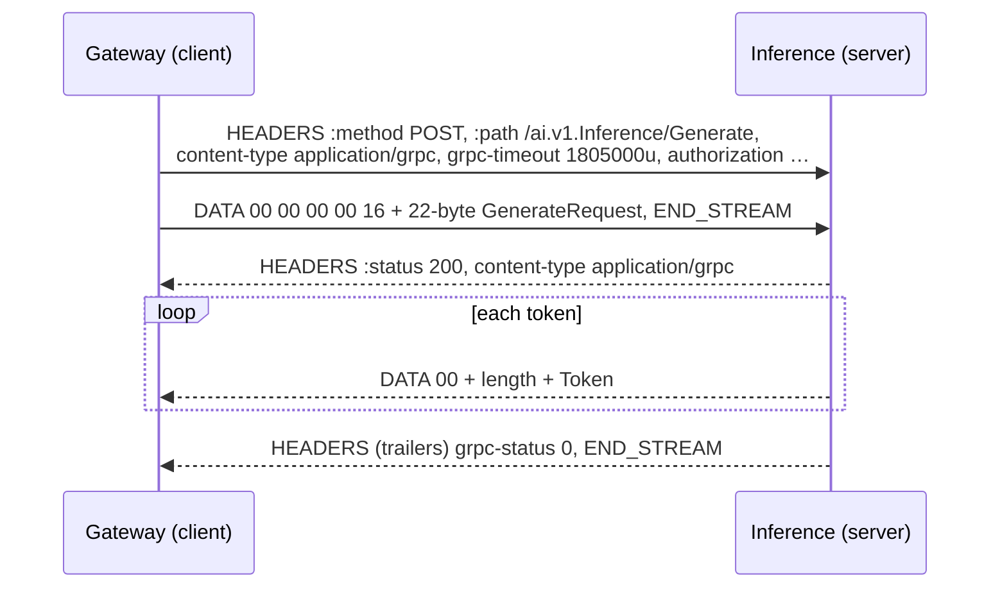
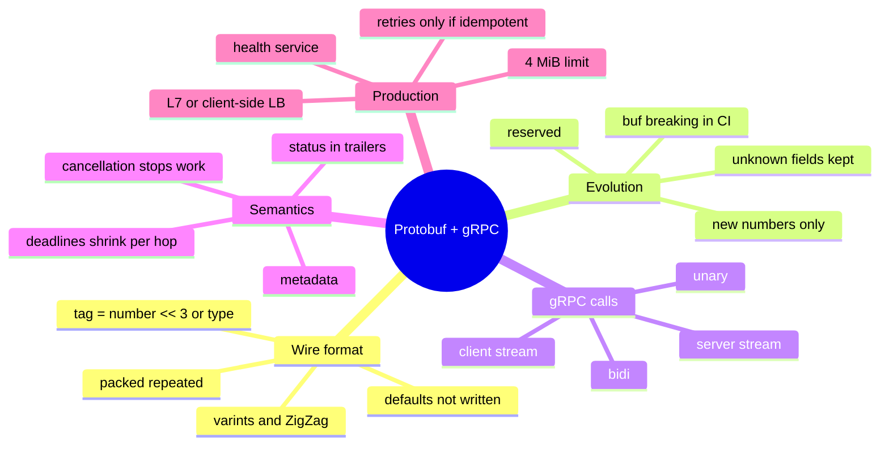

# Module 6 — Protocol Buffers & gRPC: Typed, Streaming RPC for AI Services

> Scope: the Protobuf wire format as bytes you can compute by hand, the schema-evolution
> rules that keep rolling deploys safe, and gRPC as HTTP/2 streams with deadlines,
> cancellation and status codes, all through the lens of AI services: gateways, caches,
> embedding and inference servers that stream tokens. The general API reference lives in
> [Protobuf Theory](../API/Protobuf/Theory.md) and [gRPC Theory](../API/gRPC/Theory.md); Module 8 compares gRPC with REST,
> GraphQL and SSE.

---

## 0. The Picture First — read this before the bytes

> 💡 JSON is a **letter** where every value is labelled in words: `"temperature": 0.5`.
> Protobuf is a **printed form** that both sides already hold: you only send "box 3: 0.5".
> The form is the `.proto` file. gRPC is the **courier service** that carries those forms
> over one fast HTTP/2 connection, with a delivery deadline stamped on every envelope and
> a way to call the whole delivery off halfway through.

### 0.1 Where it sits in an AI system

The running example is the course's secure AI gateway project
(`projects/05_secure_ai_gateway/`): a Go gateway in front of a Python semantic cache, an
embedding service and an inference service.

```arch
%% caption: The outside world speaks JSON over HTTP. Inside the data centre, every hop between services is gRPC with a Protobuf contract.
group edge "Public edge" color=slate
node user "Chat UI / SDK" at 1,0 in edge icon=browser
group dc "Internal network · gRPC + Protobuf" color=blue
node gw "AI gateway (Go)" at 1,1 in dc icon=gateway sub="REST/SSE in, gRPC out"
node cache "Semantic cache (Python)" at 0,2 in dc icon=cache sub="CheckCache · unary"
node emb "Embedding service" at 1,2 in dc icon=embed sub="Embed · unary"
node inf "Inference service" at 2,2 in dc icon=llm sub="Generate · server stream"
node proto "cache.proto / inference.proto" at 1,3 in dc shape=card icon=doc sub="one contract, Go + Python code generated"
user -> gw : "JSON · SSE"
gw -> cache
gw -> emb
gw -> inf : "tokens stream back"
cache ..> proto
emb ..> proto
inf ..> proto
```

### 0.2 The running example for this whole module

The project's contract, extended with the two calls every AI backend has:

```protobuf
syntax = "proto3";
package ai.v1;

service SemanticCacheService {
  rpc CheckCache (CacheRequest) returns (CacheResponse);          // unary
}

service Inference {
  rpc Embed    (EmbedRequest)    returns (Embedding);             // unary
  rpc Generate (GenerateRequest) returns (stream Token);          // server streaming
}

message CacheRequest  { string prompt = 1; }
message CacheResponse { bool hit = 1; string cached_response = 2; float similarity_score = 3; }

message Sampling {
  float temperature = 1;
  int32 max_tokens  = 2;
}

message GenerateRequest {
  string   model    = 1;
  string   prompt   = 2;
  Sampling sampling = 3;
}

message Token     { string text = 1; int32 index = 2; }
message EmbedRequest { string text = 1; }
message Embedding { repeated float values = 1; }                  // packed on the wire
```

| Question the gateway asks | Call | Pattern | Why gRPC fits |
|---|---|---|---|
| "Have I answered this before?" | `CheckCache` | unary, deadline ≈ 50 ms | cheap, typed, must fail fast |
| "What is this prompt's vector?" | `Embed` | unary | 1,536 floats: 6 KB binary vs ≈ 30 KB JSON (§2.2) |
| "Write the answer" | `Generate` | server streaming | tokens arrive one by one; cancelling stops the GPU |

### 0.3 The same request, two encodings

`GenerateRequest{model: "m-small", prompt: "Hi", sampling: {temperature: 0.5, max_tokens: 64}}`,
measured by §5:

| Encoding | Bytes | What is on the wire |
|---|---|---|
| JSON (compact) | **80** | `{"model":"m-small","prompt":"Hi","sampling":{"temperature":0.5,"max_tokens":64}}` |
| Protobuf | **22** | `0a 07 6d 2d 73 6d 61 6c 6c 12 02 48 69 1a 07 0d 00 00 00 3f 10 40` |

No field names travel. `0a` means "field 1, length-delimited", `1a` means "field 3,
length-delimited", and so on. §2.2 decodes every byte.

---

## 1. Core Intuition & Mechanical Problem Statement

Services that talk to each other thousands of times a second, written in different
languages, deployed at different times, have three problems:

1. **Encoding cost.** JSON repeats every field name in every message and turns numbers
   into decimal text that must be parsed back. For a float vector or a hot internal call
   that is wasted bytes and wasted CPU.
2. **A contract that survives change.** The gateway (Go) and the cache (Python) must
   agree on the message shape, and keep agreeing while one of them is redeployed. During a
   rolling deploy, **old and new versions run side by side**; queued messages and stored
   blobs outlive both.
3. **Call semantics over a network.** A call can take too long, the caller can give up,
   the answer can be a stream, and failures need a vocabulary richer than "500".

Protobuf solves 1 and 2: a schema (`.proto`) compiled into code for each language, a
compact binary encoding keyed by **field numbers**, and rules that let old and new
readers understand each other. gRPC solves 3: it maps each call onto one **HTTP/2
stream**, frames Protobuf messages on it, and adds deadlines, cancellation, metadata and
a fixed set of status codes.

The core mechanical facts, which every section expands:

- On the wire a message is a flat list of `(tag, value)` pairs, where
  `tag = field_number << 3 | wire_type`. Names never travel; numbers do.
- A reader **skips fields it does not know** (and modern runtimes keep them), which is
  what makes adding fields safe.
- Each gRPC call is an HTTP/2 stream: request headers, length-prefixed messages in DATA
  frames, then **trailers** carrying `grpc-status`.
- A deadline is sent as the `grpc-timeout` header and shrinks at every hop; cancelling a
  call sends `RST_STREAM` to the server, which should stop work.

---

## 2. Algorithmic / Mathematical Foundation

### 2.1 The `.proto` language in ten lines of rules

| Construct | Example | Notes |
|---|---|---|
| Scalar field | `int32 max_tokens = 2;` | types: `double float int32 int64 uint32 uint64 sint32 sint64 fixed32 fixed64 sfixed32 sfixed64 bool string bytes` |
| Nested message | `Sampling sampling = 3;` | encoded as a length-delimited blob |
| Repeated | `repeated float values = 1;` | a list; numeric repeated fields are **packed** by default in proto3 |
| Map | `map<string, string> labels = 4;` | sugar for a repeated key/value entry message; order is not defined |
| Enum | `enum Priority { PRIORITY_UNSPECIFIED = 0; PRIORITY_HIGH = 1; }` | the first value must be 0, and is the default, so name it `..._UNSPECIFIED` |
| Oneof | `oneof input { string text = 5; bytes image = 6; }` | at most one is set; setting one clears the others |
| Explicit presence | `optional float top_p = 7;` | lets you tell "unset" from "0.0" (`HasField` in Python, a pointer in Go) |
| Reserved | `reserved 3; reserved "sampling";` | the compiler refuses to reuse a removed number or name |
| Well-known types | `google.protobuf.Timestamp`, `Duration`, `Struct`, `Any`, `FieldMask`, wrappers | standard shapes with a defined JSON mapping |
| Package | `package ai.v1;` | versions the API: a truly breaking redesign becomes `ai.v2` |

**Editions.** Newer files may start with `edition = "2023";` instead of
`syntax = "proto3";`. Editions replace the proto2/proto3 split with per-feature settings
(field presence, packed encoding, enum openness). The **wire format is unchanged**, so
everything in §2.2 applies to both.

**Implicit presence.** In a proto3 scalar without `optional`, the default value (`0`,
`""`, `false`, the 0 enum) is **not written at all** and reads back as the default. A
`temperature` of `0.0` is therefore indistinguishable from "not set". For a sampling
parameter where 0 is meaningful and "unset" means "use the model's default", declare it
`optional`.

### 2.2 The wire format, byte by byte

A serialised message is a sequence of `[tag][value]` pairs, in any order, with no
separators and no names:

```
tag = (field_number << 3) | wire_type
```

| Wire type | Id | Used for | Value layout |
|---|---|---|---|
| VARINT | 0 | `int32/64`, `uint32/64`, `sint32/64`, `bool`, `enum` | 1–10 bytes, 7 bits per byte |
| I64 | 1 | `double`, `fixed64`, `sfixed64` | 8 bytes, little-endian |
| LEN | 2 | `string`, `bytes`, nested messages, packed repeated | varint length, then that many bytes |
| I32 | 5 | `float`, `fixed32`, `sfixed32` | 4 bytes, little-endian |

(Ids 3 and 4 are the deprecated proto2 "groups".)

**Varints.** Each byte carries 7 bits of the number, least-significant group first; the
top bit says "another byte follows".

```
300 = 0b10_0101100
low 7 bits  0101100 → with continuation bit → 1010_1100 = 0xac
next 7 bits 0000010 → last byte            → 0000_0010 = 0x02
300 → ac 02
```

Consequences you can compute:

| Fact | Numbers |
|---|---|
| A field number fits a 1-byte tag if `number << 3 | 7 < 128` | fields **1–15** cost 1 byte of tag, 16–2047 cost 2; give 1–15 to the hot fields |
| Largest field number | 2²⁹ − 1 = 536,870,911 (19000–19999 are reserved for the implementation) |
| `int32` of `-1` | sign-extended to 64 bits → **10 bytes** of value |
| `sint32` of `-1` | ZigZag maps `0,-1,1,-2,2 → 0,1,2,3,4`, so `-1` is **1 byte** |
| Default values | not written; a message of all defaults is **0 bytes** |

ZigZag is `(n << 1) ^ (n >> 63)` for 64-bit values: the sign moves to the lowest bit, so
small magnitudes of either sign stay small. Use `sint32/sint64` for fields that are often
negative (a delta, an offset); use `int32` for ids and counts that never are.

#### 🧮 Worked example — decoding the 22-byte request

`0a 07 6d 2d 73 6d 61 6c 6c 12 02 48 69 1a 07 0d 00 00 00 3f 10 40`

| Bytes | Meaning |
|---|---|
| `0a` | `(1 << 3) \| 2`: field 1 (`model`), LEN |
| `07` | length 7 |
| `6d 2d 73 6d 61 6c 6c` | `"m-small"` |
| `12` | `(2 << 3) \| 2`: field 2 (`prompt`), LEN |
| `02 48 69` | length 2, `"Hi"` |
| `1a` | `(3 << 3) \| 2`: field 3 (`sampling`), LEN, a nested message |
| `07` | the nested message is 7 bytes long |
| `0d` | inside it: `(1 << 3) \| 5`: field 1 (`temperature`), I32 |
| `00 00 00 3f` | 0.5 as a little-endian IEEE-754 float (`0x3f000000`) |
| `10 40` | `(2 << 3) \| 0`: field 2 (`max_tokens`), VARINT 64 |

Note that field 1 inside `Sampling` and field 1 of `GenerateRequest` share the number
without conflict: numbers are scoped to their message, and the nested message is an
opaque blob to the outer reader.

#### 🧮 Worked example — why embeddings love Protobuf

A 1,536-dimensional float32 embedding (a common size for text-embedding models):

| Encoding | Size | How |
|---|---|---|
| Protobuf `repeated float`, packed | 3 + 1536 × 4 = **6,147 B** | 1-byte tag `0a`, 2-byte length `80 30` (6,144), then raw little-endian floats |
| JSON array of the same floats | **31,906 B** (measured in §5, ≈ 5.2×) | each float printed as ~20 decimal characters, plus commas |
| JSON after gzip | smaller, but costs CPU on both ends | digits compress, but parsing 1,536 decimal strings still costs |

At 1,000 embed calls a second that is ≈ 6 MB/s versus ≈ 32 MB/s on the internal network,
and no float parsing on either side. Packing matters: unpacked, each float would carry its
own 1-byte tag (7,680 B). For a raw tensor (images, audio, a batch of vectors) many
serving APIs go one step further and send a single `bytes` field holding the whole
buffer, as KServe's Open Inference Protocol does with `raw_input_contents`.

**Skipping unknown fields.** A reader that meets a field number it does not know reads
the tag, uses the wire type to find the value's length (a varint, 4, 8, or a length
prefix) and jumps over it. Since protobuf 3.5 the major runtimes also **keep** those bytes
and write them back out when re-serialising. That one property is what §2.3 relies on.

**Merging and "last one wins".** If the same non-repeated scalar field appears twice,
the last value wins; a nested message appearing twice is **merged**. So concatenating two
serialised messages is a valid way to apply an update, and one reason Protobuf messages
are not self-delimiting: a stream of them needs framing (gRPC adds a 5-byte prefix,
§2.4).

### 2.3 Schema evolution: old and new code meet in production

A rolling deploy of 20 gateway pods takes minutes, during which v1 and v2 of every
message exist at once. Messages in a queue or a cache may be days old.

```arch
%% caption: A v2 field survives a trip through a v1 service because the v1 runtime keeps the bytes it does not understand and writes them back out.
node w2 "Gateway v2" at 0,0 icon=app sub="sets stop + priority"
node p1 "Cache proxy v1" at 1,0 icon=server sub="knows fields 1–3 only"
node r2 "Inference v2" at 2,0 icon=llm sub="reads stop + priority"
node unk "unknown fields 4, 5" at 1,1 shape=card icon=layers sub="kept as raw bytes, re-emitted"
w2 -> p1 : "fields 1–5"
p1 -> r2 : "fields 1–5"
p1 ..> unk
```

| Change | Safe? | Why |
|---|---|---|
| Add a field with a **new** number | yes | old readers skip it; new readers see the default in old data |
| Remove a field **and** `reserved` its number and name | yes | nobody can accidentally reuse it |
| Rename a field | on the binary wire, yes | names aren't on the wire, but generated code and the **JSON** mapping change |
| Change a field's number | **never** | every stored and in-flight message changes meaning |
| Reuse a deleted number | **never** | old bytes are silently read as the new field (§5 shows garbage, not an error) |
| Change type within a compatible group | careful | `int32/uint32/int64/uint64/bool` share VARINT (values may truncate); `sint*` is not compatible with `int*`; `string`↔`bytes` only if valid UTF-8 |
| Scalar → `repeated` of the same type | mostly | a repeated reader accepts a single value; the reverse keeps only the last |
| Add an enum value | yes, with care | old readers see an unknown number; always handle a `default` branch |
| Make a field `required` (proto2) | **never** | old writers don't set it; Google's own style guide bans `required` |

**Enforce it in CI.** `buf breaking --against '.git#branch=main'` compares the new
`.proto` files with the last released ones and fails the build on a removed field, a
changed number or type, or a renamed field if you check JSON compatibility. It turns
the table above from a code-review memory test into a failing check.

**Defaults hide bugs.** A v2 reader of v1 data sees `priority = 0`. If 0 is a real
level, v1 traffic silently gets it. Hence the `..._UNSPECIFIED = 0` convention: "not set"
must never mean something.

### 2.4 gRPC: one call = one HTTP/2 stream

gRPC generates a **stub** (client) and a **service base class** (server) from the
`service` block. The four call shapes:

| Shape | `.proto` | AI example |
|---|---|---|
| Unary | `rpc Embed (EmbedRequest) returns (Embedding);` | embed a query, check the cache |
| Server streaming | `rpc Generate (GenerateRequest) returns (stream Token);` | stream tokens back |
| Client streaming | `rpc Transcribe (stream AudioChunk) returns (Transcript);` | upload audio in chunks |
| Bidirectional | `rpc Talk (stream Frame) returns (stream Frame);` | a voice agent: audio in, audio + text out, interruptible |

**On the wire** (HTTP/2 is required; each call is one stream on a shared connection):



**Length-prefixed messages.** Every message in a DATA frame is `1 byte compressed flag +
4 bytes big-endian length + the Protobuf bytes`. HTTP/2 may split one message across
several DATA frames or pack several into one; the receiver buffers until a whole message
is there (§5 reassembles two messages from three frames).

**Status codes.** gRPC has 17 codes (`OK` is 0). The ones you design around:

| Code | Means | Client should |
|---|---|---|
| `INVALID_ARGUMENT` (3) | the request itself is wrong | fix it, never retry |
| `DEADLINE_EXCEEDED` (4) | the deadline passed | maybe retry if budget remains; the server may have finished the work |
| `NOT_FOUND` (5), `PERMISSION_DENIED` (7), `UNAUTHENTICATED` (16) | as named | don't retry |
| `RESOURCE_EXHAUSTED` (8) | quota or a message-size limit | back off (and check message sizes) |
| `FAILED_PRECONDITION` (9) | system not in the right state | don't retry until the state changes |
| `UNAVAILABLE` (14) | transient: server down, connection reset | retry with backoff; the canonical retryable code |
| `CANCELLED` (1) | the caller cancelled | nothing to do |
| `INTERNAL` (13), `UNKNOWN` (2) | server bug or unmapped exception | alert; retry only if the call is idempotent |

**Metadata** is key/value pairs in headers (request) and headers/trailers (response):
auth tokens, request ids, tenant ids, and on the way back things like the model version
that served the call. Keys ending in `-bin` carry binary values, base64-encoded on the
wire.

### 2.5 Deadlines and cancellation: the budget shrinks at every hop

A deadline is an absolute point in time; on the wire it travels as a relative
`grpc-timeout` (a number of at most 8 digits plus a unit: `H M S m u n`). Each server
turns it back into a local deadline and, if it calls another service with the same
context, sends the **remaining** time.

#### 🧮 Worked example — a 2-second budget

The user's SDK allows 2 s. The gateway spends 15 ms on auth and routing, the retrieval
call takes 180 ms:

| Hop | `grpc-timeout` sent | Time left |
|---|---|---|
| client → gateway | `2000000u` | 2.000 s |
| gateway → retrieval | `1985000u` | 1.985 s |
| gateway → inference | `1805000u` | 1.805 s |

Without propagation, each hop picks its own fixed timeout (say 30 s for inference). The
user gives up at 2 s, but the inference service keeps generating for up to 30 s: GPU time
spent on tokens nobody will read. On a busy cluster that waste is a meaningful share of
capacity.

**Cancellation** is the same idea when the caller leaves early: the user closes the chat
tab, the gateway's SSE connection drops, the gateway cancels its context, gRPC sends
`RST_STREAM` (CANCEL) for that stream, and the inference server's `context.is_active()`
(Python) or `ctx.Done()` (Go) fires. The server must **check** it in its token loop; gRPC
cannot interrupt a CUDA kernel for you. §5 cancels a 200-token stream after 3 tokens and
the server stops after only a few.

```arch
%% caption: A closed browser tab should stop the GPU. Each hop turns "my caller left" into "cancel my callee".
node tab "Tab closed" at 0,0 icon=browser color=red
node gw "Gateway" at 1,0 icon=gateway sub="SSE drops → cancel ctx"
node inf "Inference server" at 2,0 icon=llm sub="is_active() = False"
node gpu "Decode loop stops" at 2,1 shape=pill color=green
tab -> gw : "TCP FIN"
gw -> inf : "RST_STREAM"
inf -> gpu
```

**Back-pressure.** HTTP/2 flow control gives each stream a receive window (65,535 bytes
by default, raised by most gRPC implementations and grown by BDP probing). If the gateway
reads tokens slower than inference produces them, the window fills and the server's
`send`/`yield` blocks. That is correct behaviour (a slow reader can't make the server
buffer without limit) and also the reason a stuck client pins server resources until its
deadline fires.

### 2.6 Running it in production

**Load balancing: the one trap everyone hits.** A gRPC client keeps one long-lived HTTP/2
connection per backend and multiplexes every call over it. A layer-4 load balancer only
balances **connections**, so each client sticks to one pod.

```arch
%% caption: Left, an L4 balancer pins the gateway's single connection to one pod. Right, per-call balancing spreads the calls.
group l4 "L4 (TCP) balancer" color=red
node c1 "Gateway" at 0,0 in l4 icon=gateway sub="1 HTTP/2 conn"
node lb1 "L4 LB" at 0,1 in l4 icon=lb
node a1 "Pod A" at 0,2 in l4 icon=llm sub="100% of calls"
node b1 "Pod B (new)" at 1,2 in l4 icon=llm sub="idle"
group l7 "Per-call balancing" color=green
node c2 "Gateway" at 2.5,0 in l7 icon=gateway sub="client-side LB or Envoy"
node a2 "Pod A" at 2,2 in l7 icon=llm sub="~50%"
node b2 "Pod B" at 3,2 in l7 icon=llm sub="~50%"
c1 -> lb1 -> a1
c2 -> a2
c2 -> b2
```

Fixes: an HTTP/2-aware L7 proxy (Envoy, a service mesh, cloud L7 load balancers) that
balances each call; **client-side balancing** (resolve all pod IPs, e.g. through a
Kubernetes headless service, and use the `round_robin` policy); and `MAX_CONNECTION_AGE`
on servers so connections recycle and new pods get picked up.

**Everything else you configure:**

| Concern | Mechanism | Default / example |
|---|---|---|
| Health | the standard `grpc.health.v1.Health` service (`Check`, `Watch`); Kubernetes has native gRPC probes | report `NOT_SERVING` while the model loads |
| Discovery for tools | server reflection (`grpcurl list`) | turn off or authenticate in production |
| Message size | max receive size, **4 MiB** by default in the major implementations | a large embedding batch fails with `RESOURCE_EXHAUSTED`: stream or raise it on both ends |
| Keepalive | HTTP/2 PING every N seconds | keeps idle connections through NATs; servers reject too-frequent pings (`ENHANCE_YOUR_CALM`) |
| Retries | service config: `maxAttempts`, `retryableStatusCodes: [UNAVAILABLE]`, backoff; optional **hedging** | only for idempotent methods; a retry throttle stops retry storms |
| Middleware | interceptors (auth, logging, metrics, tracing) | the OpenTelemetry gRPC instrumentation is an interceptor |
| Security | TLS or mTLS on the channel; per-call tokens in metadata | mTLS between services, OAuth/JWT for the caller's identity |
| Browsers | no direct gRPC; use gRPC-Web via a proxy, Connect, or JSON transcoding | the public edge usually stays REST + SSE (Module 8) |

**A real-world contract: the Open Inference Protocol.** KServe's "v2" inference protocol,
implemented by NVIDIA Triton and others, defines a gRPC service
`inference.GRPCInferenceService` with `ServerLive`, `ServerReady`, `ModelReady`,
`ModelMetadata` and `ModelInfer` (plus a REST equivalent). Tensors travel as typed
repeated fields or as raw bytes. It is a good example of Protobuf being used exactly for
what it is good at: a stable, versioned, language-neutral contract for high-volume
numeric payloads.

---

## 3. Low-Level Execution Flow & Data Structures

One unary `Embed` call from the Go gateway to the Python embedding service:

```arch
%% caption: Generated code at both ends; the channel, HTTP/2 and the framing are the runtime's job.
group cli "Gateway process (Go)" color=blue
node stub "Generated stub" at 0,0 in cli icon=code sub="client.Embed(ctx, req)"
node ic "Client interceptors" at 0,1 in cli icon=layers sub="auth, retry, tracing"
node ch "Channel" at 0,2 in cli icon=connection sub="resolver + LB → subchannel"
group srv "Embedding process (Python)" color=green
node tr "HTTP/2 server" at 2,2 in srv icon=server sub="stream id, window"
node si "Server interceptors" at 2,1 in srv icon=layers sub="auth, metrics"
node h "Your handler" at 2,0 in srv icon=embed sub="Embed(request, context)"
stub -> ic -> ch
ch -> tr : "HEADERS + DATA"
tr -> si -> h
h:L -> stub:R : "Embedding + trailers"
```

| Step | What happens | Data structure |
|---|---|---|
| 1 | stub serialises `EmbedRequest` with generated code (no reflection over names) | a byte buffer |
| 2 | client interceptors add metadata, start a trace span, maybe retry | the call's metadata map |
| 3 | the channel's resolver has the backend list; the LB policy picks a subchannel (one HTTP/2 connection) | subchannel list, per-connection state |
| 4 | a new HTTP/2 stream id (odd numbers for client streams) carries HEADERS (HPACK-compressed) and DATA | stream table, HPACK dynamic table, flow-control windows |
| 5 | server reads the 5-byte prefix, waits for the whole message, deserialises | per-stream receive buffer |
| 6 | server interceptors, then your handler, with a `context` that knows the deadline and cancellation | a deadline timer per call |
| 7 | response message, then trailers `grpc-status: 0`; the client resolves the call | — |

Per call the cost is a stream, not a connection: no TCP or TLS handshake after the first
call, which is a large part of why internal gRPC latency stays low.

---

## 4. Edge Cases, Failure Modes & Hardware Bottlenecks

- **Reused field numbers.** Deleting `sampling = 3` and later adding `user_id = 3` makes
  every old message decode `sampling`'s bytes as a `user_id` string: no error, just wrong
  data (§5). Always `reserved` removed numbers and names.
- **Zero means unset.** A proto3 `float temperature = 1;` cannot express "use the model
  default" separately from `0.0`. Use `optional` or a wrapper type for parameters where 0
  is meaningful.
- **Enum defaults.** An enum whose 0 value is a real choice (`PRIORITY_HIGH = 0`) makes
  every missing field high priority. Reserve 0 for `_UNSPECIFIED`.
- **JSON mapping breaks on renames.** Binary is safe across renames; the JSON form
  (`protojson`, transcoded REST, logged payloads) uses field names. If you expose JSON,
  renames are breaking.
- **Map order and determinism.** Serialisation is not canonical: map order and unknown
  field placement can differ between runtimes and versions. Never hash or sign serialised
  bytes and expect a stable result, and never use them as a cache key; hash a canonical
  form instead.
- **4 MiB message limit.** Batch embedding of 1,000 texts at 1,536 floats is ≈ 6 MB and
  fails with `RESOURCE_EXHAUSTED`. Stream the batch, split it, or raise the limit
  deliberately on both sides.
- **Deadline not propagated.** A hop that creates a fresh `context.Background()` (Go) or
  a new timeout loses the caller's deadline and cancellation. Pass the incoming context.
- **Handler ignores cancellation.** gRPC marks the call cancelled, but a Python generator
  that never checks `context.is_active()` keeps decoding until `max_tokens`.
- **Retrying non-idempotent calls.** A retry policy on `UNAVAILABLE` can re-run a call the
  server already executed (the response was lost, not the request). Only retry idempotent
  methods, or carry an idempotency key in metadata.
- **L4 load balancing** pins traffic to old pods after a scale-up (§2.6).
- **Keepalive misconfiguration.** A client pinging every 10 s against a server that allows
  one ping per 5 minutes gets `GOAWAY` with `ENHANCE_YOUR_CALM` and reconnects in a loop.
- **Head-of-line blocking at the TCP level.** HTTP/2 removes it between requests but not
  within TCP: one lost packet stalls every stream on the connection. On lossy networks
  several connections, or HTTP/3, help.
- **Python server throughput.** The synchronous Python server runs handlers on a thread
  pool; CPU-heavy work in the handler is bound by the GIL. Put the model on its own
  engine (vLLM, Triton) and keep the gRPC handler thin, or use the `grpc.aio` server.

---

## 5. From-Scratch Reference Code

Two listings. The first is standard library only: a schema-driven Protobuf encoder and
decoder that keeps unknown fields, the evolution scenarios from §2.3, gRPC framing, and
the deadline arithmetic from §2.5. Its bytes match the official `protobuf` runtime for the
same `.proto`.

```python
"""
Protocol Buffers and gRPC framing from scratch, standard library only.

  1. The wire format: varints, ZigZag, tags, the four wire types, packed
     repeated fields, nested messages.
  2. A schema-driven encoder/decoder that KEEPS unknown fields, which is what
     makes rolling deploys safe (a v1 hop in the middle doesn't lose v2 data).
  3. Schema evolution in action, including the bug the rules exist for:
     reusing a deleted field number.
  4. gRPC's 5-byte length-prefixed framing, and the grpc-timeout header with
     a deadline budget shrinking across hops.

Run:  python3 protowire.py
"""
import json
import random
import struct

# ---------------------------------------------------------------------------
# 1. Wire primitives
# ---------------------------------------------------------------------------
VARINT, I64, LEN, I32 = 0, 1, 2, 5          # wire types (3 and 4 are deprecated groups)


def enc_varint(n: int) -> bytes:
    """Unsigned LEB128: 7 bits per byte, low group first, top bit = 'more follows'."""
    if n < 0:
        n &= (1 << 64) - 1                   # negative int32/int64: 64-bit two's complement, 10 bytes
    out = bytearray()
    while True:
        b = n & 0x7F
        n >>= 7
        if n:
            out.append(b | 0x80)
        else:
            out.append(b)
            return bytes(out)


def dec_varint(buf: bytes, i: int) -> tuple[int, int]:
    shift = result = 0
    while True:
        b = buf[i]
        i += 1
        result |= (b & 0x7F) << shift
        if not b & 0x80:
            return result, i
        shift += 7
        if shift >= 70:
            raise ValueError("varint too long")


def zigzag(n: int) -> int:                   # sint32/sint64: small magnitudes stay small
    return (n << 1) ^ (n >> 63)


def unzigzag(z: int) -> int:
    return (z >> 1) ^ -(z & 1)


def tag(field_number: int, wire_type: int) -> bytes:
    return enc_varint((field_number << 3) | wire_type)


# type name -> (wire type, encode value -> bytes, decode(bytes, i) -> (value, i))
def _signed(v: int, bits: int) -> int:
    v &= (1 << bits) - 1
    return v - (1 << bits) if v >> (bits - 1) else v


SCALARS = {
    "int32":  (VARINT, enc_varint, lambda b, i: (lambda v, j: (_signed(v, 32), j))(*dec_varint(b, i))),
    "int64":  (VARINT, enc_varint, lambda b, i: (lambda v, j: (_signed(v, 64), j))(*dec_varint(b, i))),
    "uint32": (VARINT, enc_varint, dec_varint),
    "bool":   (VARINT, lambda v: enc_varint(int(v)), lambda b, i: (lambda v, j: (bool(v), j))(*dec_varint(b, i))),
    "enum":   (VARINT, enc_varint, lambda b, i: (lambda v, j: (_signed(v, 32), j))(*dec_varint(b, i))),
    "sint32": (VARINT, lambda v: enc_varint(zigzag(v)), lambda b, i: (lambda v, j: (unzigzag(v), j))(*dec_varint(b, i))),
    "float":  (I32, lambda v: struct.pack("<f", v), lambda b, i: (struct.unpack_from("<f", b, i)[0], i + 4)),
    "double": (I64, lambda v: struct.pack("<d", v), lambda b, i: (struct.unpack_from("<d", b, i)[0], i + 8)),
}
DEFAULTS = {"int32": 0, "int64": 0, "uint32": 0, "bool": False, "enum": 0, "sint32": 0,
            "float": 0.0, "double": 0.0, "string": "", "bytes": b""}


# ---------------------------------------------------------------------------
# 2. Schema-driven encode/decode that preserves unknown fields
# ---------------------------------------------------------------------------
# A schema is {field_name: (number, type, repeated)}; type is a scalar name,
# "string", "bytes", or another schema dict (a nested message).
UNKNOWN = "_unknown"                         # raw bytes of fields this schema doesn't know


def encode(schema: dict, msg: dict) -> bytes:
    out = bytearray()
    for name, (num, typ, repeated) in sorted(schema.items(), key=lambda kv: kv[1][0]):
        if name not in msg:
            continue
        values = msg[name] if repeated else [msg[name]]
        if isinstance(typ, str) and typ in SCALARS and repeated:
            # proto3 packs repeated scalars: ONE tag, ONE length, values back to back
            payload = b"".join(SCALARS[typ][1](v) for v in values)
            if payload:
                out += tag(num, LEN) + enc_varint(len(payload)) + payload
            continue
        for v in values:
            if not repeated and isinstance(typ, str) and v == DEFAULTS.get(typ):
                continue                     # proto3 implicit presence: defaults are not written
            if isinstance(typ, dict):
                body = encode(typ, v)
                out += tag(num, LEN) + enc_varint(len(body)) + body
            elif typ in ("string", "bytes"):
                body = v.encode() if typ == "string" else v
                out += tag(num, LEN) + enc_varint(len(body)) + body
            else:
                wt, enc, _ = SCALARS[typ]
                out += tag(num, wt) + enc(v)
    out += msg.get(UNKNOWN, b"")             # re-emit what we didn't understand, untouched
    return bytes(out)


def skip(buf: bytes, i: int, wt: int) -> int:
    if wt == VARINT:
        return dec_varint(buf, i)[1]
    if wt == I64:
        return i + 8
    if wt == I32:
        return i + 4
    if wt == LEN:
        n, i = dec_varint(buf, i)
        return i + n
    raise ValueError(f"unsupported wire type {wt}")


def decode(schema: dict, buf: bytes) -> dict:
    by_num = {num: (name, typ, rep) for name, (num, typ, rep) in schema.items()}
    msg: dict = {name: ([] if rep else (DEFAULTS[typ] if isinstance(typ, str) else {}))
                 for name, (num, typ, rep) in schema.items()}
    unknown = bytearray()
    i = 0
    while i < len(buf):
        start = i
        key, i = dec_varint(buf, i)
        num, wt = key >> 3, key & 7
        if num not in by_num:                # unknown field: keep its raw bytes
            i = skip(buf, i, wt)
            unknown += buf[start:i]
            continue
        name, typ, rep = by_num[num]
        if isinstance(typ, dict) or typ in ("string", "bytes"):
            n, i = dec_varint(buf, i)
            raw = buf[i:i + n]
            i += n
            val = decode(typ, raw) if isinstance(typ, dict) else (raw.decode() if typ == "string" else bytes(raw))
            if rep:
                msg[name].append(val)
            else:
                msg[name] = val              # last one wins
        elif rep and wt == LEN:              # packed repeated scalars
            n, i = dec_varint(buf, i)
            end = i + n
            while i < end:
                v, i = SCALARS[typ][2](buf, i)
                msg[name].append(v)
        else:
            v, i = SCALARS[typ][2](buf, i)
            if rep:
                msg[name].append(v)
            else:
                msg[name] = v
    if unknown:
        msg[UNKNOWN] = bytes(unknown)
    return msg


def hexs(b: bytes) -> str:
    return " ".join(f"{x:02x}" for x in b)


# ---------------------------------------------------------------------------
# 3. The running example's messages, and a v1 -> v2 evolution
# ---------------------------------------------------------------------------
SAMPLING = {"temperature": (1, "float", False), "max_tokens": (2, "int32", False)}
GENERATE_V1 = {"model": (1, "string", False), "prompt": (2, "string", False),
               "sampling": (3, SAMPLING, False)}
# v2 adds stop sequences (new number 4) and a priority enum (new number 5)
GENERATE_V2 = {**GENERATE_V1, "stop": (4, "string", True), "priority": (5, "enum", False)}
EMBEDDING = {"values": (1, "float", True)}

# ---------------------------------------------------------------------------
# 4. gRPC framing and deadlines
# ---------------------------------------------------------------------------
def grpc_frame(payload: bytes, compressed: bool = False) -> bytes:
    """Every gRPC message on an HTTP/2 DATA stream: 1-byte flag + 4-byte big-endian length."""
    return struct.pack(">BI", int(compressed), len(payload)) + payload


def grpc_deframe(stream: bytes) -> list[bytes]:
    msgs, i = [], 0
    while i + 5 <= len(stream):
        flag, n = struct.unpack_from(">BI", stream, i)
        if i + 5 + n > len(stream):
            break                            # partial message: wait for more DATA frames
        msgs.append(stream[i + 5:i + 5 + n])
        i += 5 + n
    return msgs


UNITS = {"H": 3600.0, "M": 60.0, "S": 1.0, "m": 1e-3, "u": 1e-6, "n": 1e-9}


def encode_timeout(seconds: float) -> str:
    """grpc-timeout: at most 8 digits + a unit. Pick the finest unit that fits."""
    for unit in ("n", "u", "m", "S", "M", "H"):
        value = int(seconds / UNITS[unit])
        if value < 10 ** 8:
            return f"{value}{unit}"
    raise ValueError("timeout too large")


def parse_timeout(header: str) -> float:
    return int(header[:-1]) * UNITS[header[-1]]


# ---------------------------------------------------------------------------
# Self-test / demonstration
# ---------------------------------------------------------------------------
if __name__ == "__main__":
    # -- primitives
    assert enc_varint(1) == b"\x01" and enc_varint(150) == b"\x96\x01" and enc_varint(300) == b"\xac\x02"
    assert len(enc_varint(-1)) == 10 and enc_varint(zigzag(-1)) == b"\x01"
    assert [zigzag(n) for n in (0, -1, 1, -2, 2)] == [0, 1, 2, 3, 4]
    print("varint 300 ->", hexs(enc_varint(300)), "| int32 -1 ->", len(enc_varint(-1)),
          "bytes | sint32 -1 ->", hexs(enc_varint(zigzag(-1))))
    print("tag(1, VARINT) =", hexs(tag(1, VARINT)), "| tag(15, LEN) =", hexs(tag(15, LEN)),
          "| tag(16, LEN) =", hexs(tag(16, LEN)))

    # -- a request, byte by byte
    req = {"model": "m-small", "prompt": "Hi", "sampling": {"temperature": 0.5, "max_tokens": 64}}
    wire = encode(GENERATE_V1, req)
    js = json.dumps(req, separators=(",", ":")).encode()
    print(f"GenerateRequest: protobuf {len(wire)} B vs JSON {len(js)} B")
    print("  ", hexs(wire))
    assert decode(GENERATE_V1, wire) == req

    # -- defaults cost nothing
    assert encode(GENERATE_V1, {"model": "", "prompt": ""}) == b""

    # -- an embedding: packed float32 vs JSON
    rng = random.Random(0)
    vec = [struct.unpack("<f", struct.pack("<f", rng.uniform(-0.1, 0.1)))[0] for _ in range(1536)]
    emb = encode(EMBEDDING, {"values": vec})
    emb_json = json.dumps({"values": vec}, separators=(",", ":")).encode()
    print(f"1536-dim embedding: protobuf {len(emb)} B (header {hexs(emb[:3])}) vs JSON {len(emb_json)} B"
          f" ({len(emb_json) / len(emb):.1f}x)")
    assert len(emb) == 3 + 1536 * 4
    assert decode(EMBEDDING, emb)["values"] == vec

    # -- schema evolution: v2 writer -> v1 proxy -> v2 reader
    v2_req = {**req, "stop": ["\n\n", "END"], "priority": 2}
    v2_bytes = encode(GENERATE_V2, v2_req)
    at_v1 = decode(GENERATE_V1, v2_bytes)                    # old service in the middle
    print("v1 proxy sees fields:", sorted(k for k in at_v1 if k != UNKNOWN),
          f"+ {len(at_v1[UNKNOWN])} unknown bytes kept")
    at_v1["prompt"] = "Hi!"                                  # the proxy edits a field it knows...
    forwarded = encode(GENERATE_V1, at_v1)                   # ...and re-encodes
    at_v2 = decode(GENERATE_V2, forwarded)
    assert at_v2["stop"] == ["\n\n", "END"] and at_v2["priority"] == 2 and at_v2["prompt"] == "Hi!"
    print("v2 reader after the v1 hop: stop =", at_v2["stop"], "priority =", at_v2["priority"])

    # v1 writer -> v2 reader: new fields read as defaults
    old = decode(GENERATE_V2, wire)
    assert old["stop"] == [] and old["priority"] == 0
    print("v1 bytes read by v2: stop =", old["stop"], "priority =", old["priority"], "(defaults)")

    # -- the bug the rules exist for: field 3 deleted, then REUSED with another type
    BAD_V3 = {"model": (1, "string", False), "prompt": (2, "string", False),
              "user_id": (3, "string", False)}               # 3 used to be `sampling`
    bad = decode(BAD_V3, wire)
    print("reused field 3 reads old sampling bytes as user_id =", repr(bad["user_id"]))
    assert bad["user_id"] != ""                              # silently wrong, no error raised

    # -- gRPC framing: two messages arrive split across three DATA frames
    stream = grpc_frame(b"tok-A") + grpc_frame(b"tok-BB")
    frames = [stream[:3], stream[3:9], stream[9:]]
    buf, got = b"", []
    for f in frames:
        buf += f
        msgs = grpc_deframe(buf)
        consumed = sum(5 + len(m) for m in msgs)
        got += msgs
        buf = buf[consumed:]
    assert got == [b"tok-A", b"tok-BB"]
    print("framed:", hexs(grpc_frame(b"tok-A")), "| reassembled from 3 DATA frames:", got)

    # -- deadline budget across hops: user gives the gateway 2 s
    budget = 2.0
    hops = [("gateway", 0.015), ("retrieval", 0.180), ("inference", None)]
    for name, spent in hops:
        header = encode_timeout(budget)
        print(f"  -> {name:<9} grpc-timeout: {header:<10} ({parse_timeout(header):.3f} s left)")
        if spent is not None:
            budget -= spent
    assert encode_timeout(2.0) == "2000000u" and parse_timeout("300m") == 0.3
    print("Self-test complete: varints, ZigZag, packing, unknown-field round trip, "
          "field-reuse corruption, gRPC framing and deadlines verified.")
```

**Sample output:**

```
varint 300 -> ac 02 | int32 -1 -> 10 bytes | sint32 -1 -> 01
tag(1, VARINT) = 08 | tag(15, LEN) = 7a | tag(16, LEN) = 82 01
GenerateRequest: protobuf 22 B vs JSON 80 B
   0a 07 6d 2d 73 6d 61 6c 6c 12 02 48 69 1a 07 0d 00 00 00 3f 10 40
1536-dim embedding: protobuf 6147 B (header 0a 80 30) vs JSON 31906 B (5.2x)
v1 proxy sees fields: ['model', 'prompt', 'sampling'] + 11 unknown bytes kept
v2 reader after the v1 hop: stop = ['\n\n', 'END'] priority = 2
v1 bytes read by v2: stop = [] priority = 0 (defaults)
reused field 3 reads old sampling bytes as user_id = '\r\x00\x00\x00?\x10@'
framed: 00 00 00 00 05 74 6f 6b 2d 41 | reassembled from 3 DATA frames: [b'tok-A', b'tok-BB']
  -> gateway   grpc-timeout: 2000000u   (2.000 s left)
  -> retrieval grpc-timeout: 1985000u   (1.985 s left)
  -> inference grpc-timeout: 1805000u   (1.805 s left)
Self-test complete: varints, ZigZag, packing, unknown-field round trip, field-reuse corruption, gRPC framing and deadlines verified.
```

The second listing runs a **real** gRPC server and client with the `grpcio` package and no
`protoc` step: messages are serialised by `protowire.py` above, and the service is
registered with a generic handler. Save both files side by side, `pip install grpcio`,
and run it.

```python
"""
A real gRPC server and client (pip install grpcio) with NO protoc step:
messages are encoded with protowire.py from the listing above, and the
service is registered with a generic handler. Everything else -- HTTP/2,
framing, deadlines, cancellation, status codes, metadata -- is real gRPC.

Run:  python3 grpc_live.py      (protowire.py in the same directory)
"""
import threading
import time
from concurrent import futures

import grpc

import protowire as pw

REQ = {"prompt": (1, "string", False), "max_tokens": (2, "int32", False)}
TOK = {"text": (1, "string", False), "index": (2, "int32", False)}
EMB = {"values": (1, "float", True)}

ser = lambda schema: (lambda msg: pw.encode(schema, msg))
de = lambda schema: (lambda raw: pw.decode(schema, raw))

produced = {"tokens": 0}                      # server-side counter, to prove cancellation
stopped = threading.Event()


def generate(request, context):
    """Server streaming: one yield = one length-prefixed message on the HTTP/2 stream."""
    if request["max_tokens"] <= 0:
        context.abort(grpc.StatusCode.INVALID_ARGUMENT, "max_tokens must be > 0")
    produced["tokens"] = 0
    for i in range(request["max_tokens"]):
        if not context.is_active():           # client cancelled or deadline passed
            break                             # stop spending (GPU) time
        time.sleep(0.02)                      # "decode one token"
        produced["tokens"] += 1
        yield {"text": f"t{i}", "index": i}
    stopped.set()


def embed(request, context):
    md = dict(context.invocation_metadata())
    if md.get("authorization") != "Bearer demo":
        context.abort(grpc.StatusCode.UNAUTHENTICATED, "bad token")
    time.sleep(0.3 if request["prompt"] == "slow" else 0.0)
    context.set_trailing_metadata((("x-model-version", "emb-2026-01"),))
    return {"values": [0.25, -0.5, 1.0]}


handler = grpc.method_handlers_generic_handler("ai.Inference", {
    "Generate": grpc.unary_stream_rpc_method_handler(
        generate, request_deserializer=de(REQ), response_serializer=ser(TOK)),
    "Embed": grpc.unary_unary_rpc_method_handler(
        embed, request_deserializer=de(REQ), response_serializer=ser(EMB)),
})

if __name__ == "__main__":
    server = grpc.server(futures.ThreadPoolExecutor(max_workers=4))
    server.add_generic_rpc_handlers((handler,))
    port = server.add_insecure_port("127.0.0.1:0")
    server.start()

    with grpc.insecure_channel(f"127.0.0.1:{port}") as ch:
        Generate = ch.unary_stream("/ai.Inference/Generate", request_serializer=ser(REQ),
                                   response_deserializer=de(TOK))
        Embed = ch.unary_unary("/ai.Inference/Embed", request_serializer=ser(REQ),
                               response_deserializer=de(EMB))
        auth = (("authorization", "Bearer demo"),)

        # 1. unary with metadata, a deadline and trailers
        resp, call = Embed.with_call({"prompt": "hello"}, timeout=1.0, metadata=auth)
        print("1 Embed ->", resp["values"], "| trailer:", dict(call.trailing_metadata()))

        # 2. server streaming, read to the end
        toks = [t["text"] for t in Generate({"prompt": "hi", "max_tokens": 5}, timeout=2.0)]
        print("2 Generate ->", toks)

        # 3. the client stops reading after 3 tokens and cancels
        stopped.clear()
        stream = Generate({"prompt": "hi", "max_tokens": 200}, timeout=10.0)
        first = [next(stream)["text"] for _ in range(3)]
        stream.cancel()
        stopped.wait(2.0)
        print(f"3 cancelled after {first}; server produced {produced['tokens']} of 200 tokens")
        assert produced["tokens"] < 20

        # 4. deadline exceeded
        try:
            Embed({"prompt": "slow"}, timeout=0.1, metadata=auth)
        except grpc.RpcError as e:
            print("4 slow Embed ->", e.code().name)
            assert e.code() == grpc.StatusCode.DEADLINE_EXCEEDED

        # 5. errors are status codes (in trailers), not HTTP status codes
        try:
            list(Generate({"prompt": "x", "max_tokens": 0}, timeout=1.0))
        except grpc.RpcError as e:
            print("5a", e.code().name, "-", e.details())
        try:
            Embed({"prompt": "x"}, timeout=1.0)            # no authorization metadata
        except grpc.RpcError as e:
            print("5b", e.code().name, "-", e.details())

    server.stop(grace=None)
    print("gRPC demo complete: unary + metadata/trailers, server streaming, "
          "cancellation stops the producer, deadlines and status codes verified.")
```

**Sample output** (the number of tokens produced before the cancellation lands depends on
timing; it is always a handful, never 200):

```
1 Embed -> [0.25, -0.5, 1.0] | trailer: {'x-model-version': 'emb-2026-01'}
2 Generate -> ['t0', 't1', 't2', 't3', 't4']
3 cancelled after ['t0', 't1', 't2']; server produced 4 of 200 tokens
4 slow Embed -> DEADLINE_EXCEEDED
5a INVALID_ARGUMENT - max_tokens must be > 0
5b UNAUTHENTICATED - bad token
gRPC demo complete: unary + metadata/trailers, server streaming, cancellation stops the producer, deadlines and status codes verified.
```

What to notice:

- `0a 80 30` is the whole overhead of a 1,536-float embedding: one tag, one 2-byte length.
- The v1 proxy never declared `stop` or `priority`, yet they reach the v2 reader intact.
- Reusing field number 3 produces a garbage string, not an exception.
- After `stream.cancel()` the server's `context.is_active()` turns false and the loop stops
  well before 200 tokens.
- A missing auth token and a bad argument come back as distinct status codes with
  messages, in trailers, on an HTTP 200 response.

---

## 6. Recap & Self-Check



| Idea | Remember it as |
|---|---|
| Protobuf | "send box numbers and values; both sides hold the form" |
| Tag | "`number << 3 | wire type`; fields 1–15 have 1-byte tags" |
| Varint / ZigZag | "7 bits a byte; use `sint` for negatives" |
| Evolution | "add with new numbers, reserve removed ones, never renumber or reuse" |
| Unknown fields | "skipped and kept, so a v1 hop doesn't lose v2 data" |
| gRPC | "one call = one HTTP/2 stream; status arrives in trailers" |
| Deadline | "absolute time, sent as a shrinking `grpc-timeout`" |
| Cancellation | "tab closed → RST_STREAM → the handler must check and stop" |
| Load balancing | "balance calls, not connections" |

**Test yourself** — answer out loud first, then open.

<details>
<summary>1. Encode field 2 = 150 as an int32. What bytes go on the wire?</summary>

Tag `(2 << 3) | 0 = 0x10`, then varint 150 = `96 01`. Total: `10 96 01`.

</details>

<details>
<summary>2. Why are field numbers 1–15 "precious"?</summary>

The tag is a varint of `number << 3 | wire_type`; for numbers up to 15 that is below 128,
so the tag takes one byte. 16–2047 take two. Give 1–15 to the fields present in almost
every message.

</details>

<details>
<summary>3. A v2 gateway adds `repeated string stop = 4;`. Requests pass through a v1 cache service before reaching v2 inference. Do the stop sequences survive?</summary>

Yes, with any modern runtime: the v1 service skips field 4 when parsing but keeps its raw
bytes as unknown fields and writes them back when it re-serialises. (A service that
converts to JSON or copies fields by hand into a new message would drop them.)

</details>

<details>
<summary>4. You removed `Sampling sampling = 3;` and a teammate adds `string user_id = 3;`. What happens to old messages in the queue?</summary>

Field 3 is LEN in both cases, so the old nested `Sampling` bytes decode as a `user_id`
string: silently wrong data, no error. Prevent it with `reserved 3; reserved "sampling";`
and `buf breaking` in CI.

</details>

<details>
<summary>5. How big is a 1,536-dim float32 embedding as a packed repeated float, and why is JSON ~5× bigger?</summary>

1 tag byte + 2 length bytes + 6,144 bytes of floats = 6,147 B. JSON prints each float as
roughly 20 decimal characters plus a comma, and the receiver has to parse each one back.

</details>

<details>
<summary>6. Why does gRPC put the status in trailers instead of the HTTP status line?</summary>

The HTTP status is sent with the first headers, before any message. A server stream may
send 500 tokens and then fail; only the trailers, sent at the end, can carry the real
outcome. The HTTP status is almost always 200.

</details>

<details>
<summary>7. The user sets a 2 s timeout, the gateway calls inference with a hard-coded 30 s timeout. What goes wrong, and what is the fix?</summary>

After 2 s the user is gone but inference keeps generating for up to 30 s, wasting GPU. Pass
the incoming context so the remaining budget (e.g. 1.8 s) is sent as `grpc-timeout`, and
make the handler check cancellation in its token loop.

</details>

<details>
<summary>8. You scale inference from 2 to 6 pods and the new pods get no traffic. Why?</summary>

Clients hold one long-lived HTTP/2 connection per backend and multiplex calls over it; an
L4 balancer only balances connections. Use per-call balancing (Envoy/mesh or client-side
round robin over all pod IPs) and set `MAX_CONNECTION_AGE`.

</details>

<details>
<summary>9. Which status codes should an automatic retry policy include?</summary>

Usually just `UNAVAILABLE`, and only for idempotent methods. `DEADLINE_EXCEEDED` is
retryable only if the budget allows and the call is idempotent. Never retry
`INVALID_ARGUMENT`, `PERMISSION_DENIED`, `UNAUTHENTICATED` or `NOT_FOUND`.

</details>

**Build it:** add an `optional`-style presence check to `protowire.py`: a field marked
`"optional"` in the schema is written even when it equals the default, and the decoder
reports whether it was present.

<details>
<summary>One way to do it</summary>

```python
# schema entry: (number, type, repeated, optional) -- default optional=False
def encode_field(num, typ, value, optional):
    if not optional and value == DEFAULTS.get(typ):
        return b""                              # implicit presence: skip defaults
    wt, enc, _ = SCALARS[typ]
    return tag(num, wt) + enc(value)            # explicit presence: 0.0 is written

# in decode(): record seen field numbers
present = set()
...
present.add(num)
msg["_present"] = {by_num[n][0] for n in present}
```

With it, `{"temperature": 0.0}` encodes to `0d 00 00 00 00` (5 bytes) instead of nothing,
and a reader can tell "greedy decoding" from "use the model default".

</details>

**Go deeper:** [Protobuf Theory](../API/Protobuf/Theory.md) (presence, well-known types, JSON mapping, labs
in Python and Go) and [gRPC Theory](../API/gRPC/Theory.md) (interceptors, security, testing, labs).

**Next:** Module 7 — when one agent becomes a team, and its tools sit behind a standard
protocol (MCP, which runs JSON-RPC, not gRPC).
