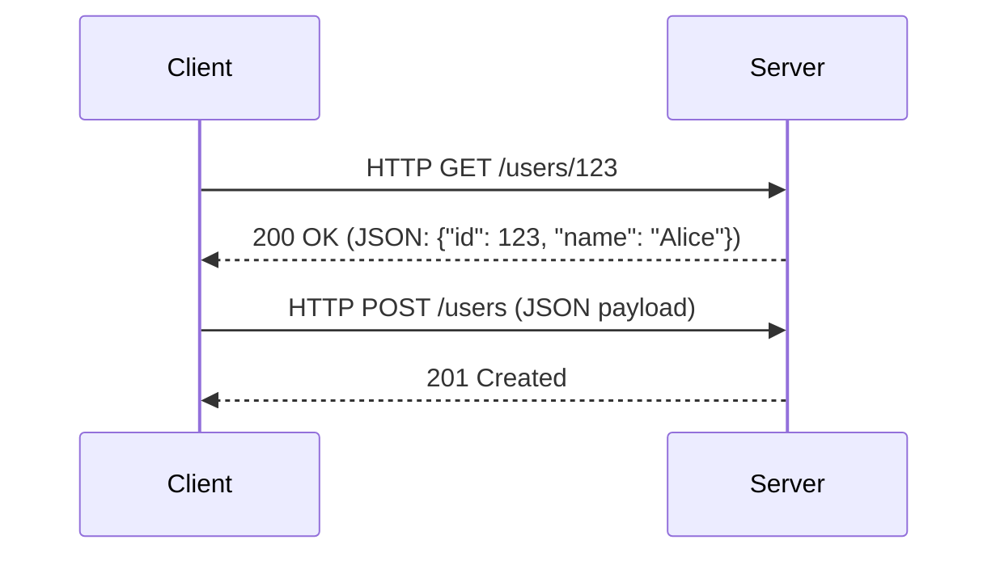
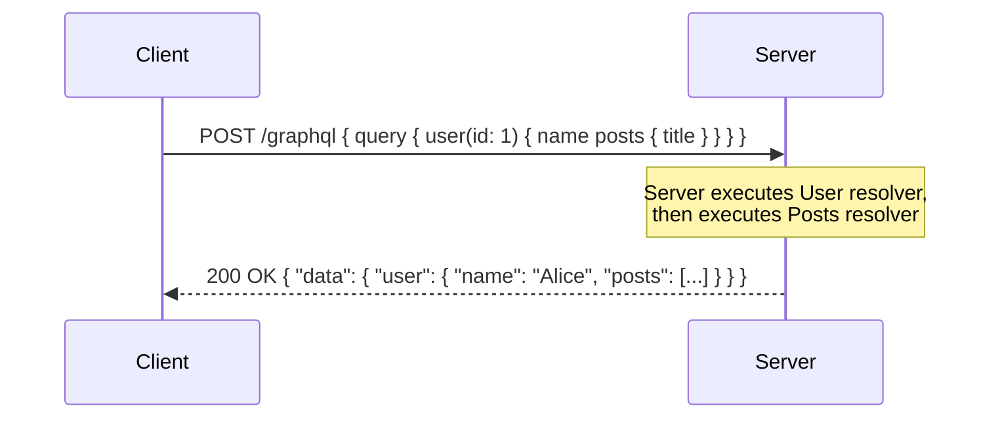
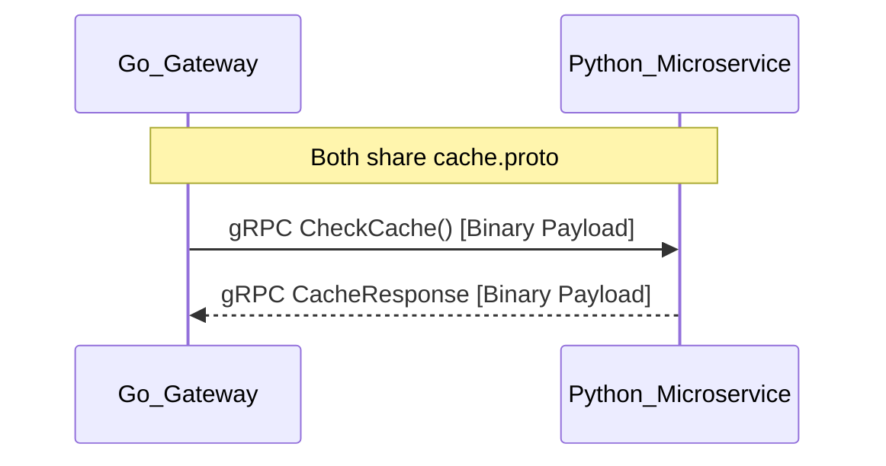
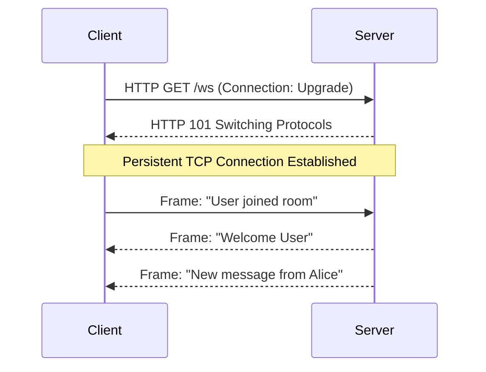

# Module 8 — API Architectures: REST, GraphQL, <abbr title="gRPC Remote Procedure Call - A modern, open-source, high-performance RPC framework that can run in any environment.">gRPC</abbr>, and WebSockets

This is the ultimate engineering guide to the four dominant communication protocols in modern backend systems. 

For each technology, we provide:
1. **Visualizations** (Mermaid sequence diagrams showing the data flow).
2. **5 Concrete Use Cases** implemented in **Python** and **Golang**.
3. **An Interview Prep Guide** highlighting the tradeoffs you must know for system design interviews.

---

## 1. <abbr title="Representational State Transfer - An architectural style for distributed hypermedia systems, commonly used for creating interactive web services.">REST</abbr> (Representational State Transfer)

<abbr title="Representational State Transfer - An architectural style for distributed hypermedia systems, commonly used for creating interactive web services.">REST</abbr> uses standard <abbr title="Hypertext Transfer Protocol - The foundation of data communication for the World Wide Web, operating on a client-server model.">HTTP</abbr> methods (GET, POST, PUT, DELETE) to interact with resources (URLs).

### Data Flow Visualization


### Implementations (Python & Golang)

#### 1. Basic <abbr title="Create, Read, Update, Delete - The four basic functions of persistent storage operations, commonly used in database and <abbr title="Application Programming Interface - A set of rules and protocols that allows different software applications to communicate with each other.">API</abbr> design.">CRUD</abbr> Routing (GET)
**Use Case**: Fetching a specific resource by ID.
* **Python (FastAPI)**:
  ```python
  from fastapi import FastAPI
  app = FastAPI()
  @app.get("/users/{user_id}")
  def get_user(user_id: int): return {"id": user_id, "name": "Alice"}
  ```
* **Golang (net/http)**:
  ```go
  func getHandler(w http.ResponseWriter, r *http.Request) {
      json.NewEncoder(w).Encode(map[string]string{"id": "123", "name": "Alice"})
  }
  ```

#### 2. Payload Serialization (POST)
**Use Case**: Validating and saving incoming <abbr title="JavaScript Object Notation - A lightweight data-interchange format that is easy for humans to read/write and machines to parse/generate.">JSON</abbr> data.
* **Python**: Pydantic models automatically validate incoming <abbr title="JavaScript Object Notation - A lightweight data-interchange format that is easy for humans to read/write and machines to parse/generate.">JSON</abbr>.
  ```python
  from pydantic import BaseModel
  class User(BaseModel): name: str
  @app.post("/users")
  def create(user: User): return {"msg": f"Created {user.name}"}
  ```
* **Golang**: Manual <abbr title="JavaScript Object Notation - A lightweight data-interchange format that is easy for humans to read/write and machines to parse/generate.">JSON</abbr> unmarshaling using struct tags.
  ```go
  type User struct { Name string `json:"name"` }
  func createHandler(w http.ResponseWriter, r *http.Request) {
      var u User
      json.NewDecoder(r.Body).Decode(&u)
      w.Write([]byte("Created " + u.Name))
  }
  ```

#### 3. Request Interception (Middleware)
**Use Case**: Logging all incoming requests before they hit the handler.
* **Python**:
  ```python
  @app.middleware("http")
  async def logger(request, call_next):
      print(f"[{request.method}] {request.url}")
      return await call_next(request)
  ```
* **Golang**:
  ```go
  func logger(next http.Handler) http.Handler {
      return http.HandlerFunc(func(w http.ResponseWriter, r *http.Request) {
          fmt.Printf("[%s] %s\n", r.Method, r.URL.Path)
          next.ServeHTTP(w, r)
      })
  }
  ```

#### 4. Handling Large Datasets (Pagination)
**Use Case**: Fetching records via `?limit=10&offset=20`.
* **Python**:
  ```python
  @app.get("/items")
  def get_items(limit: int = 10, offset: int = 0): return {"limit": limit}
  ```
* **Golang**:
  ```go
  func getItems(w http.ResponseWriter, r *http.Request) {
      limit := r.URL.Query().Get("limit")
      w.Write([]byte("Limit: " + limit))
  }
  ```

#### 5. Semantic Errors (Status Codes)
**Use Case**: Returning a 403 Forbidden.
* **Python**:
  ```python
  from fastapi import HTTPException
  @app.get("/secure")
  def secure(): raise HTTPException(status_code=403, detail="No access")
  ```
* **Golang**:
  ```go
  func secure(w http.ResponseWriter, r *http.Request) {
      http.Error(w, "No access", http.StatusForbidden)
  }
  ```

---

## 2. GraphQL

GraphQL exposes a single endpoint (`/graphql`). The client dictates the exact shape of the response.

### Data Flow Visualization


### Implementations (Python & Golang)

#### 1. Basic Schema & Resolvers
**Use Case**: Defining exactly what fields a client can ask for.
* **Python (Strawberry)**:
  ```python
  import strawberry
  @strawberry.type
  class Query:
      @strawberry.field
      def hello(self) -> str: return "World"
  ```
* **Golang (gqlgen)**:
  ```go
  // schema.graphqls: type Query { hello: String! }
  func (r *queryResolver) Hello(ctx context.Context) (string, error) {
      return "World", nil
  }
  ```

#### 2. Modifying Data (Mutations)
**Use Case**: Creating a user and returning the new ID.
* **Python**:
  ```python
  @strawberry.type
  class Mutation:
      @strawberry.field
      def create_user(self, name: str) -> int: return 123
  ```
* **Golang**:
  ```go
  func (r *mutationResolver) CreateUser(ctx context.Context, name string) (int, error) {
      return 123, nil
  }
  ```

#### 3. Solving the N+1 Problem (Nested Data)
**Use Case**: Only querying the database for a user's "Posts" if the client explicitly asked for them.
* **Python**:
  ```python
  @strawberry.type
  class User:
      name: str
      @strawberry.field
      def posts(self) -> list[str]: return ["Post 1", "Post 2"] # Executed lazily!
  ```
* **Golang**:
  ```go
  func (r *userResolver) Posts(ctx context.Context, obj *model.User) ([]string, error) {
      return []string{"Post 1", "Post 2"}, nil // Executed lazily!
  }
  ```

#### 4. Parameterized Queries
**Use Case**: Passing dynamic variables into a graph query.
* **Python**:
  ```python
  @strawberry.field
  def search(self, prefix: str) -> str: return f"Found {prefix}"
  ```
* **Golang**:
  ```go
  func (r *queryResolver) Search(ctx context.Context, prefix string) (string, error) {
      return "Found " + prefix, nil
  }
  ```

#### 5. Graceful Error Handling
**Use Case**: Returning a 200 OK with a specific error block in the <abbr title="JavaScript Object Notation - A lightweight data-interchange format that is easy for humans to read/write and machines to parse/generate.">JSON</abbr>.
* **Python**:
  ```python
  @strawberry.field
  def secure_data(self) -> str: raise Exception("Unauthorized")
  ```
* **Golang**:
  ```go
  import "github.com/vektah/gqlparser/v2/gqlerror"
  func (r *queryResolver) SecureData(ctx context.Context) (string, error) {
      return "", gqlerror.Errorf("Unauthorized")
  }
  ```

---

## 3. Protocol Buffers & <abbr title="gRPC Remote Procedure Call - A modern, open-source, high-performance <abbr title="Remote Procedure Call - A protocol that allows one program to request a service from a program located in another computer on a network.">RPC</abbr> framework that can run in any environment.">gRPC</abbr>

<abbr title="gRPC Remote Procedure Call - A modern, open-source, high-performance <abbr title="Remote Procedure Call - A protocol that allows one program to request a service from a program located in another computer on a network.">RPC</abbr> framework that can run in any environment.">gRPC</abbr> uses `.proto` files to serialize data into tiny binary payloads sent over <abbr title="Hypertext Transfer Protocol - The foundation of data communication for the World Wide Web, operating on a client-server model.">HTTP</abbr>/2.

### Data Flow Visualization


### Implementations (Python & Golang)
*Assume a `.proto` file exists with `message Ping { string txt = 1; }`*

#### 1. Unary <abbr title="Remote Procedure Call - A protocol that allows one program to request a service from a program located in another computer on a network.">RPC</abbr> (Ping-Pong)
**Use Case**: Standard request-response with binary speed.
* **Python**:
  ```python
  def UnaryCall(self, request, context):
      return pb2.Pong(txt="Echo: " + request.txt)
  ```
* **Golang**:
  ```go
  func (s *server) UnaryCall(ctx context.Context, req *pb.Ping) (*pb.Pong, error) {
      return &pb.Pong{Txt: "Echo: " + req.Txt}, nil
  }
  ```

#### 2. Server Streaming
**Use Case**: Streaming <abbr title="Large Language Model">LLM</abbr> token generation back to the client.
* **Python**:
  ```python
  def ServerStream(self, request, context):
      for i in range(5): yield pb2.Pong(txt=f"Token {i}")
  ```
* **Golang**:
  ```go
  func (s *server) ServerStream(req *pb.Ping, stream pb.Service_ServerStreamServer) error {
      for i := 0; i < 5; i++ { stream.Send(&pb.Pong{Txt: "Token"}) }
      return nil
  }
  ```

#### 3. Client Streaming
**Use Case**: Uploading a large file in binary chunks.
* **Python**:
  ```python
  def ClientStream(self, request_iterator, context):
      count = sum(1 for req in request_iterator)
      return pb2.Pong(txt=f"Received {count} chunks")
  ```
* **Golang**:
  ```go
  func (s *server) ClientStream(stream pb.Service_ClientStreamServer) error {
      count := 0
      for {
          _, err := stream.Recv()
          if err == io.EOF { return stream.SendAndClose(&pb.Pong{Txt: "Done"}) }
          count++
      }
  }
  ```

#### 4. Bidirectional Streaming
**Use Case**: Real-time voice-to-text chat.
* **Python**:
  ```python
  def BiDiStream(self, request_iterator, context):
      for req in request_iterator: yield pb2.Pong(txt=req.txt)
  ```
* **Golang**:
  ```go
  func (s *server) BiDiStream(stream pb.Service_BiDiStreamServer) error {
      for {
          req, err := stream.Recv()
          if err == io.EOF { return nil }
          stream.Send(&pb.Pong{Txt: req.Txt})
      }
  }
  ```

#### 5. Interceptors
**Use Case**: Attaching authentication tokens to <abbr title="gRPC Remote Procedure Call - A modern, open-source, high-performance <abbr title="Remote Procedure Call - A protocol that allows one program to request a service from a program located in another computer on a network.">RPC</abbr> framework that can run in any environment.">gRPC</abbr> headers.
* **Python**: Requires a custom `grpc.ServerInterceptor` class modifying `handler_call_details`.
* **Golang**:
  ```go
  func authInterceptor(ctx context.Context, req interface{}, info *grpc.UnaryServerInfo, handler grpc.UnaryHandler) (interface{}, error) {
      // check context metadata for JWT
      return handler(ctx, req)
  }
  ```

---

## 4. WebSockets

WebSockets upgrade a standard <abbr title="Hypertext Transfer Protocol - The foundation of data communication for the World Wide Web, operating on a client-server model.">HTTP</abbr> connection into a persistent, stateful, full-duplex <abbr title="Transmission Control Protocol - A core protocol of the Internet Protocol Suite that provides reliable, ordered, and error-checked delivery of a stream of bytes.">TCP</abbr> connection. 

### Data Flow Visualization


### Implementations (Python & Golang)

#### 1. Connection Handshake
**Use Case**: Upgrading <abbr title="Hypertext Transfer Protocol - The foundation of data communication for the World Wide Web, operating on a client-server model.">HTTP</abbr> to WS.
* **Python (FastAPI)**:
  ```python
  from fastapi import WebSocket
  @app.websocket("/ws")
  async def websocket_endpoint(websocket: WebSocket):
      await websocket.accept() # Upgrades the connection
  ```
* **Golang (gorilla/websocket)**:
  ```go
  var upgrader = websocket.Upgrader{} // Validates origin
  func wsHandler(w http.ResponseWriter, r *http.Request) {
      conn, _ := upgrader.Upgrade(w, r, nil)
      defer conn.Close()
  }
  ```

#### 2. Send & Receive Loop
**Use Case**: An echo server keeping the connection alive.
* **Python**:
  ```python
  while True:
      data = await websocket.receive_text()
      await websocket.send_text(f"Echo: {data}")
  ```
* **Golang**:
  ```go
  for {
      mt, message, err := conn.ReadMessage()
      if err != nil { break }
      conn.WriteMessage(mt, []byte("Echo: "+string(message)))
  }
  ```

#### 3. Broadcasting (Chat Rooms)
**Use Case**: Sending a message to all connected clients.
* **Python**: Maintain a list of active connections.
  ```python
  active_connections = []
  # Inside connection handler:
  active_connections.append(websocket)
  for connection in active_connections:
      await connection.send_text("New user joined!")
  ```
* **Golang**: Maintain a map and a mutex.
  ```go
  var clients = make(map[*websocket.Conn]bool)
  // Inside connection handler:
  clients[conn] = true
  for client := range clients {
      client.WriteMessage(websocket.TextMessage, []byte("New user joined!"))
  }
  ```

#### 4. Ping/Pong (Heartbeats)
**Use Case**: Detecting disconnected clients who lost internet without closing the <abbr title="Transmission Control Protocol - A core protocol of the Internet Protocol Suite that provides reliable, ordered, and error-checked delivery of a stream of bytes.">TCP</abbr> socket.
* **Python**: Handled natively by Starlette/FastAPI under the hood, but can be manually triggered.
* **Golang**:
  ```go
  conn.SetPingHandler(func(appData string) error {
      return conn.WriteControl(websocket.PongMessage, []byte(appData), time.Now().Add(time.Second))
  })
  ```

#### 5. Closing & Cleanup
**Use Case**: Gracefully handling a client disconnecting.
* **Python**:
  ```python
  from starlette.websockets import WebSocketDisconnect
  try:
      while True: await websocket.receive_text()
  except WebSocketDisconnect:
      active_connections.remove(websocket)
  ```
* **Golang**:
  ```go
  // If ReadMessage returns an error, the loop breaks
  delete(clients, conn)
  conn.Close()
  ```

---

## 5. Interview Prep Guide (System Design)

When asked to design a system, your choice of <abbr title="Application Programming Interface">API</abbr> protocol dictates the entire architecture. Memorize these tradeoffs:

### <abbr title="Representational State Transfer - An architectural style for distributed hypermedia systems, commonly used for creating interactive web services.">REST</abbr>
- **When to use**: Public APIs, simple <abbr title="Create, Read, Update, Delete - The four basic functions of persistent storage operations, commonly used in database and <abbr title="Application Programming Interface - A set of rules and protocols that allows different software applications to communicate with each other.">API</abbr> design.">CRUD</abbr>, high cacheability.
- **Pros**: Every <abbr title="Content Delivery Network - A geographically distributed network of proxy servers and their data centers used to deliver content with low latency.">CDN</abbr> (Cloudflare, Fastly) knows how to cache standard <abbr title="Hypertext Transfer Protocol - The foundation of data communication for the World Wide Web, operating on a client-server model.">HTTP</abbr> GET requests out of the box. Extremely simple to debug.
- **Cons**: Over-fetching (getting 50 fields when you need 2) and Under-fetching (having to make 5 sequential <abbr title="Application Programming Interface">API</abbr> calls to get related data).

### GraphQL
- **When to use**: Complex frontend UIs (React/Next.js) that need highly specific, deeply nested data from multiple microservices.
- **Pros**: Solves over/under-fetching. Strongly typed schema.
- **Cons**: Extremely hard to cache at the <abbr title="Content Delivery Network - A geographically distributed network of proxy servers and their data centers used to deliver content with low latency.">CDN</abbr> level because every request is an `HTTP POST` to `/graphql`. Prone to the N+1 database query problem if resolvers aren't optimized with DataLoaders.

### <abbr title="gRPC Remote Procedure Call - A modern, open-source, high-performance <abbr title="Remote Procedure Call - A protocol that allows one program to request a service from a program located in another computer on a network.">RPC</abbr> framework that can run in any environment.">gRPC</abbr> / Protobuf
- **When to use**: Internal Microservice-to-Microservice communication (e.g., your <abbr title="Application Programming Interface">API</abbr> Gateway talking to an <abbr title="Artificial Intelligence">AI</abbr> inference engine).
- **Pros**: Binary serialization is <abbr title="Central Processing Unit - The primary component of a computer that acts as its 'brain', executing instructions of a computer program.">CPU</abbr>-efficient and network-efficient. <abbr title="Hypertext Transfer Protocol - The foundation of data communication for the World Wide Web, operating on a client-server model.">HTTP</abbr>/2 multiplexing allows thousands of requests over a single <abbr title="Transmission Control Protocol - A core protocol of the Internet Protocol Suite that provides reliable, ordered, and error-checked delivery of a stream of bytes.">TCP</abbr> connection.
- **Cons**: Not easily consumable by web browsers (requires <abbr title="gRPC Remote Procedure Call - A modern, open-source, high-performance <abbr title="Remote Procedure Call - A protocol that allows one program to request a service from a program located in another computer on a network.">RPC</abbr> framework that can run in any environment.">gRPC</abbr>-Web proxy). Hard to debug without specific <abbr title="Command-Line Interface. A text-based user interface used to view and manage computer files.">CLI</abbr> tools like `grpcurl`.

### WebSockets
- **When to use**: Real-time, bidirectional event streams (Chat apps, live stock tickers, multiplayer gaming).
- **Pros**: Extremely low overhead after the initial handshake. Server can push data to the client instantly.
- **Cons**: Highly stateful. Load balancing is difficult because a client must remain pinned to a specific server instance (requires Redis Pub/Sub to scale horizontally across multiple servers).
