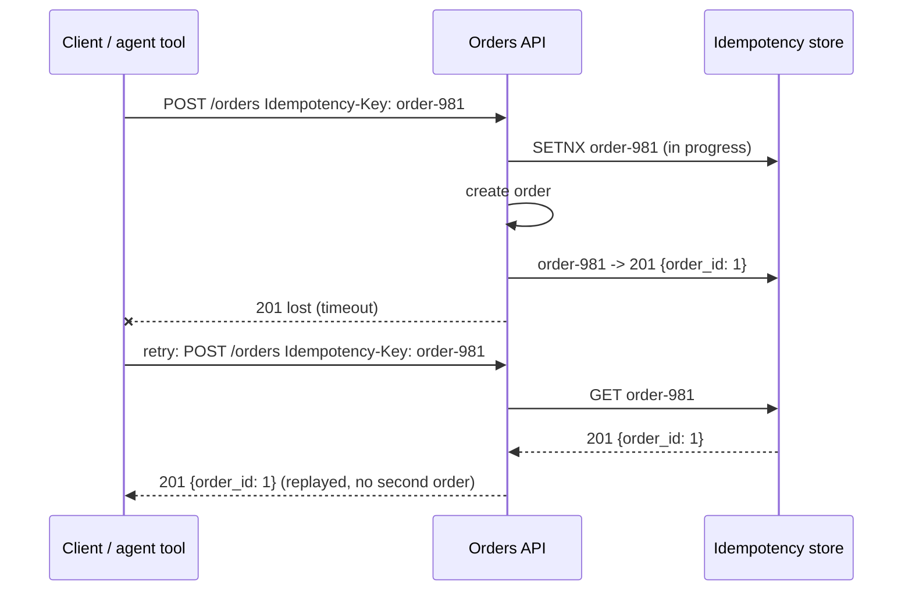
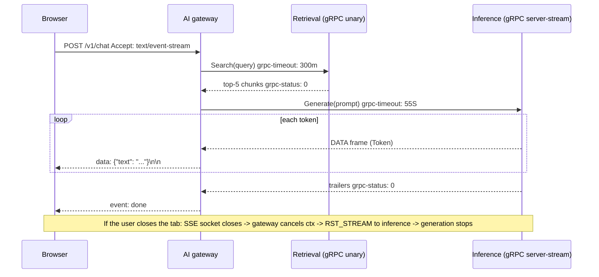
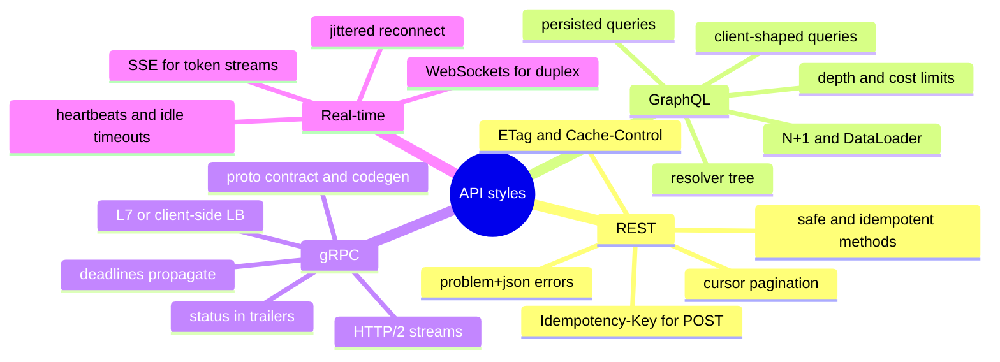

# Module 8 — API Architectures: REST, GraphQL, gRPC, WebSockets & SSE

> Scope: what each API style actually puts on the wire, the HTTP semantics (safe,
> idempotent, cacheable) that decide what a client may retry or a CDN may cache, the
> resolver-execution reason GraphQL has an N+1 problem, the framing that makes gRPC fast
> and hard to load-balance, and why every LLM API streams tokens over Server-Sent Events.
> Protobuf's encoding is covered in depth in Module 6; here it appears only where it
> changes an architecture decision.

---

## 0. The Picture First — read this before the protocols

> 💡 An API style is a **contract about conversation**, not a library. REST says "you name a
> thing, I hand you a representation of it". GraphQL says "you send me the exact shape you
> want, I fill it in". gRPC says "you call my function, typed, over one fast pipe". WebSockets
> and SSE say "stay on the line, I'll keep talking". Pick the conversation first; the
> framework follows.

### 0.1 The running example for this whole module

A chat assistant product, the kind every agentic system ends up behind:

- a **browser UI** that lists conversations, shows a user profile, and streams the model's
  reply token by token,
- a **public API** that customers integrate with,
- an **AI gateway** that talks to an internal **inference service** and a **retrieval
  service** thousands of times a second.

One product, four protocols, each in the place where its trade-offs win:

```arch
%% caption: The running example. The protocol changes at each boundary because the requirements change at each boundary.
group pub "Public edge · browsers and customers" color=slate
node web "Browser UI" at 0,0 in pub icon=browser
node cust "Customer backend" at 2,0 in pub icon=server
node cdn "Edge / CDN" at 1,1 in pub icon=cdn sub="caches GETs, passes streams"
group dc "Internal network" color=blue
node bff "UI backend (BFF)" at 0,2 in dc icon=graphql sub="GraphQL"
node gw "AI gateway" at 1,2 in dc icon=gateway sub="REST in · SSE out"
node inf "Inference service" at 1,3 in dc icon=llm sub="gRPC, server-streaming"
node ret "Retrieval service" at 2,3 in dc icon=search sub="gRPC, unary"
web -> bff : "GraphQL"
web -> cdn : "SSE stream"
cust -> cdn : "REST"
cdn -> gw
bff -> gw : "REST"
gw -> inf : "gRPC stream"
gw:R -> ret:T : "gRPC"
```

| Boundary | Protocol | Why it wins there |
|---|---|---|
| Customer backend → public API | **REST** (JSON over HTTP) | every language has an HTTP client; GETs are cacheable by any CDN; easy to debug with `curl` |
| Browser UI → UI backend | **GraphQL** | one screen needs data from many services; the client asks for exactly those fields in one round trip |
| Gateway → inference/retrieval | **gRPC** | typed contract across Python and Go; binary encoding; HTTP/2 multiplexing; deadlines that propagate |
| Model reply → browser | **SSE** (or WebSockets) | the server pushes tokens as they are generated; SSE is plain HTTP, so proxies and auth just work |

### 0.2 The five styles in one table

| | REST | GraphQL | gRPC | WebSockets | SSE |
|---|---|---|---|---|---|
| Unit of design | resource (URL) | typed graph (schema) | service + method (`.proto`) | message stream | event stream |
| Transport | HTTP/1.1, 2, 3 | HTTP (usually `POST /graphql`) | HTTP/2 (required) | TCP after an HTTP upgrade | long-lived HTTP response |
| Encoding | JSON (usually) | JSON | Protobuf (binary) | anything (text/binary frames) | UTF-8 text |
| Who shapes the response | server | **client** | server | app-defined | server |
| Direction | request → response | request → response (+ subscriptions) | unary, server/client/bidi streaming | full duplex | server → client only |
| HTTP caching | yes, built in | hard (POST) | no | no | no |
| Browser-native | yes | yes | no (needs gRPC-Web proxy) | yes | yes (`EventSource`) |

### 0.3 Picking one in 20 seconds

```arch
%% caption: A first-pass decision. Real systems use several: the question is which style fits each boundary.
node q "Who calls this API?" at 1,0 shape=pill
node d1 "Your own services only?" at 1,1 shape=diamond color=amber
node grpc "gRPC" at 0,2 shape=card icon=grpc sub="typed, binary, streaming, deadlines"
node d2 "Server must push continuously?" at 1,2 shape=diamond color=amber
node d3 "Client also sends a stream?" at 2,3 shape=diamond color=amber
node ws "WebSockets" at 2,4 shape=card icon=websocket sub="chat, collaboration, games"
node sse "SSE" at 1,4 shape=card icon=stream sub="LLM tokens, notifications, progress"
node d4 "Many UI screens, nested data, many services?" at 0,3 shape=diamond color=amber
node gql "GraphQL" at 0,4 shape=card icon=graphql sub="client picks fields"
node rest "REST" at 0,5 shape=card icon=api sub="the default for public APIs"
q -> d1
d1 -> grpc : "yes"
d1 -> d2 : "no"
d2 -> d3 : "yes"
d2 -> d4 : "no"
d3 -> ws : "yes"
d3 -> sse : "no"
d4 -> gql : "yes"
d4:L -> rest:L : "no"
```

---

## 1. Core Intuition & Mechanical Problem Statement

Every API style is a bundle of five independent choices. Most confusion in interviews comes
from treating the bundle as one thing ("gRPC is fast") instead of naming the choice that
actually matters:

1. **Resource model** — do you expose nouns (REST: `/users/42`), a typed graph (GraphQL), or
   verbs (gRPC: `GetUser`)?
2. **Schema/contract** — none (plain JSON), optional (OpenAPI), or mandatory and compiled
   (GraphQL SDL, `.proto`). A mandatory schema buys codegen and breaking-change detection.
3. **Encoding** — text (JSON, ~2-4× larger, human-readable) or binary (Protobuf).
4. **Transport and interaction pattern** — one request/one response, or a stream in either
   or both directions; HTTP/1.1 (one in-flight request per connection) or HTTP/2
   (many multiplexed streams per connection).
5. **Who controls the response shape** — the server (REST, gRPC) or the client (GraphQL).

The engineering consequences follow mechanically from those choices:

- **Caching** needs a stable URL and a safe method → REST `GET` is cacheable by every CDN;
  GraphQL's `POST /graphql` is not, unless you turn queries into GET-able persisted IDs.
- **Retrying** needs idempotency → `GET`/`PUT`/`DELETE` can be retried by any proxy; `POST`
  cannot unless you add an idempotency key. This is the single most important API fact for
  agents, whose tools are API calls that get retried.
- **Load balancing** needs request boundaries the balancer can see → HTTP/1.1 requests
  spread naturally; a gRPC client holds *one* long-lived HTTP/2 connection, so a layer-4
  balancer pins all its traffic to one backend.
- **Streaming** needs a connection that stays open → WebSockets and SSE hold one socket per
  client, which turns a stateless tier into a stateful one.

---

## 2. Algorithmic / Mechanical Foundation

### 2.1 REST and the HTTP semantics underneath it

REST (Fielding, 2000) is an architectural style: resources identified by URLs, manipulated
through a **uniform interface** (the HTTP methods), with **stateless** requests and
**cacheable** responses. In practice "REST API" means JSON over HTTP with resource-shaped
URLs; the parts that matter in production are the HTTP method semantics (RFC 9110):

| Method | Safe (no side effects) | Idempotent (N calls = 1 call) | Cacheable | Typical use |
|---|---|---|---|---|
| `GET` | yes | yes | yes | read a resource |
| `HEAD` | yes | yes | yes | metadata only |
| `PUT` | no | **yes** | no | replace a resource at a known URL |
| `DELETE` | no | **yes** | no | remove (second call: 404 or 204, same end state) |
| `POST` | no | **no** | rarely | create, or "do an action" |
| `PATCH` | no | not guaranteed | no | partial update (idempotent only if the patch is, e.g. "set", not "increment") |

**Idempotency is about end state, not the response.** `DELETE /orders/7` twice may return
`204` then `404`, but the server ends in the same state, so a client, proxy or agent may
retry it safely after a timeout. `POST /orders` twice creates two orders.

```arch
%% caption: Why method semantics matter to anything that retries. A timeout on a GET is harmless to repeat; a timeout on a POST needs an idempotency key or it may run twice.
node call "Tool call timed out" at 0,0 shape=pill color=amber
node q "Safe or idempotent method?" at 0,1 shape=diamond color=amber
node retry "Retry with backoff" at 1,1 shape=card icon=sync sub="GET · PUT · DELETE"
node key "Has Idempotency-Key?" at 0,2 shape=diamond color=amber
node replay "Retry: server replays" at 0,3 shape=card icon=check color=green sub="POST, same key, stored result"
node stop "Don't retry blindly" at 1,2 shape=card icon=warn color=red sub="look up the outcome first"
call -> q
q -> retry : "yes"
q -> key : "no (POST)"
key -> replay : "yes"
key -> stop : "no"
```

#### 🧮 Worked example — making `POST` retry-safe with an idempotency key

The agent calls `create_order` → `POST /orders`. The server commits the order, then the
response is lost (a load balancer idle timeout, a pod restart). The client cannot tell
"never arrived" from "arrived, reply lost":


```mermaid
%% caption: The client generates the key once per logical operation and resends it on every retry. The server stores key -> response.
sequenceDiagram
    participant C as Client / agent tool
    participant S as Orders API
    participant K as Idempotency store
    C->>S: POST /orders  Idempotency-Key: order-981
    S->>K: SETNX order-981 (in progress)
    S->>S: create order #1
    S->>K: order-981 -> 201 {order_id: 1}
    S--xC: 201 lost (timeout)
    C->>S: retry: POST /orders  Idempotency-Key: order-981
    S->>K: GET order-981
    K-->>S: 201 {order_id: 1}
    S-->>C: 201 {order_id: 1}  (replayed, no second order)
```

Details that interviewers probe:

- The **client** generates the key (a UUID per logical operation), not per HTTP attempt.
- The store entry has a **TTL** (Stripe keeps keys 24 h) and records the request hash, so
  the same key with a *different* body is rejected (`422`) instead of silently replayed.
- A request still **in flight** under the same key gets `409 Conflict`, not a second execution.
- There is an IETF draft standardising the `Idempotency-Key` header
  (`draft-ietf-httpapi-idempotency-key-header`); Stripe, PayPal and others already use it.

#### 🧮 Worked example — conditional GET saves the body, not the round trip

```text
GET /items/1                         → 200 OK   ETag: "656c4320287ce195"   body: 27 bytes
GET /items/1
If-None-Match: "656c4320287ce195"    → 304 Not Modified   (no body)
```

The ETag is a fingerprint of the representation (here a truncated SHA-256 of the body).
Revalidation still costs one round trip, but the body is skipped: for a 2 MB JSON list
polled every 10 s, that is the difference between 2 MB and ~200 bytes per poll.
`Cache-Control: max-age=60` goes further and skips the round trip entirely for 60 s.
`private` keeps per-user data out of shared caches (CDNs); `no-store` forbids caching.
The same ETag used on writes (`If-Match`) gives **optimistic concurrency**: `PUT` fails
with `412 Precondition Failed` if someone else changed the resource since you read it.

#### 🧮 Worked example — offset vs cursor pagination

`GET /items?limit=20&offset=100000` makes the database walk and discard 100,000 rows
(`OFFSET` is O(offset + limit)), and if a row is inserted at the front between page 1 and
page 2, the client sees one item twice. A **cursor** encodes "where I stopped":

```sql
-- offset: cost grows with page number, drifts under concurrent inserts
SELECT * FROM items ORDER BY id LIMIT 20 OFFSET 100000;
-- keyset / cursor: an index seek, same cost on page 1 and page 5,000
SELECT * FROM items WHERE id > :last_seen_id ORDER BY id LIMIT 20;
```

The API returns `next_cursor` as an opaque token (base64 of `{"after": 120}`), so you can
change what's inside without breaking clients. The trade-off: no "jump to page 37".

**Errors.** Use the status code for the class (`4xx` client's fault, `5xx` server's) and
a machine-readable body. RFC 9457 "Problem Details" (`application/problem+json`, fields
`type`, `title`, `status`, `detail`, `instance`) is the standard shape. `429 Too Many
Requests` and `503` should carry `Retry-After`.

**Versioning.** URL (`/v1/`), header (`Accept: application/vnd.acme.v2+json`), or date
(Stripe's `Stripe-Version: 2024-06-20`). Additive changes (new optional fields) are
non-breaking only if clients **ignore unknown fields**; removing or renaming a field,
tightening validation, or changing a default is breaking.

#### Five REST mechanics in Python and Go

1 — **Resource routing (GET).**

```python
# Python (FastAPI)
from fastapi import FastAPI, HTTPException
app = FastAPI()
USERS = {123: {"id": 123, "name": "Alice"}}

@app.get("/users/{user_id}")
def get_user(user_id: int):            # path param parsed and validated as int
    if user_id not in USERS:
        raise HTTPException(status_code=404, detail="user not found")
    return USERS[user_id]
```

```go
// Go (net/http, Go 1.22+ pattern routing)
mux := http.NewServeMux()
mux.HandleFunc("GET /users/{id}", func(w http.ResponseWriter, r *http.Request) {
    id := r.PathValue("id")
    w.Header().Set("Content-Type", "application/json")
    json.NewEncoder(w).Encode(map[string]string{"id": id, "name": "Alice"})
})
```

2 — **Validated creation (POST → 201 + Location).**

```python
from pydantic import BaseModel, Field
class NewUser(BaseModel):
    name: str = Field(min_length=1, max_length=100)

@app.post("/users", status_code=201)
def create_user(u: NewUser):           # invalid JSON / missing field -> automatic 422
    uid = max(USERS) + 1
    USERS[uid] = {"id": uid, "name": u.name}
    return USERS[uid]
```

```go
type NewUser struct{ Name string `json:"name"` }
mux.HandleFunc("POST /users", func(w http.ResponseWriter, r *http.Request) {
    var u NewUser
    dec := json.NewDecoder(http.MaxBytesReader(w, r.Body, 1<<20)) // cap body at 1 MiB
    dec.DisallowUnknownFields()
    if err := dec.Decode(&u); err != nil || u.Name == "" {
        http.Error(w, "invalid body", http.StatusBadRequest)       // never ignore Decode's error
        return
    }
    w.Header().Set("Location", "/users/124")
    w.WriteHeader(http.StatusCreated)
})
```

3 — **Middleware (request ID + timing).**

```python
import time, uuid
@app.middleware("http")
async def request_context(request, call_next):
    rid = request.headers.get("X-Request-ID", str(uuid.uuid4()))
    t0 = time.perf_counter()
    response = await call_next(request)
    response.headers["X-Request-ID"] = rid
    print(f"{rid} {request.method} {request.url.path} {response.status_code} "
          f"{(time.perf_counter()-t0)*1000:.1f}ms")
    return response
```

```go
func withTiming(next http.Handler) http.Handler {
    return http.HandlerFunc(func(w http.ResponseWriter, r *http.Request) {
        t0 := time.Now()
        next.ServeHTTP(w, r)
        log.Printf("%s %s %s", r.Method, r.URL.Path, time.Since(t0))
    })
}
// http.ListenAndServe(":8080", withTiming(mux))
```

4 — **Cursor pagination.**

```python
@app.get("/items")
def list_items(limit: int = 20, cursor: str | None = None):
    limit = min(limit, 100)                                   # never trust the client's limit
    after = decode_cursor(cursor) if cursor else 0
    rows = db.fetch("SELECT * FROM items WHERE id > %s ORDER BY id LIMIT %s", after, limit)
    return {"data": rows, "next_cursor": encode_cursor(rows[-1]["id"]) if len(rows) == limit else None}
```

```go
mux.HandleFunc("GET /items", func(w http.ResponseWriter, r *http.Request) {
    limit, err := strconv.Atoi(r.URL.Query().Get("limit"))
    if err != nil || limit <= 0 || limit > 100 { limit = 20 }
    after := decodeCursor(r.URL.Query().Get("cursor"))       // "" -> 0
    rows := store.ItemsAfter(r.Context(), after, limit)
    json.NewEncoder(w).Encode(map[string]any{"data": rows, "next_cursor": nextCursor(rows, limit)})
})
```

5 — **Problem-details errors with Retry-After.**

```python
from fastapi.responses import JSONResponse
def problem(status: int, title: str, detail: str, retry_after: int | None = None):
    headers = {"Retry-After": str(retry_after)} if retry_after else None
    return JSONResponse({"type": "about:blank", "title": title, "status": status, "detail": detail},
                        status_code=status, media_type="application/problem+json", headers=headers)
# return problem(429, "Too Many Requests", "token quota exceeded", retry_after=30)
```

```go
func problem(w http.ResponseWriter, status int, title, detail string) {
    w.Header().Set("Content-Type", "application/problem+json")
    w.WriteHeader(status)
    json.NewEncoder(w).Encode(map[string]any{"type": "about:blank", "title": title,
        "status": status, "detail": detail})
}
// w.Header().Set("Retry-After", "30"); problem(w, 429, "Too Many Requests", "token quota exceeded")
```

---

### 2.2 GraphQL: a query language executed as a resolver tree

GraphQL (Facebook, open-sourced 2015) exposes one endpoint and a **typed schema**. The client
sends a query describing the exact shape it wants; the server answers with exactly that
shape. A request goes through three phases:

```arch
%% caption: A GraphQL request. Validation against the schema happens before any resolver runs; execution walks the query tree field by field.
node req "POST /graphql" at 0,0 shape=pill sub="query + variables"
node parse "Parse" at 1,0 icon=code sub="text -> AST"
node val "Validate" at 2,0 icon=check sub="fields exist? types? depth / cost limits?"
node exec "Execute" at 2,1 icon=graph sub="call one resolver per field, depth first"
node res "Resolvers" at 1,1 icon=function sub="each returns a value or a promise"
node out "JSON response" at 0,1 icon=json sub="data + errors"
req -> parse -> val -> exec
exec -> res : "per field"
res -> out
```

```graphql
type Query  { posts(first: Int = 10): [Post!]! }
type Post   { id: ID!  title: String!  author: User! }
type User   { id: ID!  name: String! }

# The client's query: one round trip, exactly these fields
query { posts(first: 10) { id title author { name } } }
```

#### 🧮 Worked example — the N+1 problem, counted

Resolvers are independent functions: `Query.posts` returns 10 posts, then the executor calls
`Post.author` **once per post**. With a naive resolver that means:

| Resolver | Calls | SQL |
|---|---|---|
| `Query.posts` | 1 | `SELECT * FROM posts LIMIT 10` |
| `Post.author` | 10 | `SELECT * FROM users WHERE id = ?` × 10 |
| **Total** | | **11 queries** (1 + N) |

A **DataLoader** (the pattern, and the library of the same name) fixes it: during one
execution tick each `Post.author` call only *registers* its key and returns a promise; at the
end of the tick the loader issues one `SELECT * FROM users WHERE id IN (2, 3, 1)` with the
**deduplicated** keys and resolves every promise from the result. 11 queries become **2**,
whatever N is. The reference code in §5 prints exactly this (`11` vs `2`). The loader is
created **per request**: a loader shared across requests would leak one user's cached rows
into another user's response.

**Why GraphQL is hard to cache and easy to abuse.** Every query is a `POST` to one URL with a
different body, so CDNs and HTTP caches see nothing cacheable. And the client controls the
work: `{ user { friends { friends { friends { name } } } } }` fans out exponentially. The
standard defences, all applied in the *validate* phase before any resolver runs:

- **Depth limit** (e.g. max 7) and **cost analysis** (each field has a cost, list fields
  multiply by their `first:` argument; reject queries over a budget, rate-limit by cost).
- **Persisted queries**: the client registers queries at build time and sends only a hash
  (`GET /graphql?id=sha256:...&variables=...`). The server runs only known queries, and
  GET-by-hash becomes CDN-cacheable again. Automatic Persisted Queries (APQ) is the
  register-on-first-use variant.
- **Pagination on every list** (Relay-style `first`/`after` cursors).

**Errors are partial.** A GraphQL response is usually HTTP `200` with both `data` and an
`errors` array; a failing field becomes `null` and its error carries a `path`. Monitoring that
only counts HTTP 5xx will miss every GraphQL failure.

#### Five GraphQL mechanics in Python and Go

1 — **Schema and resolver.**

```python
# Python (Strawberry)
import strawberry
@strawberry.type
class User:
    id: strawberry.ID
    name: str

@strawberry.type
class Query:
    @strawberry.field
    def user(self, id: strawberry.ID) -> User | None:
        return User(id=id, name="Alice")

schema = strawberry.Schema(query=Query)
```

```go
// Go (gqlgen): schema.graphqls -> generated interfaces; you write the resolver body
func (r *queryResolver) User(ctx context.Context, id string) (*model.User, error) {
    return r.Users.Get(ctx, id)
}
```

2 — **Mutations with an input type.**

```python
@strawberry.input
class NewUser:
    name: str

@strawberry.type
class Mutation:
    @strawberry.mutation
    def create_user(self, input: NewUser) -> User:
        return User(id=strawberry.ID("124"), name=input.name)

schema = strawberry.Schema(query=Query, mutation=Mutation)
```

```go
func (r *mutationResolver) CreateUser(ctx context.Context, input model.NewUser) (*model.User, error) {
    return r.Users.Create(ctx, input.Name)
}
```

3 — **N+1 fixed with a DataLoader** (the lazy resolver alone does not fix N+1; it only
avoids work when the field isn't requested).

```python
from strawberry.dataloader import DataLoader

async def load_users(ids: list[str]) -> list[User]:
    rows = await db.fetch("SELECT id, name FROM users WHERE id = ANY($1)", ids)  # one query
    by_id = {r["id"]: User(id=r["id"], name=r["name"]) for r in rows}
    return [by_id[i] for i in ids]                  # same order as the keys

@strawberry.type
class Post:
    id: strawberry.ID
    author_id: strawberry.Private[str]
    @strawberry.field
    async def author(self, info: strawberry.Info) -> User:
        return await info.context["user_loader"].load(self.author_id)

# per request: context_getter=lambda: {"user_loader": DataLoader(load_fn=load_users)}
```

```go
// Go: github.com/graph-gophers/dataloader (or vikstrous/dataloadgen), created per request in middleware
func (r *postResolver) Author(ctx context.Context, p *model.Post) (*model.User, error) {
    return loaders.For(ctx).UserByID.Load(ctx, p.AuthorID)
}
```

4 — **Variables (never string-concatenate queries).**

```python
result = schema.execute_sync(
    "query Get($id: ID!) { user(id: $id) { name } }",
    variable_values={"id": "123"},
)
print(result.data)          # {'user': {'name': 'Alice'}}
```

```go
// Client side: the query text is constant, only the variables change
body, _ := json.Marshal(map[string]any{
    "query":     `query Get($id: ID!) { user(id: $id) { name } }`,
    "variables": map[string]any{"id": "123"},
})
http.Post(url, "application/json", bytes.NewReader(body))
```

5 — **Partial errors.**

```python
@strawberry.field
def secret(self) -> str | None:              # nullable, so only this field fails
    raise PermissionError("not allowed")
# -> 200 {"data": {"user": {...}, "secret": null},
#         "errors": [{"message": "not allowed", "path": ["secret"]}]}
```

```go
import "github.com/vektah/gqlparser/v2/gqlerror"
func (r *queryResolver) Secret(ctx context.Context) (*string, error) {
    return nil, gqlerror.Errorf("not allowed")   // becomes an entry in "errors" with a path
}
```

---

### 2.3 gRPC: typed RPC over HTTP/2

gRPC (Google, open-sourced 2015) generates client and server stubs from a `.proto` service
definition and carries Protobuf messages over **HTTP/2**. Module 6 covers the `.proto`
language and the encoding; here is what matters for architecture.

```protobuf
service Inference {
  rpc Embed    (EmbedRequest)       returns (EmbedResponse);        // unary
  rpc Generate (GenerateRequest)    returns (stream Token);         // server streaming
  rpc Upload   (stream Chunk)       returns (UploadResult);         // client streaming
  rpc Chat     (stream ChatMessage) returns (stream ChatMessage);   // bidirectional
}
```

**On the wire.** Each RPC is one HTTP/2 **stream** on a shared connection: a `HEADERS` frame
(`:method POST`, `:path /pkg.Inference/Generate`, `content-type: application/grpc`,
`grpc-timeout: 2S`), then `DATA` frames carrying **length-prefixed messages** (1 byte
"compressed" flag + 4-byte big-endian length + the Protobuf bytes), then a trailing `HEADERS`
frame with `grpc-status` and `grpc-message`. The status lives in **trailers** because a
server stream can fail after sending 500 good messages; HTTP status is almost always `200`.

#### 🧮 Worked example — one message, byte by byte

`User{id: 123, name: "Alice", is_active: true}`:

| Bytes | Meaning |
|---|---|
| `08` | field 1, wire type 0 (varint): `(1 << 3) \| 0` |
| `7b` | 123 |
| `12` | field 2, wire type 2 (length-delimited): `(2 << 3) \| 2` |
| `05 41 6c 69 63 65` | length 5, "Alice" |
| `18 01` | field 3, varint, `true` |

**11 bytes** vs **42 bytes** for compact JSON `{"id":123,"name":"Alice","is_active":true}`.
gRPC then prepends `00 00 00 00 0b` (not compressed, length 11). Field names never travel;
the numbers do, which is why you may rename a field but must never reuse a field number.
The size win matters less than people think once responses are gzip'd; the CPU win
(no text parsing, no string-keyed maps) and the **generated, typed contract** matter more.

**Deadlines propagate.** A client sets a deadline (`grpc-timeout`); a Go server that calls
another service with the same `ctx` passes the *remaining* budget downstream, and every hop
cancels when it expires. Without this, a gateway that gave up after 2 s leaves the inference
service generating tokens nobody will read, a classic source of wasted GPU time.

**Status codes that matter.** `OK`, `CANCELLED`, `DEADLINE_EXCEEDED`, `UNAVAILABLE` (retry
with backoff), `RESOURCE_EXHAUSTED` (quota; back off), `INVALID_ARGUMENT` / `NOT_FOUND` /
`PERMISSION_DENIED` (don't retry), `INTERNAL`. gRPC's built-in retry policy (service config)
retries only the codes you list, with backoff and a retry throttle.

**The load-balancing trap.** HTTP/2 multiplexes every RPC over one long-lived TCP connection.
A layer-4 (TCP) load balancer balances **connections**, so each client sticks to one backend
forever; add three backends and they get no traffic until clients reconnect. Fixes: a
layer-7, HTTP/2-aware proxy (Envoy, NGINX, cloud L7 LBs) that balances per RPC, or
**client-side load balancing** (the client resolves all backend addresses, e.g. a Kubernetes
headless service, and round-robins across sub-connections), or a service mesh. Also set
`MAX_CONNECTION_AGE` on servers so connections recycle.

**Browsers** can't speak raw gRPC (no access to HTTP/2 trailers from `fetch`), so browser
clients use **gRPC-Web** via a proxy (Envoy) or the Connect protocol, or you put a REST/JSON
gateway (grpc-gateway, JSON transcoding) in front.

#### Five gRPC mechanics in Python and Go

*Assume `inference.proto` with `message Ping { string txt = 1; }` / `message Pong { string txt = 1; }`
compiled to `pb2`/`pb2_grpc` (Python) and `pb` (Go).*

1 — **Unary with a deadline.**

```python
# client
with grpc.insecure_channel("inference:50051") as ch:
    stub = pb2_grpc.InferenceStub(ch)
    try:
        pong = stub.Unary(pb2.Ping(txt="hi"), timeout=2.0)      # deadline: 2 s
    except grpc.RpcError as e:
        if e.code() == grpc.StatusCode.DEADLINE_EXCEEDED:
            ...                                                  # degrade, don't hang
```

```go
func (s *server) Unary(ctx context.Context, req *pb.Ping) (*pb.Pong, error) {
    if req.Txt == "" {
        return nil, status.Error(codes.InvalidArgument, "txt required")
    }
    return &pb.Pong{Txt: "echo: " + req.Txt}, nil
}
// client: ctx, cancel := context.WithTimeout(ctx, 2*time.Second); defer cancel()
```

2 — **Server streaming (LLM tokens), stopping when the client leaves.**

```python
def Generate(self, request, context):
    for tok in model.generate(request.txt):
        if not context.is_active():          # client cancelled or deadline passed
            return                           # stop burning GPU
        yield pb2.Pong(txt=tok)
```

```go
func (s *server) Generate(req *pb.Ping, stream pb.Inference_GenerateServer) error {
    for tok := range s.model.Generate(stream.Context(), req.Txt) {
        if err := stream.Send(&pb.Pong{Txt: tok}); err != nil {
            return err                       // client went away
        }
    }
    return nil
}
```

3 — **Client streaming (chunked upload).**

```python
def Upload(self, request_iterator, context):
    total = sum(len(chunk.txt) for chunk in request_iterator)
    return pb2.Pong(txt=f"received {total} bytes")
```

```go
func (s *server) Upload(stream pb.Inference_UploadServer) error {
    total := 0
    for {
        chunk, err := stream.Recv()
        if err == io.EOF {
            return stream.SendAndClose(&pb.Pong{Txt: fmt.Sprintf("received %d bytes", total)})
        }
        if err != nil {
            return err                       // don't spin on a broken stream
        }
        total += len(chunk.Txt)
    }
}
```

4 — **Bidirectional streaming.**

```python
def Chat(self, request_iterator, context):
    for msg in request_iterator:             # read and write interleave freely
        yield pb2.Pong(txt=f"ack {msg.txt}")
```

```go
func (s *server) Chat(stream pb.Inference_ChatServer) error {
    for {
        msg, err := stream.Recv()
        if err == io.EOF { return nil }
        if err != nil { return err }
        if err := stream.Send(&pb.Pong{Txt: "ack " + msg.Txt}); err != nil { return err }
    }
}
```

5 — **Auth interceptor.**

```python
class AuthInterceptor(grpc.ServerInterceptor):
    def intercept_service(self, continuation, handler_call_details):
        md = dict(handler_call_details.invocation_metadata)
        if md.get("authorization") != f"Bearer {TOKEN}":
            def deny(request, context):
                context.abort(grpc.StatusCode.UNAUTHENTICATED, "bad token")
            return grpc.unary_unary_rpc_method_handler(deny)
        return continuation(handler_call_details)

server = grpc.server(futures.ThreadPoolExecutor(max_workers=16), interceptors=[AuthInterceptor()])
```

```go
func authInterceptor(ctx context.Context, req any, info *grpc.UnaryServerInfo,
    handler grpc.UnaryHandler) (any, error) {
    md, _ := metadata.FromIncomingContext(ctx)
    if v := md.Get("authorization"); len(v) == 0 || !validToken(v[0]) {
        return nil, status.Error(codes.Unauthenticated, "bad token")
    }
    return handler(ctx, req)
}
// grpc.NewServer(grpc.UnaryInterceptor(authInterceptor))
```

---

### 2.4 Real-time: WebSockets, Server-Sent Events, long polling

| | Long polling | SSE | WebSockets |
|---|---|---|---|
| Direction | server → client (one event per request) | server → client | both |
| Protocol | plain HTTP, re-requested | one HTTP response that never ends | HTTP `Upgrade`, then its own framing over TCP |
| Payload | anything | UTF-8 text | text or binary frames |
| Reconnect | client loop | **built in** (`EventSource` retries, sends `Last-Event-ID`) | you write it |
| Through proxies / auth | trivially | yes (it is HTTP) | needs upgrade support; auth only at handshake |
| Typical use | legacy fallback | LLM token streams, notifications, progress bars | chat, collaborative editing, games, voice |

**Why LLM APIs stream with SSE.** A model reply is a one-way stream of small text events;
the request (the prompt) is sent once, up front. SSE fits exactly: it is an ordinary HTTP
`POST`/`GET` with `Content-Type: text/event-stream`, so existing auth headers, load
balancers, and logging keep working. OpenAI, Anthropic and most other LLM APIs stream this
way; the client reads lines like:

```text
event: content_block_delta
data: {"type":"content_block_delta","delta":{"type":"text_delta","text":"Hel"}}

event: content_block_delta
data: {"type":"content_block_delta","delta":{"type":"text_delta","text":"lo"}}

```

Each event is `field: value` lines ending with a **blank line**. `id:` lets a reconnecting
client resume with `Last-Event-ID`; `retry:` sets the reconnect delay.

**WebSocket handshake.** The client sends `GET /ws` with `Upgrade: websocket`,
`Connection: Upgrade` and a random `Sec-WebSocket-Key`. The server proves it understood by
returning `101 Switching Protocols` with
`Sec-WebSocket-Accept = base64(SHA-1(key + "258EAFA5-E914-47DA-95CA-C5AB0DC85B11"))`.
For RFC 6455's example key `dGhlIHNhbXBsZSBub25jZQ==` that is `s3pPLMBiTxaQ9kYGzzhZRbK+xOo=`
(computed by §5). After that, the TCP connection carries WebSocket **frames** (opcode:
text, binary, close, ping, pong; client-to-server frames are **masked** with a 4-byte key
so a malicious page can't craft bytes that confuse intermediary caches).

**Scaling stateful connections.** 100k connected clients means 100k open sockets pinned to
specific servers. To send "new message in room 42" you must reach whichever servers hold the
room's sockets, so a pub/sub fan-out layer (Redis Pub/Sub, NATS, Kafka) sits behind the
socket servers. Deploys drop every connection on the drained node, so clients need
reconnect with **jittered** backoff, or 100k clients reconnect in the same second.

```arch
%% caption: Sockets are pinned to servers, so an event for room 42 goes through a pub/sub layer that reaches every server holding a member of that room.
node lb "L7 load balancer" at 1,0 icon=lb sub="sticky upgrade, idle timeout > ping"
group ws "Socket servers (stateful)" color=blue
node s1 "WS server 1" at 0,1 in ws icon=server sub="alice, bob"
node s2 "WS server 2" at 1,1 in ws icon=server sub="carol"
node s3 "WS server 3" at 2,1 in ws icon=server sub="no room-42 members"
node bus "Pub/sub" at 1,2 icon=topic sub="channel room:42"
node api "Message API" at 2,2 icon=api sub="POST /rooms/42/messages"
lb -> s1
lb -> s2
lb -> s3
api -> bus : "publish"
bus:L -> s1:B : "subscribed"
bus -> s2 : "subscribed"
```

#### Five WebSocket mechanics in Python and Go

1 — **Handshake.**

```python
from fastapi import WebSocket, WebSocketDisconnect
@app.websocket("/ws")
async def ws_endpoint(ws: WebSocket):
    await ws.accept()                       # sends 101 Switching Protocols
```

```go
var upgrader = websocket.Upgrader{          // gorilla/websocket
    CheckOrigin: func(r *http.Request) bool { return r.Header.Get("Origin") == "https://app.example.com" },
}
func wsHandler(w http.ResponseWriter, r *http.Request) {
    conn, err := upgrader.Upgrade(w, r, nil)
    if err != nil { return }                // Upgrade already wrote the HTTP error
    defer conn.Close()
}
```

2 — **Receive/send loop.**

```python
    try:
        while True:
            text = await ws.receive_text()
            await ws.send_text(f"echo: {text}")
    except WebSocketDisconnect:
        pass
```

```go
for {
    mt, msg, err := conn.ReadMessage()
    if err != nil { break }
    if err := conn.WriteMessage(mt, append([]byte("echo: "), msg...)); err != nil { break }
}
```

3 — **Broadcast to a room** (single process; across processes add pub/sub).

```python
rooms: dict[str, set[WebSocket]] = {}
async def broadcast(room: str, text: str):
    dead = []
    for ws in rooms.get(room, set()):
        try:
            await ws.send_text(text)
        except Exception:
            dead.append(ws)
    for ws in dead:
        rooms[room].discard(ws)
```

```go
type Hub struct {
    mu      sync.Mutex
    clients map[*websocket.Conn]bool
}
func (h *Hub) Broadcast(msg []byte) {
    h.mu.Lock(); defer h.mu.Unlock()        // gorilla: one concurrent writer per conn
    for c := range h.clients {
        if err := c.WriteMessage(websocket.TextMessage, msg); err != nil {
            c.Close(); delete(h.clients, c)
        }
    }
}
```

4 — **Heartbeats** (detect half-open connections; keep idle LBs from cutting the socket).

```python
import asyncio
async def heartbeat(ws: WebSocket, every: float = 20):
    while True:                              # app-level ping; many servers also send protocol pings
        await asyncio.sleep(every)
        await ws.send_json({"type": "ping"})
```

```go
conn.SetReadDeadline(time.Now().Add(60 * time.Second))
conn.SetPongHandler(func(string) error {     // each pong extends the deadline
    return conn.SetReadDeadline(time.Now().Add(60 * time.Second))
})
go func() {
    for range time.Tick(20 * time.Second) {
        conn.WriteControl(websocket.PingMessage, nil, time.Now().Add(time.Second))
    }
}()
```

5 — **Clean close.**

```python
    except WebSocketDisconnect as e:
        rooms[room].discard(ws)              # always remove, or broadcasts leak memory
        print("closed", e.code)              # 1000 normal, 1001 going away, 1006 abnormal
```

```go
conn.WriteMessage(websocket.CloseMessage,
    websocket.FormatCloseMessage(websocket.CloseNormalClosure, "bye"))
hub.Remove(conn)
conn.Close()
```

**And SSE in both languages** (the one you will actually write for an LLM product):

```python
from fastapi.responses import StreamingResponse
@app.post("/v1/chat")
async def chat(req: ChatRequest):
    async def events():
        i = 0
        async for tok in model.stream(req.prompt):
            yield f"id: {i}\ndata: {json.dumps({'text': tok})}\n\n"
            i += 1
        yield "event: done\ndata: {}\n\n"
    return StreamingResponse(events(), media_type="text/event-stream",
                             headers={"Cache-Control": "no-cache", "X-Accel-Buffering": "no"})
```

```go
func chat(w http.ResponseWriter, r *http.Request) {
    w.Header().Set("Content-Type", "text/event-stream")
    w.Header().Set("Cache-Control", "no-cache")
    flusher := w.(http.Flusher)
    for i, tok := range tokens(r.Context()) { // iter.Seq2[int, string], Go 1.23+
        fmt.Fprintf(w, "id: %d\ndata: %s\n\n", i, mustJSON(tok))
        flusher.Flush()                       // without Flush the client sees nothing until the end
    }
}
```

---

## 3. Low-Level Execution Flow & Data Structures

One user message in the running example, end to end:


```mermaid
%% caption: A streamed chat turn. The browser sees SSE, the gateway fans out over gRPC, and cancellation flows back down the same path.
sequenceDiagram
    participant B as Browser
    participant G as AI gateway
    participant R as Retrieval (gRPC unary)
    participant I as Inference (gRPC server-stream)
    B->>G: POST /v1/chat  Accept: text/event-stream
    G->>R: Search(query)  grpc-timeout: 300m
    R-->>G: top-5 chunks  grpc-status: 0
    G->>I: Generate(prompt)  grpc-timeout: 55S
    loop each token
        I-->>G: DATA frame (Token)
        G-->>B: data: {"text": "..."}\n\n
    end
    I-->>G: trailers grpc-status: 0
    G-->>B: event: done
    Note over B,I: If the user closes the tab: SSE socket closes -> gateway cancels ctx -> RST_STREAM to inference -> generation stops
```

What each layer holds in memory:

| Component | Per-request state | Per-connection state |
|---|---|---|
| REST handler | parsed request, response buffer; nothing after it returns | keep-alive socket (HTTP/1.1: one request at a time on it) |
| GraphQL executor | AST, per-request DataLoader caches, partial result tree, error list | same as REST |
| gRPC channel | one HTTP/2 stream per RPC (stream ID, flow-control window, deadline timer) | one TCP + TLS connection, HPACK header tables, connection flow-control window |
| SSE / WebSocket server | the open socket, a write buffer, the last event ID | the socket *is* the session: memory × connected users |

**HTTP/2 flow control** is per stream and per connection (default initial window 65,535
bytes). A slow consumer of a server stream stops granting window updates and the producer's
`Send` blocks, which is back-pressure for free, and also why one stuck stream can hold
buffers on the server until its deadline fires.

---

## 4. Edge Cases, Failure Modes & Hardware Bottlenecks

- **Retrying a non-idempotent call.** Client libraries, service meshes and agents retry on
  timeout. Any `POST` that has side effects (charge, send, create) needs an idempotency key,
  or a retry becomes a duplicate. Agent tool definitions should say which tools are safe to
  retry.
- **Offset pagination at depth.** `OFFSET 1000000` scans a million rows per page, and
  concurrent inserts shift pages (duplicates/skips). Use keyset cursors.
- **Unbounded list endpoints.** `GET /items` with no max `limit` lets one caller pull the
  table. Cap page size server-side.
- **GraphQL query of death.** Deep or wide nested queries (and aliases repeating an
  expensive field 100 times) are a DoS. Enforce depth/cost limits and timeouts; prefer
  persisted queries for first-party clients.
- **Resolver N+1** stays invisible in tests with 3 rows and melts the database with 3,000.
  Count queries per request in CI.
- **gRPC behind an L4 load balancer.** All RPCs from one client land on one pod. Symptom: new
  pods sit idle after a scale-up. Use L7/client-side balancing and `MAX_CONNECTION_AGE`.
- **gRPC message size.** The default max receive size is **4 MiB** in most implementations;
  a large embedding batch fails with `RESOURCE_EXHAUSTED`. Stream it or raise the limit on
  both sides deliberately.
- **Deadlines not propagated.** Each hop sets its own fixed timeout (or none), so a 2 s user
  timeout leaves 30 s of downstream work running. Pass the context/deadline through.
- **SSE through buffering proxies.** NGINX buffers upstream responses by default, so tokens
  arrive in one lump at the end. Disable buffering (`proxy_buffering off` or the
  `X-Accel-Buffering: no` response header) and compression on that route.
- **Idle timeouts.** Cloud LBs cut idle connections (AWS ALB default: 60 s). A model that
  "thinks" for 90 s before its first token loses the stream. Send periodic SSE comments
  (`: keep-alive\n\n`) or WebSocket pings.
- **HTTP/1.1 connection cap.** Browsers allow ~6 connections per origin over HTTP/1.1; six
  open SSE tabs starve the seventh request. Serve SSE over HTTP/2 (streams are multiplexed).
- **Reconnect storms.** A deploy disconnects 100k WebSockets at once; without jittered
  backoff they all reconnect in the same second and knock over auth and the new pods.
- **Schema drift.** Removing a JSON field, reusing a Protobuf field number, or making a
  GraphQL field non-null breaks deployed clients you don't control. Lint for breaking changes
  in CI (`buf breaking`, GraphQL schema diff, OpenAPI diff).

---

## 5. From-Scratch Reference Code

Standard library only (Python 3.10+). It starts a real HTTP server on a random local port and
exercises it with `urllib`, so you can see the headers and status codes, not a framework's
abstraction of them.

```python
"""
Four API mechanics, built from the standard library only so every byte is
visible: (1) a REST server with ETag / 304 revalidation, cursor pagination
and Idempotency-Key replay; (2) GraphQL-style resolver execution showing the
N+1 problem and the DataLoader fix; (3) protobuf varint + gRPC length-prefix
framing; (4) the WebSocket accept-key handshake and Server-Sent Events framing.
"""
import base64
import hashlib
import json
import struct
import threading
import urllib.error
import urllib.request
from http.server import BaseHTTPRequestHandler, ThreadingHTTPServer

# ---------------------------------------------------------------------------
# 1. REST: conditional GET, cursor pagination, idempotent POST
# ---------------------------------------------------------------------------
ITEMS = [{"id": i, "title": f"doc-{i}"} for i in range(1, 8)]
IDEMPOTENCY: dict = {}          # Idempotency-Key -> (status, body) ; real: Redis w/ TTL
LOCK = threading.Lock()
ORDERS_CREATED = []


def etag_of(body: bytes) -> str:
    return '"' + hashlib.sha256(body).hexdigest()[:16] + '"'


def encode_cursor(last_id: int) -> str:
    return base64.urlsafe_b64encode(json.dumps({"after": last_id}).encode()).decode()


def decode_cursor(cur: str) -> int:
    return json.loads(base64.urlsafe_b64decode(cur.encode()))["after"]


class Api(BaseHTTPRequestHandler):
    def log_message(self, *args):          # keep the demo output quiet
        pass

    def _send(self, status, obj, extra=None):
        body = json.dumps(obj).encode()
        self.send_response(status)
        self.send_header("Content-Type", "application/json")
        for k, v in (extra or {}).items():
            self.send_header(k, v)
        self.send_header("Content-Length", str(len(body)))
        self.end_headers()
        self.wfile.write(body)

    def do_GET(self):
        path, _, query = self.path.partition("?")
        params = dict(p.split("=", 1) for p in query.split("&") if "=" in p)
        if path == "/items/1":
            body = json.dumps(ITEMS[0]).encode()
            tag = etag_of(body)
            if self.headers.get("If-None-Match") == tag:
                self.send_response(304)            # no body: client reuses its copy
                self.send_header("ETag", tag)
                self.end_headers()
                return
            return self._send(200, ITEMS[0], {"ETag": tag, "Cache-Control": "private, max-age=0"})
        if path == "/items":
            limit = min(int(params.get("limit", 3)), 100)       # always cap page size
            after = decode_cursor(params["cursor"]) if "cursor" in params else 0
            page = [it for it in ITEMS if it["id"] > after][:limit]
            nxt = encode_cursor(page[-1]["id"]) if len(page) == limit else None
            return self._send(200, {"data": page, "next_cursor": nxt})
        self._send(404, {"type": "about:blank", "title": "Not Found", "status": 404})

    def do_POST(self):
        key = self.headers.get("Idempotency-Key")
        if not key:
            return self._send(400, {"title": "Idempotency-Key required", "status": 400})
        with LOCK:                                   # real systems: atomic SETNX
            if key in IDEMPOTENCY:
                status, body = IDEMPOTENCY[key]
                return self._send(status, body, {"Idempotent-Replayed": "true"})
            order = {"order_id": len(ORDERS_CREATED) + 1}
            ORDERS_CREATED.append(order)
            IDEMPOTENCY[key] = (201, order)
        self._send(201, order)


def http(method, url, headers=None, data=None):
    req = urllib.request.Request(url, method=method, headers=headers or {}, data=data)
    try:
        with urllib.request.urlopen(req) as r:
            raw = r.read()
            return r.status, dict(r.headers), (json.loads(raw) if raw else None)
    except urllib.error.HTTPError as e:              # urllib raises on 304/4xx
        raw = e.read()
        return e.code, dict(e.headers), (json.loads(raw) if raw else None)


# ---------------------------------------------------------------------------
# 2. GraphQL execution: naive resolvers (N+1) vs a DataLoader
# ---------------------------------------------------------------------------
class FakeDB:
    def __init__(self):
        self.queries = 0
        self.authors = {i: {"id": i, "name": f"author-{i}"} for i in range(1, 4)}
        self.posts = [{"id": p, "author_id": (p % 3) + 1} for p in range(1, 11)]

    def all_posts(self):
        self.queries += 1
        return list(self.posts)

    def author_by_id(self, aid):
        self.queries += 1
        return self.authors[aid]

    def authors_by_ids(self, ids):                   # one "WHERE id IN (...)"
        self.queries += 1
        return [self.authors[i] for i in ids]


class DataLoader:
    """Collects keys during one execution tick, then fetches them in ONE batch.
    Real DataLoaders flush at the end of the event-loop tick; here the executor
    calls dispatch() explicitly after resolving one level of the query."""

    def __init__(self, batch_fn):
        self.batch_fn, self.pending, self.cache = batch_fn, [], {}

    def load(self, key):
        if key not in self.cache and key not in self.pending:
            self.pending.append(key)
        return lambda: self.cache[key]               # a thunk = "promise"

    def dispatch(self):
        if self.pending:
            for k, v in zip(self.pending, self.batch_fn(self.pending)):
                self.cache[k] = v
            self.pending = []


def query_posts_with_authors(db, use_loader):
    """Executes: { posts { id author { name } } }"""
    posts = db.all_posts()                           # level 1: 1 query
    if not use_loader:
        return [{"id": p["id"], "author": db.author_by_id(p["author_id"])["name"]}
                for p in posts]                      # level 2: N queries
    loader = DataLoader(db.authors_by_ids)
    thunks = [(p["id"], loader.load(p["author_id"])) for p in posts]
    loader.dispatch()                                # level 2: 1 batched query
    return [{"id": pid, "author": t()["name"]} for pid, t in thunks]


# ---------------------------------------------------------------------------
# 3. Protobuf varints + gRPC length-prefixed framing
# ---------------------------------------------------------------------------
def varint(n: int) -> bytes:
    out = bytearray()
    while True:
        b = n & 0x7F
        n >>= 7
        out.append(b | (0x80 if n else 0))
        if not n:
            return bytes(out)


def encode_user(uid: int, name: str, active: bool) -> bytes:
    """message User { int32 id = 1; string name = 2; bool is_active = 3; }"""
    nb = name.encode()
    return (varint((1 << 3) | 0) + varint(uid) +          # field 1, wire type 0 (varint)
            varint((2 << 3) | 2) + varint(len(nb)) + nb + # field 2, wire type 2 (len-delimited)
            varint((3 << 3) | 0) + varint(int(active)))   # field 3, wire type 0


def grpc_frame(msg: bytes, compressed=False) -> bytes:
    # 1 byte compressed flag + 4 byte big-endian length, then the message
    return struct.pack(">BI", int(compressed), len(msg)) + msg


# ---------------------------------------------------------------------------
# 4. WebSocket handshake key + SSE framing
# ---------------------------------------------------------------------------
WS_GUID = "258EAFA5-E914-47DA-95CA-C5AB0DC85B11"          # fixed by RFC 6455


def ws_accept(sec_websocket_key: str) -> str:
    return base64.b64encode(hashlib.sha1((sec_websocket_key + WS_GUID).encode()).digest()).decode()


def sse_event(data: str, event=None, event_id=None) -> str:
    lines = []
    if event_id is not None:
        lines.append(f"id: {event_id}")
    if event:
        lines.append(f"event: {event}")
    lines += [f"data: {line}" for line in data.split("\n")]   # multi-line data
    return "\n".join(lines) + "\n\n"                           # blank line ends event


def parse_sse(stream: str):
    for block in stream.strip("\n").split("\n\n"):
        ev = {"event": "message", "data": []}
        for line in block.split("\n"):
            field, _, value = line.partition(": ")
            if field == "data":
                ev["data"].append(value)
            elif field in ("event", "id"):
                ev[field] = value
        ev["data"] = "\n".join(ev["data"])
        yield ev


# ---------------------------------------------------------------------------
# Self-test / demonstration
# ---------------------------------------------------------------------------
if __name__ == "__main__":
    srv = ThreadingHTTPServer(("127.0.0.1", 0), Api)
    threading.Thread(target=srv.serve_forever, daemon=True).start()
    base = f"http://127.0.0.1:{srv.server_address[1]}"

    s, h, body = http("GET", base + "/items/1")
    s2, _, body2 = http("GET", base + "/items/1", {"If-None-Match": h["ETag"]})
    print(f"[REST] GET 200 etag={h['ETag']}  revalidate -> {s2} body={body2}")
    assert (s, s2, body2) == (200, 304, None)

    seen, cursor = [], None
    while True:
        url = base + "/items?limit=3" + (f"&cursor={cursor}" if cursor else "")
        _, _, page = http("GET", url)
        seen += [it["id"] for it in page["data"]]
        cursor = page["next_cursor"]
        if not cursor:
            break
    print(f"[REST] cursor pagination walked ids {seen}")
    assert seen == list(range(1, 8))

    hdr = {"Idempotency-Key": "order-981", "Content-Type": "application/json"}
    a = http("POST", base + "/orders", hdr, b"{}")
    b = http("POST", base + "/orders", hdr, b"{}")         # client retry after a timeout
    print(f"[REST] POST x2 same key -> {a[2]} then {b[2]} replayed={b[1].get('Idempotent-Replayed')}"
          f"  orders actually created={len(ORDERS_CREATED)}")
    assert len(ORDERS_CREATED) == 1 and a[2] == b[2]
    srv.shutdown()

    for use_loader in (False, True):
        db = FakeDB()
        rows = query_posts_with_authors(db, use_loader)
        print(f"[GraphQL] 10 posts, loader={use_loader!s:5} -> {db.queries} DB queries")
    assert rows[0] == {"id": 1, "author": "author-2"}

    msg = encode_user(123, "Alice", True)
    js = json.dumps({"id": 123, "name": "Alice", "is_active": True}, separators=(",", ":"))
    print(f"[gRPC] protobuf={len(msg)}B {msg.hex(' ')} | JSON={len(js)}B | "
          f"framed={grpc_frame(msg).hex(' ')}")
    assert len(msg) == 11 and varint(300) == b"\xac\x02"

    acc = ws_accept("dGhlIHNhbXBsZSBub25jZQ==")        # the RFC 6455 example key
    print(f"[WS] Sec-WebSocket-Accept = {acc}")
    assert acc == "s3pPLMBiTxaQ9kYGzzhZRbK+xOo="

    wire = "".join(sse_event(tok, event_id=i) for i, tok in enumerate(["Hel", "lo", "!"]))
    wire += sse_event("{}", event="done")
    evs = list(parse_sse(wire))
    print(f"[SSE] {len(evs)} events, text={''.join(e['data'] for e in evs if e['event'] == 'message')!r},"
          f" last={evs[-1]['event']}")
    assert "".join(e["data"] for e in evs[:3]) == "Hello!"
    print("all checks passed")
```

Output:

```text
[REST] GET 200 etag="656c4320287ce195"  revalidate -> 304 body=None
[REST] cursor pagination walked ids [1, 2, 3, 4, 5, 6, 7]
[REST] POST x2 same key -> {'order_id': 1} then {'order_id': 1} replayed=true  orders actually created=1
[GraphQL] 10 posts, loader=False -> 11 DB queries
[GraphQL] 10 posts, loader=True  -> 2 DB queries
[gRPC] protobuf=11B 08 7b 12 05 41 6c 69 63 65 18 01 | JSON=42B | framed=00 00 00 00 0b 08 7b 12 05 41 6c 69 63 65 18 01
[WS] Sec-WebSocket-Accept = s3pPLMBiTxaQ9kYGzzhZRbK+xOo=
[SSE] 4 events, text='Hello!', last=done
all checks passed
```

---

## 6. Recap & Self-Check


```mermaid
%% caption: The whole module on one page.
mindmap
  root((API styles))
    REST
      safe and idempotent methods
      ETag and Cache-Control
      cursor pagination
      Idempotency-Key for POST
      problem+json errors
    GraphQL
      client-shaped queries
      resolver tree
      N+1 and DataLoader
      depth and cost limits
      persisted queries
    gRPC
      proto contract and codegen
      HTTP/2 streams
      status in trailers
      deadlines propagate
      L7 or client-side LB
    Real-time
      SSE for token streams
      WebSockets for duplex
      heartbeats and idle timeouts
      jittered reconnect
```

| Idea | Remember it as |
|---|---|
| REST | "nouns + HTTP verbs; the method tells every proxy what's safe to cache or retry" |
| Idempotency key | "the client names the operation once; the server remembers the answer" |
| GraphQL | "the client picks the fields; the server pays for it — so limit cost and batch resolvers" |
| gRPC | "typed functions over one HTTP/2 pipe; balance per RPC, not per connection" |
| SSE | "an HTTP response that never ends — the default for LLM tokens" |
| WebSockets | "a socket per user: stateful, needs pub/sub fan-out and jittered reconnects" |

**Test yourself** — answer out loud first, then open.

<details>
<summary>1. An agent's `create_ticket` tool timed out. Can the harness retry it?</summary>

Only if the call is idempotent. `create_ticket` is a `POST`; a blind retry may create two tickets. Send
an `Idempotency-Key` generated once per logical call and reuse it on every retry, so the server
returns the first result instead of creating a second ticket.

</details>

<details>
<summary>2. Why is `DELETE` idempotent if the second call returns 404?</summary>

Idempotency is about the server's end state, not the response. After one or two deletes the resource
is gone either way.

</details>

<details>
<summary>3. A GraphQL page shows 50 orders with their customer. The DB log shows 51 queries. Explain and fix.</summary>

N+1: `Query.orders` runs once, then `Order.customer` runs once per order. Use a per-request DataLoader
that collects the 50 customer IDs, dedupes them and fetches them with one `WHERE id IN (...)`:
2 queries total.

</details>

<details>
<summary>4. You scaled the inference service from 2 to 6 pods but the 4 new pods get almost no gRPC traffic. Why?</summary>

gRPC clients keep long-lived HTTP/2 connections and multiplex every RPC over them; an L4 load balancer
only balances new connections. Balance per request with an L7 proxy (Envoy) or client-side
round-robin over all pod IPs, and set `MAX_CONNECTION_AGE` so connections recycle.

</details>

<details>
<summary>5. Your chat UI receives the model's whole answer at once, after 20 seconds, even though the backend streams. Name two likely causes.</summary>

A buffering reverse proxy (NGINX `proxy_buffering`, fix with `X-Accel-Buffering: no`) or response
compression buffering the stream; also a server that never flushes (Go without `Flusher.Flush()`).

</details>

<details>
<summary>6. Why is gRPC's status sent in trailers rather than as the HTTP status code?</summary>

The HTTP status goes out with the first headers, before any messages. A server stream can fail after
sending many messages, so the final outcome can only be known at the end, in the trailers.

</details>

<details>
<summary>7. SSE or WebSockets for streaming LLM output to a browser, and why?</summary>

SSE: the traffic is one-way after the prompt, SSE is plain HTTP (auth headers, LBs, logging all work),
and reconnect with `Last-Event-ID` is built in. Pick WebSockets when the client must also stream
(voice audio, live collaborative edits, interrupting mid-generation over the same channel).

</details>

<details>
<summary>8. Why is offset pagination slow at page 5,000, and what breaks when rows are inserted?</summary>

`OFFSET n` makes the DB read and discard n rows, so cost grows with page depth. Inserts at the front
shift every page, so the client sees duplicates or skips. Keyset cursors (`WHERE id > :last`) are an
index seek at any depth and stable under inserts.

</details>

**Build it:** extend the `Api` handler in §5 so that reusing an `Idempotency-Key` with a
**different request body** returns `422` instead of replaying the stored response.

<details>
<summary>One way to do it</summary>

```python
# in do_POST, before the lock
length = int(self.headers.get("Content-Length", 0))
body_hash = hashlib.sha256(self.rfile.read(length)).hexdigest()

# store (status, body, body_hash) and check it on replay
if key in IDEMPOTENCY:
    status, body, stored_hash = IDEMPOTENCY[key]
    if stored_hash != body_hash:
        return self._send(422, {"title": "Idempotency-Key reused with a different body", "status": 422})
    return self._send(status, body, {"Idempotent-Replayed": "true"})
```

</details>

**Next:** Module 9 — once the agent is behind an API, how do you know it is any good, and
what it did on a given request? Evaluation, observability and guardrails.
