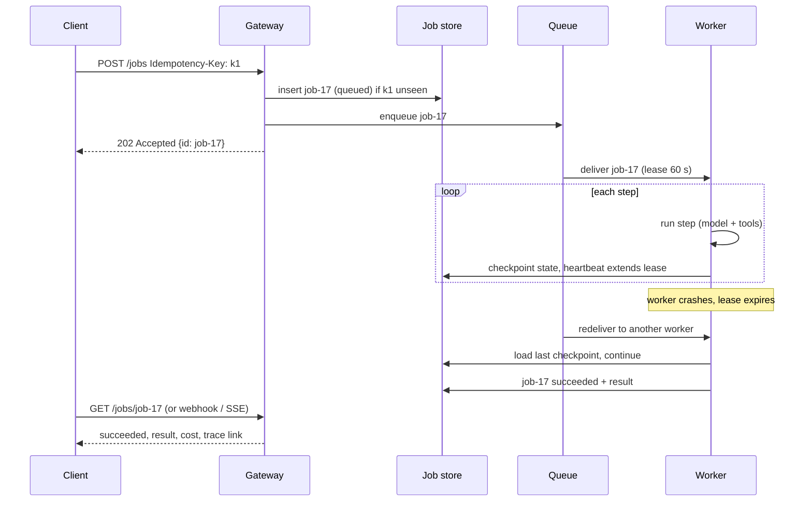
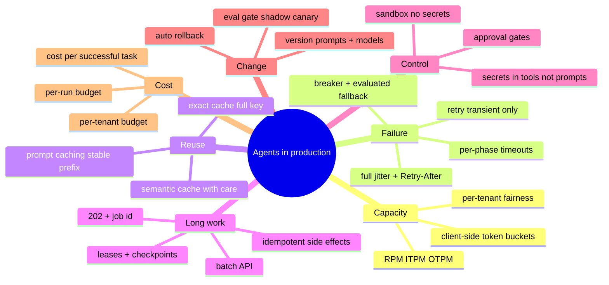

# Module 10 — Deploying Agents in Production

> Scope: the machinery between "the agent passes its evals" and "the agent serves real
> customers": provider rate limits and client-side limiting, retries, timeouts and
> fallbacks, caching, streaming, queues and durable execution for long tasks,
> human-in-the-loop approval, sandboxing tools, secrets, rolling out and rolling back
> prompts and models, and cost control. Module 9's evals are the gate every change passes
> through; its traces are how you watch the result.

---

## 0. The Picture First — read this before the internals

> 💡 A prototype agent is a chef cooking one dinner at home. Production is a restaurant on
> a Saturday night. The supplier only delivers so much per hour (**rate limits**), some
> deliveries fail and must be re-ordered without buying everything twice (**retries and
> idempotency**), popular dishes are pre-made (**caching**), plates go out as they're ready
> (**streaming**), banquets are booked as tickets on a rail rather than cooked while the
> customer stands at the counter (**queues**), the manager signs off on refunds (**human
> in the loop**), knives stay in the kitchen (**sandboxing**), the safe's combination is
> never written on the menu (**secrets**), and a new recipe goes to one table before it
> goes to all of them (**rollout**).

### 0.1 The production shape of an agent

```arch
%% caption: The agent code from Module 2 is the small box in the middle. Everything around it exists because of scale, failure, cost, or risk.
node user "Clients" at 1,0 icon=users sub="chat UI, API customers"
group edge "Agent gateway" color=blue
node gw "Gateway" at 1,1 in edge icon=gateway sub="auth, quotas, budgets"
node cache "Response cache" at 0,1 in edge icon=cache
node reg "Prompt registry" at 2,1 in edge icon=flag sub="versions, canary %"
group run "Execution" color=teal
node agent "Agent runtime" at 1,2 in run icon=agent sub="interactive, streaming"
node q "Job queue" at 0,2 in run icon=queue sub="long tasks"
node wk "Workers" at 0,3 in run icon=worker sub="checkpointed"
node box "Tool sandbox" at 2,2 in run icon=container sub="no secrets, egress allow-list"
node pol "Approval + policy" at 2,3 in run icon=shield sub="human in the loop"
group ext "Providers" color=purple
node llm "Model APIs" at 1,4 in ext icon=llm sub="primary + fallback"
node vault "Secrets manager" at 2,4 in ext icon=secrets
user -> gw
gw -> cache
gw -> reg
gw -> agent
gw -> q
q -> wk
agent -> box
agent -> pol
agent -> llm
wk -> llm
box ..> vault : "tool creds"
```

### 0.2 The running example for this whole module

refund-bot from Module 9, now live. Some numbers to design against (illustrative, but of
the right order):

| Quantity | Value |
|---|---|
| Peak traffic | 30 conversations/s, ≈ 3 model calls each → **90 calls/s** |
| Tokens per call | ≈ 2,500 input (1,800 of it the system prompt + tool schemas), ≈ 150 output |
| Provider limits on our tier | 6,000 requests/min, 12M input tokens/min, 1.2M output tokens/min |
| Latency target | first token < 1.5 s at p95; full answer < 8 s at p95 |
| Long tasks | "process these 40 tickets": 5–20 minutes, touches money |
| Monthly budget | a fixed dollar amount per tenant |

<div class="lab" data-viz="flow-agent-prod"></div>

### 0.3 The production checklist

| Concern | Question it answers | Section |
|---|---|---|
| Rate limits | how many calls can we make, and who gets them when we can't make them all? | §2.1 |
| Retries, timeouts, fallbacks | what happens when a call fails or hangs? | §2.2 |
| Caching | which work can we avoid paying for twice? | §2.3 |
| Streaming | how does the user see progress in under 1.5 s? | §2.4 |
| Queues, durable execution | what about tasks that take 20 minutes, or outlive a deploy? | §2.5 |
| Human in the loop | who signs off before money moves? | §2.6 |
| Sandboxing | what can a tool (or injected code) touch? | §2.7 |
| Secrets | where do credentials live so the model never sees them? | §2.8 |
| Rollout and rollback | how does prompt v8 reach users safely, and leave quickly? | §2.9 |
| Cost control | what stops a loop from spending the month's budget overnight? | §2.10 |

---

## 1. Core Intuition & Mechanical Problem Statement

A deployed agent is a **distributed system with an expensive, rate-limited, slow and
occasionally unavailable dependency at its centre** (the model API), and tools with real
side effects around it. Nothing about that is new; what is new is the combination:

1. **Calls are slow and variable.** Seconds, not milliseconds, with long tails. Timeouts,
   streaming and async processing matter more than in a typical CRUD service.
2. **Capacity is rented and metered.** Provider quotas are per minute in requests *and*
   tokens. You must shape your own traffic to stay under them and decide who waits.
3. **Every call costs money proportional to tokens**, and an agent loop can make many.
   Budgets are a correctness property, not a finance afterthought.
4. **The "code" changes without a deploy.** A prompt edit or a provider's model update
   changes behaviour as much as a code change. Prompts and model versions need the same
   versioning, gating and rollback as binaries.
5. **The agent acts.** Tool calls send email and move money. Retries must not duplicate
   them, dangerous ones need approval, and tool execution must be contained.

The mechanical toolkit is classic reliability engineering (token buckets, backoff with
jitter, circuit breakers, idempotency keys, queues with leases, canaries) applied at the
model and tool boundaries, plus two agent-specific pieces: prompt/model version
management and per-run budgets.

---

## 2. Algorithmic / Mathematical Foundation

### 2.1 Rate limits: the provider's, and your own

Model providers enforce limits per organisation (and often per model or project), usually
several at once:

| Limit | Unit | Typical response when exceeded |
|---|---|---|
| Requests per minute (RPM) | calls | `429 Too Many Requests` |
| Input tokens per minute (ITPM) | prompt tokens | `429` |
| Output tokens per minute (OTPM) | generated tokens (often counted from `max_tokens` up front) | `429` |
| Concurrent requests / daily quota | varies | `429` |
| Provider overload | not your quota: the service is saturated | `529`/`503` "overloaded" |

Responses carry headers with the remaining quota and a `Retry-After` on 429s. Limits are
usually enforced continuously (a token bucket that refills), not as a counter that resets
at the top of the minute, so a burst can hit a 429 even when the per-minute average is
fine.

#### 🧮 Worked example — which limit binds first?

refund-bot at peak: 90 calls/s = **5,400 calls/min**.

| Limit | Our usage at peak | Headroom |
|---|---|---|
| 6,000 RPM | 5,400 | 10% |
| 12M ITPM | 5,400 × 2,500 = 13.5M | **over by 12%** |
| 1.2M OTPM | 5,400 × 150 = 0.81M (but if counted from `max_tokens` = 1,024: 5.5M) | fine, or **4.6× over** |

Input tokens bind first, and `max_tokens` set carelessly high can make the output limit
bind too if the provider reserves it. Fixes, in order: cache the 1,800-token prefix (many
providers don't count, or discount, cached reads against limits and price; check yours),
set `max_tokens` to what answers actually need, request a higher tier, spread load across
regions or providers.

**Client-side limiting.** Don't discover the limit by hammering it. The gateway keeps its
own token buckets slightly below the provider's (one per limit), takes the estimated
tokens before each call, and queues or sheds when empty:

$$\text{level}(t) = \min\left(C,\ \text{level}(t_0) + r\,(t - t_0)\right)$$

with capacity $C$ (the allowed burst) and refill rate $r$. A call needing $n$ tokens
waits $(n - \text{level}) / r$ if the bucket is short.

**Fairness and priority.** When demand exceeds quota someone must wait. Per-tenant
buckets inside the global one stop one noisy customer from starving the rest; priority
classes let interactive chat go ahead of batch jobs (the batch jobs are in a queue
anyway, §2.5). Load shedding with a fast `429` of your own is better than a slow timeout.

### 2.2 Retries, timeouts, circuit breakers and fallbacks

**What to retry.** Retry transient failures: 408, 429, 500, 502, 503, 504, 529, connection
resets, and timeouts. Don't retry 400 (bad request), 401/403 (auth), 404, or content-policy
refusals: they fail the same way again. A 429 comes with `Retry-After`: wait at least that
long.

**Backoff with full jitter** (the AWS Architecture Blog's recommended variant):

$$\text{sleep}_k = \text{random}\big(0,\ \min(\text{cap},\ \text{base} \cdot 2^k)\big)$$

Exponential growth backs off from an overloaded server; the randomness de-synchronises
clients, so 1,000 clients that failed together don't retry together.

**Retry amplification.** Retries multiply load exactly when the dependency is weakest.

#### 🧮 Worked example — three layers, three retries each

Browser SDK → gateway → provider client, each doing up to 3 attempts. One user action can
become 3 × 3 × 3 = **27** provider calls during an outage. Fixes: retry at **one** layer
(usually the one nearest the dependency), cap total attempts, and use a **retry budget**
(retries may add at most ~10% to the request rate; beyond that, fail fast).

**Timeouts are per phase.** A single "60 s timeout" on a streaming call is wrong both ways:

| Timeout | Typical value | Catches |
|---|---|---|
| Connect | 1–5 s | dead endpoints |
| Time to first token | a few seconds, model-dependent | a queued or stuck request |
| Idle between stream chunks | 10–30 s | a stream that silently stalled |
| Total / deadline | from the caller's budget | everything, and propagates downstream (Module 6 §2.5) |

Reasoning models can "think" for a long time before the first visible token; set TTFT
timeouts per model, from measured percentiles.

**Circuit breaker.** After N consecutive failures (or an error rate above X% in a window)
the breaker **opens**: calls to that model fail immediately (or go to the fallback)
without waiting. After a cool-down it goes **half-open** and lets a probe through; success
closes it. This turns "every request waits 30 s and then fails" into "every request falls
back in 1 ms".

**Fallbacks**, in order of preference:

1. The same model in another region or through another provider that hosts it.
2. A different model that passed the same eval gate for this task (often smaller and
   cheaper, sometimes worse).
3. A degraded mode: cached answer, a canned response with a handoff to a human, or "try
   again later". Honest degradation beats a hallucinated answer from an untested fallback.

Fallback models get their own golden-set run (Module 9): a fallback nobody evaluated is a
silent quality regression during every outage.

**Idempotency for tools.** Model calls are safe to retry (at worst you pay twice). Tool
calls with side effects are not. Every side-effecting tool takes an idempotency key
derived from `(run_id, step)` so a retried step replays the stored result (Module 8 §2.1).

### 2.3 Caching

Three different caches, often confused:

| Cache | What is reused | Saves | Risk |
|---|---|---|---|
| **Provider prompt cache** | the model's computed attention state (KV cache, Module 1) for an identical prompt **prefix** | input cost (large discount on cached reads) and time to first token | none for correctness; only works if the prefix is byte-identical |
| **Exact response cache** | the final answer for an identical request (model, prompt version, normalised input, parameters) | the whole call | stale or cross-user answers if the key misses something |
| **Semantic cache** | an answer for a *similar* question (embedding distance < threshold) | the whole call, higher hit rate | wrong answers for questions that are similar but differ in a detail ("refund A100" vs "refund A200") |

**Prompt caching mechanics.** Providers cache the processed prefix of a prompt for a few
minutes (longer TTLs are available on some). Anthropic's API marks cache breakpoints
explicitly (`cache_control`); reads cost about 10% of the normal input price and cache
writes a premium (≈ 1.25× for the 5-minute TTL). OpenAI caches automatically for prompts
over 1,024 tokens, with a discount on cached input that varies by model. Check current
pricing pages; the structure is stable, the numbers move.

The design rule: **put the stable parts first**. System prompt, tool definitions, few-shot
examples, long reference documents; then the conversation; then the new user turn. A
timestamp or request id at the top of the system prompt defeats the cache on every call.

#### 🧮 Worked example — caching refund-bot's prefix

1,800 of the 2,500 input tokens are the same on every call. At an illustrative
$3/M input with cached reads at 10%:

| | Input cost per call |
|---|---|
| No caching | 2,500 × $3/M = $0.0075 |
| Prefix cached | 700 × $3/M + 1,800 × $0.30/M = $0.0021 + $0.00054 = **$0.00264** |
| Saving | ≈ 65% of input cost, and a faster first token |

**Response cache keys** must include everything that changes the answer: model id,
prompt version, tool versions, normalised input, temperature and other parameters, and
the **user or tenant** if the answer depends on their data. Cache only deterministic
requests, set a TTL matched to how fast the underlying data changes, and never cache
answers that came from user-specific tool results under a shared key.

**Concurrent misses.** Ten identical requests that arrive together all miss the cache and
all call the model (§5 shows it: 40 requests, 30 distinct, 0 cache hits, because they were
concurrent). Request coalescing ("single-flight": the first caller computes, the others
await its result) fixes it.

### 2.4 Streaming

Streaming turns an 8-second wait into a 1-second wait plus 7 seconds of reading. The model
API streams server-sent events; the gateway re-streams to the client, usually as SSE
(Module 8 §2.4 covers the protocol and proxy pitfalls).

| Concern | What to do |
|---|---|
| Perceived latency | measure and alert on **TTFT**, not only total time |
| Cancellation | client disconnect → cancel the upstream request, stop paying for tokens |
| Tool calls mid-stream | the model streams tool-call arguments as partial JSON; parse only when the block is complete |
| Output guardrails | screen with a hold-back buffer, or hold high-risk outputs until checked (Module 9 §4) |
| Errors after the first byte | the HTTP status is already 200; send an error event and let the client show a retry |
| Agent progress | stream step events too ("looking up order A100…"), not just the final text |
| Proxies | disable response buffering; send keep-alive comments through idle periods |

### 2.5 Queues and durable execution for long tasks

A task that runs for minutes can't live inside one HTTP request: load balancers time out,
deploys kill the process, the user closes the laptop. The pattern:



The moving parts:

| Part | Why |
|---|---|
| `202 Accepted` + job id | the client isn't holding a connection for 20 minutes |
| Idempotency key on submit | a retried POST doesn't start a second job |
| Lease / visibility timeout + heartbeat | a dead worker's job is redelivered; a live one keeps it |
| Checkpoint after every step | resume from step 13, not step 1 (and don't pay for steps 1–12 again) |
| Idempotent side effects | redelivery is at-least-once; the refund must happen once |
| Dead-letter queue | a job that fails N times stops retrying and waits for a human |
| Progress channel | poll, SSE or webhook, so the user sees "step 13 of 40" |

**Durable execution** engines (Temporal, cloud workflow services, and agent frameworks'
own checkpointers such as LangGraph's) package this: you write the agent loop as ordinary
code, and the engine records each step's result so a replay after a crash skips completed
steps. The rule they impose is the one you'd impose yourself: side effects happen in
recorded activities, never in code that might replay.

**Batch APIs.** For work nobody waits on (nightly classification, eval runs, backfills),
major providers offer batch endpoints at roughly half price, completing within a
window of up to 24 hours. A queue of non-urgent jobs is the natural producer for them.

### 2.6 Human in the loop

Some actions need a person: irreversible (refund, delete, send to a customer), expensive,
or low-confidence. The agent proposes; a human disposes.

```arch
%% caption: An approval gate as job states. While waiting, the job holds no worker and no connection; the approval is a recorded event, not a chat message.
node run "running" at 0,0 shape=circle color=blue w=100
node chk "Needs approval?" at 0,1 shape=diamond color=amber
node wait "awaiting approval" at 1,1 shape=circle color=amber w=110
node rej "rejected / edited" at 2,1 shape=circle color=red w=110
node exec "execute (idempotent)" at 0,2 shape=circle color=blue w=110
node done "succeeded" at 0,3 shape=circle color=green w=100
run -> chk
chk -> wait : "yes"
chk -> exec : "no"
wait:B -> exec:R : "approved"
wait -> rej : "rejected"
rej:T -> run:R : "replan"
exec -> done
```

| Design choice | Guidance |
|---|---|
| What needs approval | decided by **policy in code** (tool, amount, customer tier), not by the model saying "I'm unsure" |
| What the approver sees | the proposed action with its arguments, the evidence (tool results), the agent's reasoning summary, and the cost |
| Approve / edit / reject | edits are valuable: they are labelled training and eval data |
| Timeouts | an approval that never comes must expire into a safe state and notify someone |
| Audit | who approved what, when, on which evidence; immutable |
| Graduation | track approval rates per action type; ones approved 99.9% of the time unchanged are candidates for auto-approval under a threshold |

Frameworks model this as an **interrupt**: the graph stops at a node, persists its state,
and resumes when a human submits input (LangGraph's `interrupt()`, approval hooks in
agent SDKs, MCP's elicitation for asking the user mid-call, Module 7 §2.9).

### 2.7 Sandboxing tools

A tool that runs code, a shell command, a browser, or a file operation runs whatever the
model wrote, and the model may be following injected instructions (Module 9 §2.7).
Assume the tool's input is hostile and contain it.

| Isolation | Boundary | Start time | Use for |
|---|---|---|---|
| Same process | none | 0 | pure functions over validated input only |
| Separate process, dropped privileges | OS user, seccomp | ms | low-risk utilities |
| Container | namespaces + cgroups, **shared kernel** | ~100 ms–1 s | trusted-ish code; a kernel exploit escapes |
| gVisor-style user-space kernel | syscalls intercepted by a user-space kernel | ~100s of ms | untrusted code with moderate overhead |
| MicroVM (Firecracker, Kata) | hardware virtualisation, own kernel | ~100s of ms | untrusted code at scale; what many hosted code-execution products use |
| Separate VM / account | full | seconds–minutes | highest-risk workloads |

Whatever the boundary, the same controls:

- **No secrets inside.** The sandbox gets no API keys or cloud credentials; if a tool
  needs to call an API, a proxy outside the sandbox adds the credential (§2.8).
- **Network egress allow-list**, default deny. Exfiltration and "download and run" need
  the network.
- **Filesystem**: read-only base image, a scratch directory, nothing mounted from the host
  that matters.
- **Resource limits**: CPU, memory, processes, wall-clock time, output size.
- **Ephemeral**: a fresh sandbox per session or per task, destroyed afterwards.
- **Log** every command and its output into the trace.

### 2.8 Secrets

| Rule | Why |
|---|---|
| Credentials never enter the prompt or the context | anything in context can be echoed, logged, or exfiltrated by an injection |
| Tools hold credentials, not the model | the model asks for `lookup_order("A100")`; the tool code attaches the DB password (Module 7's MCP air-gap) |
| Fetch from a secrets manager at runtime, short-lived where possible | rotation without redeploys; a leaked token expires |
| Act **as the user** with delegated, scoped tokens (OAuth) when accessing user data | the agent can't read data the user couldn't; audit shows who |
| Inject credentials at an egress proxy for sandboxed tools | the sandbox never sees the secret it uses |
| Redact secrets and tokens in logs and traces | traces often store tool arguments and results |
| Separate keys per environment and per service | a leaked staging key can't bill production; rate limits and costs are attributable |

### 2.9 Rollout and rollback of prompts and models

**Prompts are code.** A prompt change can break the agent as thoroughly as a code change,
so it gets the same lifecycle: versioned in git or a prompt registry, reviewed, evaluated,
rolled out gradually, and rolled back in one step.

```arch
%% caption: A prompt or model change moves through the same gates as code. Rollback is a pointer change in the registry, not a redeploy.
node edit "Prompt v8 / model change" at 0,0 icon=edit
node ev "Offline eval gate" at 1,0 icon=check sub="golden set, pass^k, cost, p95"
node sh "Shadow" at 2,0 icon=eye sub="real traffic, answers not shown"
node can "Canary 5% → 25%" at 2,1 icon=flag sub="sticky per user"
node mon "Online metrics" at 1,1 icon=metrics sub="errors, judge score, feedback, cost"
node full "100%" at 0,1 shape=pill color=green
node rb "Rollback: registry → v7" at 1,2 shape=pill color=red
edit -> ev -> sh -> can -> mon
mon -> full : "healthy"
mon -> rb : "regressed"
```

| Practice | Detail |
|---|---|
| Version everything that changes behaviour | prompt text, tool schemas, model id, sampling parameters, retrieval config: one release id covering all of them, recorded on every trace span (`app.prompt.version`) |
| Pin model snapshots | use dated model versions, not floating aliases, in production; an alias can change behaviour under you. Track provider deprecation dates and test the successor early |
| Offline gate | Module 9's eval: no hard-fail regressions, pass rate within noise or better, cost and p95 within budget |
| Shadow | run the new version on a copy of real traffic without showing its output; compare with a judge; catches distribution shift the golden set misses |
| Canary | route a small, **sticky** share of users (hash of user id) to the new version, so a conversation doesn't flip between versions mid-way |
| Automatic rollback | if the canary's error rate, guardrail hit rate, judge score, escalation rate or cost per task is worse than stable beyond a threshold, the registry pointer goes back; no human needed at 3 a.m. |
| Conversation compatibility | a conversation started on v7 should usually finish on v7; stored memory and tool state must be readable by both versions |

§5's canary: v8 gets ≈ 8% of 600 users, succeeds 80% vs v7's 92%, and is rolled back
automatically once it has enough samples.

### 2.10 Cost control

Cost is tokens × price × calls, and agents multiply all three.

| Lever | Effect | Watch out for |
|---|---|---|
| **Per-run budget** (max steps, max tokens, max $) | a looping agent stops at a known cost | return a useful partial result, not a crash |
| Per-tenant / per-day budgets | one customer or one bug can't spend the month | alert at 50/80/100% |
| `max_tokens` sized to the task | bounds output cost and the output-token rate limit | truncated answers (`finish_reason = length`): monitor it |
| Model routing / cascade | send easy requests to a small model, escalate hard ones | the router itself must be evaluated |
| Prompt caching | large discount on repeated prefixes | prefix must be byte-stable |
| Context management | summarise or trim history; retrieve instead of pasting everything | lost facts (Module 2 §2.4) |
| Batch API for offline work | roughly half price | latency of hours |
| Fewer, better tool calls | each extra step re-sends the context (Module 2's O(k²)) | |

#### 🧮 Worked example — a runaway loop

A bug makes refund-bot retry a failing lookup forever. Each step re-sends a growing
context: about 4,000 tokens by step 10 and 20,000 by step 50. Without a limit, 1,000
stuck conversations × 50 steps × an average 12,000 tokens ≈ **600M tokens**, ≈ $1,800 at
$3/M, in the time it takes someone to notice. With a per-run cap of 20k tokens, the same
bug costs 1,000 × 20k = 20M tokens (≈ $60) and every run ends with a clean "I couldn't
complete this, a human will follow up". §5's budget stops a loop after 3 steps.

Track **cost per successful task**, by tenant and by prompt version: it is the number
that moves when a change makes the agent cheaper but worse.

---

## 3. Low-Level Execution Flow & Data Structures

One interactive request through the gateway:

```arch
%% caption: The request path. Each step is cheap compared with the model call it protects.
node in "Request" at 0,0 shape=pill sub="tenant, user, deadline"
node auth "Auth + tenant budget" at 0,1 color=blue
node ver "Pick prompt version" at 0,2 color=blue sub="canary hash"
node c "Cache hit?" at 0,3 shape=diamond color=amber
node ret "Return cached" at 1,3 shape=pill color=green
node lim "Rate-limit buckets" at 0,4 color=blue sub="RPM, ITPM, OTPM"
node call "Call model" at 0,5 icon=llm sub="breaker, retry, fallback"
node tools "Tool calls" at 1,5 icon=tool sub="policy, sandbox, idempotency"
node out "Stream + record" at 0,6 shape=pill color=green sub="spans, cost, cache"
in -> auth -> ver -> c
c -> ret : "yes"
c -> lim : "no"
lim -> call
call <-> tools
call -> out
```

| Structure | Where | Contents |
|---|---|---|
| Token buckets | gateway memory, or a shared store (Redis) across replicas | level, capacity, rate, last refill time |
| Circuit breaker | per model/region, per replica or shared | state, failure count, opened-at |
| Response cache | Redis or similar | key → answer, model, prompt version, expiry |
| Prompt registry | database or config service | versions, stable pointer, canary pointer and %, rollback history |
| Job store | database | job id, idempotency key, state, checkpoint, lease owner and expiry, attempts, cost so far |
| Approval records | database | job, proposed action + args, evidence, approver, decision, time |
| Budget counters | per run (memory), per tenant (shared store) | tokens, dollars, steps |

With several gateway replicas, local buckets each allow the full rate; either divide the
limit by the replica count or keep the buckets in a shared store with atomic updates.

---

## 4. Edge Cases, Failure Modes & Hardware Bottlenecks

- **Retry storms.** Every layer retries, jitter is missing, and a provider blip becomes an
  outage you caused. One retrying layer, full jitter, a retry budget.
- **Ignoring `Retry-After`.** Retrying a 429 after 100 ms when the provider said 20 s burns
  quota and can extend the penalty.
- **Local rate limiters across replicas.** Ten replicas each allow 6,000 RPM. Share or
  divide the limit.
- **Timeouts shorter than generation.** A 30 s total timeout on a request that legitimately
  takes 40 s to generate fails every long answer and then retries it. Stream, and use TTFT
  and idle timeouts.
- **Cache keys missing the tenant.** Customer A's order details served to customer B.
- **Cache defeated by a timestamp** at the start of the system prompt.
- **Non-idempotent tools under at-least-once delivery.** Double refunds after a worker
  crash. Idempotency keys from `(job, step)`.
- **Checkpoints that aren't.** State kept in worker memory "until the end" is lost on the
  first deploy. Persist after every step.
- **Approvals that never expire.** Jobs pile up in `awaiting_approval` for weeks, holding
  stale context. Expire and notify.
- **Sandbox with credentials.** An environment variable with a cloud key inside the code
  sandbox turns any injection into account compromise.
- **Floating model aliases.** The provider updates the model behind an alias; quality
  shifts with no deploy on your side. Pin versions.
- **Canary not sticky.** Users flip between versions mid-conversation and see
  inconsistent behaviour; metrics blur.
- **Rollback that needs a deploy.** A 40-minute pipeline to revert a one-line prompt edit.
  Make rollback a registry pointer change.
- **Fallback never evaluated.** During an outage all traffic silently moves to a model
  that fails 30% of the golden set.
- **Cost alerts on monthly totals only.** A loop spends a week's budget overnight before
  the monthly alert fires. Alert on rate of spend.
- **Streaming through buffering proxies.** Tokens arrive in one lump (Module 8 §4).

---

## 5. From-Scratch Reference Code

Standard library only (`asyncio`). A fake provider injects 429s (with `Retry-After`),
529s and slow calls; the gateway rate-limits, retries with full jitter, trips a breaker,
falls back, caches, and enforces a budget. Then a durable job crashes, resumes from its
checkpoint, pauses for approval and refunds exactly once; a canary prompt is rolled back;
and a stream is cancelled.

```python
"""
The production shell around an agent, standard library only (asyncio).

  1. Client-side rate limiting: token buckets for requests/min AND tokens/min.
  2. Retries with capped exponential backoff + full jitter, honouring
     Retry-After, with a per-attempt timeout inside an overall deadline.
  3. A circuit breaker per model and a fallback model.
  4. An exact-match response cache keyed on everything that changes the answer.
  5. A per-run budget (tokens and dollars) that stops a runaway loop.
  6. A durable job queue for long tasks: idempotency keys, per-step
     checkpoints, resume after a crash, and a human-approval pause.
  7. A prompt registry with a canary split and automatic rollback.
  8. Streaming with cancellation.

The provider is a fake with injected 429s, 529s and slow calls, seeded, so
the behaviour is reproducible. Run:  python3 agent_prod.py
"""
import asyncio
import hashlib
import json
import random
import time
from dataclasses import dataclass, field

# ---------------------------------------------------------------------------
# A fake model provider with realistic failure modes
# ---------------------------------------------------------------------------
class ProviderError(Exception):
    def __init__(self, status: int, retry_after: float | None = None):
        super().__init__(f"HTTP {status}")
        self.status, self.retry_after = status, retry_after


RETRYABLE = {408, 429, 500, 502, 503, 504, 529}      # 529 = "overloaded" on some LLM APIs
PRICES = {"big": (3.00, 15.00), "small": (0.25, 1.25)}   # $ / 1M tokens (illustrative)


class FakeProvider:
    def __init__(self, seed: int, fail: dict[str, float]):
        self.rng, self.fail, self.calls = random.Random(seed), fail, 0

    async def complete(self, model: str, prompt: str, max_tokens: int) -> dict:
        self.calls += 1
        r = self.rng.random()
        p = self.fail.get(model, 0.0)
        if r < p * 0.5:
            raise ProviderError(429, retry_after=0.02)
        if r < p:
            raise ProviderError(529)
        if r > 0.97:
            await asyncio.sleep(0.5)                   # a slow outlier
        await asyncio.sleep(0.005)
        return {"text": f"[{model}] answer to: {prompt[:24]}", "in": len(prompt) // 4 + 200,
                "out": min(max_tokens, 60), "model": model}


# ---------------------------------------------------------------------------
# 1. Token buckets: requests/min and tokens/min
# ---------------------------------------------------------------------------
class TokenBucket:
    def __init__(self, capacity: float, per_second: float):
        self.capacity, self.rate = capacity, per_second
        self.level, self.t = capacity, time.monotonic()

    def _refill(self) -> None:
        now = time.monotonic()
        self.level = min(self.capacity, self.level + (now - self.t) * self.rate)
        self.t = now

    async def take(self, n: float) -> float:
        waited = 0.0
        while True:
            self._refill()
            if self.level >= n:
                self.level -= n
                return waited
            need = (n - self.level) / self.rate
            waited += need
            await asyncio.sleep(need)


# ---------------------------------------------------------------------------
# 2 + 3. Retries, deadlines, circuit breaker, fallback
# ---------------------------------------------------------------------------
@dataclass
class Breaker:
    threshold: int = 3
    cooldown: float = 0.2
    failures: int = 0
    opened_at: float | None = None

    def allow(self) -> bool:
        if self.opened_at is None:
            return True
        if time.monotonic() - self.opened_at > self.cooldown:
            return True                                # half-open: let one probe through
        return False

    def record(self, ok: bool) -> None:
        if ok:
            self.failures, self.opened_at = 0, None
        else:
            self.failures += 1
            if self.failures >= self.threshold:
                self.opened_at = time.monotonic()


@dataclass
class Gateway:
    provider: FakeProvider
    rpm: TokenBucket
    tpm: TokenBucket
    breakers: dict = field(default_factory=lambda: {"big": Breaker(), "small": Breaker()})
    cache: dict = field(default_factory=dict)
    stats: dict = field(default_factory=lambda: {"retries": 0, "fallbacks": 0, "cache_hits": 0,
                                                 "breaker_skips": 0, "timeouts": 0})
    rng: random.Random = field(default_factory=lambda: random.Random(1))

    async def _attempt_model(self, model: str, prompt: str, max_tokens: int, deadline: float) -> dict:
        base, cap, attempt = 0.01, 0.2, 0
        while True:
            remaining = deadline - time.monotonic()
            if remaining <= 0:
                raise TimeoutError("deadline exceeded")
            await self.rpm.take(1)
            await self.tpm.take(len(prompt) // 4 + max_tokens)   # reserve the worst case
            try:
                res = await asyncio.wait_for(self.provider.complete(model, prompt, max_tokens),
                                             timeout=min(0.2, remaining))   # per-attempt timeout
                self.breakers[model].record(True)
                return res
            except (ProviderError, asyncio.TimeoutError) as e:
                status = e.status if isinstance(e, ProviderError) else 408
                if isinstance(e, asyncio.TimeoutError):
                    self.stats["timeouts"] += 1
                self.breakers[model].record(False)
                if status not in RETRYABLE or attempt >= 4 or not self.breakers[model].allow():
                    raise
                attempt += 1
                self.stats["retries"] += 1
                backoff = self.rng.uniform(0, min(cap, base * 2 ** attempt))   # full jitter
                wait = max(backoff, getattr(e, "retry_after", None) or 0.0)    # honour Retry-After
                await asyncio.sleep(min(wait, max(0.0, deadline - time.monotonic())))

    async def complete(self, prompt: str, *, prompt_version: str, max_tokens: int = 256,
                       temperature: float = 0.0, timeout: float = 2.0,
                       chain: tuple[str, ...] = ("big", "small")) -> dict:
        key = hashlib.sha256(json.dumps([chain[0], prompt_version, prompt.strip().lower(),
                                         max_tokens, temperature]).encode()).hexdigest()
        if temperature == 0.0 and key in self.cache:      # only cache deterministic requests
            self.stats["cache_hits"] += 1
            return {**self.cache[key], "cached": True}
        deadline = time.monotonic() + timeout
        last: Exception | None = None
        for i, model in enumerate(chain):
            if not self.breakers[model].allow():
                self.stats["breaker_skips"] += 1
                continue
            try:
                res = await self._attempt_model(model, prompt, max_tokens, deadline)
                if i > 0:
                    self.stats["fallbacks"] += 1
                if temperature == 0.0:
                    self.cache[key] = res
                return res
            except (ProviderError, asyncio.TimeoutError, TimeoutError) as e:
                last = e
        raise RuntimeError(f"all models failed: {last}")


# ---------------------------------------------------------------------------
# 5. Budgets
# ---------------------------------------------------------------------------
class BudgetExceeded(Exception):
    pass


@dataclass
class Budget:
    max_tokens: int
    max_usd: float
    tokens: int = 0
    usd: float = 0.0

    def charge(self, res: dict) -> None:
        pin, pout = PRICES[res["model"]]
        self.tokens += res["in"] + res["out"]
        self.usd += (res["in"] * pin + res["out"] * pout) / 1e6
        if self.tokens > self.max_tokens or self.usd > self.max_usd:
            raise BudgetExceeded(f"{self.tokens} tokens, ${self.usd:.4f}")


# ---------------------------------------------------------------------------
# 6. Durable jobs: idempotency, checkpoints, resume, human approval
# ---------------------------------------------------------------------------
@dataclass
class JobStore:
    """Stands in for a database table. Survives a worker 'crash'."""
    jobs: dict = field(default_factory=dict)          # job_id -> record
    by_key: dict = field(default_factory=dict)        # idempotency key -> job_id
    side_effects: list = field(default_factory=list)  # e.g. refunds actually issued

    def submit(self, idem_key: str, steps: list[str]) -> str:
        if idem_key in self.by_key:                   # client retried the POST: same job
            return self.by_key[idem_key]
        job_id = f"job-{len(self.jobs) + 1}"
        self.jobs[job_id] = {"state": "queued", "steps": steps, "done": [], "approved": False}
        self.by_key[idem_key] = job_id
        return job_id


async def run_job(store: JobStore, job_id: str, gw: Gateway, crash_after: int | None = None) -> None:
    job = store.jobs[job_id]
    job["state"] = "running"
    for i, step in enumerate(job["steps"]):
        if step in job["done"]:
            continue                                  # checkpointed: skip on resume
        if step.startswith("refund") and not job["approved"]:
            job["state"] = "awaiting_approval"        # pause; a human resumes it later
            return
        if crash_after is not None and len(job["done"]) == crash_after:
            job["state"] = "running"                  # worker dies mid-job, lease expires
            raise RuntimeError("worker crashed")
        if step.startswith("refund"):
            effect = f"{job_id}:{step}"               # idempotency key for the side effect
            if effect not in store.side_effects:
                store.side_effects.append(effect)
        else:
            await gw.complete(step, prompt_version="v7")
        job["done"].append(step)                      # checkpoint after each step
    job["state"] = "succeeded"


# ---------------------------------------------------------------------------
# 7. Prompt registry, canary and automatic rollback
# ---------------------------------------------------------------------------
@dataclass
class PromptRegistry:
    versions: dict
    stable: str
    canary: str | None = None
    canary_pct: int = 0
    outcomes: dict = field(default_factory=lambda: {})

    def pick(self, user_id: str) -> str:
        bucket = int(hashlib.sha256(user_id.encode()).hexdigest(), 16) % 100   # sticky per user
        return self.canary if self.canary and bucket < self.canary_pct else self.stable

    def record(self, version: str, ok: bool) -> None:
        self.outcomes.setdefault(version, []).append(ok)

    def evaluate_canary(self, min_samples: int = 30, max_drop: float = 0.05) -> str:
        c, s = self.outcomes.get(self.canary, []), self.outcomes.get(self.stable, [])
        if len(c) < min_samples:
            return "wait"
        c_rate, s_rate = sum(c) / len(c), sum(s) / max(1, len(s))
        if c_rate < s_rate - max_drop:
            self.canary, self.canary_pct = None, 0    # rollback = one config change
            return f"rolled back ({c_rate:.0%} vs {s_rate:.0%})"
        return f"promote ({c_rate:.0%} vs {s_rate:.0%})"


# ---------------------------------------------------------------------------
# 8. Streaming with cancellation
# ---------------------------------------------------------------------------
async def stream_tokens(n: int, produced: list):
    for i in range(n):
        await asyncio.sleep(0.002)
        produced.append(i)
        yield f"tok{i} "


# ---------------------------------------------------------------------------
# Self-test / demonstration
# ---------------------------------------------------------------------------
async def main() -> None:
    # 1-3: 40 concurrent requests against a flaky "big" model
    gw = Gateway(FakeProvider(seed=3, fail={"big": 0.25, "small": 0.02}),
                 rpm=TokenBucket(capacity=20, per_second=400), tpm=TokenBucket(capacity=20_000, per_second=200_000))
    t0 = time.monotonic()
    results = await asyncio.gather(*(gw.complete(f"question {i % 30}", prompt_version="v7")
                                     for i in range(40)), return_exceptions=True)
    ok = [r for r in results if isinstance(r, dict)]
    print(f"40 requests in {time.monotonic() - t0:.2f}s: {len(ok)} ok, provider calls={gw.provider.calls}, "
          + ", ".join(f"{k}={v}" for k, v in gw.stats.items()))
    assert len(ok) == 40

    # the breaker: a model that always fails is skipped after 3 failures
    gw2 = Gateway(FakeProvider(seed=5, fail={"big": 1.0, "small": 0.0}),
                  rpm=TokenBucket(100, 1000), tpm=TokenBucket(1e6, 1e6))
    for i in range(5):
        await gw2.complete(f"q{i}", prompt_version="v7")
    print(f"big model down: {gw2.stats['fallbacks']} fallbacks, {gw2.stats['breaker_skips']} calls skipped "
          f"by the open breaker, provider calls={gw2.provider.calls}")
    assert gw2.stats["breaker_skips"] >= 1

    # 4: cache hit on a repeated deterministic request, miss when the prompt version changes
    a = await gw2.complete("What is the refund window?", prompt_version="v7", chain=("small",))
    b = await gw2.complete("what is the refund window?  ", prompt_version="v7", chain=("small",))
    c = await gw2.complete("What is the refund window?", prompt_version="v8", chain=("small",))
    print("cache: repeat ->", b.get("cached", False), "| new prompt version ->", c.get("cached", False))
    assert b.get("cached") and not c.get("cached")

    # 5: a runaway loop is stopped by the per-run budget
    budget, steps = Budget(max_tokens=5_000, max_usd=0.05), 0
    try:
        while True:
            budget.charge(await gw2.complete(f"step {steps} " + "x" * 4000, prompt_version="v7",
                                             chain=("small",), temperature=0.7))
            steps += 1
    except BudgetExceeded as e:
        print(f"budget stopped the loop after {steps} steps ({e})")
    assert steps == 3

    # 6: durable job with idempotent submit, crash + resume, and approval
    store = JobStore()
    j1 = store.submit("client-req-42", ["summarise ticket", "draft reply", "refund order A100"])
    j2 = store.submit("client-req-42", ["summarise ticket", "draft reply", "refund order A100"])
    try:
        await run_job(store, j1, gw2, crash_after=1)
    except RuntimeError as e:
        print(f"{j1}: {e} after {store.jobs[j1]['done']}")
    await run_job(store, j1, gw2)                     # another worker picks it up
    print(f"{j1}: resumed -> {store.jobs[j1]['state']}, done={store.jobs[j1]['done']}")
    store.jobs[j1]["approved"] = True                 # a human clicks Approve
    await run_job(store, j1, gw2)
    await run_job(store, j1, gw2)                     # a duplicate delivery of the same job
    print(f"{j1}: {store.jobs[j1]['state']}; same idempotency key -> same job: {j1 == j2}; "
          f"refunds issued: {store.side_effects}")
    assert j1 == j2 and store.side_effects == ["job-1:refund order A100"]

    # 7: canary a new prompt to 10% of users; it is worse, so it is rolled back
    reg = PromptRegistry({"v7": "...", "v8": "..."}, stable="v7", canary="v8", canary_pct=10)
    rng = random.Random(11)
    users = [f"user-{i}" for i in range(600)]
    for u in users:
        v = reg.pick(u)
        reg.record(v, rng.random() < (0.93 if v == "v7" else 0.80))
    share = sum(reg.pick(u) == "v8" for u in users) / len(users) if reg.canary else None
    print(f"canary share {share:.0%}, sticky: {reg.pick('user-7') == reg.pick('user-7')}; "
          f"decision: {reg.evaluate_canary()}; now serving {reg.pick('user-1')} to everyone")
    assert reg.canary is None

    # 8: the user closes the tab after 5 tokens; generation stops
    produced: list = []
    agen = stream_tokens(500, produced)
    shown = [await agen.__anext__() for _ in range(5)]
    await agen.aclose()                                # cancellation propagates into the generator
    print(f"streamed {len(shown)} tokens, producer stopped at {len(produced)} of 500")
    assert len(produced) == 5

    print("Self-test complete: rate limits, retries with jitter, breaker + fallback, cache, "
          "budget, durable jobs with approval, canary rollback and stream cancellation verified.")


if __name__ == "__main__":
    asyncio.run(main())
```

**Sample output** (the first line varies slightly between runs because concurrent retries
race; the assertions hold every time):

```
40 requests in 0.22s: 40 ok, provider calls=51, retries=7, fallbacks=4, cache_hits=0, breaker_skips=0, timeouts=1
big model down: 5 fallbacks, 4 calls skipped by the open breaker, provider calls=8
cache: repeat -> True | new prompt version -> False
budget stopped the loop after 3 steps (5044 tokens, $0.0015)
job-1: worker crashed after ['summarise ticket']
job-1: resumed -> awaiting_approval, done=['summarise ticket', 'draft reply']
job-1: succeeded; same idempotency key -> same job: True; refunds issued: ['job-1:refund order A100']
canary share 8%, sticky: True; decision: rolled back (80% vs 92%); now serving v7 to everyone
streamed 5 tokens, producer stopped at 5 of 500
Self-test complete: rate limits, retries with jitter, breaker + fallback, cache, budget, durable jobs with approval, canary rollback and stream cancellation verified.
```

What to notice:

- All 40 requests succeed although the primary model fails a quarter of its calls:
  retries absorb most failures and fallbacks the rest.
- 0 cache hits among 40 requests with only 30 distinct questions: concurrent misses.
  Request coalescing would fix it; the sequential repeat later does hit.
- With the primary fully down, the breaker makes later requests skip it instead of
  retrying into it.
- The worker crash loses nothing: the resumed job skips the checkpointed step, and the
  duplicate delivery at the end doesn't refund twice.
- The canary is rolled back by a rule, from numbers, without a deploy.

---

## 6. Recap & Self-Check



| Idea | Remember it as |
|---|---|
| Rate limits | "requests *and* tokens per minute; shape your own traffic below them" |
| Retries | "transient only, one layer, full jitter, honour Retry-After, retry budget" |
| Timeouts | "connect, first token, idle, total: not one number" |
| Breaker | "stop waiting on something that is down" |
| Prompt caching | "stable prefix first; cached reads are cheap and fast" |
| Long tasks | "202, queue, lease, checkpoint, idempotent effects" |
| Human in the loop | "policy decides what needs approval; the approval is an audited event" |
| Sandbox | "assume the tool input is hostile: no secrets, no egress, ephemeral" |
| Rollout | "prompts are code: version, gate, canary, roll back with a pointer" |
| Cost | "budget per run and per tenant; measure cost per successful task" |

**Test yourself** — answer out loud first, then open.

<details>
<summary>1. At peak you make 5,400 calls/min with 2,500 input tokens each against a 12M input-tokens/min limit. What happens and what are your options?</summary>

13.5M ITPM exceeds the limit by ~12%, so you get 429s at peak. Cache the stable prefix
(providers often discount or exclude cached reads), trim the prompt, keep client-side
buckets below the limit with priority for interactive traffic, request a higher tier,
or spread across regions/providers.

</details>

<details>
<summary>2. Why full jitter rather than plain exponential backoff?</summary>

Clients that failed at the same moment would otherwise retry at the same moments (1 s, 2 s,
4 s…) and hit the recovering service in synchronised waves. A random wait in
[0, min(cap, base·2^k)] spreads them out.

</details>

<details>
<summary>3. Browser, gateway and provider client each retry 3 times. What is the worst-case amplification and the fix?</summary>

3 × 3 × 3 = 27 calls per user action. Retry at one layer (nearest the dependency), cap
attempts, and enforce a retry budget so retries can't exceed ~10% of traffic.

</details>

<details>
<summary>4. Your prompt-cache hit rate is near zero although the system prompt never changes. Likely cause?</summary>

Something variable precedes it or is inside it: a timestamp, request id or user name at
the top, tool definitions in a non-deterministic order, or a different model/parameters.
Caches match on an identical prefix; move all variable content after the stable part.

</details>

<details>
<summary>5. A 20-minute agent task sometimes refunds a customer twice. Where is the bug likely to be?</summary>

At-least-once delivery without idempotent side effects: a worker crashed or its lease
expired after the refund but before the checkpoint, and the job was redelivered. Give the
refund an idempotency key derived from (job, step) and checkpoint after each step.

</details>

<details>
<summary>6. What must never be inside a code-execution sandbox, and how does a tool in it call an authenticated API?</summary>

Credentials (API keys, cloud credentials, tokens). The call goes through an egress proxy
outside the sandbox that allow-lists the destination and attaches the credential, so the
sandboxed code never sees it.

</details>

<details>
<summary>7. How do you roll out a new system prompt safely, and how fast can you roll it back?</summary>

Version it with the model and tool config as one release; pass the offline eval gate;
optionally shadow; canary to a small sticky share of users with automatic comparison of
error rate, judge score, escalation and cost per task. Rollback is changing the registry's
stable pointer: seconds, no deploy.

</details>

<details>
<summary>8. Why pin a dated model snapshot rather than a "latest" alias in production?</summary>

The alias can be moved to a new model by the provider, changing behaviour without any
change on your side, and without your eval gate. Pin the snapshot, and move to the
successor through the same rollout process before the old one is deprecated.

</details>

<details>
<summary>9. What single control turns "a loop spent $2,000 overnight" into "a loop spent $60"?</summary>

A per-run budget (max steps/tokens/dollars) enforced in the harness, with a clean partial
result when it trips. Add per-tenant daily budgets and spend-rate alerts on top.

</details>

**Build it:** add **request coalescing** to the gateway in §5, so concurrent identical
cacheable requests share one provider call.

<details>
<summary>One way to do it</summary>

```python
# in Gateway: inflight: dict = field(default_factory=dict)   # key -> asyncio.Future

# in complete(), right after the cache check:
if temperature == 0.0:
    if key in self.inflight:
        self.stats["coalesced"] = self.stats.get("coalesced", 0) + 1
        return {**(await self.inflight[key]), "coalesced": True}
    fut = asyncio.get_running_loop().create_future()
    self.inflight[key] = fut
try:
    res = ...                         # the existing model-chain loop
    if temperature == 0.0:
        fut.set_result(res)
    return res
except Exception as e:
    if temperature == 0.0:
        fut.set_exception(e)
    raise
finally:
    self.inflight.pop(key, None)
```

Re-run the 40-request test: 30 provider-bound requests instead of 40, and 10 coalesced.

</details>

**Projects:** `projects/05_secure_ai_gateway/` (a Go gateway with a semantic cache over
gRPC) is the place to add rate limiting, breakers and budgets for real.

**Back to the start:** Module 1 explained why every one of these calls is slow and
priced by the token.
