# Chapter 03: Continuous Integration (CI)

## 🎯 Learning Objectives

By the end of this chapter, you will:
- Deeply understand CI principles and practices
- Know how CI servers and runners work internally
- Write CI configurations for multiple platforms
- Understand build triggers, caching, and parallelization
- Implement automated code quality checks
- Know how to diagnose and fix broken builds

---

## 📖 Introduction

### The Assembly Line Analogy 🏭

Imagine a car factory where each worker adds one part, then the car is immediately tested:
- Worker adds an engine → **Test:** Does it start? ✅
- Worker adds brakes → **Test:** Do they stop the car? ✅
- Worker adds electronics → **Test:** Do lights work? ✅

If a test fails, the line **stops immediately**. The problem is found and fixed before more parts are added.

**This is Continuous Integration.** Every developer adds code (a "part"), and immediately the entire application is built and tested. If anything breaks, the team knows within minutes — not weeks.

---

## 🔑 Key Terminology

| Term | Definition |
|------|-----------|
| **CI Server** | Software that orchestrates builds and tests automatically (Jenkins, GitHub Actions, GitLab CI) |
| **Runner / Agent** | A machine (physical, VM, or container) that actually executes pipeline jobs |
| **Build** | The process of compiling source code into a runnable form |
| **Build Trigger** | An event that starts a CI pipeline (push, PR, schedule, webhook) |
| **Build Matrix** | Running the same build across multiple configurations (OS, language versions) |
| **Pipeline** | The complete sequence of stages in CI (checkout → build → test → report) |
| **Job** | A single unit of work in a pipeline (runs on one runner) |
| **Step** | An individual command or action within a job |
| **Workspace** | The directory on the runner where code is checked out and built |
| **Cache** | Stored dependencies or build outputs reused between pipeline runs for speed |
| **Artifact** | A file produced by a build (binary, report, Docker image) |
| **Green Build** | All stages passed — code is healthy ✅ |
| **Red Build / Broken Build** | One or more stages failed — immediate attention needed ❌ |
| **Flaky Test** | A test that sometimes passes and sometimes fails without code changes |
| **Build Queue** | Waiting list when more builds are requested than runners available |
| **Webhook** | An HTTP callback that notifies the CI server about events (push, PR) |
| **YAML** | "YAML Ain't Markup Language" — the config format used by most CI tools |

---

## 🏗️ How CI Servers Work

### Architecture Overview

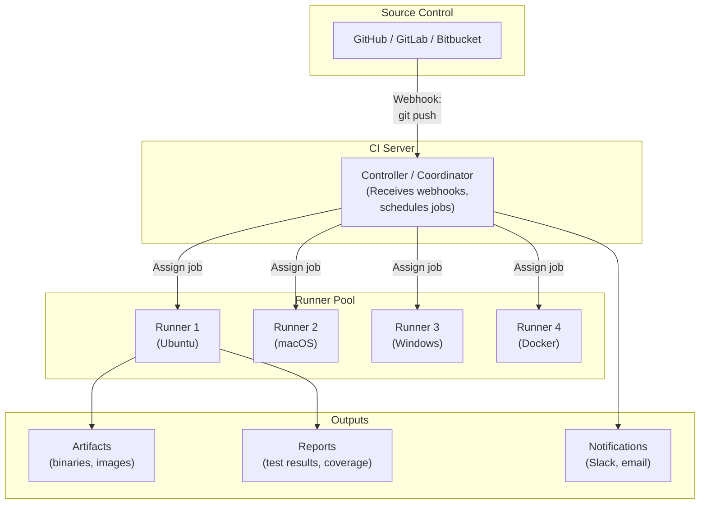

### The CI Pipeline Lifecycle

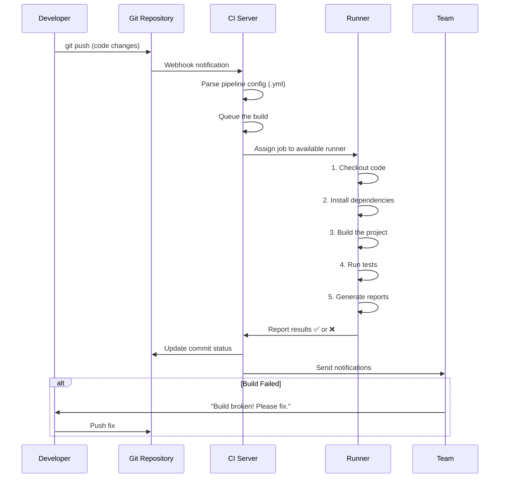

### Hosted vs Self-Hosted Runners

| Aspect | Hosted (Cloud) Runners | Self-Hosted Runners |
|--------|----------------------|-------------------|
| **Setup** | Zero — provided by the CI service | You install and maintain them |
| **Cost** | Pay per minute (free tier usually available) | Your own infrastructure costs |
| **Maintenance** | Managed by the provider | You handle updates, security |
| **Customization** | Limited to available images | Full control over environment |
| **Speed** | Clean environment each time (cold start) | Persistent environment (warm cache) |
| **Security** | Code runs on shared infrastructure | Code stays on your infrastructure |
| **Example** | GitHub-hosted runners | Jenkins agent on your server |
| **Best For** | Open source, small teams | Enterprise, special requirements |

---

## 📝 CI Configuration Deep Dive

### GitHub Actions

```yaml
# .github/workflows/ci.yml
name: CI Pipeline

# ===== TRIGGERS =====
on:
  push:
    branches: [main, develop]      # Run on push to these branches
    paths-ignore:                   # DON'T run for these file changes
      - '**.md'                     # Skip for documentation changes
      - '.gitignore'
  pull_request:
    branches: [main]               # Run on PRs targeting main
  schedule:
    - cron: '0 6 * * 1'           # Also run every Monday at 6 AM UTC
  workflow_dispatch:                # Allow manual triggers

# ===== ENVIRONMENT VARIABLES =====
env:
  NODE_VERSION: '20'
  CI: true

# ===== JOBS =====
jobs:
  # ----- Job 1: Lint -----
  lint:
    name: 🔍 Code Quality
    runs-on: ubuntu-latest
    steps:
      - name: Checkout code
        uses: actions/checkout@v4

      - name: Setup Node.js
        uses: actions/setup-node@v4
        with:
          node-version: ${{ env.NODE_VERSION }}
          cache: 'npm'              # Cache npm dependencies

      - name: Install dependencies
        run: npm ci                 # ci = clean install (faster, exact)

      - name: Run ESLint
        run: npm run lint

      - name: Check formatting
        run: npm run format:check

  # ----- Job 2: Test -----
  test:
    name: 🧪 Tests
    needs: lint                     # Wait for lint to pass
    runs-on: ubuntu-latest
    strategy:
      matrix:                       # Build matrix!
        node-version: [18, 20, 22]
      fail-fast: false              # Don't cancel others if one fails
    
    steps:
      - uses: actions/checkout@v4

      - name: Setup Node.js ${{ matrix.node-version }}
        uses: actions/setup-node@v4
        with:
          node-version: ${{ matrix.node-version }}
          cache: 'npm'

      - run: npm ci

      - name: Run unit tests
        run: npm test -- --coverage --ci

      - name: Upload coverage
        if: matrix.node-version == 20
        uses: actions/upload-artifact@v4
        with:
          name: coverage-report
          path: coverage/
          retention-days: 30

  # ----- Job 3: Build -----
  build:
    name: 🔨 Build
    needs: test
    runs-on: ubuntu-latest
    steps:
      - uses: actions/checkout@v4
      - uses: actions/setup-node@v4
        with:
          node-version: ${{ env.NODE_VERSION }}
          cache: 'npm'
      - run: npm ci
      - run: npm run build
      
      - name: Upload build artifact
        uses: actions/upload-artifact@v4
        with:
          name: build-output
          path: dist/

  # ----- Job 4: Security -----
  security:
    name: 🔒 Security Scan
    runs-on: ubuntu-latest
    steps:
      - uses: actions/checkout@v4
      - run: npm audit --audit-level=high
```

**Key concepts illustrated:**
- **Triggers:** push, PR, schedule, manual
- **Caching:** `cache: 'npm'` reuses `node_modules`
- **Matrix builds:** tests on Node 18, 20, and 22
- **Job dependencies:** `needs: lint` creates ordering
- **Artifacts:** test coverage uploaded for later review
- **Path filtering:** skip CI for documentation-only changes

### GitLab CI

```yaml
# .gitlab-ci.yml
stages:
  - lint
  - test
  - build
  - deploy

variables:
  NODE_VERSION: "20"

# Template for Node setup (DRY - Don't Repeat Yourself)
.node-setup: &node-setup
  image: node:${NODE_VERSION}
  cache:
    key: ${CI_COMMIT_REF_SLUG}
    paths:
      - node_modules/
  before_script:
    - npm ci

lint:
  <<: *node-setup
  stage: lint
  script:
    - npm run lint
    - npm run format:check

unit-tests:
  <<: *node-setup
  stage: test
  script:
    - npm test -- --coverage
  coverage: '/Lines\s*:\s*(\d+\.?\d*)%/'
  artifacts:
    reports:
      coverage_report:
        coverage_format: cobertura
        path: coverage/cobertura-coverage.xml
    expire_in: 30 days

build:
  <<: *node-setup
  stage: build
  script:
    - npm run build
  artifacts:
    paths:
      - dist/
    expire_in: 7 days
  only:
    - main
    - tags
```

### Jenkins (Jenkinsfile)

```groovy
// Jenkinsfile (Declarative Pipeline)
pipeline {
    agent any

    environment {
        NODE_VERSION = '20'
        CI = 'true'
    }

    stages {
        stage('Checkout') {
            steps {
                checkout scm
            }
        }

        stage('Install') {
            steps {
                sh 'npm ci'
            }
        }

        stage('Lint') {
            steps {
                sh 'npm run lint'
            }
        }

        stage('Test') {
            parallel {
                stage('Unit Tests') {
                    steps {
                        sh 'npm test -- --coverage'
                    }
                    post {
                        always {
                            junit 'reports/junit.xml'
                            publishHTML([
                                reportDir: 'coverage/lcov-report',
                                reportFiles: 'index.html',
                                reportName: 'Coverage Report'
                            ])
                        }
                    }
                }
                stage('Integration Tests') {
                    steps {
                        sh 'npm run test:integration'
                    }
                }
            }
        }

        stage('Build') {
            steps {
                sh 'npm run build'
                archiveArtifacts artifacts: 'dist/**', fingerprint: true
            }
        }
    }

    post {
        failure {
            slackSend(
                channel: '#dev-alerts',
                color: 'danger',
                message: "Build FAILED: ${env.JOB_NAME} #${env.BUILD_NUMBER}"
            )
        }
        success {
            slackSend(
                channel: '#dev-alerts',
                color: 'good',
                message: "Build PASSED: ${env.JOB_NAME} #${env.BUILD_NUMBER}"
            )
        }
    }
}
```

---

## ⚡ CI Best Practices In Depth

### 1. Keep the Build Fast

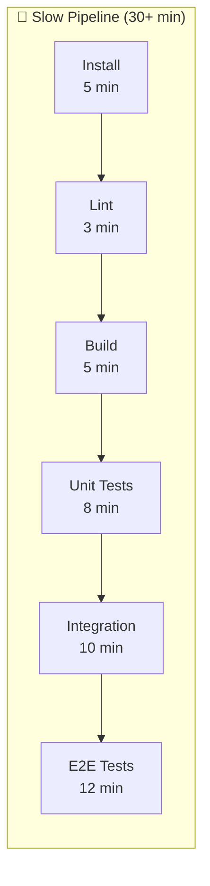

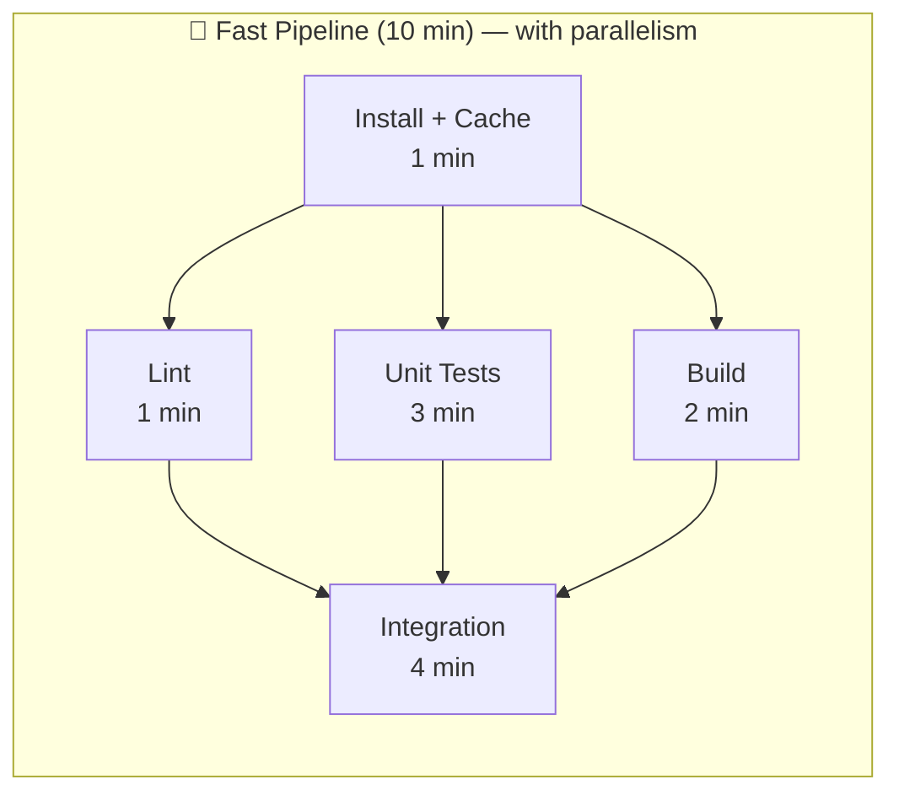

**Techniques to speed up CI:**

| Technique | How | Impact |
|-----------|-----|--------|
| **Dependency caching** | Cache `node_modules/`, `.m2/`, `.gradle/` between builds | -60% install time |
| **Parallelization** | Run lint, tests, and build simultaneously | -50% total time |
| **Incremental builds** | Only rebuild changed files | -70% build time |
| **Test splitting** | Distribute tests across multiple runners | -80% test time |
| **Path filtering** | Skip CI for non-code changes (docs, etc.) | Avoid unnecessary runs |
| **Smaller Docker images** | Use `alpine` or `slim` base images | -40% pull time |

### 2. The Broken Build Protocol

When a build breaks, the team should follow a clear protocol:

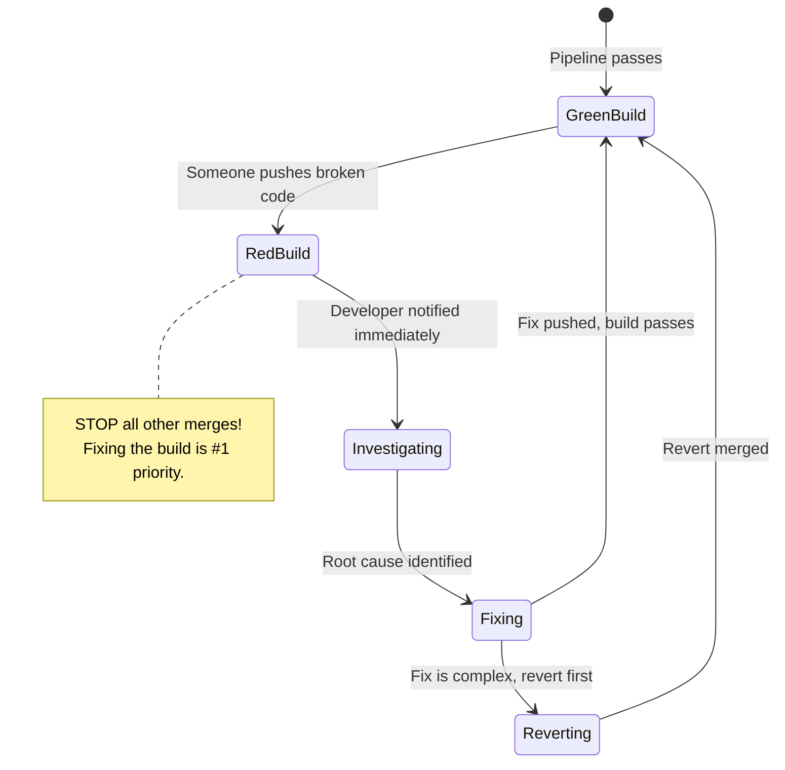

**Rules:**
1. 🔴 **The person who broke the build must fix it immediately**
2. 🚫 **No new merges until the build is green**
3. ⏰ **If not fixed within 10 minutes, revert the change**
4. 📢 **Notify the team via Slack/Teams**

### 3. What Makes a Good CI Pipeline

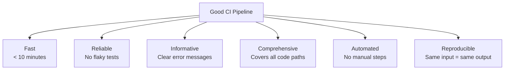

---

## 🔄 Build Triggers Explained

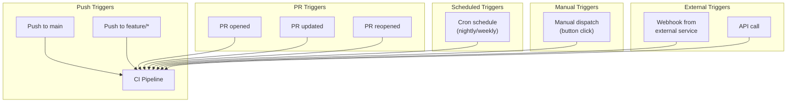

### GitHub Actions Trigger Examples

```yaml
# Run on every push
on: push

# Run on push to specific branches
on:
  push:
    branches: [main, develop]

# Run on PR to main
on:
  pull_request:
    branches: [main]

# Run on a schedule (cron syntax)
on:
  schedule:
    - cron: '0 2 * * *'    # Every day at 2 AM UTC

# Run manually
on:
  workflow_dispatch:
    inputs:
      environment:
        description: 'Target environment'
        required: true
        default: 'staging'
        type: choice
        options:
          - staging
          - production

# Run only when specific files change
on:
  push:
    paths:
      - 'src/**'
      - 'package.json'
    paths-ignore:
      - '**.md'
      - 'docs/**'

# Run on tag creation (for releases)
on:
  push:
    tags:
      - 'v*.*.*'    # Matches v1.0.0, v2.1.3, etc.
```

---

## 📊 Build Matrix

A build matrix tests your code across multiple configurations simultaneously:

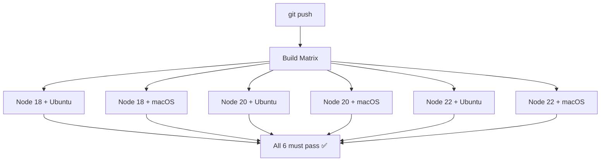

```yaml
jobs:
  test:
    strategy:
      matrix:
        os: [ubuntu-latest, macos-latest]
        node-version: [18, 20, 22]
        # This creates 2 × 3 = 6 jobs!
      fail-fast: false    # Don't cancel all when one fails
    
    runs-on: ${{ matrix.os }}
    steps:
      - uses: actions/checkout@v4
      - uses: actions/setup-node@v4
        with:
          node-version: ${{ matrix.node-version }}
      - run: npm ci
      - run: npm test
```

### Excluding / Including Specific Combinations

```yaml
strategy:
  matrix:
    os: [ubuntu-latest, windows-latest]
    node-version: [18, 20]
    exclude:
      - os: windows-latest
        node-version: 18        # Skip Node 18 on Windows
    include:
      - os: ubuntu-latest
        node-version: 20
        experimental: true       # Add extra variable to one combo
```

---

## 💾 Caching Strategies

Caching avoids re-downloading dependencies on every build:

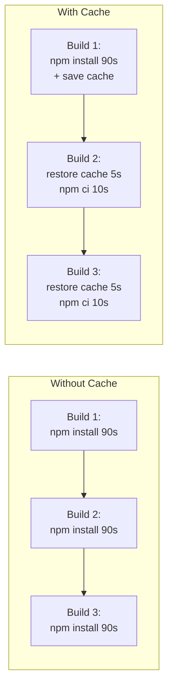

### GitHub Actions Caching

```yaml
# Automatic caching with setup-node
- uses: actions/setup-node@v4
  with:
    node-version: '20'
    cache: 'npm'    # Automatically caches node_modules

# Manual caching (more control)
- uses: actions/cache@v4
  with:
    path: |
      ~/.npm
      node_modules
    key: ${{ runner.os }}-node-${{ hashFiles('**/package-lock.json') }}
    restore-keys: |
      ${{ runner.os }}-node-
```

**Cache key strategy:**
- Include the lock file hash so cache invalidates when dependencies change
- Use `restore-keys` as fallback for partial cache hits
- Include the OS in the key (different platforms need different binaries)

---

## 🚨 Handling Flaky Tests

Flaky tests are tests that randomly pass or fail without code changes. They erode trust in CI.

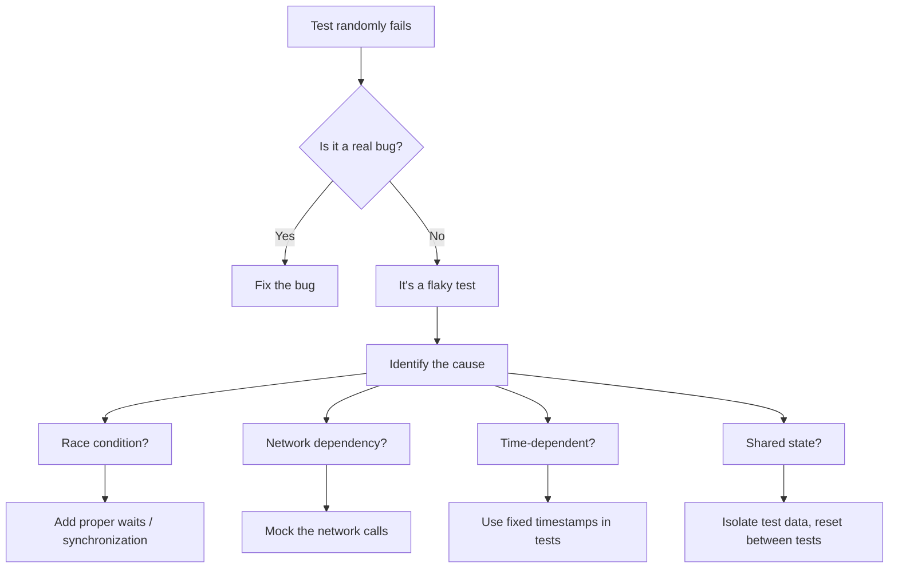

**Common causes and fixes:**

| Cause | Example | Fix |
|-------|---------|-----|
| Race conditions | Tests depend on async timing | Use proper `await`, locks, or retries |
| Network calls | Test hits real API that's sometimes slow | Mock all external APIs |
| Shared database | Test A's data affects Test B | Use transactions or fresh DB per test |
| Time-dependent | Test checks "created today" | Use clock mocking libraries |
| Random ordering | Tests pass alone but fail together | Ensure test isolation |

---

## 🔔 Notifications and Reporting

### Notification Flow

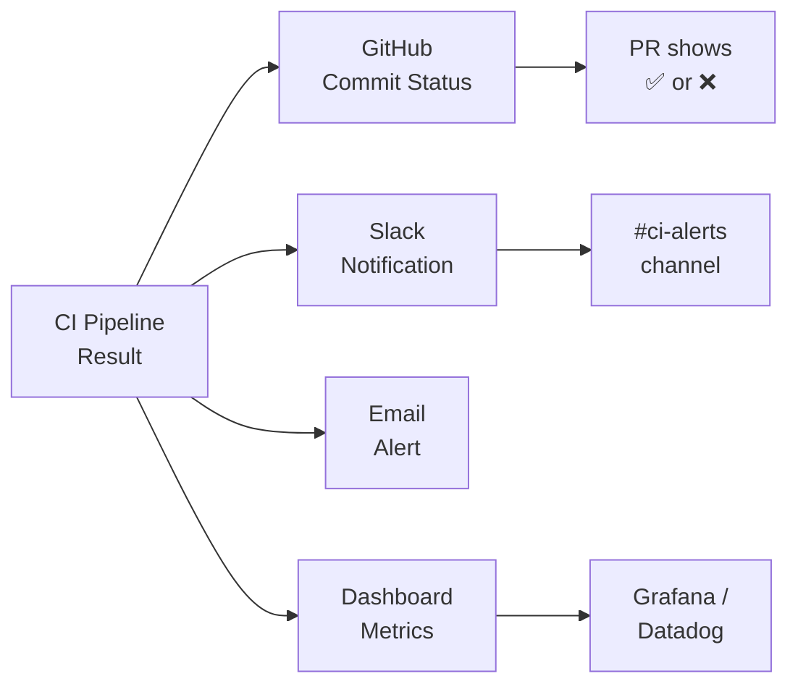

### Example: Slack Notification

```yaml
# GitHub Actions - Notify on failure
- name: Notify Slack on failure
  if: failure()
  uses: slackapi/slack-github-action@v2
  with:
    webhook: ${{ secrets.SLACK_WEBHOOK }}
    payload: |
      {
        "text": "❌ CI Failed: ${{ github.repository }}",
        "blocks": [
          {
            "type": "section",
            "text": {
              "type": "mrkdwn",
              "text": "*Build Failed* in `${{ github.repository }}`\n*Branch:* `${{ github.ref_name }}`\n*Author:* ${{ github.actor }}\n*Commit:* ${{ github.event.head_commit.message }}"
            }
          }
        ]
      }
```

---

## 💡 Best Practices Summary

### Do ✅
- Keep builds under 10 minutes
- Run the most important checks first (lint → unit tests → integration)
- Cache dependencies aggressively
- Use build matrices for cross-platform support
- Set up notifications for failures
- Track CI metrics (success rate, duration, queue time)
- Fix flaky tests immediately (quarantine if needed)
- Use `npm ci` instead of `npm install` in CI (faster, deterministic)

### Don't ❌
- Don't ignore red builds — they're the #1 priority
- Don't allow manual steps in CI — automate everything
- Don't run E2E tests in CI if unit tests haven't passed
- Don't cache build outputs that should be regenerated
- Don't use `latest` tags for CI tools/images (pin versions)
- Don't give CI runners more permissions than needed

---

## 🔗 How This Connects

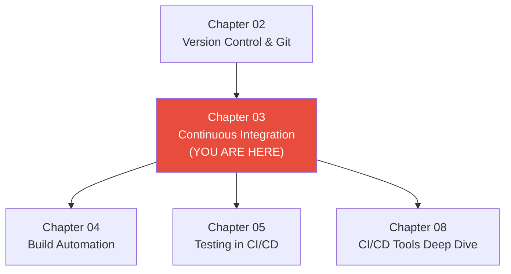

---

## 📝 Chapter Summary

| Concept | Key Takeaway |
|---------|-------------|
| **CI Server** | Orchestrates automated builds, runs on runners/agents |
| **Pipeline config** | YAML files define triggers, jobs, steps, and dependencies |
| **Triggers** | Push, PR, schedule, manual, webhook |
| **Build matrix** | Test across multiple OS/language versions simultaneously |
| **Caching** | Store dependencies between builds for speed |
| **Flaky tests** | Identify, fix, or quarantine — they destroy CI trust |
| **Notifications** | Alert the team immediately on failures |
| **Speed** | Target under 10 minutes for the full CI pipeline |

---

## ➡️ What's Next

In **[Chapter 04: Build Automation](../04-Build-Automation/)**, you'll learn about build tools (Make, Maven, Gradle, npm scripts), how to create reproducible builds, manage dependencies, and produce deployable artifacts.
