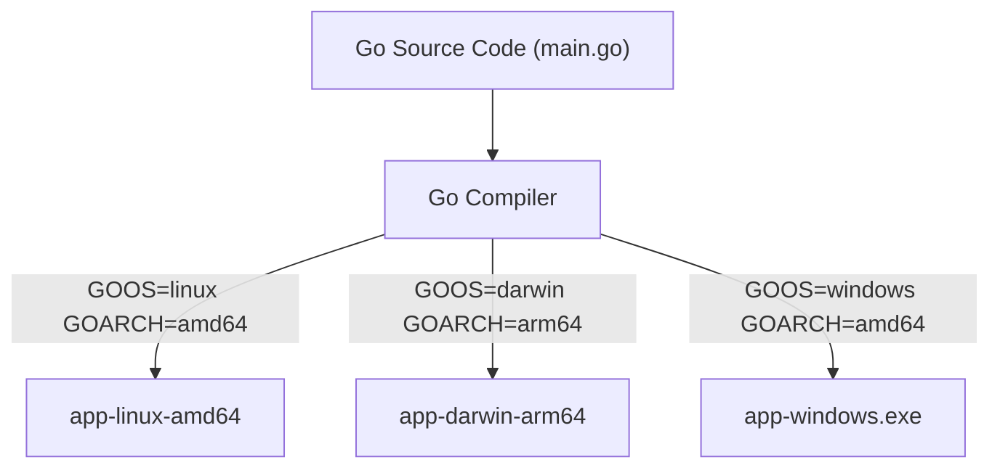

# Chapter 04: Build Automation

## 🎯 Learning Objectives
By the end of this chapter, you will be able to:
1. Understand the importance of build automation in the CI/CD pipeline.
2. Navigate the build tools ecosystem for Go and Python.
3. Write robust, enterprise-grade `Makefile`s for different projects.
4. Manage dependencies to ensure reproducible builds.
5. Implement cross-compilation and build-time configuration.
6. Apply caching strategies and understand multi-stage builds.
7. Version and package build artifacts effectively using Semantic Versioning (SemVer).

## 📖 Introduction
Imagine you run a factory that builds custom bicycles. Initially, you might build one by hand: fetching the frame, attaching the wheels, stringing the brakes, and painting it. This works for one bike, but what if you need to produce 1,000 bikes a day? If every worker follows their own manual process, you'll end up with missing pedals, mismatched wheels, and inconsistent quality. You need an automated assembly line where the steps are defined, repeatable, and fast.

In software engineering, **Build Automation** is your assembly line. It is the process of automating the compilation of source code into binary code, packaging binary code, and running automated tests. It eliminates the "it works on my machine" problem by ensuring that every build is executed in the exact same way, regardless of who or what is triggering it.

In the context of CI/CD, the build phase is typically the first step after code is committed. If the build fails, the pipeline stops. A reliable, fast, and automated build system is the bedrock of continuous integration.

## 🔑 Key Terminology

| Term | Definition |
|------|------------|
| **Build Automation** | Scripting or automating the process of compiling computer source code into binary code or packaged artifacts. |
| **Artifact** | A deployable file (like a compiled binary, a tarball, or a Docker image) produced by a build process. |
| **Makefile** | A file containing a set of directives used by the `make` build automation tool to generate a target/goal. |
| **Reproducible Build** | A build process that always produces the exact same artifact byte-for-byte from the same source code. |
| **Dependency Management** | The process of declaring, resolving, and locking external libraries required by the project. |
| **Lock File** | A file (e.g., `go.sum`, `poetry.lock`) that locks the exact versions of dependencies used, ensuring reproducibility. |
| **Cross-Compilation** | Compiling code on one architecture/OS (e.g., macOS ARM) to run on another (e.g., Linux amd64). |
| **Semantic Versioning (SemVer)** | A versioning scheme (`MAJOR.MINOR.PATCH`) that conveys meaning about the underlying changes. |

## 🏗️ The Build Tools Ecosystem

Every language has its own ecosystem of build tools. However, there are also universal tools that orchestrate these language-specific tools.

### 1. Make and Makefiles
`make` is a classic Unix utility. It was created in 1976 but remains the industry standard for task running. It uses a `Makefile` to define "targets", "dependencies", and "commands". While it was originally designed for compiling C programs, today it is widely used as a universal task runner for Go, Python, Node.js, and Infrastructure as Code projects.

### 2. The Go Build System
Go was designed with a built-in, convention-over-configuration build system. 
- `go build`: Compiles packages and dependencies.
- `go test`: Runs tests.
- `go run`: Compiles and runs a Go program.
- `go mod`: Manages dependencies.

Go's build system is incredibly fast and produces statically linked binaries, making it a favorite for cloud-native applications.

### 3. The Python Ecosystem
Python is an interpreted language, so "building" often means something different than in Go. It usually involves packaging the code, resolving dependencies, and preparing it for distribution.
- **pip & requirements.txt**: The traditional way to manage dependencies.
- **setuptools**: The standard library for packaging Python projects.
- **Poetry**: A modern dependency management and packaging tool that provides lock files (`poetry.lock`) and isolates virtual environments.

## 📜 Writing Makefiles for Go and Python

A `Makefile` provides a standard interface for developers. A new engineer should be able to run `make setup` and `make build` without needing to know if the project is Go, Python, or Ruby.

### Go Makefile Example

```makefile
# Variables
APP_NAME := my-go-service
VERSION := $(shell git describe --tags --always --dirty)
COMMIT := $(shell git rev-parse --short HEAD)
BUILD_TIME := $(shell date -u '+%Y-%m-%d_%H:%M:%S')

# LDFLAGS for injecting build info
LDFLAGS := -X main.Version=$(VERSION) -X main.Commit=$(COMMIT) -X main.BuildTime=$(BUILD_TIME)

.PHONY: all setup test lint build clean

all: lint test build

setup:
	go mod download
	go install github.com/golangci/golangci-lint/cmd/golangci-lint@v1.54.2

lint:
	golangci-lint run ./...

test:
	go test -v -race -cover ./...

build:
	CGO_ENABLED=0 go build -ldflags="$(LDFLAGS)" -o bin/$(APP_NAME) ./cmd/server

clean:
	rm -rf bin/
```

### Python Makefile Example (using Poetry)

```makefile
.PHONY: all setup lint test build clean

all: lint test build

setup:
	pip install poetry
	poetry install

lint:
	poetry run flake8 src/ tests/
	poetry run mypy src/
	poetry run black --check src/ tests/

test:
	poetry run pytest --cov=src tests/

build:
	poetry build

clean:
	rm -rf dist/
	rm -rf .pytest_cache/
	find . -type d -name __pycache__ -exec rm -rf {} +
```

## 📦 Dependency Management & Reproducible Builds

A build is **reproducible** if anyone compiling the same code gets the exact same result. The biggest enemy of reproducibility is floating dependencies (e.g., `requests>=2.0.0`). If a new version is published, two builds of the same code might yield different results.

To solve this, we use **Lock Files**.

### Go Modules
Go uses `go.mod` to declare dependencies and `go.sum` as the lock file.

```go
// go.mod
module github.com/myorg/myapp

go 1.21

require (
	github.com/gin-gonic/gin v1.9.1
	github.com/stretchr/testify v1.8.4
)
```

The `go.sum` file contains cryptographic hashes of the dependencies, ensuring that the downloaded source code hasn't been tampered with.

### Python Poetry
Poetry uses `pyproject.toml` for declarations and `poetry.lock` for exact versions and hashes.

```toml
# pyproject.toml
[tool.poetry]
name = "my-python-service"
version = "0.1.0"
description = "A great service"
authors = ["Engineer <engineer@example.com>"]

[tool.poetry.dependencies]
python = "^3.11"
fastapi = "0.103.1"
uvicorn = "^0.23.2"

[tool.poetry.group.dev.dependencies]
pytest = "^7.4.2"
black = "^23.9.1"
```

> **Rule of Thumb**: ALWAYS commit your lock files (`go.sum`, `poetry.lock`) to version control.

## 🔄 Cross-Compilation in Go

One of Go's superpowers is cross-compilation. You can build a Windows executable from a macOS machine simply by setting environment variables.

```bash
# Build for Linux (amd64)
GOOS=linux GOARCH=amd64 go build -o bin/app-linux-amd64 main.go

# Build for macOS (Apple Silicon)
GOOS=darwin GOARCH=arm64 go build -o bin/app-darwin-arm64 main.go

# Build for Windows
GOOS=windows GOARCH=amd64 go build -o bin/app-windows-amd64.exe main.go
```

### Mermaid Diagram: Cross Compilation Flow



## ⚙️ Environment Variables and Build-Time Configuration

Often, you want to embed information into your binary at build time, such as the version number, git commit hash, or environment target (dev/prod).

In Go, we use `ldflags`:

```go
// main.go
package main

import "fmt"

var (
	Version   string = "dev"
	Commit    string = "none"
	BuildTime string = "unknown"
)

func main() {
	fmt.Printf("App Version: %s\nCommit: %s\nBuild Time: %s\n", Version, Commit, BuildTime)
}
```

When building, we inject the values:
```bash
go build -ldflags="-X main.Version=1.0.0 -X main.Commit=abcdef" -o app main.go
```

## 🚀 Multi-Stage Builds (Concept)

Multi-stage builds are critical for keeping artifacts small and secure. The concept is to use a heavy environment with all the build tools (compilers, linters) to build the software, and then copy *only the final compiled artifact* into a minimal environment for execution.

While heavily used in Docker (which we cover later), the concept applies to CI pipelines too:
1. **Stage 1 (Build)**: Run `make build` in a runner with Go 1.21 installed.
2. **Stage 2 (Test)**: Run `make test`.
3. **Stage 3 (Package)**: Take the compiled binary from Stage 1, tarball it, and upload it to an artifact repository. The packaging runner doesn't need Go installed.

## 🏷️ Build Artifacts and Semantic Versioning (SemVer)

An **artifact** is the final output of your build process. It must be versioned so you know exactly what is running in production.

**Semantic Versioning (SemVer)** is the standard: `MAJOR.MINOR.PATCH` (e.g., `1.4.2`).
- **MAJOR**: Breaking changes.
- **MINOR**: New features, backwards compatible.
- **PATCH**: Bug fixes, backwards compatible.

When a CI pipeline builds an artifact, it should append build metadata, often deriving the version from Git tags.

## ⚡ Build Caching Strategies

Builds can take a long time. Caching speeds them up by reusing previously computed work.

1. **Dependency Caching**: Cache the downloaded libraries (e.g., `~/.cache/go-build`, `~/.cache/pypoetry`).
2. **Object Caching**: Cache compiled intermediate object files.
3. **Remote Caching**: Sharing caches across different CI runners.

*Warning*: Invalidating caches correctly is notoriously difficult. If builds act strangely, clearing the cache is step one.

## 🏗️ Monorepo Build Tools: The Bazel Concept

Standard tools (Make, go build) start to struggle in massive monorepos (repositories containing many projects, like at Google or Uber). If you change one file, you don't want to rebuild everything, but `Make` can be hard to configure perfectly for millions of files.

Enter tools like **Bazel**, **Pants**, or **Buck**.
They use advanced dependency graphs and content-addressable storage to ensure that only the exact files affected by a change are rebuilt or retested. They guarantee **Hermetic Builds**—builds isolated from the host operating system, ensuring 100% reproducibility.

## 💡 Best Practices

| Do ✅ | Don't ❌ |
|-------|----------|
| Standardize Makefile targets (`setup`, `lint`, `test`, `build`). | Create obscure, project-specific build scripts that only you understand. |
| Commit your lock files (`go.sum`, `poetry.lock`). | Use floating versions (`latest`, `>1.0`) in production builds. |
| Use `ldflags` to bake version info into binaries. | Hardcode version strings in source code. |
| Fail the build on linter or test errors. | Ignore linter warnings during the build process. |

## 🔗 How This Connects
- **Previous**: [03 Continuous Integration](./03-Continuous-Integration-CI) (This chapter details the exact commands the CI server runs).
- **Next**: [05 Testing in CI/CD](../05-Testing-in-CICD/README.md) (We will dive deeper into the `make test` target and automated testing strategies).

## 📝 Chapter Summary

| Concept | Explanation |
|---------|-------------|
| **Build Automation** | The assembly line for your code. Fast, repeatable, scriptable. |
| **Makefiles** | The universal language for defining build targets (`make build`). |
| **Reproducibility** | Ensuring identical source code always produces identical artifacts using lock files. |
| **Cross-Compilation** | Compiling for target architectures different from the build machine. |

## ➡️ What's Next
Proceed to the exercises to build your own Makefiles, manage dependencies, and implement cross-compilation in Go and Python.
