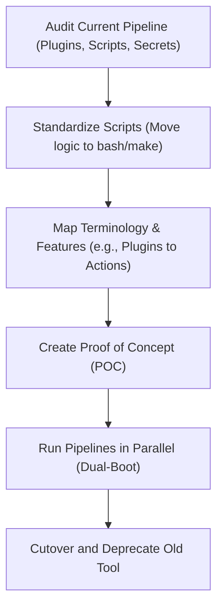

# Chapter 08: CI/CD Tools Deep Dive

## 🎯 Learning Objectives
By the end of this chapter, you will be able to:
1. Master **GitHub Actions** workflows, including reusable workflows, matrix strategies, and self-hosted runners.
2. Build advanced pipelines in **GitLab CI/CD** utilizing stages, needs, templates, and environments.
3. Construct scalable **Jenkins** declarative pipelines leveraging shared libraries and the Blue Ocean interface.
4. Translate pipeline concepts across different tools and plan migrations.
5. Implement a continuous integration pipeline for a polyglot (Go + Python) enterprise application across all three platforms.

## 📖 Introduction
Imagine you are managing a massive commercial kitchen (your software project). 
- **GitHub Actions** is like having a fully integrated kitchen staff that comes bundled with your restaurant space. They know exactly where the ingredients (code) are and start cooking the moment an order (commit) comes in.
- **GitLab CI/CD** is a specialized culinary school that not only provides the kitchen but also offers a strict, well-documented curriculum (Auto DevOps) on how every dish should be prepared, tested, and served.
- **Jenkins** is the highly customizable, veteran head chef. They've been around forever, can cook literally anything you ask for, and will integrate with any weird kitchen gadget you bring in, but you have to build the kitchen and write the recipes yourself.

In this chapter, we will dive deep into the three most dominant CI/CD tools in the industry. We'll explore their unique syntaxes, advanced features, and see how they handle the exact same enterprise workloads.

## 🔑 Key Terminology

| Term | GitHub Actions | GitLab CI/CD | Jenkins | Definition |
| :--- | :--- | :--- | :--- | :--- |
| **Pipeline/Workflow** | Workflow (`.github/workflows/*.yml`) | Pipeline (`.gitlab-ci.yml`) | Pipeline (`Jenkinsfile`) | The automated process that runs your CI/CD tasks. |
| **Execution Unit** | Job | Job | Stage / Step | A collection of steps/commands that execute on a single runner. |
| **Runner/Node** | Runner | Runner | Agent / Node | The machine or container where the CI/CD job actually executes. |
| **Step/Command** | Step / Action | Script | Step | The smallest individual task (e.g., running `make test` or checking out code). |
| **Plugin/Extension** | Action | Template / Component | Plugin | Reusable code or integrations that extend the CI/CD tool's capabilities. |
| **Artifact** | Artifact | Artifact | Artifact | A file or collection of files produced by a job (e.g., a compiled binary or test report) saved for later use. |

---

## 🛠️ GitHub Actions Deep Dive

GitHub Actions has revolutionized CI/CD by bringing automation directly into the place where developers collaborate on code.

### Workflow Syntax Deep Dive
A GitHub Actions workflow is defined in a YAML file located in `.github/workflows/`. 

```yaml
name: "Enterprise Go/Python CI"
on:
  push:
    branches: [ "main" ]
  pull_request:
    branches: [ "main" ]
  workflow_dispatch:
    inputs:
      debug_mode:
        description: 'Enable debug logging'
        required: false
        default: 'false'
        type: boolean

env:
  GLOBAL_VAR: "Shared across all jobs"

jobs:
  build:
    runs-on: ubuntu-latest
    steps:
      - name: Checkout Code
        uses: actions/checkout@v4
      
      - name: Run Script
        run: echo "Building..."
```

### Actions Marketplace, Composite Actions, and Reusable Workflows
The true power of GitHub Actions lies in its reusability.
- **Marketplace Actions**: Pre-built steps provided by the community (e.g., `actions/setup-go@v5`).
- **Composite Actions**: Combine multiple steps into one action within your repository.
- **Reusable Workflows**: Call an entire workflow from another workflow using `workflow_call`.

**Example: Reusable Workflow (`.github/workflows/reusable-test.yml`)**
```yaml
name: Reusable Test
on:
  workflow_call:
    inputs:
      language:
        required: true
        type: string
    secrets:
      API_TOKEN:
        required: true

jobs:
  test:
    runs-on: ubuntu-latest
    steps:
      - uses: actions/checkout@v4
      - run: echo "Testing ${{ inputs.language }} with token ***"
```

### Matrix Strategies & Concurrency Control
Matrix strategies allow you to run the same job across multiple combinations of variables (e.g., different OS and language versions). Concurrency prevents parallel executions of workflows for the same branch/PR, saving resources.

```yaml
jobs:
  test-matrix:
    runs-on: ${{ matrix.os }}
    concurrency: 
      group: ${{ github.workflow }}-${{ github.ref }}
      cancel-in-progress: true
    strategy:
      fail-fast: false
      matrix:
        os: [ubuntu-latest, macos-latest]
        go-version: ['1.20', '1.21']
        python-version: ['3.10', '3.11']
    steps:
      - run: echo "Running on ${{ matrix.os }} with Go ${{ matrix.go-version }} & Py ${{ matrix.python-version }}"
```

### Environments, Secrets, Variables, and Self-Hosted Runners
- **Environments**: Logical deployment targets (e.g., `staging`, `production`) that can require manual approval before a job runs.
- **Secrets**: Encrypted environment variables (`${{ secrets.AWS_ACCESS_KEY }}`).
- **Self-Hosted Runners**: For enterprise workloads requiring custom hardware, VPC access, or specific OS configurations. You install the Actions runner binary on your own EC2 instance or Kubernetes pod and tag it.

```yaml
jobs:
  deploy-prod:
    runs-on: [self-hosted, linux, x64, custom-vpc]
    environment: production
    steps:
      - run: ./deploy.sh
        env:
          SECRET_KEY: ${{ secrets.PROD_DB_PASSWORD }}
```

### Caching, Artifacts, and Job Outputs
Caching speeds up builds by saving dependencies. Artifacts pass files between jobs. Job outputs pass string values between jobs.

```yaml
jobs:
  build:
    runs-on: ubuntu-latest
    outputs:
      build_id: ${{ steps.generate.outputs.id }}
    steps:
      - id: generate
        run: echo "id=12345" >> "$GITHUB_OUTPUT"
      
      - name: Cache Go Modules
        uses: actions/cache@v3
        with:
          path: ~/go/pkg/mod
          key: ${{ runner.os }}-go-${{ hashFiles('**/go.sum') }}

      - name: Upload Artifact
        uses: actions/upload-artifact@v4
        with:
          name: binary
          path: bin/app
```

---

## 🦊 GitLab CI/CD Deep Dive

GitLab CI/CD uses a strictly ordered pipeline execution model defined in `.gitlab-ci.yml`.

### Architecture: Stages, Jobs, Rules, and Needs
GitLab relies heavily on `stages`. Jobs in the same stage run in parallel. Jobs in the next stage run only after the previous stage succeeds. You can override this strict ordering using `needs` (Directed Acyclic Graph or DAG).

```yaml
stages:
  - build
  - test
  - deploy

variables:
  GLOBAL_VAR: "Available everywhere"

build_go:
  stage: build
  script:
    - go build -o app ./cmd
  artifacts:
    paths:
      - app

test_go:
  stage: test
  needs: [build_go] # DAG: starts immediately after build_go, even if other build jobs are running
  script:
    - go test ./...
  rules:
    - if: $CI_PIPELINE_SOURCE == "merge_request_event"
```

### Environments, Auto DevOps, Templates
GitLab excels at Kubernetes integration and environment tracking.
- **Environments**: Track deployments, view logs directly in GitLab, and manage rollbacks.
- **Auto DevOps**: A collection of pre-configured CI/CD templates that automatically build, test, and deploy applications based on best practices, just by including a template.
- **Includes**: The equivalent of reusable workflows.

```yaml
include:
  - template: Security/SAST.gitlab-ci.yml
  - local: '/ci/.custom-tests.yml'

deploy_production:
  stage: deploy
  script:
    - ./deploy.sh
  environment:
    name: production
    url: https://prod.example.com
```

---

## 🕴️ Jenkins Deep Dive

Jenkins is the grandparent of modern CI/CD. It is heavily plugin-driven and uses Groovy-based `Jenkinsfile` definitions.

### Jenkinsfile: Declarative vs Scripted
Modern Jenkins uses the **Declarative Pipeline** syntax, which provides a rigid, cleaner structure compared to the older Scripted Pipeline.

```groovy
pipeline {
    agent any
    
    environment {
        GLOBAL_VAR = 'Jenkins is powerful'
    }
    
    stages {
        stage('Build') {
            steps {
                sh 'echo "Building..."'
            }
        }
        stage('Parallel Tests') {
            parallel {
                stage('Go Tests') {
                    agent { docker { image 'golang:1.21' } }
                    steps {
                        sh 'go test ./...'
                    }
                }
                stage('Python Tests') {
                    agent { docker { image 'python:3.11' } }
                    steps {
                        sh 'pytest'
                    }
                }
            }
        }
    }
    post {
        always {
            archiveArtifacts artifacts: '**/test-results.xml', allowEmptyArchive: true
            junit '**/test-results.xml'
        }
        failure {
            echo "Pipeline failed!"
        }
    }
}
```

### Shared Libraries and Blue Ocean
- **Shared Libraries**: Enterprise Jenkins setups use Groovy scripts stored in a separate repository, dynamically loaded into pipelines. This centralizes common logic (e.g., standard Docker build steps).
- **Blue Ocean**: A modern, visual UI plugin for Jenkins that replaces the classic, clunky interface, making it easier to visualize parallel stages and debug failures.

---

## 🔄 Multi-Tool Pipeline Comparison (Go + Python Project)

Let's look at how the exact same pipeline is implemented across all three tools.
**Scenario**: We have an enterprise application with a Go backend and a Python data processing worker. We need to:
1. Lint both.
2. Build both in parallel.
3. Upload the binaries/packages as artifacts.

### 1. GitHub Actions Implementation
```yaml
name: Enterprise Polyglot Pipeline
on: [push, pull_request]

jobs:
  lint-and-build:
    runs-on: ubuntu-latest
    strategy:
      matrix:
        language: [go, python]
    steps:
      - uses: actions/checkout@v4
      
      - name: Setup Go
        if: matrix.language == 'go'
        uses: actions/setup-go@v5
        with:
          go-version: '1.21'
          
      - name: Setup Python
        if: matrix.language == 'python'
        uses: actions/setup-python@v5
        with:
          python-version: '3.11'

      - name: Lint and Build Go
        if: matrix.language == 'go'
        run: |
          go vet ./...
          go build -o backend-app main.go
          
      - name: Lint and Build Python
        if: matrix.language == 'python'
        run: |
          pip install flake8 build
          flake8 .
          python -m build
          
      - name: Upload Artifacts
        uses: actions/upload-artifact@v4
        with:
          name: build-${{ matrix.language }}
          path: |
            backend-app
            dist/
```

### 2. GitLab CI/CD Implementation
```yaml
stages:
  - build

.base_build:
  stage: build

build:go:
  extends: .base_build
  image: golang:1.21
  script:
    - go vet ./...
    - go build -o backend-app main.go
  artifacts:
    paths:
      - backend-app

build:python:
  extends: .base_build
  image: python:3.11
  script:
    - pip install flake8 build
    - flake8 .
    - python -m build
  artifacts:
    paths:
      - dist/
```

### 3. Jenkins Implementation
```groovy
pipeline {
    agent none
    stages {
        stage('Lint and Build') {
            parallel {
                stage('Go') {
                    agent { docker { image 'golang:1.21' } }
                    steps {
                        sh 'go vet ./...'
                        sh 'go build -o backend-app main.go'
                        archiveArtifacts artifacts: 'backend-app'
                    }
                }
                stage('Python') {
                    agent { docker { image 'python:3.11' } }
                    steps {
                        sh '''
                        pip install flake8 build
                        flake8 .
                        python -m build
                        '''
                        archiveArtifacts artifacts: 'dist/'
                    }
                }
            }
        }
    }
}
```

---

## 📊 Comparison Table

| Feature | GitHub Actions | GitLab CI/CD | Jenkins |
| :--- | :--- | :--- | :--- |
| **Setup & Hosting** | Managed SaaS (default) or Self-Hosted | Managed SaaS or Self-Hosted | Pure Self-Hosted (requires server config) |
| **Configuration** | YAML (`.github/workflows/`) | YAML (`.gitlab-ci.yml`) | Groovy (`Jenkinsfile`) |
| **Ecosystem** | Huge Marketplace of community Actions | Includes and Auto DevOps templates | 1800+ Plugins (can be brittle) |
| **Parallelism** | Matrix Strategies | `parallel:matrix` or Jobs in Stages | `parallel` block |
| **Strengths** | Tight GitHub integration, rich marketplace | Built-in registry, Kubernetes integration, DAG | Extreme flexibility, legacy system support |
| **Weaknesses** | Debugging locally is difficult | Heavy UI, can be complex to self-host | Maintenance heavy, plugin conflicts, Groovy |

---

## 🏗️ Migration Guide Between Tools

Migrating from one CI/CD tool to another is a significant undertaking. 



### Key Migration Strategies:
1. **The "Thin CI" Pattern**: Never write heavy logic directly in your CI configuration (`.yml` or `Jenkinsfile`). Write bash scripts, Makefiles, or Python scripts, and have the CI tool just call `make test` or `./scripts/deploy.sh`. This makes your pipeline tool-agnostic.
2. **Translate Plugins**: 
   - Jenkins AWS Plugin ➡️ GitHub Actions `aws-actions/configure-aws-credentials`
   - Jenkins Docker Pipeline ➡️ GitLab CI `image: docker` with `services: [docker:dind]`
3. **Handle Secrets Migration**: Audit Jenkins credentials and securely migrate them to GitHub/GitLab Secrets.

## 💡 Best Practices (Do/Don't)

- **DO** use matrix builds to test against multiple versions of languages/OS simultaneously.
- **DO** pin your GitHub Actions to a specific SHA or major version tag (`uses: actions/checkout@v4` or `@a1b2c3d4`) to prevent supply chain attacks.
- **DO** utilize caching for language dependencies (Go modules, pip cache) to reduce pipeline duration.
- **DON'T** put plain text secrets in your pipeline configuration files. Always use the built-in secret managers.
- **DON'T** write complex conditional logic natively in YAML. If it takes more than 10 lines of YAML conditions, it belongs in a Python or Bash script.

## 🔗 How This Connects
- **Previous Chapter**: *07-Containerization-with-Docker* — We saw how to package applications. Here, we used tools like GitLab and Jenkins which natively spin up Docker containers as pipeline runners.
- **Next Chapter**: *09-Infrastructure-as-Code* — Once your CI/CD pipeline builds your artifacts, you need infrastructure to run them. We will use Terraform to provision environments that these pipelines will deploy to.

## 📝 Chapter Summary

| Concept | Summary |
| :--- | :--- |
| **GitHub Actions** | Event-driven, marketplace-rich, integrated deeply into the code repository. |
| **GitLab CI/CD** | Stage-based, robust environment management, excellent Kubernetes integration. |
| **Jenkins** | Highly customizable, Groovy-based, requires infrastructure maintenance but supports anything. |
| **Migration** | Best achieved by shifting logic from CI-specific syntax into agnostic shell scripts/Makefiles. |

## ➡️ What's Next
Proceed to the exercises to get hands-on experience writing pipelines. You will start with basic GitHub Actions and GitLab pipelines, move to matrix strategies and declarative Jenkins pipelines, and finish with a complex, reusable enterprise workflow.
