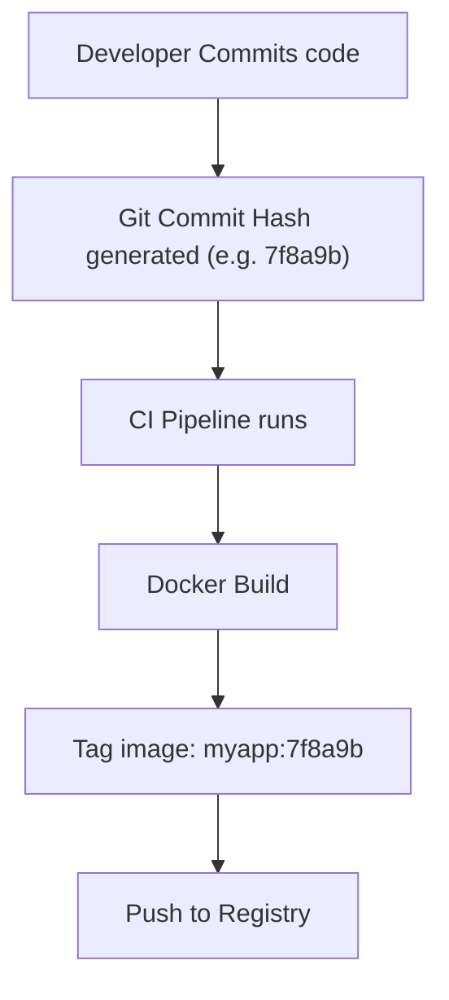
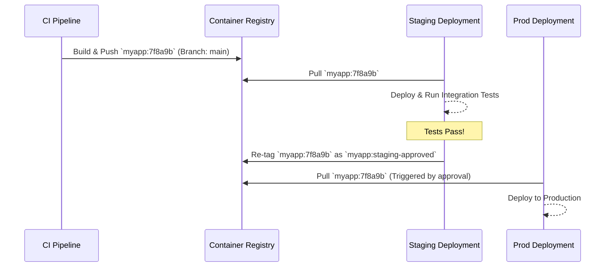

# Chapter 10: Artifact Management

## 🎯 Learning Objectives

By the end of this chapter, you will be able to:
1. Understand what artifacts are in a CI/CD context and differentiate between various types (binaries, images, packages).
2. Utilize different artifact repositories like Docker registries, Python PyPI, and Go modules.
3. Apply robust versioning strategies including Semantic Versioning (SemVer) and Git SHA tagging.
4. Implement artifact promotion pipelines (Dev → Staging → Prod) without rebuilding.
5. Secure your artifacts using signing and verification tools like Cosign and Sigstore.
6. Manage storage costs and implement lifecycle retention policies.

## 📖 Introduction

Imagine a high-end restaurant. The kitchen line (CI) meticulously prepares, cooks, and plates the dishes. Once a dish is perfectly plated and passes the head chef's inspection, it sits on the pass. That finished dish is an **artifact**. 

In the software world, an artifact is the compiled, packaged, and tested output of your build process. It is the immutable deliverable that gets handed off to the delivery system (CD) for deployment. Instead of the waiter taking the dish to a table, a deployment script pulls the artifact from an **artifact repository** and deploys it to a server.

If a customer sends a dish back and asks for the exact same thing later, the kitchen doesn't hunt for the original ingredients and try to cook it identically—they just look for the saved output (if they were a magical software kitchen). In CI/CD, once an artifact is built, we **never rebuild it** for different environments. We simply promote the exact same artifact across Development, Staging, and Production.

This chapter dives deep into managing, versioning, storing, securing, and promoting these critical pieces of your software supply chain.

## 🔑 Key Terminology

| Term | Definition |
|---|---|
| **Artifact** | A compiled or packaged file produced by a build process (e.g., `.jar`, `.whl`, binary, Docker image). |
| **Artifact Repository** | A storage system specialized for managing software artifacts and their metadata (e.g., Nexus, Artifactory, GHCR). |
| **Container Registry** | A specialized artifact repository designed specifically for storing and distributing container images. |
| **Immutability** | The principle that once an artifact is created and published with a specific version, it cannot be changed. |
| **Promotion** | The process of advancing an existing artifact from a lower environment (Dev) to a higher one (Prod). |
| **Cosign / Sigstore** | Tools used to cryptographically sign artifacts to prove their origin and integrity. |
| **SBOM** | Software Bill of Materials; a comprehensive inventory of all software components and dependencies in an artifact. |

---

## 🏗️ 1. What Are Artifacts?

An artifact is the tangible output of a build process. Depending on your tech stack, artifacts take different forms:
*   **Compiled Binaries**: Go, C++, Rust executables.
*   **Libraries/Packages**: Python Wheels (`.whl`), NPM packages (`.tgz`), Java JARs/WARs.
*   **Container Images**: Docker images, OCI-compliant images.
*   **Configuration Bundles**: Helm charts, Terraform modules, ZIP files of static assets.
*   **Metadata Files**: Test reports, SBOMs, code coverage results.

### The Golden Rule of Artifacts: Build Once, Deploy Many
The most critical rule in CI/CD is that you compile/build your code exactly **once** per commit. If your pipeline tests code, builds a Docker image, deploys it to staging, and then re-builds a *new* Docker image to deploy to production, you have a severe anti-pattern. You cannot guarantee the code running in production is exactly what was tested in staging.

---

## 🗄️ 2. Types of Artifact Repositories

Artifact repositories serve as the single source of truth for all built software assets.

### Generic Storage vs. Specialized Registries
*   **Generic Storage (S3, GCS)**: Good for raw binaries or ZIP files, but lacks dependency resolution, metadata querying, or API integration for package managers.
*   **Specialized Repositories (Nexus, Artifactory)**: Understand package protocols (Maven, npm, PyPI). They provide proxying, caching, and vulnerability scanning.
*   **Container Registries (Docker Hub, GHCR, AWS ECR)**: Optimized for OCI images. They understand image layers, tags, and manifests.

### Docker Registries
Docker images are the standard currency of modern deployments.
*   **Docker Hub**: The default public registry. Rate-limited for anonymous pulls.
*   **GitHub Container Registry (GHCR)**: Integrated tightly with GitHub Actions. Excellent for open-source and internal GitHub-based teams.
*   **AWS ECR / Google Artifact Registry**: Cloud-native registries. Best if your workloads run in those respective clouds due to IAM integration and reduced latency/egress costs.

### Python Packages (PyPI)
Python uses the Python Package Index (PyPI).
*   **Public PyPI**: Where `pip install requests` gets its data.
*   **Private PyPI Servers**: Tools like `devpi`, or services like AWS CodeArtifact, allow you to host proprietary Python packages.
*   **twine**: The official utility for publishing Python packages to a registry.

### Go Modules
Go operates differently than Python or Node. It pulls source code directly from version control (Git) but uses proxies for speed and reliability.
*   **Go Proxy (`proxy.golang.org`)**: A public cache of open-source Go modules.
*   **Private Modules**: To use internal Go code, you must configure `GOPRIVATE` so the Go toolchain knows not to request it from the public proxy, but rather pull it directly from your private Git repository using SSH or personal access tokens.

---

## 🏷️ 3. Versioning Strategies

Proper versioning ensures repeatability and traceback capabilities.

### Semantic Versioning (SemVer)
The standard for libraries and packages. Format: `MAJOR.MINOR.PATCH` (e.g., `2.14.1`).
*   **MAJOR**: Breaking changes.
*   **MINOR**: Backward-compatible new features.
*   **PATCH**: Backward-compatible bug fixes.

### Calendar Versioning (CalVer)
Popular for monolithic applications or tools where release dates matter more than API compatibility (e.g., Ubuntu `22.04`). Format variations include `YYYY.MM.DD`.

### Git SHA Versioning
The gold standard for continuous delivery of applications and microservices. The artifact version is exactly the Git commit hash (e.g., `a1b2c3d`).



### Tagging Docker Images: Best Practices
**NEVER use `:latest` in production.** The `:latest` tag is a mutable pointer. If a deployment fails and you are rolling back to `:latest`, what does that actually point to? Nobody knows without checking registry timestamps.

**Best Practice:**
Tag your images with multiple identifiers during CI:
1.  Git SHA (for explicit deployment tracking): `myapp:7f8a9b2`
2.  Branch name (for dev environments): `myapp:feature-login`
3.  SemVer (if it's a released product): `myapp:v1.2.0`

---

## 🚀 4. Artifact Promotion

Artifact promotion is the process of moving an artifact through different environments. You do not rebuild; you re-tag or move the binary.



### Promotion with Docker
To promote an image, pull it, tag it, and push it back:
```bash
# Pull the exact tested SHA
docker pull ghcr.io/myorg/myapp:7f8a9b2

# Tag it for production release
docker tag ghcr.io/myorg/myapp:7f8a9b2 ghcr.io/myorg/myapp:v1.2.0
docker tag ghcr.io/myorg/myapp:7f8a9b2 ghcr.io/myorg/myapp:production

# Push the new tags
docker push ghcr.io/myorg/myapp:v1.2.0
docker push ghcr.io/myorg/myapp:production
```

---

## 🔒 5. Artifact Signing and Verification

Supply chain attacks (like the SolarWinds breach) occur when malicious actors replace your legitimate artifact with a compromised one inside the registry. 

Artifact signing solves this by attaching a digital signature to the artifact.

### Cosign and Sigstore
Sigstore is an open-source project that makes code signing easy. `cosign` is their tool for container images.

1.  **Generate Keypair:**
    ```bash
    cosign generate-key-pair
    ```
2.  **Sign the Image in CI:**
    ```bash
    cosign sign --key cosign.key ghcr.io/myorg/myapp:7f8a9b2
    ```
3.  **Verify the Image in CD (or Kubernetes admission controller):**
    ```bash
    cosign verify --key cosign.pub ghcr.io/myorg/myapp:7f8a9b2
    ```

Modern Sigstore also supports **Keyless Signing** using OpenID Connect (OIDC) via GitHub Actions, tying the signature to the exact CI workflow identity.

### Software Bill of Materials (SBOM)
An SBOM is a list of all ingredients that make up your software. Tools like `syft` can generate this during CI. You can attach the SBOM to your container image using `cosign`, ensuring that consumers know exactly what libraries are inside.

---

## ⚡ 6. Caching Artifacts in CI Pipelines

Downloading dependencies takes time. Artifact caching speeds up CI runs significantly.

### Go Module Caching
Go modules are downloaded to `$GOPATH/pkg/mod`. Caching this directory prevents re-downloading standard libraries.

### Python pip Caching
Pip caches downloaded wheels in `~/.cache/pip`.

**Example GitHub Actions Cache Step:**
```yaml
- name: Cache pip dependencies
  uses: actions/cache@v3
  with:
    path: ~/.cache/pip
    key: ${{ runner.os }}-pip-${{ hashFiles('**/requirements.txt') }}
    restore-keys: |
      ${{ runner.os }}-pip-
```

---

## 🧹 7. Cleanup and Retention Policies

Artifact storage can become incredibly expensive if left unchecked. A busy team might generate 50 Docker images a day. At 200MB each, that's 10GB/day, or 3.6TB/year.

### Retention Policy Best Practices
1.  **Production Artifacts**: Keep forever (or for legal compliance duration, e.g., 7 years).
2.  **Release/SemVer Tags**: Keep forever.
3.  **Main Branch SHAs**: Keep for 90 days.
4.  **PR / Feature Branch Builds**: Delete after 7 days, or immediately upon PR merge.

Registries like AWS ECR and GHCR support automated Lifecycle Policies to handle this based on rules.

---

## 🛠️ Complete Examples

### 1. Building and Pushing Docker Images in CI

Here is a complete GitHub Actions workflow for building a Go application and pushing it to GHCR with proper SHA and branch tagging.

```yaml
# .github/workflows/docker-build.yml
name: Build and Push Docker Image

on:
  push:
    branches: [ "main" ]
  pull_request:
    branches: [ "main" ]

env:
  REGISTRY: ghcr.io
  IMAGE_NAME: ${{ github.repository }}

jobs:
  build-and-push:
    runs-on: ubuntu-latest
    permissions:
      contents: read
      packages: write
    steps:
      - name: Checkout repository
        uses: actions/checkout@v4

      - name: Log in to the Container registry
        uses: docker/login-action@v3
        with:
          registry: ${{ env.REGISTRY }}
          username: ${{ github.actor }}
          password: ${{ secrets.GITHUB_TOKEN }}

      - name: Extract metadata (tags, labels) for Docker
        id: meta
        uses: docker/metadata-action@v5
        with:
          images: ${{ env.REGISTRY }}/${{ env.IMAGE_NAME }}
          tags: |
            type=sha,format=long
            type=ref,event=branch
            type=ref,event=pr

      - name: Build and push Docker image
        uses: docker/build-push-action@v5
        with:
          context: .
          push: ${{ github.event_name != 'pull_request' }}
          tags: ${{ steps.meta.outputs.tags }}
          labels: ${{ steps.meta.outputs.labels }}
```

### 2. Publishing a Python Package to PyPI

A complete setup for a Python project using modern `pyproject.toml` and GitHub Actions to publish to PyPI using Trusted Publishers (OIDC).

**pyproject.toml:**
```toml
[build-system]
requires = ["setuptools>=61.0"]
build-backend = "setuptools.build_meta"

[project]
name = "enterprise_cicd_toolkit"
version = "1.0.0"
authors = [
  { name="DevOps Team", email="devops@example.com" },
]
description = "A toolkit for advanced CI/CD."
readme = "README.md"
requires-python = ">=3.8"
dependencies = [
    "requests>=2.28.0",
]

[project.scripts]
cicd-tool = "enterprise_cicd_toolkit.cli:main"
```

**GitHub Actions Workflow (`.github/workflows/pypi-publish.yml`):**
```yaml
name: Publish Python Package

on:
  release:
    types: [published]

jobs:
  deploy:
    runs-on: ubuntu-latest
    environment: pypi
    permissions:
      id-token: write  # Required for OIDC
      contents: read
    steps:
      - uses: actions/checkout@v4
      
      - name: Set up Python
        uses: actions/setup-python@v5
        with:
          python-version: "3.x"
          
      - name: Install build tool
        run: python -m pip install --upgrade build
        
      - name: Build package
        run: python -m build
        
      - name: Publish package to PyPI
        uses: pypa/gh-action-pypi-publish@release/v1
```

### 3. Publishing Go Binaries with GoReleaser

GoReleaser automates building Go binaries for multiple OS/Arch combinations, packaging them, and creating GitHub Releases.

**.goreleaser.yml:**
```yaml
version: 2
project_name: my-go-cli
builds:
  - env:
      - CGO_ENABLED=0
    goos:
      - linux
      - windows
      - darwin
    goarch:
      - amd64
      - arm64
archives:
  - format: tar.gz
    name_template: >-
      {{ .ProjectName }}_
      {{- title .Os }}_
      {{- if eq .Arch "amd64" }}x86_64
      {{- else if eq .Arch "386" }}i386
      {{- else }}{{ .Arch }}{{ end }}
      {{- if .Arm }}v{{ .Arm }}{{ end }}
    format_overrides:
      - goos: windows
        format: zip
checksum:
  name_template: 'checksums.txt'
snapshot:
  name_template: "{{ incpatch .Version }}-next"
changelog:
  sort: asc
  filters:
    exclude:
      - '^docs:'
      - '^test:'
```

---

## 💡 Best Practices

| Do | Don't |
|---|---|
| **DO** build an artifact exactly once and promote it. | **DON'T** rebuild code for the staging or production environment. |
| **DO** tag Docker images with the Git commit SHA. | **DON'T** use `:latest` tag for deployments. |
| **DO** implement lifecycle policies to delete old PR/feature artifacts. | **DON'T** keep every CI build forever; you will pay massive storage costs. |
| **DO** scan your artifacts for vulnerabilities before storing them. | **DON'T** assume internal registries are secure without RBAC and signing. |
| **DO** cache dependencies to speed up builds. | **DON'T** cache the final artifact itself; that defeats the purpose of the build. |

## 🔗 How This Connects

*   **Previous Chapter (09 - Infrastructure as Code):** We built the infrastructure (servers, Kubernetes clusters) that will pull and run the artifacts we created in this chapter.
*   **Next Chapter (11 - Pipeline Security & DevSecOps):** We will expand on artifact signing, introducing image scanning (Trivy), vulnerability management, and ensuring no secrets leak into our artifacts.

## 📝 Chapter Summary

| Concept | Explanation | Tooling Examples |
|---|---|---|
| **Artifacts** | The immutable output of a CI pipeline. | Binaries, Docker Images, JARs, Wheels |
| **Registries** | Systems to store, version, and serve artifacts. | GHCR, ECR, Nexus, Artifactory, PyPI |
| **Versioning** | Giving artifacts unique, trackable names. | SemVer (1.0.0), Git SHA (a1b2c3d) |
| **Promotion** | Moving artifacts between environments without rebuilding. | Docker re-tagging |
| **Security** | Ensuring the artifact was built by CI and not tampered with. | Cosign, Sigstore, SBOMs |

## ➡️ What's Next
Proceed to the exercises to get hands-on experience building, tagging, and publishing artifacts in both Go and Python!
