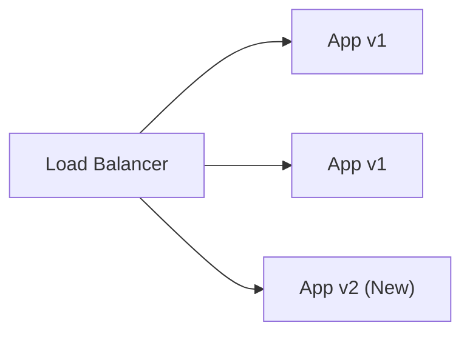

# Chapter 12: Advanced Deployment Strategies

## 🎯 Learning Objectives

- Understand the risk vs. speed tradeoffs of different deployment strategies.
- Master various deployment patterns: Recreate, Rolling, Blue/Green, Canary, A/B Testing, and Shadow.
- Learn how to decouple deployment from release using Feature Flags.
- Implement progressive delivery concepts and zero-downtime database migrations.
- Build deployment automation and rollback scripts in Go and Python.

## 📖 Introduction (The Airplane Analogy)

Imagine you run a massive commercial airline, and you've just engineered a new, more efficient engine. You need to upgrade all planes. How do you do it? 
- You could ground all planes, swap the engines, and start flying again. (Recreate - safe, but massive downtime).
- You could upgrade one plane at a time while the others keep flying. (Rolling - no downtime, but takes a while).
- You could build an entire duplicate fleet with the new engines, and simply redirect passengers to the new fleet at the terminal. (Blue/Green - fast, zero downtime, but very expensive).
- You could put the new engine on just one plane, fly a few less critical routes, see if it explodes, and if it's fine, roll it out to the rest. (Canary - limits blast radius).

In the enterprise software world, how you deliver code to your users is just as critical as the code itself. "Deployment" is installing the code on servers. "Release" is exposing it to users. Advanced deployment strategies decouple the two, minimizing risk while maximizing deployment frequency.

## 🔑 Key Terminology

| Term | Definition |
|------|------------|
| **Deployment** | The physical act of placing a new version of software onto infrastructure. |
| **Release** | The business decision to route user traffic to the newly deployed software. |
| **Downtime** | Time during which a service is unavailable to end-users. |
| **Blast Radius** | The percentage of users or systems affected if a new deployment contains a critical bug. |
| **Progressive Delivery** | The practice of releasing updates in a controlled, phased manner (e.g., Canary, Feature Flags). |
| **Traffic Splitting** | Routing different percentages or types of user traffic to different application versions. |

## 🏗 Deployment Strategies Deep-Dive

### 1. Recreate Deployment
The simplest approach. Shut down the old version completely, deploy the new version, and start it up.

**Pros:** Simplest to implement, no backwards compatibility issues with databases or APIs.
**Cons:** Guaranteed downtime.
**Use Case:** Non-critical internal tools, dev/staging environments.

### 2. Rolling Deployment
Replaces instances of the old version with the new version one by one (or in small batches) until all instances are updated.



**Pros:** Zero downtime.
**Cons:** Deployment takes time. Both versions run concurrently, requiring strict backwards compatibility.
**Use Case:** Standard stateless web applications.

### 3. Blue/Green Deployment
Maintain two identical production environments. The active one (Blue) serves all traffic. You deploy the new version to the idle one (Green). Once tested, you switch the router to send all traffic to Green.

```mermaid
flowchart TD
    Router["Load Balancer / Router"]
    
    subgraph Blue Environment (Active)
        AppV1_1["App v1"]
        AppV1_2["App v1"]
    end
    
    subgraph Green Environment (Idle/Testing)
        AppV2_1["App v2"]
        AppV2_2["App v2"]
    end
    
    Router -->|100% Traffic| Blue Environment
    Router -.->|0% Traffic| Green Environment
```

**Pros:** Instant rollback (just flip the switch back), zero downtime, easy to test in production.
**Cons:** Requires double the infrastructure, stateful data synchronization can be tricky.

### 4. Canary Deployment
Roll out the new version to a small subset of users (e.g., 5%) before rolling it out to the entire infrastructure.

```mermaid
flowchart TD
    Router["Load Balancer (Traffic Splitter)"]
    
    subgraph Stable (95% Traffic)
        AppV1["App v1 (Stable)"]
    end
    
    subgraph Canary (5% Traffic)
        AppV2["App v2 (Canary)"]
    end
    
    Router -->|95%| AppV1
    Router -->|5%| AppV2
```

**Pros:** Smallest blast radius, tests actual production traffic.
**Cons:** Complex to monitor and automate, requires sophisticated traffic routing.

### 5. A/B Testing Deployment
Similar to Canary, but routing is based on specific user segments (e.g., location, device, premium status) to measure business metrics.

### 6. Shadow (Dark) Deployment
Deploy the new version alongside the old one. The old version serves users, but the load balancer mirrors incoming requests to the new version to test its performance under load. Responses from the new version are discarded.

## 🚩 Feature Flags: Decoupling Deployment from Release

Feature flags are toggles in your code that allow you to turn features on or off dynamically without redeploying.

### Python Feature Flag Example

```python
# feature_flags.py
class FeatureFlagManager:
    def __init__(self):
        self.flags = {
            "new_checkout_flow": False,
            "beta_ui_dashboard": True
        }
        
    def is_enabled(self, feature_name: str) -> bool:
        return self.flags.get(feature_name, False)

# main.py
def process_checkout(user, cart):
    ff_manager = FeatureFlagManager()
    
    if ff_manager.is_enabled("new_checkout_flow"):
        print("Routing to V2 Checkout Engine (Stripe Integration)")
        return v2_checkout(user, cart)
    else:
        print("Routing to V1 Checkout Engine (Legacy)")
        return v1_checkout(user, cart)
```

### Go Feature Flag Example

```go
package main

import "fmt"

type FeatureFlags map[string]bool

func (f FeatureFlags) IsEnabled(flag string) bool {
    return f[flag]
}

func main() {
    flags := FeatureFlags{
        "EnableNewSearchAPI": true,
    }

    if flags.IsEnabled("EnableNewSearchAPI") {
        fmt.Println("Using Elasticsearch backend...")
    } else {
        fmt.Println("Using standard SQL search...")
    }
}
```

## 🗄️ Database Migrations with Zero-Downtime

When running Blue/Green or Rolling deployments, two versions of your app access the database simultaneously. Your DB schema changes must be backward-compatible.

**The Expand-Contract Pattern:**
1. **Expand**: Add a new column (e.g., `last_name`). Old code ignores it. New code writes to both old and new.
2. **Migrate**: Run a background script to copy data from the old structure to the new one.
3. **Deploy**: Update the application to solely rely on the new column.
4. **Contract**: Remove the old column.

## 🩺 Health Checks & Automation Scripts

Deployments shouldn't proceed if the app isn't healthy.

### Go Health Check API
```go
package main

import (
    "net/http"
)

func healthCheckHandler(w http.ResponseWriter, r *http.Request) {
    // In a real app, check DB connections, cache availability, etc.
    dbHealthy := true
    if dbHealthy {
        w.WriteHeader(http.StatusOK)
        w.Write([]byte(`{"status": "UP"}`))
    } else {
        w.WriteHeader(http.StatusServiceUnavailable)
        w.Write([]byte(`{"status": "DOWN"}`))
    }
}

func main() {
    http.HandleFunc("/healthz", healthCheckHandler)
    http.ListenAndServe(":8080", nil)
}
```

## 📊 Deployment Comparison Matrix

| Strategy | Zero Downtime | Blast Radius | Rollback Speed | Infrastructure Cost |
|----------|---------------|--------------|----------------|---------------------|
| Recreate | ❌ No | 100% | Slow | 💰 Low |
| Rolling | ✅ Yes | Medium | Medium | 💰 Low |
| Blue/Green | ✅ Yes | 100% | ⚡ Instant | 💰💰 High |
| Canary | ✅ Yes | 📉 Small | Fast | 💰 Medium |

## 🌍 Real-World Examples
- **Netflix**: Heavily uses Canary deployments combined with Spinnaker to automate canary analysis.
- **Amazon**: Uses rolling deployments in small cells to isolate failures.
- **Google**: Relies on Shadow traffic for new infrastructure rollouts, followed by global Canary rollouts.

## 💡 Best Practices
- **DO** decouple deployment from release using feature flags.
- **DO** automate rollbacks based on health check failures.
- **DON'T** perform backwards-incompatible database migrations during a rolling release.
- **DON'T** test in production without a quick rollback mechanism like Blue/Green.

## 🔗 How This Connects
Builds on the continuous delivery concepts from **Chapter 10**. Prepares you for **Chapter 13: Monitoring and Observability**, because without monitoring, you can't do Canary or automated rollbacks.

## ➡️ What's Next
Proceed to the exercises to implement these deployment strategies in code!
