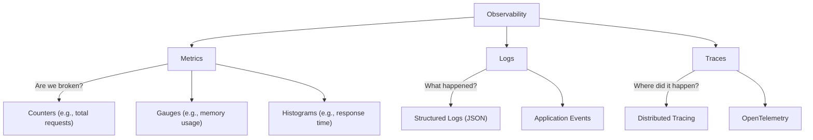

# Chapter 13: Monitoring and Observability

## 🎯 Learning Objectives
By the end of this chapter, you will be able to:
- Differentiate between monitoring and observability and explain their importance in CI/CD.
- Understand the three pillars of observability: Metrics, Logs, and Traces.
- Implement structured logging and health check endpoints in Go and Python.
- Define SLIs, SLOs, and SLAs, and use error budgets to balance reliability and deployment velocity.
- Design actionable alerting and effective Grafana dashboards.
- Automate rollbacks based on post-deployment metrics.
- Monitor your CI/CD pipeline and establish post-incident review practices.

## 📖 Introduction
Imagine driving a high-performance sports car (your application) blindfolded. CI/CD allows you to deploy changes incredibly fast, but without monitoring, you have no idea if your car is about to hit a wall or if it's cruising smoothly. 

**Monitoring** is looking at the dashboard to see how fast you are going and if the engine is overheating (is a known problem happening?). **Observability** is being able to open the hood, inspect the engine components, and understand *why* the car is making a strange noise (can we answer new questions about the system?). In modern CI/CD, you cannot deploy with confidence unless you can observe the impact of your deployments in real-time.

## 🔑 Key Terminology

| Term | Definition |
|------|------------|
| Observability | The ability to infer internal states of a system based on its external outputs. |
| Monitoring | The process of gathering metrics, logs, and traces to track system health and performance. |
| Metric | A numeric value measured over a time interval (e.g., CPU usage, request count). |
| Log | An immutable, timestamped record of discrete events that happened over time. |
| Trace | A representation of a series of causally related distributed events that encode the end-to-end request flow. |
| SLI | Service Level Indicator: A carefully defined quantitative measure of some aspect of the level of service. |
| SLO | Service Level Objective: A target value or range of values for a service level that is measured by an SLI. |
| SLA | Service Level Agreement: An explicit or implicit contract with your users that includes consequences of meeting (or missing) the SLOs. |
| Error Budget | The amount of acceptable unreliability a service can have before the business takes action (e.g., halting feature deployments). |
| APM | Application Performance Monitoring: Tools that provide deep visibility into application performance. |

## 🏗️ The Three Pillars of Observability



### 1. Metrics
Metrics are numerical representations of data measured over time. They are cheap to store and query. Prometheus is the industry standard for metrics.
- **Counter**: A cumulative metric that only increases (e.g., `http_requests_total`).
- **Gauge**: A metric that can go up and down (e.g., `active_connections`, `memory_usage_bytes`).
- **Histogram**: Samples observations and counts them in configurable buckets (e.g., `http_request_duration_seconds`). Useful for calculating percentiles (p95, p99).

### 2. Logs
Logs provide detailed context about events. In modern systems, **structured logging** (typically JSON) is critical so machines can easily parse, index, and query the logs.

#### Structured Logging in Go
```go
package main

import (
	"log/slog"
	"os"
)

func main() {
	// Create a structured JSON logger
	logger := slog.New(slog.NewJSONHandler(os.Stdout, &slog.HandlerOptions{
		Level: slog.LevelInfo,
	}))
	slog.SetDefault(logger)

	userID := 42
	slog.Info("user logged in", 
		slog.Int("user_id", userID), 
		slog.String("ip", "192.168.1.1"),
	)
	
	slog.Error("failed to connect to database", 
		slog.String("db_host", "db.internal"), 
		slog.String("error", "timeout"),
	)
}
```

#### Structured Logging in Python
```python
import logging
import json

class JSONFormatter(logging.Formatter):
    def format(self, record):
        log_record = {
            "time": self.formatTime(record, self.datefmt),
            "level": record.levelname,
            "message": record.getMessage(),
            "logger": record.name
        }
        if hasattr(record, 'extra_data'):
            log_record.update(record.extra_data)
        return json.dumps(log_record)

logger = logging.getLogger("my_app")
handler = logging.StreamHandler()
handler.setFormatter(JSONFormatter())
logger.addHandler(handler)
logger.setLevel(logging.INFO)

# Usage
logger.info("user logged in", extra={"extra_data": {"user_id": 42, "ip": "192.168.1.1"}})
```

### 3. Distributed Tracing
When a user clicks a button, that request might hit an API gateway, which calls an auth service, which calls an order service, which queries a database. A distributed trace tracks this request end-to-end, assigning a unique `trace_id` and breaking it down into `spans` (individual operations). **OpenTelemetry** provides a standardized way to instrument applications for tracing, metrics, and logs.

## ⚖️ SLOs, SLIs, SLAs, and Error Budgets

To effectively measure reliability, we use:
- **SLI**: E.g., The percentage of HTTP GET requests to `/api/orders` that return a 200 OK within 500ms.
- **SLO**: We want the SLI to be >= 99.9% over a 30-day window.
- **SLA**: If we drop below 99.9%, we refund enterprise customers 10% of their monthly bill.
- **Error Budget**: If the SLO is 99.9%, we have a 0.1% error budget. This means we are "allowed" to have a certain amount of downtime or slow requests. If we burn through this budget quickly due to bad deployments, we halt feature releases and focus purely on stability.

## 🩺 Health Checks and Probes

Applications must expose endpoints so the infrastructure (like Kubernetes) knows if they are alive and ready to receive traffic.

- **Liveness Probe**: Is the application running? If this fails, the container is restarted.
- **Readiness Probe**: Is the application ready to handle requests? If this fails, traffic is temporarily stopped from being routed to the container.

### Go Health Check Example
```go
package main

import (
	"encoding/json"
	"net/http"
)

type HealthStatus struct {
	Status string `json:"status"`
	DB     string `json:"db_connection"`
}

func healthHandler(w http.ResponseWriter, r *http.Request) {
	// Simulate checking DB connection
	dbConnected := true 

	status := HealthStatus{
		Status: "ok",
		DB:     "connected",
	}

	w.Header().Set("Content-Type", "application/json")
	if !dbConnected {
		status.Status = "error"
		status.DB = "disconnected"
		w.WriteHeader(http.StatusServiceUnavailable)
	} else {
		w.WriteHeader(http.StatusOK)
	}
	
	json.NewEncoder(w).Encode(status)
}

func main() {
	http.HandleFunc("/health", healthHandler)
	http.HandleFunc("/ready", healthHandler)
	http.ListenAndServe(":8080", nil)
}
```

### Python Health Check Example (Flask)
```python
from flask import Flask, jsonify

app = Flask(__name__)

@app.route('/health')
def health():
    return jsonify({"status": "ok"}), 200

@app.route('/ready')
def ready():
    # Example readiness check (e.g., db ping)
    db_ready = True
    if db_ready:
        return jsonify({"status": "ready"}), 200
    else:
        return jsonify({"status": "not_ready"}), 503

if __name__ == '__main__':
    app.run(port=8080)
```

## 🚨 Alerting and Dashboards

### Actionable Alerts
Alerts must be actionable. Alert fatigue occurs when engineers receive too many alerts that require no action, leading them to ignore real issues.
- **Bad Alert**: CPU usage is > 80%. (Why does this matter if latency is fine?)
- **Good Alert**: p99 latency for checkout > 2 seconds for the last 5 minutes. (This directly impacts users).
Tools like PagerDuty handle on-call routing and escalation.

### Grafana Dashboards
Dashboards should tell a story. Top level: High-level business/SLO metrics (The USE method: Utilization, Saturation, Errors, or RED method: Rate, Errors, Duration). Bottom level: Detailed systemic metrics (CPU, Memory, DB locks).

## ⏪ Monitoring-Driven Rollbacks
Modern CD tools (like ArgoCD or Spinnaker) support automated rollbacks. After deploying a new version, the system queries Prometheus for error rates. If the error rate spikes beyond a threshold during the canary phase, the deployment is automatically rolled back.

### Example Automated Verification Script
```python
import time
import requests
import sys

PROMETHEUS_URL = "http://prometheus:9090/api/v1/query"
QUERY = 'rate(http_requests_total{status="500"}[1m])'
THRESHOLD = 0.05 # 5% error rate

def check_metrics():
    try:
        response = requests.get(PROMETHEUS_URL, params={'query': QUERY})
        data = response.json()
        
        if data['status'] == 'success':
            results = data['data']['result']
            for result in results:
                value = float(result['value'][1])
                if value > THRESHOLD:
                    print(f"ERROR RATE EXCEEDED THRESHOLD: {value} > {THRESHOLD}")
                    return False
        return True
    except Exception as e:
        print(f"Failed to check metrics: {e}")
        return True # Default to true if monitoring is down, though debatable

print("Watching metrics post-deployment...")
for i in range(5): # Check for 5 minutes
    if not check_metrics():
        print("Initiating automatic rollback...")
        sys.exit(1) # Exit 1 triggers the CI/CD pipeline rollback step
    time.sleep(60)
print("Deployment stable.")
sys.exit(0)
```

## ⚙️ CI/CD Pipeline Monitoring
You should monitor your pipeline just like your application. Key metrics include:
- Build success/failure rate
- Mean time to recovery (MTTR) for a broken build
- Deployment frequency
- Lead time for changes (time from commit to deploy)

## 🌪️ Chaos Engineering (Brief Intro)
Chaos engineering involves proactively injecting failures into your system (e.g., terminating random nodes, adding network latency) to ensure your monitoring, alerting, and automated recovery mechanisms work.

## 📝 Post-Incident Reviews (Postmortems)
When incidents happen, a blameless post-incident review is essential. The focus is on *what* failed in the system, not *who* caused it. The output should be action items to improve monitoring and resiliency.

## 💡 Best Practices

| Do | Don't |
|----|-------|
| Alert on symptoms affecting users (latency, errors) | Alert on causes (CPU high) unless it leads to a symptom |
| Write logs as structured JSON | Use standard unstructured text logs |
| Implement /health and /ready endpoints in every microservice | Deploy services without liveness/readiness probes |
| Automate rollbacks based on metrics | Rely solely on manual verification post-deploy |

## 🔗 How This Connects
- **Previous Chapter**: 12-Advanced-Deployment-Strategies - Canaries and blue/green deployments rely heavily on the metrics discussed here to decide when to shift traffic.
- **Next Chapter**: 14-Advanced-CICD-Patterns - We will build upon observability to implement advanced GitOps patterns and progressive delivery.

## ➡️ What's Next
Proceed to the exercises to build health check endpoints, configure structured logging, and simulate monitoring-driven rollbacks!
