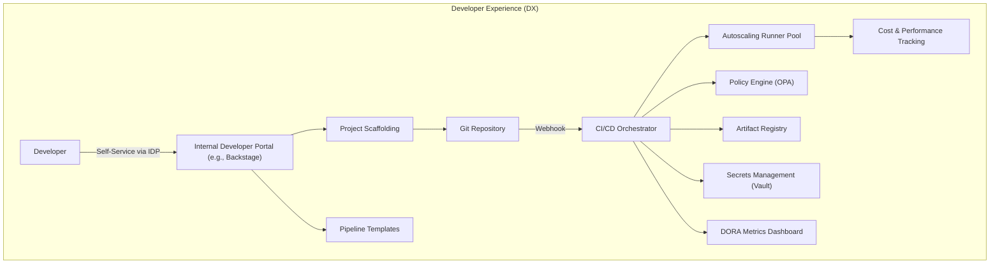
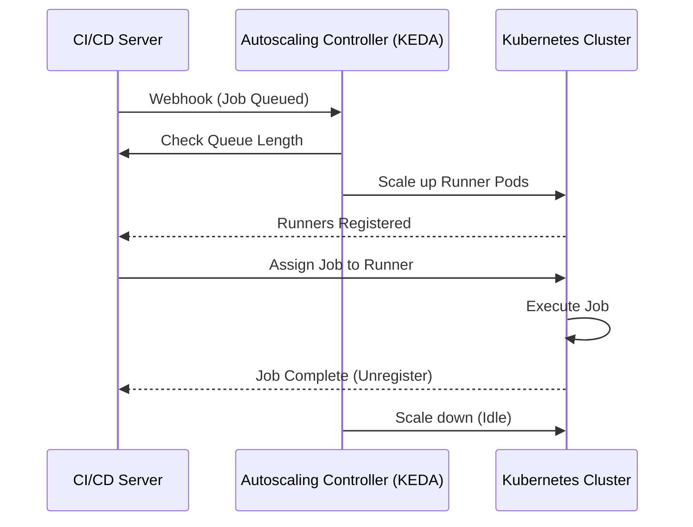

# Chapter 15: CI/CD at Scale

## 🎯 Learning Objectives
- Understand the unique challenges of scaling CI/CD to hundreds of services and thousands of developers.
- Learn platform engineering concepts and how to build internal developer platforms (IDPs).
- Master self-hosted runner management, including autoscaling and cost optimization.
- Design pipeline templates and "golden paths" for enterprise adoption.
- Implement CI/CD governance, compliance, and audit trails.
- Optimize pipeline performance through parallelism, caching, and test splitting.
- Measure and track DORA metrics and engineering velocity.
- Explore AI-assisted CI/CD and the future of automated delivery.

## 📖 Introduction
Scaling CI/CD is like transitioning from a small food truck to a global restaurant franchise. In a food truck (a single app or small team), the chef (developer) does everything: taking orders, cooking, cleaning, and managing supplies. But when you expand to a franchise with 1,000 locations (enterprise scale with hundreds of microservices), you need standardized kitchens, supply chain logistics, health inspectors (compliance), and centralized management. 

At scale, CI/CD is no longer just about automating a build; it's about **Platform Engineering**. Your goal is to build an Internal Developer Platform (IDP) that abstracts away the complexity of CI/CD, providing developers with self-service "golden paths" that are secure, compliant, and blazing fast.

## 🔑 Key Terminology

| Term | Definition |
|------|------------|
| Platform Engineering | The discipline of designing and building toolchains and workflows that enable self-service capabilities for software engineering organizations. |
| Internal Developer Platform (IDP) | A self-service portal (like Backstage) providing developers with infrastructure, templates, and documentation. |
| Golden Path | A standardized, supported, and highly automated route for building and deploying software within an organization. |
| DORA Metrics | Four key metrics (Deployment Frequency, Lead Time, MTTR, Change Failure Rate) used to measure software delivery performance. |
| Ephemeral Runners | Build agents that are spun up on demand for a single job and destroyed immediately after, ensuring clean state. |
| Flaky Test | A test that both passes and fails periodically without any code changes, reducing trust in the CI/CD pipeline. |

## 🏗️ Enterprise CI/CD Challenges

When you hit 100+ services and 1000+ developers, new problems emerge:

1. **Configuration Drift**: Teams copy-paste YAML, leading to thousands of disparate, unmaintained pipelines.
2. **Runner Starvation**: Peak hours cause massive queues; developers wait hours for a 5-minute build.
3. **Cost Explosions**: Idle runners, unoptimized caching, and redundant builds drain cloud budgets.
4. **Compliance Nightmares**: Security teams cannot audit deployments or enforce policies across scattered systems.

### The Enterprise CI/CD Architecture



## 🛤️ Pipeline Templates and Golden Paths

Instead of every team writing their own CI/CD configurations, Platform Engineering teams provide **Pipeline Templates**. 

### Go Pipeline Template (Reusable Component)

In a centralized repository, you define the standard build process for all Go microservices:

```yaml
# templates/go-service.yaml
name: "Golden Path: Go Microservice"
on:
  workflow_call:
    inputs:
      go-version:
        required: true
        type: string
      service-name:
        required: true
        type: string

jobs:
  build-and-test:
    runs-on: enterprise-runner-pool
    steps:
      - uses: actions/checkout@v3
      
      - name: Setup Go
        uses: actions/setup-go@v4
        with:
          go-version: ${{ inputs.go-version }}
          cache: true
          
      - name: Security Scan (Governance)
        run: govulncheck ./...
        
      - name: Run Tests
        run: go test -v -race ./...
```

### Python Pipeline Template

```yaml
# templates/python-service.yaml
name: "Golden Path: Python API"
on:
  workflow_call:
    inputs:
      python-version:
        required: true
        type: string

jobs:
  lint-and-test:
    runs-on: enterprise-runner-pool
    steps:
      - uses: actions/checkout@v3
      
      - name: Setup Python
        uses: actions/setup-python@v4
        with:
          python-version: ${{ inputs.python-version }}
          cache: 'pip'
          
      - name: Install dependencies
        run: pip install -r requirements.txt
        
      - name: Linting & SAST
        run: |
          flake8 .
          bandit -r .
          
      - name: Pytest
        run: pytest --cov=app/
```

## 🏃 Self-Hosted Runner Management at Scale

Public runners are often too slow or lack secure access to internal resources. Enterprises use self-hosted runner pools.

### Autoscaling Strategies

- **Webhook-Driven**: Scale runners based on pending queue size (e.g., using Kubernetes KEDA or AWS Auto Scaling Groups).
- **Time-Based**: Pre-warm instances before peak hours (e.g., 8:00 AM PST) to reduce queue times.
- **Spot Instances**: Use cloud spot instances for CI jobs to save up to 70% on compute costs.



## 🛡️ CI/CD Governance: Policies and Compliance

At scale, you must enforce rules programmatically. You can use Open Policy Agent (OPA) to validate pipeline definitions or deployment requests.

Example OPA Policy (Rego) ensuring only approved base images are used:

```rego
package cicd.docker

deny[msg] {
    input.kind == "Deployment"
    container := input.spec.template.spec.containers[_]
    not startswith(container.image, "internal-registry.corp.com/")
    msg := sprintf("Container '%v' uses an unapproved registry", [container.name])
}
```

## ⚡ Pipeline Performance Optimization

Slow pipelines ruin developer experience. 

1. **Parallelism & Test Splitting**: Split test suites across multiple runners.
2. **Incremental Builds**: Using tools like Bazel or Nx to only build and test what changed.
3. **Caching Optimization**: Cache dependencies, build artifacts, and docker layers aggressively.

### Test Splitting Example (Python)

Using `pytest-split` to run tests across 4 parallel jobs:

```python
# CI script snippet
# Job index ranges from 0 to 3
import os
import subprocess

node_total = 4
node_index = int(os.environ.get("NODE_INDEX", 0))

# Run 1/4th of the tests based on test execution time
cmd = [
    "pytest", 
    "--splits", str(node_total), 
    "--group", str(node_index+1)
]
subprocess.run(cmd, check=True)
```

## 📊 CI/CD Metrics and KPIs (DORA)

You cannot improve what you do not measure.

1. **Deployment Frequency**: How often do you deploy to production? (Goal: On-demand / Multiple times a day)
2. **Lead Time for Changes**: Time from commit to production. (Goal: < 1 hour)
3. **Change Failure Rate**: Percentage of deployments causing failures. (Goal: 0-15%)
4. **Time to Restore Service (MTTR)**: Time to recover from a failure. (Goal: < 1 hour)

### DORA Metrics Collection (Go Example)

A simple Go service that acts as a webhook receiver to calculate lead time:

```go
package main

import (
	"encoding/json"
	"fmt"
	"net/http"
	"time"
)

type DeploymentEvent struct {
	CommitHash   string    `json:"commit_hash"`
	CommitTime   time.Time `json:"commit_time"`
	DeployTime   time.Time `json:"deploy_time"`
	Environment  string    `json:"environment"`
	Status       string    `json:"status"`
}

func metricsHandler(w http.ResponseWriter, r *http.Request) {
	var event DeploymentEvent
	if err := json.NewDecoder(r.Body).Decode(&event); err != nil {
		http.Error(w, err.Error(), http.StatusBadRequest)
		return
	}

	if event.Status == "success" && event.Environment == "production" {
		leadTime := event.DeployTime.Sub(event.CommitTime)
		fmt.Printf("Deploy recorded. Lead Time: %v\n", leadTime)
		// Send to Prometheus / Datadog
	}
	w.WriteHeader(http.StatusOK)
}

func main() {
	http.HandleFunc("/webhook", metricsHandler)
	http.ListenAndServe(":8080", nil)
}
```

## 🤖 AI-Assisted CI/CD and the Future

The future of CI/CD involves machine learning applied to the software delivery lifecycle:
- **Test Selection**: AI predicts which tests are relevant to a code change, running 5% of tests instead of 100%.
- **Flaky Test Detection**: Heuristics to automatically quarantine tests that fail non-deterministically.
- **Auto-Remediation**: AI analyzing build logs and automatically suggesting or applying a PR to fix the broken build.

## 💡 Best Practices

| Do | Don't |
|----|-------|
| Centralize pipeline logic using templates (Golden Paths) | Let teams write custom bash scripts for deployments |
| Implement ephemeral runners that destroy themselves after one job | Use static, persistent build servers that accumulate state |
| Tag all CI/CD infrastructure for cost tracking | Run heavy E2E tests on every single commit |
| Measure DORA metrics to identify bottlenecks | Optimize parts of the pipeline without looking at the whole system |

## 🔗 How This Connects
This chapter builds on the patterns established in **Chapter 14 (Advanced CI/CD Patterns)** and scales them for enterprise use, combining concepts from containerization, infrastructure as code, and security into a cohesive platform engineering strategy.

## 📝 Chapter Summary

| Concept | Impact at Scale | Implementation |
|---------|-----------------|----------------|
| Platform Engineering | Standardization & DX | Internal Developer Portals (Backstage), Golden Paths |
| Runner Management | Cost & Speed | Autoscaling, Spot Instances, KEDA |
| Performance | Fast Feedback Loops | Test splitting, Incremental builds (Bazel) |
| Governance | Compliance & Security | OPA, Centralized Templates |

## ➡️ What's Next
Congratulations! You've reached the end of the CI/CD engineering guide. You are now equipped to build, scale, and optimize software delivery pipelines for any organization, from startups to global enterprises.
