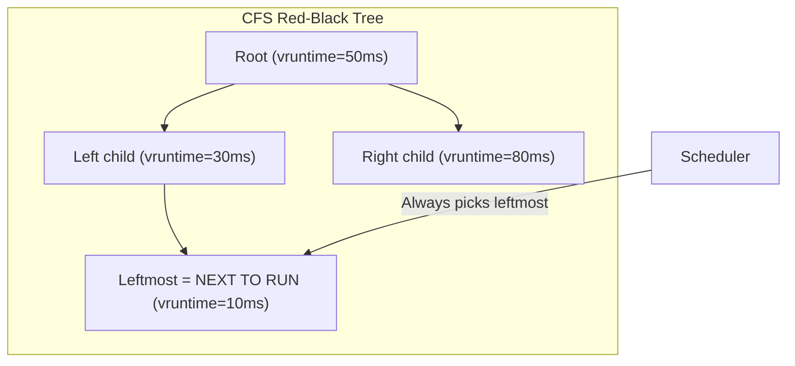
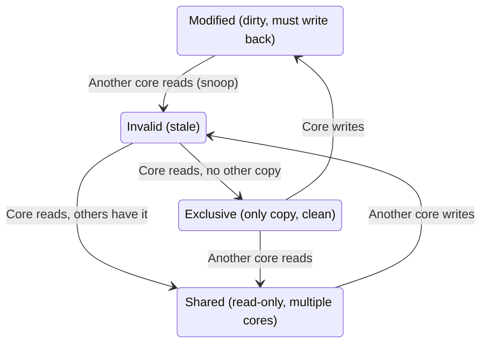
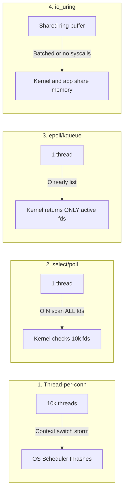

# Operating Systems & Hardware Symbiosis

Every program you run eventually becomes instructions competing for a CPU, some RAM,
and a disk or network card that hundreds of other programs also want. This file
starts with what an operating system actually does about that, then goes as deep as
a Senior Software Engineer (L5) interview loop expects: how your application's
architecture interacts with the kernel's scheduler, CPU caches, and virtual memory
subsystem. Interviewers at that level rarely ask "what is a thread" — they ask
precise follow-ups, and this file corrects several popular myths along the way; each
correction is marked **Precision note**.

## Foundations — Start Here If You're New to Operating Systems

**What an OS actually is.** Your CPU can only do one thing at a time per core: run
raw instructions. The **operating system (OS)** is the program that runs first, and
its job is to let many other programs share that CPU, the RAM, and every disk and
network device, safely and (mostly) fairly. Everything in this file is really one
question asked about a different resource: *who gets to use this next, and how do we
stop them from stepping on each other?*

**Kernel vs. user space.** The **kernel** is the core of the OS — the only code
allowed to talk to hardware directly. Your program runs in **user space** and asks
the kernel for things (read a file, send a packet, allocate memory) through a
**system call (syscall)** — a controlled door between your code and the hardware.
Every "expensive" operation you'll read about below (a context switch, a page fault,
a blocking read) is expensive largely *because* it crosses that door.

**Process vs. thread — the distinction the rest of this file assumes.**
- A **process** is a running program with its own private memory (its **address
  space**), like a self-contained office: nobody outside can see your desk.
- A **thread** is a unit of execution *inside* a process. A process can have many
  threads, and they all share that process's memory — like several workers in the
  same office, all able to read and write the same shared whiteboard. That sharing is
  convenient (no copying data between them) and dangerous (two workers can scribble
  on the whiteboard at the same time) — §2–3 below are entirely about the "dangerous"
  half, and `05_concurrency_deep_dive.md` is the full treatment.

**Why scheduling exists.** A typical machine has far more runnable threads than CPU
cores. The **scheduler** (§1) is the part of the kernel that decides, many times a
second, which thread runs on which core next. Switching a core from one thread to
another is called a **context switch**: the kernel saves that thread's registers and
loads the next thread's — not free, which is why §1 cares about *how many* threads
you create, not just how you use them.

**Memory, in one picture.** RAM is one giant array of bytes shared by every process
on the machine. Letting programs address it directly would mean any bug could
overwrite another program's data — so the OS gives every process the *illusion* of
its own private, contiguous memory (**virtual memory**), and translates each
program's addresses to real physical RAM behind the scenes. §5 covers the mechanism
(page tables, the TLB); for now, just know that "memory address" in your program is
never the literal RAM location.

**CPU caches, in one picture.** RAM is slow compared to a modern CPU core — hundreds
of cycles away. Every core has small, fast **caches** (L1, L2, often a shared L3)
that hold recently-used data so the core doesn't wait on RAM for every access. §2
covers what happens when *two* cores cache the *same* data.

**Blocking, in one picture.** When your code asks the kernel to do something slow
(read a file, wait for a network reply), the simplest behavior is: your thread stops
running until the answer is ready (**blocking**). That's simple to reason about and
expensive at scale — §4 is entirely about the faster alternatives operating systems
offer instead.

**Vocabulary you'll meet below, in one table:**

| Term | One-line meaning |
|---|---|
| Kernel | The part of the OS allowed to touch hardware directly |
| Syscall | A controlled request from your program to the kernel |
| Process | A running program with its own private memory |
| Thread | A unit of execution sharing its process's memory with other threads |
| Context switch | The kernel swapping which thread a core is running |
| Virtual memory | The illusion that each process owns all of memory |
| Cache line | The chunk (usually 64 bytes) a CPU cache moves and tracks at a time |
| Blocking call | A syscall that pauses your thread until it completes |

With that vocabulary in place, the rest of this file is the precise, L5-depth
version of each idea above.

## 1. Deep Linux Internals: The Scheduler

For most of the last 15 years the default Linux scheduler was the **Completely Fair Scheduler (CFS)**. Since Linux 6.6 (late 2023) the fair class uses **EEVDF** (Earliest Eligible Virtual Deadline First), which keeps CFS's virtual-runtime accounting but picks tasks by virtual deadline to give latency-sensitive tasks better treatment. The CFS model below is still the right mental model and what most interview answers reference.

### How CFS Works
CFS does not use strict fixed timeslices (e.g., "every thread gets 10ms"). Instead, it tracks the "virtual runtime" (`vruntime`) of every runnable thread in a **Red-Black Tree**.


*   **The Algorithm:** The scheduler picks the runnable thread with the smallest `vruntime` (the leftmost node, cached so the pick is O(1); insert/remove are O(log n)).
*   **Weighting (Niceness):** High-priority tasks don't get *more* slices in a fixed sense; their `vruntime` advances *slower* than low-priority tasks, so they are picked more often and run longer in total.
*   **L5 Implication:** If you spawn 10,000 OS threads that are mostly blocked on I/O, the cost is not the red-black tree (log2 of 10,000 is about 13). The costs are **context switches** (saving/restoring registers, kernel entry/exit), **cold CPU caches** after every switch, **memory** for each thread's kernel structures and stack, and **lock contention** when many runnable threads wake together. That is why high-concurrency runtimes (Go, Node.js, Java virtual threads, Rust async) multiplex many lightweight tasks onto a small pool of OS threads (M:N scheduling).

### Scheduling vocabulary worth knowing

| Term | Meaning | Why it matters |
|---|---|---|
| Run queue | Per-CPU set of runnable tasks | Load balancing migrates tasks between CPUs, which costs cache warmth |
| Preemption | Kernel takes the CPU from a running task | Latency-sensitive services care about scheduler latency, not just throughput |
| CPU affinity / pinning | Restrict a thread to specific cores | Keeps caches warm; used by databases, packet processing, and NUMA-aware services |
| cgroups CPU quota | Limit a container to N CPU-seconds per period | A container throttled mid-period shows latency spikes even at low average CPU. Classic Kubernetes p99 problem |
| Priority inversion | Low-priority task holds a lock a high-priority task needs | Solved with priority inheritance in real-time systems |

## 2. Concurrency at the Hardware Level (MESI)

When two threads run on different CPU cores, they each have their own L1/L2 caches. If they share a variable, how do the caches stay consistent?

### The MESI Protocol (Cache Coherence)
Cache coherence protocols in the MESI family track the state of each **cache line** (usually 64 bytes on x86 and most ARM servers):



<div class="lab" data-viz="false-sharing"></div>

*   **M**odified: This core has changed the data; it differs from main memory.
*   **E**xclusive: This core is the only one caching the data, and it matches main memory.
*   **S**hared: Multiple cores cache this data (read-only).
*   **I**nvalid: This copy is stale and must be re-fetched before use.

### The L5 Trap: False Sharing
Imagine `struct { int64 A; int64 B; }`. Thread 1 only modifies `A` on Core 1. Thread 2 only modifies `B` on Core 2. There is no logical race condition.
*   **The Problem:** `A` and `B` sit in the *same 64-byte cache line*. To write `A`, Core 1 needs exclusive ownership of that line, so it sends a **Read-For-Ownership (RFO)** request over the processor interconnect and Core 2's copy becomes Invalid. When Core 2 then writes `B`, it must re-acquire the line, invalidating Core 1's copy. The line ping-pongs between cores on every write.
*   **The Result:** Throughput can collapse. Published measurements range from tens of percent to several-times slowdowns depending on the write rate and core distance. **Precision note:** "10-100x" figures circulate but are workload-specific; say "significant, measure it with `perf c2c`."
*   **The Fix:** Put independently-written hot fields on different cache lines: pad the struct (e.g., `_ [56]byte` after an `int64` in Go, or `golang.org/x/sys/cpu.CacheLinePad`), use `@Contended` in Java, `alignas(64)` in C++, or give each thread its own counter and merge periodically.

## 3. Atomic Instructions (CAS)

How do mutexes avoid race conditions themselves? They rely on hardware atomic instructions, specifically **Compare-And-Swap (CAS)** (`LOCK CMPXCHG` on x86, `LDREX/STREX` or `CMPXCHG`-style ops on ARM).

A CAS takes 3 arguments: a memory location, an expected old value, and a new value. It writes the new value only if the location still holds the expected value, and reports whether it did, as one indivisible operation.
*   **Precision note:** Modern x86 does **not** lock the memory bus for `LOCK CMPXCHG` (that was true of very old CPUs). The `LOCK` prefix makes the instruction atomic with respect to other cores via cache-line ownership; it is not a single "clock cycle" either. What matters for the interview: CAS is atomic, lock-free, and can fail and be retried.
*   **Spinlocks:** A spinlock is essentially `while (!CAS(&lock, 0, 1)) pause();`. Good when critical sections are tiny and on other cores; terrible when the lock holder can be descheduled.
*   **Futex-based mutexes:** The uncontended path is a single CAS in user space with no syscall. Only when the CAS fails does the thread call `futex(FUTEX_WAIT)` to sleep in a kernel wait queue; the unlocker calls `futex(FUTEX_WAKE)` if there are waiters. Many mutexes spin briefly before sleeping (adaptive mutexes).
*   **ABA problem:** a CAS-based lock-free stack can see value A, get preempted while another thread pops A, pushes B, pushes A back, and then succeed incorrectly. Fixes: tagged pointers / version counters, hazard pointers, epoch-based reclamation, or a GC.

## 4. Advanced I/O Models

A classic question: "How does Nginx handle 100,000 concurrent connections when a thread-per-connection server struggles at 10,000?"

### The Evolution of I/O


1.  **Thread-per-connection (classic Apache prefork/worker):** Each connection blocks in `read()` on its own thread or process. The limits are memory and context switching. **Precision note:** a thread's stack is *reserved virtual memory* (8 MB default on Linux glibc, configurable), and only touched pages consume RAM. So "10k x 2MB = 20GB of RAM" is wrong; real RSS per idle thread is tens of KB of stack plus kernel structures. The real problems are scheduler/context-switch overhead under load, per-thread memory at 100k+ connections, and lock contention.
2.  **`select()` / `poll()`:** One thread passes the full set of descriptors to the kernel on every call; the kernel scans all of them. O(N) per call, and `select` is also capped at `FD_SETSIZE` (usually 1024).
3.  **`epoll` (Linux) / `kqueue` (BSD, macOS):** Interest is registered once. The kernel maintains a ready list; `epoll_wait()` returns only descriptors that are ready. Cost per call is **O(number of ready events)**, independent of the total number of watched connections. Go's netpoller, Node's libuv, Nginx, and Redis all sit on this.
4.  **`io_uring` (Linux 5.1+):** Two ring buffers shared between user space and kernel: a Submission Queue and a Completion Queue. The application writes many requests and submits them with one `io_uring_enter` call (batching), or with `SQPOLL` a kernel thread polls the queue so steady-state I/O needs no syscalls at all. It also supports true async file I/O, which `epoll` never did. Trade-off: a large attack surface; several distributions and Google's own production kernels have restricted it for security reasons.

### Blocking, non-blocking, async — say it precisely

| Model | Who waits | Example |
|---|---|---|
| Blocking I/O | The thread sleeps in the syscall | `read()` on a default socket |
| Non-blocking I/O | The call returns `EAGAIN` immediately; you retry later | socket with `O_NONBLOCK` |
| I/O multiplexing (readiness) | One thread waits for *readiness* of many fds, then does non-blocking reads | `epoll`, `kqueue` |
| Asynchronous I/O (completion) | Kernel performs the I/O and notifies on *completion* | `io_uring`, Windows IOCP |

## 5. Virtual Memory & NUMA

*   **Page tables and the TLB:** Translating a virtual address walks a multi-level page table (4 levels on x86-64, 5 with LA57). The **TLB** caches recent translations. A TLB miss costs a page walk (several memory accesses).
*   **Context switch cost:** Switching between *processes* changes the address space. **Precision note:** with PCID (x86) / ASID (ARM), the kernel tags TLB entries per address space and does not have to flush the whole TLB on every switch, though entries for the old process stop being useful. Switching between *threads* of the same process keeps the address space and its TLB entries.
*   **Huge pages:** 2 MB (or 1 GB) pages mean one TLB entry covers far more memory, cutting TLB misses for large heaps (databases, JVMs). Transparent Huge Pages can cause latency spikes during compaction; many databases recommend disabling THP and using explicit huge pages.
*   **Page faults:** a *minor* fault maps a page already in memory (e.g., first touch of allocated memory, copy-on-write after `fork`); a *major* fault reads from disk (swap or a memory-mapped file) and costs milliseconds.
*   **The page cache:** Linux uses free RAM to cache file contents. `read()` of a hot file never touches disk. `write()` normally lands in the page cache and returns before data is durable; **only `fsync()`/`fdatasync()` makes it durable**. This is why databases call `fsync` on their WAL and why "we wrote it" is not "it survived a power loss."
*   **OOM killer:** when memory is exhausted, Linux kills a process chosen by a badness score. In containers, exceeding the cgroup memory limit gets the container killed (exit code 137) even if the host has free memory.
*   **NUMA (Non-Uniform Memory Access):** On multi-socket servers, each CPU has its own local RAM. Accessing another socket's memory goes over the interconnect and is slower. High-performance databases pin threads to cores and allocate memory on the local NUMA node (`numactl`, `libnuma`).

## 6. Processes, Threads, and Containers

| Concept | Isolation | Cost to create | Communication |
|---|---|---|---|
| Process | Separate address space | `fork`+`exec`; COW makes `fork` cheap until pages are written | Pipes, sockets, shared memory, signals |
| Thread | Shared address space | Cheaper (clone with shared memory) | Shared memory + locks |
| Goroutine / green thread | Scheduled by a runtime | ~2-8 KB initial stack, growable | Channels, shared memory |
| Container | Same kernel; isolated by **namespaces** (pid, net, mount, user, uts, ipc) and limited by **cgroups** (CPU, memory, I/O) | Process start + namespace setup | Network or volumes |
| VM | Separate kernel on a hypervisor | Seconds | Virtual network |

Interview-ready one-liner: **a container is a process with namespaces for isolation and cgroups for limits; it is not a lightweight VM.** Google's Borg (and its paper, see `SystemDesign/building_blocks/24_google_papers.md`) is where much of the cgroups work originated.

## 7. What Happens When a Program Calls `write()` on a Socket

A good end-to-end answer that connects this file to networking:

```text
user buffer ── write() syscall ──► kernel socket send buffer (copy)
      │                                     │
      │ returns when data is COPIED,        ▼
      │ not when it's delivered      TCP segments it (cwnd / MSS)
      │                                     ▼
      │                               IP routing, qdisc
      │                                     ▼
      │                               NIC driver ring buffer ─► DMA ─► wire
```

`write()` succeeding only means the bytes reached the kernel. If the send buffer is full, a blocking socket sleeps and a non-blocking socket returns `EAGAIN` (that is **backpressure** at the OS level). Zero-copy paths (`sendfile`, `splice`, `MSG_ZEROCOPY`) skip the user-to-kernel copy for large transfers such as serving files or video segments.

## Interview checklist

- [ ] I can explain why 10k blocked threads hurt, without the "2MB x 10k = 20GB" myth.
- [ ] I can explain false sharing and name one detection tool and one fix.
- [ ] I can explain CAS, futexes, and the ABA problem.
- [ ] I can compare select/poll, epoll, and io_uring with correct complexity.
- [ ] I can explain the page cache and why `fsync` matters for durability.
- [ ] I can define a container as namespaces + cgroups.

Related: `SystemDesign/building_blocks/01_operating_systems.md`, `05_concurrency_deep_dive.md` (this folder), GoEngineering topics 26, 28, 31.
