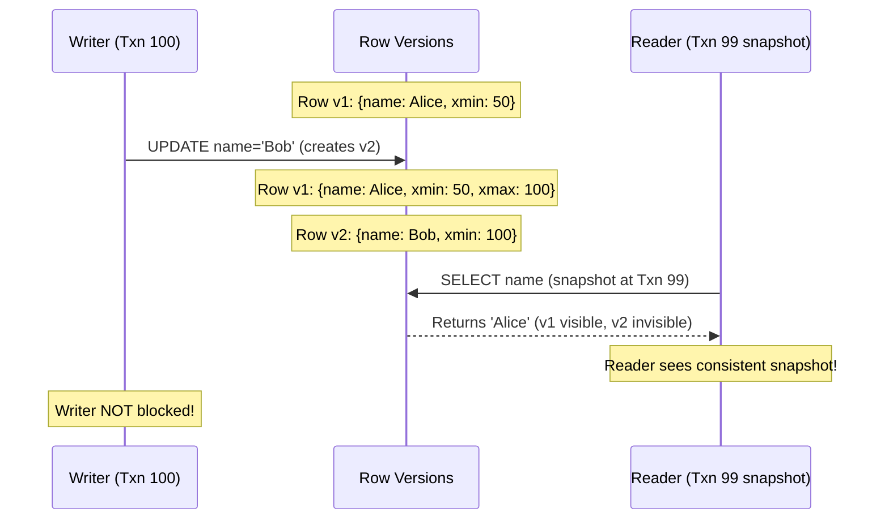
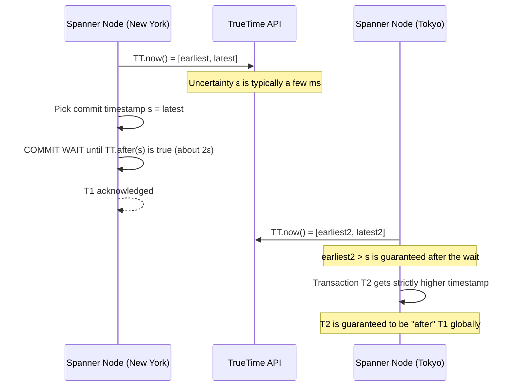

# Database Storage Engines & Advanced Structures

A database's job sounds simple — remember data, give it back correctly, don't lose
it — and almost every interesting detail in this file is a consequence of doing that
*fast*, *concurrently*, and *durably* at the same time. This file starts with what a
database actually is, then goes as deep as an L5 interview loop expects: you must
understand how data actually reaches durable storage. "Indexes make reads fast" is an
incomplete statement. You choose between B+ trees and LSM trees based on your
read/write profile, pick an isolation level knowing which anomalies it allows, and
explain how distributed databases agree and order events. Corrections of common
myths are marked **Precision note**.

## Foundations — Start Here If You're New to Databases

**What a database is.** A program whose entire job is storing data so it survives a
crash (**durability**) and can be found again quickly and correctly, even while many
clients read and write it at once. A relational database organizes data into
**tables** (like a spreadsheet): each **row** is one record, each **column** one
field, and a **primary key** is the column (or columns) that uniquely identifies a
row.

**Why indexes exist — the book-index analogy.** Without an index, finding "every row
where `email = 'x@y.com'`" means reading every single row (a **full scan**) —
correct, but slow on a large table. An **index** is a separate, smaller structure the
database keeps in sync with the table, sorted or organized so it can jump straight to
matching rows — exactly like a book's index lets you find a topic without reading
every page. The cost: every index has to be updated on every write to the columns it
covers, so indexes trade write speed for read speed. §1 covers *how* an index is
actually built (a tree, or something else), and §2 covers how to design one well.

**A query, in one sentence.** A request you send the database describing *what* data
you want (`SELECT name FROM users WHERE id = 5`) — the database decides *how* to get
it (full scan? use an index?), which is exactly the kind of decision an index makes
cheap instead of expensive.

**ACID, in one line each — what "transaction" promises:**

| Letter | Promise | Plain meaning |
|---|---|---|
| **A**tomicity | All-or-nothing | A transaction's writes either all happen or none do — no half-finished update |
| **C**onsistency | Valid state → valid state | Your application's own rules (e.g. "balance ≥ 0") are never violated by a committed transaction |
| **I**solation | Concurrent transactions don't corrupt each other | What one transaction sees isn't broken by others running at the same time — §3 is entirely about *how much* isolation you actually get |
| **D**urability | Once committed, it survives a crash | The change has reached storage that outlives a power loss, not just RAM |

**Why "durable" is harder than it sounds.** Writing to a file doesn't mean the data
is safe from a crash the instant `write()` returns — the OS may still be holding it
in memory (see `01_operating_systems_deep_dive.md` §5's page cache). Databases solve
this with a **write-ahead log (WAL)**: before changing the actual data files, append
a durable record of the change to a log first, so a crash mid-write can be replayed
and recovered from. Every storage engine in §1 relies on some form of this.

**One database, many clients, at the same time.** A single database file or table is
routinely read and written by hundreds of connections simultaneously. §2's MVCC and
§3's isolation levels are both answers to the same question: how do you let that
happen fast, without one client's half-finished write corrupting what another client
reads?

With that vocabulary — table/row/index/transaction/WAL — the rest of this file is
the precise, L5-depth version of how real storage engines and distributed databases
actually deliver on it.

## 1. Storage Engines: The Physics of Storage
HDDs pay a mechanical **seek** (milliseconds) for random I/O, so sequential I/O is dramatically faster. **Precision note:** SSDs have no seek, and random reads are fast; the issues with random *writes* on SSDs are erase-block management, garbage collection, and device-level write amplification, which hurt latency consistency and endurance. Sequential, append-oriented write patterns still help on both.

```arch
%% caption: A B+ tree updates fixed-size pages in place and links its leaves for range scans; an LSM tree appends to memory and compacts sorted files on disk.
route straight
grid 190x95
group bt "B+ Tree (read-optimized)" color=blue icon=tree
node r1 "Root page" at 1,0 in bt color=blue
node l1 "Leaf page 1" at 0,1 in bt color=blue
node l2 "Leaf page 2" at 1,1 in bt color=blue
node l3 "Leaf page 3" at 2,1 in bt color=blue
group lsm "LSM Tree (write-optimized)" color=green icon=layers
node w "Write" at 3.1,0 in lsm shape=pill color=slate
node mt "MemTable" at 3.1,1 in lsm color=orange sub="RAM"
node s1 "SSTable L0" at 3.1,2 in lsm color=green sub="disk"
node s2 "SSTable L1" at 3.1,3 in lsm color=green sub="disk"
node s3 "SSTable L2" at 3.1,4 in lsm color=green sub="disk"
r1 -> l1
r1 -> l2
r1 -> l3
l1 <-> l2 : "linked list"
l2 <-> l3 : "linked list"
w -> mt : "append"
mt -> s1 : "flush when full"
s1 -> s2 : "compact"
s2 -> s3 : "compact"
```

<div class="lab" data-viz="lsm-tree"></div>

### B+ Trees (Read-Optimized)
*Used by: PostgreSQL (heap + B-tree indexes), MySQL InnoDB (clustered B+ tree), Oracle, SQL Server.*
*   **The Structure:** A balanced tree of fixed-size pages (8 KB in Postgres, 16 KB in InnoDB). Internal pages hold keys and child pointers; leaf pages hold entries and are linked to their siblings. High fan-out (hundreds of keys per page) keeps height at 3-4 even for billions of rows.
*   **The Read Path:** `O(log N)` page reads, usually mostly cached. Sibling links make range scans (`WHERE age BETWEEN 20 AND 30`) efficient.
*   **The Write Path:** Updates modify pages in place (plus WAL). A full leaf **splits**, updating the parent. Writing a 50-byte change means rewriting at least one whole page (plus the WAL record, and in some engines a full-page image after a checkpoint to protect against torn writes). Random page writes plus fragmentation are the costs.

### LSM Trees (Log-Structured Merge-Tree)
*Used by: Bigtable, LevelDB, RocksDB, Cassandra, ScyllaDB, HBase.*
*   **The Write Path:** A write is appended to the **WAL** for durability and inserted into an in-memory sorted **MemTable**. When full (e.g., 64 MB), the MemTable is flushed as an immutable sorted file, an **SSTable**. Writes are sequential and fast.
*   **Compaction:** Background merges combine SSTables, drop overwritten values and **tombstones** (deletion markers), and keep the number of files a read must check bounded.
*   **Precision note — write amplification is NOT near zero.** The *ingest* is sequential, but compaction rewrites the same data repeatedly as it moves down levels. Leveled compaction (RocksDB default) commonly shows write amplification around **10-30x**; size-tiered compaction lowers write amplification but raises space and read amplification. The LSM advantage is that this rewriting is sequential, batched, and in the background, so front-end write throughput stays high.
*   **The Read Path:** Check the MemTable, then SSTables newest to oldest. Mitigations: **Bloom filters** per SSTable, block indexes, block cache, and compaction.

### The RUM trade-off
You can optimize at most two of **Read** amplification, **Update/write** amplification, and **Memory/space** amplification.

| Engine | Read amp | Write amp | Space amp | Best for |
|---|---|---|---|---|
| B+ tree | Low | Medium (page rewrites) | Medium (fragmentation, fill factor) | Read-heavy OLTP, range scans |
| LSM, leveled compaction | Medium | High (compaction) | Low | Write-heavy with decent reads |
| LSM, size-tiered | Higher | Lower | High (temporarily 2x during compaction) | Very write-heavy ingest |

## 2. Advanced Data Structures in Databases

### Bloom Filters
How does an LSM tree avoid opening dozens of SSTables for a key that doesn't exist?
*   A bit array plus k hash functions. Insert sets k bits; lookup checks them.
*   **No false negatives:** if any bit is 0, the key is definitely absent.
*   **False positives possible:** all k bits can be set by other keys. With about 10 bits per key and optimal k, the false-positive rate is about 1%.
*   Can't delete (use counting Bloom filters or cuckoo filters if needed).
*   *L5 usage:* one filter per SSTable in memory; "no" skips that file entirely. More probabilistic structures (HyperLogLog, count-min sketch) are in `SystemDesign/building_blocks/20_specialized_data_structures.md`.

### Indexes you should be able to design
*   **Composite index `(a, b, c)`:** usable for predicates on a prefix: `a`, `a,b`, `a,b,c`, and for `ORDER BY` that follows the same order. Not usable for `b` alone.
*   **Covering index:** contains every column a query needs, so the database answers from the index alone (Postgres "index-only scan", InnoDB secondary index including the PK, SQL Server `INCLUDE` columns). Eliminates the extra lookup into the table per row.
*   **Clustered vs secondary:** InnoDB stores rows *in* the primary-key B+ tree; secondary indexes store the PK and require a second lookup. Postgres stores rows in a heap and all indexes point to heap tuples.
*   **Other index types:** hash (equality only), GIN/inverted (full-text, arrays, JSON), GiST/R-tree (geospatial), BRIN (block ranges on naturally ordered data like timestamps).
*   **Cost:** each index is written on every insert/update of indexed columns. Index for real queries; verify with `EXPLAIN ANALYZE`.

### Multi-Version Concurrency Control (MVCC)
How does PostgreSQL let readers and writers proceed concurrently without table locks?


*   An update writes a **new version** of the row stamped with the writing transaction's ID (`xmin`) and marks the old version's `xmax`.
*   A transaction's **snapshot** records which transactions were committed when it started. A version is visible if its creator committed before the snapshot and its deleter didn't.
*   *Benefit:* readers don't block writers and writers don't block readers. **Precision note:** writers still block other writers on the *same row* (row locks), and serializable isolation may abort transactions.
*   *Cost:* dead versions accumulate. PostgreSQL's `VACUUM` reclaims them; long-running transactions prevent cleanup and cause table bloat. InnoDB keeps old versions in undo logs instead.
*   The same idea in miniature: `PyDSA/25_design/012_snapshot_array_solution.py`.

## 3. Isolation Levels and the Anomalies They Allow

| Anomaly | What happens |
|---|---|
| Dirty read | Read another transaction's uncommitted write |
| Non-repeatable read | Read the same row twice, get different committed values |
| Phantom | Re-run a range query, new rows appear |
| Lost update | Two read-modify-write cycles; one overwrites the other |
| Write skew | Two transactions read overlapping data, write *different* rows, and together break an invariant (two on-call doctors both go off call) |

| Level | Dirty read | Non-repeatable | Phantom | Lost update | Write skew |
|---|---|---|---|---|---|
| Read uncommitted | possible | possible | possible | possible | possible |
| Read committed (Postgres default) | prevented | possible | possible | possible | possible |
| Repeatable read (MySQL default; Postgres implements as snapshot isolation) | prevented | prevented | possible in SQL standard; prevented by SI snapshots for reads | prevented in Postgres RR (aborts); possible in MySQL RR without locking reads | **possible** |
| Snapshot isolation | prevented | prevented | prevented for reads | prevented (first committer wins) | **possible** |
| Serializable (Postgres SSI, Spanner) | prevented | prevented | prevented | prevented | prevented |

Practical defenses below serializable: atomic conditional updates (`UPDATE ... WHERE available >= :qty`), `SELECT ... FOR UPDATE`, unique/check/exclusion constraints, or optimistic version columns. Details: `SystemDesign/building_blocks/11_transactions_and_concurrency.md`.

## 4. Choosing a Database Family

| Family | Examples | Data model | Choose when | Watch out for |
|---|---|---|---|---|
| Relational | PostgreSQL, MySQL, Spanner, CockroachDB | Tables, joins, constraints, transactions | Default for business data with invariants | Scaling writes past one node needs sharding or NewSQL |
| Key-value | Redis, DynamoDB, Bigtable-as-KV, etcd | Opaque value by key | Known access by key, very high QPS | No ad-hoc queries |
| Wide-column | Bigtable, Cassandra, HBase | Row key → sparse column families, sorted by key | Massive write-heavy time-series, per-entity histories | Row key design is everything; hot-spotting on sequential keys |
| Document | MongoDB, Firestore | JSON-like documents | Self-contained aggregates, flexible schemas | Cross-document invariants and joins |
| Graph | Neo4j, Spanner Graph | Nodes and edges | Multi-hop relationship queries | Sharding graphs is hard |
| Search | Elasticsearch, OpenSearch | Inverted index | Full-text, faceted search | Not a source of truth |
| Analytical / columnar | BigQuery (Dremel), ClickHouse, Snowflake | Columnar storage | Aggregations over billions of rows | Not for point OLTP writes |
| Time-series | Monarch, Prometheus, InfluxDB | (series, timestamp) → value | Metrics, downsampling, retention | Cardinality explosions |

**Normalization vs denormalization:** normalize the source of truth so each fact lives in one place (no update anomalies); denormalize *derived* read models (materialized views, caches, search indexes) for read speed, and own the process that keeps them in sync.

## 5. Replication Essentials

*   **Single leader:** all writes to the leader, replicated to followers. **Synchronous** replication (wait for followers) gives durability on failover but adds latency and blocks if a follower is down; **asynchronous** is fast but loses the unreplicated tail on failover. Most systems use semi-synchronous or quorum commit.
*   **Replication lag anomalies:** read-your-writes violations, non-monotonic reads (reading from a more-lagged replica after a less-lagged one). Fix with primary reads after writes, replica-position tracking, or sticky replicas.
*   **Multi-leader:** writes in multiple regions; concurrent conflicting writes need resolution (last-write-wins loses data; CRDTs or application merge logic preserve it).
*   **Leaderless (Dynamo-style):** clients write to W of N replicas and read from R; **R + W > N** makes read and write quorums overlap so a read sees the latest acknowledged write (barring sloppy quorums and concurrent writes). Repair via read repair, hinted handoff, and Merkle-tree anti-entropy. See `SystemDesign/building_blocks/19_consensus_and_coordination.md`.
*   **Failover dangers:** split brain (two leaders), lost async writes, clients caching the old leader. Leases, fencing tokens, and consensus-based leader election prevent split brain.

## 6. Distributed Consensus & Clocks

You know CAP (during a partition, choose consistency or availability). **PACELC** adds: *else*, when there's no partition, choose between latency and consistency.

### Paxos vs. Raft
Both let a cluster agree on a replicated log despite node failures, as long as a **majority** is alive (5 nodes tolerate 2 failures).
*   **Raft (etcd, Consul, CockroachDB, TiKV):** designed for understandability. A leader is elected with randomized election timeouts; the leader appends entries and commits them once a majority acknowledges; terms prevent stale leaders from committing.
*   **Paxos / Multi-Paxos (Chubby, Spanner):** the original. Single-decree Paxos agrees on one value with prepare/accept phases; Multi-Paxos elects a stable leader to skip the prepare phase for a sequence of values. Raft is essentially an opinionated, fully specified Multi-Paxos variant. The difficulty in practice is everything around the core algorithm: membership changes, log compaction, snapshots.
*   **What consensus is not:** it doesn't make your whole system linearizable by magic, and it's too slow to put on every request path. Use it for metadata, leases, configuration, and leader election.

### Spanner and TrueTime
How does Spanner provide **external consistency** (serializable with commit timestamps that respect real-time order) across continents?


*   **The Problem:** Clocks drift. With NTP, uncertainty between servers can be tens to hundreds of milliseconds, so wall-clock timestamps from different machines can't order events safely.
*   **TrueTime:** Google runs time masters in every datacenter backed by **GPS receivers and atomic clocks**. `TT.now()` returns an interval `[earliest, latest]` guaranteed to contain true time. The paper reports the uncertainty bound ε typically between about 1 and 7 ms.
*   **The Commit Wait:** A transaction picks commit timestamp `s ≥ TT.now().latest`, then waits until `TT.now().earliest > s` (about 2ε) before making the commit visible. After that, every machine's clock reading is past `s`, so any later transaction gets a larger timestamp. Snapshot reads at a timestamp are then lock-free and globally consistent.
*   Spanner also uses **two-phase commit over Paxos groups** for multi-shard transactions — each participant is itself a replicated Paxos group, which avoids 2PC's classic "coordinator dies and participants block" problem.

### Logical clocks when you don't have TrueTime
*   **Lamport clocks:** a counter incremented on each event and bumped to `max(local, received) + 1` on receive. Gives a total order consistent with causality, but can't detect concurrency.
*   **Vector clocks:** one counter per node; can tell "happened before" from "concurrent" (used for conflict detection in Dynamo-style stores).
*   **Hybrid Logical Clocks (HLC):** physical time plus a logical counter (CockroachDB, YugabyteDB) — close to wall clock, causally correct.

## Interview checklist

- [ ] I can compare B+ trees and LSM trees including compaction's real write amplification.
- [ ] I can design a composite and a covering index for a given query.
- [ ] I can name the isolation anomalies and which level allows write skew.
- [ ] I can pick a database family for five systems and defend each against an alternative.
- [ ] I can explain R + W > N, replication lag anomalies, and split brain.
- [ ] I can explain Raft's leader election and commit rule, and TrueTime's commit wait.

Related: `SystemDesign/building_blocks/05_databases.md`, `06_database_internals.md`, `11_transactions_and_concurrency.md`, `19_consensus_and_coordination.md`, `24_google_papers.md`.
