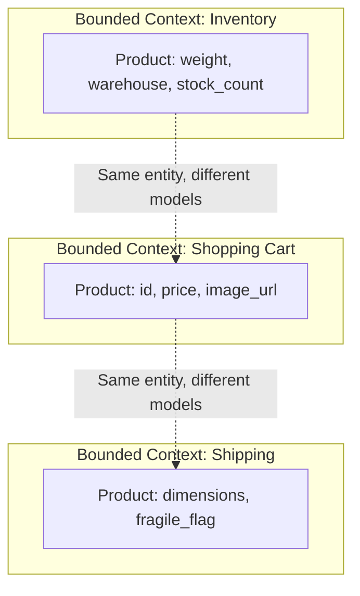
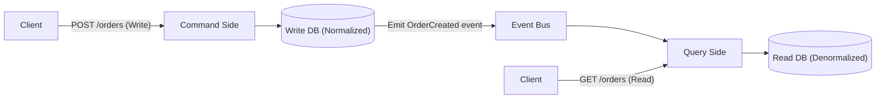
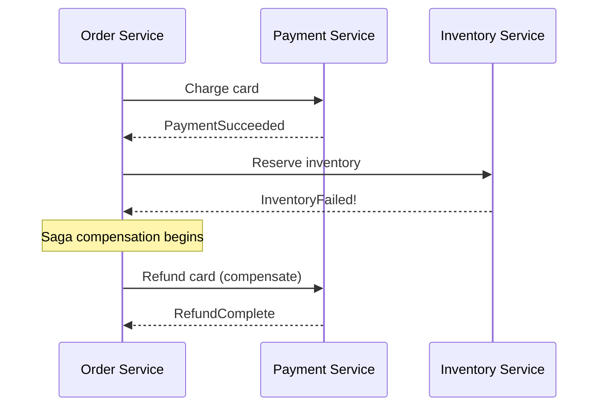

# L5 Deep Dive: Software Engineering & Architecture

At the L5 level, you are expected to design systems that span multiple teams and evolve safely over years. Design patterns (Factory, Singleton) are table stakes; this file covers macro-architecture: boundaries, events, distributed transactions, and API evolution.

For the micro level (complexity, deep modules, naming, errors), read `SoftwareDesign/01_philosophy_of_software_design.md`. For SOLID and patterns, read `SystemDesign/best_practices/`.

## 1. Domain-Driven Design (DDD)

When a monolith becomes too complex, teams often split it into microservices arbitrarily (a service per noun). The result is a **distributed monolith**: every simple change touches five services, deployed in lockstep, with network calls where function calls used to be.

**DDD prevents this by drawing boundaries around business capabilities:**

*   **Ubiquitous Language:** Engineers and domain experts use the same terms in conversation and in code. If the business says "Client" and the code says "User", every conversation needs a translation, and translations breed bugs.
*   **Bounded Contexts:** A boundary within which a model is consistent. A "Product" in Inventory has weight and warehouse location; in Cart it has price and image. *Don't force one `Product` class to serve every context.* Contexts communicate through explicit contracts (APIs, events) and translation at the edge (an **anti-corruption layer** when integrating a legacy or external model).
*   **Aggregates:** A cluster of objects changed together as one consistency unit, accessed through its **Aggregate Root** (e.g., `Order` owns its `OrderItem`s). Invariants ("total equals the sum of items", "no more than 10 items") are enforced inside one aggregate within one transaction. Across aggregates, accept eventual consistency. Keep aggregates small; a huge aggregate becomes a lock-contention hotspot.
*   **Heuristic for service boundaries:** things that change together and must be consistent together belong together. Split along lines where eventual consistency is acceptable to the business.

## 2. Event-Driven Architectures

Synchronous request chains create **temporal coupling**: if service B is down or slow, A fails or slows too, and availability multiplies (three 99.9% services in series ≈ 99.7%).

### Events vs commands
*   **Command:** "ChargeCard" — addressed to one handler, expects it to happen, can be rejected.
*   **Event:** "OrderPlaced" — a fact that already happened, published to anyone interested; the publisher doesn't know the consumers.

Events decouple teams but make flows harder to see. Use them where the publisher genuinely shouldn't care who reacts.

### The Transactional Outbox
The classic bug: write to the database, then publish to Kafka. If the process crashes between the two, the event is lost (or published without the write). Fix: write the business change **and** an outbox row in the **same local transaction**; a relay (polling or change data capture) publishes outbox rows and marks them sent. Delivery becomes at-least-once, so consumers must be **idempotent** (dedupe by event ID).

### Event Sourcing
Instead of storing current state (`UPDATE account SET balance = 50`), store an append-only log of events (`AccountOpened`, `Deposited 100`, `Withdrew 50`) and derive state by replay.
*   **Pros:** Complete audit trail; reconstruct state at any past time; rebuild or add read models by replaying.
*   **Cons:** Schema evolution of events over years (upcasting), snapshotting for long streams, GDPR deletion in an immutable log (crypto-shredding: encrypt per-subject data and delete the key), and a steep learning curve. Use it where the history *is* the product (ledgers, audit-heavy domains), not by default.

### CQRS (Command Query Responsibility Segregation)
Often paired with event sourcing, but independent of it.

*   **The Problem:** The model that enforces write invariants is rarely the shape that serves UI reads fast.
*   **CQRS:** The command side validates and writes to the write store and emits events; the query side consumes them into denormalized read models (search index, cache, materialized views).
*   **Cost:** read models are eventually consistent. The UI must handle "I just placed an order and it isn't in my list yet" (read-your-writes via the command response, or wait for projection offset).

## 3. Distributed Transactions: 2PC and Sagas

An order needs to reserve inventory (Inventory service) and charge a card (Payment service). They don't share a database, so one local `BEGIN ... COMMIT` can't cover both.

### Two-Phase Commit (2PC)
A coordinator asks every participant to **prepare** (durably promise it can commit, holding locks), then tells all to **commit** (or abort).
*   **Weaknesses:** locks are held across network round-trips; if the coordinator fails after prepare, participants **block** holding locks until it recovers; every participant must support the protocol (many message brokers and third-party APIs don't); availability is the product of all participants'.
*   **Precision note:** 2PC is not "never use." It's the right tool *inside* a database system that controls all participants and makes the coordinator highly available. **Spanner** runs 2PC across shards where each participant and the coordinator are Paxos-replicated groups, removing the blocking failure. The rule of thumb is: **avoid 2PC across independently owned microservices and external APIs**, where you can't make every participant replicated and protocol-aware.

### The Saga Pattern
A saga is a sequence of local transactions. Each step commits locally and triggers the next; if a step fails, **compensating transactions** semantically undo earlier steps.

*   **Choreography (decentralized):** Order emits `OrderCreated`; Payment reacts and emits `PaymentSucceeded`; Inventory reacts. *Pros:* no central component. *Cons:* flow logic is spread across services; hard to see and change past a few steps; cyclic dependencies creep in.
*   **Orchestration (centralized):** An orchestrator (a workflow engine such as Temporal, Cadence, Google Cloud Workflows, AWS Step Functions) calls each step and runs compensations on failure. *Pros:* the flow is explicit and observable. *Cons:* the orchestrator is a critical dependency and can become a "god service".
*   **Design rules:** order steps so the hardest-to-compensate step runs **last** (charge the card after reserving inventory, not before); make every step and compensation **idempotent** (retries happen); compensations can fail too, so they need retries and alerts; sagas give no isolation — other requests can see intermediate states, so use semantic locks (a `PENDING` status) where it matters.

## 4. API Evolution (Backward Compatibility)

L5 engineers don't break their clients, and they remember that mobile apps may run a years-old version.
*   **Additive changes are safe:** new optional fields, new endpoints, new enum values *if* clients tolerate unknown values.
*   **Breaking changes:** removing or renaming a field, changing a type or meaning, making an optional field required, tightening validation.
*   **Tolerant Reader:** clients ignore fields they don't recognize and don't depend on field order.
*   **Protocol Buffers rules:** never reuse or renumber a field tag; mark removed fields `reserved`; renaming is wire-safe but breaks JSON mappings and generated code; changing `int32` to `string` is breaking. Google publishes these practices as the **API Improvement Proposals (aip.dev)**.
*   **Deprecation cycle:** when a break is unavoidable, add `v2` alongside `v1`, measure who still calls `v1`, migrate them, announce a sunset date, and delete `v1` only when traffic is zero (or contractually allowed).
*   **Expand-and-contract for schema changes:** add the new column/field → dual-write → backfill → switch reads → stop writing the old one → drop it. Every step is independently deployable and reversible.

## 5. Engineering Practices That Signal Seniority

| Practice | What an L5 does |
|---|---|
| Design docs | Writes one before significant work: context, goals/non-goals, alternatives considered, trade-offs, rollout, risks. See `SoftwareDesign/13_design_docs_and_technical_leadership.md` |
| Code review | Reviews for correctness, design, and readability; keeps changes small; explains *why* |
| Testing | Unit tests for logic, a few integration tests for boundaries, contract tests between services; tests that fail for the right reason |
| Rollout | Feature flags, canaries, gradual percentage rollout, fast rollback, backward-compatible data changes |
| Monorepo and trunk-based development | Small frequent merges behind flags instead of long-lived branches (Google's model) |
| Dependency hygiene | Pin, update regularly, minimize transitive dependencies |
| Reliability ownership | SLOs for your service, runbooks, blameless postmortems with tracked action items |

## Interview checklist

- [ ] I can explain bounded contexts and aggregates and use them to justify a service split.
- [ ] I can explain the outbox pattern and why consumers must be idempotent.
- [ ] I can say when event sourcing and CQRS are worth their cost.
- [ ] I can compare 2PC and sagas precisely, including how Spanner makes 2PC safe.
- [ ] I can list breaking vs non-breaking API changes and the expand-and-contract migration.

Related: `SystemDesign/best_practices/05_architectural_patterns.md`, `SystemDesign/building_blocks/09_messaging_and_streaming.md`, `11_transactions_and_concurrency.md`; GoEngineering/PyEngineering topics 16-18.
