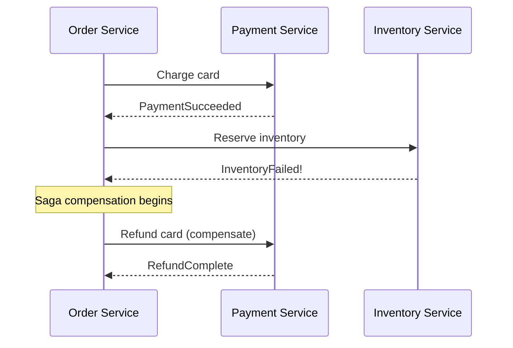

# Software Engineering & Architecture

A single program is easy to reason about: one memory space, one team, one deploy.
Software engineering at scale is what happens once a system is too big for that —
split across services, teams, and years of change — and almost every idea in this
file is a way to keep that split from turning into chaos. This chapter starts from
first principles — what "architecture" actually is, what a modern service-based
system is made of, and how a request and a change move through it — then goes as deep
as a Senior Software Engineer (L5) interview loop expects: you are expected to design
systems that span multiple teams and evolve safely over years. Design patterns
(Factory, Singleton) are table stakes; this file covers macro-architecture:
boundaries, events, distributed transactions, API evolution, resilience between
services, and shipping change safely. Corrections of common myths are marked
**Precision note**. A side-by-side breakdown of what Junior through Staff+ engineers
are expected to know closes out the chapter, just before the interview checklist.

For the micro level (complexity, deep modules, naming, errors), read [The Philosophy of Software Design](../SoftwareDesign/01_philosophy_of_software_design.md). For SOLID and patterns, read `SystemDesign/best_practices/`.

## Foundations — What Is Software Architecture, and Why Does It Matter?

### Why Architecture Exists

A program written by one person in a weekend has no architecture problem: the author
holds all of it in their head. Three things break that, and every idea in this file is
a response to one of them:

- **Size.** Past a few hundred thousand lines, nobody understands the whole system. If
  any line can call any other line, every change risks breaking something far away.
  Architecture is how you divide a system so each part can be understood — and changed
  — on its own.
- **People.** Twenty engineers can't all edit the same module safely, and five teams
  can't coordinate every deploy. **Conway's law** (1968) observes that systems end up
  mirroring the communication structure of the organisation that builds them; good
  architecture chooses boundaries that let teams work independently.
- **Time.** Requirements change for years after the first release, while old clients,
  old data and old assumptions stay around. Architecture decides which changes are
  cheap (behind a boundary) and which are expensive (across one).

So "architecture" isn't a diagram; it's the set of decisions that are **expensive to
change later**: where the boundaries are, how the parts talk, who owns which data, and
how you change a running system without breaking it.

### What a Service-Based System Actually Is

A **monolith** is one deployable program: every part of the business logic runs in the
same process, calling other parts through plain function calls. A **service-oriented**
(or **microservices**) architecture splits that logic into multiple independently
deployable programs that talk over the network instead. Neither is "correct" by
default — a monolith is simpler until a team or a scaling need outgrows it; splitting
it badly (one service per database table, say) creates a **distributed monolith**:
all the network overhead of services, none of the independence. §1 (DDD) is about
splitting along the right lines instead.

**Precision note:** the middle option is underrated. A **modular monolith** — one
deployable, but with enforced internal module boundaries and each module owning its
own tables — gets most of the design benefit of services with none of the network cost,
and can be split later along the boundaries it already has. Many successful companies
run one for years.

### The Core Components of a Service-Based System

| Component | What it's responsible for | Covered deeper in |
|---|---|---|
| **Clients** | Browsers, mobile apps, other companies' systems — they depend on your API contract and upgrade on their own schedule | §4 |
| **Edge / API gateway** | One entry point: TLS, authentication, rate limiting, routing to services | [Security Fundamentals](11_security_fundamentals_deep_dive.md), [API Design — High Level](../SystemDesign/building_blocks/03_api_design_high_level.md) |
| **Services** | Each owns one business capability (a bounded context) and its logic | §1 |
| **Service-owned databases** | Each service owns its data; others go through its API or its events, never its tables | §1, §3 |
| **Message broker / event log** | Carries commands and events asynchronously (Kafka, Pub/Sub, RabbitMQ) | §2 |
| **Workflow / orchestration** | Coordinates multi-step business processes across services | §3 |
| **Resilience layer** | Timeouts, retries, circuit breakers, bulkheads between services (library or service mesh) | §6 |
| **Delivery pipeline & observability** | CI/CD, feature flags, canaries; metrics, logs, traces and SLOs | §5, §7 |

### How the Pieces Fit Together

```arch
%% caption: A request enters through the gateway, services call each other synchronously only where they must, each owns its data, and changes fan out asynchronously as events.
grid 170x105
node web "Web / mobile" at 0.5,0 icon=mobile sub="old versions linger"
node gw "API gateway" at 0.5,1 icon=gateway sub="TLS, authn, rate limit"
group svc "Services (one bounded context each)" color=orange icon=service
node ord "Orders" at 0.5,2 in svc icon=service
node pay "Payments" at 2.5,2 in svc icon=payment
group data "Owned data" color=blue icon=db
node odb "Orders DB" at 0.5,3 in data icon=db sub="+ outbox table"
node pdb "Payments DB" at 2.5,3 in data icon=db
node bus "Event log" at 1.5,4 icon=stream sub="OrderPlaced, PaymentCaptured"
node inv "Inventory" at 0.5,5 icon=store sub="reacts to events"
node mail "Notifications" at 2.5,5 icon=email sub="reacts to events"
web -> gw
gw -> ord
ord:R -> pay:L : "sync: charge"
ord -> odb
pay -> pdb
odb ..> bus : "outbox relay"
bus ..> inv
bus ..> mail
```

Read it as two kinds of arrows. **Solid** arrows are synchronous calls: the caller
waits, so every one of them adds latency and a way to fail (§6). **Dashed** arrows are
asynchronous events: the publisher doesn't wait and doesn't know who listens (§2).
Each service's database sits inside its own boundary; nothing else reads it directly.
A good design uses synchronous calls only where the caller truly needs the answer now.

### Why Boundaries, Events, Sagas, and Contracts All Exist

- **Synchronous request vs. asynchronous event.** When service A calls service B and
  *waits* for the answer, that's a **synchronous** call — simple to follow, but A is now
  stuck if B is slow or down (**temporal coupling**). When A instead publishes "this
  happened" and moves on, letting any interested service react whenever it's ready,
  that's an **asynchronous event** — more resilient to one service being slow, harder to
  trace end to end. §2 covers this style and its trade-offs.
- **Why "it works with one service" gets hard with several.** A single database gives
  you a transaction: multiple writes that all succeed or all fail together (see
  [Database Storage Engines & Advanced Structures](03_databases_deep_dive.md)'s ACID). Once "reserve inventory" and "charge a card" are
  two *different* services with two different databases, there's no single transaction
  that covers both — §3 is about how to still make that operation safe.
- **What an API contract is.** An **API** is the agreed-upon shape of a request and
  response between two services (or a service and its clients): which fields exist,
  what they mean, what's required. Once other teams (or other companies' apps) depend
  on that shape, changing it can break them — §4 is about changing an API without
  breaking the programs that already depend on it.
- **Why the network changes everything.** A function call either returns or throws. A
  network call can also *time out with the work done*, succeed twice after a retry, or
  hang forever. The **fallacies of distributed computing** (the network is reliable,
  latency is zero, bandwidth is infinite, …) are the assumptions a monolith lets you
  make and services don't; §6 is the toolkit for living without them.

### Architecture Styles, Side by Side

| Style | Deployables | Strength | Cost | Fits |
|---|---|---|---|---|
| **Monolith** | One | Simplest to build, test, debug, and deploy; one transaction for everything | Every team shares one release; scaling is all-or-nothing | New products, small teams |
| **Modular monolith** | One, with enforced module boundaries | Clear ownership without network cost; splits cleanly later | Needs discipline (build-time dependency checks) to keep boundaries | Most mid-sized products |
| **Microservices** | Many, owned by different teams | Independent deploys and scaling per capability; team autonomy | Network failures, distributed data, observability and platform overhead | Many teams, distinct scaling needs |
| **Event-driven** | Many, loosely coupled by events | Publishers don't know consumers; easy to add new reactions | Flows are hard to see; eventual consistency everywhere | Workflows with many independent reactions |
| **Serverless (functions)** | Many small functions | No servers to manage; scales to zero | Cold starts, execution limits, vendor coupling | Spiky, event-triggered work |

Inside any one deployable, **layered** (controller → service → repository) and
**hexagonal / ports-and-adapters** (domain core with interfaces; databases and HTTP
are adapters plugged in at the edge) are the common internal shapes; see
[Application Architecture in Code](../SoftwareDesign/08_application_architecture_in_code.md).

### Vocabulary You'll Meet Below, in One Table

| Term | One-line meaning |
|---|---|
| Service / microservice | An independently deployable unit talking to others over the network |
| Distributed monolith | Services split along the wrong lines: all the network cost, none of the independence |
| Bounded context | A boundary inside which one model and one vocabulary are consistent |
| Synchronous call | Caller waits for the response before continuing |
| Event | A published fact ("this happened"); publisher doesn't know or wait for consumers |
| Idempotent | Doing it twice has the same effect as doing it once |
| Saga | A multi-service operation made of local transactions plus compensations |
| API contract | The agreed shape of a request/response between two systems |
| Breaking change | An API change that an existing client can no longer handle correctly |
| Circuit breaker | A client-side switch that stops calling a failing dependency for a while |
| Canary | Releasing a change to a small slice of traffic first and comparing it with the rest |

With that vocabulary, the rest of this file is the precise, L5-depth version of how
to draw those service boundaries, coordinate them safely, keep them up when their
neighbours fail, and evolve them over time.

## 1. Domain-Driven Design (DDD)

When a monolith becomes too complex, teams often split it into microservices arbitrarily (a service per noun). The result is a **distributed monolith**: every simple change touches five services, deployed in lockstep, with network calls where function calls used to be.

**DDD prevents this by drawing boundaries around business capabilities:**

```arch
%% caption: One real-world "Product", three bounded contexts, three different models; each context keeps only what it needs.
grid 240x110
group inv "Bounded Context: Inventory" color=blue icon=store
node p1 "Product" at 0,0 in inv shape=card icon=package sub="weight, warehouse, stock_count"
group cart "Bounded Context: Shopping Cart" color=orange icon=cart
node p2 "Product" at 0,1 in cart shape=card icon=package sub="id, price, image_url"
group ship "Bounded Context: Shipping" color=green icon=delivery
node p3 "Product" at 0,2 in ship shape=card icon=package sub="dimensions, fragile_flag"
p1 ..> p2 : "same entity, different models"
p2 ..> p3 : "same entity, different models"
```
*   **Ubiquitous Language:** Engineers and domain experts use the same terms in conversation and in code. If the business says "Client" and the code says "User", every conversation needs a translation, and translations breed bugs.
*   **Bounded Contexts:** A boundary within which a model is consistent. A "Product" in Inventory has weight and warehouse location; in Cart it has price and image. *Don't force one `Product` class to serve every context.* Contexts communicate through explicit contracts (APIs, events) and translation at the edge (an **anti-corruption layer** when integrating a legacy or external model).
*   **Aggregates:** A cluster of objects changed together as one consistency unit, accessed through its **Aggregate Root** (e.g., `Order` owns its `OrderItem`s). Invariants ("total equals the sum of items", "no more than 10 items") are enforced inside one aggregate within one transaction. Across aggregates, accept eventual consistency. Keep aggregates small; a huge aggregate becomes a lock-contention hotspot.
*   **Heuristic for service boundaries:** things that change together and must be consistent together belong together. Split along lines where eventual consistency is acceptable to the business.

## 2. Event-Driven Architectures

Synchronous request chains create **temporal coupling**: if service B is down or slow, A fails or slows too, and availability multiplies (three 99.9% services in series ≈ 99.7%).

### Events vs commands
*   **Command:** "ChargeCard" — addressed to one handler, expects it to happen, can be rejected.
*   **Event:** "OrderPlaced" — a fact that already happened, published to anyone interested; the publisher doesn't know the consumers.

Events decouple teams but make flows harder to see. Use them where the publisher genuinely shouldn't care who reacts.

### The Transactional Outbox
The classic bug: write to the database, then publish to Kafka. If the process crashes between the two, the event is lost (or published without the write). Fix: write the business change **and** an outbox row in the **same local transaction**; a relay (polling or change data capture) publishes outbox rows and marks them sent. Delivery becomes at-least-once, so consumers must be **idempotent** (dedupe by event ID).

```arch
%% caption: The business row and the outbox row commit in one local transaction; a relay publishes afterwards, and the consumer dedupes by event ID in its own transaction.
grid 165x100
group os "Order service" color=orange icon=service
node api "Order API" at 0,0 in os icon=service
node odb "Orders DB" at 1,0 in os icon=db sub="orders + outbox, one txn"
node rel "Outbox relay" at 1,1 in os icon=worker sub="poll or CDC"
node bus "Broker" at 2,1 icon=stream sub="at-least-once"
group is "Inventory service" color=blue icon=store
node con "Consumer" at 2,2 in is icon=worker
node idb "Inventory DB" at 1,2 in is icon=db sub="processed IDs + effect, one txn"
api -> odb : "INSERT both"
odb -> rel : "unsent rows"
rel -> bus : "publish"
bus -> con
con -> idb : "dedupe by event_id"
```

A runnable version of both halves, with SQLite standing in for each service's
database. The relay crashes after publishing but before marking the row sent, so the
event goes out twice — and the consumer's dedupe table absorbs it
(`python3 outbox.py`):

```python
"""Transactional outbox + idempotent consumer, with SQLite standing in for both services' databases."""
import json
import sqlite3
import uuid

orders = sqlite3.connect(":memory:")            # the Order service's database
orders.executescript("""
    CREATE TABLE orders (id TEXT PRIMARY KEY, item TEXT, qty INT);
    CREATE TABLE outbox (event_id TEXT PRIMARY KEY, payload TEXT, sent INT DEFAULT 0);
""")

def place_order(item, qty):
    order_id = str(uuid.uuid4())
    with orders:                                 # ONE local transaction: both rows or neither
        orders.execute("INSERT INTO orders VALUES (?, ?, ?)", (order_id, item, qty))
        event = {"type": "OrderPlaced", "order_id": order_id, "item": item, "qty": qty}
        orders.execute("INSERT INTO outbox (event_id, payload) VALUES (?, ?)",
                       (str(uuid.uuid4()), json.dumps(event)))
    return order_id

broker = []                                      # stand-in for Kafka / Pub/Sub

def relay(crash_before_mark=False):
    rows = orders.execute("SELECT event_id, payload FROM outbox WHERE sent = 0").fetchall()
    for event_id, payload in rows:
        broker.append((event_id, payload))       # publish ...
        if crash_before_mark:
            return                               # ... and die before marking it sent
        with orders:
            orders.execute("UPDATE outbox SET sent = 1 WHERE event_id = ?", (event_id,))

inventory = sqlite3.connect(":memory:")         # the Inventory service's database
inventory.executescript("""
    CREATE TABLE stock (item TEXT PRIMARY KEY, reserved INT);
    CREATE TABLE processed (event_id TEXT PRIMARY KEY);
    INSERT INTO stock VALUES ('book', 0);
""")

def consume(event_id, payload):
    event = json.loads(payload)
    try:
        with inventory:                          # dedupe row + effect in ONE transaction
            inventory.execute("INSERT INTO processed VALUES (?)", (event_id,))
            inventory.execute("UPDATE stock SET reserved = reserved + ? WHERE item = ?",
                              (event["qty"], event["item"]))
    except sqlite3.IntegrityError:
        print(f"  duplicate {event_id[:8]} ignored")

place_order("book", 2)
relay(crash_before_mark=True)                    # published, but outbox row still sent = 0
relay()                                          # restart: publishes the SAME event again
print("messages on broker:", len(broker))        # 2 -> at-least-once delivery
for event_id, payload in broker:
    consume(event_id, payload)
print("reserved:", inventory.execute("SELECT reserved FROM stock").fetchone()[0])  # 2, not 4
```

Output (verified with Python 3.11; the event ID is random):

```text
messages on broker: 2
  duplicate 0c5a4b27 ignored
reserved: 2
```

The dedupe row and the stock update commit in **one** transaction. If they were
separate, a crash between them would either lose the effect or apply it twice.

<div class="lab" data-viz="flow-outbox"></div>

### Event Sourcing
Instead of storing current state (`UPDATE account SET balance = 50`), store an append-only log of events (`AccountOpened`, `Deposited 100`, `Withdrew 50`) and derive state by replay.
*   **Pros:** Complete audit trail; reconstruct state at any past time; rebuild or add read models by replaying.
*   **Cons:** Schema evolution of events over years (upcasting), snapshotting for long streams, GDPR deletion in an immutable log (crypto-shredding: encrypt per-subject data and delete the key), and a steep learning curve. Use it where the history *is* the product (ledgers, audit-heavy domains), not by default.

### CQRS (Command Query Responsibility Segregation)
Often paired with event sourcing, but independent of it.

```arch
%% caption: CQRS: writes go through the command side to a normalized store; events build a denormalized read model the query side serves.
grid 190x120
node client "Client" at 0,0 icon=client
node client2 "Client" at 0,1 icon=client
group cs "Command side" color=orange icon=edit
node cmd "Command Side" at 1,0 in cs icon=service
node wdb "Write DB" at 2,0 in cs icon=db sub="normalized"
node bus "Event Bus" at 2,1 icon=event
group qs_g "Query side" color=blue icon=search
node qs "Query Side" at 1,1 in qs_g icon=service
node rdb "Read DB" at 1,2 in qs_g icon=db sub="denormalized"
client -> cmd : "POST /orders (write)"
cmd -> wdb
wdb -> bus : "emit OrderCreated"
bus -> qs
qs -> rdb
client2 -> qs : "GET /orders (read)"
```
*   **The Problem:** The model that enforces write invariants is rarely the shape that serves UI reads fast.
*   **CQRS:** The command side validates and writes to the write store and emits events; the query side consumes them into denormalized read models (search index, cache, materialized views).
*   **Cost:** read models are eventually consistent. The UI must handle "I just placed an order and it isn't in my list yet" (read-your-writes via the command response, or wait for projection offset).

## 3. Distributed Transactions: 2PC and Sagas

An order needs to reserve inventory (Inventory service) and charge a card (Payment service). They don't share a database, so one local `BEGIN ... COMMIT` can't cover both.

### Two-Phase Commit (2PC)
A coordinator asks every participant to **prepare** (durably promise it can commit, holding locks), then tells all to **commit** (or abort).
*   **Weaknesses:** locks are held across network round-trips; if the coordinator fails after prepare, participants **block** holding locks until it recovers; every participant must support the protocol (many message brokers and third-party APIs don't); availability is the product of all participants'.
*   **Precision note:** 2PC is not "never use." It's the right tool *inside* a database system that controls all participants and makes the coordinator highly available. **Spanner** runs 2PC across shards where each participant and the coordinator are Paxos-replicated groups, removing the blocking failure. The rule of thumb is: **avoid 2PC across independently owned microservices and external APIs**, where you can't make every participant replicated and protocol-aware.

### The Saga Pattern
A saga is a sequence of local transactions. Each step commits locally and triggers the next; if a step fails, **compensating transactions** semantically undo earlier steps.


```mermaid
sequenceDiagram
    participant O as Order Service
    participant P as Payment Service
    participant I as Inventory Service
    
    O->>P: Charge card
    P-->>O: PaymentSucceeded
    O->>I: Reserve inventory
    I-->>O: InventoryFailed!
    Note over O: Saga compensation begins
    O->>P: Refund card (compensate)
    P-->>O: RefundComplete
```

<div class="lab" data-viz="saga-pattern"></div>

*   **Choreography (decentralized):** Order emits `OrderCreated`; Payment reacts and emits `PaymentSucceeded`; Inventory reacts. *Pros:* no central component. *Cons:* flow logic is spread across services; hard to see and change past a few steps; cyclic dependencies creep in.
*   **Orchestration (centralized):** An orchestrator (a workflow engine such as Temporal, Cadence, Google Cloud Workflows, AWS Step Functions) calls each step and runs compensations on failure. *Pros:* the flow is explicit and observable. *Cons:* the orchestrator is a critical dependency and can become a "god service".
*   **Design rules:** order steps so the hardest-to-compensate step runs **last** (charge the card after reserving inventory, not before); make every step and compensation **idempotent** (retries happen); compensations can fail too, so they need retries and alerts; sagas give no isolation — other requests can see intermediate states, so use semantic locks (a `PENDING` status) where it matters.

## 4. API Evolution (Backward Compatibility)

L5 engineers don't break their clients, and they remember that mobile apps may run a years-old version.
*   **Additive changes are safe:** new optional fields, new endpoints, new enum values *if* clients tolerate unknown values.
*   **Breaking changes:** removing or renaming a field, changing a type or meaning, making an optional field required, tightening validation.
*   **Tolerant Reader:** clients ignore fields they don't recognize and don't depend on field order.
*   **Protocol Buffers rules:** never reuse or renumber a field tag; mark removed fields `reserved`; renaming is wire-safe but breaks JSON mappings and generated code; changing `int32` to `string` is breaking. Google publishes these practices as the **API Improvement Proposals (aip.dev)**.
*   **Deprecation cycle:** when a break is unavoidable, add `v2` alongside `v1`, measure who still calls `v1`, migrate them, announce a sunset date, and delete `v1` only when traffic is zero (or contractually allowed).
*   **Expand-and-contract for schema changes:** add the new column/field → dual-write → backfill → switch reads → stop writing the old one → drop it. Every step is independently deployable and reversible.

## 5. Engineering Practices That Signal Seniority

| Practice | What an L5 does |
|---|---|
| Design docs | Writes one before significant work: context, goals/non-goals, alternatives considered, trade-offs, rollout, risks. See [Design Docs and Technical Leadership](../SoftwareDesign/13_design_docs_and_technical_leadership.md) |
| Code review | Reviews for correctness, design, and readability; keeps changes small; explains *why* |
| Testing | Unit tests for logic, a few integration tests for boundaries, contract tests between services; tests that fail for the right reason |
| Rollout | Feature flags, canaries, gradual percentage rollout, fast rollback, backward-compatible data changes |
| Monorepo and trunk-based development | Small frequent merges behind flags instead of long-lived branches (Google's model) |
| Dependency hygiene | Pin, update regularly, minimize transitive dependencies |
| Reliability ownership | SLOs for your service, runbooks, blameless postmortems with tracked action items |

## 6. Resilience Between Services

**Why this matters:** in a system of services, *some* dependency is always slow or
failing. The question isn't whether, but whether one sick service takes the others
down with it. Most large outages are **cascading failures**: a slow dependency makes
callers hold threads and connections longer, their pools fill, they become slow, and
the slowness climbs the call graph. Every tool below exists to stop that climb.

```arch
%% caption: Each outbound call passes through a deadline, a bounded pool, a circuit breaker and a retry policy before it touches the network.
grid 165x100
node caller "Handler" at 0,0 icon=service sub="has a request deadline"
group guard "Client-side resilience" color=purple icon=shield
node to "Timeout" at 1,0 in guard icon=timer sub="≤ remaining deadline"
node bh "Bulkhead" at 2,0 in guard icon=layers sub="bounded pool per dependency"
node cb "Circuit breaker" at 2,1 in guard icon=gauge sub="fail fast when open"
node rt "Retry" at 1,1 in guard icon=sync sub="backoff + jitter, budget"
node dep "Dependency" at 1,2 icon=server sub="may be slow or down"
node fb "Fallback" at 0,1 shape=card color=green sub="cached / default / degrade"
caller -> to -> bh -> cb
cb -> rt
rt -> dep
cb ..> fb : "open"
fb ..> caller
```

| Tool | What it does | Why | Gotcha |
|---|---|---|---|
| **Timeouts / deadlines** | Every network call has an upper bound; the remaining request deadline is propagated downstream (gRPC deadlines, `context.Context` in Go) | A call without a timeout can hold a thread forever | Downstream timeouts must be *shorter* than upstream ones, or the caller gives up while work continues uselessly |
| **Retries with backoff + jitter** | Retry transient failures after `random(0, min(cap, base·2^n))` | Rides out blips without a synchronized thundering herd | Retry only idempotent operations (or those with idempotency keys); retrying at every layer multiplies load (3 layers × 3 tries = 27 calls) |
| **Retry budgets** | Cap retries at a fraction of normal traffic (e.g. ~10%) | Stops retries from turning an overload into a meltdown | Needs per-client accounting |
| **Circuit breaker** | After N failures, stop calling for a cooldown; then let a trial request through (half-open) | Fails fast instead of queueing on a dead dependency; gives it room to recover | Tune thresholds per dependency; an open breaker needs a fallback or a clear error |
| **Bulkheads** | Separate, bounded pools (threads, connections, concurrency limits) per dependency | A slow dependency exhausts only its own pool | Too small a pool throttles healthy traffic |
| **Load shedding** | Reject work early (429/503) when queues exceed a bound; prioritise critical traffic | Serving some requests well beats serving all badly | Clients need to back off on 429/503 (`Retry-After`) |
| **Idempotency keys** | Client sends a unique key; server stores the result and returns it on repeats | Makes retries of non-idempotent operations (payments) safe | The key must be stored atomically with the effect |
| **Graceful degradation** | Serve a reduced experience: cached data, default recommendations, hide a widget | Partial is better than an error page | Decide the degraded modes *before* the incident |

**Precision note:** availability multiplies along synchronous chains. Three services
in series, each 99.9% available, give about 99.7%; a request fanning out to 100
backends each with a 1% chance of being slow will be slow most of the time (the "tail
at scale" effect, Dean and Barroso 2013). Hedged requests (send a second copy after the
p95 latency) and fewer synchronous hops are the structural fixes.

**Try it: the arithmetic behind the precision note.** Add downstream services in series and watch the nines drain away; add app replicas and a failover standby and watch them come back; make the cache a soft dependency and it disappears from the calculation. Then simulate a year against an SLO.

<div class="lab" data-viz="sd-availability"></div>

**Try it: why a slow dependency cascades.** Queues are where cascading failures start. Push utilization past about 80% and the response time multiplies even though every server is still working. That is why pools fill up, timeouts fire and retries arrive at exactly the moment a dependency slows down.

<div class="lab" data-viz="sd-queueing"></div>

### A runnable circuit breaker with jittered retries

`python3 resilience.py` (standard library only):

```python
"""Retry with capped exponential backoff + full jitter, behind a circuit breaker."""
import random
import time


class CircuitOpen(Exception):
    pass


class CircuitBreaker:
    """CLOSED -> (N consecutive failures) -> OPEN -> (cooldown) -> HALF_OPEN -> one trial call."""

    def __init__(self, failure_threshold=3, cooldown_s=0.5, clock=time.monotonic):
        self.threshold, self.cooldown, self.clock = failure_threshold, cooldown_s, clock
        self.state, self.failures, self.opened_at = "CLOSED", 0, 0.0

    def call(self, fn):
        if self.state == "OPEN":
            if self.clock() - self.opened_at < self.cooldown:
                raise CircuitOpen("fail fast: dependency marked unhealthy")
            self.state = "HALF_OPEN"                 # let one trial request through
        try:
            result = fn()
        except Exception:
            self.failures += 1
            if self.state == "HALF_OPEN" or self.failures >= self.threshold:
                self.state, self.opened_at = "OPEN", self.clock()
            raise
        self.state, self.failures = "CLOSED", 0      # success closes the circuit
        return result


def retry(fn, attempts=4, base_s=0.05, cap_s=1.0, retry_on=(ConnectionError, TimeoutError)):
    for attempt in range(attempts):
        try:
            return fn()
        except retry_on:
            if attempt == attempts - 1:
                raise
            # full jitter: sleep a random time in [0, min(cap, base * 2^attempt)]
            time.sleep(random.uniform(0, min(cap_s, base_s * 2 ** attempt)))


healthy = False
def flaky_dependency():
    if not healthy:
        raise ConnectionError("upstream down")
    return "200 OK"

breaker = CircuitBreaker(failure_threshold=3, cooldown_s=0.2)
for i in range(6):                                   # outage: 3 real failures, then fail fast
    try:
        breaker.call(flaky_dependency)
    except CircuitOpen as e:
        print(f"call {i}: {breaker.state:9} {e}")
    except ConnectionError as e:
        print(f"call {i}: {breaker.state:9} {e}")

time.sleep(0.25)                                     # cooldown passes; dependency recovers
healthy = True
print("after cooldown:", retry(lambda: breaker.call(flaky_dependency)), breaker.state)

# Retries alone: 2 transient failures, then success.
failures_left = 2
def transient():
    global failures_left
    if failures_left:
        failures_left -= 1
        raise TimeoutError("slow")
    return "ok after retries"
print(retry(transient))
```

Output (verified with Python 3.11):

```text
call 0: CLOSED    upstream down
call 1: CLOSED    upstream down
call 2: OPEN      upstream down
call 3: OPEN      fail fast: dependency marked unhealthy
call 4: OPEN      fail fast: dependency marked unhealthy
call 5: OPEN      fail fast: dependency marked unhealthy
after cooldown: 200 OK CLOSED
ok after retries
```

Calls 3–5 never touch the network: callers get an immediate error they can turn into a
fallback, and the dependency gets breathing room. Note that the retry loop does **not**
retry `CircuitOpen` — retrying into an open breaker would defeat it. Production
libraries (resilience4j, Polly, Envoy's outlier detection) use failure *rates* over a
sliding window rather than a consecutive count, but the state machine is the same.

<div class="lab" data-viz="flow-circuit-breaker"></div>

## 7. Shipping Change Safely: Testing, Delivery, and Observability

**Why this matters:** most production incidents are caused by changes — a deploy, a
config push, a flag flip, a schema migration. A senior engineer designs *how a change
reaches production* as carefully as the change itself.

```arch
%% caption: A change is tested, built once, rolled out to a small canary slice, compared against the baseline, and either promoted or rolled back automatically.
grid 160x100
node pr "Pull request" at 0,0 icon=git sub="review + tests"
node ci "CI" at 1,0 icon=workflow sub="unit, integration, contract"
node art "Artifact" at 2,0 icon=package sub="built once, signed"
node can "Canary" at 2,1 icon=flag sub="1–5% of traffic"
node cmp "Compare to baseline" at 1,1 shape=diamond color=amber
node full "Progressive rollout" at 0,1 icon=rocket sub="25% → 50% → 100%"
node rb "Automatic rollback" at 1,2 shape=card color=red sub="previous artifact"
pr -> ci -> art -> can
can -> cmp
cmp -> full : "healthy"
cmp -> rb : "SLO regression"
```

**Testing at the right level:**

| Level | Checks | Speed | Typical share |
|---|---|---|---|
| Unit | One function or class, dependencies faked | Milliseconds | Most tests |
| Integration | Your code with a real database, queue, or file system (often in containers) | Seconds | Some |
| Contract | Consumer's expectations of a provider's API are verified against the provider (e.g. Pact) | Seconds | One per service pair |
| End-to-end | A user journey through the deployed system | Minutes, flaky | A few critical paths |

The shape (many fast tests, few slow ones) is the "test pyramid". **Contract tests**
are the microservice-specific piece: they catch a breaking API change (§4) in the
provider's CI, before any deploy, instead of in production.

**Deployment strategies:**

| Strategy | How | Rollback | Cost |
|---|---|---|---|
| Rolling | Replace instances a few at a time | Roll forward/back gradually | Old and new versions run side by side (so both must be compatible) |
| Blue-green | Stand up the full new version, switch traffic at once | Switch back instantly | Double capacity during the switch |
| Canary | Send a small slice of traffic to the new version, compare metrics, then widen | Drain the canary | Needs good metrics and automated analysis |
| Feature flags | Ship code dark; turn behaviour on per user/percentage at runtime | Flip the flag off | Flag debt; test both paths |

**Precision note:** "deploy" and "release" are different events. Deploying puts new
code on servers; releasing exposes behaviour to users. Feature flags separate them, so
a risky feature can be rolled back in seconds without a redeploy — and a rollback of
the *binary* is only safe if the data it wrote is still readable by the old version
(expand-and-contract, §4).

**Knowing it works — observability:** **metrics** (cheap, aggregated: rate, errors,
duration per endpoint), **logs** (detailed per-event records, structured as JSON with a
request ID), and **traces** (one request's path across services, with per-hop timing,
usually via OpenTelemetry) answer different questions. Define **SLOs** on what users
feel (e.g. 99.9% of checkout requests succeed within 300 ms over 28 days); the
**error budget** (the 0.1%) decides when to slow down releases and when to spend it on
velocity. Canary analysis compares exactly these signals. Full treatment:
[Observability and Reliability](../SystemDesign/building_blocks/15_observability_and_reliability.md).

## What Each Engineering Level Should Know

Not everyone reading this file needs every sentence of it cold. This table maps this
chapter's material onto a standard industry ladder *and* the Google-style ladder this
repo's interview content is written against, side by side. The mapping between
company-specific titles and levels is approximate and varies by company, but the
*depth of understanding* described in each row is a reliable signal regardless of
which company uses which label. Use it as a syllabus (read down a column) or as a
self-assessment (find the cell that matches where a real interview would place you).

| Topic in this chapter | Junior / New Grad (Google L3) | Mid-Level (Google L4) | Senior (Google L5) | Staff+ (Google L6–L7) |
|---|---|---|---|---|
| **Architecture styles** (Foundations) | Knows monolith vs. microservices as terms | Explains the costs of services (network, data, ops), not just the benefits | Argues for a modular monolith or a split from team structure and change patterns; spots a distributed monolith | Shapes team and system boundaries together (Conway's law) across an organisation, and plans multi-year migrations |
| **Boundaries & DDD** (§1) | Writes code inside a given service | Keeps a service's model consistent; knows aggregates exist | Draws bounded contexts and aggregates and uses them to justify a service split | Resolves ownership conflicts between teams and sets context-mapping and anti-corruption-layer strategy |
| **Events, outbox, CQRS** (§2) | Knows publish/subscribe | Uses a broker; knows delivery can be at-least-once | Implements the outbox and idempotent consumers; knows when event sourcing and CQRS are worth it | Sets event-schema governance, retention and replay policy across many teams |
| **Distributed transactions** (§3) | Knows one DB transaction can't span two services | Knows sagas and compensations exist | Compares 2PC and sagas precisely (including Spanner's 2PC over Paxos), orders steps, makes compensations idempotent | Chooses orchestration platforms and failure-handling standards for a company |
| **API evolution** (§4) | Knows changing a response can break clients | Lists breaking vs. non-breaking changes | Runs expand-and-contract migrations and deprecation cycles; knows proto field rules | Owns API governance (AIP-style standards, versioning policy, sunset enforcement) |
| **Resilience** (§6) | Knows calls can fail | Adds timeouts and retries | Designs deadlines, jittered retries with budgets, breakers, bulkheads, idempotency keys; explains cascading failure | Designs overload and degradation strategy for a whole platform and runs game days to prove it |
| **Delivery & practices** (§5, §7) | Writes unit tests; follows review norms | Writes integration tests; uses flags | Designs canary rollouts with automated rollback, contract tests, SLOs and error budgets | Sets release engineering, SLO and incident-review standards across an organisation |

**Reading this table as a study plan:** if you're aiming at a Senior/L5 bar, your
target is the whole "Senior" column, which the numbered sections (1–7) deliver in
full. The Foundations section alone takes you to roughly the "Mid-Level" column. The
"Staff+" column is judgment that mostly comes from operating real systems at scale;
this file gives you the vocabulary to have that conversation, not a substitute for
having had it.

## Interview checklist

- [ ] I can explain why architecture exists (size, people, time), Conway's law, and when a modular monolith beats microservices.
- [ ] I can explain bounded contexts and aggregates and use them to justify a service split.
- [ ] I can explain the outbox pattern and why consumers must be idempotent, and implement both.
- [ ] I can say when event sourcing and CQRS are worth their cost.
- [ ] I can compare 2PC and sagas precisely, including how Spanner makes 2PC safe.
- [ ] I can list breaking vs non-breaking API changes and the expand-and-contract migration.
- [ ] I can explain a cascading failure and stop it with deadlines, jittered retries with a budget, circuit breakers, bulkheads and load shedding.
- [ ] I can explain why retries need idempotency keys and why retrying at every layer is dangerous.
- [ ] I can design a canary rollout with automatic rollback, and explain deploy vs. release.
- [ ] I can define an SLO and an error budget and say how they gate releases.

Related: [Architectural Patterns](../SystemDesign/best_practices/05_architectural_patterns.md), [Messaging and Streaming](../SystemDesign/building_blocks/09_messaging_and_streaming.md), [Transactions, Isolation, Locking, and Sagas](../SystemDesign/building_blocks/11_transactions_and_concurrency.md), [Application Resilience Patterns](../SystemDesign/building_blocks/12_application_resilience_patterns.md), [Observability and Reliability](../SystemDesign/building_blocks/15_observability_and_reliability.md); [Application Architecture in Code](../SoftwareDesign/08_application_architecture_in_code.md); GoEngineering/PyEngineering topics 16-18.
