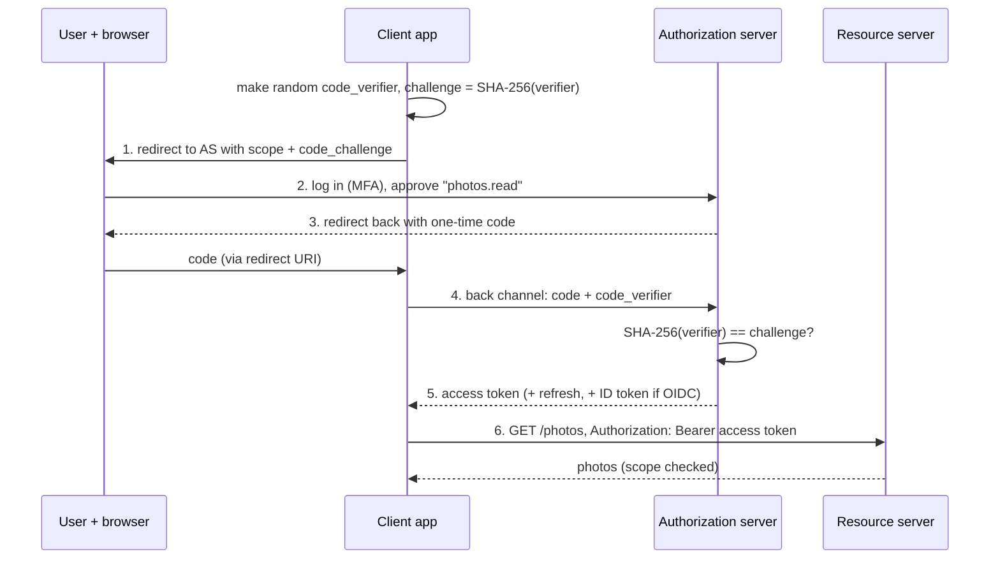

# Security Fundamentals

Every system in this module — the OS, the network, the database, the services built on
top — is also something an attacker can use. Security is the discipline of making sure
the system does only what its owners intend, for the people they intend, even when
someone is actively trying to make it do something else. This chapter starts from
first principles — what "secure" actually means, what the moving parts are, and where
they sit in a request — then goes as deep as a Senior Software Engineer (L5) interview
loop expects: authentication vs. authorization, sessions and tokens, OAuth 2.0 and
OpenID Connect at a conceptual level, hashing vs. encryption, TLS, secrets, the OWASP
Top 10, least privilege, and the software supply chain. Security questions in
interviews rarely stand alone; they show up as follow-ups inside a system design ("how
does service B know the call came from service A?", "where do you keep the API key?").
Corrections of common myths are marked **Precision note**. A side-by-side breakdown of
what Junior through Staff+ engineers are expected to know closes out the chapter, just
before the interview checklist.

## Foundations — What Is Security, and How Does It Work?

### Why Security Exists

Early computers were used by a few trusted people in one room, and the only "attack"
was someone walking in. Three shifts made security a core engineering skill:

- **Sharing.** Once many users shared one machine, the OS had to stop one user from
  reading another's files ([Operating Systems & Hardware Symbiosis](01_operating_systems_deep_dive.md): processes, address
  spaces, permissions). That's the origin of access control.
- **Networking.** Once machines were connected, anyone on the path could read or alter
  traffic, and anyone on the internet could send your server requests. That's the
  origin of encryption in transit, authentication, and input validation.
- **Money and data.** Once systems held payments, health records and identities,
  attackers became organised and financially motivated, and regulations (GDPR, HIPAA,
  PCI DSS) made breaches expensive in law as well as reputation.

Today every request your service receives should be treated as potentially hostile
until proven otherwise, and every dependency you install as code you are choosing to
trust.

### What "Secure" Actually Means: the CIA Triad

"Secure" is meaningless until you say secure *against what*, protecting *which*
property. The classic three properties:

| Property | Meaning | Broken by | Main tools |
|---|---|---|---|
| **Confidentiality** | Only authorised parties can read the data | Eavesdropping, stolen database dumps, over-broad access | Encryption (in transit and at rest), access control |
| **Integrity** | Data and code aren't altered without detection | Tampered requests, forged tokens, malicious dependencies | MACs, signatures, checksums, code signing |
| **Availability** | The system keeps serving legitimate users | DDoS, resource exhaustion, ransomware | Rate limiting, redundancy, backups |

Two more you'll need constantly: **authenticity** (you know who sent it) and
**non-repudiation** (the sender can't later deny sending it; digital signatures give
this, shared-key MACs don't).

### Threat Modelling in One Paragraph

A **threat model** answers four questions (the framing popularised by Adam Shostack):
*What are we building? What can go wrong? What are we going to do about it? Did we do
a good job?* In practice you draw the data flow, mark every **trust boundary** (a line
where data crosses from less-trusted to more-trusted: internet → load balancer, user
input → SQL query, service A → service B, your code → a third-party library), and at
each boundary ask the **STRIDE** questions: can someone **S**poof an identity,
**T**amper with data, **R**epudiate an action, cause **I**nformation disclosure,
**D**eny service, or **E**levate privilege? Every control in this file answers one of
those at one boundary.

### The Core Components of Application Security

| Component | What it's responsible for | Covered deeper in |
|---|---|---|
| **Identity** | Who or what is acting: users, services, devices, each with an identifier | §1 |
| **Authentication (authn)** | Proving that identity: passwords, passkeys, MFA, certificates, workload identity | §1 |
| **Session / token management** | Remembering an authenticated identity across requests | §2 |
| **Delegation & federation** | Letting one system act for a user at another, or log in with another provider (OAuth 2.0, OIDC) | §3 |
| **Authorization (authz)** | Deciding whether *this* identity may do *this* action on *this* resource | §1, §8 |
| **Cryptography** | Hashing, MACs, encryption, signatures: the primitives everything else is built on | §4 |
| **Transport security** | TLS between every client and server, and between services (mTLS) | §5 |
| **Secrets management** | Storing, distributing and rotating keys, passwords, and API tokens | §6 |
| **Input handling** | Treating all input as data, never as code: validation, parameterisation, encoding | §7 |
| **Supply chain** | Trusting the code you didn't write: dependencies, build systems, images | §9 |
| **Audit & detection** | Logging security-relevant events so you can detect and investigate | §7 (A09) |

### How the Pieces Fit Together

```arch
%% caption: A request crosses several trust boundaries; each one has its own control, and no single control is trusted to stop everything.
grid 165x100
node user "User's browser" at 0,0 icon=browser sub="untrusted input"
node idp "Identity provider" at 2,0 icon=identity sub="login, MFA, issues tokens"
group edge "Edge (trust boundary 1)" color=red icon=shield
node waf "TLS + WAF" at 0,1 in edge icon=firewall sub="encrypts, filters, rate limits"
node gw "API gateway" at 1,1 in edge icon=gateway sub="validates token (authn)"
group app "Service (trust boundary 2)" color=orange icon=service
node svc "Orders service" at 1,2 in app icon=service sub="authz per resource"
node val "Input handling" at 0,2 in app icon=filter sub="parameterised queries"
group data "Data (trust boundary 3)" color=blue icon=db
node db "Database" at 1,3 in data icon=db sub="encrypted at rest"
node kms "KMS / secrets" at 2,3 in data icon=key sub="keys, credentials"
user -> waf : "HTTPS"
user ..> idp : "log in"
waf -> gw
idp ..> gw : "signing keys"
gw -> svc : "mTLS + identity"
svc -> val
svc -> db : "least-privilege creds"
kms ..> svc : "short-lived secret"
```

Follow one request: the browser logs in at the identity provider and receives a token
(§2–§3); every call travels over TLS (§5); the edge filters and rate-limits; the
gateway checks the token is genuine (authentication); the service checks the caller
may touch *this particular* order (authorization — the check most often missing, §7
A01); user input reaches the database only as parameters (§7 A03); the service connects
with credentials that can do only what it needs (§8), fetched at runtime from a secret
manager (§6); and the data is encrypted at rest with keys held in a KMS (§4).

### Security Design Principles

These are the ideas behind every specific control below — interviewers listen for
them by name:

| Principle | Meaning | Example |
|---|---|---|
| **Defense in depth** | Layer independent controls so one failure isn't a breach | Token checked at the gateway *and* ownership checked in the service |
| **Least privilege** | Every user, service and key gets the minimum access, for the minimum time | A reporting job gets read-only access to one schema, not DB admin |
| **Fail closed (secure defaults)** | When a check errors or is missing, deny | Auth middleware on by default; a route must opt *out* explicitly |
| **Zero trust** | Network location grants nothing; authenticate and authorise every request | Google's BeyondCorp: no VPN "inside" that is trusted by default |
| **Minimise attack surface** | Fewer endpoints, ports, features, dependencies, and privileges to attack | Disable debug endpoints and unused admin panels in production |
| **Separation of duties** | No single person or key can do something catastrophic alone | Code review before deploy; two-person approval for production data access |
| **Kerckhoffs's principle** | A system must stay secure even if everything except the key is public | Use standard, public algorithms; never rely on a secret algorithm |
| **Don't roll your own crypto** | Use vetted libraries and protocols, not homemade constructions | libsodium, Tink, the platform's TLS, not a custom cipher mode |

### Vocabulary You'll Meet Below, in One Table

| Term | One-line meaning |
|---|---|
| Authentication (authn) | Proving who you are |
| Authorization (authz) | Deciding what you're allowed to do |
| Session | Server-side record of a logged-in user, referenced by a cookie |
| Token | A string that carries or references an identity and its permissions |
| JWT | JSON Web Token: a signed (sometimes encrypted), self-contained token format |
| OAuth 2.0 | A framework for delegated *authorization*: an app gets limited access on a user's behalf |
| OpenID Connect (OIDC) | An identity layer on OAuth 2.0 that adds *authentication* (the ID token) |
| Hash | A one-way fingerprint of data; no key |
| MAC / HMAC | A hash keyed with a secret: proves integrity and origin to key holders |
| Encryption | Reversible transformation with a key, for confidentiality |
| Digital signature | Made with a private key, verified with the public key: integrity + authenticity |
| TLS | The protocol that encrypts and authenticates connections (HTTPS) |
| KMS | Key Management Service: holds keys and performs crypto operations without exporting them |
| Least privilege | Minimum access, minimum time |
| SBOM | Software Bill of Materials: the list of components in a build |

With the components, the boundaries and that vocabulary in place, the rest of this
chapter is the precise, L5-depth version of each control.

## 1. Authentication vs. Authorization

**Authentication** answers *who are you?* **Authorization** answers *are you allowed
to do this?* They fail differently, and HTTP reflects that: **401 Unauthorized**
(despite its name) means "not authenticated — who are you?", and **403 Forbidden**
means "I know who you are, and no".

```arch
%% caption: Authentication establishes an identity once per request; authorization is a separate decision for every action on every resource.
grid 165x100
node req "Request" at 0,0 shape=pill color=slate sub="token or cookie"
node an "Authenticate" at 1,0 icon=auth sub="who is this?"
node e401 "401" at 1,1 shape=card color=red sub="unknown / invalid identity"
node az "Authorize" at 2,0 icon=shield sub="may user-42 cancel order-7?"
node pol "Policy + data" at 3,0 icon=doc sub="roles, ownership, relations"
node e403 "403 or 404" at 2,1 shape=card color=red sub="known, not allowed"
node ok "Handler runs" at 3,1 shape=card color=green sub="with the checked identity"
req -> an
an -> e401 : "fail"
an -> az : "principal"
pol ..> az
az -> e403 : "deny"
az -> ok : "allow"
```

### Authentication factors

| Factor | Examples | Weakness |
|---|---|---|
| Something you know | Password, PIN | Phished, reused, guessed, leaked in breaches |
| Something you have | Phone authenticator app (TOTP), hardware key, passkey on a device | TOTP and SMS codes can be phished in real time; SMS can be SIM-swapped |
| Something you are | Fingerprint, face | Used to unlock a local key, not sent to the server |

**Multi-factor authentication (MFA)** combines two different kinds. **Passkeys**
(FIDO2/WebAuthn) are the modern answer: the device holds a private key per site, the
server stores only the public key, and the browser binds each login to the site's
origin, so a look-alike phishing domain can't get a usable signature. There's no shared
secret on the server to leak. They are **phishing-resistant**, which TOTP and SMS codes
are not.

**Password policy (NIST SP 800-63B guidance):** favour length over composition rules,
allow long passphrases and paste, check new passwords against known-breached lists,
and don't force periodic rotation without evidence of compromise. Rate-limit and
monitor login attempts (credential stuffing replays leaked username/password pairs from
other sites at scale).

**Service-to-service authentication** doesn't use passwords either: mutual TLS with
per-service certificates (a service mesh such as Istio issues them automatically,
often as SPIFFE identities), or short-lived signed tokens from the platform's
**workload identity** (GCP service accounts, AWS IAM roles, Kubernetes service account
tokens).

### Authorization models

| Model | Decision based on | Good for | Example |
|---|---|---|---|
| **ACL** | A list on each resource of who may do what | Files, simple sharing | Unix permissions, S3 bucket ACLs |
| **RBAC** (role-based) | The user's roles; roles carry permissions | Internal tools, most B2B apps | `admin`, `editor`, `viewer` |
| **ABAC** (attribute-based) | Attributes of user, resource, action and context in a policy | Fine-grained rules ("managers in the same region during business hours") | AWS IAM conditions, OPA/Rego policies |
| **ReBAC** (relationship-based) | A graph of relationships ("user is member of group that owns folder that contains doc") | Sharing models like Google Drive, GitHub | Google Zanzibar (2019 paper), OpenFGA, SpiceDB |

**The rule that prevents the most common breach:** authorization is checked **on the
server, for the specific resource, on every request**. Hiding a button in the UI is
not authorization. Checking "user is logged in" is not authorization. The canonical
bug is an **IDOR** (insecure direct object reference): `GET /orders/1002` returns
someone else's order because the handler loads by ID without checking ownership.

```python
# Broken: authenticated, but any logged-in user can read any order.
order = db.get_order(order_id)

# Fixed: scope the lookup to the caller (and return 404 so IDs can't be probed).
order = db.get_order(order_id, owner_id=current_user.id) or abort(404)
```

## 2. Sessions and Tokens: Staying Logged In

HTTP is stateless, so after login the client must present *something* on every
request. Two designs:

| | Server-side session | Self-contained token (e.g. JWT) |
|---|---|---|
| **What the client holds** | A random, opaque session ID in a cookie | A signed token containing claims (user, scopes, expiry) |
| **What the server checks** | Looks the ID up in a session store (DB, Redis) | Verifies the signature and claims locally, no lookup |
| **Revocation** | Delete the session row: instant | Hard: the token stays valid until it expires, unless you add a deny-list (which reintroduces a lookup) |
| **Scaling** | Needs a shared store every server can reach | Any server with the verification key can check it |
| **Typical use** | Browser sessions for a web app | APIs, service-to-service, mobile apps, federated identity |

**Precision note:** "JWTs are stateless, so they're better" is a trap. The statelessness
is exactly what makes logout, password change and account suspension hard. The usual
compromise is **short-lived access tokens** (minutes) plus a **refresh token** stored
server-side (revocable, rotated on each use) — revocation then takes effect within
one access-token lifetime.

### Cookies done right

A session cookie should be `Secure` (HTTPS only), `HttpOnly` (unreadable by JavaScript,
so XSS can't steal it), and `SameSite=Lax` or `Strict` (not sent on most cross-site
requests, the main modern defence against CSRF; Chrome defaults to `Lax` when the
attribute is missing). Use the `__Host-` name prefix to pin it to your exact origin.
Regenerate the session ID at login (prevents **session fixation**) and expire it on
logout and after inactivity.

**Where should a browser app keep tokens?** Storing access tokens in `localStorage`
makes them readable by any script that runs on the page, so one XSS bug exfiltrates
them. The pattern recommended for browser apps is the **backend-for-frontend (BFF)**:
the server side of the web app does the OAuth dance and keeps tokens, and the browser
only holds an `HttpOnly` session cookie. See [OpenID Connect and Single Sign-On](../API/Fundamentals/05_openid_connect_and_sso.md)
§10 for the full comparison.

### What "validate the token" actually means

Checking a JWT is more than decoding it. A verifier must pin the algorithm (never
accept the token's own `alg`, which enables the classic `alg: none` and RS256→HS256
confusion attacks), verify the signature with the right key (fetched from the issuer's
JWKS for asymmetric tokens), and check `exp`/`nbf`, the issuer `iss`, and the audience
`aud` (a token minted for another service must be rejected). This minimal HS256
verifier shows each check failing for the right reason (`python3 mini_jwt.py`; use a
maintained library such as PyJWT or golang-jwt in production):

```python
"""A minimal HS256 JWT signer/verifier, to show what 'validate the token' actually means.
Use a maintained library (PyJWT, python-jose, golang-jwt) in production."""
import base64
import hashlib
import hmac
import json
import time

def b64url(data: bytes) -> str:
    return base64.urlsafe_b64encode(data).rstrip(b"=").decode()

def b64url_decode(s: str) -> bytes:
    return base64.urlsafe_b64decode(s + "=" * (-len(s) % 4))

def sign(claims: dict, key: bytes) -> str:
    header = b64url(json.dumps({"alg": "HS256", "typ": "JWT"}).encode())
    payload = b64url(json.dumps(claims).encode())
    sig = hmac.new(key, f"{header}.{payload}".encode(), hashlib.sha256).digest()
    return f"{header}.{payload}.{b64url(sig)}"

def verify(token: str, key: bytes, audience: str) -> dict:
    header_b64, payload_b64, sig_b64 = token.split(".")
    header = json.loads(b64url_decode(header_b64))
    if header.get("alg") != "HS256":                       # pin the algorithm: never trust the token's choice
        raise ValueError(f"rejected alg {header.get('alg')!r}")
    expected = hmac.new(key, f"{header_b64}.{payload_b64}".encode(), hashlib.sha256).digest()
    if not hmac.compare_digest(expected, b64url_decode(sig_b64)):
        raise ValueError("bad signature")
    claims = json.loads(b64url_decode(payload_b64))
    if claims["exp"] < time.time():
        raise ValueError("expired")
    if claims["aud"] != audience:                          # a token for another service is not for us
        raise ValueError("wrong audience")
    return claims

key = b"server-side secret, 32+ random bytes in real life"
now = int(time.time())
token = sign({"sub": "user-42", "aud": "orders-api", "scope": "orders:read", "exp": now + 300}, key)
print("valid:", verify(token, key, "orders-api")["sub"])

h, p, s = token.split(".")
tampered_payload = b64url(json.dumps({"sub": "user-1", "aud": "orders-api", "exp": now + 300}).encode())
none_header = b64url(json.dumps({"alg": "none"}).encode())
cases = {
    "tampered payload": f"{h}.{tampered_payload}.{s}",
    "alg=none attack": f"{none_header}.{p}.",
    "expired": sign({"sub": "user-42", "aud": "orders-api", "exp": now - 1}, key),
    "wrong audience": sign({"sub": "user-42", "aud": "billing-api", "exp": now + 300}, key),
}
for name, t in cases.items():
    try:
        verify(t, key, "orders-api")
        print(f"{name}: ACCEPTED (bug!)")
    except ValueError as e:
        print(f"{name}: rejected ({e})")
```

Output (verified with Python 3.11):

```text
valid: user-42
tampered payload: rejected (bad signature)
alg=none attack: rejected (rejected alg 'none')
expired: rejected (expired)
wrong audience: rejected (wrong audience)
```

A JWT's payload is only base64url-encoded, **not encrypted**: anyone holding the token
can read its claims. Never put secrets or sensitive personal data in one.

## 3. OAuth 2.0 and OpenID Connect, Conceptually

**The problem OAuth solves:** a photo-printing app wants to read your photos from a
cloud drive. The old answer was to give the app your drive password — full access,
forever, revocable only by changing your password. **OAuth 2.0** (RFC 6749) instead
lets you grant the app a **limited, revocable token** for specific **scopes**
(`photos.read`), without the app ever seeing your password.

The four roles:

| Role | In the example |
|---|---|
| **Resource owner** | You |
| **Client** | The printing app |
| **Authorization server** | The drive provider's login/consent service; issues tokens |
| **Resource server** | The drive's photo API; accepts access tokens |



**The flows that matter in 2026:**

- **Authorization code + PKCE** — for anything with a user: web apps, single-page
  apps, mobile apps. PKCE (RFC 7636) makes a stolen authorization code useless without
  the random `code_verifier` only the real client holds.
- **Client credentials** — service-to-service, no user: the client authenticates as
  itself and gets a token for its own permissions.
- **Device authorization** — TVs and CLIs without a browser: show a code, the user
  approves on their phone.
- **Deprecated:** the **implicit** flow (tokens in the URL fragment) and the **resource
  owner password** flow (the app collects the password) are advised against by the OAuth
  2.0 Security Best Current Practice (RFC 9700, January 2025) and are omitted from the
  OAuth 2.1 draft, which consolidates the current best practices.

**OpenID Connect** adds authentication on top. OAuth's access token says "the bearer
may read photos", intended for the resource server; it doesn't tell the *client* who
the user is. OIDC adds the **ID token** — a signed JWT *for the client* with `sub` (a
stable user ID), `iss`, `aud`, `exp` and a `nonce` — plus discovery and the UserInfo
endpoint. "Sign in with Google" is OIDC.

**Precision notes:**
- **OAuth is authorization, not authentication.** Using an access token to "log in"
  (because the API returned a profile) is a known vulnerability class; use OIDC's ID
  token for identity.
- **APIs accept access tokens, never ID tokens.** The ID token's audience is the
  client, not your API.
- **SSO** (single sign-on) is the user-visible result: one login session at the
  identity provider, many applications trusting its tokens. SAML 2.0 is the older XML
  protocol still common in enterprises; OIDC is the modern default.

The full protocol — ID token claims, discovery and JWKS, every flow step by step, SSO
and logout, token storage in browsers, and attacks — is in
[OpenID Connect and Single Sign-On](../API/Fundamentals/05_openid_connect_and_sso.md).

<div class="lab" data-viz="flow-oauth-pkce"></div>

## 4. Cryptography for Engineers: Hashing vs. Encryption

The most common confusion in security interviews is using these words interchangeably.
They solve different problems:

| Primitive | Key? | Reversible? | Gives you | Use for | Examples |
|---|---|---|---|---|---|
| **Encoding** | No | Yes, by anyone | Nothing security-wise | Transport formats | Base64, hex, URL encoding |
| **Hash** | No | No (one-way) | Integrity against accidents; a fingerprint | Checksums, content addressing, dedup | SHA-256, SHA-3, BLAKE2/3 |
| **MAC** | Shared secret | No | Integrity + authenticity to key holders | Signed cookies, webhooks, API request signing | HMAC-SHA256 |
| **Password hash** | No (but salted) | No, and deliberately slow | Makes offline guessing expensive | Storing passwords | Argon2id, scrypt, bcrypt, PBKDF2 |
| **Symmetric encryption** | Shared secret | Yes, with the key | Confidentiality (+ integrity with AEAD) | Data at rest, bulk data in TLS | AES-256-GCM, ChaCha20-Poly1305 |
| **Asymmetric encryption / key exchange** | Public/private pair | Yes, with the private key | Establishing a shared key with a stranger | TLS key exchange, envelope keys | X25519, RSA-OAEP, ML-KEM |
| **Digital signature** | Private signs, public verifies | — | Integrity + authenticity + non-repudiation | Certificates, JWTs (RS256/ES256), code signing | Ed25519, ECDSA, RSA-PSS |

**Precision notes:**
- **Base64 is not encryption.** Neither is hashing: you can't "decrypt a hash". If you
  need the original value back, you need encryption.
- **Never store passwords with a fast hash.** SHA-256 is designed to be fast, so a GPU
  can try billions of guesses per second against a leaked hash. Password hashes add a
  unique **salt** (so identical passwords hash differently and precomputed tables are
  useless) and a tunable **work factor** (memory and time). OWASP's current guidance:
  **Argon2id** first choice; scrypt if unavailable; bcrypt for legacy systems (note its
  72-byte input limit); PBKDF2-HMAC-SHA256 with a high iteration count (hundreds of
  thousands) where FIPS compliance is required.
- **Use authenticated encryption (AEAD).** Encryption without integrity (e.g. AES-CBC
  without a MAC) lets attackers modify ciphertext in useful ways. AES-GCM and
  ChaCha20-Poly1305 give both, and a nonce must never repeat under the same key.
- **Compare secrets in constant time** (`hmac.compare_digest`, `crypto/subtle`), or
  response timing leaks how many leading bytes matched.
- **Post-quantum:** NIST standardised ML-KEM (FIPS 203) and ML-DSA (FIPS 204) in
  August 2024. Major browsers and CDNs already negotiate hybrid key exchange
  (X25519 combined with ML-KEM-768) in TLS 1.3, to protect today's traffic from
  "harvest now, decrypt later". Symmetric crypto and hashes need only larger sizes.

**All of it in one runnable file** (`python3 crypto_basics.py`, standard library only):

```python
"""Hashing vs. MAC vs. password hashing, with the standard library only."""
import hashlib
import hmac
import os

# 1. A plain hash: fast, unkeyed, deterministic. Good for integrity checks and dedup.
print("sha256('hello') =", hashlib.sha256(b"hello").hexdigest()[:16], "...")
print("same input, same hash:", hashlib.sha256(b"hello").digest() == hashlib.sha256(b"hello").digest())

# 2. A MAC: a hash keyed with a secret. Only key holders can produce a valid tag.
key = os.urandom(32)
msg = b"user_id=42;role=viewer"
tag = hmac.new(key, msg, hashlib.sha256).digest()
forged = b"user_id=42;role=admin"
print("tag valid for original:", hmac.compare_digest(tag, hmac.new(key, msg, hashlib.sha256).digest()))
print("tag valid for forgery: ", hmac.compare_digest(tag, hmac.new(key, forged, hashlib.sha256).digest()))

# 3. Password hashing: salted and deliberately SLOW (memory-hard scrypt here).
def hash_password(password: str) -> bytes:
    salt = os.urandom(16)                             # unique per user: defeats rainbow tables
    digest = hashlib.scrypt(password.encode(), salt=salt, n=2**14, r=8, p=1, dklen=32)
    return salt + digest                              # store salt alongside the hash

def verify_password(password: str, stored: bytes) -> bool:
    salt, expected = stored[:16], stored[16:]
    digest = hashlib.scrypt(password.encode(), salt=salt, n=2**14, r=8, p=1, dklen=32)
    return hmac.compare_digest(digest, expected)      # constant-time comparison

a, b = hash_password("correct horse"), hash_password("correct horse")
print("same password, different stored values:", a != b)
print("verify right password:", verify_password("correct horse", a))
print("verify wrong password:", verify_password("Correct horse", a))
```

Output (verified with Python 3.11):

```text
sha256('hello') = 2cf24dba5fb0a30e ...
same input, same hash: True
tag valid for original: True
tag valid for forgery:  False
same password, different stored values: True
verify right password: True
verify wrong password: False
```

(`hashlib` has no Argon2; in production use the `argon2-cffi` package, or
`golang.org/x/crypto/argon2` in Go.)

### Encryption at rest and envelope encryption

Encrypting a database "at rest" protects against stolen disks and backups, not
against an attacker who can query the database through your application. Large-scale
systems use **envelope encryption**: each object or table is encrypted with its own
**data encryption key (DEK)**; the DEK is itself encrypted by a **key encryption key
(KEK)** that never leaves the KMS or HSM.

```arch
%% caption: Envelope encryption: data is encrypted locally with a per-object data key, and only that small key is sent to the KMS to be wrapped by a master key that never leaves it.
grid 165x100
node app "Service" at 0,0 icon=service
node kms "KMS / HSM" at 2,0 icon=key sub="KEK never leaves"
node dek "Data key (DEK)" at 1,0 icon=key sub="random, per object"
node ct "Ciphertext" at 0,1 icon=lock sub="AES-256-GCM(data, DEK)"
node wrapped "Wrapped DEK" at 1,1 icon=secrets sub="KEK-encrypted DEK"
node store "Storage" at 0.5,2 icon=storage sub="stores both together"
app -> dek : "generate"
dek -> kms : "wrap"
kms -> wrapped
app -> ct : "encrypt locally"
ct -> store
wrapped -> store
```

Why the indirection: bulk data never travels to the KMS; rotating the KEK only
re-wraps small keys; access to the KMS is audited and can be revoked; and deleting a
user's DEK makes their data unreadable everywhere, including backups
(**crypto-shredding**, the usual answer to GDPR deletion in immutable logs). See
[Security](../SystemDesign/building_blocks/14_security.md) for key hierarchies at scale.

## 5. TLS Basics

**TLS** (Transport Layer Security; HTTPS is HTTP over TLS) gives a connection three
properties: **confidentiality** (eavesdroppers see ciphertext), **integrity**
(tampering is detected), and **server authentication** (you are talking to the holder
of the certificate for `bank.com`, not an impostor). With **mutual TLS (mTLS)** the
client presents a certificate too, which is how service meshes authenticate services
to each other.

How it works in three sentences: the client and server perform an ephemeral key
exchange (ECDHE, today often hybrid with ML-KEM) to agree on fresh session keys; the
server proves its identity by signing the handshake with the private key matching its
**certificate**; and the client checks that certificate chains up to a **certificate
authority (CA)** it already trusts, is valid for the hostname, and hasn't expired. TLS
1.3 (RFC 8446) does this in one round trip and removed the legacy options that caused
most historical attacks; TLS 1.0 and 1.1 are formally deprecated (RFC 8996). The full
handshake message by message is in [Networking & Distributed Communication](02_networking_deep_dive.md) §5.

What goes wrong in practice:

- **Expired certificates** cause outages far more often than attacks. Public TLS
  certificate lifetimes are shrinking under CA/Browser Forum ballot SC-081: at most
  200 days since March 2026, 100 days from March 2027, and 47 days from March 2029.
  Manual renewal is no longer viable; automate with ACME (Let's Encrypt, cert-manager).
- **Disabled verification** (`verify=False`, `InsecureSkipVerify: true`) left in
  production code turns TLS into encryption with an unknown party — i.e. no protection
  against a man-in-the-middle.
- **TLS terminated at the load balancer** leaves traffic in plain text inside the
  network unless you re-encrypt; zero-trust networks encrypt service-to-service too.
- **Forward secrecy:** because session keys are ephemeral, a later theft of the
  server's private key doesn't decrypt previously recorded traffic (TLS 1.3 makes this
  mandatory).

<div class="lab" data-viz="flow-tls13"></div>

## 6. Secrets Management

A **secret** is anything that grants access: database passwords, API keys, signing
keys, OAuth client secrets, TLS private keys. The rules:

1. **Never in source code or git.** Once committed, assume it's leaked: git history
   keeps it, forks copy it, and public repositories are scanned by attackers within
   minutes. Turn on secret scanning (GitHub push protection, gitleaks, trufflehog) and
   **rotate** anything that was ever committed — deleting the commit is not enough.
2. **Not baked into images or config files**, and preferably not in environment
   variables either (they leak into crash dumps, `/proc`, child processes, and debug
   pages). Fetch at runtime from a **secret manager** (HashiCorp Vault, GCP Secret
   Manager, AWS Secrets Manager, Azure Key Vault) or mount them as files with tight
   permissions.
3. **Prefer no static secret at all.** Workload identity (a pod's service account
   exchanging a platform-signed token for short-lived cloud credentials) and dynamic
   secrets (Vault generating a database user valid for an hour) remove the long-lived
   key that can leak.
4. **Short-lived and rotatable.** Design so any secret can be rotated without
   downtime: accept two keys during the overlap, publish new signing keys in the JWKS
   before using them.
5. **Least privilege and audit.** Each service reads only its own secrets; every read
   is logged.
6. **Keys that sign or decrypt at scale live in a KMS/HSM** and are used through an API;
   the application never sees the raw key material.

## 7. The OWASP Top 10

The **OWASP Top 10** is the Open Worldwide Application Security Project's ranking of the
most critical web application security risks, built from vulnerability data and
community surveys. The **2021 edition** is the one most interview material and
compliance checklists still cite:

| # (2021) | Category | What it looks like | Primary defence |
|---|---|---|---|
| A01 | **Broken Access Control** | IDOR (`/orders/1002`), missing function-level checks, privilege escalation, CORS misconfiguration | Deny by default; server-side authorization per resource (§1); tests for "user A reads user B's data" |
| A02 | **Cryptographic Failures** | Plain HTTP, weak or home-made crypto, fast password hashes, keys in code | TLS everywhere, AEAD, Argon2id, KMS (§4–§6) |
| A03 | **Injection** | SQL, NoSQL, OS command, LDAP injection; XSS is included here since 2021 | Parameterised queries, safe APIs (no shell), context-aware output encoding |
| A04 | **Insecure Design** | Missing threat model; flows that can't be secured by any implementation (e.g. unlimited password-reset attempts) | Threat modelling, secure design patterns, abuse cases in requirements |
| A05 | **Security Misconfiguration** | Default passwords, verbose error pages, open cloud storage buckets, unnecessary features enabled, XML external entities | Hardened, automated config; minimal images; config scanning |
| A06 | **Vulnerable and Outdated Components** | Known-vulnerable libraries (Log4Shell, CVE-2021-44228) | Inventory (SBOM), automated updates, vulnerability scanning (§9) |
| A07 | **Identification and Authentication Failures** | Credential stuffing, weak passwords, session fixation, missing MFA | MFA/passkeys, rate limiting, secure session handling (§1–§2) |
| A08 | **Software and Data Integrity Failures** | Unsigned updates, compromised CI/CD, insecure deserialization of untrusted data | Signed artifacts, protected pipelines, no native deserialization of untrusted input (§9) |
| A09 | **Security Logging and Monitoring Failures** | Breaches undetected for months; no audit trail of logins or permission changes | Log auth events and access decisions; alert; keep logs tamper-evident; never log secrets |
| A10 | **Server-Side Request Forgery (SSRF)** | Server fetches a URL the attacker supplies and reaches internal services or the cloud metadata endpoint | Allow-list destinations, block internal ranges, egress controls, IMDSv2-style metadata protection |

**The 2025 update.** OWASP published a new edition, the **OWASP Top 10:2025**:

| # (2025) | Category | Change from 2021 |
|---|---|---|
| A01 | Broken Access Control | Still #1; now also absorbs SSRF |
| A02 | Security Misconfiguration | Up from #5 |
| A03 | **Software Supply Chain Failures** | New; broadens 2021's A06 (vulnerable components) to the whole supply chain |
| A04 | Cryptographic Failures | Down from #2 |
| A05 | Injection | Down from #3 |
| A06 | Insecure Design | Down from #4 |
| A07 | Authentication Failures | Renamed from "Identification and Authentication Failures" |
| A08 | Software or Data Integrity Failures | Same idea as 2021 |
| A09 | Security Logging and Alerting Failures | Renamed, emphasising alerting |
| A10 | **Mishandling of Exceptional Conditions** | New: failing open, leaking details in errors, unhandled edge cases |

In an interview, naming either edition is fine; what matters is explaining the
mechanism and the fix for the top few — access control, injection, and the supply chain.

### Injection, demonstrated

The root cause of every injection bug is the same: untrusted input is concatenated
into something that gets **parsed as code** (SQL, a shell command, HTML). The fix is
the same too: keep code and data in separate channels. (`python3 injection.py`)

```python
"""SQL injection: string-built SQL vs. a parameterized query."""
import sqlite3

db = sqlite3.connect(":memory:")
db.execute("CREATE TABLE users (name TEXT, is_admin INT)")
db.executemany("INSERT INTO users VALUES (?, ?)", [("alice", 0), ("bob", 0), ("root", 1)])

attacker_input = "nobody' OR '1'='1"

unsafe_sql = f"SELECT name FROM users WHERE name = '{attacker_input}'"   # input becomes CODE
print("unsafe:", db.execute(unsafe_sql).fetchall())

safe_rows = db.execute("SELECT name FROM users WHERE name = ?", (attacker_input,)).fetchall()
print("safe:  ", safe_rows)                                            # input stays DATA
```

Output (verified with Python 3.11):

```text
unsafe: [('alice',), ('bob',), ('root',)]
safe:   []
```

With the placeholder, the driver sends the query and the value separately, so the
quote characters are just part of a name that doesn't exist. **Precision note:**
escaping input by hand, or "validating" it with a deny-list of characters, is not the
fix; parameterisation is. For identifiers that can't be parameters (a sort column),
map user input to an allow-list of known names.

### The browser-side attacks you'll be asked about

- **XSS (cross-site scripting):** attacker-controlled data is rendered as HTML/JS in
  another user's browser, running with that user's session. Defences: frameworks that
  auto-escape output (React, Angular, Go `html/template`), no `innerHTML` with
  untrusted data, a **Content Security Policy** that forbids inline scripts, and
  `HttpOnly` cookies so a script can't read the session.
- **CSRF (cross-site request forgery):** a malicious site makes the victim's browser
  send a state-changing request to your site with the victim's cookies attached.
  Defences: `SameSite` cookies, anti-CSRF tokens for cookie-authenticated forms, and
  never changing state on `GET`. APIs that take bearer tokens in an `Authorization`
  header aren't vulnerable, because browsers don't attach those automatically.
- **CORS** is not a defence for your server; it's the browser relaxing the same-origin
  policy *when your server opts in*. A wildcard with credentials, or reflecting any
  `Origin`, re-opens what the same-origin policy closed (an A01 access-control
  failure). The live flow below shows what the browser actually does.
- **Clickjacking:** your page loaded in an invisible frame on another site. Defence:
  `Content-Security-Policy: frame-ancestors 'self'` (or `X-Frame-Options: DENY`).

<div class="lab" data-viz="flow-cors"></div>

## 8. Least Privilege in Practice

Least privilege is easy to state and the most commonly violated principle in real
breaches, because broad access is convenient and nobody notices until it's abused.
What it means concretely:

- **Humans:** no standing production access; request **just-in-time**, time-boxed
  elevation with approval and audit; **break-glass** accounts for emergencies that page
  someone when used. Separate admin accounts from daily accounts.
- **Services:** one identity per service (not a shared "backend" account), scoped to
  exactly the resources it uses: this bucket, read-only; that queue, publish only. Cloud
  IAM tooling can report permissions granted but never used — remove them.
- **Databases:** the application user can't `DROP TABLE` or read other services'
  schemas; migrations run under a separate, more privileged identity; row-level
  security where tenants share tables.
- **Tokens:** narrow **scopes** (`orders:read`, not `*`), short lifetimes, and the
  correct **audience**, so a token stolen from one service is useless at another.
- **Network:** default-deny between services, explicit allow-lists; but in a zero-trust
  design the network is a secondary layer, never the thing that grants access.
- **Blast radius:** assume any one component will be compromised and ask what the
  attacker can reach from there. Least privilege is what keeps that list short. The
  2019 Capital One breach combined an SSRF (reaching the cloud metadata endpoint) with
  an over-privileged role that could list and read many storage buckets — either fix
  alone would have limited it.

## 9. The Software Supply Chain

Most of the code in your service was written by someone else: open-source
dependencies (often hundreds, mostly transitive), base images, build tools, CI
plugins. Each is code you chose to run with your service's privileges. Attacks target
every link:

```arch
%% caption: Every link from source to production is an attack point; provenance, signatures and pinned dependencies let each later stage verify the one before it.
grid 170x100
node src "Source repo" at 0,0 icon=git sub="reviewed, protected"
node ci "Build (CI)" at 1,0 icon=workflow sub="isolated, ephemeral"
node deps "Dependencies" at 2,0 icon=package sub="pinned + hashed lockfile"
node art "Artifact" at 1,1 icon=container sub="signed, SBOM, provenance"
node reg "Registry" at 0,1 icon=storage sub="immutable tags"
node adm "Admission check" at 0,2 shape=diamond color=amber
node prod "Production" at 0,3 icon=server
src -> ci
deps -> ci
ci -> art
art -> reg
reg -> adm
adm -> prod : "signed + policy OK"
```

| Attack | Real example | Defence |
|---|---|---|
| **Known-vulnerable dependency** | Log4Shell (CVE-2021-44228, December 2021): a logging library executed remote code from a logged string | SBOM inventory, vulnerability scanning, fast automated updates (Dependabot, Renovate) |
| **Malicious maintainer / takeover** | xz-utils backdoor (CVE-2024-3094, March 2024): a long-term contributor inserted a backdoor into release tarballs targeting SSH; caught by an engineer investigating a slowdown | Review diffs of updates, prefer well-maintained projects, reproducible builds, build from source not release tarballs |
| **Typosquatting** | Packages named like popular ones (`reqeusts`) on npm/PyPI | Lockfiles, allow-listed registries, review new dependencies |
| **Dependency confusion** | Public package published with the name of a company's internal package, and resolvers preferring it (demonstrated in 2021) | Scoped/namespaced packages, a single private registry proxy, pinned sources |
| **Compromised build system** | SolarWinds (2020): malware inserted during the build of signed Orion updates | Hardened, isolated, ephemeral CI; provenance attestations; two-party review of pipeline changes |
| **Compromised CI dependency** | Popular CI actions or plugins altered to exfiltrate secrets | Pin actions to commit SHAs, minimal CI token permissions, short-lived credentials via OIDC federation |

The frameworks and tools to name:

- **Lockfiles with hashes** (`package-lock.json`, `go.sum`, `poetry.lock`,
  `pip install --require-hashes`) make builds reproducible and detect swapped packages.
- **SBOM** (Software Bill of Materials, in SPDX or CycloneDX format) lists exactly what's
  in a build, so "are we affected by CVE-X?" takes minutes, not days.
- **SLSA** (Supply-chain Levels for Software Artifacts, pronounced "salsa"; originated at
  Google) defines levels of build integrity, centred on **provenance**: a signed record
  of what source and build produced an artifact.
- **Sigstore / cosign** sign artifacts and container images with short-lived keys tied
  to an identity, recorded in a public transparency log; deploy-time admission policies
  (Binary Authorization on GKE, Kyverno) reject unsigned images.
- **Minimal base images** (distroless, scratch) shrink what can be vulnerable in the
  first place.

## What Each Engineering Level Should Know

Not everyone reading this file needs every sentence of it cold. This table maps this
chapter's material onto a standard industry ladder *and* the Google-style ladder this
repo's interview content is written against, side by side. The mapping between
company-specific titles and levels is approximate and varies by company, but the
*depth of understanding* described in each row is a reliable signal regardless of
which company uses which label. Use it as a syllabus (read down a column) or as a
self-assessment (find the cell that matches where a real interview would place you).

| Topic in this chapter | Junior / New Grad (Google L3) | Mid-Level (Google L4) | Senior (Google L5) | Staff+ (Google L6–L7) |
|---|---|---|---|---|
| **Principles & threat modelling** (Foundations) | Knows the CIA triad and that input is untrusted | Applies least privilege and fail-closed in their own code | Threat-models a design with trust boundaries and STRIDE, and names the control at each boundary | Sets security architecture and review processes for an organisation; balances risk against delivery |
| **Authn vs. authz** (§1) | Knows login vs. permissions, 401 vs. 403 | Implements RBAC and resource-ownership checks; knows MFA | Chooses RBAC/ABAC/ReBAC for a product, prevents IDOR systematically, explains passkeys and workload identity | Designs org-wide identity and authorization platforms (Zanzibar-style) |
| **Sessions & tokens** (§2) | Knows a cookie keeps you logged in | Sets cookie flags correctly; uses a JWT library | Explains the revocation trade-off, refresh-token rotation, full JWT validation, BFF for browsers | Sets token lifetime, key rotation and session policy across many services |
| **OAuth 2.0 / OIDC** (§3) | Knows "Sign in with Google" exists | Integrates auth code + PKCE with a library | Explains roles, flows, access vs. ID tokens, and why OAuth alone isn't authentication | Designs federation and SSO for an enterprise, including logout and provisioning |
| **Crypto & TLS** (§4–§5) | Knows HTTPS encrypts; knows passwords are hashed | Distinguishes hashing, encryption, encoding and signatures; uses AEAD and Argon2id via libraries | Explains salts, work factors, envelope encryption, forward secrecy, mTLS, and certificate automation | Plans key hierarchy, rotation and post-quantum migration for a platform |
| **Secrets & least privilege** (§6, §8) | Knows secrets don't belong in git | Uses a secret manager; scopes a service account | Removes static secrets with workload identity; designs blast-radius limits | Runs org-wide IAM hygiene, just-in-time access and break-glass processes |
| **OWASP & supply chain** (§7, §9) | Knows SQL injection and XSS by name | Uses parameterised queries and auto-escaping; updates dependencies | Explains each OWASP category's mechanism and fix, SSRF, CSRF vs. CORS, and supply-chain controls (lockfiles, SBOM, signing) | Drives SLSA-style provenance, dependency policy and incident response across the company |

**Reading this table as a study plan:** if you're aiming at a Senior/L5 bar, your
target is the whole "Senior" column, which the numbered sections (1–9) deliver in
full. The Foundations section alone takes you to roughly the "Mid-Level" column. The
"Staff+" column is judgment that mostly comes from operating real systems at scale;
this file gives you the vocabulary to have that conversation, not a substitute for
having had it.

## Interview checklist

- [ ] I can state the CIA triad, draw trust boundaries on a design, and apply STRIDE at each one.
- [ ] I can separate authentication from authorization, map them to 401 and 403, and prevent an IDOR.
- [ ] I can compare RBAC, ABAC and ReBAC and say which a Google Drive–style sharing model needs.
- [ ] I can explain why passkeys are phishing-resistant and TOTP codes aren't.
- [ ] I can compare server-side sessions with JWTs, including revocation, and list every check a JWT verifier must make.
- [ ] I can set cookie flags (`Secure`, `HttpOnly`, `SameSite`) and explain what each prevents.
- [ ] I can explain OAuth 2.0's roles and the authorization code + PKCE flow, and why OIDC's ID token is needed for login.
- [ ] I can distinguish encoding, hashing, MACs, encryption and signatures, and say how passwords must be stored.
- [ ] I can explain envelope encryption and crypto-shredding.
- [ ] I can say what TLS guarantees, what mTLS adds, and why certificate automation is now mandatory.
- [ ] I can explain where secrets should live, and how workload identity removes static keys.
- [ ] I can walk through the OWASP Top 10 (2021, and what changed in 2025) with a mechanism and fix for each, including injection, XSS, CSRF and SSRF.
- [ ] I can name supply-chain attacks (Log4Shell, xz-utils, dependency confusion) and the defences (lockfiles, SBOM, SLSA, signing).

Related: [Security](../SystemDesign/building_blocks/14_security.md) (security in system design: service boundaries, key management, deletion, abuse), [OpenID Connect and Single Sign-On](../API/Fundamentals/05_openid_connect_and_sso.md) (OIDC and SSO in depth), [Cross-Cutting Concerns](../API/Fundamentals/03_cross_cutting_concerns.md) (auth, CORS and rate limiting for APIs), [Networking & Distributed Communication](02_networking_deep_dive.md) §5 (the TLS 1.3 handshake), [Database Storage Engines & Advanced Structures](03_databases_deep_dive.md) (encryption at rest sits on the storage engine).
