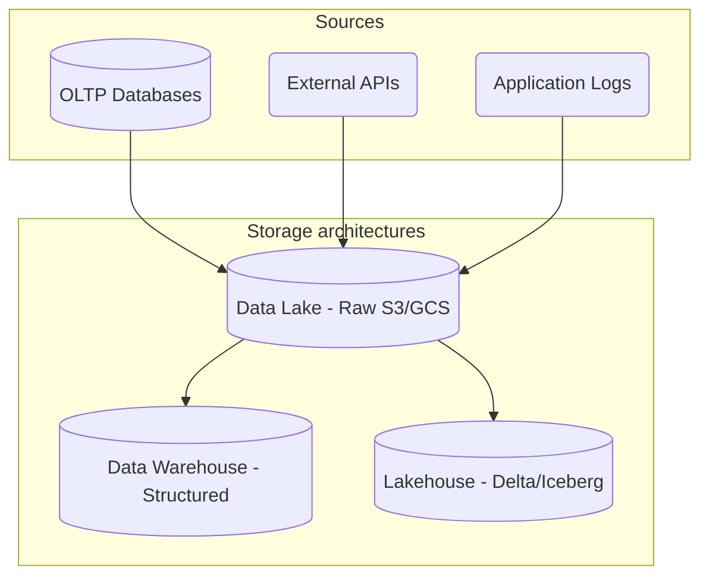
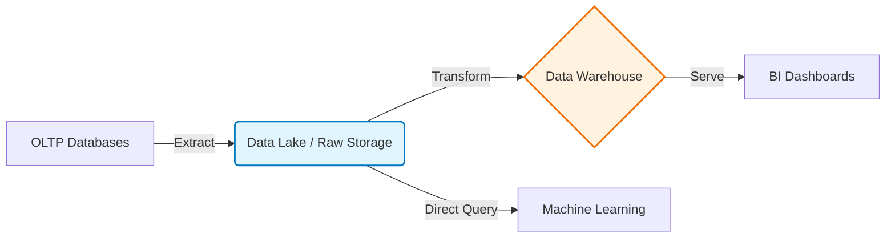
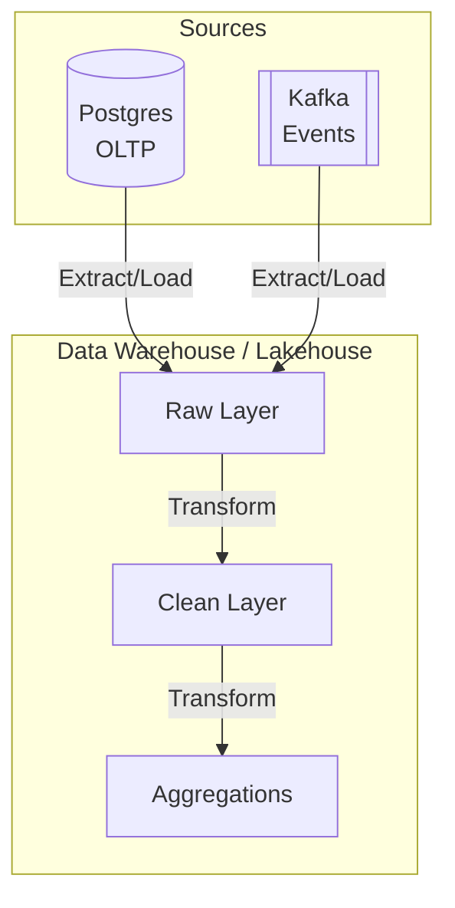
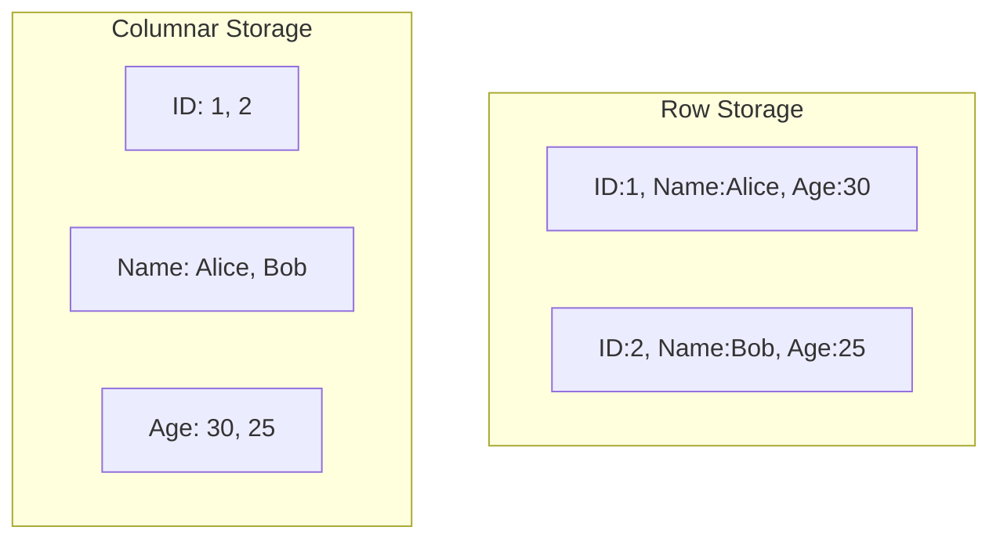

# Data Architecture & Storage

Welcome to the foundational pillar of Data Engineering! This section covers how we design systems to store and query massive amounts of data efficiently.

## 1. OLTP vs. OLAP

Understanding the difference between OLTP and OLAP is the first step in data engineering. Databases are typically optimized for one of these two workloads.

### OLTP (Online Transaction Processing)
- **Purpose**: Manage day-to-day operations and transactions.
- **Characteristics**: High volume of short, fast queries (INSERT, UPDATE, DELETE).
- **Design**: Highly normalized (3NF) to prevent data redundancy and ensure data integrity.
- **Technologies**: PostgreSQL, MySQL, SQL Server, Oracle.
- **Example**: An e-commerce checkout system processing thousands of orders per minute.

### OLAP (Online Analytical Processing)
- **Purpose**: Data analysis, reporting, and business intelligence.
- **Characteristics**: Low volume of complex, long-running queries (SELECT, aggregations).
- **Design**: Denormalized (Star/Snowflake schemas) optimized for read performance.
- **Technologies**: Amazon Redshift, Google BigQuery, Snowflake.
- **Example**: A monthly sales report calculating total revenue by region over the last 5 years.

## 2. Storage Architectures

### Data Warehouses
A Data Warehouse (DWH) is a centralized repository of integrated data from one or more disparate sources. It stores current and historical data in one single place that are used for creating analytical reports for workers throughout the enterprise.
- **Structure**: Schema-on-write (data must fit a predefined schema before loading).
- **Pros**: Fast query performance, highly structured, ACID compliance.
- **Cons**: Rigid, expensive to scale, struggles with unstructured data (images, text).

### Data Lakes
A Data Lake is a centralized repository that allows you to store all your structured and unstructured data at any scale.
- **Structure**: Schema-on-read (schema is applied only when the data is read/queried).
- **Pros**: Highly scalable, cheap storage (S3, GCS), supports machine learning workloads.
- **Cons**: Can turn into a "Data Swamp" if unmanaged, poor query performance compared to DWH.

### Lakehouses (The Modern Paradigm)
A Data Lakehouse combines the best elements of both. It provides the ACID compliance and query performance of a data warehouse directly on the cheap, scalable object storage of a data lake.
- **Technologies**: Databricks (Delta Lake), Apache Hudi, Apache Iceberg.



## 3. Cloud Object Storage
Object storage manages data as objects, as opposed to file systems (which manage data as a file hierarchy) and block storage (which manages data as blocks within sectors and tracks).
- **AWS S3** (Simple Storage Service)
- **GCP GCS** (Google Cloud Storage)
- **Azure Blob Storage**

## 4. File Formats: Columnar vs. Row-Based

### Row-Based (CSV, JSON, Avro)
- Stores data row by row.
- **Best for**: OLTP workloads, appending new records, retrieving entire records.
- **Apache Avro**: Binary format, heavily used in Kafka and streaming because it supports schema evolution and is compact.

### Columnar-Based (Parquet, ORC)
- Stores data column by column.
- **Best for**: OLAP workloads, analytics, aggregations. If you only need to query the `total_sales` column, the engine doesn't have to read the other columns from disk.
- **Apache Parquet**: Highly compressed columnar format. The gold standard for Data Lakes and Lakehouses.

```mermaid
flowchart LR
    subgraph Row_Based
        R1[ID:1 | Name:Alice | Age:30]
        R2[ID:2 | Name:Bob   | Age:25]
    end
    
    subgraph Columnar_Based
        C1[IDs: 1, 2]
        C2[Names: Alice, Bob]
        C3[Ages: 30, 25]
    end
    
    Row_Based -.->|Optimized for full record reads| App(Application)
    Columnar_Based -.->|Optimized for aggregations| BI(Analytics)
```
# OLTP vs OLAP & Data Warehouses

Backend engineers usually work with OLTP systems. Data engineers work with OLAP systems.

## 1. OLTP (Online Transaction Processing)
- **Goal**: Fast, reliable transactions for the user application (e.g., placing an order).
- **Databases**: Postgres, MySQL, MongoDB, DynamoDB.
- **Data Shape**: Highly normalized (3NF) to prevent anomalies during updates. Row-oriented storage.
- **Queries**: Milliseconds. "Get the current balance for user 42." "Insert a new order."

## 2. OLAP (Online Analytical Processing)
- **Goal**: Complex queries over massive datasets for business intelligence.
- **Databases**: Snowflake, BigQuery, Redshift (Data Warehouses).
- **Data Shape**: Denormalized (Star Schema) to make querying easier. Column-oriented storage.
- **Queries**: Seconds to minutes. "What was the average revenue per user by country over the last 5 years?"

## 3. The ETL/ELT Pipeline

Data is useless if it's trapped in isolated OLTP databases. Data Engineers build pipelines to move it into the Data Warehouse.

```arch
%% caption: The modern ELT pipeline extracts raw data, loads it into the warehouse, and then transforms it in-place using massive parallel compute.
route straight
node pg "Postgres\n(OLTP)" at 0,0 icon=db color=blue
node kafka "Kafka\n(Events)" at 2,0 icon=network color=amber

group bq "BigQuery (OLAP)" color=slate style=dashed
node raw "Raw Layer" at 1,1 in bq icon=file color=slate
node clean "Clean Layer" at 1,2 in bq icon=doc color=blue
node agg "Aggregations" at 1,3 in bq icon=dashboard color=green

pg -> raw : "Extract/Load"
kafka -> raw : "Extract/Load"
raw -> clean : "Transform"
clean -> agg : "Transform"
```

### ETL vs ELT
- **ETL (Extract, Transform, Load)**: The old way. A dedicated server extracts data from Postgres, transforms it (cleans it, joins it) in memory, and *then* loads it into the Warehouse. This requires huge, expensive transformation servers.
- **ELT (Extract, Load, Transform)**: The modern way. Extract raw data and dump it directly into the Warehouse. Use the massive compute power of the Warehouse itself (using tools like `dbt`) to write SQL queries that transform the raw tables into clean tables.
# Architecture and Storage

This guide covers the core architectural paradigms and storage mechanisms used in modern Data Engineering.

## 1. OLTP vs OLAP

Backend engineers usually work with OLTP systems, while Data engineers focus on OLAP systems.

### OLTP (Online Transaction Processing)
- **Goal**: Fast, reliable transactions for the user application (e.g., placing an order).
- **Databases**: Postgres, MySQL, MongoDB, DynamoDB.
- **Data Shape**: Highly normalized (3NF) to prevent anomalies during updates. Row-oriented storage.
- **Queries**: Milliseconds. "Get the current balance for user 42." "Insert a new order."

### OLAP (Online Analytical Processing)
- **Goal**: Complex queries over massive datasets for business intelligence and analytics.
- **Databases**: Snowflake, BigQuery, Redshift (Data Warehouses).
- **Data Shape**: Denormalized (Star Schema) to make querying easier. Column-oriented storage.
- **Queries**: Seconds to minutes. "What was the average revenue per user by country over the last 5 years?"

## 2. Modern Data Architectures

### Data Warehouses
A Data Warehouse (DW) is a centralized repository for structured, filtered data that has already been processed for a specific purpose. They rely on schema-on-write, meaning the schema must be defined before data is loaded.
- **Examples**: Snowflake, Google BigQuery, Amazon Redshift.
- **Use cases**: BI dashboards, structured reporting.

### Data Lakes
A Data Lake is a vast pool of raw data, the purpose for which is not yet defined. It supports structured, semi-structured (JSON, XML), and unstructured (images, logs) data. Data is stored in its native format until it's needed (schema-on-read).
- **Examples**: Amazon S3, Google Cloud Storage (GCS), Azure Data Lake Storage.
- **Use cases**: Machine Learning, data exploration, raw data archiving.

### Lakehouses
A Data Lakehouse combines the flexibility, cost-efficiency, and scale of data lakes with the data management and ACID transactions of data warehouses. They utilize open table formats like Apache Iceberg, Delta Lake, or Apache Hudi on top of cloud object storage.
- **Examples**: Databricks (Delta), open-source Iceberg on S3.



## 3. The ETL/ELT Pipeline

Data is useless if it's trapped in isolated OLTP databases. Data Engineers build pipelines to move it into analytical systems.



### ETL vs ELT
- **ETL (Extract, Transform, Load)**: The traditional approach. A dedicated server extracts data from source, transforms it in memory, and *then* loads it into the Warehouse. This requires huge, expensive transformation servers.
- **ELT (Extract, Load, Transform)**: The modern approach. Extract raw data and dump it directly into the Warehouse/Lake. Use the massive compute power of the Warehouse itself (via tools like `dbt`) to write SQL queries that transform the raw tables into clean tables in-place.

## 4. Cloud Object Storage
Cloud object storage is the foundational layer for Data Lakes and Lakehouses. It stores data as objects within buckets, providing infinite scalability and high durability at low cost.
- **Amazon S3**: Standard in AWS ecosystems.
- **Google Cloud Storage (GCS)**: Standard in GCP ecosystems.

## 5. Storage Formats: Row vs. Columnar

How data is saved to disk drastically affects performance.

### Row-Oriented Formats (e.g., CSV, JSON, Avro)
- Data is stored row by row.
- **Pros**: Fast to write/append whole rows. Good for OLTP or streaming ingestion.
- **Cons**: Slow to read a subset of columns, as the entire row must be scanned.
- **Apache Avro**: A popular row-based format that uses JSON for defining data types and protocols, and serializes data in a compact binary format. Excellent for Kafka and schema evolution.

### Column-Oriented Formats (e.g., Parquet, ORC)
- Data is stored column by column.
- **Pros**: Extremely fast for analytical queries (OLAP) that only need a few columns. High compression ratios (since data in a column is of the same type).
- **Cons**: Slower to append new rows, as they must be split across columns.
- **Apache Parquet**: The industry standard columnar format. Heavily used in Data Lakes, Spark, and Lakehouses.
- **Apache ORC**: Optimized Row Columnar format, commonly used in Hadoop/Hive ecosystems. Highly optimized for reads.


