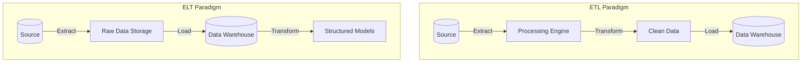
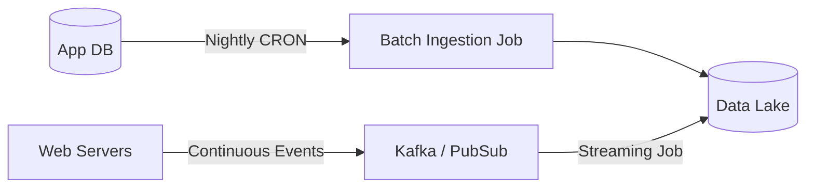
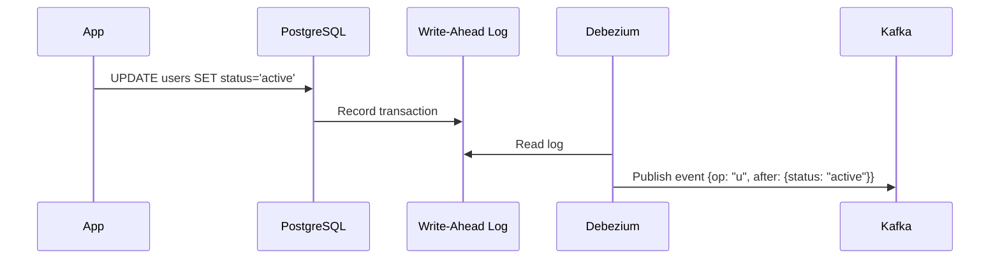
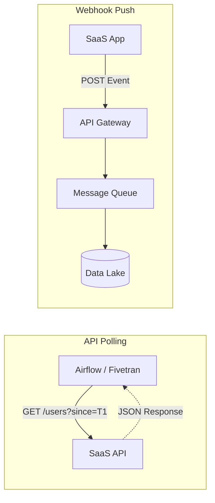
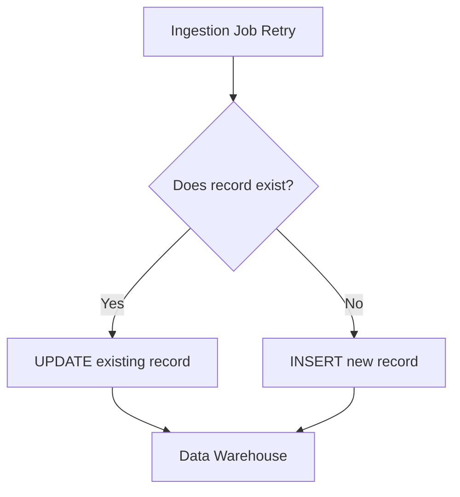

# Topic 3: Data Ingestion

Data ingestion is the process of moving data from various sources into a storage medium (like a data lake or data warehouse) where it can be accessed, used, and analyzed by an organization. Robust data ingestion pipelines are the foundation of any data platform.

## 1. ETL vs. ELT

The sequence of extracting, transforming, and loading data has two primary paradigms: ETL and ELT.

### ETL (Extract, Transform, Load)
In ETL, data is extracted from the source, transformed in an intermediate processing server (or streaming engine), and then loaded into the target destination.
- **Pros**: Good for masking sensitive data before it hits the destination; offloads compute from the target data warehouse.
- **Cons**: Can be rigid; requires a separate processing tier to scale.

### ELT (Extract, Load, Transform)
In ELT, data is extracted and loaded *directly* into the target storage (like BigQuery or Snowflake) in its raw format. The transformation happens inside the destination using its powerful compute engine (often via SQL).
- **Pros**: Very scalable (leverages the warehouse's compute); stores raw data for future unforeseen use cases; simpler to build.
- **Cons**: Sensitive data might be loaded into the warehouse (requiring strict access controls); transformation costs are tied to warehouse compute.

## 2. Batch vs. Streaming Ingestion

Data can be ingested periodically in chunks (batch) or continuously as it is generated (streaming).

- **Batch Ingestion**: Runs on a schedule (e.g., nightly, hourly). Ideal for large volumes of historical data, periodic dumps from databases, or systems where real-time analytics are not required. Tools: Airflow, AWS Glue, dbt.
- **Streaming Ingestion**: Processes data in real-time or near-real-time. Ideal for fraud detection, live dashboards, or user activity tracking. Tools: Apache Kafka, Google Pub/Sub, Apache Flink.

## 3. Change Data Capture (CDC)

When extracting data from a transactional database (like PostgreSQL or MySQL), querying `SELECT * FROM users` every hour is highly inefficient. 

Change Data Capture (CDC) solves this by reading the database's transaction log (e.g., PostgreSQL's WAL or MySQL's binlog). Every `INSERT`, `UPDATE`, or `DELETE` is streamed as an event.

- **Tools**: Debezium, AWS DMS, Fivetran.
- **Benefits**: Real-time replication, zero impact on production database performance (doesn't require heavy `SELECT` queries).

## 4. API and Webhook Ingestion Patterns

When integrating with third-party SaaS applications (e.g., Stripe, Salesforce, Zendesk), you typically use APIs or Webhooks.

- **API Polling (Pull)**: Your ingestion job periodically requests data from the SaaS API. You must manage pagination, rate limits, and state (e.g., "last sync timestamp").
- **Webhooks (Push)**: The SaaS application sends an HTTP POST request to your endpoint whenever an event occurs. You must ensure your endpoint is highly available and can handle sudden spikes in traffic.

## 5. Idempotency

An operation is *idempotent* if executing it multiple times yields the same result as executing it once.

In distributed systems, failures happen. Network timeouts occur, machines crash, and jobs are retried. If your ingestion pipeline is not idempotent, a retried job will create duplicate data.

### Implementing Idempotency:
- **Upserts (Merge)**: Instead of `INSERT`, use `MERGE` or `INSERT ON CONFLICT DO UPDATE`. If the row already exists, update it; otherwise, insert it.
- **Partition Overwrites**: In batch processing, if a daily job fails and runs again, overwrite the entire daily partition rather than appending to it.

