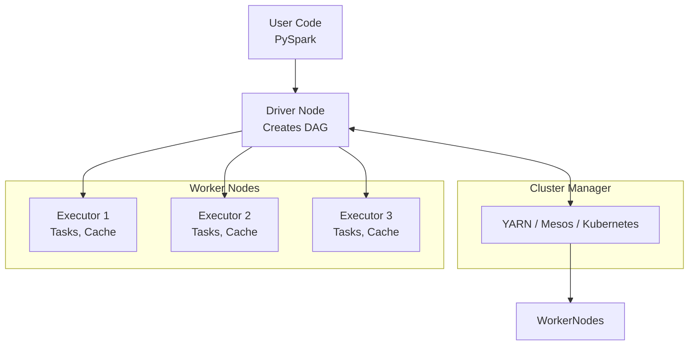
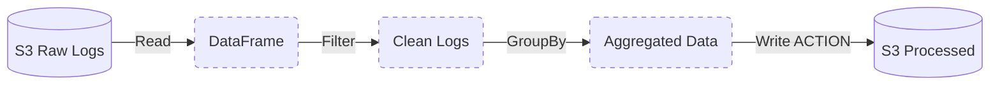
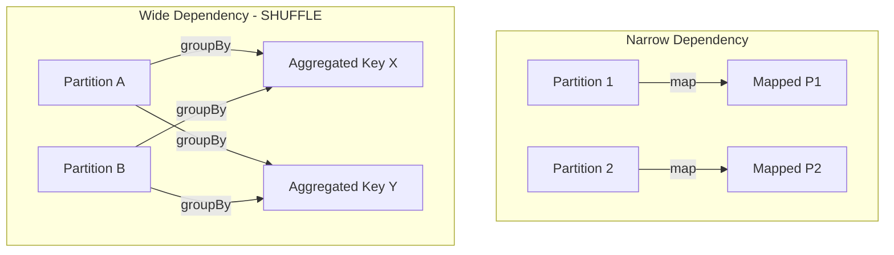

# Topic 4: Batch Processing

Batch processing involves executing complex data processing jobs on large volumes of data at scheduled intervals. It is used when data is too large to fit in a single machine's memory, or when the computations are extremely complex.

## 1. The MapReduce Paradigm

Before modern frameworks, Hadoop MapReduce revolutionized big data processing. It breaks a task into two phases:
1. **Map**: Each node processes a small subset of the data locally, filtering and sorting it, outputting key-value pairs.
2. **Reduce**: Data is shuffled across the network so that all pairs with the same key end up on the same node. The node then aggregates or "reduces" the values.

While MapReduce was powerful, it was notoriously slow because it wrote intermediate results to disk after every step.

## 2. Batch Processing with Apache Spark

While ELT (using BigQuery/Snowflake) is great for SQL transformations, sometimes you need imperative programming (Python/Scala) to process massive datasets. Perhaps you are parsing 50TB of raw unstructured JSON logs, running machine learning models, or crunching complex graph algorithms.

This is where Apache Spark shines.

### What is Spark?

Spark is a distributed compute engine. It does not *store* data (unlike a database). It reads data from distributed storage (like AWS S3 or HDFS), processes it in memory across a cluster of machines, and writes the results back. Because it processes data in-memory without writing intermediate results to disk, it is significantly faster than MapReduce.

## 3. Spark Architecture

A Spark application runs as independent sets of processes on a cluster, coordinated by the `SparkContext` object in your main program (called the **Driver** program).



### Components:
- **Driver**: Runs the `main()` function, maintains information about the Spark Application, translates code into a DAG, and schedules tasks.
- **Cluster Manager**: Acquires resources on the cluster (e.g., YARN, Kubernetes).
- **Executors**: Worker processes that run the individual tasks and return results to the Driver. They also store data in memory (caching) for faster access.

## 4. RDDs and DataFrames

- **RDD (Resilient Distributed Dataset)**: The core abstraction in Spark. An immutable, fault-tolerant collection of objects partitioned across the cluster. While foundational, RDDs are a low-level API and are rarely used directly today.
- **DataFrame**: A dataset organized into named columns (conceptually similar to a Pandas DataFrame or a SQL table). Spark optimizes DataFrame queries using its **Catalyst Optimizer**. This optimization means that Python (PySpark) code runs exactly as fast as native Scala code, as both compile down to the same physical execution plan.

## 5. Transformations, Actions, and DAG Execution

Spark evaluates lazily.

- **Transformations** (e.g., `filter()`, `map()`, `groupBy()`): These do not execute immediately. They simply build a lineage graph—a **DAG (Directed Acyclic Graph)** of operations.
- **Actions** (e.g., `count()`, `show()`, `write()`, `collect()`): These trigger the actual execution. When an action is called, the Driver submits the DAG to the cluster.



```python
# 1. Read 100GB of JSON from S3 (Transformation - lazy)
df = spark.read.json("s3://bucket/logs/")

# 2. Filter for errors (Transformation - lazy)
errors = df.filter(df.level == "ERROR")

# 3. Write to Parquet (Action - execution begins!)
errors.write.parquet("s3://bucket/clean-logs/")
```

## 6. Partitioning and The Shuffle Problem

Data in Spark is split into **Partitions**. Each partition is processed by a single Task on a single Executor.

### Narrow vs. Wide Dependencies

- **Narrow Dependency**: Operations (like `filter` or `map`) that can be executed completely independently on each partition. No data movement between executors is required.
- **Wide Dependency**: Operations (like `groupBy`, `join`, or `orderBy`) that require data with the same key to be physically moved to the same Executor node. This is called a **Shuffle**.

Shuffles are expensive. They write intermediate data to disk and send it over the network. They are the single biggest bottleneck in Spark workloads.



## 7. Optimization Techniques

1. **Filter Early**: *Always* filter before you `join` or `groupBy` to minimize the amount of data shuffled across the network.
2. **Broadcast Joins**: When joining a massive table with a very small table (e.g., a lookup table), Spark can "broadcast" (copy) the small table to every executor. This completely eliminates the Shuffle phase for the large table.
3. **Caching / Persisting**: If you perform multiple Actions on the same transformed DataFrame, Spark will re-evaluate the entire DAG from the source file every time. Use `.cache()` or `.persist()` to save the intermediate DataFrame in the Executors' memory.
4. **Coalesce vs. Repartition**: Use `coalesce()` to reduce the number of partitions (avoids a full shuffle). Use `repartition()` when you need to increase partitions or evenly distribute skewed data (requires a full shuffle).
# Batch Processing with Apache Spark

While ELT (using BigQuery/Snowflake) is great for SQL transformations, sometimes you need imperative programming (Python/Scala) to process massive datasets. Perhaps you are parsing 50TB of raw unstructured JSON logs, running machine learning models, or crunching complex graph algorithms.

This is where Apache Spark shines.

## 1. What is Spark?

Spark is a distributed compute engine. It does not *store* data (unlike a database). It reads data from distributed storage (like AWS S3 or HDFS), processes it in memory across a cluster of machines, and writes the results back.

## 2. The Architecture

```arch
%% caption: The Spark Driver translates code into a DAG of tasks, which the Cluster Manager schedules across Executor nodes for parallel execution.
route straight
node user "User Code\\n(PySpark)" at 0,1 icon=code color=blue
node driver "Driver Node\\n(Creates DAG)" at 2,1 icon=cpu color=amber
group cluster "Worker Nodes (Executors)" color=slate style=dashed
node w1 "Executor 1\\n(Tasks)" at 4,0 in cluster icon=worker color=green
node w2 "Executor 2\\n(Tasks)" at 4,2 in cluster icon=worker color=green

user -> driver : "submits job"
driver -> w1 : "sends code"
driver -> w2 : "sends code"
```

## 3. RDDs and DataFrames

- **RDD (Resilient Distributed Dataset)**: The core abstraction. An immutable collection of objects partitioned across the cluster. (Low-level, rarely used directly today).
- **DataFrame**: A dataset organized into named columns (like a Pandas DataFrame or SQL table). Spark optimizes DataFrame queries using its Catalyst Optimizer, making Python code run exactly as fast as Scala code.

## 4. Transformations vs Actions

Spark evaluates lazily.

**Transformations** (e.g., `filter()`, `map()`, `groupBy()`) do not execute immediately. They just build a DAG (Directed Acyclic Graph) of operations.
**Actions** (e.g., `count()`, `show()`, `write()`) trigger the actual execution.

```python
# 1. Read 100GB of JSON from S3 (Transformation - lazy)
df = spark.read.json("s3://bucket/logs/")

# 2. Filter for errors (Transformation - lazy)
errors = df.filter(df.level == "ERROR")

# 3. Write to Parquet (Action - execution begins!)
errors.write.parquet("s3://bucket/clean-logs/")
```

## 5. The Shuffle Problem

Some operations (like a simple `filter` or `map`) can be executed completely independently on each Worker node. This is called a **Narrow Dependency**.

Other operations (like `groupBy`, `join`, or `orderBy`) require data with the same key to be physically moved to the same Worker node. This is a **Wide Dependency**, and it triggers a **Shuffle**.

Shuffles write intermediate data to disk and send it over the network. They are the single biggest bottleneck in Spark.
*Optimization rule:* Always `filter` before you `join` or `groupBy` to minimize the amount of data shuffled.
