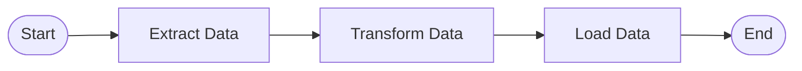

# Data Orchestration

Data orchestration tools schedule, manage, and monitor the execution of data pipelines.

## 1. Directed Acyclic Graphs (DAGs)
A DAG is a collection of all the tasks you want to run, organized in a way that reflects their relationships and dependencies.
- **Directed**: Tasks have a defined order (A must run before B).
- **Acyclic**: No loops are allowed. A task cannot depend on itself or a downstream task.

## 2. Apache Airflow
The industry standard for data orchestration.
- **Scheduler**: Triggers workflows and submits tasks to the executor.
- **Webserver**: Provides a UI to inspect, trigger, and debug DAGs.
- **Executor / Workers**: Processes the actual tasks.
- **Metadata Database**: Stores state, variables, and connections.

### Core Concepts
- **Operators**: Define a single task (e.g., `PythonOperator`, `BashOperator`).
- **Sensors**: Special operators that wait for a certain condition to be met (e.g., wait for a file to arrive in S3).
- **XCom (Cross-Communication)**: A mechanism to share small amounts of data between tasks.

## 3. Idempotency
A critical concept in data orchestration. A task is idempotent if running it multiple times produces the same result as running it once. This ensures that retrying failed tasks doesn't corrupt data.
