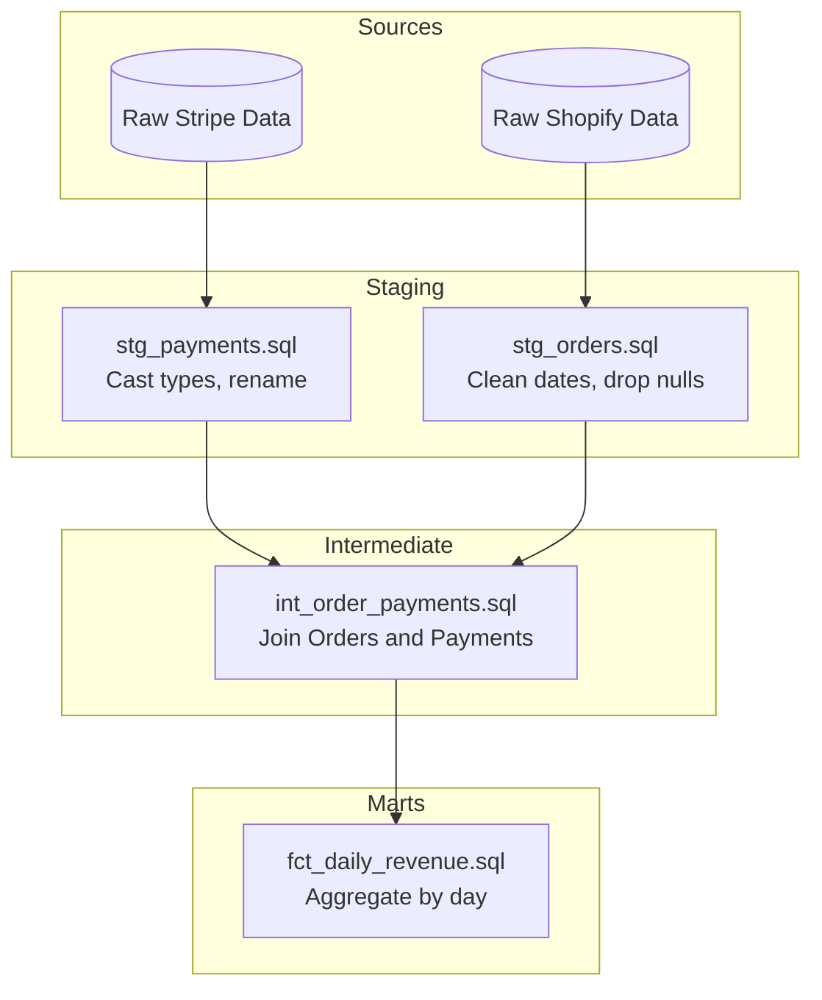

# Topic 07: Data Transformation

Data transformation is the process of converting data from one format or structure into another. It is the crucial "T" in ETL and ELT pipelines, responsible for taking raw, messy, or unstructured data and turning it into clean, analyzable, and valuable information for business intelligence and machine learning.

---

## 1. The Paradigm Shift: ETL vs. ELT

Understanding the difference between ETL and ELT is foundational to modern data engineering.

### ETL (Extract, Transform, Load)
Historically, on-premise databases were expensive and had limited compute.
- **Process**: Data is extracted from a source, transformed on a dedicated processing server (like Apache Spark, Informatica, or Talend), and *then* loaded into the Data Warehouse.
- **Pros**: Protects the warehouse from heavy compute loads. Better for complex procedural transformations.
- **Cons**: Requires managing a separate transformation cluster. Data is locked in the transformation layer until it finishes.

### ELT (Extract, Load, Transform)
With the rise of scalable, cloud-native data warehouses (Snowflake, BigQuery, Redshift), storage and compute became cheap and decoupled.
- **Process**: Data is extracted and loaded *raw* directly into the Data Warehouse. The warehouse's own massive MPP (Massively Parallel Processing) compute power is then used to transform the data using SQL.
- **Pros**: Much faster ingestion. Analysts can see raw data immediately. Leverages SQL, which is universally known.
- **Cons**: Can be expensive if SQL queries are poorly optimized.

```mermaid
flowchart LR
    subgraph ETL
        E1[Source] --> T1[Processing Server (Spark)]
        T1 --> L1[(Data Warehouse)]
    end
    
    subgraph ELT
        E2[Source] --> L2[(Data Warehouse)]
        L2 --> T2[Transform via SQL in Warehouse]
    end
```

---

## 2. dbt (Data Build Tool)

dbt has become the industry standard for the **Transform** step in the modern ELT stack. It enables data analysts and engineers to transform data in their warehouse simply by writing `SELECT` statements.

### Key Concepts in dbt

#### 1. Models
In dbt, a "model" is simply a `.sql` file containing a single `SELECT` statement. You do not write `CREATE TABLE` or `INSERT INTO` statements; dbt handles the materialization for you.

#### 2. Materializations
You configure how dbt should build your model in the database:
- **Table**: Drops and recreates the table entirely. (Good for fast queries, bad for build time).
- **View**: Creates a virtual table. (Good for fast build time, can be slow to query).
- **Incremental**: Only inserts or updates records that have changed since the last run. (Crucial for large datasets).
- **Ephemeral**: Does not exist in the database; interpolated as a CTE (Common Table Expression) in downstream models.

#### 3. Macros & Jinja
dbt utilizes the Jinja templating language to bring programming control structures (if statements, for loops) into SQL. Macros are reusable snippets of SQL.

**Example of Jinja in dbt:**
```sql
-- Instead of hardcoding 50 state columns, we can use a Jinja loop!
select
  order_id,
  
  sum(case when payment_method = '{{ payment_method }}' then amount else 0 end) as {{ payment_method }}_amount
  ,
  
from raw_payments
group by 1
```

#### 4. Testing
dbt allows you to define tests in YAML files to ensure data quality.
- **Generic Tests**: `unique`, `not_null`, `accepted_values`, `relationships` (referential integrity).
- **Singular Tests**: Custom SQL queries that fail if they return any rows.

---

## 3. The Data Transformation Lifecycle (DAGs)

Transformations should never happen in one massive 2,000-line SQL query. They are broken down into a Directed Acyclic Graph (DAG) of manageable models.

### Standard Layering Architecture
1. **Staging (`stg_`)**: 1:1 mapping with raw data. Used for basic cleanup (renaming columns, casting types, converting timezones).
2. **Intermediate (`int_`)**: Joining staging tables together, filtering, or performing complex logic.
3. **Marts / Facts & Dimensions (`fct_`, `dim_`)**: The final, presentation-ready tables used by BI tools (Tableau, Looker).



---

## 4. Common Transformation Operations

Whether you are using Python (Pandas/Spark) or SQL (dbt), you will frequently perform these operations:

- **Type Casting**: Converting a string `"$1,200.50"` into a numeric float `1200.50`.
- **Deduplication**: Removing duplicate events caused by "at-least-once" delivery semantics in streaming systems. (Using `ROW_NUMBER() OVER(PARTITION BY id ORDER BY updated_at DESC)`).
- **Flattening**: Converting deeply nested JSON payloads (like NoSQL documents) into flat, tabular rows and columns.
- **Masking**: Hashing or obfuscating Personally Identifiable Information (PII) such as emails and Social Security Numbers to comply with GDPR/CCPA.
- **Imputation**: Handling missing data (Nulls) by dropping the row, filling it with a default value (e.g., `0`), or interpolating based on surrounding data.
