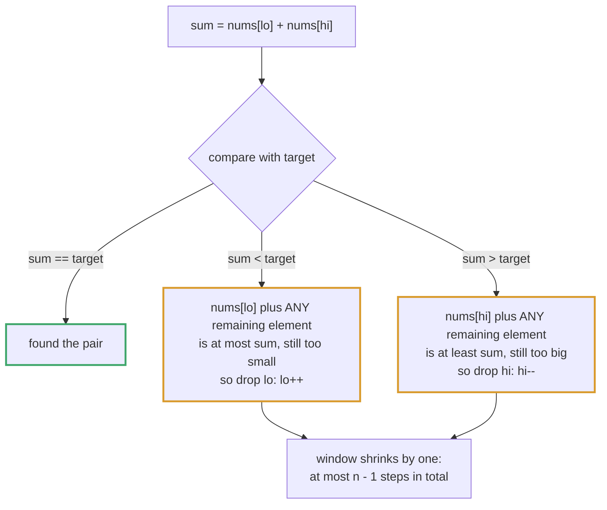
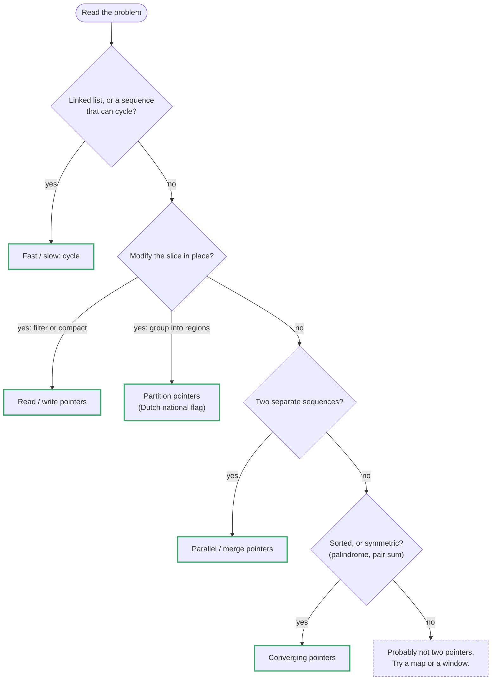

# Topic 02 · Two Pointers — Go Deep Dive

> Two-pointer techniques are where Go's value-typed slices stop being a curiosity
> and start being the entire reason the pattern is clean. In-place compaction,
> convergent scans, and partitioning all mutate a backing array through an index
> — no new list, no copy, no `del`. Python can do the same thing, but mutating a
> `list` while iterating it is a well-known minefield; in Go the slice header
> and manual indexing make the intent explicit and the bounds checked. This is
> the document that shows where that clarity comes from, and where it still
> bites you.

---

## Part 1 · The Three Shapes of Two Pointers

### 1.1 Opposite-ends convergent pointers

Two indices start at the ends of a **sorted** (or otherwise structured) slice
and walk toward each other, each step eliminating one candidate pair.

```go
func twoSumSorted(nums []int, target int) []int {
    lo, hi := 0, len(nums)-1
    for lo < hi {
        sum := nums[lo] + nums[hi]
        switch {
        case sum == target:
            return []int{lo, hi}
        case sum < target:
            lo++          // sum too small → only increasing lo can help
        default:
            hi--          // sum too big → only decreasing hi can help
        }
    }
    return nil
}
```

```
nums = [2, 7, 11, 15], target = 9
        ▲                   ▲
        lo                  hi
        2 + 15 = 17 > 9  →  hi--
        ▲               ▲
        lo              hi
        2 + 11 = 13 > 9  →  hi--
        ▲           ▲
        lo          hi
        2 + 7 = 9 == 9   →  found
```

Each step strictly shrinks the search window by one, so the whole scan is
**O(n)** — versus the brute-force **O(n²)** nested loop it replaces. This is
the pattern behind LC 167 (Two Sum II), LC 11 (Container With Most Water), and
LC 42 (Trapping Rain Water).

> ✅ **Why moving the pointer on the too-small side is always safe.** With `lo` and `hi` on a sorted
> slice, suppose `nums[lo]+nums[hi] < target`. Every element still in the window is `≤ nums[hi]`, so
> `nums[lo]` paired with *anything* left in the window sums to at most `nums[lo]+nums[hi] < target`.
> `nums[lo]` has no partner left — discard it. The mirror argument discards `hi` when the sum is too
> big. Each move deletes one whole row (or column) of the n×n grid of candidate pairs without
> examining it. This is the correctness argument interviewers want to hear, not just "it works."



### 1.2 Fast/slow pointers

Both pointers move in the **same direction**, but at different rates — classic
uses are cycle detection (Floyd's) and finding the middle of a linked list.

```go
func hasCycle(head *ListNode) bool {
    slow, fast := head, head
    for fast != nil && fast.Next != nil {
        slow = slow.Next
        fast = fast.Next.Next
        if slow == fast {
            return true      // fast lapped slow inside the cycle
        }
    }
    return false
}
```

On a linked list there is no aliasing concern — `*ListNode` is already a pointer, so both variables
just walk the same chain. The Go-specific detail is the **nil-check order**: `fast != nil && fast.Next != nil`
must be written in that order. `&&` short-circuits left to right, so the second test only runs once
`fast` is known to be non-nil; swap them and `fast.Next` dereferences a nil `fast` on an even-length list.
Go has no exception to catch here — a nil pointer dereference is a **runtime panic**, full stop.

### 1.3 Same-direction read/write pointers — in-place compaction

This is the shape unique to array problems and where Go's value semantics pay
off directly: a **write pointer** trails a **read pointer**, and everything the
read pointer decides to keep gets copied backward into the write pointer's
slot.

```go
// LC 26 — Remove Duplicates from Sorted Array, O(1) extra space
func removeDuplicates(nums []int) int {
    if len(nums) == 0 {
        return 0
    }
    write := 1                      // next slot to fill; nums[0] is already "kept"
    for read := 1; read < len(nums); read++ {
        if nums[read] != nums[write-1] {
            nums[write] = nums[read]
            write++
        }
    }
    return write                    // new logical length; nums[:write] is the answer
}
```

```
nums = [0,0,1,1,1,2,2,3,3,4]
         w
 read=1: nums[1]==nums[0] → skip
         w
 read=2: nums[2]!=nums[0] → nums[1]=1, w=2
           w
 read=5: nums[5]!=nums[1] → nums[2]=2, w=3
             w
 ...
final:  [0,1,2,3,4,2,2,3,3,4]  (only nums[:5] is defined by the spec; the tail is stale)
```

The backing array is mutated **in place through the original slice header** —
`len(nums)` doesn't change (you can't shrink a slice from inside a function
that received it by value; the header is a copy), which is exactly why LC 26's
signature returns the new logical length `k` instead of trying to return a
shorter slice. Returning `nums[:write]` would also work for the *caller*, but
the judge calls your function expecting the in-place contract, so mutate and
return the count.

> ⚡ **This is real O(1)-space compaction, not "conceptually O(1)."** Because
> `nums []int` is a slice header holding a pointer to the caller's backing
> array, every `nums[write] = nums[read]` write is visible to the caller with
> zero extra allocation. Python's equivalent (`nums[write] = nums[read]` on a
> `list`) is the same idea, but Python's list is an array of *pointers to
> objects*, so even "in place" mutation there is touching pointer-sized slots,
> not the values themselves — a smaller but real distinction from Go's
> flat `[]int` of raw 8-byte ints.

Same skeleton solves LC 283 (Move Zeroes) and LC 27 (Remove Element) — only
the "keep this element?" predicate changes.

---

## Part 2 · Swapping and Partitioning In Place

### 2.1 Go's tuple-swap idiom

Go evaluates the entire right-hand side before assigning, so swapping needs no
temp variable:

```go
nums[lo], nums[hi] = nums[hi], nums[lo]
```

This is not sugar over a hidden temp you should worry about — the spec
guarantees all RHS expressions are evaluated first, in order, then all
assignments happen. It composes correctly even for the classic self-reference
trap:

```go
i, j := 2, 2
nums[i], nums[j] = nums[j], nums[i]   // safe no-op even when i == j
```

> ⚠️ **The trap this idiom does *not* protect you from:** swapping through two
> **different slices that alias the same backing array** (e.g. `s[1:]` and
> `s[:len(s)-1]` from the same parent) still reads and writes the same
> underlying memory — the tuple-swap doesn't create a temporary copy of the
> backing array, only of the two scalar values on the RHS. This only matters
> when your "two pointers" are secretly indexing through two different slice
> variables instead of one; keep partitioning code to a single slice indexed
> two ways, as above, and it never comes up.

### 2.2 Dutch National Flag — three-way partitioning

LC 75 (Sort Colors) is the canonical **same-array, three-pointer** partition:
sort an array of 0s, 1s, and 2s in one pass, in place, without counting.

```go
// sortColors partitions nums into [0s | 1s | 2s] in a single O(n) pass.
func sortColors(nums []int) {
    low, mid, high := 0, 0, len(nums)-1
    // Invariant:
    //   nums[:low]        == all 0s   (finalized)
    //   nums[low:mid]     == all 1s   (finalized)
    //   nums[mid:high+1]  == unknown  (still being scanned)
    //   nums[high+1:]     == all 2s   (finalized)
    for mid <= high {
        switch nums[mid] {
        case 0:
            nums[low], nums[mid] = nums[mid], nums[low]
            low++
            mid++          // the swapped-in value at mid is a known 1 (or was low's own value) — safe to advance
        case 1:
            mid++
        case 2:
            nums[mid], nums[high] = nums[high], nums[mid]
            high--         // do NOT advance mid — the swapped-in value from high is unexamined
        }
    }
}
```

```
nums = [2,0,2,1,1,0]
        low=mid=0, high=5

mid=0: nums[0]=2 → swap(mid,high) → [0,0,2,1,1,2], high=4, mid stays 0
mid=0: nums[0]=0 → swap(low,mid) → [0,0,2,1,1,2], low=1, mid=1
mid=1: nums[1]=0 → swap(low,mid) → same values, low=2, mid=2
mid=2: nums[2]=2 → swap(mid,high) → [0,0,1,1,2,2], high=3, mid stays 2
mid=2: nums[2]=1 → mid=3
mid=3: nums[3]=1 → mid=4  (mid > high, loop ends)
result: [0,0,1,1,2,2]
```

> ⚠️ **The single most common bug in this pattern:** advancing `mid` after the
> `case 2` swap. The value swapped in from `nums[high]` has never been looked
> at — it could be another 0, 1, or 2 — so `mid` must stay put and re-examine
> it next iteration. Advancing `mid` unconditionally is the bug that makes
> Sort Colors "almost work" on most test cases and fail on adversarial ones.

This is one array, three logical regions, one pass — **O(n) time, O(1) space**
— versus a counting-sort approach that also works but needs two passes and,
in the general case, doesn't generalize to "partition around a pivot" the way
this does (this exact skeleton is also the partition step of quicksort).

---

## Part 3 · Strings: the Byte/Rune Trap Returns

LC 125 (Valid Palindrome) and LC 680 (Valid Palindrome II) are two-pointer
scans over a `string`, and Topic 01's byte-vs-rune distinction determines
whether your solution is even correct, not just fast.

```go
func isPalindrome(s string) bool {
    lo, hi := 0, len(s)-1
    for lo < hi {
        for lo < hi && !isAlnum(s[lo]) { lo++ }   // s[lo] is a byte
        for lo < hi && !isAlnum(s[hi]) { hi-- }
        if toLower(s[lo]) != toLower(s[hi]) {
            return false
        }
        lo++
        hi--
    }
    return true
}

func isAlnum(b byte) bool {
    return (b >= 'a' && b <= 'z') || (b >= 'A' && b <= 'Z') || (b >= '0' && b <= '9')
}

func toLower(b byte) byte {
    if b >= 'A' && b <= 'Z' {
        return b + ('a' - 'A')
    }
    return b
}
```

> ⚠️ **Indexing `s[i]` on a `string` gives a `byte`, and byte-indexing walks
> UTF-8 code units, not characters.** For LC 125's ASCII-only test data this is
> fine and is also the *fastest* option — no decode, no allocation. But the
> moment a problem statement allows non-ASCII letters (accented characters,
> non-Latin scripts), indexing bytes from both ends can land you **inside** a
> multi-byte UTF-8 sequence, comparing garbage halves of two different
> codepoints. The fix is the same one from Topic 01 §2.6:
> ```go
> r := []rune(s)              // O(n) decode once, up front
> lo, hi := 0, len(r)-1        // now indices are codepoints, safe from both ends
> ```
> Decide which contract the problem gives you — LeetCode almost always
> guarantees ASCII for string two-pointer problems, so `byte` indexing is the
> default choice; reach for `[]rune` only when Unicode correctness is actually
> required, since it costs an O(n) allocation up front.

LC 680 (Valid Palindrome II — remove at most one character) reuses this scan
and adds one twist worth naming: on the first mismatch, you must try **both**
`skip(lo+1, hi)` and `skip(lo, hi-1)` and return true if either is a
palindrome — a single two-pointer pass can't greedily pick one side, because
which side is correct depends on the rest of the string.

---

## Part 4 · Sorted-Array Two Pointers: 3Sum and Overflow

LC 15 (3Sum) is "fix one element, two-pointer the rest" — sort first, then for
each `i`, run the opposite-ends scan from §1.1 over the remainder.

```go
func threeSum(nums []int) [][]int {
    slices.Sort(nums)               // O(n log n) — required before two pointers work
    var result [][]int

    for i := 0; i < len(nums)-2; i++ {
        if nums[i] > 0 {
            break                    // sorted ascending: no triplet from here can sum to 0
        }
        if i > 0 && nums[i] == nums[i-1] {
            continue                 // skip duplicate "first" elements
        }

        lo, hi := i+1, len(nums)-1
        for lo < hi {
            sum := nums[i] + nums[lo] + nums[hi]
            switch {
            case sum < 0:
                lo++
            case sum > 0:
                hi--
            default:
                result = append(result, []int{nums[i], nums[lo], nums[hi]})
                lo++
                hi--
                for lo < hi && nums[lo] == nums[lo-1] { lo++ }  // skip duplicate seconds
                for lo < hi && nums[hi] == nums[hi+1] { hi-- }  // skip duplicate thirds
            }
        }
    }
    return result
}
```

Two independent skips matter:

1. **Skipping duplicate `i`** prevents emitting the same triplet-family twice
   at the outer level.
2. **Skipping duplicate `lo`/`hi` after a match** prevents emitting the same
   triplet twice at the inner level — without it, `[-1,-1,2]` in
   `nums = [-1,-1,0,0,1,2]` gets recorded once per repeated `-1`.

Overall complexity: **O(n log n)** for the sort plus **O(n²)** for the outer
loop times the inner two-pointer scan — the two-pointer inner loop turns what
would otherwise be an O(n²) inner search (or O(n³) brute force over all
triplets) into O(n), for a total of **O(n²)**.

> ⚠️ **Integer overflow is a real risk here, not paranoia.** `nums[i] +
> nums[lo] + nums[hi]` on `int` is fine on the LeetCode constraints for 3Sum
> (values fit comfortably in 64-bit `int`, which is what `int` is on every
> platform Go actually ships for), but the moment a variant problem (4Sum, or
> "closest to target" with larger bounds) sums four `int32`-range values or
> multiplies indices, reach for the safe idiom from Topic 01 — compute in a
> wider type or restructure the comparison (`a-b` instead of `a>b` risks
> overflow the same way `a+b` does) rather than assuming Go's arbitrary
> precision, because **Go has none**: `int` wraps silently at 64 bits, unlike
> Python's unbounded integers.

---

## Part 5 · Complexity and Python/Go Divergence

### 5.1 What two pointers actually buys you

| Problem shape | Brute force | With two pointers |
|---|:--:|:--:|
| Pair summing to target (sorted) | O(n²) | **O(n)** |
| Triplet summing to target | O(n³) | **O(n² )** (O(n log n) sort + O(n²) scan) |
| Remove/compact in place | O(n) time, O(n) space (new slice) | **O(n) time, O(1) space** |
| Palindrome check | O(n) space (reverse + compare) | **O(1) space** |
| Container / trapping water | O(n²) (check every pair) | **O(n)** |

The pattern's entire value proposition is collapsing a nested loop (or an
extra allocation) into a single linear scan by exploiting sortedness or a
keep/discard invariant.

### 5.2 Python vs. Go — Where They Diverge

| | Python | Go |
|---|---|---|
| In-place swap | `a[i], a[j] = a[j], a[i]` (tuple assignment) | `s[i], s[j] = s[j], s[i]` — same idiom, same evaluate-then-assign semantics |
| Shrinking a compacted array | `del list[k:]`, or return a new list | Can't resize caller's slice from a copy of the header — return the count `k` and use `nums[:k]` |
| String indexing in a scan | Characters, always | **Bytes** — use `[]rune` for Unicode correctness |
| Sorting before two pointers | `list.sort()` — **stable**, Timsort O(n log n) | `slices.Sort` — **unstable**, pdqsort O(n log n) (irrelevant here since 3Sum doesn't need stability) |
| Integer overflow in sum checks | Never (arbitrary precision) | **Wraps** at 64 bits — widen or restructure comparisons for large bounds |
| Linked-list fast/slow nil safety | `AttributeError` is catchable | Nil dereference **panics** — order your nil checks left-to-right and rely on short-circuit `&&` |

---

## Part 6 · Algorithms Owned by This Topic

| Algorithm | Time | Space | Problem |
|---|:--:|:--:|---|
| Opposite-ends convergent scan | O(n) | O(1) | LC 167 Two Sum II |
| Container / max-area scan | O(n) | O(1) | LC 11 Container With Most Water |
| Two-pointer + running max walls | O(n) | O(1) | LC 42 Trapping Rain Water |
| Fast/slow cycle detection | O(n) | O(1) | LC 141, 142 Linked List Cycle |
| Read/write compaction | O(n) | O(1) | LC 26, 27, 283 |
| Dutch National Flag (3-way partition) | O(n) | O(1) | LC 75 Sort Colors |
| Sort + fixed pointer + two pointers | O(n²) | O(1)* | LC 15 3Sum, LC 18 4Sum |
| String convergent scan (byte-safe) | O(n) | O(1) | LC 125, 680 Valid Palindrome |
| Sort + fixed pointer + converging scan, track the closest | O(n²) | O(1)* | LC 16 3Sum Closest |

\* excluding the O(n) or O(log n) space the sort itself may use internally

---

## Part 7 · Building 3Sum From Scratch, With the Duplicate-Skip Logic Explained Inline

```go
package main

import "slices"

// threeSum returns all unique triplets [a, b, c] in nums with a+b+c == 0.
func threeSum(nums []int) [][]int {
    slices.Sort(nums)
    result := make([][]int, 0)

    n := len(nums)
    for i := 0; i < n-2; i++ {
        // Sorted ascending, so once the smallest of the three is positive,
        // every remaining triplet sums to something > 0. Stop entirely.
        if nums[i] > 0 {
            break
        }
        // Two different `i` values that hold the same number produce the
        // exact same set of downstream triplets — skip the repeat.
        if i > 0 && nums[i] == nums[i-1] {
            continue
        }

        lo, hi := i+1, n-1
        for lo < hi {
            sum := nums[i] + nums[lo] + nums[hi]
            switch {
            case sum < 0:
                lo++                       // need a bigger contribution
            case sum > 0:
                hi--                       // need a smaller contribution
            default:
                triplet := []int{nums[i], nums[lo], nums[hi]}
                result = append(result, triplet)

                lo++
                hi--
                // Slide past any run of duplicate values on either side so
                // the next iteration compares a genuinely different pair,
                // not one that would reproduce the triplet just recorded.
                for lo < hi && nums[lo] == nums[lo-1] {
                    lo++
                }
                for lo < hi && nums[hi] == nums[hi+1] {
                    hi--
                }
            }
        }
    }
    return result
}
```

**Talk track while writing:** sort first because two pointers need order to
know which side to move; the outer `break` on `nums[i] > 0` is a free early
exit, not just an optimization — mention it unprompted; duplicate-skipping
happens at two independent levels (the fixed element, and the pair) and
conflating them is the most common correctness bug; the whole thing is O(n²)
because the sort is dominated by the nested scan for any n large enough to
matter.

---

<!-- block:02_go_1_choose -->
## Part 8 · Choosing the Pattern — and Its Neighbours



**The most important fork is LC 1 vs LC 167.** Two Sum (unsorted, return *indices*) must use a map,
because sorting destroys the indices you have to return. Two Sum II (sorted) should use two pointers,
because the sortedness is handed to you and the space drops to O(1). Interviewers pair them on purpose
to see whether you pattern-match on the surface ("two sum!") or on the constraint.

### Two pointers vs sliding window

| | Read/write and converging (this topic) | Sliding window (topic 03) |
|---|---|---|
| What the pointers bound | a **write position**, or two candidate endpoints | a **contiguous subarray** |
| What you maintain | nothing | an **aggregate** (sum, counts, max) over `[lo, hi]` |
| Why the left pointer moves | you *proved* an endpoint is eliminated | to restore a **validity condition** on the range |
| Typical question | "compact in place", "find a pair" | "longest / shortest subarray such that…" |

If your left pointer moves in order to *repair a broken condition* about the range between the pointers,
you are in a sliding window.

---
<!-- /block:02_go_1_choose -->

<!-- block:02_go_2_shapes -->
## Part 9 · Shapes the Three-Shape Taxonomy Leaves Out

All code below was run on Go 1.24.5.

### 9.1 Fill from the back (an output pointer)

When the largest answer is guaranteed to be at one end of the input, fill the output from the back —
**Squares of a Sorted Array**:

```go
func sortedSquares(nums []int) []int {
    n := len(nums)
    out := make([]int, n)
    l, r := 0, n-1
    for w := n - 1; w >= 0; w-- {
        if a, b := nums[l], nums[r]; a*a > b*b {
            out[w] = a * a; l++
        } else {
            out[w] = b * b; r--
        }
    }
    return out                 // [-4 -1 0 3 10] -> [0 1 9 16 100]
}
```

**Merge Sorted Array** (LC 88) fills from the back for a different reason: `nums1` has its spare room at
the *end*, so a forward merge overwrites values it has not read yet. Forward, in place, on
`[4 5 6 0 0 0]` and `[1 2 3]` the result is `[1 1 1 1 0 0]` — the 4, 5, 6 are gone. Backwards it is safe,
because the unread part of `a` always sits at or below the write index:

```go
func mergeBack(a []int, m int, b []int, n int) {
    i, j, w := m-1, n-1, m+n-1
    for j >= 0 {
        if i >= 0 && a[i] > b[j] { a[w] = a[i]; i-- } else { a[w] = b[j]; j-- }
        w--
    }
}
```

### 9.2 Outward pointers: expand from the centre

A palindrome is symmetric about a centre, so *diverge* from each of the `2n − 1` centres until the
symmetry breaks — O(n²) time, **O(1) space**:

```go
func longestPalindrome(s string) string {
    bestL, bestR := 0, 0
    expand := func(l, r int) (int, int) {
        for l >= 0 && r < len(s) && s[l] == s[r] { l--; r++ }
        return l + 1, r                                   // half-open [l+1, r)
    }
    for c := 0; c < len(s); c++ {
        for _, e := range [2][2]int{{c, c}, {c, c + 1}} {   // odd centre, even centre
            if a, b := expand(e[0], e[1]); b-a > bestR-bestL { bestL, bestR = a, b }
        }
    }
    return s[bestL:bestR]                                 // a substring: no copy
}
```

Byte indexing is correct for ASCII input; for Unicode, convert to `[]rune` first (Topic 01 §2.7).

### 9.3 kSum, and counting whole batches at once

3Sum generalises: recurse until `k == 2`, then run the converging scan, skipping duplicates at **every**
level. Time is **O(n^(k−1))** (4Sum is O(n³)).

```go
func kSum(nums []int, target, k, start int) [][]int {   // nums sorted
    var res [][]int
    if k == 2 {
        l, r := start, len(nums)-1
        for l < r {
            switch s := nums[l] + nums[r]; {
            case s < target: l++
            case s > target: r--
            default:
                res = append(res, []int{nums[l], nums[r]})
                l++; r--
                for l < r && nums[l] == nums[l-1] { l++ }
                for l < r && nums[r] == nums[r+1] { r-- }
            }
        }
        return res
    }
    for i := start; i <= len(nums)-k; i++ {
        if i > start && nums[i] == nums[i-1] { continue }
        for _, tail := range kSum(nums, target-nums[i], k-1, i+1) {
            res = append(res, append([]int{nums[i]}, tail...))   // a FRESH slice per result
        }
    }
    return res
}
```

Note `append([]int{nums[i]}, tail...)`: it builds a new slice for every result row. Reusing one scratch
slice for all rows is the aliasing bug from Topic 01 §1.2 again — every row would end up identical.

For *counting* problems, one success can settle many pairs. **3Sum Smaller**: if
`nums[i]+nums[l]+nums[r] < target`, every partner in `(l, r]` also works, so add `r − l` and move `l`.

### 9.4 What the standard library already does (and what it changes)

| Manual loop | Library call | Note |
|---|---|---|
| LC 26 compaction | `nums = slices.Compact(nums)` | Go 1.21+. Returns the shortened slice. |
| LC 27 filtering | `nums = slices.DeleteFunc(nums, func(x int) bool { return x == val })` | Go 1.21+. |
| Reverse a range | `slices.Reverse(nums[i+1:])` | Reversing a *sub-slice* is aliasing used on purpose. |
| Swap ends in a loop | `for lo, hi := 0, len(s)-1; lo < hi; lo, hi = lo+1, hi-1 { s[lo], s[hi] = s[hi], s[lo] }` | Multiple assignment in the `for` clause. |

One behaviour differs from your hand-written loop: **since Go 1.22, `Compact`, `DeleteFunc` and `Delete`
zero the obsolete tail** (`[0 0 1 1 1 2 2 3 3 4]` → `[0 1 2 3 4]`, and the caller's original slice now ends
in `0 0 0 0 0`). Your manual compaction leaves stale values there instead. Interviewers want the manual
version — but knowing the library form, and that difference, is a strong signal.

---
<!-- /block:02_go_2_shapes -->

<!-- block:02_go_3_traps -->
## Part 10 · Go-Specific Traps in This Topic

| Trap | What happens | The fix |
|---|---|---|
| `nums[write-1]` with `write == 0` | **Panics** (`index out of range [-1]`). Python silently reads the last element instead — Go's failure is the louder, safer one. | Start `write = 1` after seeding `nums[0]`, or guard the empty slice first. |
| `hi := len(nums) - 1` on an empty slice | `hi == -1`; `for lo < hi` never runs, but any `nums[hi]` *before* the check panics. | Check `len(nums) == 0` first, or put the access after the loop condition. |
| Trying to shrink the caller's slice | The header is copied into your function; `nums = nums[:k]` changes only your copy. | Return `k` (LC 26/27 do) or return the new slice. |
| A pointer index that is a `uint` | `hi--` at 0 wraps to `18446744073709551615`, and the loop runs on. | Keep indices `int` — `len()` already returns one. |
| Substring cost | **In Go, `s[i:j]` is O(1)** — a new header over the same bytes. Python's slice copies, which is why its guide calls slicing the #1 hidden O(n²). | `isPalindrome(s[l+1:r+1])` is cheap in Go. Still avoid it if you also mutate the bytes. |
| Byte vs rune | `s[i]` walks UTF-8 code units; from both ends you can land *inside* a multi-byte character. | ASCII contract → bytes; otherwise `[]rune(s)` once, up front. |
| `abs` | Go has no integer `abs` (`math.Abs` takes a `float64`). | Write `if d < 0 { d = -d }`, or a two-line helper. |
| `range` re-evaluated? | The `range` expression is evaluated **once**: `for i := range nums` fixes the count at the start. | Compacting in place inside it is fine; *appending* inside it is not what you want. |
| `sort.Slice` is not stable | Irrelevant for 3Sum, but wrong for "sort people by weight, ties by arrival". | `slices.SortStableFunc`, or `sort.SliceStable`. |

---
<!-- /block:02_go_3_traps -->

<!-- block:02_go_4_followups -->
## Part 11 · Follow-ups the Interviewer Reaches For

| Follow-up | The answer, in Go terms |
|---|---|
| "Return *indices*, and it is unsorted." | Map (topic 01). Or sort a `[]struct{ val, idx int }` with `slices.SortFunc` and two-pointer that. |
| "Count the pairs, don't list them." | Advance past runs of equal values and multiply run lengths, or add `r − l` in bulk (3Sum Smaller). |
| "It is a linked list / a stream." | No `r = n − 1`. Use fast/slow (topic 08) or a `map[T]struct{}`. |
| "Sorted descending." | Flip which side each comparison moves; re-derive the elimination argument. |
| "General `k`." | `kSum` above — O(n^(k−1)), duplicate-skip at every level. |
| "Circular slice." | Index with `% n`, or scan `nums` appended to itself (`slices.Concat(nums, nums)`, Go 1.22+) with the window capped at `n`. |
| "Sorted 2D matrix." | Start at a corner where one direction is bigger and the other smaller (LC 240, topic 24). |
| "Do it in O(1) extra space." | Read/write pointers for filtering; converging for pairs; say the output slice is exempt. |
| "Concurrency." | Two pointers over a shared slice from two goroutines is a data race — partition the *index ranges* and let each goroutine own one. |

---
<!-- /block:02_go_4_followups -->

<!-- problem-map:start -->
## Part 12 · Every Problem in This Topic, by Pattern

Eleven problems, five moves — the Python guide's map with the Go spelling and the Go-only traps. Topic 02's solutions are Python-first; the Go column is the plan you would write.

| Problem | Move | The idea — and the trap it sets |
|---|---|---|
| [001 · Valid Palindrome](GoDSA/02_two_pointers/001_valid_palindrome/solution.go) <br>LC 125 · Easy | Converging, symmetric | `for lo < hi && !isAlnum(s[lo]) { lo++ }` over *bytes* — no cleaned copy, no allocation; ASCII is the LeetCode contract. **Trap:** inner loops without `lo < hi` **panic** with `index out of range` (Python wraps silently); `[]rune` only if Unicode is allowed. |
| [002 · Valid Palindrome II](GoDSA/02_two_pointers/002_valid_palindrome_ii/solution.go) <br>LC 680 · Easy | Converging + one decision | On the first mismatch try `isPal(s, lo+1, hi)` **or** `isPal(s, lo, hi-1)`; a substring `s[lo+1:hi+1]` is a free header in Go. **Trap:** one side only, or deleting both ends at once. |
| [003 · Remove Duplicates from Sorted Array](GoDSA/02_two_pointers/003_remove_duplicates_from_sorted_array/solution.go) <br>LC 26 · Easy | Read/write (sorted) | `write := 1`; copy when `nums[read] != nums[write-1]`; return `write`. `slices.Compact` is the library form (and zeroes the tail since Go 1.22). **Trap:** `write := 0` makes `nums[write-1]` panic. |
| [004 · Remove Element](GoDSA/02_two_pointers/004_remove_element/solution.go) <br>LC 27 · Easy | Read/write, order-free | Same loop with `!= val`; `slices.DeleteFunc` is the library form. When order may change, pull from the back. **Trap:** advancing `l` after pulling from the back. |
| [005 · Move Zeroes](GoDSA/02_two_pointers/005_move_zeroes/solution.go) <br>LC 283 · Easy | Read/write + swap | Single pass: `nums[w], nums[r] = nums[r], nums[w]` — tuple swap, no temp — keeps order and fills the zeroes as it goes. **Trap:** `> 0` instead of `!= 0` moves negatives. |
| [006 · Two Sum II - Input Array Is Sorted](GoDSA/02_two_pointers/006_two_sum_ii_input_array_is_sorted/solution.go) <br>LC 167 · Medium | Converging (sorted pair) | The sum steers `lo`/`hi`; return `[]int{lo + 1, hi + 1}` (1-indexed). The proof that dropping an endpoint is safe is the content. **Trap:** 0-based answer; `lo <= hi` pairs an element with itself. |
| [007 · 3Sum](GoDSA/02_two_pointers/007_3sum/solution.go) <br>LC 15 · Medium | Sort + anchor + converging | `slices.Sort(nums)`, fix `i`, converge on the rest; append a **fresh** `[]int{a, b, c}` per hit. **Trap:** missing `i > 0 &&` on the anchor skip, missing the inner skip, or reusing one scratch slice for every row (all rows alias). |
| [008 · 3Sum Closest](GoDSA/02_two_pointers/008_3sum_closest/solution.go) <br>LC 16 · Medium | Sort + anchor + converging | Track the sum with the smallest `abs(sum-target)` (write the `abs` helper — no integer `abs` in Go); stop at distance 0. **Trap:** comparing `abs(sum)`; seeding with a sentinel that overflows when subtracted. |
| [009 · Container With Most Water](GoDSA/02_two_pointers/009_container_with_most_water/solution.go) <br>LC 11 · Medium | Converging, greedy move | Widest first; always move the pointer at the **shorter** line; `max`/`min` builtins (Go 1.21+) keep it tidy. **Trap:** moving the taller line; mixing this up with 010. |
| [010 · Trapping Rain Water](GoDSA/02_two_pointers/010_trapping_rain_water/solution.go) <br>LC 42 · Hard | Converging + running maxima | `water += leftMax - h[lo]` on the side with the smaller running max. **Trap:** `max` instead of `min`; forgetting to subtract the bar's own height. |
| [011 · Boats to Save People](GoDSA/02_two_pointers/011_boats_to_save_people/solution.go) <br>LC 881 · Medium | Sort + converging (greedy) | `slices.Sort(people)`; heaviest boards, the lightest joins if `people[lo]+people[hi] <= limit`. **Trap:** pairing the two lightest; `for lo < hi` drops the last lone person — use `lo <= hi`. |

---
<!-- problem-map:end -->

## Checklist Before Leaving This Topic

- [ ] Explain why moving the smaller-sum side in a convergent scan never loses a valid pair
- [ ] Write read/write-pointer in-place compaction and explain why it's real O(1) space in Go (not just Python-style "in place")
- [ ] Use Go's tuple-swap idiom, and know it doesn't protect against aliased-slice swaps
- [ ] Trace the Dutch National Flag invariant and explain why `mid` must NOT advance after a `case 2` swap
- [ ] Explain byte vs. rune indexing in a string two-pointer scan, and when `[]rune` is actually required
- [ ] Explain why 3Sum needs two independent duplicate-skips, not one
- [ ] Justify 3Sum's O(n²) bound and where the sort's O(n log n) disappears into it
- [ ] Order nil checks correctly in a fast/slow pointer walk (`fast != nil && fast.Next != nil`)
- [ ] Know Go's `int` wraps at 64 bits — say when a sum-checking problem needs a wider type
- [ ] Implement 3Sum, or Sort Colors, cleanly in under 15 minutes
- [ ] State the elimination argument for the converging scan correctly (the dropped endpoint has *no partner left*) <!--ca-->
- [ ] Explain why Merge Sorted Array fills from the back, and what a forward merge destroys <!--ca-->
- [ ] Write `kSum` with duplicate-skips at every level, appending a fresh slice per result <!--ca-->
- [ ] Say what `slices.Compact` / `DeleteFunc` do differently from a manual loop (Go 1.22 tail zeroing) <!--ca-->
- [ ] Explain why substring slicing is O(1) in Go but O(k) in Python <!--ca-->
