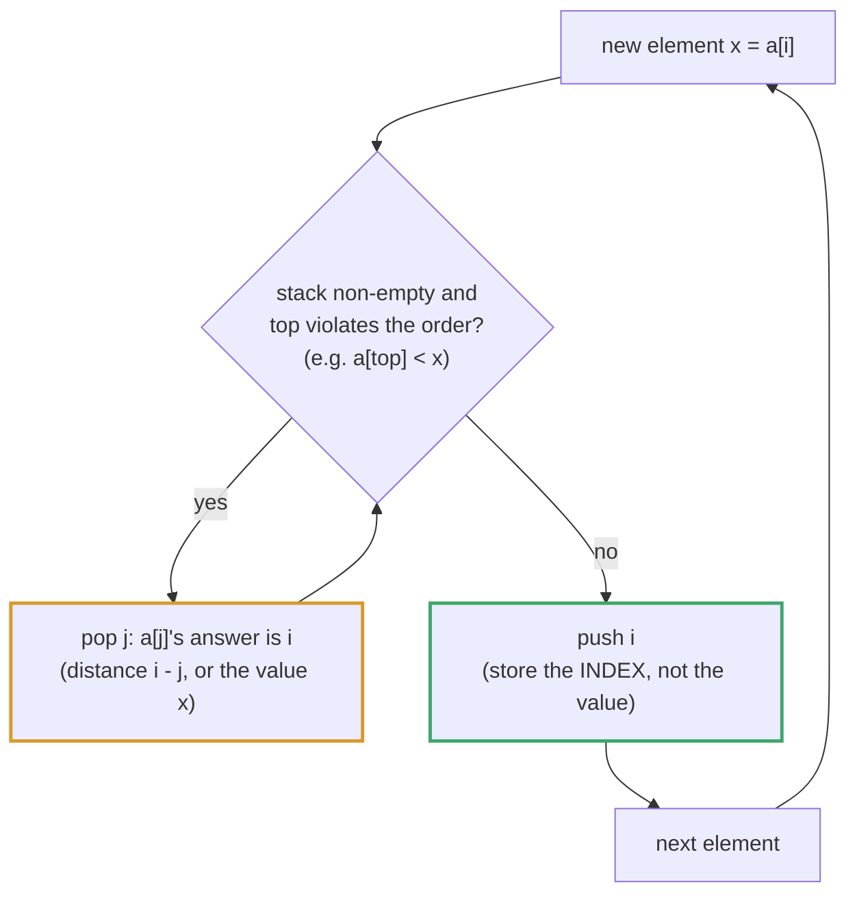
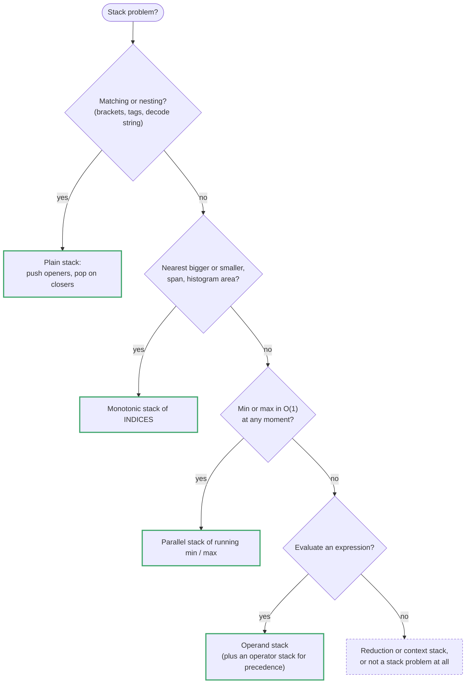

# Topic 06 · Stack — Go Deep Dive

> Go has no `Stack[T]` type in the standard library, and it doesn't need one — a
> slice already has `append` and re-slicing, which is all a stack requires. The
> danger isn't syntax, it's the two things a slice-as-stack quietly gets wrong if
> you don't know the internals: memory retention on pop, and the O(n²)-looking
> monotonic-stack loop that is actually O(n). This is the document that fixes both.

---

## Part 1 · The Slice IS the Stack

### 1.1 The three operations

```go
var s []int

// push
s = append(s, x)

// peek
top := s[len(s)-1]

// pop
top := s[len(s)-1]
s = s[:len(s)-1]
```

That's the entire API. No wrapper type, no `.Push()` method — idiomatic Go stack
code just re-slices. If you want named operations (common when a stack holds a
struct and call sites get noisy), wrap it in a tiny type:

```go
type stack[T any] struct{ data []T }

func (s *stack[T]) push(v T)     { s.data = append(s.data, v) }
func (s *stack[T]) pop() T       { n := len(s.data) - 1; v := s.data[n]; s.data = s.data[:n]; return v }
func (s *stack[T]) peek() T      { return s.data[len(s.data)-1] }
func (s *stack[T]) empty() bool  { return len(s.data) == 0 }
```

This is a thin convenience, not a different data structure — under the hood it's
still one `[]T` with `append`/re-slice, same complexity, same aliasing rules as in
Topic 01.

### 1.2 ⚠️ Popping does not free memory — the retention trap

`s = s[:len(s)-1]` is a **header** operation: it changes `len`, not the backing
array. The popped element's bytes are still sitting in the array, untouched,
until some future `append` overwrites that slot.

```go
s := []*BigStruct{a, b, c}
s = s[:2]                 // "removed" c — but s's backing array still holds
                           // a pointer to c at index 2. c cannot be GC'd yet.
```

For `[]int` this is irrelevant — you're wasting a few bytes of an already-live
array. But for `[]T` where `T` is a pointer, an interface, a slice, or a struct
containing any of those, the popped value keeps its referent alive for as long
as the backing array itself is alive. On a long-lived stack that grows and
shrinks repeatedly (e.g. a parser or interpreter's call stack held for the
program's lifetime), this is a genuine, hard-to-spot memory leak.

✅ **The fix** — nil out the slot you're vacating before shrinking:

```go
func (s *stack[T]) pop() T {
    n := len(s.data) - 1
    v := s.data[n]
    var zero T
    s.data[n] = zero        // let the GC reclaim what v pointed to
    s.data = s.data[:n]
    return v
}
```

This only matters when `T` contains pointers. For `int`, `byte`, `rune` — skip
it, it's pure overhead. Know the rule, don't cargo-cult the zeroing into every
stack you write.

### 1.3 Complexity

| Operation | Complexity | Note |
|---|:--:|---|
| `push` (`append`) | **O(1)** amortized | Same growth rule as topic 1 — may reallocate |
| `pop` (re-slice) | **O(1)** | Header-only; see the retention note above |
| `peek` (`s[len(s)-1]`) | **O(1)** | Bounds-checked read |
| `empty` (`len(s)==0`) | **O(1)** | — |
| Search for a value | **O(n)** | Stacks aren't searchable structures — that's the point |

✅ **Preallocate capacity when you have an upper bound** — `make([]T, 0, n)` — for
the same reason as any other slice: it avoids the geometric-growth reallocations
on the hot path. A parser processing `n` tokens never needs a stack deeper than
`n`, so preallocating `n` is free and exact.

---

## Part 2 · Monotonic Stacks — the Pattern That Owns This Topic

### 2.1 The shape of the problem

A **monotonic stack** keeps its elements in strictly increasing (or decreasing)
order at all times, by popping anything that violates the order *before*
pushing the new element. It answers one question extremely fast: *for each
element, what is the nearest element to one side that is bigger (or smaller)
than it?*

The instinctive brute force is nested loops — for each `i`, scan right until you
find something bigger — which is O(n²). The monotonic stack answers the same
question in O(n) by never re-scanning: every index is pushed once and popped at
most once, ever.

### 2.2 ⚡ Store indices, not values

Push **indices** onto the stack, not the values themselves. You almost always
need both the value (for the comparison) and the position (to compute a
distance, a width, or to write into an output slice at the right slot) — and
only the index gets you both, since `nums[i]` recovers the value but `i` cannot
be recovered from the value alone (duplicates, or you need `i` for the answer
itself as in Daily Temperatures).

### 2.3 Trace: Daily Temperatures (LC 739)

Input `temps = [73, 74, 75, 71, 69, 72, 76, 73]`. For each day, how many days
until a warmer temperature? Stack holds **indices** of a not-yet-resolved
"waiting for something warmer" run, kept so that `temps[stack]` is strictly
*decreasing* bottom-to-top.

```
i=0 T=73  stack=[]         push 0            stack=[0]
i=1 T=74  74>temps[0]=73 → pop 0, ans[0]=1-0=1   push 1   stack=[1]
i=2 T=75  75>temps[1]=74 → pop 1, ans[1]=2-1=1   push 2   stack=[2]
i=3 T=71  71<temps[2]=75 → no pop               push 3   stack=[2,3]
i=4 T=69  69<temps[3]=71 → no pop               push 4   stack=[2,3,4]
i=5 T=72  72>temps[4]=69 → pop 4, ans[4]=5-4=1
          72>temps[3]=71 → pop 3, ans[3]=5-3=2
          72<temps[2]=75 → no pop               push 5   stack=[2,5]
i=6 T=76  76>temps[5]=72 → pop 5, ans[5]=6-5=1
          76>temps[2]=75 → pop 2, ans[2]=6-2=4
          stack empty                            push 6   stack=[6]
i=7 T=73  73<temps[6]=76 → no pop               push 7   stack=[6,7]
end       remaining indices [6,7] never found a warmer day → ans stays 0
```

Result: `[1,1,4,2,1,1,0,0]`. Notice the stack's temperatures, read bottom to
top, are always decreasing — `[73]` → `[74]` → `[75]` → `[75,71]` →
`[75,71,69]` → `[75,72]` → `[76]` → `[76,73]`. That invariant is what
"monotonic" means, and it's what lets each element resolve in O(1) amortized
time: popping index `j` means "day `j`'s answer is exactly `i - j`, and day `j`
will never need to be looked at again."

### 2.4 ⚠️ It looks like O(n²), it is O(n) — amortized analysis

The `while stack not empty and condition: pop()` inside a `for i := range nums`
loop *looks* quadratic — a `while` nested in a `for`. It is not. The bound isn't
"iterations of the inner loop per outer step," it's **total pops across the
entire run**. Every index is pushed exactly once (in the outer loop) and popped
at most once (ever, by any iteration). Total pushes ≤ n, total pops ≤ n, so
total work across the *whole* algorithm is O(n), not O(n) per element. This is
the same aggregate-analysis trick that makes amortized `append` O(1): don't
charge the cost to the step that pays it, charge it to the element that causes
it, and note each element causes it once.

### 2.5 Largest Rectangle in Histogram (LC 84) — what the popped index buys you

Same skeleton, harder payoff. Stack holds indices of bars with increasing
height. When bar `i` is shorter than the bar on top of the stack, that taller
bar can no longer extend rightward — pop it and finalize the largest rectangle
*that uses it as the shortest bar*. The **width** of that rectangle is
`i - stack[top-1] - 1` after popping: the next-still-standing index to the left
is the left boundary, `i` is the right boundary, and the height is
`heights[popped]`. This is exactly why the index, not the height, sits on the
stack — the width computation needs positions on both sides, and only indices
carry position.

---

## Part 3 · Matching / Validation Stacks

### 3.1 Valid Parentheses (LC 20) — the `map[byte]byte` lookup

```go
func isValid(s string) bool {
    pairs := map[byte]byte{')': '(', ']': '[', '}': '{'}
    stack := make([]byte, 0, len(s))

    for i := 0; i < len(s); i++ {
        c := s[i]
        if open, isClose := pairs[c]; isClose {
            if len(stack) == 0 || stack[len(stack)-1] != open {
                return false          // early exit — no point scanning further
            }
            stack = stack[:len(stack)-1]
        } else {
            stack = append(stack, c)
        }
    }
    return len(stack) == 0            // ⚠️ unmatched OPENERS are easy to forget
}
```

Two things people get wrong here: forgetting the final `len(stack) == 0` check
(an unclosed `"((("` passes every in-loop check and only fails here), and
comparing against a closing bracket by string-building a `switch` instead of a
map — the map is both shorter and O(1) instead of a chain of string compares.

### 3.2 The general "matching stack" shape

Anything of the form *"does this later thing correctly close an earlier thing"*
— parentheses, XML/HTML tags, a calculator's operator precedence, backtracking
"undo" logs — fits the same shape: push on open/commit, pop-and-compare on
close/undo, fail fast on mismatch, and check for a clean empty stack at the end.

---

## Part 4 · Stacks vs. Recursion — Go-Specific Notes

### 4.1 Go goroutine stacks are growable, unlike a fixed OS thread stack

Every goroutine starts with a **small** stack — **2 KB** is the floor (`stackMin = 2048` in `runtime/stack.go`),
and since Go 1.19 the runtime adapts the *starting* size to the average stack use it observes at each GC. When a
call needs more room the runtime **allocates a bigger stack (double the size), copies the old one over and fixes up
the pointers into it** — so growth is automatic and invisible. The ceiling is **1 GB on 64-bit platforms**
(250 MB on 32-bit), adjustable with `debug.SetMaxStack`. This is different from an unconfigured POSIX thread (a
fixed 1–8 MB) or a JVM thread with a small default `-Xss`: a naive recursive DFS in Go survives depths that would
blow a fixed C thread stack immediately.

⚠️ That ceiling is real, though. A pathologically unbalanced input — a million-node linked-list-shaped "tree", or an
adversarially deep recursion in a backtracking problem — can still exhaust it and crash with
`runtime: goroutine stack exceeds 1000000000-byte limit` / `fatal error: stack overflow`, which is a **fatal error,
not a panic**: `recover` cannot catch it. If input shape is untrusted or unbounded, prefer an explicit `[]T` stack
over recursion.

### 4.2 No tail-call optimization

Go's compiler does **not** perform tail-call optimization. A recursive function
written in "obviously tail-recursive" style still consumes one stack frame per
call in Go — it is not rewritten into a loop the way it would be in Scheme or
(sometimes) in optimized C. Combined with 4.1, this means: recursion in Go is
safer than in a fixed-stack language but not free, and for a hot path or an
input with unbounded depth, converting recursion to an explicit stack is both
the safer *and* frequently the faster choice — it also avoids per-call function
overhead (argument copying, defer bookkeeping if any) that the recursive
version pays on every level.

### 4.3 Iterative DFS shape

```go
func iterativeDFS(root *TreeNode) []int {
    if root == nil {
        return nil
    }
    var out []int
    stack := []*TreeNode{root}
    for len(stack) > 0 {
        n := stack[len(stack)-1]
        stack = stack[:len(stack)-1]
        out = append(out, n.Val)
        // push right before left so left is processed first (LIFO)
        if n.Right != nil {
            stack = append(stack, n.Right)
        }
        if n.Left != nil {
            stack = append(stack, n.Left)
        }
    }
    return out
}
```

The push order (`Right` then `Left`) is the whole trick: a LIFO stack pops
whatever was pushed last, so pushing `Right` first guarantees `Left` comes off
first, matching recursive pre-order's `visit → left → right`.

---

## Part 5 · Python vs. Go — Where They Diverge

| | Python | Go |
|---|---|---|
| Stack type | `list` (`.append` / `.pop()`), or `collections.deque` | No built-in type — `[]T` with `append`/re-slice |
| Pop cost | O(1) amortized | O(1) — but see the retention gotcha (§1.2) |
| Memory after pop | Refcounted; freed once unreferenced | **Not freed** — backing array still holds it until overwritten |
| Recursion limit | ~1000 by default (`sys.setrecursionlimit`), fixed C stack underneath | Growable goroutine stack, default ceiling ~1 GB |
| Tail calls | Not optimized either | Not optimized — same cost model, deeper safe ceiling |
| Bracket-matching lookup | `dict` literal, or `str` membership | `map[byte]byte` — O(1), same idea |
| Generic stack wrapper | Not needed — `list` is already generic | Optional `stack[T any]` via Go 1.18+ generics |

---

## Part 6 · Algorithms Owned by This Topic

| Algorithm | Time | Space | Problem |
|---|:--:|:--:|---|
| Matching-pairs / bracket validation | O(n) | O(n) | LC 20 Valid Parentheses |
| Monotonic stack (next greater/smaller) | O(n) | O(n) | LC 496, 503 Next Greater Element |
| Monotonic stack (distance-to-warmer) | O(n) | O(n) | LC 739 Daily Temperatures |
| Monotonic stack (width via popped index) | O(n) | O(n) | LC 84 Largest Rectangle in Histogram |
| Monotonic stack (2D histogram rows) | O(rows·cols) | O(cols) | LC 85 Maximal Rectangle |
| Two-stack queue simulation | O(1) amortized/op | O(n) | LC 232 Implement Queue using Stacks |
| Min-stack (aux stack for running min) | O(1)/op | O(n) | LC 155 Min Stack |
| Iterative tree/graph DFS | O(V+E) | O(h) or O(V) | Any recursion-to-iteration conversion |
| Operator-precedence / calculator evaluation | O(n) | O(n) | LC 150, 224, 227 |

---

## Part 7 · Building a Min-Stack From Scratch (LC 155)

The trick: a **second, parallel stack** that tracks the running minimum at each
depth, so popping the main stack automatically "un-does" the minimum too —
without that, popping the current minimum would leave you with no O(1) way to
know the new minimum.

```go
package main

type MinStack struct {
    data []int
    mins []int   // mins[i] = min(data[0..i]) — the running min AT that depth
}

func Constructor() MinStack {
    return MinStack{}
}

func (s *MinStack) Push(val int) {
    s.data = append(s.data, val)
    if len(s.mins) == 0 || val < s.mins[len(s.mins)-1] {
        s.mins = append(s.mins, val)
    } else {
        s.mins = append(s.mins, s.mins[len(s.mins)-1]) // repeat current min
    }
}

func (s *MinStack) Pop() {
    n := len(s.data) - 1
    s.data = s.data[:n]
    s.mins = s.mins[:n]   // dropping this depth's mins entry restores the prior min
}

func (s *MinStack) Top() int {
    return s.data[len(s.data)-1]
}

func (s *MinStack) GetMin() int {
    return s.mins[len(s.mins)-1]   // O(1) — no scan, ever
}
```

**Talk track while writing:** `mins` is exactly as tall as `data` at every
point, one running-minimum snapshot per depth — that redundancy (repeating the
same min across many pushes) is the O(n) space price for turning `GetMin` from
an O(n) scan into an O(1) read. Popping both stacks together is what makes the
minimum "time-travel" correctly back to what it was before the popped value was
pushed.

---

<!-- block:06_go_1_monotonic -->
## Part 8 · Monotonic Stacks in Go: Four Directions, the Sentinel and the Duplicate Rule

Part 2 gave the idea. This Part is the *reference*: the four directions as one table, the strictness rule that
decides duplicates, and the Go spelling of every stack problem in the folder. All code ran on Go 1.24.5 against
LeetCode's own examples.



### The four faces

| I want, for each `i`… | Scan | Pop while `a[top]` is… | Stack, bottom → top |
|---|---|---|---|
| **next greater** (right) | right → left | `<= a[i]` | strictly decreasing |
| **previous greater** (left) | left → right | `<= a[i]` | strictly decreasing |
| **next smaller** (right) | right → left | `>= a[i]` | strictly increasing |
| **previous smaller** (left) | left → right | `>= a[i]` | strictly increasing |

(The "resolve on pop" form in Part 2.3 is the same machine seen from the popped element's side.) Read `-1` / `n` when
the stack is empty.

**The duplicate rule.** When you *count* things (Sum of Subarray Minimums below), use a **strict** comparison on one
side and a **non-strict** one on the other, so a tie is credited to exactly one element. Strict on both sides counts
`[2 2]` twice (returns 8, not 6); non-strict on both never counts it.

### The sentinel: Largest Rectangle in Histogram (LC 84)

A stack seeded with the index `-1` is a *wall* on the left, and a virtual bar of height `0` at `i == n` drains
everything still standing. Without them you need special cases for "stack empty" and a second loop:

```go
func largestRectangle(h []int) int {
    st := []int{-1}                          // sentinel: the wall before index 0
    best := 0
    for i := 0; i <= len(h); i++ {
        cur := 0                             // the virtual bar at i == n drains the stack
        if i < len(h) { cur = h[i] }
        for len(st) > 1 && h[st[len(st)-1]] >= cur {
            height := h[st[len(st)-1]]
            st = st[:len(st)-1]
            width := i - st[len(st)-1] - 1   // between the two BOUNDARIES, not the popped index
            best = max(best, height*width)
        }
        st = append(st, i)
    }
    return best                              // [2 1 5 6 2 3] -> 10     [1 2 3 4] -> 6
}
```

`width = i - st[len(st)-1] - 1` reads the **new** top after the pop — the left boundary — and `i` is the right one; the
popped index is *inside* the rectangle, not a boundary. (`len(st) > 1` stops before popping the sentinel.)

### Next Greater, Daily Temperatures, Stock Span

```go
// LC 496: one pass over nums2, then look each query up. A missing key reads 0, so use comma-ok.
next := map[int]int{}
var st []int                                 // VALUES are fine here: nums2 is all distinct
for _, x := range nums2 {
    for len(st) > 0 && st[len(st)-1] < x { next[st[len(st)-1]] = x; st = st[:len(st)-1] }
    st = append(st, x)
}                                            // ([4 1 2], [1 3 4 2]) -> [-1 3 -1]

// LC 739: the payload is a DISTANCE, so the stack must hold INDICES.
ans := make([]int, len(t))
for i, x := range t {
    for len(st) > 0 && t[st[len(st)-1]] < x {
        j := st[len(st)-1]; st = st[:len(st)-1]
        ans[j] = i - j
    }
    st = append(st, i)
}                                            // [73 74 75 71 69 72 76 73] -> [1 1 4 2 1 1 0 0]
```

Online Stock Span (LC 901) is the same machine fed one price at a time, plus **span collapsing** — a stack entry stands
for *many* days, so store `(price, span)` and absorb the popped spans:

```go
type StockSpanner struct{ prices, spans []int }

func (s *StockSpanner) Next(p int) int {
    span := 1
    for len(s.prices) > 0 && s.prices[len(s.prices)-1] <= p {   // <= : "less than OR EQUAL"
        span += s.spans[len(s.spans)-1]                          // absorb the collapsed days
        s.prices, s.spans = s.prices[:len(s.prices)-1], s.spans[:len(s.spans)-1]
    }
    s.prices, s.spans = append(s.prices, p), append(s.spans, span)
    return span                              // 100 80 60 70 60 75 85 -> 1 1 1 2 1 4 6
}
```

### Sum of Subarray Minimums — the contribution technique (LC 907)

`arr[i]` is the minimum of exactly `left[i] × right[i]` subarrays. Take the previous **strictly** smaller and the next
smaller-**or-equal**, so each tie is owned by one element. Watch the modulus — `arr[i]*left[i]*right[i]` can exceed
`int64` if you multiply before reducing, so reduce between multiplications:

```go
const mod = 1_000_000_007
// left[i]  = i - (index of previous element STRICTLY smaller, or -1)
// right[i] = (index of next element SMALLER OR EQUAL, or n) - i
total = (total + arr[i]*left[i]%mod*right[i]) % mod        // [3 1 2 4] -> 17    [11 81 94 43 3] -> 444
```

### Car Fleet (LC 853): sort, then a stack of arrival times

The transform is the problem: a car's arrival time is `(target - position) / speed`. Process cars from **closest to the
target** backwards. A car that would arrive *no later* than the fleet ahead is absorbed by it; a strictly *later*
arrival starts a new fleet:

```go
idx := make([]int, len(position))
for i := range idx { idx[i] = i }
sort.Slice(idx, func(a, b int) bool { return position[idx[a]] > position[idx[b]] })   // nearest first
var times []float64
for _, i := range idx {
    t := float64(target-position[i]) / float64(speed[i])
    if len(times) == 0 || t > times[len(times)-1] { times = append(times, t) }         // strictly slower: new fleet
}
return len(times)          // target 12, [10 8 0 5 3], [2 4 1 1 3] -> 3
```

Compare with `>` — equal arrival times are **one** fleet. Sorting by position *ascending* decides each car using the cars
*behind* it, which cannot affect it: a plausible wrong number with no error. `sort.Slice` on an index slice sorts a
permutation without reordering the caller's `position` and `speed`.

### Circular arrays (LC 503)

```go
for i := 0; i < 2*n; i++ {
    x := nums[i%n]
    for len(st) > 0 && nums[st[len(st)-1]] < x { res[st[len(st)-1]] = x; st = st[:len(st)-1] }
    if i < n { st = append(st, i) }          // push only in the FIRST pass
}                                            // [1 2 1] -> [2 -1 2]
```

### Which stack pattern? — a decision guide



---
<!-- /block:06_go_1_monotonic -->

<!-- block:06_go_2_shapes -->
## Part 9 · Reduction, Context and Parsing Stacks in Go

### Go's `/` already truncates toward zero

Reverse Polish Notation (LC 150) and Basic Calculator II (LC 227) want division that **truncates toward zero**. Python's
`//` floors (`-7 // 2 == -4`), so Python solutions need `int(a / b)` — which loses precision on huge operands. Go's
integer `/` truncates toward zero natively (`-7 / 2 == -3`, and `-7 % 2 == -1`), so this is one of the few places Go is
simply easier:

```go
func evalRPN(tokens []string) int {
    var st []int
    for _, t := range tokens {
        switch t {
        case "+", "-", "*", "/":
            b, a := st[len(st)-1], st[len(st)-2]        // b is on TOP: the SECOND operand
            st = st[:len(st)-2]
            switch t {
            case "+": st = append(st, a+b)
            case "-": st = append(st, a-b)               // a - b, not b - a
            case "*": st = append(st, a*b)
            case "/": st = append(st, a/b)               // truncates toward zero, as required
            }
        default:
            n, _ := strconv.Atoi(t)
            st = append(st, n)
        }
    }
    return st[0]                                         // 22 for the LeetCode example; ["4","13","5","/","+"] -> 6
}
```

**Basic Calculator II** treats the expression as a sum of signed *terms*: remember the operator that came **before** the
current number; `+`/`-` push a term, `*`/`/` fold into the top one. Flush once more at the end of the string:

```go
for i := 0; i <= len(s); i++ {
    var c byte = '+'                                     // a virtual '+' at the end flushes the last number
    if i < len(s) { c = s[i] }
    if c >= '0' && c <= '9' { num = num*10 + int(c-'0'); continue }
    if c == ' ' { continue }
    switch op {
    case '+': st = append(st, num)
    case '-': st = append(st, -num)
    case '*': st[len(st)-1] *= num
    case '/': st[len(st)-1] /= num
    }
    op, num = c, 0
}                                                        // "3+2*2" -> 7   " 3/2 " -> 1   "14-3/2" -> 13
```

### Reduction stacks

If adjacent items can annihilate, compare the incoming item with the top. Remove Adjacent Duplicates, Backspace
Compare and **Asteroid Collision** (LC 735) are all this. The collision is *only* a right-mover on top meeting an
incoming left-mover, and it must be a `for`, not an `if` — one incoming asteroid can destroy several:

```go
for _, x := range asteroids {
    alive := true
    for alive && x < 0 && len(st) > 0 && st[len(st)-1] > 0 {
        top := st[len(st)-1]
        switch {
        case top < -x: st = st[:len(st)-1]               // the right-mover dies; keep colliding
        case top == -x: st = st[:len(st)-1]; alive = false   // both die
        default:        alive = false                    // the incoming one dies
        }
    }
    if alive { st = append(st, x) }
}                                                        // [5 10 -5] -> [5 10]   [1 2 3 -10] -> [-10]
```

`[-2 1]` are flying *apart* — testing "signs differ" instead of "right-mover then left-mover" collides them by mistake.

**Remove K Digits** (LC 402) is a greedy monotonic stack of bytes: pop while the incoming digit is smaller and
deletions remain; whatever is left of `k` comes off the **end**; then strip leading zeros:

```go
for i := 0; i < len(num); i++ {
    for k > 0 && len(st) > 0 && st[len(st)-1] > num[i] { st = st[:len(st)-1]; k-- }
    st = append(st, num[i])
}
st = st[:len(st)-k]                                      // leftover deletions come off the END
s := strings.TrimLeft(string(st), "0")
if s == "" { return "0" }                                // "1432219",3 -> "1219"   "10200",1 -> "200"   "10",2 -> "0"
```

### Context stacks: save on the way in, restore on the way out

When a bracket carries *state*, push the whole state on `[` / `(` and pop it on the close. A small struct is the Go
idiom:

```go
func decodeString(s string) string {
    type frame struct { prefix string; k int }
    var st []frame
    var cur strings.Builder
    num := 0
    for i := 0; i < len(s); i++ {
        switch c := s[i]; {
        case c >= '0' && c <= '9': num = num*10 + int(c-'0')
        case c == '[':
            st = append(st, frame{cur.String(), num})    // save the context
            cur.Reset(); num = 0
        case c == ']':
            f := st[len(st)-1]; st = st[:len(st)-1]
            inner := cur.String(); cur.Reset()
            cur.WriteString(f.prefix); cur.WriteString(strings.Repeat(inner, f.k))
        default: cur.WriteByte(c)
        }
    }
    return cur.String()                                  // "3[a2[c]]" -> "accaccacc"
}
```

Basic Calculator (LC 224, parentheses) is the same shape with the context `(result, sign)`; precedence needs the term
stack above, and both together need the *shunting-yard* algorithm's operator stack — say its name, then write the
simpler one.

### An index stack with a sentinel base (LC 32)

```go
st, best := []int{-1}, 0                                  // -1: the wall before the string
for i := 0; i < len(s); i++ {
    if s[i] == '(' { st = append(st, i); continue }
    st = st[:len(st)-1]
    if len(st) == 0 { st = append(st, i) } else { best = max(best, i-st[len(st)-1]) }
}                                                        // "(()" -> 2   ")()())" -> 4   "" -> 0
```

### Iterative in-order traversal (the idiom for topic 10)

```go
for cur := root; cur != nil || len(st) > 0; {
    for cur != nil { st = append(st, cur); cur = cur.Left }   // dive left, remembering the path
    cur = st[len(st)-1]; st = st[:len(st)-1]
    out = append(out, cur.Val)
    cur = cur.Right
}
```

### Go traps in this topic

| Trap | What happens | The fix |
|---|---|---|
| Popping an empty slice | `st[len(st)-1]` **panics** (`index out of range [-1]`) — a loud failure. (Python's `st[i-1]` with `i == 0` silently wraps to the *last* element instead.) | Guard with `len(st) > 0` *before* indexing, short-circuited. |
| Popping a `[]*T` without clearing | The popped pointer stays in the backing array, keeping its referent alive (Part 1.2). | `st[n] = nil` before `st = st[:n]`. |
| `st = st[:0]` to "reuse" a stack | Fine for one stack; **two slices over the same array alias**. | Do not share a backing array between stacks. |
| Comparing bytes to digits | `c - '0'` on a non-digit gives garbage without an error. | Range-check `c >= '0' && c <= '9'` first. |
| Reading `st[len(st)-2]` with one element | Panics. | Check `len(st) >= 2` for binary operators (valid RPN guarantees it). |
| Multiplying before the modulus | `arr[i]*left[i]*right[i]` can wrap `int64` and go negative silently. | Reduce between multiplications. |
| `int` vs `byte` arithmetic | `st[len(st)-1] > num[i]` compares `byte`s — fine; mixing `byte` and `int` needs a conversion. | Convert explicitly (`int(c-'0')`). |

### Follow-ups the interviewer reaches for

| Follow-up | The answer |
|---|---|
| "Min Stack in O(1) extra space." | Store `value - min` instead of a second stack; fragile, and the subtraction can overflow. |
| "Max Stack with `popMax`." | Two stacks give O(n) `popMax`; a heap with lazy deletion (or a linked list + ordered map) gives O(log n). |
| "Thread-safe stack." | A `sync.Mutex` around the slice, or a channel (a buffered channel is a FIFO — not a stack). |
| "Implement a queue with two stacks." | Topic 07 — amortised O(1). |
| "No recursion allowed." | The explicit `[]T` stack above; Go's 1 GB stack ceiling is generous but not infinite. |
| "Stream input." | A monotonic stack is already online (Stock Span). |

---
<!-- /block:06_go_2_shapes -->

<!-- problem-map:start -->
## Part 10 · Every Problem in This Topic, by Pattern

Fourteen problems, five moves (matching · deferred evaluation · monotonic stack · auxiliary state · contribution) — the Python guide's map in Go, with the Go-only traps. Topic 06's solutions are Python-first; the Go column is the plan you would write.

| Problem | Move | The idea — and the trap it sets |
|---|---|---|
| [001 · Valid Parentheses](GoDSA/06_stack/001_valid_parentheses/solution.go) <br>LC 20 · Easy | Matching stack | `map[byte]byte{')': '(', ...}`; `if open, isClose := pairs[c]; isClose { … }`; finish with `len(stack) == 0`. **Trap:** counting brackets instead of order; forgetting the final emptiness check (`"((("`); indexing an empty stack (panic). |
| [002 · Baseball Game](GoDSA/06_stack/002_baseball_game/solution.go) <br>LC 682 · Easy | Deferred evaluation | A `[]int` of scores: `+` *peeks* two and pushes a third, `D` pushes a new doubled value, `C` pops. **Trap:** `+` as pop-two-push-sum; doubling in place. |
| [003 · Next Greater Element I](GoDSA/06_stack/003_next_greater_element_i/solution.go) <br>LC 496 · Easy | Monotonic stack | One pass over `nums2` into a `map[int]int`; look each query up with comma-ok. **Trap:** re-scanning per query; a missing key reads `0`, which is a legal-looking answer. |
| [004 · Min Stack](GoDSA/06_stack/004_min_stack/solution.go) <br>LC 155 · Medium | Auxiliary parallel stack | `data []int` and `mins []int` pushed and popped together; `GetMin` is `mins[len(mins)-1]`. **Trap:** pushing to `mins` only on a new minimum; popping one slice but not the other. |
| [005 · Evaluate Reverse Polish Notation](GoDSA/06_stack/005_evaluate_reverse_polish_notation/solution.go) <br>LC 150 · Medium | Operand stack | `b, a := st[n-1], st[n-2]` — `b` is the *second* operand; Go's `/` **truncates toward zero**, so no `int(a/b)` workaround. **Trap:** `b - a`; `strconv.Atoi` errors ignored on malformed tokens. |
| [006 · Generate Parentheses](GoDSA/06_stack/006_generate_parentheses/solution.go) <br>LC 22 · Medium | Backtracking with depth | Recurse with `open`/`close` counters; `path = append(path, '(')` … then `path = path[:len(path)-1]` to undo. **Trap:** appending a shared `path` into the result without copying (every row aliases); `close <= open`. |
| [007 · Daily Temperatures](GoDSA/06_stack/007_daily_temperatures/solution.go) <br>LC 739 · Medium | Monotonic stack (distance) | Stack of **indices**; `ans[j] = i - j` on pop. **Trap:** pushing temperatures; `<=` instead of `<` (all-equal input). |
| [008 · Car Fleet](GoDSA/06_stack/008_car_fleet/solution.go) <br>LC 853 · Medium | Sort, then stack | `sort.Slice` on an *index* slice by position descending; arrival times `float64`; a strictly *later* time starts a fleet. **Trap:** ascending sort; `>=` (equal times must merge). |
| [009 · Online Stock Span](GoDSA/06_stack/009_online_stock_span/solution.go) <br>LC 901 · Medium | Online stack with span collapsing | `prices`/`spans` slices in a struct; pop while `<= p`, absorbing spans. **Trap:** bare prices with `1 + pops`; `<` instead of `<=`. |
| [010 · Largest Rectangle in Histogram](GoDSA/06_stack/010_largest_rectangle_in_histogram/solution.go) <br>LC 84 · Hard | Monotonic stack (width) | Seed `[]int{-1}`; a virtual height-0 bar at `i == n`; `width := i - st[top] - 1` after the pop. **Trap:** no sentinel; the popped index in the width formula; popping the `-1`. |
| [011 · Basic Calculator II](GoDSA/06_stack/011_basic_calculator_ii/solution.go) <br>LC 227 · Medium | Term stack | `st[len(st)-1] /= num` truncates toward zero natively; flush with a virtual `+` at the end of the string. **Trap:** forgetting the final flush; skipping spaces incorrectly; digits parsed one byte at a time. |
| [012 · Asteroid Collision](GoDSA/06_stack/012_asteroid_collision/solution.go) <br>LC 735 · Medium | Collision stack | Inner `for` (not `if`) while a right-mover on top meets a left-mover. **Trap:** colliding on any sign difference (`[-2 1]`); one collision per asteroid. |
| [013 · Remove K Digits](GoDSA/06_stack/013_remove_k_digits/solution.go) <br>LC 402 · Medium | Greedy monotonic stack | `[]byte` stack; pop while `st[top] > num[i]` and `k > 0`; chop `st[:len(st)-k]`; `strings.TrimLeft(s, "0")`. **Trap:** leftover `k`; leading zeros; returning `""` instead of `"0"`. |
| [014 · Sum of Subarray Minimums](GoDSA/06_stack/014_sum_of_subarray_minimums/solution.go) <br>LC 907 · Medium | Contribution technique | `left`/`right` arrays from two stacks — strict on one side, non-strict on the other; reduce mod between multiplications. **Trap:** strict on both sides (`[2 2]` → 8); `int64` wrap before `% mod`. |

---
<!-- problem-map:end -->

## Checklist Before Leaving This Topic

- [ ] Explain why a Go slice needs no wrapper to act as a stack
- [ ] Explain why `s[:len(s)-1]` doesn't free the popped element, and when that matters
- [ ] Explain the monotonic-stack invariant and why storing indices beats storing values
- [ ] Trace a monotonic-stack problem by hand and show each element pushed/popped once
- [ ] Explain why the nested while-loop is O(n) overall, not O(n²) (aggregate analysis)
- [ ] Use `map[byte]byte` for bracket-pair lookups with an early-exit mismatch check
- [ ] Explain why Go recursion is safer than a fixed-stack language but not TCO'd
- [ ] Convert a recursive DFS to an iterative one with an explicit `[]T` stack
- [ ] Write Min Stack with a parallel running-minimum stack in under 10 minutes
- [ ] Fill in the four-directions table (next/previous × greater/smaller) including the pop comparison <!--ca-->
- [ ] Use a `-1` sentinel and a virtual final bar so the histogram loop has no special cases <!--ca-->
- [ ] State the duplicate rule: strict on one side, non-strict on the other <!--ca-->
- [ ] Know that Go's `/` truncates toward zero (Python's `//` floors) and use it in RPN / Basic Calculator <!--ca-->
- [ ] State the goroutine-stack facts correctly: 2 KB start, growth by copying, 1 GB ceiling, fatal (unrecoverable) overflow <!--ca-->
