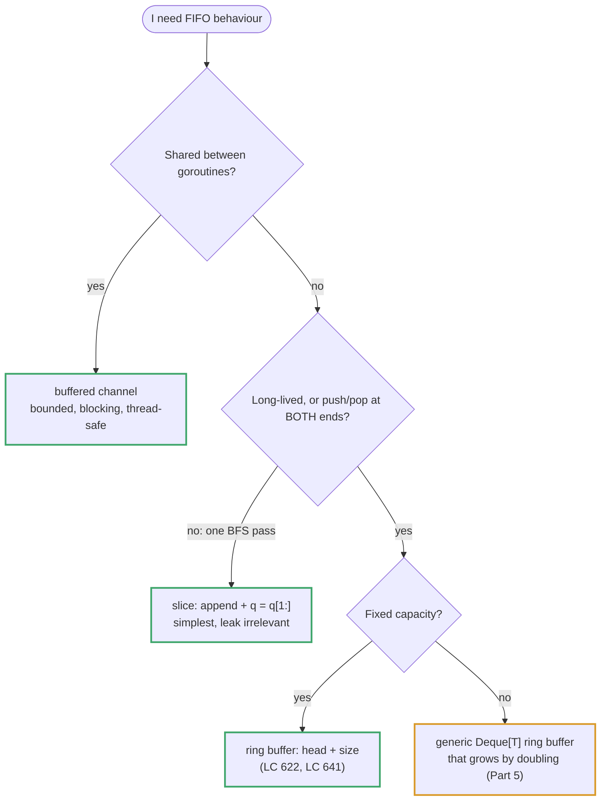
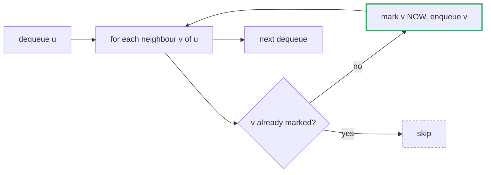

# Topic 07 · Queue & Deque — Go Deep Dive

> Python hands you `collections.deque` — a ring-buffer with genuine O(1) operations
> on both ends, batteries included. Go hands you a slice and a standard library
> package (`container/list`) that predates generics. Neither is a deque out of the
> box. Picking the wrong one silently turns your "O(1) dequeue" into a memory leak
> or a boxing-allocation machine. This is the document that makes the choice
> deliberate instead of accidental.

---

## Part 1 · Go Has No Queue or Deque Type — You Must Choose One

Unlike Python's `collections.deque` (a doubly-linked list of fixed-size blocks,
genuinely O(1) at both ends, in the standard library, no import ceremony), Go
offers no ready-made FIFO or double-ended container. You have three real options,
and each has a different cost model. Knowing which one to reach for — and being
able to explain *why* — is the actual skill this topic tests.

### 1.1 Strategy A: slice-as-queue (`append` + re-slice)

```go
queue := []int{}
queue = append(queue, x)   // enqueue: O(1) amortized
front := queue[0]          // peek: O(1)
queue = queue[1:]          // dequeue: O(1) — but read the fine print below
```

`queue[1:]` looks like an O(1) dequeue, and mechanically it is: it's a 3-word
header rewrite — `array` pointer advances by one element, `len` and `cap` both
shrink by one. No data moves. That's the same slice-header arithmetic from
`01_arrays_hashing` §1.2.

> ⚠️ **What `s[1:]` costs — two real, bounded effects.** The backing array is never shrunk; the new header just
> points one element further into it, and *any* pointer into an array keeps the whole array alive.
>
> 1. **Dequeued slots are not zeroed.** For `[]int` that is irrelevant. For `[]*T`, `[]string`, or structs holding
>    pointers, every dequeued element stays reachable — and so does whatever it points to — until the array is
>    replaced.
> 2. **`cap` shrinks with `len`**, so a queue that is continuously enqueued and dequeued keeps running out of room at
>    the tail and reallocating. It is *not* an unbounded leak: each reallocation copies only the **live** elements
>    into a fresh array and abandons the dead prefix. But it is steady churn. Measured on Go 1.24.5, a queue holding
>    100 live `int`s reallocated about once every 123 push+pop pairs (1,613 times over 200,000 pairs); with 10 live
>    elements it reallocated every 10; with 1,000, every 534.
> ```
>      original backing array (cap 8)
>      ┌────┬────┬────┬────┬────┬────┬────┬────┐
>      │ 10 │ 20 │ 30 │ 40 │  ·  │  ·  │  ·  │  ·  │
>      └────┴────┴────┴────┴────┴────┴────┴────┘
>        ▲                        after 3x dequeue:
>        │                        queue → starts at index 3, cap now 5
>        original queue           10,20,30 are dead weight, still allocated
> ```
> For a **short-lived queue that drains completely in one pass** (a single BFS run, for example), neither effect
> matters — the whole array becomes garbage the moment the function returns. They matter for **long-running queues**
> that live for the life of a service. Calibrate the warning to the lifetime.

✅ **Fix when it matters:** periodically compact by copying the live tail into a
fresh, appropriately-sized slice (`queue = append([]int(nil), queue...)`), or
switch to the ring buffer in §1.3.

### 1.2 Strategy B: `container/list` — a real doubly linked list

```go
import "container/list"

l := list.New()
l.PushBack(10)              // enqueue at tail
l.PushFront(5)              // push at head — genuine deque operation
front := l.Front()          // *list.Element, O(1)
v := front.Value.(int)      // Value is `any` — must type-assert to unbox
l.Remove(front)             // O(1) removal given the element handle
```

This is Go's only standard-library container with true O(1) operations at
**both** ends — no capacity games, no re-slicing tricks. The cost is structural:

- Every node (`list.Element`) is a **separate heap allocation** with `prev`,
  `next` pointers and a `Value any` field.
- `Value any` means a pushed `int` gets **boxed into an interface** — an
  additional allocation (for anything that doesn't fit in the interface's
  direct word, and even small values often escape to the heap here) plus a
  type assertion on every read. Compare to a slice of `int`, which is 8
  contiguous bytes per element with zero boxing.
- Traversal is pointer-chasing across scattered heap objects — cache-hostile
  compared to a slice's contiguous memory, the same locality argument from
  `01_arrays_hashing` §1.2.

⚡ Use `container/list` when you genuinely need push/pop at *both* ends and
correctness/simplicity matters more than allocation count. Avoid it in a hot
loop over millions of elements — the boxing and pointer-chasing add up.

### 1.3 Strategy C: index-based ring buffer — the one to hand-roll

Preallocate a fixed-capacity slice and track `head`/`tail` cursors with modulo
wraparound. No boxing, no leak, no per-element heap allocation — genuine O(1) at
both ends, contiguous memory, cache-friendly. The tradeoff is you must handle
growth yourself when the buffer fills. See the full implementation in Part 5 —
this is the version worth being able to write cold in an interview.

```
   buf (cap 8), head=2, tail=5, count=3
   ┌────┬────┬────┬────┬────┬────┬────┬────┐
   │  ·  │  ·  │ 10 │ 20 │ 30 │  ·  │  ·  │  ·  │
   └────┴────┴────┴────┴────┴────┴────┴────┘
              ▲head        ▲tail
   PushBack(40)  → buf[5]=40, tail=(5+1)%8=6, count=4
   PopFront()    → return buf[2]=10, head=(2+1)%8=3, count=3
```

---

## Part 2 · BFS: the Canonical Queue Consumer

Breadth-first search is where the queue earns its keep: level-order tree
traversal, shortest path in an unweighted graph, multi-source flood fill.

```go
func levelOrder(root *TreeNode) [][]int {
    if root == nil {
        return nil
    }
    var result [][]int
    queue := []*TreeNode{root}          // Strategy A is fine here — single pass
    for len(queue) > 0 {
        levelSize := len(queue)
        level := make([]int, 0, levelSize)   // preallocate — size is known
        for i := 0; i < levelSize; i++ {
            node := queue[0]
            queue = queue[1:]            // dequeue — leak is irrelevant, we
            level = append(level, node.Val)   // drain the queue and return
            if node.Left != nil {
                queue = append(queue, node.Left)
            }
            if node.Right != nil {
                queue = append(queue, node.Right)
            }
        }
        result = append(result, level)
    }
    return result
}
```

> ✅ This is exactly the case from §1.1 where the "leak" doesn't matter: the
> queue is a local variable that runs to completion and is discarded. Reach for
> Strategy A by default for BFS; reach for Strategy C only when the queue is a
> long-lived structure (a work queue inside a server, a scheduler) or when
> profiling shows the re-slicing churn actually costs something.

`levelSize := len(queue)` captured *before* the inner loop is the standard
trick for level-order output — it freezes "how many nodes belong to this level"
before you start pushing next-level nodes onto the same queue.

---

## Part 3 · Complexity Table — All Three Strategies Side by Side

| Operation | Slice (`append`/`s[1:]`) | `container/list` | Ring buffer (§1.3) |
|---|:--:|:--:|:--:|
| Enqueue / `PushBack` | O(1) amortized | **O(1)** | **O(1)** amortized |
| `PushFront` | O(n) (`append([]T{x}, s...)`) | **O(1)** | **O(1)** amortized |
| Dequeue / `PopFront` | O(1), but see leak note | **O(1)** | **O(1)** |
| `PopBack` | O(1) (`s[:len(s)-1]`) | **O(1)** | **O(1)** |
| Random access `[i]` | O(1) | O(n) (pointer-chase) | O(1) |
| Memory overhead | none beyond payload | pointer×2 + interface box per node | occasional 2x on grow |
| GC pressure | low (few large arrays) | high (one alloc per element) | low |

---

## Part 4 · Python vs. Go — Where They Diverge

| | Python | Go |
|---|---|---|
| Deque | `collections.deque` — built-in, O(1) both ends | No built-in — pick a strategy above |
| Popping the front of a list | `list.pop(0)` is **O(n)** (Python lists are also contiguous arrays!) | Slice `s[1:]` is O(1) header rewrite, but see the leak caveat |
| Boxing | Everything is already boxed (Python objects are heap objects) | Only `container/list`'s `Value any` boxes — plain slices don't |
| Type safety on dequeue | None needed, dynamically typed | `container/list` needs a type assertion (`.(int)`) on every `Value` read; a generic ring buffer avoids this entirely |
| Generics for a custom deque | N/A, not needed | Go 1.18+ generics let you write `Deque[T]` once, instead of one per type |

---

## Part 5 · Building a Generic Ring-Buffer Deque From Scratch

```go
package main

// Deque is a ring-buffer-backed double-ended queue. All operations are O(1)
// amortized; no per-element heap allocation, no boxing, no capacity leak.
type Deque[T any] struct {
    buf         []T
    head, count int   // head = index of the front element; count = live elements
}

func NewDeque[T any]() *Deque[T] {
    return &Deque[T]{buf: make([]T, 4)} // start small; grows by doubling
}

func (d *Deque[T]) Len() int { return d.count }

func (d *Deque[T]) grow() {
    newBuf := make([]T, len(d.buf)*2)
    // copy elements out in logical order starting at head, unwrapping the ring
    for i := 0; i < d.count; i++ {
        newBuf[i] = d.buf[(d.head+i)%len(d.buf)]
    }
    d.buf = newBuf
    d.head = 0
}

func (d *Deque[T]) PushBack(v T) {
    if d.count == len(d.buf) {
        d.grow()
    }
    tail := (d.head + d.count) % len(d.buf)
    d.buf[tail] = v
    d.count++
}

func (d *Deque[T]) PushFront(v T) {
    if d.count == len(d.buf) {
        d.grow()
    }
    d.head = (d.head - 1 + len(d.buf)) % len(d.buf) // wrap backwards safely
    d.buf[d.head] = v
    d.count++
}

func (d *Deque[T]) PopFront() (T, bool) {
    var zero T
    if d.count == 0 {
        return zero, false
    }
    v := d.buf[d.head]
    d.buf[d.head] = zero          // drop the reference — avoids retaining
    d.head = (d.head + 1) % len(d.buf) // large/pointer-containing values (GC)
    d.count--
    return v, true
}

func (d *Deque[T]) PopBack() (T, bool) {
    var zero T
    if d.count == 0 {
        return zero, false
    }
    tail := (d.head + d.count - 1) % len(d.buf)
    v := d.buf[tail]
    d.buf[tail] = zero
    d.count--
    return v, true
}
```

**Talk track while writing:** the modulo arithmetic is what makes both ends
O(1) without shifting anything; `PushFront`'s `(d.head - 1 + len(d.buf)) %
len(d.buf)` avoids Go's `%` returning a negative result for negative operands
(unlike Python, where `%` always returns a non-negative result matching the
divisor's sign — another quiet Go/Python divergence worth knowing); zeroing on
pop prevents holding a stale reference alive if `T` is a pointer or contains
one, mirroring the same GC-retention concern as slice-based stacks.

---

<!-- block:07_go_1_designs -->
## Part 6 · The Folder's Designs in Go

All code below ran on Go 1.24.5. Every design here is "implement X with Y" — the interviewer is watching whether
you can *state the amortised argument*, not whether you can type it.



### Queue from two stacks (LC 232) — amortised O(1)

`in` receives every push. `out` is what `Pop`/`Peek` read; **only when `out` is empty** do you drain `in` into it —
that reverses the order, so the oldest element ends up on top. Each element is moved at most twice in its life
(once into `in`, once across to `out`), so the total is O(1) per operation *amortised*, even though a single `Pop`
can be O(n).

```go
type MyQueue struct{ in, out []int }

func (q *MyQueue) Push(x int) { q.in = append(q.in, x) }

func (q *MyQueue) move() {
    if len(q.out) == 0 {                       // ONLY when out is empty — draining every time makes Pop O(n)
        for len(q.in) > 0 {
            n := len(q.in) - 1
            q.out = append(q.out, q.in[n])
            q.in = q.in[:n]
        }
    }
}
func (q *MyQueue) Pop() int  { q.move(); n := len(q.out) - 1; v := q.out[n]; q.out = q.out[:n]; return v }
func (q *MyQueue) Peek() int { q.move(); return q.out[len(q.out)-1] }
```

### Stack from one queue (LC 225) — `Push` O(n), `Pop` O(1)

Append the new element, then rotate the **older** `len − 1` elements behind it, so the newest sits at the front:

```go
func (s *MyStack) Push(x int) {
    s.q = append(s.q, x)
    for i := 0; i < len(s.q)-1; i++ {          // len - 1, NOT len: rotating the new one too cycles it to the back
        s.q = append(s.q, s.q[0])
        s.q = s.q[1:]
    }
}                                               // push 1,2,3 -> pops 3,2,1
```

### Number of Recent Calls (LC 933) — a FIFO window

Timestamps strictly increase, so the front of the queue is always the oldest. Evict with a **`for`**, and compare with
`<` (the window `[t-3000, t]` is inclusive):

```go
q = append(q, t)
for q[0] < t-3000 { q = q[1:] }                 // for, not if — one ping can expire many entries
return len(q)
```

### Circular queue (LC 622) and deque (LC 641) — array + `head` + explicit `size`

The insert slot is *derived* — `(head + size) % cap` — never stored. Keeping `size` explicitly is what tells empty
from full (`head == tail` is ambiguous). For the deque, `InsertFront` must move `head` **backwards, then write**:

```go
func (c *MyCircularQueue) EnQueue(v int) bool {
    if c.size == len(c.buf) { return false }
    c.buf[(c.head+c.size)%len(c.buf)] = v
    c.size++
    return true
}

func (c *MyCircularQueue) InsertFront(v int) bool {
    if c.size == len(c.buf) { return false }
    c.head = (c.head - 1 + len(c.buf)) % len(c.buf)     // NOT (head-1) % cap: Go's % goes negative
    c.buf[c.head] = v
    c.size++
    return true
}
```

> ⚠️ **Go's `%` keeps the sign of the dividend**: `(-1) % 4 == -1`, so `(head - 1) % cap` at `head == 0` is `-1` and the
> next line **panics** with an index out of range. Python's `%` returns `3`, which is why the Python solution has no
> `+ cap`. Always add the modulus before reducing when the operand can be negative.

### Monotonic deque: Shortest Subarray with Sum ≥ K (LC 862)

Negatives break the sliding window (topic 03). Take prefix sums, then keep a deque of **indices whose prefix values
increase**: pop the *front* while the window is big enough (record the length — a **`for`**, several fronts can become
valid at once), pop the *back* while its prefix is `>=` the new one (a later, smaller prefix dominates it). A slice
plus a `head` cursor is enough because each index is appended once:

```go
dq := make([]int, 0, n+1)
head := 0
for i := 0; i <= n; i++ {
    for head < len(dq) && prefix[i]-prefix[dq[head]] >= k { best = min(best, i-dq[head]); head++ }
    for len(dq) > head && prefix[dq[len(dq)-1]] >= prefix[i] { dq = dq[:len(dq)-1] }
    dq = append(dq, i)
}                                               // [1],1 -> 1     [1 2],4 -> -1     [2 -1 2],3 -> 3
```

Using an `if` on the front pop records only the longest of the newly valid windows and returns a legal but non-minimal
answer.

---
<!-- /block:07_go_1_designs -->

<!-- block:07_go_2_practice -->
## Part 7 · Queues in Practice in Go: BFS, 0-1 BFS, Channels and Ring Variants

### The BFS template — mark visited on **enqueue**

BFS reaches nodes in order of distance because the queue is FIFO. Mark a node visited when you **enqueue** it, not when
you dequeue it — otherwise a node can be enqueued many times before its first dequeue. A plain slice queue is the right
default here (Part 2): the queue is local and drains in one pass.

```go
type cell struct{ r, c, d int }
q := []cell{{0, 0, 1}}
seen[0][0] = true
for len(q) > 0 {
    cur := q[0]; q = q[1:]
    if cur.r == n-1 && cur.c == n-1 { return cur.d }
    for _, d := range [4][2]int{{1, 0}, {-1, 0}, {0, 1}, {0, -1}} {
        nr, nc := cur.r+d[0], cur.c+d[1]
        if nr >= 0 && nr < n && nc >= 0 && nc < n && grid[nr][nc] == 0 && !seen[nr][nc] {
            seen[nr][nc] = true                  // mark on ENQUEUE
            q = append(q, cell{nr, nc, cur.d + 1})
        }
    }
}                                                // [[0 0 0] [1 1 0] [1 1 0]] -> 5     [[0 1] [1 0]] -> -1
```



Note `[4][2]int{...}` — an *array* of directions is a value, allocated on the stack, and ranging over it needs no
`make`. **Multi-source BFS** (Rotting Oranges) puts *every* source in the queue first and freezes the level size with
`for size := len(q); size > 0; size--`; the answer is the number of levels: `[[2 1 1] [1 1 0] [0 1 1]]` → 4,
`[[2 1 1] [0 1 1] [1 0 1]]` → -1.

### 0-1 BFS: a deque replaces the heap when every edge costs 0 or 1

Push a 0-cost neighbour to the **front** (same distance as the current node) and a 1-cost neighbour to the **back**. The
deque stays ordered by distance, so O(V + E) beats Dijkstra's O(E log V). This needs push at *both* ends — the generic
ring-buffer `Deque[T]` from Part 5:

```go
dq := NewDeque[int]()
dq.PushBack(src)
for dq.Len() > 0 {
    u, _ := dq.PopFront()
    for _, e := range adj[u] {
        if dist[u]+e.w < dist[e.to] {
            dist[e.to] = dist[u] + e.w
            if e.w == 0 { dq.PushFront(e.to) } else { dq.PushBack(e.to) }
        }
    }
}    // edges (0,1,1)(1,2,0)(0,3,1)(3,4,0)(2,4,1) -> dist [0 1 1 1 1]
```

A `[]int` slice cannot do the `PushFront` in O(1), which is exactly why Go programmers reach for the ring buffer here.
This is the engine for "minimum cost to make a valid path" grid problems (topic 15).

### A queue with O(1) minimum

Keep a second deque of *candidates*: on `push(x)` pop from its back everything **greater** than `x`, then append `x`; on
`pop`, remove the candidates' front only if it is the element leaving. The front is always the minimum — the monotonic
deque of LC 862 exposed as a data structure.

### Channels: Go's built-in, thread-safe, bounded queue

A **buffered channel** is a FIFO with a fixed capacity, blocking semantics and safe use from many goroutines — the
thing `collections.deque` is *not*. `send` blocks when it is full (**backpressure**: a fast producer is slowed, not
allowed to exhaust memory) and `receive` blocks when it is empty:

```go
jobs := make(chan int, 2)                        // capacity 2
var wg sync.WaitGroup
wg.Add(1)
go func() {
    defer wg.Done()
    for j := range jobs { handle(j) }            // ends when jobs is CLOSED and drained
}()
for i := 0; i < 5; i++ { jobs <- i }             // blocks while 2 items are waiting
close(jobs)                                      // the "no more work" signal — replaces a None sentinel
wg.Wait()
```

| Need | Use |
|---|---|
| Non-blocking try | `select { case v := <-ch: … ; default: … }` |
| Stop consumers | `close(ch)`; receivers see the zero value and `ok == false`. **Never** close from a receiver, and never send on a closed channel (panic). |
| Many consumers | several goroutines ranging the same channel — each item goes to exactly one |
| A queue *inside* one goroutine | a plain slice / ring buffer — channels cost far more than a slice push |

A channel is a queue you cannot peek into or search, and it cannot push to the front. Use it to *communicate*, not as a
general-purpose data structure. (`container/ring` is a circular *linked list*, not a queue — you will almost never want it.)

### Two kinds of "full"

A ring buffer must decide what a full buffer does: **reject** (`EnQueue` returns `false`, LC 622) makes a bounded queue;
**overwrite the oldest** makes a *recency buffer* (the last N log lines). For the second, advance `head` when full:

```go
if c.size == len(c.buf) { c.head = (c.head + 1) % len(c.buf); c.size-- }   // drop the oldest
c.buf[(c.head+c.size)%len(c.buf)] = v
c.size++
```

### Go traps in this topic

| Trap | What happens | The fix |
|---|---|---|
| `(head - 1) % cap` | Negative at `head == 0` → index panic. | `(head - 1 + cap) % cap`. |
| `for q[0] < t-3000` on an empty queue | Index panic if every entry expired. | Guard `len(q) > 0`, or rely on the current `t` always being in the queue (LC 933 does). |
| Pointer elements in a slice queue | Dequeued pointers stay reachable until reallocation. | Zero the slot (`q[0] = nil`) before `q = q[1:]`, or use the ring buffer (it zeroes on pop). |
| A channel used as a shared work list, then read after `close` | Receivers get zero values forever. | Use `v, ok := <-ch`, or `for range ch`. |
| Closing a channel twice, or sending after close | **Panic.** | Exactly one owner closes it. |
| `len(ch)` as a synchronisation check | It is a snapshot; by the time you act it is stale. | Never branch on `len(ch)`; block or `select`. |
| Marking visited on dequeue | Duplicates flood the queue. | Mark on enqueue. |

### Follow-ups the interviewer reaches for

| Follow-up | The answer |
|---|---|
| "Why is BFS shortest-path correct?" | FIFO order: every node at distance `d` leaves the queue before any at `d + 1`, so the first time a node is *reached* is by a shortest path (unweighted edges only). |
| "Weighted edges?" | 0/1 → 0-1 BFS; non-negative → Dijkstra with `container/heap` (topic 15). |
| "From both ends?" | Bidirectional BFS — expand the smaller frontier each round. |
| "The queue must not grow without bound." | Bound it (buffered channel or fixed ring) and pick: block, reject, or overwrite the oldest. |
| "Priority instead of arrival order." | A heap, not a queue (topic 12). |
| "Is your queue thread-safe?" | A slice or ring buffer is not — guard with a `sync.Mutex`, or use a channel. |

---
<!-- /block:07_go_2_practice -->

<!-- problem-map:start -->
## Part 8 · Every Problem in This Topic, by Pattern

Six problems, four moves — the Python guide's map in Go, with the Go-only traps. Topic 07's solutions are Python-first; the Go column is the plan you would write.

| Problem | Move | The idea — and the trap it sets |
|---|---|---|
| [001 · Implement Queue using Stacks](GoDSA/07_queue_deque/001_implement_queue_using_stacks/solution.go) <br>LC 232 · Easy | Two stacks, one direction each | `in`/`out` slices; drain `in` into `out` **only when `out` is empty**; each element moves at most twice, so amortised O(1). **Trap:** draining on every `Pop` (O(n) each); `Peek` that pops and forgets to restore. |
| [002 · Implement Stack using Queues](GoDSA/07_queue_deque/002_implement_stack_using_queues/solution.go) <br>LC 225 · Easy | One queue + rotation | `q = append(q, x)`, then rotate the older `len(q) - 1` elements: `q = append(q, q[0]); q = q[1:]`. **Trap:** rotating `len(q)` times; rotating before appending. |
| [003 · Number of Recent Calls](GoDSA/07_queue_deque/003_number_of_recent_calls/solution.go) <br>LC 933 · Easy | FIFO sliding count | Append `t`, then `for q[0] < t-3000 { q = q[1:] }`; return `len(q)`. **Trap:** `<=` (evicts the boundary); `if` instead of `for`; a slice queue's leak is irrelevant for one bounded run. |
| [004 · Design Circular Queue](GoDSA/07_queue_deque/004_design_circular_queue/solution.go) <br>LC 622 · Medium | Fixed ring buffer | `buf []int`, `head`, `size`; insert at `(head + size) % len(buf)`; return `false` when full. **Trap:** no modulo; `head == tail` alone cannot tell empty from full. |
| [005 · Design Circular Deque](GoDSA/07_queue_deque/005_design_circular_deque/solution.go) <br>LC 641 · Medium | Ring buffer, both ends | `head = (head - 1 + len(buf)) % len(buf)` then write. **Trap:** `(head - 1) % len(buf)` — **Go's `%` is negative at 0** and the write panics (Python's is not); writing before moving `head`. |
| [006 · Shortest Subarray with Sum at Least K](GoDSA/07_queue_deque/006_shortest_subarray_with_sum_at_least_k/solution.go) <br>LC 862 · Hard | Monotonic deque over prefix sums | A `[]int` with a `head` cursor is enough (each index is appended once); `for` (not `if`) on the front pop; pop the back while prefix `>=`. **Trap:** a sliding window (negatives!); `if` on the front pop returns a non-minimal length. |

---
<!-- problem-map:end -->

## Checklist Before Leaving This Topic

- [ ] Explain why Go has no built-in queue/deque, unlike Python's `collections.deque`
- [ ] Explain why `s[1:]` is O(1) but can leak capacity in a long-lived queue
- [ ] Know when that leak doesn't matter (a queue that drains in one pass, e.g. BFS)
- [ ] Explain `container/list`'s tradeoffs: true O(1) both ends vs. per-node allocation and `Value any` boxing
- [ ] Write BFS level-order traversal using `levelSize := len(queue)` to separate levels
- [ ] Explain why random access is O(1) on a slice/ring buffer but O(n) on `container/list`
- [ ] Write a ring-buffer deque with `PushFront`/`PushBack`/`PopFront`/`PopBack` in under 15 minutes
- [ ] Know that Go's `%` can return a negative result for negative operands, unlike Python's
- [ ] State the amortised argument for two-stacks-as-a-queue (each element moves at most twice) <!--ca-->
- [ ] Write `(head - 1 + cap) % cap` and explain why `(head - 1) % cap` panics in Go but not in Python <!--ca-->
- [ ] Mark visited on *enqueue* in BFS, and write the level-size loop for multi-source BFS <!--ca-->
- [ ] Explain 0-1 BFS and why it needs a deque with `PushFront` <!--ca-->
- [ ] Say when a buffered channel is the right queue (sharing across goroutines, backpressure) and when it is not <!--ca-->
