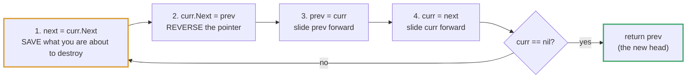
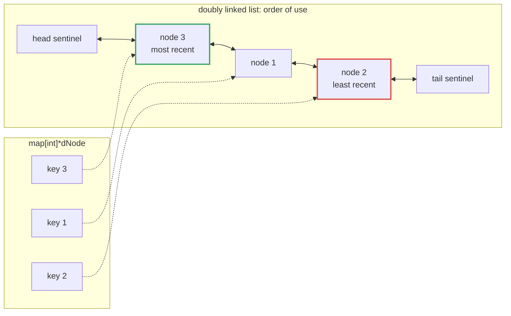

# Topic 08 · Linked List — Go Deep Dive

> A linked list is where Go's two defining traits collide head-on: explicit
> pointers with no arithmetic, and a garbage collector that means you never
> free a node yourself. That combination kills whole bug classes you'd fight
> in C (use-after-free, double-free, dangling pointers) but introduces its
> own — nil receivers that don't panic when you expect them to, dummy-node
> idioms that look unnecessary until the edge case bites, and a recursive
> reverse that quietly stack-overflows because Go never optimizes tail calls.
> This is the document that stops those bugs.

---

## Part 1 · The Node and Its Pointer

### 1.1 The canonical shape

```go
type ListNode struct {
    Val  int
    Next *ListNode
}
```

This is the exact struct LeetCode hands you, and it's what `reverse_linked_list/reverse_linked_list.go`
in this repo already uses. `Next *ListNode` is **just an address** — 8 bytes on
a 64-bit machine, no different in kind from an `int`. Go pointers support
exactly two operations: take an address (`&x`) and dereference one (`*p`).
There is **no pointer arithmetic** — you cannot do `p + 1` to walk to "the next
struct in memory" the way you could in C. The only way to move forward in a
list is to follow `Next`.

The sibling file `linklist/linklist.go` in this repo names the same shape
`Node{ Value int; Next *Node }` — same idea, different field names. Both are
fine; `ListNode`/`Val` is what you'll see on LeetCode, so default to it when a
problem statement supplies it.

### 1.2 `nil` is a real, safe zero value

```go
var head *ListNode        // nil — this is NOT garbage, it's the zero value
head == nil               // true
```

An uninitialized pointer field in Go is guaranteed `nil`, never an
uninitialized address pointing at random memory. This is unlike C, where an
uninitialized pointer is whatever garbage was on the stack. Combined with the
GC, this eliminates two entire bug classes that dominate linked-list work in
manual-memory languages:

| Bug class | C / manual memory | Go |
|---|---|---|
| Dangling pointer (use freed node) | Common — `free(node)` then dereference | **Impossible** — no `free`; GC keeps a node alive as long as anything reachable points to it |
| Double free | Common — `free(node)` twice | **Impossible** — no explicit free at all |
| Uninitialized pointer read | Common — garbage address | **Impossible** — zero value is always `nil` |

> ⚠️ **The GC gotcha that replaces them: leak via reachability.** If you build
> a new list (e.g. reversing, merging, deduplicating) and accidentally leave a
> stray pointer from a *surviving* node back into the *old* chain, the GC
> can't collect any of it — because from the GC's point of view, that whole
> chain is still reachable. This is the closest thing Go linked-list code has
> to a "leak": not freed memory, but memory kept alive one link longer than
> you intended. It's why reversal code explicitly sets a node's `Next` to
> `nil` or to the new predecessor before moving on — see Part 4.

### 1.3 Nil receivers don't always panic — a real footgun

In Java or Python, calling a method on `null`/`None` panics immediately, at
the call site. In Go, a method with a **pointer receiver** can be called on a
`nil` receiver just fine — Go only panics the moment the method body actually
**dereferences** a field of that nil pointer.

```go
type ListNode struct {
    Val  int
    Next *ListNode
}

func (n *ListNode) Len() int {
    if n == nil {
        return 0            // deliberate: nil receiver treated as "empty"
    }
    return 1 + n.Next.Len()
}

var head *ListNode
head.Len()                  // 0 — no panic! The receiver is nil, but the
                             // method body checks for it before dereferencing.
```

This can be used deliberately, as above, to make an "empty list" a first-class
value instead of a special case you check for at every call site. But it can
also **mask bugs**: if you forget the `n == nil` guard and instead write
`n.Val`, *that* panics — but only on the line that dereferences, not on the
call itself, which can make the actual failure point confusing in a stack
trace that starts several calls up. Know which behavior you're relying on.

---

## Part 2 · The Dummy Node Idiom

### 2.1 Why bother with a fake node

A huge fraction of linked-list bugs are off-by-one errors around **the head**:
deleting the first node, inserting before the first node, merging two lists
where one is empty. Without a dummy node, every one of those needs a special
case:

```go
// Without a dummy — head deletion is a special case
func removeElements(head *ListNode, val int) *ListNode {
    for head != nil && head.Val == val {   // strip matching nodes from the front
        head = head.Next
    }
    if head == nil {
        return nil
    }
    curr := head
    for curr.Next != nil {
        if curr.Next.Val == val {
            curr.Next = curr.Next.Next
        } else {
            curr = curr.Next
        }
    }
    return head
}
```

### 2.2 With a dummy — the special case disappears

```go
func removeElements(head *ListNode, val int) *ListNode {
    dummy := &ListNode{Next: head}   // dummy.Next always points at "the real head"
    curr := dummy
    for curr.Next != nil {
        if curr.Next.Val == val {
            curr.Next = curr.Next.Next
        } else {
            curr = curr.Next
        }
    }
    return dummy.Next                // unwrap at the end
}
```

`dummy := &ListNode{Next: head}` costs one allocation and buys you a loop body
with **zero head-of-list special casing** — deleting the real head is now
identical to deleting any other node, because from `curr`'s perspective the
dummy is always "the node before the one we're examining." This is the single
most idiomatic pattern in Go (and general) linked-list code: reach for it any
time you might delete, insert before, or merge at the head.

```
dummy ──► [1] ──► [2] ──► [3] ──► nil
  ▲
  curr starts here, one step "before" the real list
```

---

## Part 3 · Fast/Slow Pointers — Floyd's Algorithm

### 3.1 Finding the middle

```go
func middleNode(head *ListNode) *ListNode {
    slow, fast := head, head
    for fast != nil && fast.Next != nil {
        slow = slow.Next
        fast = fast.Next.Next
    }
    return slow   // when fast reaches the end, slow is at the midpoint
}
```

`fast` moves twice as fast as `slow`. When `fast` falls off the end, `slow`
has covered exactly half the distance — one pass, O(1) space, no need to
count the length first.

### 3.2 Cycle detection (LC 141)

```go
func hasCycle(head *ListNode) bool {
    slow, fast := head, head
    for fast != nil && fast.Next != nil {
        slow = slow.Next
        fast = fast.Next.Next
        if slow == fast {          // pointer equality — same node, not same value
            return true
        }
    }
    return false
}
```

If there's a cycle, `fast` is lapping `slow` inside a loop of finite size, so
they are **guaranteed to meet** — they can't skip past each other, because
each step closes the gap between them by exactly one node.

### 3.3 Finding where the cycle starts (LC 142)

```
head ──► A ──► B ──► C ──► D
                ▲           │
                └────E◄─────┘

slow/fast first meet somewhere inside the cycle (say at E).
Restart one pointer at head, moving both one step at a time —
they meet again exactly at the cycle's start (B).
```

```go
func detectCycle(head *ListNode) *ListNode {
    slow, fast := head, head
    for fast != nil && fast.Next != nil {
        slow = slow.Next
        fast = fast.Next.Next
        if slow == fast {
            p := head
            for p != slow {
                p = p.Next
                slow = slow.Next
            }
            return p            // the cycle's entry node
        }
    }
    return nil
}
```

The math: let the distance from `head` to the cycle start be `a`, from the
cycle start to the meeting point be `b`, and the remaining loop length be `c`.
`slow` has traveled `a+b`; `fast` has traveled `2(a+b)` and also `a+b+n(b+c)`
for some integer number of extra laps `n`. Setting those equal and solving
gives `a = n(b+c) - b`, which is exactly the distance from the meeting point
back around to the cycle start — so walking `a` steps from `head` and `a`
steps from the meeting point lands on the same node. You don't need to
re-derive this in an interview, but you should be able to say it out loud.

---

## Part 4 · Reversal — Iterative vs. Recursive

### 4.1 Iterative (the one to default to)

```go
func reverseList(head *ListNode) *ListNode {
    var prev *ListNode          // nil — becomes the new tail's Next
    curr := head
    for curr != nil {
        next := curr.Next       // save before we overwrite it
        curr.Next = prev        // reverse the pointer
        prev = curr
        curr = next
    }
    return prev                 // prev is the new head
}
```

Three-pointer dance: `next` saves what we're about to destroy, `curr.Next =
prev` does the actual reversal, then both `prev` and `curr` slide forward.
O(n) time, **O(1) space** — no recursion frame, no extra allocation.



Note that `curr.Next = prev` is exactly the "sever the old forward link"
moment from Part 1.3 — once this line runs, the old chain suffix is only
reachable through `prev`, in the *new* direction, so nothing leaks.

### 4.2 Recursive — correct, but has a Go-specific cost

```go
func reverseList(head *ListNode) *ListNode {
    if head == nil || head.Next == nil {
        return head
    }
    newHead := reverseList(head.Next)
    head.Next.Next = head        // make the next node point back at us
    head.Next = nil              // sever the old forward link — avoid a leak (Part 1.2)
    return newHead
}
```

> ⚠️ **This is not tail recursion, and Go never optimizes tail calls anyway.**
> Even if you rewrote this to *look* like a tail call, Go's compiler makes no
> guarantee of turning it into a loop — every recursive call keeps its own
> stack frame. Go goroutine stacks grow dynamically (starting at 2 KB and
> expanding by copy-and-double as needed, up to a 1 GB default limit on 64-bit), so this survives lists
> that would blow a fixed 1MB thread stack in other languages — but it is
> still O(n) stack frames for an O(n)-length list, strictly worse in memory
> than the iterative O(1) version, and a sufficiently long adversarial list
> (millions of nodes) can still exhaust it. **Default to iterative** for
> linked-list problems in Go; reach for recursive only when a problem
> specifically wants the recursive structure (e.g. reversing in groups of k,
> where the recursive form is genuinely clearer).

---

## Part 5 · The Struct-Copy Trap

```go
a := &ListNode{Val: 1, Next: someOtherNode}
b := &ListNode{Val: 2}

*b = *a          // ⚠️ copies BOTH fields — b.Val is now 1, AND b.Next is now
                  //    someOtherNode, silently rewiring b into a's list
```

`*b = *a` dereferences both sides and does a **full struct copy** — every
field, not just the one you had in mind. If you only meant to copy the value
(`b.Val = a.Val`), copying the whole struct also drags `Next` along and
splices `b` into a list it was never part of. This is a direct consequence of
Go structs being value types (same root cause as arrays being value types in
Topic 01, Part 1.1) — assignment through a dereferenced pointer
copies the whole value, pointer fields included. Copy field-by-field when
that's what you mean.

---

## Part 6 · Complexity Table

| Operation | Complexity | Note |
|---|:--:|---|
| Access by index | **O(n)** | No random access — must walk from head |
| Search by value | **O(n)** | Linear scan |
| Insert/delete at a **known** node | **O(1)** | Given the pointer, just rewire `Next` |
| Insert/delete by **value** | **O(n)** | O(n) to find it, then O(1) to rewire |
| Reverse (iterative) | O(n) time, **O(1)** space | Three-pointer walk |
| Reverse (recursive) | O(n) time, **O(n)** space | One stack frame per node — see Part 4.2 |
| Cycle detection | O(n) time, **O(1)** space | Floyd's — no extra set/map needed |
| Find middle | **O(n)**, one pass | Fast/slow, no length pre-count |

---

## Part 7 · Python vs. Go — Where They Diverge

| | Python | Go |
|---|---|---|
| Node representation | Class instance (heap object + refcount) | `struct` behind a pointer — same shape, no refcounting overhead |
| `None`/`nil` method calls | Immediately raises `AttributeError` | **May not panic** — only panics on actual field dereference (Part 1.3) |
| Memory reclamation | Refcounting (+ cycle collector for cycles) | Tracing GC — **cycles are not a special case**, unlike CPython's refcounting, which needs its separate cycle collector specifically because a linked cycle never hits refcount zero on its own |
| Tail-call recursion | No TCO either (CPython) | No TCO — **same limitation**, but Go's growable goroutine stack is more forgiving than Python's fixed, shallow default recursion limit (~1000 frames) |
| Struct/object copy | `copy.copy()` is explicit and rare | `*b = *a` is a **plain assignment** that silently copies every field — easy to trigger by accident (Part 5) |
| Built-in linked list | None idiomatic — people use `list` or `collections.deque` instead | None either — you hand-roll `ListNode`, or use `container/list` (a doubly linked list of `any` — see Part 8 below) |

---

## Part 8 · `container/list` — When to Reach for the Standard Library

Go's standard library ships a general-purpose doubly linked list,
`container/list`, but it's rarely the right choice for LeetCode-style
problems:

```go
l := list.New()
e := l.PushBack(1)          // returns *list.Element, not your value directly
l.PushFront(2)
l.Remove(e)                 // O(1) given the *Element — but you must have kept it
for e := l.Front(); e != nil; e = e.Next() {
    fmt.Println(e.Value)    // Value is `any` — needs a type assertion
}
```

Every element is `Value any`, so reading it back costs a type assertion
(`e.Value.(int)`), and every node is a separate heap allocation with more
bookkeeping than a hand-rolled `*ListNode` (`Element` carries pointers to both
neighbors **and** back to its owning list). It shines when you need a
**generic, reusable** doubly linked list with stable `*Element` handles you
can hold onto for O(1) arbitrary removal — which is exactly the situation in
Part 9's LRU cache, if you chose not to hand-roll the list. For LeetCode
`ListNode` problems, hand-rolling is simpler, faster, and what interviewers
expect to see.

---

## Part 9 · Algorithms Owned by This Topic

| Algorithm | Time | Space | Problem |
|---|:--:|:--:|---|
| Dummy-node insert/delete | O(n) | O(1) | LC 203 Remove Linked List Elements |
| Fast/slow midpoint | O(n) | O(1) | LC 876 Middle of the Linked List |
| Floyd's cycle detection | O(n) | O(1) | LC 141 Linked List Cycle |
| Floyd's cycle-start | O(n) | O(1) | LC 142 Linked List Cycle II |
| Iterative reversal | O(n) | O(1) | LC 206 Reverse Linked List |
| Reversal in groups of k (recursive) | O(n) | O(n/k) | LC 25 |
| Merge two sorted lists (dummy head) | O(n+m) | O(1) | LC 21 |
| Doubly linked list + hash map | O(1) per op | O(capacity) | LC 146 LRU Cache |

---

## Part 10 · Building an LRU Cache From Scratch (LC 146)

O(1) `Get`/`Put` needs two structures working together: a **map** for O(1)
lookup by key, and a **doubly linked list** for O(1) reordering to
"most recently used" and O(1) eviction from "least recently used." Neither
alone is enough — a map has no notion of order, and a singly linked list
can't remove an arbitrary node in O(1) (you'd need the *previous* node, which
a singly linked list can't give you without a full scan).



```go
package main

type dNode struct {
    key, val   int
    prev, next *dNode
}

type LRUCache struct {
    capacity   int
    cache      map[int]*dNode
    head, tail *dNode          // dummy sentinels — see Part 2
}

func Constructor(capacity int) LRUCache {
    head, tail := &dNode{}, &dNode{}
    head.next = tail
    tail.prev = head
    return LRUCache{
        capacity: capacity,
        cache:    make(map[int]*dNode, capacity),
        head:     head,
        tail:     tail,
    }
}

// remove unlinks n from wherever it currently sits — O(1), no scanning,
// because n carries its own prev/next (this is why it's DOUBLY linked).
func (c *LRUCache) remove(n *dNode) {
    n.prev.next = n.next
    n.next.prev = n.prev
}

// insertFront splices n in right after the head sentinel — "most recent."
func (c *LRUCache) insertFront(n *dNode) {
    n.next = c.head.next
    n.prev = c.head
    c.head.next.prev = n
    c.head.next = n
}

func (c *LRUCache) Get(key int) int {
    n, ok := c.cache[key]
    if !ok {
        return -1
    }
    c.remove(n)
    c.insertFront(n)         // touching a key promotes it to most-recent
    return n.val
}

func (c *LRUCache) Put(key, value int) {
    if n, ok := c.cache[key]; ok {
        n.val = value
        c.remove(n)
        c.insertFront(n)
        return
    }
    if len(c.cache) == c.capacity {
        lru := c.tail.prev            // node just before the tail sentinel
        c.remove(lru)
        delete(c.cache, lru.key)      // must evict from BOTH structures
    }
    n := &dNode{key: key, val: value}
    c.cache[key] = n
    c.insertFront(n)
}
```

**Talk track while writing:** two sentinel nodes (`head`, `tail`) mean insert
and remove never special-case "the list is empty" or "removing the only
node" — same motivation as the dummy node in Part 2, just doubled up. The map
stores `*dNode` (a pointer), not a value, so `remove`/`insertFront` mutate the
*same* node the map already points at — no need to update the map on every
reorder, only on insert and eviction.

---

<!-- block:08_go_1_problems -->
## Part 11 · The Fifteen Problems in Go — the Go-Specific Moves

The core techniques (reversal, dummy, Floyd) are above. This Part is the Go spelling of the *other* problems, where
the language changes the answer. All code below ran on Go 1.24.5 against LeetCode's own examples.

### Merge k Sorted Lists (LC 23): `container/heap` needs a type

Go has no ready-made `heapq`; you implement `heap.Interface` (five methods) on a named type, then use `heap.Init`,
`heap.Push`, `heap.Pop`. Python's "no tiebreaker" trap does not exist here — `Less` compares `.Val` only, and equal
values are simply "not less":

```go
type nodeHeap []*ListNode

func (h nodeHeap) Len() int           { return len(h) }
func (h nodeHeap) Less(i, j int) bool { return h[i].Val < h[j].Val }
func (h nodeHeap) Swap(i, j int)      { h[i], h[j] = h[j], h[i] }
func (h *nodeHeap) Push(x any)        { *h = append(*h, x.(*ListNode)) }
func (h *nodeHeap) Pop() any {
    old := *h; n := len(old); x := old[n-1]
    old[n-1] = nil                                    // drop the reference so the GC can reclaim it
    *h = old[:n-1]
    return x
}

func mergeKLists(lists []*ListNode) *ListNode {
    h := &nodeHeap{}
    for _, l := range lists { if l != nil { *h = append(*h, l) } }
    heap.Init(h)
    dummy := &ListNode{}
    tail := dummy
    for h.Len() > 0 {
        n := heap.Pop(h).(*ListNode)
        tail.Next = n; tail = n                       // splice the node itself: no allocation
        if n.Next != nil { heap.Push(h, n.Next) }
    }
    return dummy.Next                                 // [1 4 5] [1 3 4] [2 6] -> [1 1 2 3 4 4 5 6]
}
```

O(N log k) time, O(k) extra space. `Push`/`Pop` on the type are for `container/heap` to call — you call
`heap.Push(h, x)` / `heap.Pop(h)`, never `h.Push` directly. (Topic 12 covers the heap in depth.) Repeated pairwise
merging is O(N·k) — state it, then write the heap.

### Copy List with Random Pointer (LC 138): pointers are valid map keys

A pointer compares by **identity**, so `map[*Node]*Node` is the Go equivalent of "map each original to its copy" —
no `id()` tricks and no `__hash__`:

```go
copies := make(map[*Node]*Node)
for n := head; n != nil; n = n.Next { copies[n] = &Node{Val: n.Val} }      // pass 1: create every copy
for n := head; n != nil; n = n.Next {
    copies[n].Next = copies[n.Next]                                          // pass 2: wire — a nil key reads as nil
    copies[n].Random = copies[n.Random]
}
return copies[head]
```

The zero value does the null-handling for free: `copies[nil]` is `nil`, exactly what `Next`/`Random` should be when the
original is `nil`. (Python's `mapping[None]` raises `KeyError`; there you need `.get`.) Two passes are required because
`Random` may point **forward** to a node not yet copied. The O(1)-extra-space alternative splices each copy right after
its original (`A → A' → B → B'`), sets `A'.Random = A.Random.Next`, then unweaves.

### Add Two Numbers (LC 2), Remove Nth From End (LC 19)

```go
// Add Two Numbers — the loop condition IS the problem: while either list OR a carry remains.
for l1 != nil || l2 != nil || carry > 0 {
    sum := carry
    if l1 != nil { sum += l1.Val; l1 = l1.Next }
    if l2 != nil { sum += l2.Val; l2 = l2.Next }
    cur.Next = &ListNode{Val: sum % 10}; cur = cur.Next
    carry = sum / 10
}                                                     // [2 4 3]+[5 6 4] -> [7 0 8]     [9 9 9]+[1] -> [0 0 0 1]

// Remove Nth From End — a dummy, then a gap of n between fast and slow.
dummy := &ListNode{Next: head}
fast, slow := dummy, dummy
for i := 0; i < n; i++ { fast = fast.Next }
for fast.Next != nil { fast, slow = fast.Next, slow.Next }
slow.Next = slow.Next.Next                            // slow stops just BEFORE the doomed node
```

`while l1 && l2` drops the longer list's tail; dropping `|| carry > 0` drops the final carry (`999 + 1`). In Remove Nth,
a gap of `n − 1` instead of `n` removes the wrong node, and skipping the dummy forces a special case for `n == length`.

### Palindrome Linked List (LC 234): reverse the second half in place

```go
slow, fast := head, head
for fast != nil && fast.Next != nil { slow, fast = slow.Next, fast.Next.Next }
var prev *ListNode
for cur := slow; cur != nil; { nxt := cur.Next; cur.Next = prev; prev, cur = cur, nxt }   // reverse from the middle
for l, r := head, prev; r != nil; l, r = l.Next, r.Next {
    if l.Val != r.Val { return false }
}
return true                                            // [1 2 2 1] -> true     [1 2] -> false
```

O(n) time, O(1) space — but it **leaves the list mutated**. If the caller needs it intact, reverse the second half
back before returning. (The O(n)-space alternative copies the values into a `[]int` and runs the two-pointer check.)

### Find the Duplicate Number (LC 287): Floyd on a slice

Treat `nums[i]` as the `next` of node `i`. Values in `1..n` in an array of `n+1` make an implicit functional graph
that must contain a cycle; the duplicate is the cycle's **entry**:

```go
slow, fast := nums[0], nums[nums[0]]              // BOTH already moved once, so slow != fast is a real test
for slow != fast { slow, fast = nums[slow], nums[nums[fast]] }
slow = 0
for slow != fast { slow, fast = nums[slow], nums[fast] }
return slow                                        // [1 3 4 2 2] -> 2     [3 1 3 4 2] -> 3
```

Comparing `slow == fast` *before* either has moved returns instantly — both start at the same index. The array does
**not** need to be sorted, and the algorithm never modifies it.

### Reverse Nodes in k-Group (LC 25): seed `prev` with the node *after* the group

```go
kth := groupPrev
for i := 0; i < k && kth != nil; i++ { kth = kth.Next }
if kth == nil { break }                                // fewer than k left: leave them untouched — check BEFORE rewiring
groupNext := kth.Next
prev, curr := groupNext, groupPrev.Next                // prev starts as groupNext, NOT nil, so the group's new tail keeps the rest
for curr != groupNext { next := curr.Next; curr.Next = prev; prev, curr = curr, next }
tmp := groupPrev.Next                                  // the old first node is the group's new tail
groupPrev.Next = kth
groupPrev = tmp                                        // [1 2 3 4 5], k=2 -> [2 1 4 3 5]    k=3 -> [3 2 1 4 5]
```

Iterative, O(1) extra space. The recursive form is O(n/k) stack — Part 4.2's Go-specific stack note applies.

### The composed problems

- **Reorder List (LC 143)** = middle (3.1) + reverse the second half (4.1) + interleave. Cut the first half
  (`slow.Next = nil`) before weaving, or the list ends in a cycle.
- **Merge Two Sorted Lists (LC 21)** = the dummy-head merge of Part 2; O(1) space because it *splices* existing nodes.
- **Remove Duplicates from a Sorted List (LC 83)** = the adjacent scan `for cur.Next != nil { if cur.Next.Val == cur.Val
  { cur.Next = cur.Next.Next } else { cur = cur.Next } }` — only valid when sorted.

---
<!-- /block:08_go_1_problems -->

<!-- block:08_go_2_beyond -->
## Part 12 · Beyond the Fifteen: Intersection, Sort, Rearrangement and Go's Traps

### Intersection of Two Lists (LC 160): equalise the paths by swapping heads

Walk two pointers; when one runs off the end, restart it on the *other* list's head. Both travel `len(A) + len(B)`
nodes, so they meet at the shared node at the same moment — or both reach `nil` together if there is none. Pointer
`==` is **identity**, which is exactly what "the same node" means:

```go
func getIntersection(a, b *ListNode) *ListNode {
    p, q := a, b
    for p != q {
        if p == nil { p = b } else { p = p.Next }
        if q == nil { q = a } else { q = q.Next }
    }
    return p                                            // the shared node, or nil
}
```

O(m + n) time, O(1) space. (The hash-set alternative, `map[*ListNode]struct{}`, is O(m) space.)

### Sort List (LC 148): merge sort is the natural fit

Merge sort needs no random access, and merging linked lists is O(1) space — the one place it beats quicksort. Start
`fast` one node ahead so `slow` lands at the **end of the first half**, **cut** there, sort both halves, merge:

```go
func sortList(head *ListNode) *ListNode {
    if head == nil || head.Next == nil { return head }
    slow, fast := head, head.Next
    for fast != nil && fast.Next != nil { slow, fast = slow.Next, fast.Next.Next }
    second := slow.Next
    slow.Next = nil                                     // CUT — without it the recursion never shrinks
    return merge(sortList(head), sortList(second))      // merge(): the dummy-head merge of Part 2
}                                                        // [4 2 1 3] -> [1 2 3 4]     [-1 5 3 4 0] -> [-1 0 3 4 5]
```

O(n log n) time, **O(log n) stack** top-down (a bottom-up merge sort is O(1) extra space).

### Rearranging with two dummy heads

Partition List (LC 86), Odd Even List (LC 328) and friends are *"build two lists, then join"*:

```go
lo, hi := &ListNode{}, &ListNode{}
a, b := lo, hi
for ; head != nil; head = head.Next {
    if head.Val < x { a.Next = head; a = a.Next } else { b.Next = head; b = b.Next }
}
b.Next = nil                                            // CUT the tail, or it still points into the old list: a cycle
a.Next = hi.Next
return lo.Next                                          // [1 4 3 2 5 2], 3 -> [1 2 2 4 3 5]
```

The failure they share is **forgetting to nil the new tail**: it keeps its stale `Next` and the result loops forever.

### Doubly linked list templates

Given a node, `remove` and `insertAfter` are O(1) because the node knows both neighbours; two sentinels remove every
empty-list branch (the LRU code above is exactly this):

```go
func remove(n *dNode) { n.prev.next, n.next.prev = n.next, n.prev }
func insertAfter(at, n *dNode) {
    n.prev, n.next = at, at.next
    at.next.prev = n
    at.next = n
}
```

### Go traps in this topic

| Trap | What happens | The fix |
|---|---|---|
| `slow == fast` on values | For `*ListNode`, `==` is **pointer identity** — already correct. (Comparing `slow.Val == fast.Val` is the bug.) | Compare the pointers. |
| `curr.Next.Next` when `curr.Next` is nil | **Panic** (nil dereference) — no `AttributeError` to catch. | Guard `curr.Next != nil` first, in the loop condition. |
| Forgetting to nil the new tail | A stale `Next` makes a cycle; a traversal never ends. | `tail.Next = nil` after rearranging. |
| `container/heap`'s `Pop` returns `any` | Needs a type assertion, and the popped slot keeps the pointer alive. | `heap.Pop(h).(*ListNode)`; nil the slot in your `Pop`. |
| A `map[*Node]*Node` and copying the struct | `*b = *a` copies `Next` too (Part 5); a copied *pointer* is still the same node. | Build a new `&Node{Val: n.Val}` and wire it explicitly. |
| Deep recursion on a long list | Fatal `stack overflow` at ~1 GB of stack (not recoverable). | Iterate. |
| Test lists | Hand-wired `.Next` chains invite off-by-ones. | A `build(vals ...int) *ListNode` helper and a `toSlice` helper; assert on `[]int`. |
| Printing a cyclic list | `fmt` prints one level of pointers, but a hand-written traversal loops forever. | Cap the loop, or test cycles with the detection function only. |

### Follow-ups the interviewer reaches for

| Follow-up | The answer |
|---|---|
| "O(1) extra space?" | Reversal in place, two pointers, or Floyd; say which trade you made (Palindrome mutates and should restore). |
| "Recursively?" | Clearer, but O(n) stack; Go's growable stack is forgiving, not infinite. |
| "Doubly linked?" | A tail pointer and `prev` make pops at both ends and reverse iteration O(1) — that is a deque. |
| "Why use a linked list at all?" | O(1) splice at a known node and stable handles (LRU, free lists, intrusive lists). For iteration, a slice wins on cache locality. |
| "`container/list`?" | Fine for LRU with `*Element` handles; every element is boxed (`any`) and separately allocated. |
| "Thread safety?" | Pointer rewiring is not atomic — a mutex, or lock-free CAS on the head for a stack (`sync/atomic`). |

---
<!-- /block:08_go_2_beyond -->

<!-- problem-map:start -->
## Part 13 · Every Problem in This Topic, by Pattern

Fifteen problems, six moves (reversal · dummy head · fast/slow · fixed gap · composition · two structures) — the Python guide's map in Go, with the Go-only traps. Topic 08 has full Go solutions in the folder.

| Problem | Move | The idea — and the trap it sets |
|---|---|---|
| [001 · Reverse Linked List](GoDSA/08_linked_list/001_reverse_linked_list/solution.go) <br>LC 206 · Easy | Three-pointer rewiring | `next := curr.Next` first, then `curr.Next = prev`, then slide `prev, curr = curr, next`; return `prev`. **Trap:** overwriting `curr.Next` before saving it (silent truncation); returning `head`. |
| [002 · Merge Two Sorted Lists](GoDSA/08_linked_list/002_merge_two_sorted_lists/solution.go) <br>LC 21 · Easy | Dummy head + merge | `dummy := &ListNode{}`; splice the smaller front node; `tail.Next = l1` or `l2` for the remainder. **Trap:** no dummy; allocating new nodes instead of splicing. |
| [003 · Linked List Cycle](GoDSA/08_linked_list/003_linked_list_cycle/solution.go) <br>LC 141 · Easy | Floyd cycle detection | `for fast != nil && fast.Next != nil`; `slow == fast` is pointer identity. **Trap:** the wrong nil-check order (nil dereference **panics** — no exception to catch); comparing `.Val`. |
| [004 · Middle of the Linked List](GoDSA/08_linked_list/004_middle_of_the_linked_list/solution.go) <br>LC 876 · Easy | Slow/fast midpoint | Same loop; on an even length `slow` is the *second* middle. **Trap:** `for fast != nil` alone (panics on `fast.Next.Next`); starting `fast` one ahead. |
| [005 · Remove Linked List Elements](GoDSA/08_linked_list/005_remove_linked_list_elements/solution.go) <br>LC 203 · Easy | Dummy head + delete | `curr.Next = curr.Next.Next` behind a dummy; advance only when nothing was deleted. **Trap:** advancing after a deletion; special-casing the head instead of using a dummy. |
| [006 · Remove Duplicates from Sorted List](GoDSA/08_linked_list/006_remove_duplicates_from_sorted_list/solution.go) <br>LC 83 · Easy | Adjacent scan (sorted) | `if cur.Next.Val == cur.Val { cur.Next = cur.Next.Next } else { cur = cur.Next }`. **Trap:** running it on an unsorted list. |
| [007 · Palindrome Linked List](GoDSA/08_linked_list/007_palindrome_linked_list/solution.go) <br>LC 234 · Easy | Reverse the second half | Middle, reverse from `slow`, compare two heads; O(1) space. **Trap:** leaving the list mutated; comparing after one half is exhausted incorrectly on odd length. |
| [008 · Reorder List](GoDSA/08_linked_list/008_reorder_list/solution.go) <br>LC 143 · Medium | Middle + reverse + weave | Composition of 004, 001 and a merge. **Trap:** not cutting the first half (`slow.Next = nil`) — the woven list loops forever. |
| [009 · Remove Nth Node From End of List](GoDSA/08_linked_list/009_remove_nth_node_from_end_of_list/solution.go) <br>LC 19 · Medium | Fixed-gap pointers | Dummy, advance `fast` `n` steps, then walk both until `fast.Next == nil`. **Trap:** a gap of `n - 1`; no dummy for `n == length`. |
| [010 · Copy List with Random Pointer](GoDSA/08_linked_list/010_copy_list_with_random_pointer/solution.go) <br>LC 138 · Medium | `map[*Node]*Node` | Pointers are identity keys; two passes because `Random` can point forward; `copies[nil]` reads `nil`, so no explicit null checks. **Trap:** wiring `Random` in the `Next` pass; copying the struct (`*b = *a`) instead of building a new node. |
| [011 · Add Two Numbers](GoDSA/08_linked_list/011_add_two_numbers/solution.go) <br>LC 2 · Medium | Carry propagation | `for l1 != nil \|\| l2 != nil \|\| carry > 0`; `sum % 10`, `sum / 10`. **Trap:** `&&` (drops the longer tail); omitting `carry > 0` (`999 + 1`). |
| [012 · Find the Duplicate Number](GoDSA/08_linked_list/012_find_the_duplicate_number/solution.go) <br>LC 287 · Medium | Floyd on a slice | `nums[i]` is `next`; start both pointers *already moved once*; the second phase finds the entry. **Trap:** comparing before moving; assuming the slice must be sorted. |
| [013 · LRU Cache](GoDSA/08_linked_list/013_lru_cache/solution.go) <br>LC 146 · Medium | Map + doubly linked list | `map[int]*dNode` plus head/tail sentinels; `remove` and `insertFront` are pointer surgery; evict from **both** structures. **Trap:** evicting from one only; `Put` on an existing key without promoting it. |
| [014 · Merge k Sorted Lists](GoDSA/08_linked_list/014_merge_k_sorted_lists/solution.go) <br>LC 23 · Hard | `container/heap` of heads | Implement `heap.Interface` on `[]*ListNode`; splice popped nodes; O(N log k). **Trap:** forgetting `heap.Init`; calling `h.Push` directly instead of `heap.Push`; pairwise merging (O(N·k)). |
| [015 · Reverse Nodes in k-Group](GoDSA/08_linked_list/015_reverse_nodes_in_k_group/solution.go) <br>LC 25 · Hard | Reverse in k-groups | Iterative: find the `k`-th node first, seed `prev` with `groupNext`, reverse, reconnect. **Trap:** reversing a short final group; `prev = nil` (truncates the rest). |

---
<!-- problem-map:end -->

## Checklist Before Leaving This Topic

- [ ] Explain why an uninitialized `*ListNode` is safely `nil`, never garbage
- [ ] Explain why a nil-receiver method call doesn't always panic, and where the real panic point is
- [ ] Reach for a dummy/sentinel node any time you might touch the head
- [ ] Draw the fast/slow pointer meeting point and derive the cycle-start restart trick
- [ ] Write the iterative reversal from memory — prev/curr/next, in that order
- [ ] Explain why Go's lack of TCO makes the recursive reversal a real (not theoretical) stack-depth concern
- [ ] Spot the `*b = *a` full-struct-copy trap on sight
- [ ] Know when `container/list` earns its keep vs. when hand-rolling is simpler
- [ ] Explain why LRU needs *both* a map and a doubly linked list, not just one
- [ ] Write the LRU cache's four operations (map lookup, remove, insertFront, evict) in under 15 minutes
- [ ] Implement `heap.Interface` on `[]*ListNode` for Merge k Sorted Lists, and call `heap.Push`/`heap.Pop` (never the methods directly) <!--ca-->
- [ ] Use `map[*Node]*Node` for Copy List with Random Pointer and explain why `copies[nil]` needs no special case <!--ca-->
- [ ] Find the cycle entry and the list intersection, and explain both algebraically <!--ca-->
- [ ] Sort a linked list with merge sort, cutting at the middle <!--ca-->
- [ ] Nil the new tail after any rearrangement, and say what happens if you forget <!--ca-->
