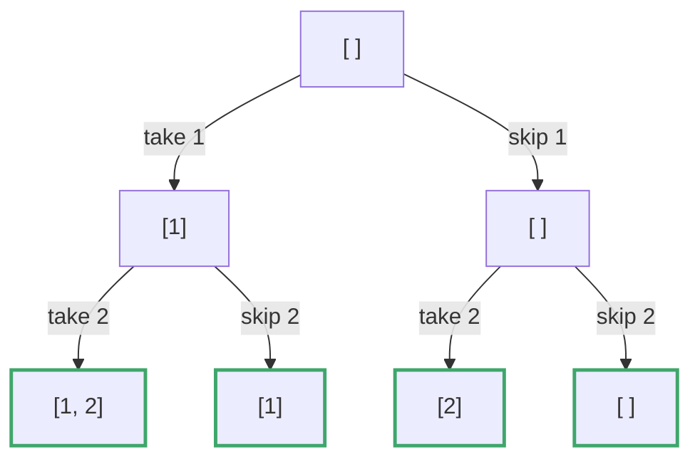
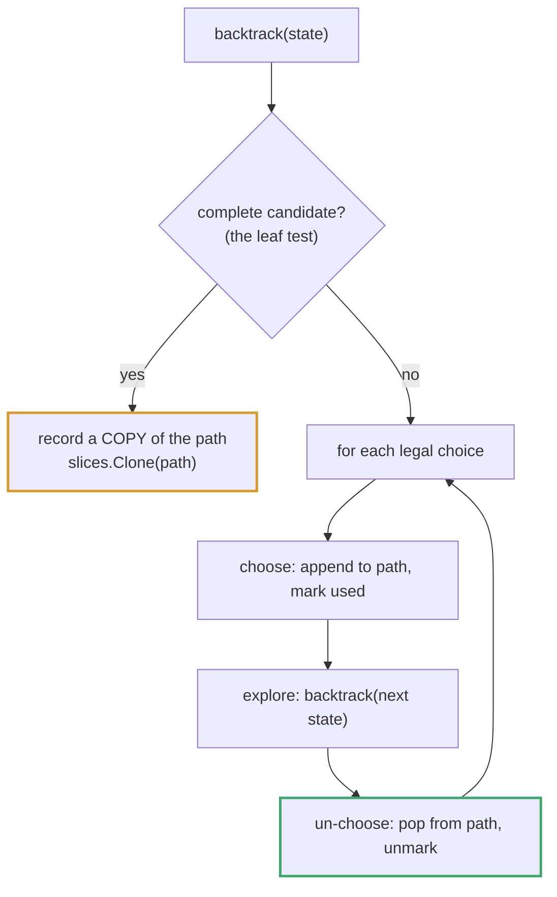

# Topic 09 · Recursion & Backtracking — Go Deep Dive

> Recursion in Go looks identical to recursion in Python — a function calling
> itself — but two things underneath are different: Go's compiler never turns
> your recursion into a loop for you (no TCO), and the state you carry between
> calls is usually a **slice**, which means the aliasing rules from Topic 01
> come back with a vengeance. Backtracking is where that bug bites hardest,
> because backtracking's entire idea — mutate, recurse, undo — is a slice being
> pushed and popped in place while you keep pointers to its past.

---

## Part 1 · The Bug You Already Wrote

### 1.1 `res = append(res, subset)` looks right. It isn't.

Look at `recursion/subsets/subsets.go` in this repo — the working solution
already does this correctly, but the shape of the bug is worth dissecting in
full because it is the single most common Go backtracking mistake:

```go
func backtrack(n int, subset []int) {
    if n == len(nums) {
        res = append(res, subset)   // ❌ BUG: stores the live backing array
        return
    }
    subset = append(subset, nums[n])
    backtrack(n+1, subset)
    subset = subset[:len(subset)-1]   // "pop" — shrinks the header, doesn't erase data
    backtrack(n+1, subset)
}
```

`subset` is one slice header that gets passed down, appended to, and shrunk
back as the recursion dives and backtracks. If `append` doesn't need to grow
the backing array (because capacity was already there from an earlier grow),
every recursive call is writing into **the same block of memory**. Appending
`subset` straight into `res` doesn't copy that memory — it copies the header
(pointer + len + cap), so every entry in `res` ends up pointing at the same
array. By the time the recursion finishes, every "snapshot" in `res` shows
whatever `subset` looked like *last*, not what it looked like the moment it
was appended.

```
res[0] ──┐
res[1] ──┼──► ┌───┬───┬───┐   one shared backing array —
res[2] ──┤    │ 1 │ 2 │ 3 │   every "different" subset you
res[3] ──┘    └───┴───┴───┘   thought you saved is this array
```

Typical symptom: `subsets([1,2,3])` returns `[[1,2,3],[1,2,3],[1,2,3],...]` or
a pile of empty slices, depending on exactly when capacity was exhausted.
**This is why the working solution in this repo does:**

```go
temp := make([]int, len(subset))
copy(temp, subset)
res = append(res, temp)          // ✅ independent copy — safe to keep forever
```

> ⚠️ **Rule for every backtracking problem, no exceptions:** if the value you
> are appending to the result is a slice that the recursion will go on to
> mutate, you must `make` + `copy` (or `append([]int(nil), subset...)`, an
> equally idiomatic one-liner) before storing it. There is no scenario in
> backtracking where storing the header directly is safe.

### 1.2 The "pop" is a lie your slice tells convincingly

```go
subset = append(subset, nums[n])       // push
subset = subset[:len(subset)-1]        // pop
```

`subset[:len(subset)-1]` does **not** erase `nums[n]` from memory — it just
moves the `len` field back by one. The value is still sitting in the backing
array, invisible to anything indexing through the shrunk header, but very
much alive if something else still holds a longer slice or a raw pointer into
that array. This is harmless for `int` elements (nothing to leak), but if
`subset` held pointers or large structs, the "popped" element keeps whatever
it pointed to reachable from the GC's perspective until the slot is
overwritten by the next push. For plain `[]int` backtracking state this is a
non-issue — flagged here because the same slice mechanics reappear in
Topic 06 (Stack) with real consequences.

---

## Part 2 · No Tail-Call Optimization — Ever

### 2.1 Go's compiler will not turn your recursion into a loop

Some languages (Scheme, and to varying degrees, functional languages compiled
with TCO passes) detect that a recursive call is the *last* thing a function
does and rewrite it as a jump, reusing the current stack frame instead of
pushing a new one. **The Go compiler does not do this**, by design and by
explicit statement from the Go team — every recursive call, tail position or
not, allocates a new stack frame.

```go
func factorial(n int) int {
    if n == 0 {
        return 1
    }
    return n * factorial(n-1)   // NOT optimized into a loop — real frame every call
}
```

This means recursion depth in Go costs real, proportional memory and real
function-call overhead, always. For `factorial`/`fibonacci`-shaped recursion
(`recursion/factorial/factorial.go`, `recursion/fibonacci/fibonacci.go`) with
`n <= 30`, this is irrelevant. It stops being irrelevant the moment recursion
depth scales with input size in the thousands or more (deep linked-list
recursion, an unbalanced BST, a poorly bounded search) — see 2.2.

### 2.2 Goroutine stacks are growable, but not infinite

Unlike a C thread with a fixed 1–8 MB stack that segfaults hard on overflow,
a goroutine's stack **starts at 2 KB and grows dynamically** as needed,
copying itself to a larger allocation (double the size) each time it runs low (`runtime.morestack`
/ `runtime.growstack`). The default ceiling is large — 1 GB on 64-bit
platforms (`debug.SetMaxStack` can change it) — so Go tolerates far deeper
recursion than most language runtimes before a real `fatal error: stack
overflow`. Practically: recursion depth in the tens of thousands is usually
fine; depth in the millions, or exponential blow-up like naive Fibonacci at
`n=50`, will exhaust time long before it exhausts stack.

> ✅ **What this changes about how you write Go recursion:** you don't need
> to manually convert every recursive traversal to iterative-with-explicit-stack
> purely to "be safe" the way you might in a language with a small fixed
> stack. Convert to iterative when you actually hit a depth or performance
> problem, or when an interviewer specifically wants to see you reason about
> the stack (see Topic 06 for that iterative-with-explicit-`[]T`-stack
> technique) — not defensively, by default.

### 2.3 The real cost is exponential branching, not stack depth

Naive recursive Fibonacci (`recursion/fibonacci/fibonacci.go`) is slow for a
reason that has nothing to do with the stack:

```
                               fib(6)
                             /        \
                      fib(5)            fib(4)
                     /      \           /      \
                fib(4)      fib(3)   fib(3)    fib(2)
```

`fib(4)` is computed twice here; `fib(3)`, three times. The call tree has
`O(2^n)` nodes even though the maximum stack **depth** at any instant is only
`O(n)`. This is the actual argument for memoization — it doesn't reduce stack
depth, it eliminates the repeated subtrees.

---

## Part 3 · The Backtracking Template

### 3.1 Choose → recurse → un-choose

Every backtracking problem in this topic is the same three-line skeleton
wrapped around a different "choose" step:

```go
func backtrack(path []int, used []bool) {
    if len(path) == len(nums) {           // base case: a complete candidate
        snapshot := make([]int, len(path))
        copy(snapshot, path)
        res = append(res, snapshot)
        return
    }
    for i := range nums {
        if used[i] {
            continue
        }
        used[i] = true                    // choose
        path = append(path, nums[i])

        backtrack(path, used)             // recurse

        path = path[:len(path)-1]         // un-choose
        used[i] = false
    }
}
```

The "un-choose" line is *why* it's called backtracking rather than plain
recursion — you deliberately undo the mutation before trying the next branch
so sibling branches don't see a corrupted `path`. Go's zero values make setup
free: `make([]bool, n)` is already all-`false`, `var path []int` (or
`[]int{}`) is already a valid empty slice to append onto — no explicit
initialization loop needed, unlike languages where you'd hand-initialize a
"visited" array.



### 3.2 Subsets vs. permutations: a binary tree vs. a shrinking-choice tree

`recursion/subsets/subsets.go` and `recursion/permutations/permutations.go`
in this repo encode two different shapes of the same template:

- **Subsets** — at each index, a **binary** decision: include `nums[i]` or
  don't. The tree has exactly `2^n` leaves regardless of what's been chosen
  so far.
- **Permutations** — at each position, choose **any unused** remaining
  element. Branching factor shrinks by one at every level (`n`, then `n-1`,
  then `n-2`, ...), producing `n!` leaves.

Recognizing which shape a problem is is the entire skill of backtracking
problems — the template code barely changes, but "binary include/exclude"
vs. "loop over remaining choices" is the design decision that matters.

### 3.3 Pruning changes practice, rarely changes worst-case Big-O

Adding an early exit —"stop early if the running sum already exceeds target,"
"skip this branch if `nums[i] == nums[i-1]` and the previous copy wasn't
used, to dedupe permutations of a list with repeats" — cuts real, often
dramatic runtime in interviews and production, but for most of these
problems the *worst-case* complexity is unaffected: a search space that is
inherently `O(2^n)` or `O(n!)` stays that class unless the pruning is strong
enough to change the recurrence itself (rare outside DP-shaped problems).
State this precisely in interviews: "pruning helps the average/typical case
substantially; the stated complexity is still the unpruned worst case" is the
correct sentence, and it's a sentence interviewers listen for.

---

## Part 4 · Memoization — There Is No `@lru_cache` in Go

Python's `functools.lru_cache` turns any pure function into a memoized one
with a single decorator line. **Go has no equivalent in the standard
library.** Memoization is always explicit and always one of two shapes:

```go
// Shape A: map keyed by the argument(s) — good for sparse/irregular inputs
memo := make(map[int]int)
var fib func(int) int
fib = func(n int) int {
    if n <= 1 {
        return n
    }
    if v, ok := memo[n]; ok {
        return v
    }
    result := fib(n-1) + fib(n-2)
    memo[n] = result
    return result
}

// Shape B: slice indexed by the argument — faster, needs a known bound
memo := make([]int, n+1)
for i := range memo {
    memo[i] = -1                 // sentinel for "uncomputed" — 0 is a valid fib value!
}
var fib func(int) int
fib = func(k int) int {
    if k <= 1 {
        return k
    }
    if memo[k] != -1 {
        return memo[k]
    }
    memo[k] = fib(k-1) + fib(k-2)
    return memo[k]
}
```

> ✅ Prefer the slice form when the argument space is small, dense, and
> known ahead of time (`0..n`) — it's a direct index, no hashing, no map
> bucket overhead (see Topic 01, Part 2). Reach for the map form when keys
> are sparse, negative, multi-dimensional (`map[[2]int]int` for two packed
> `int`s — comparable array keys work as map keys, see Topic 01 §2.3), or
> when the domain isn't known up front.

> ⚠️ **Pick your sentinel carefully.** `0` is a *real* Fibonacci output
> (`fib(0) == 0`), so using `0` to mean "not yet computed" in the slice form
> silently recomputes `fib(0)` forever without ever being wrong in a way
> that shows up in small tests — use `-1`, or a parallel `computed []bool`,
> whenever the zero value is a valid result.

This is the direct Go equivalent of Python's `@lru_cache(maxsize=None)`, and
it is worth saying explicitly in an interview that Go requires you to write
this by hand — it demonstrates you know the memoization mechanism itself
rather than having only ever invoked a decorator.

---

## Part 5 · Complexity Table

| Problem shape | Naive | Memoized / Optimal | Space |
|---|:--:|:--:|:--:|
| Factorial | O(n) | — (already linear) | O(n) stack |
| Fibonacci | **O(2ⁿ)** | **O(n)** | O(n) memo + O(n) stack |
| Palindrome check (two-pointer recursion) | O(n) | — | O(n) stack |
| Subsets | O(2ⁿ) generate, O(n) copy each | — (already optimal for output size) | O(2ⁿ·n) output |
| Permutations | O(n!) generate, O(n) copy each | — (already optimal for output size) | O(n!·n) output |
| Combination Sum / pruned backtracking | O(2ⁿ) worst case | Pruning reduces practical runtime, not worst-case class | O(n) stack + O(n) path |
| N-Queens | O(n!) worst case | Column/diagonal pruning is dramatic in practice | O(n) stack |

The "generate all subsets/permutations" rows can't be sub-exponential — the
output itself has `2ⁿ` or `n!` entries, so producing it is a hard floor.
What you optimize there is per-entry overhead (copy cost) and pruning
unproductive branches before they fully unfold, not the asymptotic class.

---

## Part 6 · Python vs. Go — Where They Diverge

| | Python | Go |
|---|---|---|
| Tail-call optimization | No (CPython doesn't do it either) | **No** — explicit language design choice, not an oversight |
| Stack limit | Fixed, ~1000 frames default (`sys.setrecursionlimit`) | Growable goroutine stack, starts at 2 KB, default ceiling ~1 GB |
| Memoization | `@functools.lru_cache` decorator | Hand-rolled `map` or slice — no decorator equivalent |
| "Pop" from a working list | `list.pop()` mutates length, frees nothing special | `s = s[:len(s)-1]` — shrinks header, backing array untouched |
| Saving a snapshot into results | `results.append(list(current))` (or `current[:]`) — copy is idiomatic and expected | `copy()`/`append(nil, ...)` into a new slice — same idea, easy to forget because `append(res, current)` *compiles* |
| Undoing a "visited" mark | `visited.remove(x)` on a set | `used[i] = false` on a bool slice — same cost, different container |
| Multi-value return for base cases | Exceptions / sentinel returns | Explicit multi-return (`(int, bool)`) or sentinel values — no exceptions in Go |

The one that actually causes bugs, unlike the others which are just syntax:
Python's `results.append(current[:])` and Go's `res = append(res, current)`
**look like the same idiom** but Go's version is missing the copy — the
bracket-slice `current[:]` in Python *is* a copy (new list, same references),
while Go's naive append is not. Muscle memory from Python actively misleads
here.

---

## Part 7 · Building Permutations From Scratch (LC 46)

```go
package main

func permute(nums []int) [][]int {
    var res [][]int
    used := make([]bool, len(nums))
    path := make([]int, 0, len(nums))   // preallocate — we know the final length

    var backtrack func()
    backtrack = func() {
        if len(path) == len(nums) {
            snapshot := make([]int, len(path))
            copy(snapshot, path)          // ✅ independent copy — see Part 1
            res = append(res, snapshot)
            return
        }
        for i, n := range nums {
            if used[i] {
                continue                  // this element is already in path
            }
            used[i] = true
            path = append(path, n)

            backtrack()                   // recurse one level deeper

            path = path[:len(path)-1]     // un-choose: pop
            used[i] = false               // un-choose: unmark
        }
    }

    backtrack()
    return res
}
```

**Talk track while writing:** `path` is preallocated to `len(nums)` capacity
so every `append` during the recursion writes into existing capacity and
never reallocates mid-traversal — a small, real performance detail worth
naming out loud. `used` gives O(1) membership checks instead of scanning
`path` for `n` on every candidate (which would turn each level O(n) instead
of O(1), multiplying total complexity by another factor of n). The snapshot
copy is non-negotiable per Part 1. This closure form (`var backtrack func()`
capturing `path`, `used`, `res`, `nums` from the enclosing scope) is the
idiomatic Go shape for backtracking — it avoids threading four parameters
through every recursive call.

**Extending to N-Queens (LC 51):** the same skeleton, with `used` replaced by
three tracking structures — `cols[c]`, `diag1[r+c]`, `diag2[r-c+n-1]` bool
slices — checked and toggled in the same choose/recurse/un-choose positions.
The branching factor and pruning strength change; the control-flow shape
does not.

---

<!-- block:09_go_1_shapes -->
## Part 8 · The Three Shapes, Duplicates, Grids and Constraints in Go

Part 3 gave the template. This Part is the Go spelling of every shape in the folder, with the pitfalls that are
specific to Go's slices and strings. All code below ran on Go 1.24.5 against LeetCode's own examples.



### The copy rule, and the bug that passes small tests

`res = append(res, path)` stores the slice **header**, not the data, so every stored answer points into the one backing
array that is later mutated. Passing `path` down *by value* looks like it protects you, but it does not — `append`
writes in place whenever `len < cap`, so sibling calls overwrite each other's slots. This is the notorious version,
and it is **correct on small inputs**:

```go
dfs = func(i int, path []int) {
    res = append(res, path)                 // no copy
    for j := i; j < len(nums); j++ { dfs(j+1, append(path, nums[j])) }
}
```

Measured on Go 1.24.5: it returns the right subsets for `n = 1..4` and is **silently wrong from `n = 5`**. For
`[1 2 3 4 5]` it returns 32 subsets, only **31 distinct** — `[1 2 3 4]` has been overwritten into a second
`[1 2 3 5]`. Your examples pass; the judge's larger case fails. The fixes:

```go
res = append(res, slices.Clone(path))                       // copy at the LEAF — the standard fix
dfs(j+1, append(path[:len(path):len(path)], nums[j]))       // cap == len: append MUST reallocate (correct, but O(n) per call)
```

Prefer one shared `path` with push/pop and a `Clone` at the leaf: one O(n) copy per *answer*, not per node.

### Subsets, and the sibling-skip for duplicates

```go
func subsetsWithDup(nums []int) [][]int {
    slices.Sort(nums)                                   // equal values must be adjacent
    res := [][]int{}
    path := []int{}
    var bt func(start int)
    bt = func(start int) {
        res = append(res, slices.Clone(path))           // every node is an answer
        for i := start; i < len(nums); i++ {
            if i > start && nums[i] == nums[i-1] { continue }   // skip an equal SIBLING at this node
            path = append(path, nums[i])
            bt(i + 1)
            path = path[:len(path)-1]
        }
    }
    bt(0)
    return res                                          // [1 2 2] -> [[] [1] [1 2] [1 2 2] [2] [2 2]]
}
```

`i > start`, **not** `i > 0`: the same value is allowed at *different depths* (that is how `[2 2]` is built); only a
repeat among *siblings* — choices at the same node — makes a duplicate answer. For **Permutations II** there is no
`start`, so the guard needs the used-array: `i > 0 && nums[i] == nums[i-1] && !used[i-1]`. Drop `!used[i-1]` and it
forbids permutations that are valid (`[1 1 2]` loses answers).

### Combinations, Combination Sum I / II / III

Three problems, one skeleton, and one character (or one condition) between them:

```go
for i := start; i < len(cands) && cands[i] <= remain; i++ {   // sorted: stop at the first that is too big
    path = append(path, cands[i])
    bt(i, remain-cands[i])                                    // i  : reuse allowed (LC 39)
    path = path[:len(path)-1]                                 // i+1: each element once (LC 40, plus the sibling skip)
}
```

The `cands[i] <= remain` loop condition is the sorted-candidates prune (it saves loop iterations, not recursive
calls). Combination Sum III adds *two* leaf conditions — exactly `k` numbers **and** sum `n` — and testing only one
emits plausible wrong answers (`[9]`, `[4 5]` for `k = 3`).

### Letter Combinations: the pool changes with depth

There is no shared pool — depth `i` picks a letter of `digits[i]`. Build into a byte buffer and convert at the leaf
(`string(buf)` **copies** the bytes, so reusing `buf` is safe). Empty input returns `[]`, not `[""]`:

```go
letters := [...]string{2: "abc", 3: "def", 4: "ghi", 5: "jkl", 6: "mno", 7: "pqrs", 8: "tuv", 9: "wxyz"}
buf := make([]byte, len(digits))
bt = func(i int) {
    if i == len(digits) { res = append(res, string(buf)); return }
    for j := 0; j < len(letters[digits[i]-'0']); j++ { buf[i] = letters[digits[i]-'0'][j]; bt(i + 1) }
}
```

### Palindrome Partitioning: substrings are free in Go

`s[start:end+1]` is an O(1) header, not a copy (Python's slice copies) — so appending it to `path` is cheap, and it
stays valid because strings are immutable. The palindrome test is a two-pointer loop on bytes; precomputing an
`is[i][j]` table makes it O(1) when the input is long:

```go
for end := start; end < len(s); end++ {
    if isPal(start, end) { path = append(path, s[start:end+1]); bt(end + 1); path = path[:len(path)-1] }
}                                                       // "aab" -> [[a a b] [aa b]]
```

### Word Search: mark, recurse, **unmark on every path**

Strings are immutable, so the board is `[][]byte`. Mark visited by overwriting the cell, and restore it *before
returning* whatever the result — a failed branch that leaves cells marked poisons every later branch:

```go
saved := board[r][c]
board[r][c] = '#'                                       // MARK
found := dfs(r+1, c, k+1) || dfs(r-1, c, k+1) || dfs(r, c+1, k+1) || dfs(r, c-1, k+1)
board[r][c] = saved                                     // UNMARK on every return path
return found
```

`||` short-circuits, so the first successful direction stops the search — but the unmark still runs, because it sits
*after* the expression. (Returning early *inside* the `||` chain, before the restore, is the bug.)

### N-Queens: reject *before* recursing

One queen per row. Track columns and both diagonals — `r + c` is constant along one diagonal and `r - c + n - 1`
along the other — in three arrays, and skip a placement that conflicts **before** recursing:

```go
if cols[c] || d1[r+c] || d2[r-c+n-1] { continue }                    // prune BEFORE the recursive call
cols[c], d1[r+c], d2[r-c+n-1] = true, true, true
queens[r] = c
bt(r + 1)
cols[c], d1[r+c], d2[r-c+n-1] = false, false, false                  // un-choose all three, or later branches break
```

With **bitmasks** all three become `int`s passed by value — nothing to undo — and counting solutions needs no boards:

```go
for avail := full &^ (cols | d1 | d2); avail != 0; avail &= avail - 1 {
    bit := avail & -avail                                            // lowest set bit = a legal column
    total += bt(cols|bit, ((d1|bit)<<1)&full, (d2|bit)>>1)
}                                                                    // n = 8 -> 92 solutions
```

`&^` is Go's AND-NOT. Track queens in a `[]int` (`queens[r] = c`) and build the board strings only at the leaf.

### Sudoku: bitmasks and the most-constrained cell

A `uint16` per row, column and box records which digits are used; the legal digits of a cell are
`^(row | col | box) & 0x1FF`. Choose the empty cell with the **fewest** legal digits (`bits.OnesCount16`), so dead ends
appear near the root, and iterate its digits with `bits.TrailingZeros16`. Return `true` up the whole stack the moment
the board fills — the **cascade return**; without it the solver keeps searching after success and *un-fills* the board
on the way out:

```go
for avail := bestAvail; avail != 0; avail &= avail - 1 {
    d := bits.TrailingZeros16(avail)
    ... place d, set the three bits ...
    if bt() { return true }                       // cascade: stop at the first solution
    ... clear the three bits, restore '.' ...
}
return false
```

The box index is `(r/3)*3 + c/3` — integer division on both terms. Using `%` mixes distant boxes yet passes many boards.

---
<!-- /block:09_go_1_shapes -->

<!-- block:09_go_2_tools -->
## Part 9 · Pruning, Ordering and Follow-ups

### What pruning actually prunes

Two cheap prunes cover most problems, and it matters what each one *saves* (counted with the same algorithm in both
Python and Go — the numbers are identical, because they count calls, not time):

| Prune | Saves | Measured |
|---|---|---|
| **Sort candidates, `break` at the first that is too big** | loop iterations — *not* recursive calls | Combination Sum over `1..40`, target 40: 215,308 calls either way; loop iterations 5,393,015 → 393,276 |
| **Bound the loop by what is still needed** (`i <= n-(k-len(path))+1`) | recursive calls | `C(20, 10)`: 616,666 → 352,716 calls (−43%); negligible at `k = 3` (1,351 → 1,330) |

State it precisely: *"pruning cuts the typical case a lot; the worst-case class is still the unpruned tree."*

### Precompute what the tree keeps re-asking

Palindrome Partitioning re-tests substrings at every node. An `O(n²)` table `is[i][j] = s[i]==s[j] && (j-i < 2 || is[i+1][j-1])`
makes each test O(1). The output is still exponential (`"aaaa"` has `2³ = 8` partitions); only the per-node cost drops.
When a *sub-question* repeats, tabulate it — this is the bridge to DP.

### When the state repeats, backtracking becomes DP

If different paths can reach the **same state** (`index`, `remaining`, a bitmask of used items) and the question is a
count or a yes/no, memoise the state (Part 4 shows the map and slice forms; a `map[[2]int]int` keys on two ints).
For *listing every answer* memoisation cannot help — the output is the cost.

### Go traps in this topic

| Trap | What happens | The fix |
|---|---|---|
| `res = append(res, path)` | Every answer aliases one backing array; correct for small `n`, wrong from `n = 5` in the subsets example. | `slices.Clone(path)` at the leaf. |
| Passing `path` by value "for safety" | `append` still writes in place when `len < cap`. | Push/pop one shared slice and clone at the leaf, or `append(path[:len(path):len(path)], x)`. |
| `return` inside the `||` chain before restoring a mark | The board stays marked. | Store the result, restore, *then* return. |
| Forgetting to un-choose *every* tracked structure | Later branches see stale `cols`/`diags`/`used`. | Un-choose in the reverse order you chose. |
| `string(buf)` vs `unsafe` tricks | `string(buf)` copies — safe. Aliasing `buf` into a string would mutate stored answers. | Use `string(buf)`. |
| Recursion depth | Backtracking depth is usually `n`, but a fatal `stack overflow` (1 GB, unrecoverable) awaits unbounded depth. | Bound the depth, or use an explicit stack. |
| Sharing `res` across goroutines | A data race. | Give each goroutine its own subtree and merge. |

### Follow-ups the interviewer reaches for

| Follow-up | The answer |
|---|---|
| "Only count them / find one." | Count: return an `int` up the stack, store no path. Find one: return `true` up the stack and stop (the cascade return). |
| "Better than exponential?" | Not for enumeration — the output is `2ⁿ` / `n!`. For counting or existence, look for repeated states (DP) or structure. |
| "Too slow." | Prune before recursing, order the choices (sort, most-constrained first), bound the loop, use bitmasks, exploit symmetry (N-Queens: half the board, mirror). |
| "Parallelise." | Split at the first level: each first choice is an independent subtree — one goroutine each, results merged through a channel. |
| "Duplicates in the input." | Sort, skip equal *siblings* (`i > start`), never equal values across depths. |
| "Lexicographic order." | Sorted input plus an increasing-index loop yields it for free. |

---
<!-- /block:09_go_2_tools -->

<!-- problem-map:start -->
## Part 10 · Every Problem in This Topic, by Pattern

Fourteen problems, five moves (memoisation as the bridge · the three base shapes · duplicate handling · grid backtracking · constraint satisfaction) — the Python guide's map in Go, with the Go-only traps. Topic 09's solutions are Python-first; the Go column is the plan you would write.

| Problem | Move | The idea — and the trap it sets |
|---|---|---|
| [001 · Fibonacci Number](GoDSA/09_recursion_backtracking/001_fibonacci_number/solution.go) <br>LC 509 · Easy | The bridge to DP | A closure over `memo []int` (seed `-1` — `0` is a real Fibonacci value) or `map[int]int`; there is no `@lru_cache`. **Trap:** using `0` as "not computed"; naive recursion at `n = 50`. |
| [002 · Subsets](GoDSA/09_recursion_backtracking/002_subsets/solution.go) <br>LC 78 · Medium | Subsets — every node is an answer | Shared `path`, push/pop, `res = append(res, slices.Clone(path))` at *every* node. **Trap:** `append(res, path)` — correct up to `n = 4`, silently wrong from `n = 5` (31 distinct of 32). |
| [003 · Subsets II](GoDSA/09_recursion_backtracking/003_subsets_ii/solution.go) <br>LC 90 · Medium | Sort, then skip equal siblings | `slices.Sort(nums)`; `if i > start && nums[i] == nums[i-1] { continue }`. **Trap:** not sorting; `i > 0` instead of `i > start`. |
| [004 · Permutations](GoDSA/09_recursion_backtracking/004_permutations/solution.go) <br>LC 46 · Medium | Permutations | `used := make([]bool, n)` (zero value already `false`); `path := make([]int, 0, n)`; clone at the leaf. **Trap:** appending the shared path; forgetting `used[i] = false` on the way out. |
| [005 · Permutations II](GoDSA/09_recursion_backtracking/005_permutations_ii/solution.go) <br>LC 47 · Medium | Permutations II | The guard `i > 0 && nums[i] == nums[i-1] && !used[i-1]`. **Trap:** omitting `!used[i-1]` (drops valid permutations). |
| [006 · Combinations](GoDSA/09_recursion_backtracking/006_combinations/solution.go) <br>LC 77 · Medium | Combinations | Loop `for i := start; i <= n; i++` and recurse with `i + 1`; bound with `n-(k-len(path))+1`. **Trap:** looping from 1 every time; appending the shared path. |
| [007 · Combination Sum](GoDSA/09_recursion_backtracking/007_combination_sum/solution.go) <br>LC 39 · Medium | Combination Sum (reuse) | Sorted candidates, loop condition `cands[i] <= remain`, recurse with `i`. **Trap:** `i + 1` (forbids reuse); a `start` that never advances. |
| [008 · Combination Sum II](GoDSA/09_recursion_backtracking/008_combination_sum_ii/solution.go) <br>LC 40 · Medium | Combination Sum II | Recurse with `i + 1` *and* skip equal siblings (`i > start`). **Trap:** keeping `i`; dropping the skip. |
| [009 · Combination Sum III](GoDSA/09_recursion_backtracking/009_combination_sum_iii/solution.go) <br>LC 216 · Medium | Combinations + two constraints | 006 over `1..9`; leaf needs `len(path) == k && remain == 0`. **Trap:** testing only one condition. |
| [010 · Letter Combinations of a Phone Number](GoDSA/09_recursion_backtracking/010_letter_combinations_of_a_phone_number/solution.go) <br>LC 17 · Medium | The pool changes with depth | `letters := [...]string{2: "abc", ...}`; a `[]byte` buffer, `string(buf)` at the leaf (it copies). **Trap:** returning `[]string{""}` for empty input. |
| [011 · Palindrome Partitioning](GoDSA/09_recursion_backtracking/011_palindrome_partitioning/solution.go) <br>LC 131 · Medium | Combinations shape over a string | `s[start:end+1]` is a free substring header in Go; an `is[i][j]` table makes each test O(1). **Trap:** the slice bound; recomputing palindromes at every node. |
| [012 · Word Search](GoDSA/09_recursion_backtracking/012_word_search/solution.go) <br>LC 79 · Medium | Grid: mark, recurse, unmark | `[][]byte` board; overwrite with `'#'`, restore after the `\|\|` chain, return the stored result. **Trap:** returning inside the chain before the restore; unchecked bounds panic. |
| [013 · N-Queens](GoDSA/09_recursion_backtracking/013_n_queens/solution.go) <br>LC 51 · Hard | Constraint satisfaction | Bool arrays `cols`, `d1[r+c]`, `d2[r-c+n-1]`, or three `int` bitmasks passed by value. **Trap:** pruning after recursing; not un-choosing all three; a wrong diagonal index. |
| [014 · Sudoku Solver](GoDSA/09_recursion_backtracking/014_sudoku_solver/solution.go) <br>LC 37 · Hard | CSP + cascade return | `uint16` masks per row/column/box, most-constrained cell first, `return true` up the stack on success. **Trap:** box index `(r/3)*3 + c/3` (not `%`); no cascade (un-fills the solved board). |

---
<!-- problem-map:end -->

## Checklist Before Leaving This Topic

- [ ] Explain exactly why `res = append(res, subset)` is a bug and reproduce
      the fix from memory
- [ ] State that Go has no tail-call optimization and what that costs
- [ ] Explain why a goroutine's growable stack changes the *practical* depth
      limit without changing the *asymptotic* argument
- [ ] Write the choose → recurse → un-choose template without looking it up
- [ ] Explain why subsets branch binary (2ⁿ) and permutations branch
      shrinking (n!)
- [ ] Hand-roll a memoized Fibonacci using both a map and a sentinel-valued
      slice, and say when you'd pick each
- [ ] State precisely what pruning does and doesn't change about worst-case
      complexity
- [ ] Preallocate `path` capacity in a backtracking solution and explain why
- [ ] Reproduce the pass-by-value `append` bug, say why it passes small inputs, and fix it two ways <!--ca-->
- [ ] Explain `i > start` vs `i > 0` for skipping equal siblings, and the extra `!used[i-1]` for permutations <!--ca-->
- [ ] Restore a grid mark on *every* return path (store the result, restore, then return) <!--ca-->
- [ ] Write N-Queens with bool arrays and with bitmasks (`&^`, lowest set bit) <!--ca-->
- [ ] Say what a sorted-candidates `break` saves (loop iterations) and what it does not (calls) <!--ca-->
