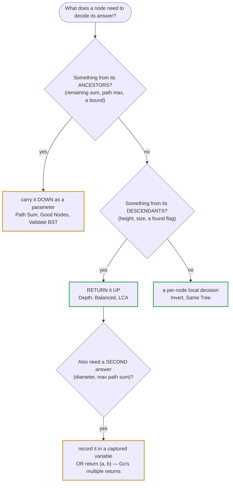
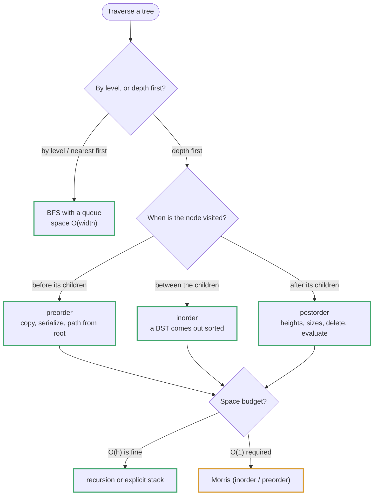

# Topic 10 · Trees — Go Deep Dive

> A slice is one allocation you can walk with pointer arithmetic on the array
> header. A tree is `n` separate allocations stitched together with real
> pointers. Every lesson topic 1 taught about cache-friendly, contiguous
> memory gets inverted here — and Go's lack of tail-call optimization means
> the recursive code you'll write for every one of these problems has a real,
> if usually distant, stack limit. This is the document that makes both
> tradeoffs explicit.

---

## Part 1 · The Node Is the Allocation

### 1.1 `TreeNode` and what "no cache locality" actually means

```go
type TreeNode struct {
    Val         int
    Left, Right *TreeNode
}
```

Compare this to topic 1's array: `[]int{1,2,3,4,5}` is **one** contiguous
block — walking it strides through memory the CPU has already prefetched.
A tree built with `&TreeNode{...}` is `n` **independent heap allocations**,
each wherever the allocator happened to put it. `node.Left` is a genuine
pointer dereference, likely a cache miss, on every step down.

```
 slice:  ┌────┬────┬────┬────┬────┐
         │ 10 │ 20 │ 30 │ 40 │ 50 │   one allocation, sequential reads
         └────┴────┴────┴────┴────┘

 tree:   [30]@0x1040 ──Left──► [10]@0x30a8 ──Right──► [20]@0x9c1e
            │
          Right
            ▼
          [40]@0x77b2 ...
```

> ⚡ This is why, all else equal, an array-backed structure (a heap stored in
> a slice — see the heap topic) outperforms a pointer-linked tree for the
> same logical shape. You don't get to choose this away for a `TreeNode`
> problem, but you should recognize *why* tree algorithms are slower in
> practice than their big-O twin running on a slice.

An **array-backed binary tree** (child of `i` at `2i+1`/`2i+2`, used for
heaps and for compact "complete tree" representations) avoids this entirely
because "the pointer" is arithmetic, not a stored field. That only works
when the tree is complete/near-complete — a general binary tree, arbitrarily
shaped, needs real pointers.

### 1.2 `nil` is your base case, and Go won't hold your hand

```go
func height(node *TreeNode) int {
    if node == nil {        // empty subtree — the natural recursive floor
        return 0
    }
    return 1 + max(height(node.Left), height(node.Right))
}
```

The zero value of a pointer is `nil`, so an "empty subtree" argument arrives
as `nil` for free — no sentinel object needed, no `Optional<TreeNode>`
wrapper. This mirrors Python's `None` check almost exactly.

> ⚠️ Where Go diverges from Python is **safety net, not semantics**: Python
> raises `AttributeError` on `None.left` — annoying but a clear, catchable
> signal. Go **panics with a nil pointer dereference** (`runtime error:
> invalid memory address or nil pointer dereference`) and, unlike Kotlin's
> `?.` or Swift's optional chaining, there is no syntax that skips the
> access for you. `node.Left.Val` is exactly as dangerous whether or not you
> just checked `node != nil` three lines up for an unrelated node. Every
> dereference is a manual, unassisted check — miss one and the whole program
> dies, not just the current call frame.

---

## Part 2 · Traversal: Recursive vs. Iterative, and Why It Matters Here

### 2.1 Preorder / inorder / postorder — the recursive form

```go
func inorder(node *TreeNode, out *[]int) {
    if node == nil {
        return
    }
    inorder(node.Left, out)
    *out = append(*out, node.Val)   // visit
    inorder(node.Right, out)
}
```

Threading an accumulator through as `*[]int` (or returning and concatenating
slices, which is simpler to read but reallocates more) is idiomatic Go —
there's no implicit "yield to caller's list" the way Python's list mutation
inside a closure gives you for free; you either pass a pointer to the
accumulator or return a value and let the caller concatenate.

### 2.2 Iterative traversal with an explicit stack — and why you need it

Recall from topic 9: **Go has no tail-call optimization.** A recursive call
is a real stack frame, always. Go's goroutine stack is *growable* — it
starts at 2 KB and grows by copy-and-double (by default up to 1 GB on 64-bit, tunable via
`debug.SetMaxStack`) — so a balanced tree of any realistic size (`depth ≈
log₂ n`) will never come close to the limit. The danger is a **degenerate,
effectively-linked-list-shaped tree**: a tree built by inserting already-sorted
data into a naive BST, or an adversarial test case, can have depth `n`. At
that point recursive inorder traversal is `n` stack frames deep, and while
Go will grow the stack rather than silently corrupt memory (unlike a fixed
C thread stack), it can still exhaust the configured maximum and crash the
whole program — a real failure mode, not a theoretical one, and one your
interviewer may ask about directly ("what if the tree is a straight line?").

The iterative form replaces the implicit call stack with an explicit one you
control on the heap:

```go
func inorderIterative(root *TreeNode) []int {
    var out []int
    stack := []*TreeNode{}
    curr := root
    for curr != nil || len(stack) > 0 {
        for curr != nil {                       // push down the left spine
            stack = append(stack, curr)
            curr = curr.Left
        }
        curr = stack[len(stack)-1]              // pop
        stack = stack[:len(stack)-1]
        out = append(out, curr.Val)              // visit
        curr = curr.Right
    }
    return out
}
```

> ✅ Know this cold for inorder. Preorder iterative is simpler (push right
> then left, pop and visit immediately). Postorder iterative is the awkward
> one — the common trick is a modified preorder (root, right, left) whose output
> you reverse. That gives the right *list* but visits nodes **parent-first**, so it
> is wrong for any work that must happen bottom-up; the honest version is in the
> "Shapes beyond the twenty" part below.

### 2.3 BFS / level-order: the slice-as-queue, and why the leak doesn't matter here

```go
func levelOrder(root *TreeNode) [][]int {
    if root == nil {
        return nil
    }
    var result [][]int
    queue := []*TreeNode{root}
    for len(queue) > 0 {
        levelSize := len(queue)
        level := make([]int, 0, levelSize)      // preallocate — size is known
        for i := 0; i < levelSize; i++ {
            node := queue[0]
            queue = queue[1:]                    // O(1) header slide, see below
            level = append(level, node.Val)
            if node.Left != nil {
                queue = append(queue, node.Left)
            }
            if node.Right != nil {
                queue = append(queue, node.Right)
            }
        }
        result = append(result, level)
    }
    return result
}
```

Topic 7 (queues) flags `queue = queue[1:]` as a memory-retention gotcha for
**long-lived, high-churn** queues: the backing array's earlier elements stay
referenced (can't be GC'd) until the whole slice is discarded, and repeated
`[1:]` slicing without ever reallocating means old capacity keeps trailing
along. For a single BFS pass over a tree, the queue's lifetime is the
traversal itself and its peak size is bounded by the tree's width — it's
discarded in full the moment `levelOrder` returns, so the "leak" never
outlives the function call. Don't reach for `container/list` here just to
avoid it; the plain-slice queue is simpler and faster for this shape of
problem.

> ⚡ **Level-order space is O(n) worst case**, not O(h). A perfect binary
> tree's last level holds `⌈n/2⌉` nodes, so the queue's peak size is
> proportional to the tree's *width*, which can be much larger than its
> depth. Contrast with recursive DFS, whose space is O(h) — the two
> traversal families have genuinely different space profiles, and picking
> the wrong one for a memory-constrained problem is a real mistake, not
> pedantry.

---

## Part 3 · Patterns Built on These Two Traversals

### 3.1 Depth / height — postorder, bottom-up

Already shown above (§1.2). The recursive shape *is* postorder: you need
both children's answers before you can compute the parent's.

### 3.2 Diameter — a closure closing over a pointer, Go's answer to "return two things without a struct"

The longest path between any two nodes isn't necessarily through the root,
so you need every node to report its height upward *while* a separate
running maximum gets updated as a side effect. Go has no default arguments
and no convenient nested-function-with-shared-mutable-state syntax beyond a
closure — so a closure capturing a variable by reference is the idiomatic
tool:

```go
func diameterOfBinaryTree(root *TreeNode) int {
    best := 0
    var depth func(*TreeNode) int
    depth = func(node *TreeNode) int {
        if node == nil {
            return 0
        }
        l, r := depth(node.Left), depth(node.Right)
        if l+r > best {                 // side effect: update captured var
            best = l + r
        }
        return 1 + max(l, r)            // return value: height, for the parent
    }
    depth(root)
    return best
}
```

`var depth func(*TreeNode) int` declared before assignment is required
because a Go closure that calls itself recursively must already be a named
variable in scope at the point it references itself — you cannot recurse
into an anonymous function literal assigned with `:=` in the same
statement, since the name doesn't exist yet on the right-hand side.

> ⚠️ This is a genuine Go idiom to recognize, not a workaround: closures
> capture **variables by reference** (the address of `best`, not a copy),
> so every recursive call sees and can mutate the same `best`. Python
> closures need `nonlocal` to get the same effect; Go gives it to you by
> default because a captured local is heap-allocated for as long as any
> closure references it (this is Go's "escape analysis" moving `best` off
> the stack automatically — you don't write anything special).

### 3.3 Lowest Common Ancestor — recursion returning "found" up the call stack

```go
func lowestCommonAncestor(root, p, q *TreeNode) *TreeNode {
    if root == nil || root == p || root == q {
        return root
    }
    left := lowestCommonAncestor(root.Left, p, q)
    right := lowestCommonAncestor(root.Right, p, q)
    if left != nil && right != nil {   // p and q found in different subtrees
        return root                     // root is the split point — the LCA
    }
    if left != nil {
        return left
    }
    return right
}
```

Pointer identity (`root == p`) is a valid, cheap comparison in Go for
`*TreeNode` — you're comparing addresses, exactly like Python's `is`.
(This is specifically a *general tree* LCA — the BST topic has a much
cheaper O(h) version that exploits ordering instead of searching both
subtrees.)

### 3.4 N-ary trees: the same shape, a slice of children instead of `Left`/`Right`

```go
type Node struct {
    Val      int
    Children []*Node
}

func maxDepth(node *Node) int {
    if node == nil {
        return 0
    }
    best := 0
    for _, child := range node.Children {
        best = max(best, maxDepth(child))
    }
    return 1 + best
}
```

Everything above generalizes: recursion still bottoms out on `nil`,
iterative traversal still uses an explicit `[]*Node` stack/queue, only the
fan-out changes from a fixed 2 to `len(node.Children)`.

---

## Part 4 · Complexity Table

| Operation | Time | Space | Note |
|---|:--:|:--:|---|
| Recursive DFS (any order) | O(n) | O(h) | h = height; O(log n) balanced, **O(n)** skewed |
| Iterative DFS (explicit stack) | O(n) | O(h) | Same space bound, no call-stack risk |
| BFS / level-order | O(n) | **O(w)** | w = max width, up to `⌈n/2⌉` — can exceed O(h) |
| Diameter / height (postorder) | O(n) | O(h) | Single pass, closure-captured max |
| LCA (general tree) | O(n) | O(h) | Worst case visits every node |
| Serialize / deserialize | O(n) | O(n) | Output string + reconstruction structures |

---

## Part 5 · Python vs. Go — Where They Diverge

| | Python | Go |
|---|---|---|
| Node representation | Class with `self.left`/`self.right`, GC'd objects | `struct` with `*TreeNode` fields, GC'd allocations |
| Empty-subtree check | `if node is None` | `if node == nil` |
| Missing null-safety | `AttributeError` on `None.attr` (catchable) | **Panic** on nil deref — crashes the whole program unless something up the stack calls `recover` |
| Deep recursion limit | `sys.setrecursionlimit` (~1000 default, hard fixed cap) | Growable goroutine stack, default up to 1GB — much harder to hit, not impossible |
| "Return two things" from recursion | Return a tuple | Closure over a captured variable, a named return, or a small struct |
| Self-referential closures | Trivial (`def` binds name immediately) | Must pre-declare `var f func(...)` before assigning the recursive literal |
| Multi-child trees | `list` of children, dynamic and free | `[]*Node`, same shape but explicitly typed |
| String building for serialization | f-strings / `join` | `strings.Builder` — see topic 1 Part 2.6 |

---

## Part 6 · Algorithms Owned by This Topic

| Algorithm | Time | Space | Problem |
|---|:--:|:--:|---|
| Recursive DFS (pre/in/post-order) | O(n) | O(h) | LC 94, 144, 145 |
| Iterative DFS with explicit stack | O(n) | O(h) | LC 94 (iterative variant) |
| BFS level-order | O(n) | O(w) | LC 102 Binary Tree Level Order Traversal |
| Postorder height/depth | O(n) | O(h) | LC 104 Maximum Depth of Binary Tree |
| Closure-captured running max | O(n) | O(h) | LC 543 Diameter of Binary Tree |
| Bottom-up balance check | O(n) | O(h) | LC 110 Balanced Binary Tree |
| Mirror comparison (two-pointer recursion) | O(n) | O(h) | LC 100, 101 |
| Path-sum accumulation | O(n) | O(h) | LC 112, 113 |
| Recursive split-point LCA | O(n) | O(h) | LC 236 Lowest Common Ancestor |
| Preorder + null-sentinel (de)serialization | O(n) | O(n) | LC 297 Serialize/Deserialize Binary Tree |
| N-ary fan-out recursion | O(n) | O(h) | LC 559 Max Depth of N-ary Tree |

---

## Part 7 · Building Serialize/Deserialize Binary Tree From Scratch (LC 297)

The key insight: **preorder traversal, with an explicit marker for every
`nil` child, uniquely determines the tree's shape.** Without null markers,
preorder alone is ambiguous (you can't tell where one subtree ends and the
next begins); with them, decoding is a straightforward recursive consume.

```go
package main

import (
    "strconv"
    "strings"
)

type TreeNode struct {
    Val         int
    Left, Right *TreeNode
}

const nullMarker = "#"

type Codec struct{}

func Constructor() Codec { return Codec{} }

// serialize: preorder (root, left, right), writing "#" for every nil child.
func (c *Codec) serialize(root *TreeNode) string {
    var sb strings.Builder
    var encode func(*TreeNode)
    encode = func(node *TreeNode) {
        if node == nil {
            sb.WriteString(nullMarker)
            sb.WriteByte(',')
            return
        }
        sb.WriteString(strconv.Itoa(node.Val))
        sb.WriteByte(',')
        encode(node.Left)
        encode(node.Right)
    }
    encode(root)
    return sb.String()          // e.g. "1,2,#,#,3,4,#,#,5,#,#,"
}

// deserialize: walk the token stream in the exact order it was written.
// A single shared index into the token slice — not a value copy — is what
// lets the recursive calls consume the stream in lock-step.
func (c *Codec) deserialize(data string) *TreeNode {
    tokens := strings.Split(strings.TrimRight(data, ","), ",")
    i := 0
    var decode func() *TreeNode
    decode = func() *TreeNode {
        if tokens[i] == nullMarker {
            i++
            return nil
        }
        val, _ := strconv.Atoi(tokens[i])
        i++
        node := &TreeNode{Val: val}
        node.Left = decode()    // consumes the next run of tokens...
        node.Right = decode()   // ...before this call starts consuming
        return node
    }
    return decode()
}
```

**Talk track while writing:** preorder visits a node before its subtrees, so
the *first* unconsumed token is always "what comes next" — that's exactly
what a single shared cursor into the token slice needs. The closure captures
`i` and `tokens` by reference (same mechanism as the diameter closure in
§3.2), so recursive calls that both read and advance `i` stay consistent
without threading an index parameter through every call. Splitting on `","`
requires the trailing comma be trimmed first, or `strings.Split` yields a
spurious empty final token — a small but real Go string-handling trap
(`strings.Fields` sidesteps it if you don't need the empty-string
distinction elsewhere).

---

<!-- block:10_go_1_design -->
## Part 8 · The Recursion Design Pattern in Go: Down via Parameters, Up via Returns

Every tree problem is one recursion; what differs is **which direction the information flows**. Return values only go
*up*. If a node needs something from its *ancestors* (a running sum, the maximum on the path, a bound), it must arrive
through a **parameter**. All code below ran on Go 1.24.5 against LeetCode's own examples.



### Down via a parameter: Path Sum and Good Nodes

```go
// Good Nodes: "good" is a property of the ANCESTORS, so the path maximum travels down.
func goodNodes(n *TreeNode, best int) int {
    if n == nil { return 0 }
    c := 0
    if n.Val >= best { c = 1; best = n.Val }          // >=, not >: an equal value is still good
    return c + goodNodes(n.Left, best) + goodNodes(n.Right, best)
}                                                      // goodNodes(root, math.MinInt): [3 1 4 3 _ 1 5] -> 4
```

Path Sum passes `remaining` down and tests it **at leaves only**, after subtracting the node's value. Testing
`remaining == 0` at any node accepts an interior prefix; testing before the subtraction ignores the leaf's own value.
Comparing with the *parent* instead of the path maximum (Good Nodes) answers a different question — and agrees with the
right answer on LeetCode's first example.

### Up via a return: Min Depth (the one-child catch), Balanced, LCA

```go
func minDepth(n *TreeNode) int {
    if n == nil { return 0 }
    if n.Left == nil  { return 1 + minDepth(n.Right) }     // ONE child: it is not a leaf,
    if n.Right == nil { return 1 + minDepth(n.Left) }      // so the missing side must not win the min
    return 1 + min(minDepth(n.Left), minDepth(n.Right))
}                                                          // [1 2] -> 2     [2 _ 3 _ 4 _ 5 _ 6] -> 5
```

`1 + min(left, right)` treats every one-child node as a leaf (a missing child contributes `0` and wins). **Balanced**
returns a sentinel: height, or `-1` the moment any node below is unbalanced, so one pass is O(n) instead of the O(n²)
of recomputing heights at every node:

```go
var h func(*TreeNode) int                     // -1 signals "unbalanced somewhere below"
h = func(n *TreeNode) int {
    if n == nil { return 0 }
    l := h(n.Left);  if l == -1 { return -1 }
    r := h(n.Right); if r == -1 || l-r > 1 || r-l > 1 { return -1 }
    return 1 + max(l, r)
}
```

### Two trees at once: Same Tree, Subtree, Symmetric

```go
func isSameTree(p, q *TreeNode) bool {
    if p == nil && q == nil { return true }                // both empty
    if p == nil || q == nil { return false }               // exactly one empty — check BEFORE touching .Val
    return p.Val == q.Val && isSameTree(p.Left, q.Left) && isSameTree(p.Right, q.Right)
}

mirror = func(a, b *TreeNode) bool {                        // Symmetric: the pairing is CROSSED
    if a == nil && b == nil { return true }
    if a == nil || b == nil { return false }
    return a.Val == b.Val && mirror(a.Left, b.Right) && mirror(a.Right, b.Left)
}
```

Comparing traversals instead of walking the trees together fails on `[1,2]` vs `[1,null,2]`. Symmetric reusing
`isSameTree(left, right)` verbatim asks "identical", which is stricter than "mirror". **Subtree of Another Tree** is
`isSameTree` tried at every node of the big tree — and "subtree" means the node *with all its descendants*.

### The second answer: closure vs multiple returns (Diameter, Max Path Sum)

Go gives you two idioms; pick by taste, and know both. **Max Path Sum** *records* the through-value (a "V" with one
turning point) and *returns* the straight-line gain, clamping negative gains to 0:

```go
best := math.MinInt
var gain func(*TreeNode) int
gain = func(n *TreeNode) int {
    if n == nil { return 0 }
    l, r := max(gain(n.Left), 0), max(gain(n.Right), 0)   // a negative branch is dropped
    best = max(best, n.Val+l+r)                            // RECORD the V (a path that turns here)
    return n.Val + max(l, r)                               // RETURN the one-armed gain to the parent
}
gain(root)                                                 // [1 2 3] -> 6    [-10 9 20 _ _ 15 7] -> 42    [-3] -> -3
```

Returning the through-value (`n.Val + l + r`) reports a fork that does not exist; recording the gain never sees a V
(`[1 2 3]` gives 3, not 6). The alternative is Go's multiple return values — no captured state at all:

```go
var dfs func(*TreeNode) (height, diameter int)
dfs = func(n *TreeNode) (int, int) {
    if n == nil { return 0, 0 }
    lh, ld := dfs(n.Left)
    rh, rd := dfs(n.Right)
    return 1 + max(lh, rh), max(lh+rh, max(ld, rd))
}
```

Never mix edge-count and node-count conventions for `height(nil)`; pick one and keep it.

### Right Side View: a level property, not a pointer property

Following `.Right` from the root fails `[1 2 3 4]`. The answer is *the last node of each level*. Either BFS, or DFS
**right-first**, recording only the **first arrival** at each depth:

```go
dfs = func(n *TreeNode, depth int) {
    if n == nil { return }
    if depth == len(res) { res = append(res, n.Val) }       // first arrival at this depth
    dfs(n.Right, depth+1)
    dfs(n.Left, depth+1)                                     // left-first would give the LEFT view
}                                                            // [1 2 3 _ 5 _ 4] -> [1 3 4]
```

---
<!-- /block:10_go_1_design -->

<!-- block:10_go_2_shapes -->
## Part 9 · Shapes Beyond the Twenty in Go



### Morris traversal — inorder in O(1) extra space

Thread the tree temporarily: before descending left, point the rightmost node of the left subtree back at the current
node; meeting that thread a second time means the left subtree is done, so cut it and visit:

```go
func morrisInorder(root *TreeNode) []int {
    var out []int
    for cur := root; cur != nil; {
        if cur.Left == nil { out = append(out, cur.Val); cur = cur.Right; continue }
        pred := cur.Left
        for pred.Right != nil && pred.Right != cur { pred = pred.Right }   // inorder predecessor
        if pred.Right == nil { pred.Right = cur; cur = cur.Left }          // first arrival: THREAD, descend
        else { pred.Right = nil; out = append(out, cur.Val); cur = cur.Right } // second: unthread, visit
    }
    return out
}
```

O(n) time, O(1) extra space, tree restored at the end. The catches: it **mutates the tree** while running (a data race
for concurrent readers, and a panic mid-way leaves threads behind), and it is inorder-shaped.

### Iterative postorder — genuinely bottom-up

```go
var out []int; var st []*TreeNode; var last *TreeNode
for cur := root; cur != nil || len(st) > 0; {
    for cur != nil { st = append(st, cur); cur = cur.Left }
    top := st[len(st)-1]
    if top.Right != nil && top.Right != last { cur = top.Right }           // right subtree not finished: go there
    else { out = append(out, top.Val); last = top; st = st[:len(st)-1] }    // both subtrees finished: visit
}                                                                            // [1 _ 2 3] -> [3 2 1]
```

### Path Sum III (LC 437): prefix sums along the path

Paths that need not start at the root and only go downward are *subarray-sum-equals-K* along each root-to-node path.
Keep a running sum and a count map, and — the tree-specific step — **undo the increment on the way back up**:

```go
seen := map[int]int{0: 1}
var dfs func(n *TreeNode, running int)
dfs = func(n *TreeNode, running int) {
    if n == nil { return }
    running += n.Val
    count += seen[running-target]
    seen[running]++
    dfs(n.Left, running); dfs(n.Right, running)
    seen[running]--                                   // BACKTRACK: a sibling must not see this branch's prefixes
}                                                     // [10 5 -3 3 2 _ 11 3 -2 _ 1], 8 -> 3
```

### Tree DP with named results (House Robber III)

Return a pair — *best if I take this node*, *best if I skip it* — and let the parent combine. Named results document
the pair:

```go
var dfs func(*TreeNode) (rob, skip int)
dfs = func(n *TreeNode) (int, int) {
    if n == nil { return 0, 0 }
    lr, ls := dfs(n.Left)
    rr, rs := dfs(n.Right)
    return n.Val + ls + rs, max(lr, ls) + max(rr, rs)      // take n: children skipped; skip n: children free
}                                                          // [3 2 3 _ 3 _ 1] -> 7    [3 4 5 1 3 _ 1] -> 9
```

### Rebuilding trees (LC 105 / 106)

Preorder's first element is the root; its inorder position splits the subtrees. **Sub-slices are free headers in Go**
(no copying), so slicing `pre` and `in` at every call is O(1) per call — the only O(n) part is locating the root, which
an `idx := map[int]int` reduces to O(1):

```go
root := &TreeNode{Val: pre[0]}
k := idx[pre[0]] - lo                                  // position of the root inside THIS inorder window
root.Left  = go_(pre[1:k+1], in[:k])                   // k nodes go left: preorder indices 1..k INCLUSIVE
root.Right = go_(pre[k+1:], in[k+1:])
```

`pre[1:k]` instead of `pre[1:k+1]` silently drops the last left node — and `k` is a *window-relative* index, not an
absolute one, whenever you slice. **Inorder + postorder** (LC 106): the root is the **last** postorder element, and
popping from the end meets the **right** subtree first — build `Right` before `Left`, or every subtree is swapped:

```go
root := &TreeNode{Val: postorder[p]}; p--
k := idx[root.Val]
root.Right = build(k+1, hi)                            // RIGHT first
root.Left  = build(lo, k-1)
```

### Level-order variants

```go
// Zigzag (LC 103): collect the level normally, reverse every other one — never mutate the queue.
if !ltr { slices.Reverse(level) }                      // [3 9 20 _ _ 15 7] -> [[3] [20 9] [15 7]]

// Vertical order (LC 314): carry a column index; group in a map; sort the keys.
cols[col] = append(cols[col], n.Val)                    // left: col-1, right: col+1
keys := slices.Sorted(maps.Keys(cols))                  // [3 9 20 _ _ 15 7] -> [[9] [3 15] [20] [7]]
```

Map iteration order is randomised, so sort the keys before reading the columns.

### Rewiring in place: Flatten (LC 114) and Next Pointers (LC 116/117)

**Flatten** to a preorder linked list: process **right, left, node** (reverse postorder) carrying `prev`:

```go
var prev *TreeNode
var dfs func(*TreeNode)
dfs = func(n *TreeNode) {
    if n == nil { return }
    dfs(n.Right); dfs(n.Left)
    n.Right, n.Left = prev, nil
    prev = n
}                                                        // [1 2 5 3 4 _ 6] -> 1→2→3→4→5→6
```

**Next Right Pointers in O(1) extra space**: walk a level through *its own* `Next` pointers and use them to link the
level below — no queue.

### Counting a complete tree in O(log² n) (LC 222)

If the leftmost and rightmost depths are equal the subtree is **perfect** — `1<<d - 1` nodes, no need to look inside;
otherwise recurse (only one side is ever non-perfect):

```go
if l == r { return 1<<l - 1 }
return 1 + countNodes(root.Left) + countNodes(root.Right)     // [1 2 3 4 5 6] -> 6
```

### Distance K (LC 863): the tree as an undirected graph

A binary tree stores only downward edges. Add the upward ones with a **`map[*TreeNode]*TreeNode`** (pointers are identity
keys) and BFS from the target for exactly `k` levels — with a `visited` set, because target → child → parent walks
straight back to target:

```go
for _, nb := range []*TreeNode{n.Left, n.Right, parent[n]} {
    if nb != nil && !seen[nb] { seen[nb] = true; q = append(q, nb) }
}                                                        // target=5, k=2 in [3 5 1 6 2 0 8 _ _ 7 4] -> [7 4 1]
```

`parent[root]` is `nil` (a missing key reads as the zero value), so the root needs no special case.

### Go traps in this topic

| Trap | What happens | The fix |
|---|---|---|
| `node.Left.Val` without checking `node.Left` | Nil dereference **panic** on the exact node that has no left child. | Check every child before reading through it; put `nil` first in `switch`/`if` chains. |
| `var f func(...)` not pre-declared | A self-referencing closure cannot see its own name in `f := func…`. | `var f func(*TreeNode) int` first, then assign. |
| Shadowing the closure's captured result | `best := …` inside the closure creates a *new* variable; the outer one stays 0. | Assign with `=`, not `:=`. |
| `map[*TreeNode]…` and copying nodes | A copied struct is a *different* pointer key. | Key on the original pointers; never copy a `TreeNode` by value. |
| Ranging a map for level columns | Randomised order. | Sort the keys (`slices.Sorted(maps.Keys(m))`). |
| Deep recursion on a skewed tree | Fatal `stack overflow` at ~1 GB — unrecoverable. | An explicit stack, or Morris. |
| Sharing `res` across goroutines when parallelising | A data race. | Give each goroutine a subtree and merge. |

### Follow-ups the interviewer reaches for

| Follow-up | The answer |
|---|---|
| "Without recursion?" | Explicit stack; for O(1) space, Morris. |
| "What if the tree is a straight line?" | Depth `n`; Go's stack grows but is capped — convert to an explicit stack. |
| "It is not binary." | Replace `Left`/`Right` with `Children []*Node`; every pattern carries over. |
| "There are parent pointers." | Then it is a graph — no parent map needed. |
| "Return the path, not the sum." | Carry a `path []int` down with push/pop and clone at the leaf. |
| "Huge tree." | Stream in preorder; B-trees for disk. |

---
<!-- /block:10_go_2_shapes -->

<!-- problem-map:start -->
## Part 10 · Every Problem in This Topic, by Pattern

Twenty problems, six moves (traversal orders · postorder aggregates · two-tree recursion · level order · down via parameters · tree-as-graph) — the Python guide's map in Go, with the Go-only traps. Topic 10 has full Go solutions for the traversal and depth problems in the folder.

| Problem | Move | The idea — and the trap it sets |
|---|---|---|
| [001 · Binary Tree Preorder Traversal](GoDSA/10_trees/001_binary_tree_preorder_traversal/solution.go) <br>LC 144 · Easy | Preorder | Recursive with a `*[]int` accumulator, or iterative: pop, record, push **right then left**. **Trap:** pushing left first (a mirror traversal that passes `[1]` and `[]`); appending to a slice header passed by value (the caller never sees it). |
| [002 · Binary Tree Inorder Traversal](GoDSA/10_trees/002_binary_tree_inorder_traversal/solution.go) <br>LC 94 · Easy | Inorder | Iterative: `for cur != nil \|\| len(st) > 0` — dive left, pop, record, go right. **Trap:** `for len(st) > 0` alone (empty output) or `for cur != nil` alone (drops the right subtrees). |
| [003 · Binary Tree Postorder Traversal](GoDSA/10_trees/003_binary_tree_postorder_traversal/solution.go) <br>LC 145 · Easy | Postorder | Record after both descents; the honest iterative form tracks a `last` pointer. **Trap:** reversed preorder (right list, parent-first visiting). |
| [004 · Invert Binary Tree](GoDSA/10_trees/004_invert_binary_tree/solution.go) <br>LC 226 · Easy | Swap the child references | `n.Left, n.Right = n.Right, n.Left` — one tuple assignment, then recurse. **Trap:** two separate assignments (both children end up on the original right subtree). |
| [005 · Maximum Depth of Binary Tree](GoDSA/10_trees/005_maximum_depth_of_binary_tree/solution.go) <br>LC 104 · Easy | Postorder height | `1 + max(height(l), height(r))` with the `max` builtin (Go 1.21+); `0` for `nil`. **Trap:** returning `1` for `nil`; forgetting `1 +`. |
| [006 · Minimum Depth of Binary Tree](GoDSA/10_trees/006_minimum_depth_of_binary_tree/solution.go) <br>LC 111 · Easy | One-child catch | Branch explicitly on `Left == nil` / `Right == nil` before the `min`. **Trap:** `1 + min(l, r)` lets the missing side win. |
| [007 · Same Tree](GoDSA/10_trees/007_same_tree/solution.go) <br>LC 100 · Easy | Walk two trees at once | `nil` checks first (both, then either), then `p.Val == q.Val && …`. **Trap:** comparing traversals; reading `.Val` before the `nil` checks (**panic**). |
| [008 · Subtree of Another Tree](GoDSA/10_trees/008_subtree_of_another_tree/solution.go) <br>LC 572 · Easy | Same Tree at every node | `root != nil && (same(root, sub) \|\| isSubtree(root.Left, sub) \|\| isSubtree(root.Right, sub))`. **Trap:** matching a pattern, not a whole subtree. |
| [009 · Balanced Binary Tree](GoDSA/10_trees/009_balanced_binary_tree/solution.go) <br>LC 110 · Easy | Height with a `-1` sentinel | One pass returns height or `-1`; bubble the `-1` up. **Trap:** checking only the root; the O(n²) recompute-height version. |
| [010 · Diameter of Binary Tree](GoDSA/10_trees/010_diameter_of_binary_tree/solution.go) <br>LC 543 · Easy | Postorder with a side channel | Captured `best` (assign with `=`, not `:=`) or return `(height, diameter)`. **Trap:** returning the candidate instead of the height; shadowing `best`. |
| [011 · Path Sum](GoDSA/10_trees/011_path_sum/solution.go) <br>LC 112 · Easy | Down via a parameter | Pass `remaining` down; test at leaves after subtracting. **Trap:** testing at any node; testing before subtracting. |
| [012 · Symmetric Tree](GoDSA/10_trees/012_symmetric_tree/solution.go) <br>LC 101 · Easy | Crossed two-tree recursion | `mirror(a.Left, b.Right) && mirror(a.Right, b.Left)`. **Trap:** reusing `isSameTree` (same-side pairing). |
| [013 · Binary Tree Level Order Traversal](GoDSA/10_trees/013_binary_tree_level_order_traversal/solution.go) <br>LC 102 · Medium | Level-size loop | `for size := len(q); size > 0; size--` freezes the level. **Trap:** an inner `for len(q) > 0` (levels merge); re-reading `len(q)` in the loop condition. |
| [014 · Binary Tree Right Side View](GoDSA/10_trees/014_binary_tree_right_side_view/solution.go) <br>LC 199 · Medium | Last node per level | DFS right-first appending on **first arrival** per depth (`depth == len(res)`). **Trap:** following `.Right` from the root; left-first DFS. |
| [015 · Count Good Nodes in Binary Tree](GoDSA/10_trees/015_count_good_nodes_in_binary_tree/solution.go) <br>LC 1448 · Medium | Max-so-far down the path | `goodNodes(n, best)` with `>=`; seed with `math.MinInt`. **Trap:** `>`; comparing with the parent. |
| [016 · Construct Binary Tree from Preorder and Inorder Traversal](GoDSA/10_trees/016_construct_binary_tree_from_preorder_and_inorder_traversal/solution.go) <br>LC 105 · Medium | Split by the root | Sub-slices are free headers: `pre[1:k+1]`, `in[:k]`; an `idx` map for O(1) root lookup. **Trap:** `pre[1:k]`; using an absolute index inside a window. |
| [017 · Lowest Common Ancestor of a Binary Tree](GoDSA/10_trees/017_lowest_common_ancestor_of_a_binary_tree/solution.go) <br>LC 236 · Medium | Overloaded return value | Return the node if it is `p`, `q`, or the split point; pointer `==` is identity. **Trap:** only handling different subtrees; comparing values. |
| [018 · Binary Tree Maximum Path Sum](GoDSA/10_trees/018_binary_tree_maximum_path_sum/solution.go) <br>LC 124 · Hard | Gain vs through-value | Record `n.Val+l+r`, return `n.Val+max(l, r)`, clamp gains with `max(x, 0)`; seed `best` with `math.MinInt`. **Trap:** returning the through-value; seeding `best` with `0` (an all-negative tree returns 0). |
| [019 · Serialize and Deserialize Binary Tree](GoDSA/10_trees/019_serialize_and_deserialize_binary_tree/solution.go) <br>LC 297 · Hard | Preorder with null markers | `strings.Builder` writes `#,`; decode with a closure over a shared cursor. **Trap:** no markers; a trailing comma producing an empty final token in `strings.Split`. |
| [020 · All Nodes Distance K in Binary Tree](GoDSA/10_trees/020_all_nodes_distance_k_in_binary_tree/solution.go) <br>LC 863 · Medium | Tree as an undirected graph | `parent := map[*TreeNode]*TreeNode`, BFS with a `visited` set for `k` levels. **Trap:** no `visited`; a node copied by value is a different map key. |

---
<!-- problem-map:end -->

## Checklist Before Leaving This Topic

- [ ] Explain why a pointer-linked tree has worse cache locality than a slice, and where an array-backed tree avoids it
- [ ] Write inorder traversal both recursively and iteratively with an explicit stack
- [ ] State precisely when recursive traversal risks Go's stack limit (skewed trees), and why balanced trees never approach it
- [ ] Explain why BFS space is O(width) while DFS space is O(height) — and that these can differ enormously
- [ ] Use a closure over a captured variable to return a "side answer" from recursion (diameter pattern)
- [ ] Explain why `var f func(...)` must be pre-declared before a self-referencing closure literal
- [ ] Write LCA via the split-point recursion pattern
- [ ] Explain why preorder + null markers is enough to reconstruct a tree, and inorder alone is not
- [ ] Implement serialize/deserialize with `strings.Builder` and a shared cursor closure in under 15 minutes
- [ ] Say for any tree problem whether information flows *down* (parameter) or *up* (return), and where a second answer lives <!--ca-->
- [ ] Choose between a captured variable and multiple return values for Diameter / Max Path Sum <!--ca-->
- [ ] Write genuinely bottom-up iterative postorder and Morris inorder <!--ca-->
- [ ] Build from preorder + inorder (`pre[1:k+1]`) and inorder + postorder (**right first**) <!--ca-->
- [ ] Use `map[*TreeNode]*TreeNode` for parent links, and remember the `visited` set <!--ca-->
