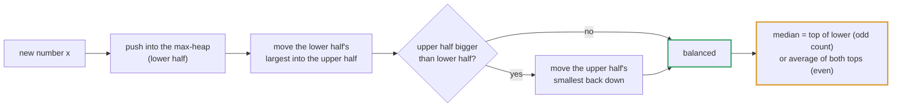
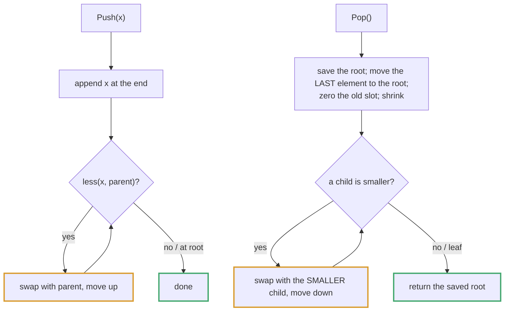

# Topic 12 · Heap & Priority Queue — Go Deep Dive

> Python's `heapq` hands you five free functions that operate on a plain list.
> Go's `container/heap` hands you an *interface* and asks you to implement it.
> That's not Go being difficult — it's Go refusing to guess what "priority"
> means for your data. The cost is ceremony; the payoff is a heap of anything,
> with comparison logic you fully control. This is the document that makes the
> ceremony automatic instead of confusing.

---

## Part 1 · `container/heap` Is Not a Priority Queue — It's an Interface

### 1.1 Python vs. Go, side by side

```python
import heapq
h = []
heapq.heappush(h, 5)
heapq.heappush(h, 1)
smallest = heapq.heappop(h)   # 1 — heapq operates directly on `h`
```

```go
import "container/heap"

type IntHeap []int

func (h IntHeap) Len() int            { return len(h) }
func (h IntHeap) Less(i, j int) bool  { return h[i] < h[j] }   // min-heap
func (h IntHeap) Swap(i, j int)       { h[i], h[j] = h[j], h[i] }
func (h *IntHeap) Push(x any)         { *h = append(*h, x.(int)) }
func (h *IntHeap) Pop() any {
    old := *h
    n := len(old)
    v := old[n-1]
    *h = old[:n-1]
    return v
}
```

`heap.Interface` is:

```go
type Interface interface {
    sort.Interface        // Len() int, Less(i, j int) bool, Swap(i, j int)
    Push(x any)            // add x as element Len()
    Pop() any               // remove and return element Len() - 1
}
```

Yes — a heap **is-a** `sort.Interface` plus two more methods. That's not an
accident: a binary heap is just a slice with a specific *partial* ordering
invariant (parent ≤ children), and `Less`/`Swap` are exactly what's needed to
enforce it incrementally, the same primitives `sort.Slice` uses to enforce
*total* ordering.

> ✅ **Why the interface, not a generic struct?** Because "priority" is
> domain-specific — sometimes it's an int, sometimes it's `task.deadline`,
> sometimes it's `-frequency` for a max-heap. Go makes you name the comparison
> instead of assuming `<` means what you want.

### 1.2 You must call the package functions, not your own methods

```go
h := &IntHeap{5, 2, 8}
heap.Init(h)          // ✅ establishes the heap invariant on an unsorted slice
heap.Push(h, 1)        // ✅ appends, then sifts up
v := heap.Pop(h)       // ✅ swaps root/last, shrinks, then sifts down
```

> ⚠️ **The #1 first-time mistake:** calling `h.Push(1)` or `h.Pop()` directly.
> Your `Push`/`Pop` methods only know how to grow/shrink the underlying slice
> by one element — they have **no idea** how to restore the heap invariant.
> `heap.Push`/`heap.Pop` are the *package-level* functions that call your
> methods **and then** perform sift-up/sift-down. Skip them and your "heap"
> degrades into an unordered slice that silently returns wrong answers.

---

## Part 2 · The Array-as-Tree Representation

### 2.1 Index arithmetic instead of pointers

A binary heap stores a complete binary tree in a **flat slice**, with the
parent/child relationship computed by index, not stored as pointers:

```
index:      0    1    2    3    4    5    6
value:    [ 2,   5,   3,   9,   7,   8,   6 ]

                    2(0)
                 ┌──┴──┐
               5(1)    3(2)
              ┌─┴─┐   ┌─┴─┐
            9(3) 7(4)8(5) 6(6)

parent(i) = (i-1)/2        left(i)  = 2i+1        right(i) = 2i+2
```

```go
func parent(i int) int { return (i - 1) / 2 }
func left(i int) int   { return 2*i + 1 }
func right(i int) int  { return 2*i + 2 }
```

> ⚡ **Cache locality win.** Compare this to Topic 10's `*TreeNode` structs,
> where every node is a separate heap allocation scattered across memory and
> traversal chases pointers. A binary heap is **one contiguous slice** — sift-up
> and sift-down touch a handful of cache-friendly, adjacent-ish indices instead
> of dereferencing pointers all over the heap (the memory kind, not the data
> structure — sorry, overloaded word). This is a real, measurable win at scale.

### 2.2 Sift-up (push) and sift-down (pop)

**Sift-up** ("bubble up"): a newly appended element at index `n-1` may be
smaller than its parent. Swap upward until the invariant holds:

```go
func siftUp(h []int, i int) {
    for i > 0 && h[parent(i)] > h[i] {
        h[parent(i)], h[i] = h[i], h[parent(i)]
        i = parent(i)
    }
}
```

**Sift-down** ("bubble down" / heapify): after swapping the root with the last
element and shrinking, the new root may be larger than its children. Swap
downward toward the smaller child until the invariant holds:

```go
func siftDown(h []int, i, n int) {
    for {
        smallest, l, r := i, left(i), right(i)
        if l < n && h[l] < h[smallest] { smallest = l }
        if r < n && h[r] < h[smallest] { smallest = r }
        if smallest == i { return }
        h[i], h[smallest] = h[smallest], h[i]
        i = smallest
    }
}
```

`container/heap`'s internal `up`/`down` functions do exactly this, calling
your `Less`/`Swap` instead of `<` and a tuple-swap directly — that's the whole
trick. You're not implementing a different algorithm; you're handing the
standard library your comparator.

### 2.3 Min-heap vs. max-heap

Go's heap is a **min-heap by construction of `Less`** — root is always the
smallest. For a max-heap, flip the comparison:

```go
func (h IntHeap) Less(i, j int) bool { return h[i] > h[j] }   // max-heap
```

Or keep `<` and store negated values (common for "largest first" with plain
ints, at the cost of readability):

```go
heap.Push(h, -x)          // push negated
top := -heap.Pop(h).(int) // negate back on pop
```

> ✅ Prefer flipping `Less`. Negation is a classic competitive-programming
> shortcut but reads badly and breaks if you forget to negate everywhere.

---

## Part 3 · The `any` Boxing Tax

```go
func (h *IntHeap) Push(x any) { *h = append(*h, x.(int)) }
func (h *IntHeap) Pop() any   { ... return v }
```

`Push`/`Pop` traffic in `any` (`interface{}`), not a generic type parameter.

> ⚠️ **`container/heap` predates generics and has not been genericized.**
> Unlike `slices.Sort[T]` or `maps.Keys[K,V]` (Go 1.21+, fully generic), every
> value that flows through `heap.Push`/`heap.Pop` gets **boxed** into an
> interface value — for a small type like `int` this is a real, if small,
> allocation/indirection on every push and a type assertion (`x.(int)`) on
> every insert. For hot paths (competitive programming, high-QPS schedulers),
> people hand-roll a specialized heap over a concrete slice to avoid this.
> For interviews and most production code, the ergonomic win is worth it.

This is a genuine, slightly annoying rough edge worth naming out loud: Go
modernized `sort` (`slices.SortFunc`) and maps (`maps` package) for generics,
but `container/heap`'s public interface is unchanged since before generics
existed.

---

## Part 4 · Common Heap Patterns

### 4.1 Top-K elements — fixed-size min-heap

Maintain a min-heap of size **k**. For each new element: push it, and if the
heap exceeds size k, pop the minimum. The root is always the smallest of the
current top-k, so a single comparison decides whether a new element belongs.

```go
h := &IntHeap{}
for _, x := range nums {
    heap.Push(h, x)
    if h.Len() > k {
        heap.Pop(h)
    }
}
// *h now holds the k largest elements
```

**O(n log k)** beats sorting everything at O(n log n) — the whole point of
this pattern when k ≪ n.

### 4.2 K-way merge

Push one element (with its source index) from each of k sorted lists into a
min-heap. Pop the minimum, push the next element from that same source. This
is how `Merge K Sorted Lists` (LC 23) and external merge-sort avoid ever
comparing more than k elements at a time — **O(n log k)** for n total elements
across k lists.



### 4.3 Two-heap median finder

Keep a **max-heap** of the smaller half and a **min-heap** of the larger half,
rebalanced so their sizes differ by at most one. The median is then O(1) —
either the max-heap's root, or the average of both roots. Insertion is
O(log n) to push/rebalance. This is the standard answer to "find median from a
data stream" (LC 295) and it's a genuinely elegant use of *two* heaps with
opposite orderings.

---

## Part 5 · Complexity Table

| Operation | Complexity | Note |
|---|:--:|---|
| `heap.Push` | **O(log n)** | Append + sift-up |
| `heap.Pop` | **O(log n)** | Swap root/last, shrink, sift-down |
| Peek (`h[0]`) | **O(1)** | Root is always the min (or max) |
| `heap.Init` on n elements | **O(n)** ⚡ | Not O(n log n) — see below |
| Heap sort (n pops) | **O(n log n)** | Repeated pop |
| Top-K via fixed-size heap | **O(n log k)** | Beats full sort when k ≪ n |
| K-way merge of n total elements | **O(n log k)** | Heap never exceeds size k |

> ⚡ **Why `heap.Init` is O(n), not O(n log n).** It's tempting to assume n
> sift-downs at O(log n) each gives O(n log n), but that overcounts: most
> nodes are near the *bottom* of the tree, where a sift-down has almost no
> distance to travel. Summing sift-down cost weighted by how many nodes exist
> at each depth gives a geometric series that converges to O(n) total. This is
> the same "amortized/aggregate analysis" flavor of argument as `append`'s
> O(1) amortized cost in Topic 1 — a different mechanism, same style of proof.

---

## Part 6 · Python vs. Go — Where They Diverge

| | Python | Go |
|---|---|---|
| API shape | Free functions on a plain `list` | Interface you implement (`heap.Interface`) |
| Default order | Min-heap | Min-heap (flip `Less` for max) |
| Max-heap idiom | Negate values | Flip `Less`, or negate |
| Generic support | N/A (duck-typed) | **Not genericized** — `any`-based, boxes values |
| Custom priority | Store tuples `(priority, item)` | Implement `Less` on your struct directly |
| Peek | `h[0]` | `h[0]` (same — root is index 0 in both) |
| Build from existing slice | `heapq.heapify(list)` — O(n) | `heap.Init(h)` — O(n), same guarantee |

---

## Part 7 · Algorithms Owned by This Topic

| Algorithm | Time | Space | Problem |
|---|:--:|:--:|---|
| Sift-up / sift-down | O(log n) | O(1) | Core heap primitive |
| Heapify (build-heap) | O(n) | O(1) | `heap.Init` |
| Top-K via fixed-size heap | O(n log k) | O(k) | LC 347 Top K Frequent Elements |
| K-way merge | O(n log k) | O(k) | LC 23 Merge K Sorted Lists |
| Two-heap median | O(log n) insert, O(1) query | O(n) | LC 295 Find Median from Data Stream |
| Heap sort | O(n log n) | O(1) extra | Any "sort via heap" ask |
| Kth largest / smallest via heap | O(n log k) | O(k) | LC 215 Kth Largest Element |
| Dijkstra's shortest path | O((V+E) log V) | O(V) | Covered fully in Topic 15 |

---

## Part 8 · Building Top-K Frequent Elements From Scratch (LC 347)

```go
package main

import "container/heap"

// item pairs a value with its frequency — the thing we actually order by.
type item struct {
    value int
    freq  int
}

// itemHeap is a MIN-heap ordered by freq: the least-frequent of our current
// top-k sits at the root, ready to be evicted when a more frequent item shows up.
type itemHeap []item

func (h itemHeap) Len() int            { return len(h) }
func (h itemHeap) Less(i, j int) bool  { return h[i].freq < h[j].freq }
func (h itemHeap) Swap(i, j int)       { h[i], h[j] = h[j], h[i] }
func (h *itemHeap) Push(x any)         { *h = append(*h, x.(item)) }
func (h *itemHeap) Pop() any {
    old := *h
    n := len(old)
    v := old[n-1]
    *h = old[:n-1]
    return v
}

func topKFrequent(nums []int, k int) []int {
    freq := make(map[int]int)
    for _, n := range nums {
        freq[n]++              // zero-value idiom from Topic 1, Part 2.5
    }

    h := &itemHeap{}
    for value, f := range freq {
        heap.Push(h, item{value: value, freq: f})
        if h.Len() > k {
            heap.Pop(h)         // evict the least-frequent of the current top-k
        }
    }

    result := make([]int, h.Len())
    for i := len(result) - 1; i >= 0; i-- {
        result[i] = heap.Pop(h).(item).value  // pop smallest-freq-first, fill from the back
    }
    return result
}
```

**Talk track while writing:** the heap only ever holds ≤ k+1 elements, so
every push/pop is O(log k), not O(log n) — that's the whole efficiency
argument versus "sort all frequencies, take the top k" (O(n log n)). Popping
in ascending-frequency order and filling `result` back-to-front is a cheap
trick to avoid a second sort or a `slices.Reverse` call at the end.

---

<!-- block:12_go_1_generic -->
## Part 9 · A Generic Heap Without the Ceremony — and `heap.Fix` / `heap.Remove`

`container/heap` makes you write five methods per element type. For interviews you can write a **generic heap
yourself in ~35 lines** — no `any` boxing, no type assertions, and the comparison is a closure you pass in. All code
below ran on Go 1.24.5.



```go
type Heap[T any] struct {
    data []T
    less func(a, b T) bool
}

func NewHeap[T any](less func(a, b T) bool) *Heap[T] { return &Heap[T]{less: less} }
func (h *Heap[T]) Len() int { return len(h.data) }
func (h *Heap[T]) Peek() T  { return h.data[0] }

func (h *Heap[T]) Push(x T) {
    h.data = append(h.data, x)
    for i := len(h.data) - 1; i > 0; {
        p := (i - 1) / 2
        if !h.less(h.data[i], h.data[p]) { break }
        h.data[i], h.data[p] = h.data[p], h.data[i]
        i = p
    }
}

func (h *Heap[T]) Pop() T {
    top, n := h.data[0], len(h.data)-1
    h.data[0] = h.data[n]
    var zero T
    h.data[n] = zero                       // drop the reference so the GC can reclaim it
    h.data = h.data[:n]
    for i := 0; ; {
        l, r, m := 2*i+1, 2*i+2, i
        if l < n && h.less(h.data[l], h.data[m]) { m = l }
        if r < n && h.less(h.data[r], h.data[m]) { m = r }
        if m == i { break }
        h.data[i], h.data[m] = h.data[m], h.data[i]
        i = m
    }
    return top
}
```

**A max-heap is just a flipped comparison** — `NewHeap(func(a, b int) bool { return a > b })` — so negation is never
needed. **Multi-key ordering** (Python gets it free from tuples) uses `cmp.Or` (Go 1.22+), which returns the first
non-zero comparison:

```go
less := func(a, b task) bool { return cmp.Or(cmp.Compare(a.proc, b.proc), cmp.Compare(a.idx, b.idx)) < 0 }
```

Two traps live in the alternatives. **Negating to fake a max-heap overflows at `math.MinInt`**: `-math.MinInt == math.MinInt`
(measured: `true`), so the smallest value sorts as the *largest*. And an un-tiebroken comparison leaves equal priorities in
an unspecified order — heaps are **not stable**; carry an insertion counter or an index when order among ties matters.

### `heap.Fix` and `heap.Remove` — the operations a generic heap does not give you

When you must **change a priority in place** or **delete an arbitrary item** (a cancelled task, Dijkstra's decrease-key,
an LFU/LRU variant), use `container/heap` with an *index* stored in each item and kept current by `Swap`, `Push` and
`Pop`:

```go
type Item struct { name string; priority int; index int }      // index is maintained by the heap methods
type PQ []*Item

func (p PQ) Len() int           { return len(p) }
func (p PQ) Less(i, j int) bool { return p[i].priority < p[j].priority }
func (p PQ) Swap(i, j int)      { p[i], p[j] = p[j], p[i]; p[i].index = i; p[j].index = j }
func (p *PQ) Push(x any)        { it := x.(*Item); it.index = len(*p); *p = append(*p, it) }
func (p *PQ) Pop() any {
    old := *p; n := len(old); it := old[n-1]
    old[n-1] = nil                                              // drop the reference
    it.index = -1                                               // "not in the heap" marker
    *p = old[:n-1]
    return it
}

item.priority = 1
heap.Fix(&pq, item.index)              // O(log n): re-sift after an in-place change
heap.Remove(&pq, other.index)          // O(log n): delete an arbitrary element
```

Change `priority` *first*, then `heap.Fix` — never the other way around. With `apple 2`, `banana 3`, `pear 4` in the queue,
setting `pear` to 1, fixing, and removing `banana` pops `pear apple`. The alternative to `Fix` is **lazy deletion**:
push a fresh entry and skip stale ones on pop (Dijkstra below). It is simpler and usually fast enough; `Fix` avoids
the extra entries.

### The `any` boxing tax, again

`container/heap` boxes every `Push`/`Pop` through `any` — for pointer elements (`*Item`) that is free, for small value
types it can allocate. The generic `Heap[T]` above has neither cost, at the price of not offering `Fix`/`Remove`. In an
interview, either is acceptable; say which you chose and why.

### Retention on `Pop`

Like every slice-backed stack or queue, `Pop` shrinks the slice header but leaves the old slot in the backing array. For
`[]*Item`, `[]string` or structs holding pointers, the popped value stays reachable until the slot is overwritten — so
**zero it before shrinking** (`old[n-1] = nil`), as both implementations above do.

---
<!-- /block:12_go_1_generic -->

<!-- block:12_go_2_problems -->
## Part 10 · The Twelve Problems in Go, and the Patterns Beyond Them

All code runs on the generic `Heap[T]` above (`NewHeap(less)`). Every snippet was checked against LeetCode's own examples.

### Size-k heaps: Kth Largest in a Stream, Last Stone, K Closest

```go
// LC 703: a MIN-heap of exactly k elements — its root IS the k-th largest.
func (kl *KthLargest) Add(v int) int {
    kl.h.Push(v)
    if kl.h.Len() > kl.k { kl.h.Pop() }                  // trim back to k
    return kl.h.Peek()
}                                                         // k=3, [4 5 8 2]: add 3,5,10,9,4 -> 4 5 5 8 8

// LC 1046: a MAX-heap is just a flipped comparison — no negation.
h := NewHeap(func(a, b int) bool { return a > b })
for h.Len() > 1 {
    y, x := h.Pop(), h.Pop()                              // pop TWO: heap[1] is not "the second largest"
    if y != x { h.Push(y - x) }                           // a zero remainder is not re-inserted
}                                                         // [2 7 4 1 8 1] -> 1
```

**K Closest (LC 973):** compare **squared** distance — a monotonic transform preserves the order, so `sqrt` (and float
error) is unnecessary — with a size-`k` *max*-heap, and break ties with the index:

```go
less := func(a, b pt) bool {                              // max-heap on squared distance
    da, db := a.x*a.x+a.y*a.y, b.x*b.x+b.y*b.y
    return cmp.Or(cmp.Compare(db, da), cmp.Compare(b.idx, a.idx)) < 0
}
```

### Kth Largest in an Array (LC 215)

Three answers, and you should be able to price each: **sort** O(n log n); **size-k min-heap** O(n log k), O(k) space;
**quickselect** O(n) average, O(n²) worst, in place (topic 27). Say which one the constraints favour.

### Task Scheduler and Reorganize String — greedy on the most frequent

The busiest task sets the frame: `(max − 1) · (n + 1) + ties`, but never fewer slots than tasks:

```go
return max(len(tasks), (mx-1)*(n+1)+ties)                 // AAABBB,n=2 -> 8    n=0 -> 6    AAAAAABCDEFG,n=2 -> 16
```

Omitting the outer `max` undercounts when there is enough variety to fill every gap; the `-1` counts *gaps*, not
occurrences. **Reorganize String** is the `n = 1` case as a heap: always place the most frequent remaining letter, then
**bench it for exactly one placement** before re-inserting it. It is feasible iff the top count `<= (len(s)+1)/2` —
`len(s)/2` wrongly rejects `"aab"`:

```go
cur := h.Pop(); out = append(out, cur.c); cur.n--
if bench != nil { h.Push(*bench); bench = nil }          // last round's letter rejoins
if cur.n > 0 { bench = &cur }                            // this round's letter sits out one placement
```

### Sweep one axis, heap the other: IPO and Single-Threaded CPU

**IPO (LC 502):** capital only rises, so the affordable set only grows. Sort the projects by required capital, sweep a
pointer forward pushing profits into a max-heap, take the best each round. Capital is a **threshold, not a cost** — only
the profit is added (`w += h.Pop()`); picking the *cheapest* project is wrong.

**Single-Threaded CPU (LC 1834):** sort by enqueue time, heap the *available* tasks by `(processing time, index)`, and
when the heap is empty **jump the clock** to the next enqueue time instead of ticking:

```go
if h.Len() == 0 && i < len(ts) && now < ts[i].enq { now = ts[i].enq }    // idle: JUMP, do not tick one unit at a time
for i < len(ts) && ts[i].enq <= now { h.Push(ts[i]); i++ }
t := h.Pop(); order = append(order, t.idx); now += t.proc                 // [[1 2] [2 4] [3 2] [4 1]] -> [0 2 3 1]
```

Carry the *original index* through the sort, and heap only tasks that have arrived.

### Two heaps: the running median (LC 295)

A max-heap `lo` (lower half) and a min-heap `hi` (upper half), sizes differing by at most one. **Route the new number
through the other heap** so you never compare against a stale median:

```go
m.lo.Push(n)
m.hi.Push(m.lo.Pop())                                    // the top of lo crosses over
if m.hi.Len() > m.lo.Len() { m.lo.Push(m.hi.Pop()) }     // rebalance: lo holds the extra one
// median: lo.Peek() if lo is bigger, else float64(lo.Peek()+hi.Peek()) / 2 — FLOAT division
```

`(a + b) / 2` with integers turns `1.5` into `1`. **Sliding Window Median (LC 480)** adds *lazy deletion*: elements
that leave are recorded in a `map[int]int` of pending deletions and physically removed only when they reach a heap
top, with **logical size counters** — `len(heap)` includes stale entries and unbalances the halves.

### Merge k / Design Twitter (LC 355)

`getNewsFeed` is a k-way merge of each followee's newest-first tweet list, taking the top 10: a heap of cursors
`(tweetTime, userID, indexInTheirList)`, popping the newest and pushing that user's next-older tweet. Never re-sort a
user's whole history per call; remember the caller's **own** tweets; and order by an integer counter, not
`time.Now()`.

### Beyond the twelve

```go
// K smallest pairs (LC 373): a FRONTIER. The next-smallest unseen pair is adjacent to one already taken,
// so push only (i+1, j) and (i, j+1) — O(k log k), independent of m*n.
for _, nx := range [][2]int{{c.i + 1, c.j}, {c.i, c.j + 1}} {
    if nx[0] < len(a) && nx[1] < len(b) && !seen[nx] { seen[nx] = true; h.Push(e{a[nx[0]] + b[nx[1]], nx[0], nx[1]}) }
}                                                        // [1 7 11] x [2 4 6], k=3 -> [[1 2] [1 4] [1 6]]

// Meeting Rooms II: a heap of END times. Reuse the room that frees up first, else open one.
if ends.Len() > 0 && ends.Peek() <= m[0] { ends.Pop() }
ends.Push(m[1])                                          // [[0 30] [5 10] [15 20]] -> 2
```

**Dijkstra with lazy deletion** — there is no decrease-key in `Heap[T]`, so push a *new* entry when a shorter path is
found and skip the stale one when it surfaces:

```go
cur := pq.Pop()
if cur.d > dist[cur.u] { continue }                      // STALE: a shorter path was already found
for _, e := range g[cur.u] {
    if nd := cur.d + e.w; nd < dist[e.to] { dist[e.to] = nd; pq.Push(st{nd, e.to}) }
}                                                        // the classic 6-node example -> [0 7 9 20 20 11]
```

The heap can hold up to one entry per relaxation (`O(E)`), which is still `O((V + E) log V)` overall. Topic 15 develops it.

### Go traps in this topic

| Trap | What happens | The fix |
|---|---|---|
| Calling `h.Push(x)` / `h.Pop()` on a `container/heap` type | Skips the sift — a silently unordered "heap". | `heap.Push(h, x)` / `heap.Pop(h)`. |
| `-x` to fake a max-heap | `-math.MinInt == math.MinInt` — the smallest value becomes the "largest". | Flip `Less` instead. |
| Mutating `priority` without `heap.Fix` | The heap invariant is broken; later pops are wrong. | Change the field, then `heap.Fix(&pq, item.index)`. |
| Not maintaining `index` in `Swap`/`Push`/`Pop` | `Fix`/`Remove` act on the wrong element. | Update `p[i].index = i` in every method that moves an item. |
| Not zeroing the popped slot | A pointer stays reachable in the backing array. | `old[n-1] = nil` before shrinking. |
| Reading `h[1]` as "the second smallest" | Only the root is ordered; `h[1]` is merely one of its children. | Pop twice. |
| `(a + b) / 2` for the median | Integer division truncates `1.5` to `1`. | `float64(a+b) / 2`. |
| Iterating a `map` to push into a heap | Random order → different tie results run to run. | Sort the keys, or add a deterministic tiebreak. |

### Follow-ups the interviewer reaches for

| Follow-up | The answer |
|---|---|
| "Change a priority / cancel an item." | `heap.Fix` / `heap.Remove` with an index, or lazy deletion. |
| "Why is `heap.Init` O(n)?" | Most nodes are near the leaves where sift-down does almost nothing; the weighted sum converges to O(n). |
| "Top `k` of a stream, bounded memory." | The size-`k` heap is already O(k). |
| "Stable ordering on ties." | An insertion counter as the last key of `Less`. |
| "Thread-safe priority queue." | A `sync.Mutex` around the heap; or a channel-fed single owner goroutine. |
| "Heap or sorted slice?" | A heap for many inserts and pops of the extreme; a sorted slice + `slices.BinarySearch` when reads dominate and inserts are rare. |

---
<!-- /block:12_go_2_problems -->

<!-- problem-map:start -->
## Part 11 · Every Problem in This Topic, by Pattern

Twelve problems, five moves (size-k heap · max-heap by flipping `Less` · merge and frontier · sweep + heap · two heaps) — the Python guide's map in Go, on a generic `Heap[T]`. Topic 12's solutions are Python-first; the Go column is the plan you would write.

| Problem | Move | The idea — and the trap it sets |
|---|---|---|
| [001 · Kth Largest Element in a Stream](GoDSA/12_heap_priority_queue/001_kth_largest_element_in_a_stream/solution.go) <br>LC 703 · Easy | Size-k min-heap | `NewHeap` with `<`; push, and `if Len() > k { Pop() }`; the root is the k-th largest. **Trap:** a max-heap of everything; pushing without trimming. |
| [002 · Last Stone Weight](GoDSA/12_heap_priority_queue/002_last_stone_weight/solution.go) <br>LC 1046 · Easy | Max-heap by flipping `Less` | `NewHeap(func(a, b int) bool { return a > b })`; pop **two**, push `y - x` only if non-zero. **Trap:** peeking `data[1]` as "second largest"; re-inserting a zero remainder; negating instead of flipping (`-math.MinInt` overflows). |
| [003 · K Closest Points to Origin](GoDSA/12_heap_priority_queue/003_k_closest_points_to_origin/solution.go) <br>LC 973 · Medium | Top-k keyed by a derived value | Squared distance in `int` (no `sqrt`, no float error); size-`k` *max*-heap; `cmp.Or` for an index tiebreak. **Trap:** `math.Sqrt`; no tiebreak. |
| [004 · Kth Largest Element in an Array](GoDSA/12_heap_priority_queue/004_kth_largest_element_in_an_array/solution.go) <br>LC 215 · Medium | Size-k heap or quickselect | Size-`k` min-heap O(n log k), or quickselect O(n) average. **Trap:** a full sort when `k ≪ n`; mutating the caller's slice in quickselect. |
| [005 · Task Scheduler](GoDSA/12_heap_priority_queue/005_task_scheduler/solution.go) <br>LC 621 · Medium | Greedy on the busiest task | `max(len(tasks), (mx-1)*(n+1)+ties)`, or a heap simulation. **Trap:** omitting the outer `max`; the `-1`; re-pushing within the cooldown. |
| [006 · Design Twitter](GoDSA/12_heap_priority_queue/006_design_twitter/solution.go) <br>LC 355 · Medium | k-way merge | Heap of cursors `(time, user, index)`; pop the newest, push that user's next-older tweet; take 10. **Trap:** re-sorting histories; forgetting the caller's own tweets; `time.Now()` instead of a counter. |
| [007 · Reorganize String](GoDSA/12_heap_priority_queue/007_reorganize_string/solution.go) <br>LC 767 · Medium | Task Scheduler with n = 1 | Heap of `cnt`; bench the just-used letter for one placement; feasible iff `top <= (len(s)+1)/2`. **Trap:** wrong bench length; `len(s)/2` rejecting `"aab"`. |
| [008 · Single-Threaded CPU](GoDSA/12_heap_priority_queue/008_single_threaded_cpu/solution.go) <br>LC 1834 · Medium | Sweep time, heap the ready set | Sort by enqueue; `cmp.Or(proc, idx)` in `Less`; jump the clock when idle. **Trap:** ticking one unit at a time; losing the original index; heaping all tasks up front. |
| [009 · Find Median from Data Stream](GoDSA/12_heap_priority_queue/009_find_median_from_data_stream/solution.go) <br>LC 295 · Hard | Two heaps straddling the median | `lo` max-heap, `hi` min-heap; push to `lo`, move its top to `hi`, rebalance; `float64(a+b) / 2`. **Trap:** integer division (`1.5 → 1`); comparing against a stale median. |
| [010 · Minimum Interval to Include Each Query](GoDSA/12_heap_priority_queue/010_minimum_interval_to_include_each_query/solution.go) <br>LC 1851 · Hard | Sorted sweep with lazy expiry | Sort queries with their original indices; admit intervals with `left <= q`, keyed by size; pop those with `right < q`. **Trap:** not writing answers back to the original positions; eager deletion. |
| [011 · IPO](GoDSA/12_heap_priority_queue/011_ipo/solution.go) <br>LC 502 · Hard | Sweep one axis, heap the other | Sort indices by capital; max-heap of profits; `w += h.Pop()`. **Trap:** choosing the cheapest project; subtracting capital. |
| [012 · Sliding Window Median](GoDSA/12_heap_priority_queue/012_sliding_window_median/solution.go) <br>LC 480 · Hard | Two heaps + lazy deletion | `map[int]int` of pending deletions, physical removal at the top, **logical** size counters. **Trap:** `len(heap)` as the size; integer division for even `k`; forgetting to prune the tops after each slide. |

---
<!-- problem-map:end -->

## Checklist Before Leaving This Topic

- [ ] Implement `heap.Interface` from memory: `Len`, `Less`, `Swap`, `Push(any)`, `Pop() any`
- [ ] Explain why you must call `heap.Push`/`heap.Pop`, never your type's own methods directly
- [ ] Draw the array-as-complete-binary-tree layout and the parent/child index formulas
- [ ] Explain sift-up vs. sift-down and when each fires
- [ ] Flip `Less` to go from min-heap to max-heap without touching `Swap`
- [ ] Explain why `heap.Init` is O(n), not O(n log n)
- [ ] Name the `any`-boxing cost as a real (if usually acceptable) tax of `container/heap`
- [ ] Solve Top-K with a fixed-size heap in O(n log k), not a full O(n log n) sort
- [ ] Explain the two-heap median-finder's rebalancing invariant
- [ ] Write a custom-struct heap (not just `IntHeap`) satisfying `heap.Interface` in under 10 minutes
- [ ] Write a generic `Heap[T]` with a `less` closure in ~35 lines, zeroing the popped slot <!--ca-->
- [ ] Flip `Less` for a max-heap, and say why negating overflows at `math.MinInt` <!--ca-->
- [ ] Use `heap.Fix` / `heap.Remove` with an index maintained by `Swap`/`Push`/`Pop` <!--ca-->
- [ ] Use `cmp.Or` for a multi-key comparison in place of Python's tuples <!--ca-->
- [ ] Write Dijkstra's lazy-deletion loop and explain why the heap can hold O(E) entries <!--ca-->
