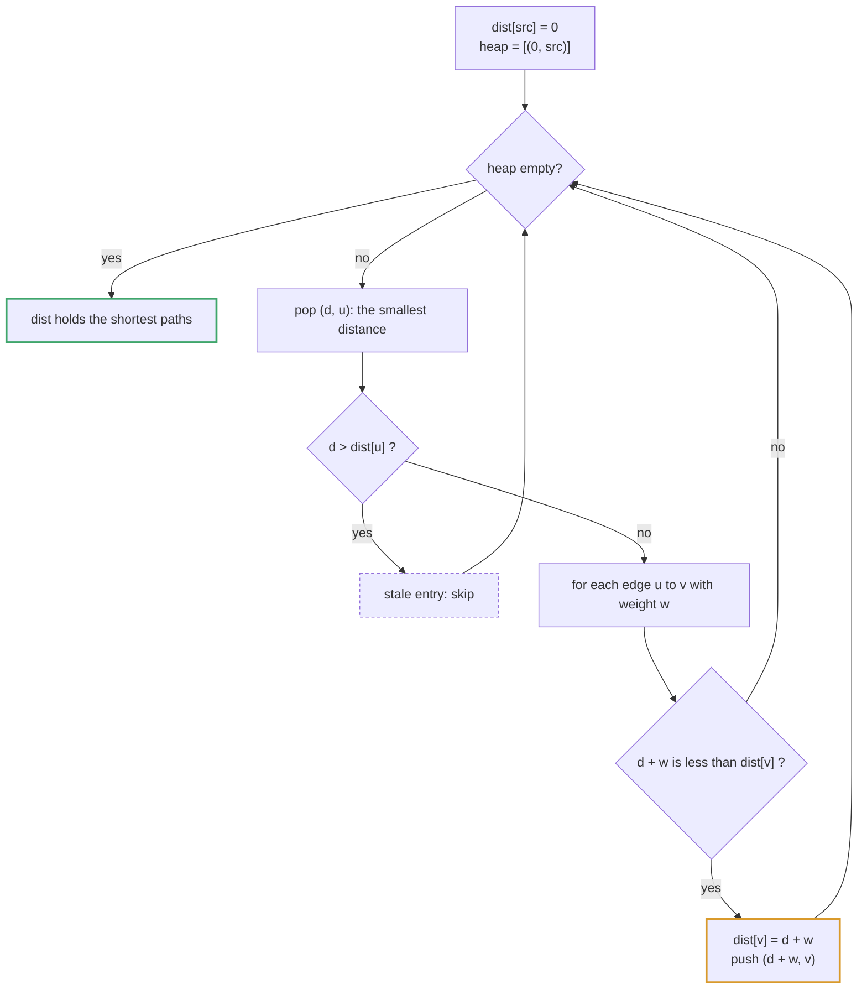
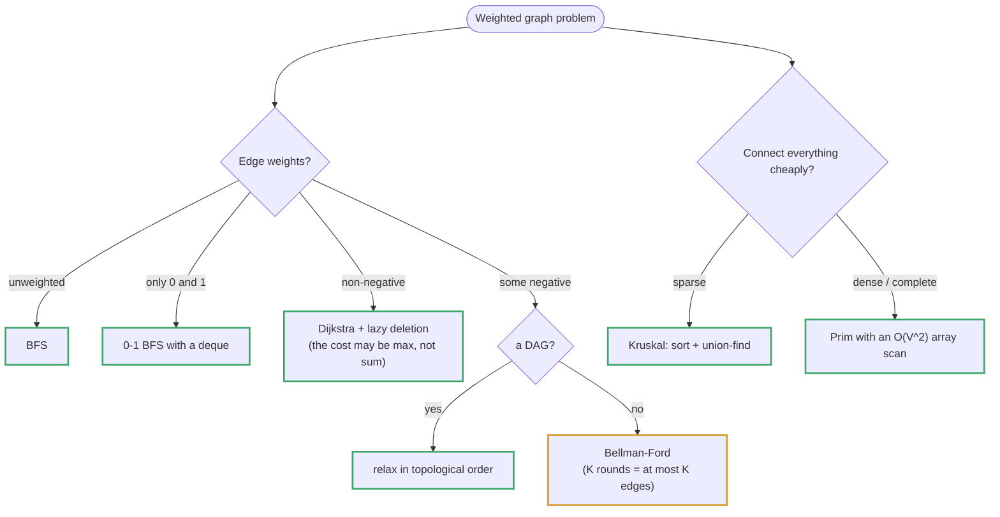

# Topic 15 · Advanced Graphs — Go Deep Dive

> Basic BFS/DFS answers "is there a path?" Weighted graphs ask "what's the
> *cheapest* path?" — and the cheapest path requires an ordering primitive.
> Go's `container/heap` gives you that ordering, but it is a bare-bones
> interface with none of the decrease-key convenience other languages' heap
> libraries offer. Every algorithm in this topic is shaped around working
> around that one missing operation.

---

## Part 1 · Dijkstra's Algorithm and the Missing Decrease-Key

### 1.1 The shape of the problem

Dijkstra's algorithm greedily expands the closest known node, updating its
neighbors' tentative distances. In a textbook description, when you find a
shorter path to a node already in the priority queue, you **decrease its key**
in place so the queue re-heapifies around the new, smaller distance.

`container/heap` has no such operation. Its interface is intentionally minimal:

```go
type Interface interface {
    sort.Interface
    Push(x any)
    Pop() any
}
```

There is no `DecreaseKey(i int, newPriority int)`. You could implement one by
tracking each item's heap index and calling `heap.Fix`, but it adds real
bookkeeping. The idiomatic Go workaround is simpler: **don't decrease — push
again.**



### 1.2 Lazy deletion

Every time you relax an edge and find a shorter distance, push a **new** heap
entry for that node with the new distance. Stale, larger-distance entries for
the same node stay in the heap — you simply **skip them when popped**, by
comparing the popped distance against the best known distance recorded in a
`dist[]` slice:

```go
type Item struct {
    node, dist int
}

type PQ []Item

func (pq PQ) Len() int            { return len(pq) }
func (pq PQ) Less(i, j int) bool  { return pq[i].dist < pq[j].dist }
func (pq PQ) Swap(i, j int)       { pq[i], pq[j] = pq[j], pq[i] }
func (pq *PQ) Push(x any)         { *pq = append(*pq, x.(Item)) }
func (pq *PQ) Pop() any {
    old := *pq
    n := len(old)
    item := old[n-1]
    *pq = old[:n-1]
    return item
}
```

```
Node 3 relaxed twice: first to dist=10, later to dist=4.
Heap after both pushes (not re-sorted in place, just two entries):

   pq: [ {node:3,dist:4}, {node:5,dist:7}, {node:3,dist:10}, ... ]
                                                 ▲
                                    stale — will be skipped on pop
```

When `{node:3, dist:10}` is eventually popped, `dist[3]` already equals `4`
(a smaller value was recorded when the better entry was pushed), so the
popped entry fails the freshness check and is discarded:

```go
item := heap.Pop(&pq).(Item)
if item.dist > dist[item.node] {
    continue   // stale entry — a better one was already processed
}
```

> ⚠️ **Without this check, Dijkstra silently reprocesses stale nodes.** It
> still terminates and still gives the correct answer (each fresh entry is
> processed once and correctly), but it does wasted work proportional to how
> many times each node was relaxed — up to O(E) extra pops in the worst case.
> The `if item.dist > dist[item.node] { continue }` line is not optional
> defensive code; it's the mechanism that makes lazy deletion correct *and*
> efficient.

### 1.3 Why not just decrease-key?

You could track `index[node] int` (each item's current position in the heap
slice) and call `heap.Fix(&pq, index[node])` after mutating an entry in
place. This is a real O(log n) decrease-key, matching languages with a
mutable-priority heap built in. It is more code and more bookkeeping (you
must keep `index[]` in sync inside `Swap`), so most interview-length Dijkstra
implementations reach for lazy deletion instead — flag that you know the
trade-off if asked.

---

## Part 2 · Topological Sort — Kahn's Algorithm

### 2.1 In-degree counting + a queue of zero-in-degree nodes

A topological order only exists for a **DAG** (directed, acyclic). Kahn's
algorithm is BFS-shaped: repeatedly remove nodes with no remaining incoming
edges.

```go
func topoSort(n int, edges [][2]int) ([]int, bool) {
    adj := make([][]int, n)
    indeg := make([]int, n)
    for _, e := range edges {
        u, v := e[0], e[1]
        adj[u] = append(adj[u], v)
        indeg[v]++
    }

    queue := make([]int, 0, n)
    for i := 0; i < n; i++ {
        if indeg[i] == 0 {
            queue = append(queue, i)
        }
    }

    order := make([]int, 0, n)
    for len(queue) > 0 {
        u := queue[0]
        queue = queue[1:]
        order = append(order, u)
        for _, v := range adj[u] {
            indeg[v]--
            if indeg[v] == 0 {
                queue = append(queue, v)
            }
        }
    }

    return order, len(order) == n   // false ⇒ a cycle exists
}
```

### 2.2 Cycle detection is a side effect, not extra code

If the graph has a cycle, every node inside that cycle keeps `indeg > 0`
forever — none of them are ever enqueued. `len(order) == n` is therefore a
free correctness check: **fewer than `n` nodes emitted means a cycle exists**,
directly reusing the directed-cycle-detection idea from the basic graphs
topic, but without needing a separate visited/recursion-stack DFS pass.

> ✅ Kahn's algorithm gives you topological order **and** cycle detection in
> one O(V+E) pass. The DFS-based alternative (post-order, then reverse the
> finish order) is equally valid and sometimes preferred when you're already
> running a DFS for another reason, but it needs a separate three-color
> (white/gray/black) visited scheme to detect cycles correctly — Kahn's is
> usually the less error-prone default to reach for first.

---

## Part 3 · Bellman-Ford — Simpler Code, Handles Negative Weights

### 3.1 The relaxation loop

Where Dijkstra requires a priority queue and non-negative weights,
Bellman-Ford is a plain nested loop: relax every edge, `V-1` times.

```go
const inf = math.MaxInt / 2   // see Part 6 — never math.MaxInt itself

func bellmanFord(n, src int, edges [][3]int) ([]int, bool) {
    dist := make([]int, n)
    for i := range dist {
        dist[i] = inf
    }
    dist[src] = 0

    for i := 0; i < n-1; i++ {
        for _, e := range edges {
            u, v, w := e[0], e[1], e[2]
            if dist[u] != inf && dist[u]+w < dist[v] {
                dist[v] = dist[u] + w
            }
        }
    }

    // One more round: if anything still improves, a negative-weight cycle exists.
    for _, e := range edges {
        u, v, w := e[0], e[1], e[2]
        if dist[u] != inf && dist[u]+w < dist[v] {
            return dist, false   // negative cycle detected
        }
    }
    return dist, true
}
```

### 3.2 Why `V-1` rounds is enough

The shortest path between any two nodes in a graph with no negative cycle
visits at most `V-1` edges (a simple path can't repeat a node). Each full
round of relaxation guarantees that all shortest paths using up to `i` edges
are correctly found after round `i`. After `V-1` rounds, every simple
shortest path has been found — a clean induction argument, and the reason
the extra `Vth` round is meaningful: **any further improvement is proof of a
negative cycle**, since a real shortest path can't need more than `V-1` edges.

> ⚡ Bellman-Ford is O(V·E) — much slower than Dijkstra's O((V+E) log V) — but
> its code is shorter and it's the only one of the two that handles negative
> edge weights correctly. Reach for it specifically when weights can be
> negative or you need negative-cycle detection; don't use it as a default
> Dijkstra replacement.

---

## Part 4 · Floyd-Warshall — All-Pairs Shortest Path

### 4.1 The triple loop, and why the loop order is not a style choice

```go
func floydWarshall(n int, dist [][]int) {
    for k := 0; k < n; k++ {
        for i := 0; i < n; i++ {
            if dist[i][k] == inf {
                continue // ⚡ skip a row of dead work if i can't reach k at all
            }
            for j := 0; j < n; j++ {
                if d := dist[i][k] + dist[k][j]; d < dist[i][j] {
                    dist[i][j] = d
                }
            }
        }
    }
}
```

`k` **must** be the outermost loop. `dist[i][j]` after the `k`th outer
iteration is defined to mean "shortest path from `i` to `j` using only
intermediate nodes `0..k`." Each `i,j` cell depends on `dist[i][k]` and
`dist[k][j]` **already having been finalized for the current `k`** — which
only holds if every `(i, j)` pair is processed for a given `k` before moving
to `k+1`. Swap `k` inward (e.g. `i, j, k` order) and you'll relax `dist[i][j]`
using a `dist[i][k]` that hasn't yet incorporated all of `0..k-1` as
intermediates, producing wrong answers on some inputs — a real correctness
bug, not a performance regression.

### 4.2 `[][]int` vs. a flattened distance matrix

This is an O(V³) triple loop over a `[][]int` — exactly the case flagged in
topic 4's prefix-sum guide where memory layout stops being a style question.
`[][]int` rows are separately heap-allocated and not contiguous, so
`dist[i][k]` and `dist[k][j]` on each inner iteration are pointer-chasing
into two different allocations. For interview-sized graphs (V < a few
hundred) this is a non-issue. For a competitive-programming-sized graph
(V in the thousands, so V³ is in the billions), flatten to a single
`[]int` indexed as `dist[i*n+j]` — a contiguous slice that the CPU can
prefetch, which measurably speeds up the innermost loop:

```go
dist := make([]int, n*n)   // dist[i*n+j] replaces dist[i][j]
```

### 4.3 Complexity

O(V³) time, O(V²) space — the trade for getting *every* pair's shortest
distance in one pass, versus running Dijkstra from every node (O(V·(V+E)
log V), which wins when the graph is sparse).

---

## Part 5 · Minimum Spanning Tree — Kruskal's Algorithm

### 5.1 Sort edges, reuse Union-Find

Kruskal's is a direct composition of two things already built elsewhere in
this series: `sort.Slice`/`slices.SortFunc` from topic 1, and the
Union-Find/Disjoint-Set structure from the basic graphs topic (path
compression + union by rank). Process edges in ascending weight order; add an
edge to the MST only if its two endpoints aren't already connected.

```go
type edge struct{ u, v, w int }

func kruskalMST(n int, edges []edge) (int, []edge) {
    slices.SortFunc(edges, func(a, b edge) int { return a.w - b.w })

    uf := newUnionFind(n)   // Find with path compression, Union by rank
    var mst []edge
    total := 0

    for _, e := range edges {
        if uf.Find(e.u) != uf.Find(e.v) {
            uf.Union(e.u, e.v)
            mst = append(mst, e)
            total += e.w
            if len(mst) == n-1 {
                break   // a spanning tree on n nodes has exactly n-1 edges
            }
        }
    }
    return total, mst
}
```

`uf.Find(e.u) != uf.Find(e.v)` is exactly the cycle-avoidance check: adding
an edge between two nodes already in the same component would create a
cycle, which is never part of a *tree*.

### 5.2 Kruskal's vs. Prim's

Prim's grows a single tree outward, always adding the cheapest edge leaving
the current tree — structurally identical to Dijkstra's, using the same
`container/heap` + lazy-deletion pattern from Part 1, except the heap key is
edge weight instead of cumulative distance. Kruskal's is usually the one
worth writing first in Go, since it reuses Union-Find you likely already
have; reach for Prim's when the graph is dense (E close to V²), where its
O(E log V) can edge out Kruskal's O(E log E) sort-dominated cost — in
practice `log E` and `log V` are close enough that this rarely decides the
outcome, but naming the trade-off shows you understand both.

---

## Part 6 · The Infinity Sentinel Overflow Trap

Weighted-graph code needs a stand-in for "unreachable," and `math.MaxInt` is
the tempting choice. It is also a trap:

```go
dist[v] = math.MaxInt          // "infinity"
// later, relaxing an edge of weight w:
if dist[u]+w < dist[v] { ... } // dist[u] + w OVERFLOWS and wraps negative
```

Go integers wrap silently on overflow (topic 1, Part 3) — there's no panic,
no `nan`, just a large positive number becoming a large *negative* one. A
negative "distance" then looks smaller than everything, and relaxation
corrupts `dist[v]` with garbage instead of leaving it at infinity.

Two safe fixes, both idiomatic:

```go
const inf = math.MaxInt / 2      // ✅ headroom: even inf + inf doesn't overflow
// or, guard every addition explicitly:
if dist[u] != math.MaxInt && dist[u]+w < dist[v] { ... }   // ✅ never add to the sentinel
```

> ⚠️ This bites hardest in Bellman-Ford and Floyd-Warshall, where the
> relaxation `dist[i][k] + dist[k][j]` runs unconditionally inside a tight
> loop — exactly the code shown in Parts 3 and 4 above, which is why both
> use `inf = math.MaxInt/2` rather than the raw sentinel.

---

## Part 7 · Python vs. Go — Where They Diverge

| | Python | Go |
|---|---|---|
| Priority queue | `heapq` (function-based, tuples) | `container/heap` (interface you implement) |
| Decrease-key | Manual too (no true decrease-key in `heapq` either) | Same — lazy deletion is the shared idiom |
| "Infinity" sentinel | `float('inf')` — genuinely never overflows | `math.MaxInt` — **overflows on addition**, use `/2` headroom |
| Sorting edges | `sorted(edges, key=...)` — stable | `slices.SortFunc` — **not stable** (rarely matters for MST) |
| Union-Find | Hand-rolled either way | Hand-rolled either way — no divergence here |
| 2D distance matrix | List of lists, pointer-chasing either way | `[][]int` pointer-chasing, or flatten for O(V³) hot loops |

---

## Part 8 · Algorithms Owned by This Topic

| Algorithm | Time | Space | Problem |
|---|:--:|:--:|---|
| Dijkstra (heap, lazy deletion) | O((V+E) log V) | O(V+E) | LC 743 Network Delay Time |
| Kahn's topological sort | O(V+E) | O(V+E) | LC 210 Course Schedule II |
| Bellman-Ford | O(V·E) | O(V) | Cheapest Flights K Stops (LC 787, adapted) |
| Floyd-Warshall | O(V³) | O(V²) | LC 1334 Find the City With the Smallest Number of Neighbors |
| Kruskal's MST | O(E log E) | O(V) | LC 1584 Min Cost to Connect All Points |
| Prim's MST | O(E log V) | O(V+E) | LC 1584 (alternate approach) |

---

## Part 9 · Building Dijkstra From Scratch (LC 743)

```go
package main

import "container/heap"

type Item struct{ node, dist int }
type PQ []Item

func (pq PQ) Len() int           { return len(pq) }
func (pq PQ) Less(i, j int) bool { return pq[i].dist < pq[j].dist }
func (pq PQ) Swap(i, j int)      { pq[i], pq[j] = pq[j], pq[i] }
func (pq *PQ) Push(x any)        { *pq = append(*pq, x.(Item)) }
func (pq *PQ) Pop() any {
    old := *pq
    n := len(old)
    item := old[n-1]
    *pq = old[:n-1]
    return item
}

const inf = int(1e9)

func networkDelayTime(times [][]int, n, k int) int {
    type edge struct{ to, w int }
    adj := make([][]edge, n+1)
    for _, t := range times {
        u, v, w := t[0], t[1], t[2]
        adj[u] = append(adj[u], edge{v, w})
    }

    dist := make([]int, n+1)
    for i := range dist {
        dist[i] = inf
    }
    dist[k] = 0

    pq := &PQ{{k, 0}}
    heap.Init(pq)

    for pq.Len() > 0 {
        cur := heap.Pop(pq).(Item)
        u, d := cur.node, cur.dist

        // Stale entry: a shorter path to u was already processed. Skipping
        // this is what makes lazy deletion correct — see Part 1.2.
        if d > dist[u] {
            continue
        }

        for _, e := range adj[u] {
            if nd := d + e.w; nd < dist[e.to] {
                dist[e.to] = nd
                heap.Push(pq, Item{e.to, nd})
            }
        }
    }

    maxDist := 0
    for i := 1; i <= n; i++ {
        if dist[i] == inf {
            return -1 // some node unreachable
        }
        maxDist = max(maxDist, dist[i])
    }
    return maxDist
}
```

**Talk track while writing:** the heap orders by tentative distance, not by
node id; every relaxation pushes a fresh entry instead of mutating one in
place; the `if d > dist[u] { continue }` guard is what discards the stale
duplicates that lazy deletion accumulates — without it the algorithm is
still correct, just slower.

---

<!-- block:15_go_1_problems -->
## Part 10 · The Fifteen Problems in Go — Minimax, Snapshots, Bridges and Eulerian Paths

The Go guide gives Dijkstra, Kahn, Bellman-Ford, Floyd–Warshall and Kruskal. This Part is the rest of the folder in Go —
the variants where the *cost function*, the *state* or the *bookkeeping* changes. All code below ran on Go 1.24.5 against
LeetCode's own examples; it uses the generic `Heap[T]` from topic 12 (`NewHeap(less)`, `Push`, `Pop`, `Len`) and
`const inf = math.MaxInt / 2` (Part 6).



### Dijkstra with a different cost: Path With Minimum Effort and Swim in Rising Water

The skeleton is unchanged — heap, `dist` slice, stale-entry guard — but *what a step costs* changes. **Minimum Effort**
minimises the largest height *difference* along the path, so the new cost is `max(d, w)`, not `d + w`:

```go
ne := max(cur.e, abs(h[nr][nc]-h[cur.r][cur.c]))      // the max along the path — NOT the sum
if ne < effort[nr][nc] { effort[nr][nc] = ne; pq.Push(st{ne, nr, nc}) }
```

**Swim in Rising Water** attaches the cost to the *node entered* (its elevation), not to an edge, and the start cell's
own elevation counts:

```go
best[0][0] = grid[0][0]                               // NOT 0: you cannot be at (0,0) before the water reaches it
nt := max(cur.t, grid[nr][nc])                        // the neighbour's OWN elevation, not a difference
```

Seeding `0`, or using height differences (the edge weights of the previous problem), are the two ways to get it wrong.
`[[1 2 2] [3 8 2] [5 3 5]]` → effort 2; `[[0 2] [1 3]]` → 3; the 5×5 spiral → 16. Go has no integer `abs`; write the
two-line helper. (`Network Delay Time` is plain Dijkstra with the answer taken as the **max** of the distances — the
signal spreads in parallel — never the sum.)

### Cheapest Flights Within K Stops: Bellman-Ford with a **snapshot**

"At most K stops" is "at most K + 1 edges", which is exactly K + 1 rounds of Bellman-Ford — *if each round relaxes
against the previous round's distances*, not the live array. Clone first:

```go
for round := 0; round <= k; round++ {
    next := slices.Clone(dist)                        // relax against LAST round's values only
    for _, f := range flights {
        u, v, w := f[0], f[1], f[2]
        if dist[u] < inf && dist[u]+w < next[v] { next[v] = dist[u] + w }
    }
    dist = next
}
```

Relaxing the live array lets one round chain several edges and silently breaks the stop limit. Plain Dijkstra fails here
too: a cheap path with many stops is finalised first and blocks a pricier path with fewer stops — the *state* must be
`(node, stops)`. `k = 1` → 700, `k = 0` → −1 on the LeetCode graph.

### Min Cost to Connect All Points: Prim with an array scan

A complete graph has `E ≈ V²` edges, so a heap buys nothing: a plain O(V²) Prim beats heap-Prim and Kruskal. Keep `dist[v]`
= cheapest edge from the tree to `v`, and scan for the minimum each round:

```go
u := -1
for v := 0; v < n; v++ { if !in[v] && (u == -1 || dist[v] < dist[u]) { u = v } }    // O(n) scan, no heap
in[u] = true; total += dist[u]
for v := 0; v < n; v++ { if !in[v] { dist[v] = min(dist[v], manhattan(u, v)) } }    // → 20 on the LeetCode example
```

This is a spanning-**tree** problem, not a shortest-**path** one: Dijkstra minimises the cost to reach each node, Prim the
cost of connecting all of them.

### Course Schedule IV: Floyd–Warshall reachability, `k` outermost

Transitive closure with a `[][]bool` matrix, then every query is O(1). The intermediate node must be the **outermost**
loop — with `k` innermost the table is plausible but incomplete:

```go
for k := 0; k < n; k++ { for i := 0; i < n; i++ { for j := 0; j < n; j++ {
    if reach[i][k] && reach[k][j] { reach[i][j] = true }
} } }
```

O(V³) once, versus a BFS per query — decisive when `Q` is large.

### Bridges (Tarjan) and articulation points

`disc[u]` is the discovery time; `low[u]` the earliest discovery time reachable from `u`'s subtree using at most one back
edge. An edge `u → v` is a **bridge** iff `low[v] > disc[u]`. **Skip the tree edge to the parent — once**, so a *parallel*
edge is still a real back edge (`[[0 1] [0 1] [1 2]]` has only `1–2` as a bridge):

```go
if v == parent && !skippedParent { skippedParent = true; continue }
if disc[v] == -1 {
    dfs(v, u); low[u] = min(low[u], low[v])
    if low[v] > disc[u] { bridges = append(bridges, []int{u, v}) }
} else { low[u] = min(low[u], disc[v]) }
```

Treating the parent edge as a back edge folds `disc[parent]` into `low[child]` and no bridge is ever found. An
**articulation point** (cut *vertex*) uses `low[v] >= disc[u]` for non-roots, and the **root** is one iff it has two or
more DFS children. Recursion depth is `n` on a path-shaped input (`n = 10⁵` is fine on Go's growable stack; the same input
raises `RecursionError` in CPython).

### Reconstruct Itinerary: Hierholzer's algorithm

An Eulerian path uses every edge exactly once. Walk **greedily to the lexically smallest** unused destination, and when you
hit a dead end, **commit that city to the route** — then reverse at the end:

```go
// per airport: slices.Sort(adj[k]); slices.Reverse(adj[k]) — the smallest destination ends up LAST (an O(1) pop)
dfs = func(city string) {
    for len(adj[city]) > 0 {
        next := adj[city][len(adj[city])-1]; adj[city] = adj[city][:len(adj[city])-1]
        dfs(next)
    }
    route = append(route, city)                       // commit at the DEAD END
}
dfs("JFK"); slices.Reverse(route)                     // committed in reverse travel order
```

Greedily walking and *stopping* at the first dead end returns a valid-looking but wrong route (it strands edges);
forgetting the final reverse returns the trip backwards. Example: `[[JFK SFO] [JFK ATL] [SFO ATL] [ATL JFK] [ATL SFO]]` →
`[JFK ATL JFK SFO ATL SFO]`.

### Alien Dictionary: topological sort from data

Adjacent words give **one** edge — from their *first* differing letter — and comparison stops there (`"wrt"` vs `"wrf"`
tells you only `t < f`). Two checks are easy to forget: the **invalid prefix** (`"abc"` before `"ab"` has no differing
letter and is impossible), and a **cycle** (`["z","x","z"]`): if Kahn's output has fewer letters than the alphabet,
return `""`. Register every letter that appears — even ones with no edges — or they vanish from the answer. `[wrt wrf er ett
rftt]` → `"wertf"`.

### Accounts Merge and Evaluate Division

**Accounts Merge:** union accounts *through shared emails* (`owner[email]` remembers the first account that had it), then
group emails by root. Merging by **name** fuses two different Johns; a single pairwise pass misses transitive merges
(A–B and B–C overlap, A–C do not). **Evaluate Division:** each `a / b = k` is an edge `a → b` with weight `k` **and** an edge
`b → a` with weight `1/k`; a query is the product along any path. Check that both variables exist *before* answering
`x / x` (unknown `x` is `-1`, not `1.0`), and mark visited to stop cycles. `[[a b] [b c]]`, `[2 3]` → `a/c = 6`,
`b/a = 0.5`, `a/e = -1`, `a/a = 1`, `x/x = -1`.

### Minimum Cost to Make a Valid Path: 0-1 BFS

Following an arrow costs 0; changing it costs 1. A deque replaces the heap: a 0-cost neighbour goes to the **front**, a
1-cost neighbour to the **back**, and the deque stays ordered by distance — O(V + E). A `[]T` cannot push to the front in
O(1); use topic 07's ring-buffer `Deque[T]`, or the two-slice trick (a *front* slice used as a stack and a *back* slice
used as a queue). Plain BFS treats the grid as unweighted and finalises cells too early; pushing both kinds to the back is
a correct-but-slower SPFA. `[[1 1 3] [3 2 2] [1 1 4]]` → 0, `[[1 2] [4 3]]` → 1.

### Find Critical and Pseudo-Critical Edges (LC 1489)

For each edge, run Kruskal twice. **Exclude** it: if the MST weight rises *or the graph no longer connects all `n` nodes*,
the edge is **critical**. **Include** it first: if the weight equals the true MST weight, it is at least
**pseudo-critical** (used by some MST). Forgetting the connectivity check misses critical edges whose removal disconnects
the graph entirely.

### Go traps in this topic

| Trap | What happens | The fix |
|---|---|---|
| `math.MaxInt` as infinity, then `+ w` | Overflow wraps *negative* — corrupts every relaxation. | `inf = math.MaxInt / 2`, or guard `dist[u] < inf`. |
| No stale-entry check after `Pop` | Correct but redoes work — up to `O(E)` extra pops. | `if cur.d > dist[cur.node] { continue }`. |
| Bellman-Ford relaxing the live slice | More than one edge per round; breaks a stop limit. | `next := slices.Clone(dist)` each round. |
| Sum instead of max in a minimax problem | The wrong objective, silently. | Write the recurrence in a comment first. |
| Forgetting the reverse edge (Evaluate Division) | `b / a` becomes unreachable. | Add both `a → b (k)` and `b → a (1/k)`. |
| Iterating a `map` for Kahn's start nodes | Random order → nondeterministic (but valid) orderings. | Sort the keys when a stable answer is required. |
| Comparing floats with `==` after division | `1/3 * 3` may not equal `1`. | Tolerance, or keep exact fractions. |

### Follow-ups the interviewer reaches for

| Follow-up | The answer |
|---|---|
| "Why not Dijkstra with negative edges?" | The finalisation promise fails — use Bellman-Ford, or Johnson's reweighting. |
| "Return the path." | A `prev []int`, set when a distance improves, walked back from the target and reversed. |
| "Negative cycle?" | If a `V`-th Bellman-Ford round still relaxes, one is reachable. |
| "Count the shortest paths." | Keep `ways[v]`: add `ways[u]` on a tie, reset to `ways[u]` on an improvement. |
| "Millions of nodes." | Bidirectional Dijkstra, A*, contraction hierarchies, landmarks. |
| "Edges arrive over time." | Union-find handles insertions; deletions need offline reversal. |

---
<!-- /block:15_go_1_problems -->

<!-- problem-map:start -->
## Part 11 · Every Problem in This Topic, by Pattern

Fifteen problems, six moves (union-find · Dijkstra and its variants · Bellman-Ford · MST · bridges and Eulerian paths · weighted relations) — the Python guide's map in Go, with the Go-only traps. Topic 15's solutions are Python-first; the Go column is the plan you would write.

| Problem | Move | The idea — and the trap it sets |
|---|---|---|
| [001 · Number of Provinces](GoDSA/15_advanced_graphs/001_number_of_provinces/solution.go) <br>LC 547 · Medium | Union-find components | `parent []int` with path halving; union each edge, count distinct roots. **Trap:** scanning the whole matrix; "n minus unions" instead of counting roots. |
| [002 · Satisfiability of Equality Equations](GoDSA/15_advanced_graphs/002_satisfiability_of_equality_equations/solution.go) <br>LC 990 · Medium | Two passes over the equations | Union all `==` first, then verify every `!=` with `Find`. **Trap:** one interleaved pass; special-casing `a != a`. |
| [003 · Network Delay Time](GoDSA/15_advanced_graphs/003_network_delay_time/solution.go) <br>LC 743 · Medium | Dijkstra; answer is the max | Generic `Heap[T]` or `container/heap`, `dist` slice, stale guard; the answer is the *max* distance (−1 if any is `inf`). **Trap:** no stale guard; summing. |
| [004 · Cheapest Flights Within K Stops](GoDSA/15_advanced_graphs/004_cheapest_flights_within_k_stops/solution.go) <br>LC 787 · Medium | Bellman-Ford with a snapshot | `next := slices.Clone(dist)` each of `k+1` rounds. **Trap:** relaxing the live slice; Dijkstra without the stop count; `math.MaxInt + w` overflow. |
| [005 · Min Cost to Connect All Points](GoDSA/15_advanced_graphs/005_min_cost_to_connect_all_points/solution.go) <br>LC 1584 · Medium | MST on a dense graph | Prim with an O(n²) array scan; `dist[v] = min(dist[v], manhattan)`. **Trap:** a heap by habit; treating it as a shortest-path problem. |
| [006 · Path With Minimum Effort](GoDSA/15_advanced_graphs/006_path_with_minimum_effort/solution.go) <br>LC 1631 · Medium | Minimax Dijkstra | `ne := max(cur.e, abs(diff))`. **Trap:** `+` instead of `max`; no stale guard. |
| [007 · Course Schedule IV](GoDSA/15_advanced_graphs/007_course_schedule_iv/solution.go) <br>LC 1462 · Medium | Floyd–Warshall reachability | `[][]bool`, `k` outermost. **Trap:** `k` innermost; a BFS per query. |
| [008 · Swim in Rising Water](GoDSA/15_advanced_graphs/008_swim_in_rising_water/solution.go) <br>LC 778 · Hard | Dijkstra with node costs | Seed `best[0][0] = grid[0][0]`; `nt := max(cur.t, grid[nr][nc])`. **Trap:** seeding 0; height differences. |
| [009 · Alien Dictionary](GoDSA/15_advanced_graphs/009_alien_dictionary/solution.go) <br>LC 269 · Hard | Topological sort from data | First differing letter only; register every letter; check the invalid prefix and `len(order) == len(alphabet)`. **Trap:** no prefix check; an edge per differing position. |
| [010 · Reconstruct Itinerary](GoDSA/15_advanced_graphs/010_reconstruct_itinerary/solution.go) <br>LC 332 · Hard | Hierholzer's Eulerian path | Sort, reverse each list, pop from the end; commit at the dead end; `slices.Reverse(route)`. **Trap:** stopping at the first dead end; forgetting the reverse. |
| [011 · Find Critical and Pseudo-Critical Edges in Minimum Spanning Tree](GoDSA/15_advanced_graphs/011_find_critical_and_pseudo_critical_edges_in_minimum_spanning_tree/solution.go) <br>LC 1489 · Hard | MST probes per edge | Kruskal with an excluded edge (weight rises *or* disconnects ⇒ critical) and with an included edge. **Trap:** not checking that the excluded graph is still connected. |
| [012 · Critical Connections in a Network](GoDSA/15_advanced_graphs/012_critical_connections_in_a_network/solution.go) <br>LC 1192 · Hard | Tarjan's bridges | `low[v] > disc[u]`; skip the parent edge **once** (parallel edges are back edges). **Trap:** treating the parent edge as a back edge; forgetting depth on a path graph. |
| [013 · Accounts Merge](GoDSA/15_advanced_graphs/013_accounts_merge/solution.go) <br>LC 721 · Medium | Union-find by shared email | `owner[email]` remembers the first account; union through emails; group by root. **Trap:** merging by name; a single pairwise pass. |
| [014 · Evaluate Division](GoDSA/15_advanced_graphs/014_evaluate_division/solution.go) <br>LC 399 · Medium | A weighted graph | Edges `a → b (k)` and `b → a (1/k)`; DFS with a `seen` map and a running product. **Trap:** answering `x / x` before checking `x` exists; no reverse edges. |
| [015 · Minimum Cost to Make at Least One Valid Path in a Grid](GoDSA/15_advanced_graphs/015_minimum_cost_to_make_at_least_one_valid_path_in_a_grid/solution.go) <br>LC 1368 · Hard | 0-1 BFS | A deque (ring buffer, or a front stack + back queue): 0-cost to the front, 1-cost to the back. **Trap:** plain BFS; both to the back (SPFA-like). |

---
<!-- problem-map:end -->

## Checklist Before Leaving This Topic

- [ ] Explain why `container/heap` has no decrease-key, and how lazy deletion substitutes for it
- [ ] Write the `if d > dist[u] { continue }` staleness check from memory, and explain why skipping it costs performance but not correctness
- [ ] Implement Kahn's topological sort and explain how it detects cycles for free
- [ ] Explain why Bellman-Ford's extra `Vth` round detects negative cycles
- [ ] State why Floyd-Warshall's `k` loop must be outermost — and what breaks if it isn't
- [ ] Know when to flatten a `[][]int` distance matrix to a 1D slice
- [ ] Implement Kruskal's MST reusing a Union-Find structure
- [ ] Explain the `math.MaxInt` overflow trap and the `/2` headroom fix
- [ ] Compare Dijkstra/Bellman-Ford/Floyd-Warshall by when each is the right choice
- [ ] Change Dijkstra's cost function to `max` (minimax) or to a node cost, and seed the start correctly <!--ca-->
- [ ] Run K+1 Bellman-Ford rounds against a `slices.Clone` snapshot for "at most K stops" <!--ca-->
- [ ] Write Tarjan's bridges with the parent edge skipped *once*, and the articulation-point variant with the root rule <!--ca-->
- [ ] Write Hierholzer's algorithm (commit at the dead end, then reverse) for an Eulerian path <!--ca-->
- [ ] Use `inf = math.MaxInt / 2` so relaxations cannot overflow <!--ca-->
