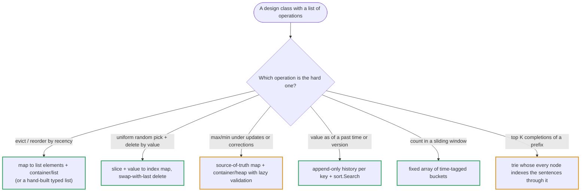
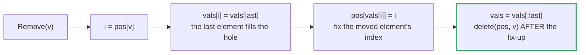

# Topic 25 · Design — Go Deep Dive

> "Design a data structure" problems don't test whether you know a new algorithm —
> they test whether you can compose the structures you already built in earlier
> topics behind a clean API. Go has no classes, no constructors, and no
> `private`/`protected` keywords, so "clean API" means something narrower and more
> mechanical here than it does in Python or Java. This document is about that
> narrower mechanism, not about re-deriving LRU caches from scratch again.

---

## Part 1 · Go's Answer to "Class Design"

### 1.1 A struct + methods with a receiver *is* the object

Go has no `class` keyword. An "object" is a `struct` type plus a set of
functions declared with a **receiver**:

```go
type LRUCache struct {
    capacity int
    cache    map[int]*node
    head, tail *node
}

func (c *LRUCache) Get(key int) int        { ... }
func (c *LRUCache) Put(key, value int)     { ... }
```

`(c *LRUCache)` is the receiver — syntactic sugar for passing `c` as the first
argument. There is no runtime dispatch table, no vtable lookup unless the type
also satisfies an `interface`; a method call on a concrete type is just a
regular function call resolved at compile time.

### 1.2 No constructors — LeetCode expects a `Constructor` function

Go has no `__init__`, no `new ClassName(...)`. The idiom — and specifically
what **LeetCode's Go problem templates literally require you to write** — is a
free function, conventionally named `Constructor`:

```go
func Constructor(capacity int) LRUCache {
    return LRUCache{
        capacity: capacity,
        cache:    make(map[int]*node),
        head:     &node{}, // sentinel
        tail:     &node{}, // sentinel
    }
}
```

If you've written Python (`def __init__(self, capacity): ...`) or Java
(`public LRUCache(int capacity)`), this is the one place where the LeetCode Go
harness's expectations are non-negotiable and worth knowing cold before the
interview, not discovering mid-problem: the driver code calls
`obj := Constructor(capacity)`, not `obj := LRUCache{capacity: capacity}`.

> ✅ Outside of LeetCode's fixed templates, prefer `func NewLRUCache(capacity int) *LRUCache`
> returning a **pointer** — see 1.3 for why the pointer matters, not just the name.

---

## Part 2 · The Value-Receiver Bug — This Bites Everyone Once

### 2.1 Same lesson as topic 1, one level up

Topic 1's Part 1.1 opened with: *"Arrays are values. This surprises everyone."*
The exact same value-vs-pointer distinction resurfaces here, at the struct
level, and it is the single most common bug in this topic.

```go
// ❌ BROKEN: value receiver
func (c LRUCache) Put(key, value int) {
    c.cache[key] = &node{key: key, val: value}   // mutates a MAP — this "works"
    c.capacity--                                  // mutates a COPY of capacity — silently lost
}
```

A `map` field mutates fine even through a value receiver, because the struct
copy still holds the *same* map header pointing at the *same* buckets — maps
are reference-like in this one sense. But any **non-reference field**
(`capacity int`, `size int`, a `head *node` pointer you reassign) is copied
along with the rest of the struct, and writes to it vanish the instant the
method returns. The caller's real `LRUCache` never sees the change.

```go
// ✅ CORRECT: pointer receiver
func (c *LRUCache) Put(key, value int) {
    c.capacity--   // mutates the ACTUAL struct the caller holds
}
```

> ⚠️ **Rule for this entire topic:** if a design-problem method mutates any
> struct field beyond a map/slice's contents, it *must* use a pointer receiver.
> Since nearly every design problem method mutates state (that's the whole
> point of a cache, a stack, a counter), reach for `*T` receivers by default
> and only use a value receiver for a genuinely read-only method with no
> mutable-field dependency.

### 2.2 Mixing receivers on the same type is legal — and a trap

Go permits mixing value and pointer receivers on one type, but it splits the type's *method set*: the method set of `C` (a value) contains only the
value-receiver methods, while `*C` has all of them. So with `func (c C) Get` and `func (c *C) Put`, this does not compile —
`cannot use C{…} as Cache value in variable declaration: C does not implement Cache (method Put has pointer receiver)` (measured, Go 1.24). Even when it
compiles, a value-receiver method runs on a **copy**: harmless for a pure read, but for anything that reorders (an LRU `Get` moves a node to the front) the write vanishes.
And if the struct holds a `sync.Mutex`, `go vet` rejects the value receiver outright: `Read passes lock by value: C contains sync.Mutex`. **Pick pointer receivers for every method on a
design-problem type, uniformly, and move on.**

---

## Part 3 · Encapsulation — Package, Not Class

Go has no `private`/`protected`/`public` keywords. The **only** privacy
mechanism is the case of the first letter, and its scope is **the package**,
not the type:

```go
type LRUCache struct {
    capacity int          // unexported — invisible outside this package
    Cache    map[int]*node // exported — visible anywhere, rarely what you want here
}
```

> ⚠️ "Unexported" does not mean "private to this struct." Any other type or
> function **in the same package** — including a totally unrelated type you
> define in the same file — can still reach `c.capacity` directly. This is a
> real difference from Java/C++, where `private` walls off access per-class,
> not per-package. For LeetCode-style single-file solutions this distinction
> rarely bites (everything's one package anyway), but it matters the moment
> you split a real project into multiple types that are meant to be mutually
> opaque — package boundaries, not type boundaries, are Go's actual privacy
> unit.

✅ **The practical habit for interviews:** lowercase every internal field by
default (`capacity`, `cache`, `head`, `tail`), exactly as you'd mark fields
`private` elsewhere — it costs nothing and signals intent even though Go
won't enforce it as tightly as you might expect.

---

## Part 4 · Composing What You've Already Built

Design problems are rarely new algorithms — they're compositions of topics 6,
8, 10, and 12. Recognizing the composition is 80% of the problem.

### 4.1 LRU Cache — hashmap + doubly linked list

Already built in full in **topic 8's "Building X From Scratch" section**
(`08_linked_list/_TOPIC_GUIDE.md`) — a hand-rolled doubly linked list with
`prev`/`next` struct fields plus a `map[int]*node` for O(1) lookup, most-recent
at one end, least-recent at the other. Nothing new here beyond wrapping it in
a `Constructor` per Part 1.2 above. **Go re-read that section rather than
re-deriving it** — the reasoning about why you need *both* the map (O(1)
lookup) and the list (O(1) reorder/evict) doesn't change.

### 4.2 LFU Cache — one level harder: buckets of LRU lists, keyed by frequency

LFU (Least Frequently Used) needs O(1) get/put too, but eviction must pick the
*least-frequently-used* key, breaking ties by *least-recently-used within that
frequency*. The standard structure is a hashmap of frequency → doubly-linked
list (each such list is itself LRU-ordered):

```
freqToList: map[int]*DList        keys := map[int]*node   minFreq int

  freq=1 ──► DList{ tail ⇄ [k3] ⇄ [k7] ⇄ head }   (k7 = most recently touched at freq 1)
  freq=3 ──► DList{ tail ⇄ [k1]        ⇄ head }
  freq=5 ──► DList{ tail ⇄ [k9] ⇄ [k2] ⇄ head }
```

```go
type lfuNode struct {
    key, val, freq   int
    prev, next       *lfuNode
}

type LFUCache struct {
    capacity, minFreq int
    keys              map[int]*lfuNode      // key -> node
    freqToList        map[int]*dlist        // freq -> doubly linked list of nodes at that freq
}

func (c *LFUCache) touch(n *lfuNode) {
    c.freqToList[n.freq].remove(n)
    if c.freqToList[n.freq].empty() && n.freq == c.minFreq {
        c.minFreq++                          // the bucket we just emptied WAS the floor
    }
    n.freq++
    if c.freqToList[n.freq] == nil {
        c.freqToList[n.freq] = newDList()
    }
    c.freqToList[n.freq].pushFront(n)
}
```

On eviction: pop the tail of `freqToList[c.minFreq]` — that's simultaneously
the least-frequent bucket *and* its least-recently-used member. On a fresh
insert, `minFreq` resets to 1. The full implementation — checked against an O(n) brute-force reference on 400 random operation sequences — is in Part 10.5. The moving
part worth internalizing is **`minFreq` as an O(1)-maintained floor**, updated only when a bucket you
just drained happens to be the current floor, never by scanning.

### 4.3 Min Stack — two stacks, or one stack of pairs

Cross-reference topic 6 (`06_stack/_TOPIC_GUIDE.md`) for the slice-as-stack
mechanics; the only new idea here is **carrying a second, parallel stack of
running minimums**:

```go
type MinStack struct {
    vals, mins []int
}

func (s *MinStack) Push(x int) {
    s.vals = append(s.vals, x)
    if len(s.mins) == 0 || x <= s.mins[len(s.mins)-1] {
        s.mins = append(s.mins, x)          // x is a new (or tied) minimum
    } else {
        s.mins = append(s.mins, s.mins[len(s.mins)-1])  // repeat the current min
    }
}

func (s *MinStack) Pop() {
    s.vals = s.vals[:len(s.vals)-1]
    s.mins = s.mins[:len(s.mins)-1]         // pop in lockstep — keeps both stacks aligned
}

func (s *MinStack) Top() int { return s.vals[len(s.vals)-1] }
func (s *MinStack) GetMin() int { return s.mins[len(s.mins)-1] }
```

`<=` (not `<`) in the push condition matters: it makes duplicate minimums
push correctly onto `mins` so that popping one instance of the minimum value
doesn't lose track of the other still-present instance.

---

## Part 5 · Iterators — No Built-in Interface (Before Go 1.23)

### 5.1 The gap

Python has `__iter__`/`__next__`; Java has `Iterator<T>`. Go, before 1.23, has
**no standard iterator interface** — `for range` works natively only on
arrays, slices, strings, maps, channels, and integers. A custom "Design an
Iterator" type (Flatten Nested List Iterator, BST Iterator) must expose its
own `HasNext() bool` / `Next() int` methods by convention, with no compiler-
or stdlib-enforced shape.

Two implementation strategies:

1. **Eager**: fully flatten the structure into a `[]int` up front in the
   constructor, then walk it with an index cursor. Simple, but pays the full
   O(n) traversal cost immediately even if the caller only calls `Next()`
   once.
2. **Lazy**: hold just enough state (typically a stack) to produce the next
   element on demand, paying the traversal cost incrementally, spread across
   calls.

The lazy version is the one worth knowing cold — see Part 7.

### 5.2 Go 1.23+: `iter.Seq` and range-over-func

If targeting a recent Go toolchain, `iter.Seq[V]` (a `func(yield func(V) bool)`)
lets a type support native `for x := range mySeq() { ... }` without any
hand-rolled `HasNext`/`Next` pair. This is a real language feature, not a
library convention — worth a one-line mention since LeetCode's Go harness
still expects the classic `HasNext`/`Next` shape, but production Go code
written today increasingly reaches for `iter.Seq` instead.

---

## Part 6 · Thread-Safety — An Explicit Non-Goal Here

Every structure in this guide is written assuming **single-goroutine access**,
which matches the LeetCode/interview framing (`Constructor` → sequential
`Get`/`Put` calls, no concurrency). A production cache used from multiple
goroutines would need a `sync.Mutex` (or `sync.RWMutex` for read-heavy
workloads) guarding every method:

```go
type LRUCache struct {
    mu    sync.Mutex
    // ...
}

func (c *LRUCache) Get(key int) int {
    c.mu.Lock()
    defer c.mu.Unlock()
    // ...
}
```

That's out of scope for the implementations here — but Part 11.3 measures what goes wrong without it and what the lock costs. Two details up front: an LRU `Get`
*mutates* (it moves a node to the front), so it needs `Lock`, not `RLock` — a read-write mutex only helps structures whose reads truly do not write; and with a lock in place the
measured overhead was small (57 ms against 52 ms for 2 million operations).

---

## Part 7 · Python vs. Go — Where They Diverge

| | Python | Go |
|---|---|---|
| "Object" | `class` with `__init__` | `struct` + methods with a receiver |
| Construction | `__init__` | Convention: a `Constructor`/`NewX` function |
| Mutating state | Any method mutates `self` freely | **Must use a pointer receiver**, or writes vanish |
| Encapsulation | `_name` / `__name` convention (weakly enforced) | Case of first letter, enforced **per package** |
| Built-in iterator protocol | `__iter__`/`__next__`, universal | None before Go 1.23's `iter.Seq`; hand-roll `HasNext`/`Next` |
| Ordered dict / LRU helper | `collections.OrderedDict` (stdlib, O(1) move-to-end) | No stdlib equivalent — hand-roll hashmap + linked list |
| Thread-safety | The GIL does *not* make check-then-act atomic: an unsynchronised `OrderedDict` LRU raised 288 `KeyError`s across 4 threads × 100,000 operations (Python guide) | Nothing is safe: concurrent map writes are a fatal, unrecoverable error — add `sync.Mutex` explicitly |

---

## Part 8 · Algorithms/Structures Owned by This Topic

| Structure | Get | Put/Push | Space | Problem |
|---|:--:|:--:|:--:|---|
| LRU Cache (map + DLL) | O(1) | O(1) | O(capacity) | LC 146 |
| LFU Cache (map + freq-bucketed DLLs) | O(1) | O(1) | O(capacity) | LC 460 |
| Min Stack (two stacks) | O(1) `GetMin` | O(1) `Push`/`Pop` | O(n) | LC 155 |
| BST Iterator (lazy left-spine stack) | O(1) amortized `Next` | — | O(h) | LC 173 |
| Flatten Nested List Iterator (eager) | O(1) `Next` | — | O(n) | LC 341 |

---

## Part 9 · Building BST Iterator From Scratch (LC 173)

The eager approach (flatten the whole tree via in-order traversal into a
`[]int`, then walk it) is O(n) space and O(n) upfront time — correct, but it
defeats the point of an "iterator" if the caller never asks for all n values.
The lazy version pays for only what's consumed:

```go
type BSTIterator struct {
    stack []*TreeNode   // holds the "unexplored left spine" at all times
}

func Constructor(root *TreeNode) BSTIterator {
    it := BSTIterator{}
    it.pushLeftSpine(root)
    return it
}

// pushLeftSpine walks left from node, pushing every node along the way.
// After this call, the top of the stack is always the next smallest
// unvisited value — that's the loop invariant the whole iterator relies on.
func (it *BSTIterator) pushLeftSpine(node *TreeNode) {
    for node != nil {
        it.stack = append(it.stack, node)
        node = node.Left
    }
}

func (it *BSTIterator) HasNext() bool {
    return len(it.stack) > 0
}

func (it *BSTIterator) Next() int {
    n := len(it.stack) - 1
    node := it.stack[n]
    it.stack = it.stack[:n]           // pop — see topic 6 for why this is O(1) amortized

    // The next-smallest value after `node` lives somewhere in its right
    // subtree's left spine (or nowhere, if node.Right is nil — then the
    // stack's new top, an ancestor we haven't returned to yet, is next).
    if node.Right != nil {
        it.pushLeftSpine(node.Right)
    }
    return node.Val
}
```

**Why this is O(1) amortized per `Next()` call, not O(h):** a single call to
`Next()` can push up to h nodes (a full left spine), which looks like O(h)
worst case per call. But across the iterator's *entire lifetime*, every node
in the tree is pushed exactly once and popped exactly once — the same
aggregate-analysis argument from topic 6's monotonic-stack section
(`06_stack/_TOPIC_GUIDE.md`, Part 3: "each element pushed and popped at most
once"). Total work over n calls is O(n), so the amortized cost per call is
O(1), even though any *individual* call can spike to O(h).

```go
// talk track: "the stack never holds more than h nodes at once — that's
// the O(h) space bound — but summed across all Next() calls, total pushes
// equal n, so amortized time per call is O(1)."
```

---

<!-- block:25_go_1_problems -->
## Part 10 · The Thirteen Problems in Go — Complete, Tested, and Where Go Bites

Everything above is the *mechanism*; this Part is the *content*. The Go solution files for this topic are still placeholders, so here is a complete implementation of every problem, each compared with a
brute-force reference on random operation sequences (hundreds of sequences per class; the counts are given per section) and compiled with `go vet`. Names use `NewX` for clarity — LeetCode's Go templates
want `func Constructor(…) X` returning the struct by value, with the same pointer-receiver methods (Part 1.2).



### 10.1 Hash set and hash map (001, 002) — the bucket count, and Go's negative `%`

```go
const nBuckets = 1009 // prime

func bucketOf(key, n int) int { return ((key % n) + n) % n } // Go's % keeps the dividend's sign: -5 % 1009 == -5

type MyHashSet struct{ buckets [][]int }

func NewHashSet() *MyHashSet { return &MyHashSet{make([][]int, nBuckets)} }
func (s *MyHashSet) Add(key int) {
    i := bucketOf(key, nBuckets)
    if !slices.Contains(s.buckets[i], key) {
        s.buckets[i] = append(s.buckets[i], key)
    }
}
func (s *MyHashSet) Remove(key int) {
    i := bucketOf(key, nBuckets)
    if j := slices.Index(s.buckets[i], key); j >= 0 {
        last := len(s.buckets[i]) - 1
        s.buckets[i][j] = s.buckets[i][last] // swap-remove inside the chain
        s.buckets[i] = s.buckets[i][:last]
    }
}
func (s *MyHashSet) Contains(key int) bool { return slices.Contains(s.buckets[bucketOf(key, nBuckets)], key) }

type entry struct{ key, val int }
type MyHashMap struct{ buckets [][]entry }

func NewHashMap() *MyHashMap { return &MyHashMap{make([][]entry, nBuckets)} }
func (m *MyHashMap) Put(key, val int) {
    i := bucketOf(key, nBuckets)
    for j := range m.buckets[i] {
        if m.buckets[i][j].key == key {
            m.buckets[i][j].val = val
            return
        }
    }
    m.buckets[i] = append(m.buckets[i], entry{key, val})
}
func (m *MyHashMap) Get(key int) int {
    for _, e := range m.buckets[bucketOf(key, nBuckets)] {
        if e.key == key {
            return e.val
        }
    }
    return -1
}
func (m *MyHashMap) Remove(key int) {
    i := bucketOf(key, nBuckets)
    for j, e := range m.buckets[i] {
        if e.key == key {
            last := len(m.buckets[i]) - 1
            m.buckets[i][j] = m.buckets[i][last]
            m.buckets[i] = m.buckets[i][:last]
            return
        }
    }
}
```

Two things decide correctness here. First, the **bucket count**: with 1,000 keys that are multiples of 1,000, a table of 1,000 buckets had a longest chain of **1,000** (every key in one bucket) and a table of 1,009 (prime)
had a longest chain of **1** — the same for multiples of 1,024 and 1,024 buckets. Second, **Go's `%` keeps the dividend's sign**: `-5 % 1009` is `-5`, an invalid slice index, hence `bucketOf`'s `((key % n) + n) % n` (it gives `1004`).
LeetCode's keys are non-negative, but a hash function that panics on negative input is a bug waiting to be found. The classes matched Go's own `map` on 300 random sequences of adds, puts, removes and lookups over keys in `[-1000, 2000)`.
Real tables grow: doubling when the load passes 0.75 costs 1,572,876 element moves over 10⁶ inserts (1.57 per insert) — amortised O(1).

### 10.2 Logger, Browser History, Hit Counter, Snapshot Array (003, 006, 011, 012)

```go
type Logger struct{ next map[string]int }

func NewLogger() *Logger { return &Logger{map[string]int{}} }
func (l *Logger) ShouldPrint(ts int, msg string) bool {
    if t, ok := l.next[msg]; ok && ts < t {
        return false
    }
    l.next[msg] = ts + 10 // store the NEXT allowed time, not the last-used time
    return true
}

type BrowserHistory struct {
    pages []string
    cur   int
}

func NewBrowserHistory(home string) *BrowserHistory { return &BrowserHistory{pages: []string{home}} }
func (b *BrowserHistory) Visit(url string) {
    b.pages = append(b.pages[:b.cur+1], url) // truncate the forward history, then append
    b.cur++
}
func (b *BrowserHistory) Back(steps int) string {
    b.cur = max(0, b.cur-steps)
    return b.pages[b.cur]
}
func (b *BrowserHistory) Forward(steps int) string {
    b.cur = min(len(b.pages)-1, b.cur+steps)
    return b.pages[b.cur]
}

type HitCounter struct{ b [300]struct{ ts, n int } }

func (h *HitCounter) Hit(ts int) {
    i := ts % 300
    if h.b[i].ts != ts { // the slot still holds an older second: recycle it
        h.b[i].ts, h.b[i].n = ts, 0
    }
    h.b[i].n++
}
func (h *HitCounter) GetHits(ts int) int {
    total := 0
    for _, s := range h.b {
        if ts-s.ts < 300 { // (ts-300, ts]
            total += s.n
        }
    }
    return total
}

type version struct{ snap, val int }
type SnapshotArray struct {
    hist [][]version
    id   int
}

func NewSnapshotArray(n int) *SnapshotArray { return &SnapshotArray{hist: make([][]version, n)} }
func (s *SnapshotArray) Set(i, v int) {
    h := s.hist[i]
    if len(h) > 0 && h[len(h)-1].snap == s.id {
        h[len(h)-1].val = v // same snapshot epoch: overwrite
        return
    }
    s.hist[i] = append(h, version{s.id, v})
}
func (s *SnapshotArray) Snap() int { s.id++; return s.id - 1 }
func (s *SnapshotArray) Get(i, snapID int) int {
    h := s.hist[i]
    k := sort.Search(len(h), func(j int) bool { return h[j].snap > snapID }) // first version AFTER snapID
    if k == 0 {
        return 0
    }
    return h[k-1].val
}
```

- **Logger:** store the *next allowed* time, and `ts < t` (not `<=`) suppresses — exactly `t + 10` must be allowed. (It reproduced the LeetCode example: `true true false false false true`.)
- **Browser History:** `append(b.pages[:b.cur+1], url)` truncates the forward history and appends in one expression — the classic Go idiom. It reproduced the LeetCode trace
  (`facebook.com google.com facebook.com linkedin.com google.com leetcode.com`). Slicing off the tail does not release the strings it held; `clear(b.pages[b.cur+1:])` before truncating drops those references if the history is long-lived.
- **Hit Counter:** the slot's stored second must be compared on **read** (`ts-s.ts < 300`), or last cycle's count leaks into this one. A zero-valued slot has `ts == 0, n == 0`, so it contributes nothing even at `ts = 0`. Checked on 300 random hit/query sequences.
- **Snapshot Array:** `sort.Search` returns the first version *after* `snapID`, so the answer is at `k-1`, and `k == 0` means "never set" (`0`). Setting twice within one snapshot overwrites instead of appending. Checked against a copy-on-snap reference on 300 random sequences.



### 10.3 Design Linked List and RandomizedSet (004, 005)

```go
type dnode struct {
    val        int
    prev, next *dnode
}
type MyLinkedList struct {
    head, tail *dnode
    size       int
}

func NewLinkedList() *MyLinkedList {
    h, t := &dnode{}, &dnode{}
    h.next, t.prev = t, h
    return &MyLinkedList{head: h, tail: t}
}
func (l *MyLinkedList) nodeAt(i int) *dnode { // i in [0, size]; size returns the tail sentinel
    if i < l.size-i {
        n := l.head.next
        for ; i > 0; i-- {
            n = n.next
        }
        return n
    }
    n := l.tail
    for k := l.size - i; k > 0; k-- {
        n = n.prev
    }
    return n
}
func (l *MyLinkedList) Get(i int) int {
    if i < 0 || i >= l.size {
        return -1
    }
    return l.nodeAt(i).val
}
func (l *MyLinkedList) AddAtHead(v int) { l.AddAtIndex(0, v) }
func (l *MyLinkedList) AddAtTail(v int) { l.AddAtIndex(l.size, v) }
func (l *MyLinkedList) AddAtIndex(i, v int) {
    if i > l.size {
        return
    }
    i = max(i, 0)
    at := l.nodeAt(i)
    n := &dnode{val: v, prev: at.prev, next: at}
    at.prev.next, at.prev = n, n
    l.size++
}
func (l *MyLinkedList) DeleteAtIndex(i int) {
    if i < 0 || i >= l.size {
        return
    }
    n := l.nodeAt(i)
    n.prev.next, n.next.prev = n.next, n.prev
    l.size--
}
```

The two sentinels (`head` and `tail`) remove every empty-list branch, and `nodeAt` walks from whichever end is closer. `AddAtIndex(i, v)` with `i == size` inserts before the tail sentinel, so `nodeAt` must accept `size` (it returns the tail); it must *not* be called for `Get`, which
rejects `i >= size`. The three boundary cases — `i < 0` inserts at the head, `i == size` appends, `i > size` does nothing — matched a slice-based reference over 500 random sequences.

```go
type RandomizedSet struct {
    vals []int
    pos  map[int]int
}

func NewRandomizedSet() *RandomizedSet { return &RandomizedSet{pos: map[int]int{}} }
func (s *RandomizedSet) Insert(v int) bool {
    if _, ok := s.pos[v]; ok {
        return false
    }
    s.pos[v] = len(s.vals)
    s.vals = append(s.vals, v)
    return true
}
func (s *RandomizedSet) Remove(v int) bool {
    i, ok := s.pos[v]
    if !ok {
        return false
    }
    last := len(s.vals) - 1
    s.vals[i] = s.vals[last] // the last element fills the hole
    s.pos[s.vals[i]] = i     // ...and its index must be updated — the classic missed line
    s.vals = s.vals[:last]
    delete(s.pos, v) // delete AFTER the fix-up: if v was the last element, the fix-up wrote pos[v] again
    return true
}
func (s *RandomizedSet) GetRandom() int { return s.vals[rand.Intn(len(s.vals))] }
```

The order inside `Remove` is the whole problem: read `i`, move the last element into slot `i`, **update the moved element's index**, shrink the slice, and only then delete `v` from the map — when `v` *is* the last element, the fix-up writes `pos[v]` again, so deleting first
would resurrect it. A version that forgot the index fix-up was caught by a differential test in **469 of 500** random 40-operation sequences (393 of those as an `index out of range` panic a few operations after the faulty line). `GetRandom` over `{1, 3, 4, 5}` for 100,000 draws
gave 24,930, 25,137, 24,857 and 25,076 — uniform, because the slice is always dense.

### 10.4 Snake Game (007)

```go
type SnakeGame struct {
    w, h  int
    food  [][2]int
    fi    int
    body  [][2]int // body[0] is the tail, body[len-1] is the head
    occ   map[[2]int]bool
    score int
}

func NewSnake(w, h int, food [][]int) *SnakeGame {
    f := make([][2]int, len(food))
    for i, p := range food {
        f[i] = [2]int{p[0], p[1]}
    }
    return &SnakeGame{w: w, h: h, food: f, body: [][2]int{{0, 0}}, occ: map[[2]int]bool{{0, 0}: true}}
}

var deltas = map[byte][2]int{'U': {-1, 0}, 'D': {1, 0}, 'L': {0, -1}, 'R': {0, 1}}

func (g *SnakeGame) Move(dir byte) int {
    head := g.body[len(g.body)-1]
    d := deltas[dir]
    nh := [2]int{head[0] + d[0], head[1] + d[1]}
    if nh[0] < 0 || nh[0] >= g.h || nh[1] < 0 || nh[1] >= g.w {
        return -1
    }
    if g.fi < len(g.food) && g.food[g.fi] == nh {
        g.fi++
        g.score++ // eating: the tail stays, so the snake grows
    } else {
        tail := g.body[0] // the tail leaves BEFORE the collision test: moving into the vacated tail cell is legal
        g.body = g.body[1:]
        delete(g.occ, tail)
    }
    if g.occ[nh] {
        return -1
    }
    g.body = append(g.body, nh)
    g.occ[nh] = true
    return g.score
}
```

The tail leaves the slice and the occupancy set **before** the collision test, unless food was just eaten (then the tail stays and the snake grows) — moving into the cell your own tail is vacating this turn is legal. The class matched a brute-force simulation (a full body slice, testing
`slices.Contains`) over 3,000 random games; a variant that tested collision *before* freeing the tail disagreed in **160 of 3,000** (games on boards up to 4 × 4). The LeetCode trace `R D R U L U` returns `0 0 1 1 2 -1`. A `[2]int` is comparable, so it is a valid map key and `food[fi] == nh` needs no helper.

### 10.5 LRU and LFU (LC 146, 008)

```go
type lruEntry struct{ key, val int }
type LRUCache struct {
    cap int
    ll  *list.List
    m   map[int]*list.Element
}

func NewLRU(cap int) *LRUCache { return &LRUCache{cap, list.New(), map[int]*list.Element{}} }
func (c *LRUCache) Get(k int) int {
    if el, ok := c.m[k]; ok {
        c.ll.MoveToFront(el)
        return el.Value.(*lruEntry).val
    }
    return -1
}
func (c *LRUCache) Put(k, v int) {
    if el, ok := c.m[k]; ok {
        el.Value.(*lruEntry).val = v
        c.ll.MoveToFront(el)
        return
    }
    if c.ll.Len() == c.cap {
        back := c.ll.Back()
        delete(c.m, back.Value.(*lruEntry).key)
        c.ll.Remove(back)
    }
    c.m[k] = c.ll.PushFront(&lruEntry{k, v})
}

type lfuEntry struct{ key, val, freq int }
type LFUCache struct {
    cap, minFreq int
    keys         map[int]*list.Element
    freqs        map[int]*list.List // freq -> entries, most recent at the front
}

func NewLFU(cap int) *LFUCache {
    return &LFUCache{cap: cap, keys: map[int]*list.Element{}, freqs: map[int]*list.List{}}
}
func (c *LFUCache) touch(el *list.Element) {
    e := el.Value.(*lfuEntry)
    l := c.freqs[e.freq]
    l.Remove(el)
    if l.Len() == 0 {
        delete(c.freqs, e.freq) // do not leave empty buckets behind
        if c.minFreq == e.freq {
            c.minFreq++ // the bucket we just emptied WAS the floor
        }
    }
    e.freq++
    if c.freqs[e.freq] == nil {
        c.freqs[e.freq] = list.New()
    }
    c.keys[e.key] = c.freqs[e.freq].PushFront(e)
}
func (c *LFUCache) Get(k int) int {
    el, ok := c.keys[k]
    if !ok {
        return -1
    }
    v := el.Value.(*lfuEntry).val
    c.touch(el)
    return v
}
func (c *LFUCache) Put(k, v int) {
    if c.cap == 0 {
        return
    }
    if el, ok := c.keys[k]; ok {
        el.Value.(*lfuEntry).val = v
        c.touch(el)
        return
    }
    if len(c.keys) == c.cap {
        l := c.freqs[c.minFreq]
        victim := l.Back() // least frequent, and least recent within that frequency
        l.Remove(victim)
        if l.Len() == 0 {
            delete(c.freqs, c.minFreq)
        }
        delete(c.keys, victim.Value.(*lfuEntry).key)
    }
    c.minFreq = 1 // a brand-new key always starts at frequency 1
    if c.freqs[1] == nil {
        c.freqs[1] = list.New()
    }
    c.keys[k] = c.freqs[1].PushFront(&lfuEntry{k, v, 1})
}
```

`container/list` is Go's stdlib doubly linked list — the answer to "Go has no `OrderedDict`". `MoveToFront`, `PushFront`, `Back` and `Remove` are all O(1). Checked on 400 random sequences each against an order-list reference (LRU) and an O(n) scan reference that evicts by `(frequency, last use)` (LFU, including capacity 0).
The LFU details are exactly the documented traps: `Put` on an existing key must also count as a use; `minFreq` advances only when the bucket you just emptied *was* the floor; a brand-new key resets it to 1; and empty buckets are deleted from the map so they do not accumulate.
In a two-million-operation benchmark (capacity 1,000, 2,000 distinct keys) `container/list` took 59 ms and a hand-built typed list 52 ms — the boxing cost is small; use the standard list unless the interviewer asks for the list by hand.

### 10.6 In-Memory File System and Autocomplete (009, 010)

```go
type fsNode struct {
    children map[string]*fsNode
    isFile   bool
    content  strings.Builder
}
type FileSystem struct{ root *fsNode }

func NewFileSystem() *FileSystem { return &FileSystem{&fsNode{children: map[string]*fsNode{}}} }
func parts(path string) []string {
    p := strings.Trim(path, "/")
    if p == "" {
        return nil
    }
    return strings.Split(p, "/")
}
func (f *FileSystem) walk(path string, create bool) *fsNode { // one helper for every operation
    n := f.root
    for _, name := range parts(path) {
        next, ok := n.children[name]
        if !ok {
            if !create {
                return nil
            }
            next = &fsNode{children: map[string]*fsNode{}}
            n.children[name] = next
        }
        n = next
    }
    return n
}
func (f *FileSystem) Ls(path string) []string {
    n := f.walk(path, false)
    if n == nil {
        return nil
    }
    if n.isFile {
        p := parts(path)
        return []string{p[len(p)-1]}
    }
    names := make([]string, 0, len(n.children))
    for name := range n.children {
        names = append(names, name)
    }
    sort.Strings(names) // map order is random: the sort is mandatory
    return names
}
func (f *FileSystem) Mkdir(path string) { f.walk(path, true) }
func (f *FileSystem) AddContentToFile(path, content string) {
    n := f.walk(path, true)
    n.isFile = true
    n.content.WriteString(content)
}
func (f *FileSystem) ReadContentFromFile(path string) string { return f.walk(path, false).content.String() }
```

One `walk(path, create)` serves every operation. Three Go details: `strings.Trim(path, "/")` plus an empty check handles `"/"` (a plain `Split` yields empty segments); **map iteration order is random, so `Ls` must sort** — an unsorted result is non-deterministic, not merely unordered; and a
`strings.Builder` per file makes repeated `AddContentToFile` appends amortised O(1) instead of re-copying the whole string. It reproduced the LeetCode trace (`[]`, `[a]`, `hello`, `[d]`, and after `mkdir` and another file `[c m z]`).

```go
type trieNode struct {
    children map[byte]*trieNode
    hot      map[string]int // every sentence passing through this prefix -> its hot degree
}
type AutocompleteSystem struct {
    root *trieNode
    cur  *trieNode
    buf  []byte
    dead bool
}

func newTrie() *trieNode { return &trieNode{children: map[byte]*trieNode{}, hot: map[string]int{}} }
func NewAutocomplete(sentences []string, times []int) *AutocompleteSystem {
    a := &AutocompleteSystem{root: newTrie()}
    a.cur = a.root
    for i, s := range sentences {
        a.add(s, times[i])
    }
    return a
}
func (a *AutocompleteSystem) add(s string, times int) {
    n := a.root
    for i := 0; i < len(s); i++ {
        nx, ok := n.children[s[i]]
        if !ok {
            nx = newTrie()
            n.children[s[i]] = nx
        }
        n = nx
        n.hot[s] += times // duplicated at every prefix node: space traded for query time
    }
}
func (a *AutocompleteSystem) Input(c byte) []string {
    if c == '#' {
        a.add(string(a.buf), 1)
        a.buf, a.cur, a.dead = a.buf[:0], a.root, false
        return nil
    }
    a.buf = append(a.buf, c)
    if a.dead || a.cur == nil {
        a.dead = true
        return nil
    }
    nx, ok := a.cur.children[c]
    if !ok {
        a.dead = true // no sentence has this prefix; stay dead until '#'
        return nil
    }
    a.cur = nx
    type cand struct {
        s   string
        hot int
    }
    cands := make([]cand, 0, len(nx.hot))
    for s, h := range nx.hot {
        cands = append(cands, cand{s, h})
    }
    slices.SortFunc(cands, func(x, y cand) int {
        if x.hot != y.hot {
            return y.hot - x.hot // hot degree descending
        }
        return strings.Compare(x.s, y.s) // then ASCII ascending
    })
    out := []string{}
    for i := 0; i < len(cands) && i < 3; i++ {
        out = append(out, cands[i].s)
    }
    return out
}
```

Each trie node stores a `sentence → hot` map for *every sentence that passes through it* — the space-for-time trade from Part 0. State lives across calls (`buf`, `cur`, `dead`): once a prefix has no match, the system stays dead until `'#'`, rather than restarting from the root. The ordering is `(-hot, sentence)`:
hot degree descending, ASCII ascending — the tie between `"iroman"` and `"i love leetcode"` in the LeetCode example is what tests it. On `'#'` the sentence is saved *before* the state resets. It matched a brute-force scan (filter every historical sentence by prefix, sort) on 300 random typing sessions. For very large
node maps, selecting the top 3 with a size-3 heap avoids sorting every candidate.

### 10.7 Stock Price Fluctuation (013)

```go
type sp struct{ price, ts int }
type spHeap struct {
    items []sp
    less  func(a, b sp) bool
}

func (h spHeap) Len() int           { return len(h.items) }
func (h spHeap) Less(i, j int) bool { return h.less(h.items[i], h.items[j]) }
func (h spHeap) Swap(i, j int)      { h.items[i], h.items[j] = h.items[j], h.items[i] }
func (h *spHeap) Push(x any)        { h.items = append(h.items, x.(sp)) }
func (h *spHeap) Pop() any {
    old := h.items
    n := len(old)
    x := old[n-1]
    h.items = old[:n-1]
    return x
}

type StockPrice struct {
    prices map[int]int
    latest int
    maxH   *spHeap
    minH   *spHeap
}

func NewStockPrice() *StockPrice {
    return &StockPrice{prices: map[int]int{}, maxH: &spHeap{less: func(a, b sp) bool { return a.price > b.price }}, minH: &spHeap{less: func(a, b sp) bool { return a.price < b.price }}}
}
func (s *StockPrice) Update(ts, price int) {
    s.prices[ts] = price // the map is the source of truth; the heaps may hold stale entries
    s.latest = max(s.latest, ts)
    heap.Push(s.maxH, sp{price, ts})
    heap.Push(s.minH, sp{price, ts})
}
func (s *StockPrice) Current() int { return s.prices[s.latest] }
func (s *StockPrice) top(h *spHeap) int {
    for s.prices[h.items[0].ts] != h.items[0].price { // stale: the record was corrected since
        heap.Pop(h)
    }
    return h.items[0].price
}
func (s *StockPrice) Maximum() int { return s.top(s.maxH) }
func (s *StockPrice) Minimum() int { return s.top(s.minH) }
```

`container/heap` needs a type implementing `heap.Interface`; a small struct that carries its own `less` function serves both the max and the min heap. The map is the source of truth; `top` pops entries whose price no longer matches it. `Current` uses the largest *timestamp*, not the last update call. It matched a
brute-force scan of the map on 300 random sequences of 80 updates with heavy timestamp collisions.

---
<!-- /block:25_go_1_problems -->

<!-- block:25_go_2_facts -->
## Part 11 · Go Design Facts, Measured — Receivers, Locks, Data Races, Iterators, and Testing

### 11.1 The value-receiver bug, run

```go
type Counter struct { n int; m map[string]int }
func (c Counter) BadInc()   { c.n++; c.m["x"]++ }
func (c *Counter) GoodInc() { c.n++; c.m["x"]++ }
```

After one `BadInc` on `Counter{m: map[string]int{}}`: `n` is `0` but `m["x"]` is `1` — the map header was copied, the map itself was shared, the integer was not. After one `GoodInc`: `n = 1`, `m["x"] = 2`. That asymmetry is
why the bug survives casual testing: half of the state still changes.

### 11.2 `container/list`, generics, and `iter.Seq2`

`container/list` stores `any`, so every element is boxed and every access needs a type assertion (`el.Value.(*entry)`). For an LRU that cost was measurable but small: 59 ms against 52 ms for the same 2,000,000 operations on a hand-built typed list.
Since Go 1.23 a structure can expose iteration as a range-over-func — no `HasNext`/`Next` pair:

```go
func (c *LRU2) All() iter.Seq2[int, int] { // most recent first
    return func(yield func(int, int) bool) {
        for n := c.head.next; n != c.tail; n = n.next {
            if !yield(n.k, n.v) { return } // stop when the loop body breaks
        }
    }
}
// after Put(1..5) into a capacity-3 cache:  for k, v := range c.All() { … }  →  5:50  4:40  3:30
```

`yield` returning `false` is how `break` reaches the iterator; ignoring it is a bug that keeps calling `yield` after the loop has exited.

### 11.3 Concurrency: what happens without the lock, and what the lock costs

Every class in this topic is single-goroutine. Unsynchronised, a `map` shared by goroutines is not merely racy — it is **fatal**. Four goroutines each writing a million times to one map crashed the program:

```text
fatal error: concurrent map writes
```

That is a runtime `fatal error`, not a panic, so `recover()` cannot catch it. `go run -race` reports the same program as `WARNING: DATA RACE` with both stacks. The fix is one `sync.Mutex` per structure, taken in every method:

```go
type SafeLRU struct { mu sync.Mutex; c *LRU2 }
func (s *SafeLRU) Get(k int) int { s.mu.Lock(); defer s.mu.Unlock(); return s.c.Get(k) }
```

An LRU `Get` **writes** (it moves the node), so it takes `Lock`, never `RLock`. Uncontended, the wrapper cost almost nothing: 57 ms against 52 ms for 2,000,000 operations. For a cache with many readers and few writers, shard the keys across several locked caches rather than
reaching for a read-write lock that cannot help. A struct holding a `sync.Mutex` must never be copied (`go vet` reports `passes lock by value`), which is one more reason for pointer receivers.

### 11.4 Testing a design class: differential testing in Go

Design bugs are ordering bugs; hand-picked examples miss them. Drive the class and a slow, obviously-correct reference with the same random operations and compare after **each** call, with a small key space so collisions and removals of the last slot are common:

```go
for t := 0; t < 500; t++ {
    s, ref := NewRandomizedSet(), map[int]bool{}
    for i := 0; i < 40; i++ {
        v := r.Intn(8)
        if r.Intn(2) == 0 {
            if s.Insert(v) == ref[v] { t.Fatal("insert") }
            ref[v] = true
        } else {
            if s.Remove(v) != ref[v] { t.Fatal("remove") }
            delete(ref, v)
        }
    }
}
```

(In a real test use `*testing.T`; the loop shape is the point.) This is how every class in Part 10 was checked. When the code under test can panic on a corrupted state — as the RandomizedSet with the missing index fix-up does — wrap each sequence in a `func() { defer recover… }()` so the panic counts as a detection.

### 11.5 Follow-ups the interviewer reaches for

| Follow-up | The answer |
|---|---|
| "Make it goroutine-safe." | One `sync.Mutex` per structure, `defer Unlock`; `Lock` even for `Get` on an LRU. |
| "Why pointer receivers?" | A value receiver mutates a copy; only maps and slices' *contents* survive. Mixed receivers also split the method set. |
| "No `OrderedDict` in Go?" | `container/list` + a `map[K]*list.Element`, or a hand-built typed list. |
| "Why is `Ls` non-deterministic?" | Map iteration order is random — collect the keys and sort. |
| "Negative keys in your hash?" | `((k % n) + n) % n` — Go's `%` keeps the dividend's sign. |
| "Range over your structure?" | `iter.Seq` / `iter.Seq2` (Go 1.23+); honour `yield`'s return value. |

---
<!-- /block:25_go_2_facts -->

<!-- problem-map:start -->
## Part 12 · Every Problem in This Topic, by Pattern

Thirteen problems, one move: pair a source of truth with the index each operation needs, and keep both in sync on every mutation — the Python guide's map in Go. Each **Trap** is a mistake documented in that problem's solution file, plus Go-specific hazards. Topic 25's Go solutions are still placeholders; Part 10 has a complete, tested implementation of each.

| Problem | Move | The idea — and the trap it sets |
|---|---|---|
| [001 · Design HashSet](GoDSA/25_design/001_design_hashset/solution.go) <br>LC 705 · Easy | Bucket array with chaining | `((key % n) + n) % n` picks a bucket; scan the short chain; `Add` checks for the key first. **Trap:** one bucket; a round bucket count with structured keys (chain of 1,000 — measured); appending a duplicate; Go's negative `%` producing a negative index. |
| [002 · Design HashMap](GoDSA/25_design/002_design_hashmap/solution.go) <br>LC 706 · Easy | The same, storing pairs | Buckets hold `entry{key, val}`; `Put` overwrites in place. **Trap:** a second pair for an existing key; `0` as the not-found sentinel (use `-1`); a ghost entry after `Remove`; ranging by value and mutating the copy. |
| [003 · Logger Rate Limiter](GoDSA/25_design/003_logger_rate_limiter/solution.go) <br>LC 359 · Easy | Store the next allowed time | `if t, ok := next[msg]; ok && ts < t { return false }; next[msg] = ts + 10`. **Trap:** `<=` on the suppress test; a separate first-seen branch that forgets the write; assuming unique timestamps; evicting entries nobody asked about. |
| [004 · Design Linked List](GoDSA/25_design/004_design_linked_list/solution.go) <br>LC 707 · Medium | Sentinels, walk from the nearer end | Dummy head and tail; `nodeAt(i)` for `i` in `[0, size]`; `Get` rejects `i >= size`. **Trap:** the three `AddAtIndex` boundaries; a stale `size`; always walking from the head; special-casing an empty list; calling `nodeAt` past the tail. |
| [005 · Insert Delete GetRandom O(1)](GoDSA/25_design/005_insert_delete_getrandom_o1/solution.go) <br>LC 380 · Medium | Slice + value→index map, swap-pop | Move the last element into the hole, update its index, shrink, then `delete(pos, v)`. **Trap:** deleting a middle element by shifting (O(n)); not updating the moved index (a panic or a wrong answer a few operations later — caught in 469 of 500 random sequences); deleting `v` before the fix-up; tombstones. |
| [006 · Design Browser History](GoDSA/25_design/006_design_browser_history/solution.go) <br>LC 1472 · Medium | Slice + cursor | `append(pages[:cur+1], url)`; `back`/`forward` clamp with `max`/`min`. **Trap:** appending without truncating; truncating at `cur` instead of `cur+1`; not clamping (Go panics on a negative index); a linked list out of habit; forgetting the homepage is entry 0. |
| [007 · Design Snake Game](GoDSA/25_design/007_design_snake_game/solution.go) <br>LC 353 · Medium | Slice + set, tail leaves first | Free the tail from both before the collision test, unless food was eaten. **Trap:** testing collision first (wrong in 160 of 3,000 random games); a set with no order; `food[fi]` past the end; mutating before the bounds check. |
| [008 · LFU Cache](GoDSA/25_design/008_lfu_cache/solution.go) <br>LC 460 · Hard | A list per frequency + `minFreq` | `touch` moves an entry to `freq+1`; `minFreq++` only if the emptied bucket was the floor; a new key resets it to 1; delete empty buckets. **Trap:** `Put` on an existing key not counting as a use; advancing `minFreq` on any empty bucket; capacity 0; a slice instead of a list per bucket. |
| [009 · Design In-Memory File System](GoDSA/25_design/009_design_in_memory_file_system/solution.go) <br>LC 588 · Hard | A tree of named children | One `walk(path, create)`; an explicit `isFile`; sort `Ls`. **Trap:** empty segments from `Split("/a/b", "/")`; `Ls` of a file returning nothing; overwriting instead of appending; the wrong parent for a top-level file; unsorted `Ls` (map order is random). |
| [010 · Design Search Autocomplete System](GoDSA/25_design/010_design_search_autocomplete_system/solution.go) <br>LC 642 · Hard | Trie with a per-node ranking index | Every node on a sentence's path stores `sentence → hot`; persistent `buf`/`cur`/`dead`; rank by `(-hot, sentence)`. **Trap:** stateless `Input`; resurrecting matches after a dead prefix; no lexicographic tiebreak; resetting before saving on `'#'`; recording hot only at the terminal node. |
| [011 · Design Hit Counter](GoDSA/25_design/011_design_hit_counter/solution.go) <br>LC 362 · Medium | A ring of 300 time-tagged buckets | Slot `ts % 300` holds `(second, count)`; recycle on mismatch; read slots with `ts - s.ts < 300`. **Trap:** `<= 300` (off by one); not checking the slot's second on read; clearing all 300 per call; ignoring the high-rate follow-up. |
| [012 · Snapshot Array](GoDSA/25_design/012_snapshot_array/solution.go) <br>LC 1146 · Medium | Per-index history + `sort.Search` | Append `version{snap, val}` (overwrite within a snap); `get` takes `k-1` where `k` is the first version after `snapID`. **Trap:** copying the array per snap; landing on the first value of a snap; writing under the previous snap id; `h[len(h)-1]` on an untouched index. |
| [013 · Stock Price Fluctuation](GoDSA/25_design/013_stock_price_fluctuation/solution.go) <br>LC 2034 · Medium | Source-of-truth map + two lazy heaps | Update the map, push to both `container/heap`s; `top` pops entries whose price no longer matches. **Trap:** heaps without validation; `Current` from the last call instead of the largest timestamp; a validity check on price alone; removing from the middle of the heap (O(n)). |

---
<!-- problem-map:end -->

## Checklist Before Leaving This Topic

- [ ] Write a `Constructor` function, not a struct literal, for LeetCode-style problems
- [ ] Default to pointer receivers on every mutating method — explain why a value receiver silently drops writes
- [ ] State Go's privacy rule correctly: case-based, scoped to the **package**, not the type
- [ ] Recognize LRU Cache as "see topic 8" rather than re-deriving it
- [ ] Explain the `minFreq`-as-floor trick in LFU Cache without scanning
- [ ] Implement Min Stack with the two-stacks (or paired-min) approach, `<=` not `<`
- [ ] Explain why Go has no built-in iterator protocol before 1.23, and what fills the gap
- [ ] Implement BST Iterator with a lazy left-spine stack and justify the O(1) amortized bound
- [ ] State plainly that none of this is goroutine-safe without an added `sync.Mutex`
- [ ] Choose a prime bucket count, normalise a negative key (`((k % n) + n) % n`), and reproduce the 1,000-key chain with a round count <!--ca-->
- [ ] Order `RandomizedSet.Remove` correctly: fix up the moved index, shrink, then delete — and explain what breaks if you delete first <!--ca-->
- [ ] Free the snake's tail from the slice and the set before testing collision, unless it just ate <!--ca-->
- [ ] Build LRU with `container/list` + `map[K]*list.Element`, and LFU with a list per frequency and a floor `minFreq` <!--ca-->
- [ ] Sort `Ls` output because map iteration order is random <!--ca-->
- [ ] Use `container/heap` with lazy validation for a max/min that can be corrected <!--ca-->
- [ ] Use pointer receivers uniformly, and explain the method-set compile error and the `passes lock by value` vet error <!--ca-->
- [ ] Explain `fatal error: concurrent map writes`, and why an LRU `Get` needs `Lock`, not `RLock` <!--ca-->
- [ ] Differential-test a design class against a brute-force reference after every operation <!--ca-->
