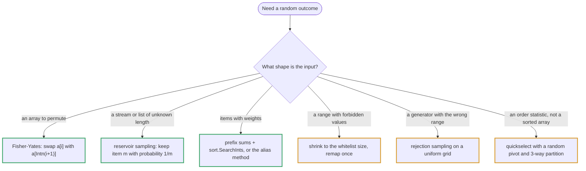
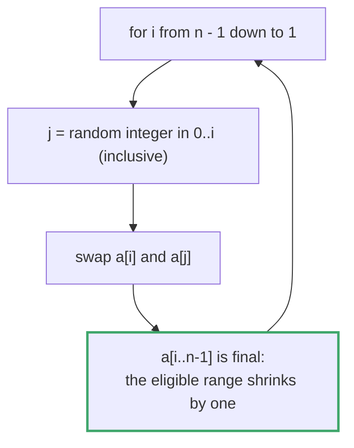
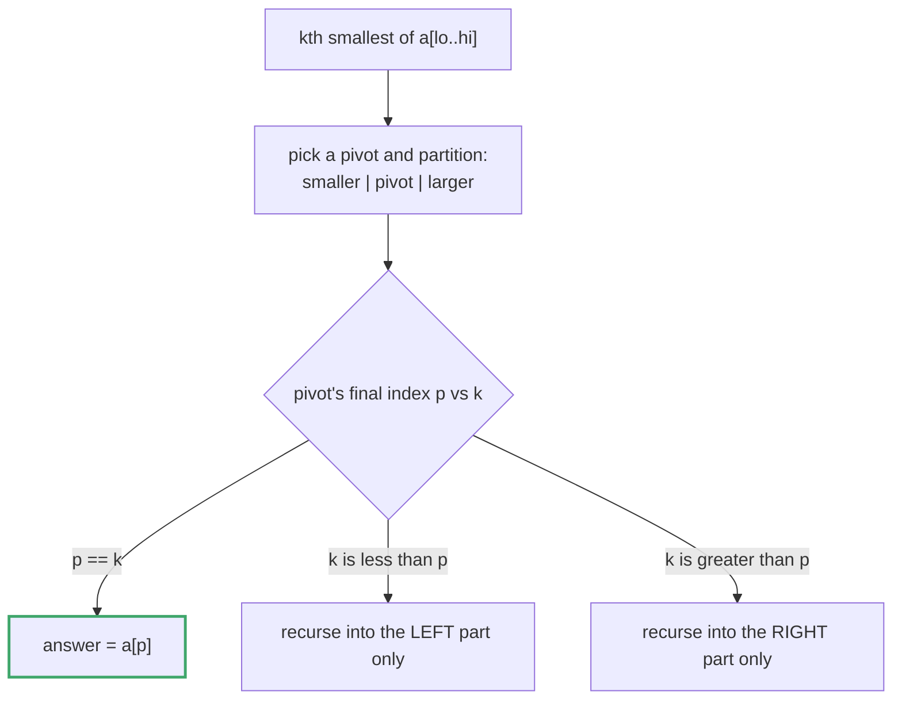

# Topic 27 · Classic Algorithms (Randomized, Divide & Conquer, Quickselect) — Go Deep Dive

> This topic is about algorithms whose *guarantee* matters more than their container: a shuffle that produces every permutation equally often, a random pick that hits its exact target
> probability, an order statistic found without sorting, a recursion that re-derives the same sub-expression only once. In Go two things change the picture: the standard library's
> randomness API has a few sharp edges (an *exclusive* `Intn`, a `Seed` that is now a no-op, a modulo-bias trap on small ranges), and compiled code means the "asymptotically better" algorithm
> — quickselect — actually beats sorting, which it does not in CPython. Every number below was measured on Go 1.24 (darwin/arm64), and every algorithm was compiled with `go vet` and checked against a brute-force reference or a chi-square test.

---

## Part 1 · Go's Random Tools — What Changed, and What Bites

### 1.1 `math/rand`, `math/rand/v2`, and seeding

| | `math/rand` (v1) | `math/rand/v2` (Go 1.22+) |
|---|---|---|
| Random `int` in `[0, n)` | `rand.Intn(n)` — panics `invalid argument to Intn` for `n <= 0` | `rand.IntN(n)` — panics `invalid argument to IntN` |
| Any integer or duration type | — | `rand.N(10 * time.Second)` (generic) |
| Float in `[0, 1)` | `rand.Float64()` | `rand.Float64()` |
| Shuffle / permutation | `rand.Shuffle(n, swap)`, `rand.Perm(n)` — `Shuffle` panics for `n < 0` | same |
| Reproducible generator | `rand.New(rand.NewSource(seed))` | `rand.New(rand.NewPCG(seed1, seed2))` |
| Global `Seed` | deprecated; **a no-op in Go 1.24** | removed |

Three facts that decide test design, all checked on Go 1.24.5:

- **The top-level functions are randomly seeded** (since Go 1.20). `rand.Seed(42)` followed by `rand.Intn(1000)` printed `639 579 679` in one run and `840 286 877` in the next — `Seed` no longer has any effect unless you run with `GODEBUG=randseednop=0`, in which case the same call printed the reproducible `305 987 668`.
- **Reproducibility needs your own generator.** `r := rand.New(rand.NewSource(42))` gave `305 987 668` on every run, and `rand.New(rand.NewPCG(1, 2))` from v2 gave `769 616 784` on every run.
- **Concurrency:** the top-level functions are safe to call from many goroutines; a `*rand.Rand` you create is **not**. `crypto/rand` is the one to use for anything secret; none of the algorithms here need it.

The interview trap that Python programmers carry over is the **argument convention**. Python's `random.randint(a, b)` is *inclusive* of `b`; Go's `Intn(n)` is *exclusive* of `n`. Fisher–Yates needs `j` in `[0, i]`, so in Go that is `rand.Intn(i + 1)` — write `rand.Intn(i)` instead and you have written the off-by-one shuffle measured in Part 2.

### 1.2 Modulo bias — why `Intn` exists

`rand.Uint32() % n` is uniform only if `n` divides `2³²`. For small `n` the bias is invisible (`2³² mod 6 = 4`, a relative bias of about 10⁻⁹), but for large `n` it is severe:
with `n = 3 << 30`, values below `2³⁰` are hit twice (by `r` and `r + n`) while the rest are hit once. Measured over 3,000,000 draws, `P(result < 2³⁰)` was **0.499** for `Uint32() % (3<<30)` against **0.333** for `Intn(3<<30)`, the uniform value.
`Intn`/`IntN` reject the biased region of the generator's range instead of reducing modulo — the same rejection idea as Problem 009.

### 1.3 How to test a randomized algorithm: the chi-square recipe

Count outcomes over many trials and compare with the expected counts:

```go
func chi2(obs []int, exp float64) float64 {
    s := 0.0
    for _, o := range obs { s += (float64(o) - exp) * (float64(o) - exp) / exp }
    return s
}
```

For an algorithm that is uniform over `k` outcomes the statistic follows a chi-square distribution with `k − 1` degrees of freedom and exceeds its **5 % critical value** about one run in twenty (5.99 for 3 outcomes, 9.49 for 5, 11.07 for 6, 16.92 for 10). A biased algorithm overshoots by orders of
magnitude. Use enough trials for every expected count to be at least ~5, and never judge by eye. A test that fixes the seed checks *one* outcome, not the distribution. (Even a correct algorithm exceeds the line occasionally: the recycled `rand10` of Part 5 gave χ² = 18.6 in one batch, and a mean of 8.26 with 2 of 40
batches above 16.92 over forty batches — exactly the 5 % that the threshold promises.)



---

## Part 2 · Shuffle — Fisher–Yates and How It Goes Wrong (Problem 001)

```go
type Shuffler struct{ orig []int }

func NewShuffler(nums []int) *Shuffler { return &Shuffler{slices.Clone(nums)} } // a COPY, or Shuffle would corrupt the original

func (s *Shuffler) Reset() []int { return slices.Clone(s.orig) }

func (s *Shuffler) Shuffle() []int {
    a := slices.Clone(s.orig)
    for i := len(a) - 1; i > 0; i-- {
        j := rand.Intn(i + 1) // Intn's argument is EXCLUSIVE: i+1 makes j in [0, i], so a[i] may stay put
        a[i], a[j] = a[j], a[i]
    }
    return a
}
```

Position `i` receives each of the `i + 1` still-eligible items with probability `1/(i+1)`; the product over positions is `1/n!`, so every permutation is equally likely. The **copy** matters: `Shuffler` keeps its own clone of the input, so `Shuffle` cannot corrupt what `Reset` must return (Problem 001's second trap).
Six permutations of `[0, 1, 2]`, 600,000 shuffles each, expected 100,000 per permutation:

| Algorithm | Distinct permutations | Counts | χ² (critical 11.07) |
|---|--:|---|--:|
| **Fisher–Yates** (`Intn(i+1)`) | 6 | 99,772 … 100,259 | **1.4** |
| `rand.Shuffle` (the standard library) | 6 | 99,572 … 100,263 | 3.7 |
| `rand.Perm` | 6 | 99,531 … 100,371 | 5.4 |
| Naive: swap each position with `Intn(len(a))` | 6 | 88,782 … 111,241 | **7,212.5** |
| Off by one: `Intn(i)` | **2** | 299,943 and 300,057 | 1,200,000 |

- The **naive** version makes `3³ = 27` equally likely swap sequences and folds them into 6 permutations; 27 is not divisible by 6, so the probabilities are multiples of 1/27 — visible in the counts as ≈ 89,000 versus ≈ 111,000.
- The **off-by-one** `Intn(i)` is Sattolo's algorithm: no element can stay in place, so only *cyclic* permutations appear — `(n−1)!` of the `n!`. It looks shuffled and is not.
- In production call `rand.Shuffle(n, swap)` or `rand.Perm(n)`; the interview wants the loop above and the argument for it.

---



## Part 3 · Reservoir Sampling (Problems 002, 003)

```go
func pickIndex(nums []int, target int) int {
    pick, seen := -1, 0
    for i, x := range nums {
        if x == target {
            seen++
            if rand.Intn(seen) == 0 { // keep the seen-th match with probability 1/seen
                pick = i
            }
        }
    }
    return pick
}

type ListNode struct {
    Val  int
    Next *ListNode
}

func randomNode(head *ListNode) int { // one pass, O(1) space, no length needed
    pick, m := head.Val, 0
    for n := head; n != nil; n = n.Next {
        m++
        if rand.Intn(m) == 0 {
            pick = n.Val
        }
    }
    return pick
}

func reservoirK(stream []int, k int) []int { // Algorithm R
    res := make([]int, 0, k)
    for i, x := range stream {
        if i < k {
            res = append(res, x)
        } else if j := rand.Intn(i + 1); j < k {
            res[j] = x // replace a random slot with probability k/(i+1)
        }
    }
    return res
}
```

Keep the `m`-th item with probability `1/m`. By induction every item seen so far is held with probability `1/m`: item `m+1` is kept with `1/(m+1)`, and each earlier item survives with `(1/m)·(m/(m+1)) = 1/(m+1)`. One pass, O(1) space, no length needed — which is why Problem 003 (a linked list of unknown length) uses it.
Measured over 200,000 runs on a 5-item stream: 40,046 / 39,960 / 40,144 / 39,973 / 39,877 (χ² = 1); `reservoirK(…, 3)` over ten items included each with frequency 0.298 … 0.301 (expected 0.3). `pickIndex` over `[1, 2, 3, 3, 3]` with target 3 returned indices 2, 3, 4 in 50,005 / 49,843 / 50,152 of 150,000 runs;
`randomNode` over `1 → 2 → 3` gave 50,048 / 50,047 / 49,905. `rand.Intn(seen)` is exclusive, so `Intn(seen) == 0` is exactly probability `1/seen`; `Intn(seen + 1)` (the off-by-one) makes the first item survive only half the time.

Converting the list to a slice inside `GetRandom` is the worst of both worlds (O(n) time *and* space per call); doing it once in the constructor is fine if the list never changes, but then the problem is no longer about streams.

---

## Part 4 · Weighted Picks (Problem 004)

```go
type Weighted struct {
    pre   []int
    total int
}

func NewWeighted(w []int) *Weighted {
    pre := make([]int, len(w))
    s := 0
    for i, x := range w {
        s += x
        pre[i] = s
    }
    return &Weighted{pre, s}
}

func (w *Weighted) Pick() int {
    r := rand.Intn(w.total) + 1 // 1..total INCLUSIVE
    return sort.SearchInts(w.pre, r) // first index with pre[i] >= r  (bisect_left)
}
```

`Intn(total) + 1` draws `1 … total` inclusive, and `sort.SearchInts` returns the first index with `pre[i] >= r` — Python's `bisect_left`. Bucket `i` therefore owns exactly `w[i]` draws. With weights `[1, 3, 6]` over 300,000 picks the counts were 29,927 / 89,726 / 180,347 (expected 30,000 / 90,000 / 180,000).
The conventions are easy to break, and the result is quiet:

| Draw / search | Counts for `[1, 3, 6]` (300,000 picks) | Verdict |
|---|---|---|
| `Intn(total) + 1` with `sort.SearchInts` | 29,927 / 89,726 / 180,347 | correct |
| `Intn(total) + 1` with `slices.BinarySearch` | 30,227 / 90,012 / 179,761 | correct (same semantics: first index `>= r`) |
| `Intn(total)` (0…total−1) with `sort.SearchInts` | 60,141 / 90,158 / 149,701 | **wrong** — the value `0` lands on index 0, giving it 20 % instead of 10 % |
| a fresh `rand.Intn` *inside* the `sort.Search` predicate | 0 / 90,522 / 209,478 | **wrong** — the predicate is not a fixed comparison |

Draw **once**, then search; never re-draw per probe or per weight. Weights must be positive, and the prefix array is built once in the constructor (rebuilding per pick turns O(log n) into O(n)).

The **alias method** gives an O(1) pick after an O(n) build: one uniform index, one biased coin, at most one jump to an alias:

```go
type Alias struct {
    prob  []float64
    alias []int
}

func NewAlias(w []int) *Alias {
    n := len(w)
    sum := 0
    for _, x := range w {
        sum += x
    }
    scaled := make([]float64, n)
    for i, x := range w {
        scaled[i] = float64(x) * float64(n) / float64(sum)
    }
    a := &Alias{make([]float64, n), make([]int, n)}
    var small, large []int
    for i, p := range scaled {
        if p < 1 {
            small = append(small, i)
        } else {
            large = append(large, i)
        }
    }
    for len(small) > 0 && len(large) > 0 {
        l, g := small[len(small)-1], large[len(large)-1]
        small, large = small[:len(small)-1], large[:len(large)-1]
        a.prob[l], a.alias[l] = scaled[l], g
        scaled[g] -= 1 - scaled[l]
        if scaled[g] < 1 {
            small = append(small, g)
        } else {
            large = append(large, g)
        }
    }
    for _, i := range append(small, large...) {
        a.prob[i] = 1
    }
    return a
}

func (a *Alias) Pick() int {
    i := rand.Intn(len(a.prob))
    if rand.Float64() < a.prob[i] {
        return i
    }
    return a.alias[i]
}
```

It matched the target on `[1, 3, 6]` (30,007 / 89,924 / 180,069). For 10⁵ weights and 2,000,000 picks, `SearchInts` took **143 ms** and the alias method **33 ms**. The alias method uses floats, so it is a probabilistic *approximation* of the integer weights, exact only up to rounding; the integer prefix-sum version is exact.

---

## Part 5 · Punctured Domains and Mismatched Generators (Problems 008, 009)

### 5.1 Blacklist: shrink, then remap once

```go
type Blacklist struct {
    k     int
    remap map[int]int
}

func NewBlacklist(n int, blacklist []int) *Blacklist {
    k := n - len(blacklist) // the whitelist size
    bl := make(map[int]bool, len(blacklist))
    for _, b := range blacklist {
        bl[b] = true
    }
    remap, next := map[int]int{}, k
    for _, b := range blacklist {
        if b < k { // only blacklisted values INSIDE the shrunk range can be drawn
            for bl[next] {
                next++ // skip blacklisted values at or above k
            }
            remap[b] = next // each target is used once
            next++
        }
    }
    return &Blacklist{k, remap}
}

func (b *Blacklist) Pick() int {
    r := rand.Intn(b.k)
    if v, ok := b.remap[r]; ok {
        return v
    }
    return r
}
```

Draw from `0 … k−1` where `k = n − len(blacklist)` is the whitelist size; if the draw is a blacklisted value, substitute a whitelisted value from `k … n−1`. Blacklisted values already `>= k` are never drawn and need no entry; each remap target is consumed **once** (`next++`), or that target would be twice as likely.
For `n = 7`, blacklist `[2, 3, 5]` and 200,000 picks the four legal values came out 49,809 / 49,565 / 50,013 / 50,613 (0, 1, 4, 6 — expected 50,000 each). A property test over 500 random `(n, blacklist)` pairs found no blacklisted or out-of-range value and always saw every whitelisted value.
The alternative, reject-and-resample, needs a geometrically distributed number of draws: with 90 % of `n = 1000` blacklisted it averaged **9.82** random calls per pick (theory: 10), against exactly one for the remap. Materialising the whitelist costs O(n) — infeasible at `n = 10⁹`.

### 5.2 Rand10 from Rand7: rejection sampling on a uniform grid

`(rand7() − 1)·7 + rand7()` is uniform on `1 … 49` (a 7 × 7 grid). Keep `1 … 40`, map with `% 10`, and reject `41 … 49`; the accepted values stay uniform because 40 is a multiple of 10.

```go
var rand7Calls int

func rand7() int { rand7Calls++; return rand.Intn(7) + 1 }

func rand10Basic() int {
    for {
        idx := (rand7()-1)*7 + rand7() // uniform on 1..49
        if idx <= 40 {
            return (idx-1)%10 + 1
        }
    }
}

func rand10() int { // recycles the rejected remainder
    a, span := 0, 1 // invariant: a is uniform on 0..span-1
    for {
        a, span = a*7+(rand7()-1), span*7
        if span >= 10 {
            lim := span - span%10 // the largest multiple of 10 that fits
            if a < lim {
                return a%10 + 1
            }
            a, span = a-lim, span-lim // the rejected remainder is still uniform: keep it
        }
    }
}
```

`rand10Basic` needs `2 / (40/49) = 2.45` calls to `rand7` (measured 2.451). The rejected outcomes still carry entropy: `rand10` keeps the remainder and combines it with the next roll, and the expected cost drops to **2.19** calls (measured 2.193); forty batches of 400,000 draws had mean χ² 8.26 (df = 9 expects 9). The two tempting wrong
answers are `rand7() + rand7()` (a triangular distribution, not uniform) and reducing all 49 outcomes `% 10` without rejecting (the value 10 is rarer: 4 outcomes instead of 5).

---

## Part 6 · Order Statistics — Quickselect, in Go (Problems 005, 007)

### 6.1 A generic quickselect with a 3-way partition

```go
// Select returns the k-th smallest (1-indexed) of a under cmp, in expected O(n). It works on a copy.
func Select[T any](a []T, k int, cmp func(x, y T) int) T {
    a = slices.Clone(a)
    lo, hi := 0, len(a)-1
    k--
    for {
        if lo == hi {
            return a[lo]
        }
        pivot := a[lo+rand.Intn(hi-lo+1)]
        lt, i, gt := lo, lo, hi // a[lo:lt] < pivot   a[lt:i] == pivot   a[gt+1:hi+1] > pivot
        for i <= gt {
            switch c := cmp(a[i], pivot); {
            case c < 0:
                a[lt], a[i] = a[i], a[lt]
                lt++
                i++
            case c > 0:
                a[i], a[gt] = a[gt], a[i]
                gt--
            default:
                i++
            }
        }
        switch {
        case k < lt:
            hi = lt - 1 // the answer is left of the pivots
        case k > gt:
            lo = gt + 1 // ... or right of them
        default:
            return pivot // ... or it is the pivot value itself
        }
    }
}
```

The 3-way partition (Dutch flag) keeps duplicates from reviving the quadratic case, the random pivot removes the dependence on input order, and following **one** side gives `n + n/2 + n/4 + …` expected work. `Select` is generic, so the same code selects integers, strings, or structs under any comparator. It matched `slices.Sort` + index on 2,000 random arrays with heavy duplication.
Counting comparisons on `n = 100,000` (mean of 20 runs): **1.95 n** for the minimum, **3.41 n** for the median (theory: about 3.39 n) and **2.20 n** for the maximum.

**In compiled Go, quickselect wins** — unlike CPython, where the built-in sort beats a pure-Python quickselect. Selecting from a million random ints (best of five):

| Task | `slices.Sort` + index | `container/heap` of size `k` | generic `Select` |
|---|--:|--:|--:|
| median of 10⁶ (`k = n/2`) | 51.4 ms | — | **7.3 ms** |
| 10th largest of 10⁶ | 51.5 ms | 28.5 ms | **3.6 ms** |

A size-`k` heap is the right tool when the data streams past or `k` is small and memory is tight (O(n log k)); `Select` is right for an in-memory slice.



### 6.2 Problem 007: the k-th largest *numeric string*

Numeric strings compare wrong lexicographically — `slices.Sorted(slices.Values([]string{"9", "10", "2"}))` is `[10 2 9]` — and cannot be parsed blindly: `strconv.Atoi` of 25 nines returned the maximum `int` **and** the error `value out of range`. The order that is both correct and conversion-free is **length first, then lexicographic**:

```go
func kthLargestNumber(nums []string, k int) string {
    // length first, then lexicographic; the k-th LARGEST is the (len-k+1)-th smallest
    return Select(nums, len(nums)-k+1, func(x, y string) int {
        return cmp.Or(cmp.Compare(len(x), len(y)), strings.Compare(x, y))
    })
}
// kthLargestNumber([3 6 7 10], 4) = "3"    ([2 21 12 1], 3) = "2"    ([0 0], 2) = "0"
```

The k-th *largest* is the `(len − k + 1)`-th *smallest*; targeting the wrong end is the fourth documented trap. It matched a numeric sort on 1,000 random inputs (numbers up to 2⁶⁰). It relies on there being no leading zeros (the problem promises it); swapping the two comparisons re-introduces the lexicographic bug.

### 6.3 Problem 005: Wiggle Sort II — median, then a virtual index

Reorder so `nums[0] < nums[1] > nums[2] < nums[3] …`. Find the median, then 3-way partition over a *virtual* index that visits the odd slots first and the even slots last, so large values land at peaks and small values at valleys — never adjacent to their own kind:

```go
func wiggleSort(nums []int) {
    n := len(nums)
    mid := Select(nums, (n+1)/2, cmp.Compare[int]) // the median (the ceil(n/2)-th smallest)
    idx := func(i int) int { return (1 + 2*i) % (n | 1) } // virtual index: odd slots first, then even slots
    i, lo, hi := 0, 0, n-1 // 3-way partition over the VIRTUAL positions
    for i <= hi {
        switch {
        case nums[idx(i)] > mid:
            nums[idx(i)], nums[idx(lo)] = nums[idx(lo)], nums[idx(i)]
            i++
            lo++
        case nums[idx(i)] < mid:
            nums[idx(i)], nums[idx(hi)] = nums[idx(hi)], nums[idx(i)]
            hi--
        default:
            i++
        }
    }
}
// [1 5 1 1 6 4] → [1 5 1 4 1 6]      [1 3 2 2 3 1] → [2 3 1 3 1 2]
```

`(n | 1)` rounds `n` up to the next odd number; `% n` breaks the mapping for even `n` (the fourth documented trap). It produced a valid wiggle for **all 1,296** random solvable inputs (solvability decided by an exhaustive search over distinct permutations). Sorting and interleaving the two halves *as they are* — without reversing each — was **invalid on 74 of 1,296**, because equal values near the median end up adjacent.

---

## Part 7 · Divide & Conquer with Memoisation Over Substrings (Problem 006)

```go
func diffWays(expr string, memo map[string][]int) []int {
    if r, ok := memo[expr]; ok {
        return r
    }
    var res []int
    for i := 0; i < len(expr); i++ {
        if c := expr[i]; c == '+' || c == '-' || c == '*' {
            for _, a := range diffWays(expr[:i], memo) {
                for _, b := range diffWays(expr[i+1:], memo) {
                    switch c {
                    case '+':
                        res = append(res, a+b)
                    case '-':
                        res = append(res, a-b)
                    default:
                        res = append(res, a*b)
                    }
                }
            }
        }
    }
    if res == nil { // no operator: the whole slice is a (possibly multi-digit) number
        v, _ := strconv.Atoi(expr)
        res = []int{v}
    }
    memo[expr] = res
    return res
}
// diffWays("2-1-1") sorted = [0 2]      diffWays("2*3-4*5") sorted = [-34 -14 -10 -10 10]
```

Split at every operator, combine every left result with every right result. The number of results for `n` operands is the Catalan number `C(n−1)`: nine operands (`1+2+…+9`) give **1,430** values. The memo is keyed by *substring* — two occurrences of `"1+1"` share an entry, which is correct — not by an index pair as in DP. The base case must test "no operator in this slice", not "one character", or multi-digit
numbers such as `"11"` break; `res == nil` is that test. A `map[string][]int` shared across the whole recursion is what turns the exponential re-derivation into work proportional to the number of distinct substrings.

---

## Part 8 · Python vs. Go — Where They Diverge

| | Python | Go |
|---|---|---|
| Random integer in a range | `randint(a, b)` inclusive; `randrange(a, b)` exclusive | `Intn(n)` exclusive; add the offset yourself |
| Shuffle | `random.shuffle(a)` in place | `rand.Shuffle(n, swap)` with a swap closure, or `rand.Perm(n)` |
| Weighted choice | `random.choices(pop, weights=)` | none — prefix sums + `sort.SearchInts`, or the alias method |
| Reproducible runs | `random.seed(s)` | `rand.New(rand.NewSource(s))`; top-level `rand.Seed` is a no-op in Go 1.24 |
| Thread safety | one shared generator, guarded by the GIL for single calls | top-level functions are safe; a `*rand.Rand` is not |
| Quickselect vs sorting | the built-in sort wins (105 ms vs 152 ms per 10⁶) | quickselect wins (7.3 ms vs 51.4 ms per 10⁶) |
| Numeric-string ordering | key `(len(s), s)` | `cmp.Or(cmp.Compare(len(x), len(y)), strings.Compare(x, y))` |
| Parsing very long digit strings | `int()` limit of 4,300 digits (ValueError) | `strconv.Atoi` returns the max int and `ErrRange` |
| Integer overflow in `2*x` etc. | never | wraps silently — use `int` (64-bit), not `int32` |

---

## Part 9 · Algorithms Owned by This Topic

| Algorithm | Time | Space | Problem |
|---|:--:|:--:|---|
| Fisher–Yates shuffle | O(n) | O(1) extra | 001 |
| Reservoir sampling (one item, `k` items) | O(n) | O(1) / O(k) | 002, 003 |
| Prefix sums + binary search | O(n) build, O(log n) pick | O(n) | 004 |
| Alias method | O(n) build, O(1) pick | O(n) | 004 (follow-up) |
| Quickselect, random pivot, 3-way | O(n) expected | O(1) | 005, 007 |
| Divide & conquer with a substring memo | Catalan-many results | O(distinct substrings) | 006 |
| Shrink-and-remap over a blacklist | O(B) build, O(1) pick | O(B) | 008 |
| Rejection sampling on a uniform grid | 2.45 rand7 calls expected | O(1) | 009 |

---

<!-- problem-map:start -->
## Part 10 · Every Problem in This Topic, by Pattern

Nine problems, five techniques (Fisher–Yates · reservoir sampling · prefix sums + `sort.SearchInts` · quickselect with a 3-way partition · divide-and-conquer with a substring memo, plus remapping and rejection sampling for a punctured or mismatched domain) — the Python guide's map in Go. Each **Trap** is a mistake documented in that problem's solution file, plus Go-specific hazards. Topic 27's Go solutions are still placeholders (and `GoDSA/27_algorithms` has no directory yet for problem 009); the Go column is the plan you would write.

| Problem | Move | The idea — and the trap it sets |
|---|---|---|
| [001 · Shuffle an Array](GoDSA/27_algorithms/001_shuffle_an_array/solution.go) <br>LC 384 · Medium | Fisher–Yates | For `i` from `n-1` down to `1`, swap `a[i]` with `a[rand.Intn(i+1)]`; keep a *clone* for `Reset`. **Trap:** `Intn(len(a))` every step (multiples of 1/27, χ² 7,212 — measured); `Intn(i)` (only cyclic permutations: 2 of 6); storing the caller's slice instead of a clone; using `rand.Seed` to make a test reproducible (a no-op in Go 1.24). |
| [002 · Random Pick Index](GoDSA/27_algorithms/002_random_pick_index/solution.go) <br>LC 398 · Medium | Reservoir over matching indices | Count matches; keep the m-th with probability `1/m` via `Intn(seen) == 0`. **Trap:** `Intn(seen+1)` (the first match survives half the time); a counter that survives across `pickIndex` calls; "first" or "last" match (valid but not uniform); special-casing a single match; returning `-1` when there is a match. |
| [003 · Linked List Random Node](GoDSA/27_algorithms/003_linked_list_random_node/solution.go) <br>LC 382 · Medium | Reservoir over a linked list | Walk once; keep node `m` with probability `1/m`; no length needed. **Trap:** copying to a slice on every call; `1/(m+1)` or `1/(m-1)`; a separate length pass; dereferencing a `nil` head. |
| [004 · Random Pick with Weight](GoDSA/27_algorithms/004_random_pick_with_weight/solution.go) <br>LC 528 · Medium | Prefix sums + `sort.SearchInts` | `pre` = running sums; draw `Intn(total)+1` once and `SearchInts` (first index `>= r`). **Trap:** `Intn(total)` without `+1` (counts 60,141 / 90,158 / 149,701 for `[1 3 6]`); a fresh draw inside the search predicate; independent per-weight coin flips; rebuilding the prefix array per pick. |
| [005 · Wiggle Sort II](GoDSA/27_algorithms/005_wiggle_sort_ii/solution.go) <br>LC 324 · Medium | Median + virtual-index 3-way partition | `idx(i) = (1 + 2*i) % (n \| 1)`; partition around the median so large values sit in odd slots and small in even. **Trap:** `slices.Sort` by reflex; a fixed pivot (O(n²)); interleaving unreversed halves (invalid on 74 of 1,296 solvable inputs); `% n` instead of `% (n \| 1)`. |
| [006 · Different Ways to Add Parentheses](GoDSA/27_algorithms/006_different_ways_to_add_parentheses/solution.go) <br>LC 241 · Medium | Split at every operator, memoise by substring | For each operator, combine every left result with every right result; a slice with no operator is the number. **Trap:** a base case that only recognises one digit; the wrong operator at a split; forcing a 2-D `dp`; a memo that is not shared across the recursion. |
| [007 · Find the Kth Largest Integer in a String](GoDSA/27_algorithms/007_find_the_kth_largest_integer_in_a_string/solution.go) <br>LC 1985 · Medium | Generic quickselect with the `(len, s)` order | Compare by length, then `strings.Compare`; the k-th *largest* is the `(len-k+1)`-th smallest. **Trap:** sorting or comparing the strings directly (`"9" > "10"`); `strconv.Atoi` (max int + `ErrRange` at 25 digits); the comparison order swapped; targeting the k-th smallest. |
| [008 · Random Pick with Blacklist](GoDSA/27_algorithms/008_random_pick_with_blacklist/solution.go) <br>LC 710 · Hard | Shrink to the whitelist size, remap once | Draw from `0..n-len(bl)-1`; remap each blacklisted value below that bound to an unused whitelisted value at or above it. **Trap:** reject-and-resample as the final answer (≈ 10 calls at 90 % blacklisted); remapping values already `>= k`; reusing a remap target; materialising the whitelist. |
| [009 · Implement Rand10() Using Rand7()](GoDSA/27_algorithms/009_implement_rand10_using_rand7/solution.go) <br>LC 470 · Medium | Rejection sampling on a 7×7 grid | `idx := (rand7()-1)*7 + rand7()` is uniform on 1..49; return `(idx-1)%10 + 1` for `idx <= 40`, retry otherwise (≈ 2.45 calls; recycling the remainder ≈ 2.19). **Trap:** `rand7() + rand7()` (triangular); reducing all 49 outcomes `% 10`; rejecting nothing; forgetting the loop. |

---
<!-- problem-map:end -->

## Checklist Before Leaving This Topic

- [ ] State Go's `Intn` convention (exclusive) and write Fisher–Yates with `rand.Intn(i + 1)`
- [ ] Reproduce the two wrong shuffles: naive swap-with-any (multiples of 1/27, χ² ≈ 7,200) and `Intn(i)` (only cyclic permutations)
- [ ] Use a chi-square test, not eyeballing, and know that `rand.Seed` is a no-op in Go 1.24 (use `rand.New(rand.NewSource(seed))`)
- [ ] Explain modulo bias with a number (`Uint32() % (3<<30)` gave 0.499 instead of 0.333)
- [ ] Write reservoir sampling for one item and for `k`, and prove the `1/m` invariant by induction
- [ ] Draw once and search once for weighted picks (`Intn(total) + 1` with `sort.SearchInts`); know why `Intn(total)` starves the last bucket
- [ ] Write the blacklist remap so each target is used once, and quote reject-and-resample's cost (≈ 10 calls at 90 % blacklisted)
- [ ] Write a generic quickselect (random pivot, 3-way partition) and quote 3.41 n comparisons for the median and the 7× speed-up over sorting
- [ ] Order numeric strings by length then lexicographically, and never parse them with `Atoi`
- [ ] Explain the wiggle-sort virtual index `(1 + 2*i) % (n | 1)` and why the interleave needs reversed halves
- [ ] Derive Rand10 from Rand7 by rejection (2.45 calls) and improve it by recycling the remainder (≈ 2.19)
- [ ] Memoise the parentheses recursion by substring and state the Catalan count
