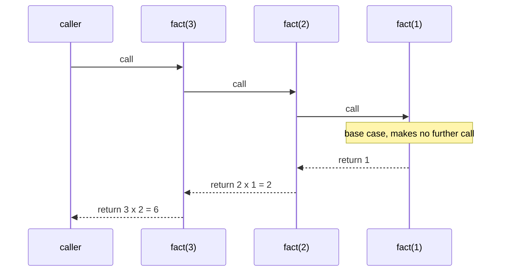
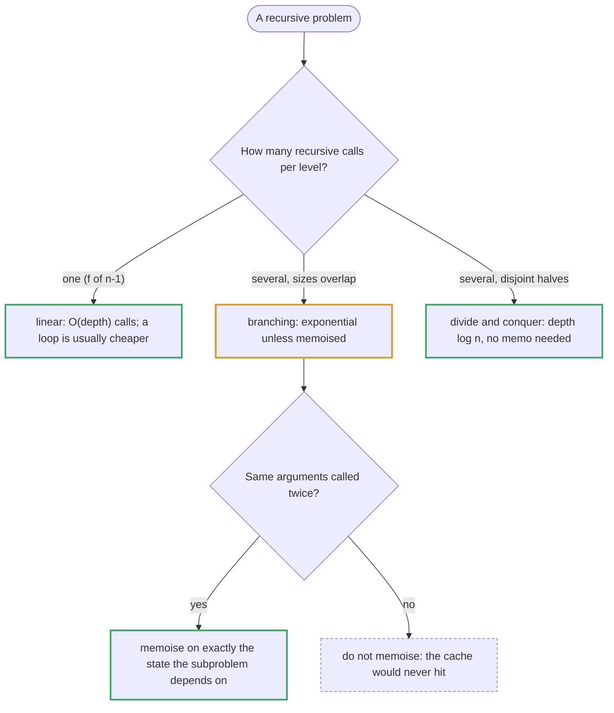

# Topic 28 · Recursion Mastery — Go Deep Dive

> Topic 09 teaches backtracking; this topic is the pure-recursion ladder underneath it — twenty-five problems, each one notch harder, that teach you to think in base cases, strictly smaller calls, and combine steps. Go changes three things about that ladder.
> Its goroutine stacks *grow* (so recursion that would crash CPython at depth 1,000 is fine at depth 10⁷), but overflow, when it comes, is a **fatal, unrecoverable** error. It has **no tail-call optimisation**, so "make it tail-recursive" is not a fix. And functions return **multiple values**, which turns the hardest problems in the ladder (the "return a pair going up" ones)
> into ordinary code. Every solution below was compiled with `go vet` and checked against a brute-force reference on hundreds of random inputs (all twenty-five: zero failures), and every number was measured on Go 1.24 (darwin/arm64).

---

## Part 1 · What a Recursive Call Does in Go — Measured

Each call pushes a frame (locals, saved registers, return address) on the goroutine's stack. Go starts a goroutine's stack small (2 KB, see topic 09) and **grows it by copying it to a larger block** when a call would overflow, so the depth you can reach is limited by memory, not by a small fixed constant. Measured with `func depthProbe(k int) int { if k == 0 { return 0 }; return 1 + depthProbe(k-1) }`:

| Depth | Time | Stack in use afterwards |
|---|--:|--:|
| 1,000,000 | 21 ms | 17 MB |
| 10,000,000 | 219 ms | 269 MB |

The recursive height of a right-skewed tree of **1,000,000 nodes** — a case that raises `RecursionError` in CPython at about 1,200 nodes — simply returned `1000000`. So in Go you rarely need an explicit stack to *survive* a deep recursion (LeetCode's 10⁴ nodes are trivial); you use one when you want the memory or the speed.

**The limit exists, and hitting it is fatal.** The default maximum stack is 1 GB on 64-bit systems (`debug.SetMaxStack`). Infinite recursion with the limit lowered to 64 MB printed:

```text
runtime: goroutine stack exceeds 67108864-byte limit
fatal error: stack overflow
```

That is a `fatal error`, not a `panic`: **`recover()` cannot catch it**, and the whole process dies. Guard recursion depth yourself when the input is untrusted.

**There is no tail-call optimisation.** `tailSum(n, acc)`, whose recursive call is the last thing it does, overflowed the same 64 MB stack at `n = 10,000,000` exactly as the non-tail version would. Rewriting to tail form changes nothing in Go; the fix for deep recursion is a loop (Part 5) or a smaller depth by construction (recurse on `n/2`, not `n−1`).

**Recursive closures.** A local recursive function needs its variable declared first: `var f func(n int) int; f = func(n int) int { … f(n-1) … }`. Most solutions below use this shape so the extra state (a counter, a cursor, a memo) lives in the enclosing function instead of in parameters. It costs nothing measurable: `fib(32)` took 5.3 ms as a plain function and 5.3 ms as a recursive closure.

---



## Part 2 · Base Cases, Call Shapes, and What They Cost

Write the **base case first**, minimal (`n == 0`, `node == nil`, `i == len(s)`), then write the recursive step assuming a strictly smaller call is already correct ("leap of faith" — induction, not mental unwinding). Three shapes cover the ladder:



| Recurrence | Solution | Example in this folder |
|---|---|---|
| `T(n) = T(n − 1) + O(1)` | O(n) | 006, 007, 013 |
| `T(n) = T(n/2) + O(1)` | O(log n) | 004, 016 (per digit) |
| `T(n) = 2T(n/2) + O(n)` | O(n log n) | merge sort |
| `T(n) = 2T(n/2) + O(1)` | O(n) | a balanced tree walk (014, 018, 019, 025) |
| `T(n) = T(n − 1) + T(n − 2)` | Θ(φⁿ); memoised O(n) | naive Fibonacci |
| Catalan: `Σ T(i)·T(n − 1 − i)` | Catalan-many results | 011, 012, 015 |

Space cost is the recursion **depth** (plus any memo table or output): O(n) for a chain, O(log n) for halving, O(h) for a tree of height `h` — O(n) if it is skewed.

Counted, not asserted: naive `fib(20)` makes 21,891 calls, `fib(25)` 242,785, `fib(30)` 2,692,537 and `fib(35)` **29,860,703** (= 2·F(36) − 1); memoised, `fib(35)` computes **34** distinct values. Compiled Go runs those 2.7 million calls in 1.9 ms (CPython: 108 ms); the *count* is what explodes, not the per-call price.
Merge-sort-shaped halving makes exactly `2n − 1` calls. `numTrees(5)`, `numTrees(10)` and `numTrees(12)` made **135, 32,805 and 295,245** calls without a memo.

---

## Part 3 · Combining Sub-Results — and How Go Makes It Easy

Once a recursive call returns you have a value for a strictly smaller subproblem; the entire remaining work is the **combine step**. Four patterns recur, and Go has an idiom for each:

- **Scalar going up** — `return combine(f(left), f(right))` (013 Sum Root to Leaf, 014 House Robber III).
- **A structure going up** — each level builds a new node or slice from its children's pieces (012, 015); return the slice, and remember an empty subtree is a *shape* (`[]*TreeNode{nil}`), not "nothing".
- **State going down** — an accumulator parameter (`acc*10 + n.Val`) or a bound that shrinks (`hi = i-1`).
- **Several values at once going up** — in Go simply `return a, b`. `func f(n *TreeNode) (robbed, skipped int)`, `(depth int, lca *TreeNode)`, `(small, big *TreeNode)` need no tuple type, no struct and no out-parameter; the "hardest" problems of the ladder (014, 017, 019, 025) become five-line functions.

A **captured variable** is the other idiom: `moves := 0; var excess func(...) int; excess = func(...) int { … moves += … }` (018) or `var succ *ListNode` (008) gives the recursion a side channel without threading it through every parameter. It is safe because the closure shares the variable, but write it deliberately: a captured counter that is *not* reset between calls
is the classic bug (021's cursor must be shared; a memo must not survive across unrelated inputs).

---

## Part 4 · The Ladder in Go — All 25 Problems

The types used throughout: `type ListNode struct { Val int; Next *ListNode }` and `type TreeNode struct { Val int; Left, Right *TreeNode }`. Each block below is complete and was run.

### 4.1 One call, one base case (001–005)

```go
func numberOfSteps(num int) int {
    if num == 0 { // the exact minimal case
        return 0
    }
    if num%2 == 0 {
        return 1 + numberOfSteps(num/2)
    }
    return 1 + numberOfSteps(num-1)
}

func reverseString(s []byte) {
    var rev func(lo, hi int)
    rev = func(lo, hi int) {
        if lo >= hi { // >=, not ==: on even lengths the pointers cross
            return
        }
        s[lo], s[hi] = s[hi], s[lo]
        rev(lo+1, hi-1)
    }
    rev(0, len(s)-1)
}

func addDigits(num int) int {
    if num < 10 {
        return num
    }
    sum := 0
    for ; num > 0; num /= 10 {
        sum += num % 10
    }
    return addDigits(sum) // recurse on a value DERIVED from the input
}

func digitalRoot(num int) int { // the O(1) closed form
    if num == 0 {
        return 0
    }
    return 1 + (num-1)%9
}

func isPowerOfTwo(n int) bool {
    if n <= 0 { // BEFORE the modulo test: 0 % 2 == 0 would recurse on 0 forever
        return false
    }
    if n == 1 {
        return true
    }
    return n%2 == 0 && isPowerOfTwo(n/2)
}

func isPowerOfThree(n int) bool {
    if n <= 0 {
        return false
    }
    if n == 1 {
        return true
    }
    return n%3 == 0 && isPowerOfThree(n/3)
}
```

- **001** steps: `14 → 6`, `8 → 4`, `123 → 12`; depth ≤ 2·log₂ n because every odd step is followed by an even one. Forgetting the `+ 1` undercounts every non-base case; Go's `num/2` on an `int` is integer division (no float trap as in Python's `/`).
- **002** Reverse String: the base case is `lo >= hi` — with `==` the pointers *cross* on even lengths and the recursion runs off the ends. Recurse on index bounds; slicing (`rev(s[1:len(s)-1])`) is fine in Go (no copy) but the bounds version is clearer. The depth is n/2, which is harmless here but would be unsafe in a language with a small fixed stack.
- **003** Add Digits recurses on a value *derived* from the input (the digit sum). The O(1) closed form is the digital root `1 + (num-1) % 9` with `0` special-cased — `num % 9` alone returns `0` for every positive multiple of 9.
- **004 / 005** Powers of two and three recurse by *division* (depth log n). The guard **`n <= 0` must come before the modulo test**: `0 % 2 == 0`, so `isPowerOfTwo(0/2)` would recurse forever and, in Go, end in a fatal stack overflow rather than a catchable error. No bit trick exists for base 3. Checked against a loop for every `n` in `[-5, 100000)`.

### 4.2 Rows and lists (006–008, 010)

```go
func getRow(k int) []int {
    if k == 0 {
        return []int{1}
    }
    prev := getRow(k - 1)
    row := make([]int, k+1) // a NEW slice: never mutate the sub-answer
    row[0], row[k] = 1, 1
    for i := 1; i < k; i++ {
        row[i] = prev[i-1] + prev[i]
    }
    return row
}

func swapPairs(head *ListNode) *ListNode {
    if head == nil || head.Next == nil {
        return head
    }
    second := head.Next
    head.Next = swapPairs(second.Next) // first: hook the rest of the list
    second.Next = head
    return second // the pair's new head
}

func reverseBetween(head *ListNode, left, right int) *ListNode {
    var succ *ListNode // the node after the reversed segment, recorded at the deepest call only
    var reverseFirstN func(h *ListNode, n int) *ListNode
    reverseFirstN = func(h *ListNode, n int) *ListNode {
        if n == 1 {
            succ = h.Next
            return h
        }
        last := reverseFirstN(h.Next, n-1)
        h.Next.Next = h
        h.Next = succ
        return last
    }
    var rec func(h *ListNode, l, r int) *ListNode
    rec = func(h *ListNode, l, r int) *ListNode {
        if l == 1 {
            return reverseFirstN(h, r)
        }
        h.Next = rec(h.Next, l-1, r-1) // BOTH bounds are relative to the current head
        return h
    }
    return rec(head, left, right)
}

func length(l *ListNode) int {
    n := 0
    for ; l != nil; l = l.Next {
        n++
    }
    return n
}

func addTwoNumbers(l1, l2 *ListNode) *ListNode {
    var add func(a, b *ListNode, n1, n2 int) (*ListNode, int) // returns the built tail and the carry out
    add = func(a, b *ListNode, n1, n2 int) (*ListNode, int) {
        if n1 == 0 && n2 == 0 {
            return nil, 0
        }
        var x, y int
        var rest *ListNode
        var carry int
        switch {
        case n1 > n2: // a is longer: b contributes a virtual 0 at this position
            x = a.Val
            rest, carry = add(a.Next, b, n1-1, n2)
        case n2 > n1:
            y = b.Val
            rest, carry = add(a, b.Next, n1, n2-1)
        default:
            x, y = a.Val, b.Val
            rest, carry = add(a.Next, b.Next, n1-1, n2-1)
        }
        sum := x + y + carry
        return &ListNode{Val: sum % 10, Next: rest}, sum / 10
    }
    head, carry := add(l1, l2, length(l1), length(l2))
    if carry > 0 { // the final carry
        head = &ListNode{Val: carry, Next: head}
    }
    return head
}
```

- **006** builds each row from a **new** slice: reusing or mutating the previous row corrupts the sub-answer. `getRow(3)` is `[1 3 3 1]` — the argument is a 0-indexed row number. Checked against binomial coefficients for rows 0–30.
- **007** returns "the new head of what follows". Order matters: hook the recursion's result into `head.Next` *before* setting `second.Next = head`, or you read a pointer you have already overwritten. `[1 2 3 4] → [2 1 4 3]`; an odd tail needs the single-node base case.
- **008** has two phases: walk to `left` (decrementing **both** bounds, since both are relative to the current head), then `reverseFirstN`, which records the successor only at its deepest call (`n == 1`). Recomputing `h.Next.Next` at every level reads pointers a deeper call has already rewired. `[1 2 3 4 5], 2, 4 → [1 4 3 2 5]`.
- **010** aligns the digits by *length* rather than by padding the lists: the longer list contributes a virtual 0 until the lengths match, then both advance. Each call returns `(node, carry)`; a final carry prepends one more node. `7243 + 564 = 7807` → `[7 8 0 7]`. Checked against `math/big` on 1,000 random pairs.

### 4.3 Mutual recursion: the nested-list iterator (009)

```go
type NestedInteger struct {
    isInt bool
    val   int
    list  []*NestedInteger
}

func (n NestedInteger) IsInteger() bool           { return n.isInt }
func (n NestedInteger) GetInteger() int           { return n.val }
func (n NestedInteger) GetList() []*NestedInteger { return n.list }

func flatten(list []*NestedInteger) []int { // eager: mutual recursion between "a list" and "an integer"
    var out []int
    for _, e := range list {
        if e.IsInteger() {
            out = append(out, e.GetInteger())
        } else {
            out = append(out, flatten(e.GetList())...)
        }
    }
    return out
}

type NestedIterator struct{ stack [][]*NestedInteger } // a stack of "the rest of each open list"

func NewNestedIterator(list []*NestedInteger) *NestedIterator {
    return &NestedIterator{[][]*NestedInteger{list}}
}

func (it *NestedIterator) HasNext() bool { // idempotent: it only rearranges, never consumes an integer
    for len(it.stack) > 0 {
        top := it.stack[len(it.stack)-1]
        if len(top) == 0 {
            it.stack = it.stack[:len(it.stack)-1]
            continue
        }
        if top[0].IsInteger() {
            return true
        }
        it.stack[len(it.stack)-1] = top[1:]
        it.stack = append(it.stack, top[0].GetList()) // descend into the sub-list
    }
    return false
}

func (it *NestedIterator) Next() int {
    it.HasNext()
    top := &it.stack[len(it.stack)-1]
    v := (*top)[0].GetInteger()
    *top = (*top)[1:]
    return v
}
```

The eager `flatten` is the mutual recursion in its plainest form: an element is either a leaf (an integer) or a list that sends you back into `flatten`. The lazy iterator keeps a stack of "the rest of each open list". `HasNext` must be **idempotent** — it may rearrange the stack (dropping exhausted lists, opening sub-lists) but must never consume an integer, or calling it twice would skip a value.
Checked against `flatten` on 500 random nested lists, calling `HasNext` twice before each `Next`. (LeetCode's `NestedInteger` is an interface with the same three methods.)

### 4.4 The Catalan family (011, 012, 015)

```go
func numTrees(n int) int {
    memo := map[int]int{0: 1, 1: 1} // an empty tree is ONE shape: the base case is 1, not 0
    var f func(n int) int
    f = func(n int) int {
        if v, ok := memo[n]; ok {
            return v
        }
        total := 0
        for root := 1; root <= n; root++ {
            total += f(root-1) * f(n-root) // left size × right size
        }
        memo[n] = total
        return total
    }
    return f(n)
}

func generateTrees(n int) []*TreeNode {
    if n == 0 {
        return nil
    }
    var build func(lo, hi int) []*TreeNode
    build = func(lo, hi int) []*TreeNode {
        if lo > hi {
            return []*TreeNode{nil} // ONE "empty tree" shape — an empty slice would erase every product
        }
        var out []*TreeNode
        for root := lo; root <= hi; root++ {
            for _, l := range build(lo, root-1) { // every left shape × every right shape
                for _, r := range build(root+1, hi) {
                    out = append(out, &TreeNode{Val: root, Left: l, Right: r})
                }
            }
        }
        return out
    }
    return build(1, n)
}

func allPossibleFBT(n int) []*TreeNode {
    memo := map[int][]*TreeNode{}
    var f func(n int) []*TreeNode
    f = func(n int) []*TreeNode {
        if n%2 == 0 {
            return nil // a full binary tree has an odd number of nodes
        }
        if n == 1 {
            return []*TreeNode{{}}
        }
        if r, ok := memo[n]; ok {
            return r
        }
        var out []*TreeNode
        for l := 1; l < n-1; l += 2 { // odd left sizes only; the right gets n-1-l
            for _, lt := range f(l) {
                for _, rt := range f(n - 1 - l) {
                    out = append(out, &TreeNode{Left: lt, Right: rt})
                }
            }
        }
        memo[n] = out
        return out
    }
    return f(n)
}
```

`numTrees(n)` is the Catalan number: 5 for `n = 3`, 1,767,263,190 for `n = 19`. The base case is `numTrees(0) = 1` — an empty tree is *one* shape, and a 0 would zero every product. It memoises on `n` alone because the count depends only on the size, not on which values sit in the tree.

`generateTrees` returns the trees themselves, so its output is Catalan-large no matter what. The empty range returns `[]*TreeNode{nil}` — one nil shape — not an empty slice, which would make the nested loop run zero times and erase every tree with an empty side. Shapes are **shared** between results (a DAG); that is fine while nobody mutates a returned tree. Verified for `n = 1…7`: the right number of trees, each a valid BST with in-order `1…n`, all distinct.
`allPossibleFBT` splits by **node count**, not by value range: only odd left sizes are tried (an even count can never be full), and even `n` returns nothing. `allPossibleFBT(7)` has 5 trees; for `n = 1…15` the counts matched the Catalan numbers `C((n−1)/2)`, every tree had exactly `n` nodes and was full, and all were distinct.

### 4.5 Combine patterns on trees (013, 014, 017, 018, 019, 025)

```go
func sumNumbers(root *TreeNode) int {
    var f func(n *TreeNode, acc int) int
    f = func(n *TreeNode, acc int) int {
        if n == nil {
            return 0
        }
        acc = acc*10 + n.Val // update BEFORE the leaf test, so the leaf's own digit counts
        if n.Left == nil && n.Right == nil {
            return acc
        }
        return f(n.Left, acc) + f(n.Right, acc)
    }
    return f(root, 0)
}

func rob(root *TreeNode) int {
    var f func(n *TreeNode) (robbed, skipped int)
    f = func(n *TreeNode) (int, int) {
        if n == nil {
            return 0, 0
        }
        lr, ls := f(n.Left)
        rr, rs := f(n.Right)
        robbed := n.Val + ls + rs                 // rob this node: its children must be skipped
        skipped := max(lr, ls) + max(rr, rs)      // skip it: each child is free to do its best
        return robbed, skipped
    }
    a, b := f(root)
    return max(a, b)
}

func splitBST(root *TreeNode, target int) (small, big *TreeNode) {
    if root == nil {
        return nil, nil
    }
    if root.Val <= target { // root and its whole left subtree are small; only the right subtree can straddle
        s, b := splitBST(root.Right, target)
        root.Right = s
        return root, b
    }
    s, b := splitBST(root.Left, target)
    root.Left = b
    return s, root
}

func abs(x int) int {
    if x < 0 {
        return -x
    }
    return x
}

func distributeCoins(root *TreeNode) int {
    moves := 0
    var excess func(n *TreeNode) int // the subtree's surplus (or deficit) of coins
    excess = func(n *TreeNode) int {
        if n == nil {
            return 0
        }
        l, r := excess(n.Left), excess(n.Right)
        moves += abs(l) + abs(r) // every unit of surplus or deficit crosses the edge to the child
        return n.Val + l + r - 1 // keep one coin for this node
    }
    excess(root)
    return moves
}

func lcaDeepestLeaves(root *TreeNode) *TreeNode {
    var f func(n *TreeNode) (depth int, lca *TreeNode)
    f = func(n *TreeNode) (int, *TreeNode) {
        if n == nil {
            return 0, nil // depth 0, not -1
        }
        ld, ll := f(n.Left)
        rd, rl := f(n.Right)
        switch {
        case ld > rd:
            return ld + 1, ll // the deeper side's OWN answer
        case rd > ld:
            return rd + 1, rl
        default:
            return ld + 1, n // both sides equally deep: this node joins them
        }
    }
    _, lca := f(root)
    return lca
}

func minCameraCover(root *TreeNode) int {
    const (
        notCovered = 0
        camera     = 1
        covered    = 2
    )
    cams := 0
    var f func(n *TreeNode) int
    f = func(n *TreeNode) int {
        if n == nil {
            return covered // a missing child needs nothing — NOT notCovered
        }
        l, r := f(n.Left), f(n.Right)
        if l == notCovered || r == notCovered { // a child needs cover: this node MUST hold a camera (checked first)
            cams++
            return camera
        }
        if l == camera || r == camera {
            return covered
        }
        return notCovered // both children are covered but neither has a camera: ask the parent
    }
    if f(root) == notCovered { // the root itself may still be uncovered
        cams++
    }
    return cams
}
```

- **013** passes the number so far *down* and adds the leaves' values *up*. Update `acc` **before** the leaf test so the leaf's own digit counts, and test "leaf" as *both* children nil — a one-child node is not a leaf. `[4 9 0 5 1] → 1026`.
- **014** returns `(robbed, skipped)`. Robbing a node forces its children to be *skipped*; skipping it lets each child take `max(robbed, skipped)`. One number per subtree would force re-deriving both answers at every ancestor (exponential); the pair makes it linear. `[3 2 3 null 3 null 1] → 7`, `[3 4 5 1 3 null 1] → 9`; matched an independent memoised `(node, canRob)` DP on 400 random trees.
- **017** returns `(small, big)`. Only one side can straddle `target`: when `root.Val <= target`, the root and its whole left subtree are small and only `root.Right` needs splitting; the recursion's *small* half goes back into `root.Right`. Verified on 400 random BSTs: both halves are valid BSTs and their in-order concatenation is the original.
- **018**'s return value is the subtree's **excess** (`val + left + right − 1`, keeping one coin for the node) and the answer accumulates in a captured `moves`: every unit of surplus *or deficit* crosses the edge to the child, so it is `abs(l) + abs(r)`. Returning the move count instead of the excess, or forgetting `abs`, are the two classic errors. `[3 0 0] → 2`, `[0 3 0] → 3`; matched a sum of `|coins − nodes|` over every non-root subtree on 400 random trees.
- **019** returns `(depth, lca)`. Equal depths → this node; otherwise the deeper child's *own* answer with depth + 1 — returning `node` instead of the child's result is the usual slip. The depth of `nil` is `0`, not `-1`. Matched a brute force (find the deepest leaves, then the deepest node containing them all) on 400 random trees.
- **025** is the hardest combine step: a three-state return (0 = not covered, 1 = camera, 2 = covered). **`nil` is state 2**, not 0 (otherwise every leaf's parent gets a needless camera); a child in state 0 forces a camera here and is checked *before* "a child has a camera"; a leaf never gets a camera; and the root may still be uncovered after the traversal. Matched an exhaustive search over every camera placement on 400 random trees of up to 9 nodes (`[0 0 null 0 0] → 1`).

### 4.6 Divide and conquer, and the same range two ways (016, 020)

```go
func powMod(a, k, m int) int {
    r := 1
    for a %= m; k > 0; k >>= 1 {
        if k&1 == 1 {
            r = r * a % m
        }
        a = a * a % m
    }
    return r
}

func superPow(a int, b []int) int {
    const mod = 1337
    var f func(a int, b []int) int
    f = func(a int, b []int) int {
        if len(b) == 0 {
            return 1
        }
        last := b[len(b)-1] // the LAST digit: a^(10x + d) = (a^x)^10 · a^d
        return powMod(f(a, b[:len(b)-1]), 10, mod) * powMod(a, last, mod) % mod
    }
    return f(a%mod, b)
}

func mctFromLeafValues(arr []int) int { // monotonic stack, O(n)
    res := 0
    stack := []int{math.MaxInt} // the sentinel: the stack is never empty
    for _, x := range arr {
        for stack[len(stack)-1] <= x {
            mid := stack[len(stack)-1]
            stack = stack[:len(stack)-1]
            res += mid * min(stack[len(stack)-1], x) // merge the smaller neighbour with the mid value
        }
        stack = append(stack, x)
    }
    for len(stack) > 2 {
        top := stack[len(stack)-1]
        stack = stack[:len(stack)-1]
        res += top * stack[len(stack)-1]
    }
    return res
}

func mctDP(arr []int) int { // memoised interval recursion, O(n^3)
    n := len(arr)
    mx := make([][]int, n)
    for i := range mx {
        mx[i] = make([]int, n)
        m := 0
        for j := i; j < n; j++ {
            m = max(m, arr[j])
            mx[i][j] = m // precomputed range maxima: no re-slicing inside the split loop
        }
    }
    memo := map[[2]int]int{}
    var f func(lo, hi int) int
    f = func(lo, hi int) int {
        if lo == hi {
            return 0 // a single leaf costs nothing: only NON-LEAF nodes have a cost
        }
        key := [2]int{lo, hi}
        if v, ok := memo[key]; ok {
            return v
        }
        best := math.MaxInt
        for k := lo; k < hi; k++ {
            best = min(best, f(lo, k)+f(k+1, hi)+mx[lo][k]*mx[k+1][hi])
        }
        memo[key] = best
        return best
    }
    return f(0, n-1)
}
```

**016** peels the *last* digit: `a^(10x + d) = (a^x)^10 · a^d`, reducing `mod 1337` at every step so nothing overflows. With up to 2,000 digits the recursion depth is 2,000 — trivial in Go. `superPow(2, [3]) = 8`, `(2, [1 0]) = 1024`, `(2147483647, [2 0 0]) = 1198`; matched `math/big` modular exponentiation on 300 random cases.
**020** shows the same problem two ways. The interval recursion `f(lo, hi) = min over k of f(lo,k) + f(k+1,hi) + max(lo..k)·max(k+1..hi)` is O(n³) with a memo keyed by `[2]int` (precompute the range maxima; re-slicing inside the split loop is a needless factor). The monotonic stack solves it in O(n) by always merging a value with its smaller neighbour. They agreed on 800 random arrays; `[6 2 4] → 32`, `[4 11] → 44`. The stack version needs its `math.MaxInt` sentinel so it is never empty.

### 4.7 A shared cursor, block decomposition, split × swap, and backtracking (021–024)

```go
func recoverFromPreorder(traversal string) *TreeNode {
    i := 0 // ONE cursor shared by every call: it must not reset per call
    var build func(depth int) *TreeNode
    build = func(depth int) *TreeNode {
        // how many dashes are next? They are only consumed if they equal this call's depth.
        j := i
        for j < len(traversal) && traversal[j] == '-' {
            j++
        }
        if j-i != depth {
            return nil // a shallower node comes next: this subtree is finished
        }
        i = j
        k := i
        for k < len(traversal) && traversal[k] != '-' {
            k++
        }
        v, _ := strconv.Atoi(traversal[i:k])
        i = k
        n := &TreeNode{Val: v}
        n.Left = build(depth + 1)
        n.Right = build(depth + 1)
        return n
    }
    return build(0)
}

func makeLargestSpecial(s string) string {
    var parts []string
    balance, start := 0, 0
    for i := 0; i < len(s); i++ {
        if s[i] == '1' {
            balance++
        } else {
            balance--
        }
        if balance == 0 { // a primitive block ends where the running balance returns to zero
            inner := makeLargestSpecial(s[start+1 : i]) // maximise the interior first
            parts = append(parts, "1"+inner+"0")
            start = i + 1
        }
    }
    slices.SortFunc(parts, func(a, b string) int { return strings.Compare(b, a) }) // descending
    return strings.Join(parts, "")
}

func isScramble(s1, s2 string) bool {
    if len(s1) != len(s2) {
        return false
    }
    type key struct{ i, j, n int } // s1[i:i+n] against s2[j:j+n]
    memo := map[key]bool{}
    var solve func(i, j, n int) bool
    solve = func(i, j, n int) bool {
        a, b := s1[i:i+n], s2[j:j+n]
        if a == b {
            return true
        }
        k := key{i, j, n}
        if v, ok := memo[k]; ok {
            return v
        }
        var cnt [26]int // prune: equal character multisets are necessary
        for x := 0; x < n; x++ {
            cnt[a[x]-'a']++
            cnt[b[x]-'a']--
        }
        if cnt != [26]int{} {
            memo[k] = false
            return false
        }
        res := false
        for c := 1; c < n && !res; c++ {
            res = (solve(i, j, c) && solve(i+c, j+c, n-c)) || // no swap
                (solve(i, j+n-c, c) && solve(i+c, j, n-c)) // swap: s1's prefix pairs with s2's SUFFIX
        }
        memo[k] = res
        return res
    }
    return solve(0, 0, len(s1))
}

func addOperators(num string, target int) []string {
    var res []string
    var dfs func(i int, path string, value, last int)
    dfs = func(i int, path string, value, last int) {
        if i == len(num) {
            if value == target {
                res = append(res, path)
            }
            return
        }
        for j := i; j < len(num); j++ {
            if j > i && num[i] == '0' { // no operand with a leading zero — at EVERY position
                break
            }
            cur, _ := strconv.Atoi(num[i : j+1])
            if i == 0 {
                dfs(j+1, strconv.Itoa(cur), cur, cur)
                continue
            }
            dfs(j+1, path+"+"+strconv.Itoa(cur), value+cur, cur)
            dfs(j+1, path+"-"+strconv.Itoa(cur), value-cur, -cur)
            dfs(j+1, path+"*"+strconv.Itoa(cur), value-last+last*cur, last*cur) // undo the last term, re-apply it multiplied
        }
    }
    dfs(0, "", 0, 0)
    return res
}
```

- **021** is driven by **one shared cursor** `i` captured by the closure — it must *not* reset per call. Each call peeks at the dashes: if their count equals this call's `depth` it consumes them and builds a node, otherwise it returns `nil` without consuming (a shallower node is coming). Left is built first, so a single child is the left child, as the problem requires. Verified by serialising 500 random trees to the dashed format and recovering them.
- **022** splits the string into primitive blocks where the running balance returns to zero, maximises each block's *interior* recursively, wraps it again in `1…0`, and sorts the blocks **descending**. Splitting on a character instead of the balance, or sorting ascending, gives the smallest arrangement. It matched a brute force (BFS over every swap of two consecutive special substrings, taking the largest string reached) on 300 random strings; `"11011000" → "11100100"`.
- **023** branches over every split point *and* a swap-or-not choice at each level. The swap pairing matches `s1`'s prefix with `s2`'s **suffix**. Memoise on `(i, j, n)` and prune with a character-count comparison (`[26]int` arrays compare with `==`). It matched an exhaustive enumeration of every scramble on 600 random pairs; `("great", "rgeat") → true`, `("abcde", "caebd") → false`.
- **024** backtracks over operators with a carried `last` term: on `*`, undo the last term and re-apply it multiplied — `value - last + last*cur`, new `last = last*cur`. The leading-zero guard runs at **every** operand, not just the first (`"105", 5 → ["1*0+5" "10-5"]`, `"00", 0 → ["0+0" "0-0" "0*0"]`). It matched a brute force that enumerates all `4ⁿ⁻¹` operator choices and evaluates each with precedence, on 300 random inputs of up to 6 digits. Building the path with `+` on strings allocates at every step;
  fine here, and the lever to pull (a `[]byte` buffer with truncation) if this is your bottleneck.

---

## Part 5 · Recursion vs Iteration in Go

Recursion is not free even when the stack does not overflow. Summing 1 to 10⁶, ten times: a recursive closure took **40.3 ms** and a plain loop **2.2 ms** — about 18× — because every call pays for a frame. The same trade holds for linked-list problems (an iterative pointer rewiring is O(1) space; the recursive form is O(n) stack) and for tree walks.

| Situation | Use |
|---|---|
| A linear chain (`f(n-1)`), depth up to ~10⁷ | a loop — faster and no stack |
| Tree walk that needs *post-order* information (014, 018, 019, 025) | recursion with multiple returns — clearer than an explicit stack |
| Depth could be attacker-controlled | an explicit stack (`[]struct{node *TreeNode; state int}`) — overflow is fatal, not recoverable |
| Same arguments repeated | memoise (a `map` keyed by the state: an `int`, a `[2]int`, or a small struct) |
| Recursing on `n-1` where `n/2` would do | halve it: depth log n |

A memo key must contain **exactly** the state the subproblem depends on: `n` for `numTrees`, `(lo, hi)` for `mctDP`, `(i, j, n)` for `isScramble`. Anything more defeats the cache; anything less returns wrong answers. A `map[[2]int]int` (arrays are comparable, so they are valid keys) is the idiomatic two-argument memo.

---

## Part 6 · Python vs. Go — Where They Diverge

| | Python | Go |
|---|---|---|
| Recursion depth | limit 1,000 by default; `RecursionError` (catchable); raising the limit worked to 10⁶ frames (~159 MB) | goroutine stacks grow; 10⁷ frames took 219 ms and 269 MB; the 1 GB limit ends in a **fatal, uncatchable** `stack overflow` |
| Tail-call optimisation | none | none |
| Returning several values | a tuple | multiple return values — no tuple needed |
| Recursive local function | a nested `def`, `nonlocal` for counters | `var f func(...)`; a captured variable for counters |
| Mutable default argument trap | `def f(x, acc=[])` shares one list across calls | no default arguments at all |
| Memo | `@functools.cache` | a `map` you manage (key: `int`, `[2]int`, struct) |
| Empty result of a builder | `[None]` for "one empty shape" | `[]*TreeNode{nil}` |
| Naive `fib(30)` | 2,692,537 calls, 108 ms | 2,692,537 calls, 1.9 ms |

---

## Part 7 · Algorithms Owned by This Topic

| Technique | Time | Space (depth) | Problems |
|---|:--:|:--:|---|
| Linear recursion, one base case | O(n) / O(log n) | O(depth) | 001–006 |
| Pointer-returning list recursion | O(n) | O(n) | 007, 008, 010 |
| Mutual recursion / explicit stack | O(n) | O(depth) | 009 |
| Memoised counting; building trees | O(n²) / Catalan | O(n) / output | 011, 012, 015 |
| Accumulator down, subtotal up | O(n) | O(h) | 013 |
| Multi-value return (pair, triple) | O(n) | O(h) | 014, 017, 018, 019, 025 |
| Divide and conquer with modular arithmetic | O(digits) | O(digits) | 016 |
| Interval recursion / monotonic stack | O(n³) / O(n) | O(n²) / O(n) | 020 |
| Shared-cursor recursion | O(n) | O(depth) | 021 |
| Block decomposition | O(n²) | O(n) | 022 |
| Split × swap with a memo | O(n⁴) worst | O(n³) | 023 |
| Backtracking with a carried term | O(4ⁿ) | O(n) | 024 |

---

<!-- problem-map:start -->
## Part 8 · Every Problem in This Topic, by Pattern

Twenty-five problems, each one notch harder — from a single base case to a three-state post-order return — the Python guide's map in Go, where multiple return values turn the "return a pair" problems into ordinary code. Each **Trap** is a mistake documented in that problem's solution file, plus Go-specific hazards. Topic 28's Go solutions are still placeholders; Part 4 has a tested plan for each.

| Problem | Move | The idea — and the trap it sets |
|---|---|---|
| [001 · Number of Steps to Reduce a Number to Zero](GoDSA/28_recursion_backtracking/001_number_of_steps_to_reduce_a_number_to_zero/solution.go) <br>LC 1342 · Easy | One call, one base case | `numberOfSteps(0) = 0`, else `1 + numberOfSteps(n/2 or n-1)`; depth ≤ 2·log₂ n. **Trap:** forgetting the `+ 1`; always subtracting 1 (ignoring the even rule); losing the base case `n == 0`. |
| [002 · Reverse String](GoDSA/28_recursion_backtracking/002_reverse_string/solution.go) <br>LC 344 · Easy | Two-pointer recursion | Swap `s[lo]`, `s[hi]`, recurse on `(lo+1, hi-1)`, base `lo >= hi`. **Trap:** `lo == hi` (the pointers cross on even lengths); returning a reversed copy instead of mutating `s`; depth n/2. |
| [003 · Add Digits](GoDSA/28_recursion_backtracking/003_add_digits/solution.go) <br>LC 258 · Easy | Recurse on a derived value | Sum the digits and recurse on the sum; or the digital root `1 + (n-1) % 9`. **Trap:** `n % 9` (0 for multiples of 9); missing the `n == 0` case in the formula; string conversion instead of `% 10` / `/ 10`. |
| [004 · Power of Two](GoDSA/28_recursion_backtracking/004_power_of_two/solution.go) <br>LC 231 · Easy | Recurse by halving | `n <= 0` → false, `n == 1` → true, else `n%2 == 0 && f(n/2)`. **Trap:** the modulo test before `n <= 0` (infinite recursion on 0 — a fatal stack overflow in Go); no `n == 1` base case; ignoring negatives. |
| [005 · Power of Three](GoDSA/28_recursion_backtracking/005_power_of_three/solution.go) <br>LC 326 · Easy | The same in base 3 | Divide while `n % 3 == 0`; no bit trick exists. **Trap:** `n % 3` before `n <= 0`; expecting a bitmask; the wrong largest power for the `3^19 % n` trick. |
| [006 · Pascal's Triangle II](GoDSA/28_recursion_backtracking/006_pascals_triangle_ii/solution.go) <br>LC 119 · Easy | Build a row from the previous row | A new slice: `row[0] = row[k] = 1`, `row[i] = prev[i-1] + prev[i]`. **Trap:** dropping the bookend 1s; `range` bounds that double-count; mutating the shared previous row; the 0-indexed `rowIndex`. |
| [007 · Swap Nodes in Pairs](GoDSA/28_recursion_backtracking/007_swap_nodes_in_pairs/solution.go) <br>LC 24 · Medium | Return "the new head of what follows" | `head.Next = swapPairs(second.Next); second.Next = head; return second`. **Trap:** assigning `second.Next` first (reads an overwritten pointer); no single-node base case; swapping values; returning `head`. |
| [008 · Reverse Linked List II](GoDSA/28_recursion_backtracking/008_reverse_linked_list_ii/solution.go) <br>LC 92 · Medium | Recurse on a sub-range | `rec(head, l, r)` decrements both bounds; `reverseFirstN` records `succ` only at `n == 1`. **Trap:** recomputing the successor at every level; decrementing only `left`; returning `head` from `reverseFirstN`. |
| [009 · Flatten Nested List Iterator](GoDSA/28_recursion_backtracking/009_flatten_nested_list_iterator/solution.go) <br>LC 341 · Medium | Mutual recursion by `IsInteger` | A list recurses into each child; lazily, a stack of "the rest of each open list" with an idempotent `HasNext`. **Trap:** a `HasNext` that consumes an integer; forward-order pushes; calling `GetList` on an integer; treating it as binary. |
| [010 · Add Two Numbers II](GoDSA/28_recursion_backtracking/010_add_two_numbers_ii/solution.go) <br>LC 445 · Medium | Recursion plus alignment | Compare the lengths: the longer list contributes a virtual 0; return `(node, carry)`. **Trap:** adding misaligned digits; carry in a shared variable; forgetting the final carry; appending instead of prepending. |
| [011 · Unique Binary Search Trees](GoDSA/28_recursion_backtracking/011_unique_binary_search_trees/solution.go) <br>LC 96 · Medium | Memoised counting | `numTrees(n) = Σ f(root-1) · f(n-root)`, `numTrees(0) = 1`, memo on `n`. **Trap:** base case 0; memoising on values; no memo (135, 32,805, 295,245 calls for n = 5, 10, 12); `int` overflow beyond Catalan(35). |
| [012 · Unique Binary Search Trees II](GoDSA/28_recursion_backtracking/012_unique_binary_search_trees_ii/solution.go) <br>LC 95 · Medium | The same, building trees | `build(lo, hi)`: an empty range returns `[]*TreeNode{nil}`; every left × every right. **Trap:** returning an empty slice for the empty range; zipping instead of a nested loop; caching by size; mutating a shared subtree afterwards. |
| [013 · Sum Root to Leaf Numbers](GoDSA/28_recursion_backtracking/013_sum_root_to_leaf_numbers/solution.go) <br>LC 129 · Medium | Accumulator down, subtotal up | `acc = acc*10 + val` before the leaf test; a leaf is *both* children `nil`. **Trap:** a one-child node as a leaf; recursing into `nil` (a nil dereference); updating `acc` after the leaf check; a shared running total. |
| [014 · House Robber III](GoDSA/28_recursion_backtracking/014_house_robber_iii/solution.go) <br>LC 337 · Medium | Return two values | `(robbed, skipped)`: `robbed = val + skipL + skipR`, `skipped = max(L) + max(R)`. **Trap:** one value per subtree (exponential); `robbed` from the children's robbed values; `skipped` without `max`; forgetting the final `max`. |
| [015 · All Possible Full Binary Trees](GoDSA/28_recursion_backtracking/015_all_possible_full_binary_trees/solution.go) <br>LC 894 · Medium | Split by node count | `f(n)`: odd left sizes only, every left × every right under a new root; memoise on `n`; even `n` returns `nil`. **Trap:** looping every size; no even early return; mutating shared cached subtrees; confusing it with 012's value split. |
| [016 · Super Pow](GoDSA/28_recursion_backtracking/016_super_pow/solution.go) <br>LC 372 · Medium | Recurse on the last digit | `a^[b…] = (a^[b[:len-1]])^10 · a^last mod 1337`; `%` at every step. **Trap:** reducing only at the end (overflow); the *first* digit; a linear power loop; `int` overflow in `a * a` without the modulus. |
| [017 · Split BST](GoDSA/28_recursion_backtracking/017_split_bst/solution.go) <br>LC 776 · Medium | Return `(small, big)` | Only one side straddles `target`: reattach the recursion's *small* half to `root.Right` when `root.Val <= target`. **Trap:** recursing into both children; reattaching the wrong half; an inconsistent return order; misplacing `root`. |
| [018 · Distribute Coins in Binary Tree](GoDSA/28_recursion_backtracking/018_distribute_coins_in_binary_tree/solution.go) <br>LC 979 · Medium | The return value is the excess | `excess = val + l + r - 1`; a captured `moves += abs(l) + abs(r)`. **Trap:** no `abs`; forgetting the `- 1`; returning the move count; declaring `moves` inside the closure. |
| [019 · Lowest Common Ancestor of Deepest Leaves](GoDSA/28_recursion_backtracking/019_lowest_common_ancestor_of_deepest_leaves/solution.go) <br>LC 1123 · Medium | Return `(depth, node)` | Equal depths → this node; else the deeper child's answer, depth + 1. **Trap:** returning `node` instead of the child's result; forgetting `+ 1`; depth of `nil` as −1; a provisional answer taken as final. |
| [020 · Minimum Cost Tree From Leaf Values](GoDSA/28_recursion_backtracking/020_minimum_cost_tree_from_leaf_values/solution.go) <br>LC 1130 · Medium | Interval recursion or a monotonic stack | `f(lo, hi)` over every split with a `[2]int` memo (O(n³)); or pop the smaller neighbour with a `math.MaxInt` sentinel (O(n)). **Trap:** no memo; re-slicing `max` per split; adding leaf values; no sentinel. |
| [021 · Recover a Tree From Preorder Traversal](GoDSA/28_recursion_backtracking/021_recover_a_tree_from_preorder_traversal/solution.go) <br>LC 1028 · Hard | A shared cursor | One captured `i`; count dashes, consume them only if they equal `depth`, else return `nil`; left first. **Trap:** a cursor that resets per call; consuming dashes that belong to a shallower node; the right child before the left; assuming the root position. |
| [022 · Special Binary String](GoDSA/28_recursion_backtracking/022_special_binary_string/solution.go) <br>LC 761 · Hard | Decompose into balanced blocks | Split by running balance; recurse on each block's interior; sort descending; join. **Trap:** ascending order; not recursing inside; splitting on a character; comparing by length. |
| [023 · Scramble String](GoDSA/28_recursion_backtracking/023_scramble_string/solution.go) <br>LC 87 · Hard | Split point × swap-or-not | `solve(i, j, n)`: both pairings (swap pairs `s1`'s prefix with `s2`'s *suffix*); prune by `[26]int` counts; memoise on a struct key. **Trap:** only one pairing; memoising like a fixed-pair substring DP; skipping the prune; complementary halves reversed. |
| [024 · Expression Add Operators](GoDSA/28_recursion_backtracking/024_expression_add_operators/solution.go) <br>LC 282 · Hard | Backtracking with a carried term | `dfs(i, path, value, last)`; on `*`: `value - last + last*cur`. **Trap:** no leading-zero guard (or only on the first operand); an unsigned `last`; multiplying the running value (misses `2+3*2`); quadratic string building on the hot path. |
| [025 · Binary Tree Cameras](GoDSA/28_recursion_backtracking/025_binary_tree_cameras/solution.go) <br>LC 968 · Hard | A three-state post-order return | 0 = not covered, 1 = camera, 2 = covered; `nil` is 2; any child 0 → camera here (checked first). **Trap:** `nil` as state 0; the child-2 check before the child-0 check; a camera on every leaf; forgetting the root check. |

---
<!-- problem-map:end -->

## Checklist Before Leaving This Topic

- [ ] State each problem's exact base case and why it is the *minimal* one (`n == 0`, `nil`, `lo >= hi`, `i == len(s)`)
- [ ] Quote the Go stack facts: growable stacks (10⁷ frames = 269 MB), a fatal uncatchable overflow at 1 GB, and no tail-call optimisation
- [ ] Classify a new problem as linear, branching-with-overlap or divide-and-conquer in seconds, and say which needs a memo
- [ ] Write `numTrees`, `generateTrees` and `allPossibleFBT` from memory: base case 1, `[]*TreeNode{nil}` for an empty side, odd sizes only
- [ ] Return `(a, b)` from a tree recursion for House Robber III, Split BST, LCA of Deepest Leaves and Cameras — and give the three cameras states
- [ ] Carry the last signed term for `*` in Expression Add Operators, with the leading-zero guard at every operand
- [ ] Explain the `n <= 0` guard that must precede the modulo test in the power-of-two/three recursions
- [ ] Share one cursor in Recover a Tree From Preorder, and say why a memo must be keyed by exactly the subproblem's state
- [ ] Say when a loop or an explicit stack beats recursion (18× for a linear chain; untrusted depth)
